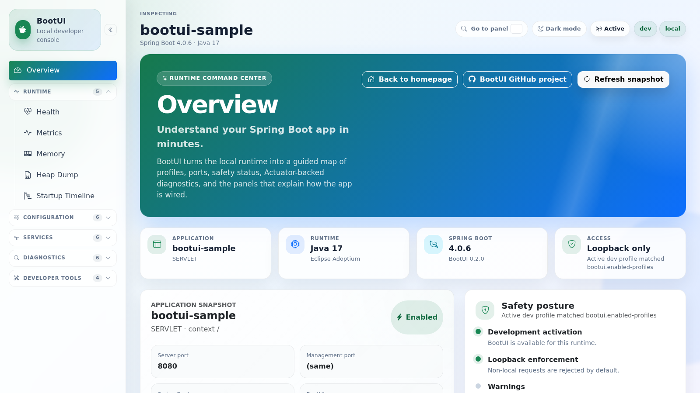

# BootUI

[](https://github.com/jdubois/boot-ui/actions/workflows/build.yml)
[](https://github.com/jdubois/boot-ui/actions/workflows/codeql.yml)
[](LICENSE)
[](https://spring.io/projects/spring-boot)
[](https://openjdk.org/projects/jdk/25/)

BootUI is a **Spring Boot 4 starter** that adds an embedded, local-only developer console to your application.

It is served by the host application at `/bootui/`, uses internal `/bootui/api/**` endpoints, and packages the browser
UI into the starter so consuming applications do not need Node.js or npm.



## Features

BootUI exposes these panels in the same grouped order as the application menu. See the
[feature details guide](docs/FEATURES.md) for explanations and screenshots for every panel.

| Group           | Feature                                                                 | What it helps with                                                                                                                      |
| --------------- | ----------------------------------------------------------------------- | --------------------------------------------------------------------------------------------------------------------------------------- |
| Overview        | [Overview](docs/FEATURES.md#overview)                                   | See runtime identity, versions, ports, active profiles, activation reason, and safety state.                                            |
| Runtime         | [Health](docs/FEATURES.md#health)                                       | Explore the Actuator health tree and contributor details, with setup guidance when health is unavailable or only defaults are reported. |
| Runtime         | [Metrics](docs/FEATURES.md#metrics)                                     | Browse Micrometer meters, tags, measurements, and a local live chart for selected metrics.                                              |
| Runtime         | [Memory](docs/FEATURES.md#memory)                                       | Review live JVM heap, non-heap, and memory pool usage.                                                                                  |
| Runtime         | [Tuning Advisor](docs/FEATURES.md#tuning-advisor)                       | Calculate fixed bare-metal JVM options, percentage-based Kubernetes JVM settings, probes, and detected virtual-thread sizing from live JVM context. |
| Runtime         | [Heap Dump](docs/FEATURES.md#heap-dump)                                 | Capture local JVM heap dumps on demand and analyze a value-free class histogram of memory usage.                                        |
| Runtime         | [Startup Timeline](docs/FEATURES.md#startup-timeline)                   | Inspect Spring Boot startup steps and durations when startup data is available.                                                         |
| Configuration   | [Configuration](docs/FEATURES.md#configuration)                         | Inspect effective configuration values, metadata, masking, and local runtime overrides.                                                 |
| Configuration   | [Profile Diff](docs/FEATURES.md#profile-diff)                           | Compare profile-specific property sources and values while preserving secret masking.                                                   |
| Configuration   | [Loggers](docs/FEATURES.md#loggers)                                     | Inspect and change logger levels at runtime through the Actuator loggers endpoint.                                                      |
| Configuration   | [Beans](docs/FEATURES.md#beans)                                         | Search Spring beans by name, type, and BootUI classification with server-side paging.                                                   |
| Configuration   | [Conditions](docs/FEATURES.md#conditions)                               | Understand why auto-configuration classes matched, did not match, or were unconditional.                                                |
| Configuration   | [Mappings](docs/FEATURES.md#mappings)                                   | Review HTTP routes, handlers, methods, patterns, and produces/consumes metadata.                                                        |
| Services        | [Scheduled Tasks](docs/FEATURES.md#scheduled-tasks)                     | View registered scheduled tasks and their trigger metadata.                                                                             |
| Services        | [Database Connection Pools](docs/FEATURES.md#database-connection-pools) | Watch database pool sizing, masked JDBC metadata, and live active/idle/total/pending saturation.                                        |
| Services        | [Spring Data](docs/FEATURES.md#spring-data)                             | Explore Spring Data repositories, domain types, IDs, and query methods.                                                                 |
| Services        | [Cache](docs/FEATURES.md#cache)                                         | Inspect Spring Cache managers, caches, metrics, annotations, and confirmed clear actions.                                               |
| Services        | [Security](docs/FEATURES.md#security)                                   | Inspect Spring Security filter chains and best-effort endpoint rule explanations.                                                       |
| Services        | [AI Usage](docs/FEATURES.md#ai-usage)                                   | Summarize Spring AI and LangChain4j chat conversations, token usage, latency, and model details from OpenTelemetry spans.               |
| Diagnostics     | [Traces](docs/FEATURES.md#traces)                                       | Inspect local spans captured automatically by the starter, plus OTLP spans from cooperating services.                                   |
| Diagnostics     | [Log Tail](docs/FEATURES.md#log-tail)                                   | Read recent application logs and stream new local log events from the running process.                                                  |
| Diagnostics     | [HTTP Probe](docs/FEATURES.md#http-probe)                               | Send local-only HTTP requests to the app and inspect response status, headers, and body.                                                |
| Diagnostics     | [Architecture](docs/FEATURES.md#architecture)                           | Run a curated, zero-config ArchUnit ruleset against the host app's own classes for architecture hygiene.                                |
| Diagnostics     | [Pentesting](docs/FEATURES.md#pentesting)                               | Run explicit host-app OWASP Top 10 2025 hygiene checks without testing BootUI paths or sending exploit payloads.                        |
| Diagnostics     | [Vulnerabilities](docs/FEATURES.md#vulnerabilities)                     | Review dependency inventory and severity-ordered local OSV vulnerability scan results.                                                  |
| Developer tools | [DevTools](docs/FEATURES.md#devtools)                                   | Check Spring Boot DevTools status, LiveReload availability, and restart controls.                                                       |
| Developer tools | [Dev Services](docs/FEATURES.md#dev-services)                           | Inspect Docker Compose snapshots, safe Testcontainers beans, service connection metadata, and bounded logs.                             |
| Developer tools | [Copilot](docs/FEATURES.md#copilot)                                     | Dashboard sanitized local GitHub Copilot CLI sessions: activity trends, tool mix, MCP, hooks, skills, errors.                           |
| Developer tools | [Claude Code](docs/FEATURES.md#claude-code)                             | Dashboard sanitized local Claude Code project logs: activity trends, tool mix, models, and failures.                                    |

Some panels depend on optional Spring, Actuator, or development infrastructure. When data is unavailable, BootUI returns
stable empty responses or shows an explanatory empty state. The sidebar also moves unavailable non-overview panels into
a collapsed Disabled / unavailable group, and opening a dimmed panel shows the unavailable reason at the top of the page.

## Setup

### 1) Prerequisites

- Java 17 or later
- Spring Boot 4.x application
- Maven or your application's Maven Wrapper

### 2) Add the starter dependency

```xml
<dependency>
  <groupId>com.julien-dubois.bootui</groupId>
  <artifactId>bootui-spring-boot-starter</artifactId>
  <version>0.2.0</version>
</dependency>
```

### 3) Run your app in development mode

```bash
./mvnw spring-boot:run -Dspring-boot.run.profiles=dev
```

BootUI also activates automatically when `spring-boot-devtools` is on the classpath. To force it on or off:

```properties
bootui.enabled=AUTO
bootui.enabled=ON
bootui.enabled=OFF
```

`prod` and `production` profiles disable BootUI unless `bootui.enabled=ON` is set. Invalid `bootui.enabled` values fail
closed and keep BootUI disabled.

### 4) Open BootUI

Visit: <http://localhost:8080/bootui>

## Configuration and safety

BootUI is intended for local development only. By default it:

- activates in `AUTO` mode only for `dev` / `local` profiles or DevTools
- rejects non-loopback requests
- permits `/bootui/**` through Spring Security when Spring Security is present, with a startup warning, so the local
  console remains directly reachable while the loopback-only filter still applies
- masks secret-like configuration values
- exposes the local Actuator endpoints used by BootUI panels when BootUI is active
- captures local application spans for the Traces panel when telemetry and the panel are enabled
- disables itself for `prod` / `production` profiles
- stores runtime configuration overrides in `.bootui/application-bootui.properties`, not in your source config files

Every visible panel can be disabled with `bootui.panels.<panel-id>.enabled=false`. Panels with mutating browser actions
can also be made read-only with `bootui.panels.<panel-id>.read-only=true`, and `bootui.read-only=true` makes the whole
BootUI application read-only. See the [property reference](docs/PROPERTIES.md) for the full panel list.

Common properties:

| Property                                 | Default                                 | Description                                                                              |
| ---------------------------------------- | --------------------------------------- | ---------------------------------------------------------------------------------------- |
| `bootui.enabled`                         | `AUTO`                                  | `AUTO`, `ON`, or `OFF`.                                                                  |
| `bootui.enabled-profiles`                | `dev,local`                             | Profiles that activate BootUI in auto mode.                                              |
| `bootui.disabled-profiles`               | `prod,production`                       | Profiles that disable BootUI unless forced on.                                           |
| `bootui.allow-non-localhost`             | `false`                                 | Explicit opt-out of loopback-only protection.                                            |
| `bootui.expose-values`                   | `MASKED`                                | `MASKED`, `METADATA_ONLY`, or `FULL`; `FULL` can disclose secrets and should stay local. |
| `bootui.read-only`                       | `false`                                 | Disable all browser-triggered actions while keeping read-only panel data visible.        |
| `bootui.overrides-file`                  | `.bootui/application-bootui.properties` | Runtime override persistence file.                                                       |
| `bootui.startup.enabled`                 | `true`                                  | Auto-install startup buffering for the Startup Timeline panel while BootUI is active.    |
| `bootui.startup.capacity`                | `4096`                                  | Maximum startup steps retained by BootUI's auto-installed startup buffer.                |
| `bootui.cache.clear-enabled`             | `true`                                  | Enables Spring Cache clear actions after explicit browser confirmation.                  |
| `bootui.dev-services.restart-enabled`    | `false`                                 | Enables restart controls for bean-backed Testcontainers services. Disabled by default.   |
| `bootui.dev-services.log-tail-bytes`     | `65536`                                 | Maximum bytes returned by one Dev Services log request.                                  |
| `bootui.telemetry.enabled`               | `true`                                  | Enables local in-memory trace capture and the OTLP receiver used by Traces and AI Usage. |
| `bootui.copilot.enabled`                 | `AUTO`                                  | Enable the Copilot panel. `AUTO` activates when `~/.copilot/session-state/` exists.      |
| `bootui.copilot.session-state-dir`       | `~/.copilot/session-state`              | Directory scanned for Copilot CLI session directories and `events.jsonl` files.          |
| `bootui.copilot.max-sessions`            | `100`                                   | Maximum recent sessions returned by the Copilot session explorer.                        |
| `bootui.copilot.max-parsed-sessions`     | `100`                                   | Maximum recent Copilot session files parsed and retained in memory.                      |
| `bootui.copilot.allow-raw-reveal`        | `true`                                  | When `false`, the opt-in raw-event reveal endpoint returns 404 even on loopback.         |
| `bootui.claude-code.enabled`             | `AUTO`                                  | Enable the Claude Code panel. `AUTO` activates when `~/.claude/projects/` exists.        |
| `bootui.claude-code.session-state-dir`   | `~/.claude/projects`                    | Directory scanned for Claude Code project JSONL logs.                                    |
| `bootui.claude-code.max-sessions`        | `100`                                   | Maximum recent sessions returned by the Claude Code session explorer.                    |
| `bootui.claude-code.max-parsed-sessions` | `100`                                   | Maximum recent Claude Code JSONL files parsed and retained in memory.                    |
| `bootui.claude-code.allow-raw-reveal`    | `false`                                 | Explicitly enable raw JSONL reveal; raw Claude Code logs can include prompts and output. |

## Runtime overrides

The Configuration panel can create, update, and delete local runtime overrides. Overrides are stored in
`.bootui/application-bootui.properties` by default, loaded at high precedence on the next startup, and never modify your
application source configuration. Already-bound `@ConfigurationProperties` beans may keep their previous value until the
app restarts; BootUI returns that warning with every override mutation.

## Troubleshooting

| Symptom                      | Check                                                                                                                                   |
| ---------------------------- | --------------------------------------------------------------------------------------------------------------------------------------- |
| `/bootui` returns 404        | Use the `dev` or `local` profile, add DevTools, or set `bootui.enabled=ON`.                                                             |
| BootUI is disabled in `prod` | This is intentional; only `bootui.enabled=ON` can force activation with a disabled profile.                                             |
| Browser is rejected          | BootUI accepts loopback callers by default. Use `bootui.allow-non-localhost=true` only for a trusted local network.                     |
| Spring Security blocks UI    | BootUI auto-registers a `/bootui/**` permit-all chain when Spring Security is active; check for a custom higher-priority chain.         |
| A panel is empty             | Enable the relevant Actuator endpoint or optional Spring module; BootUI degrades to stable empty DTOs when data is unavailable.         |
| Startup Timeline is empty    | Leave `bootui.startup.enabled=true` and `bootui.startup.capacity` greater than zero, or provide your own `BufferingApplicationStartup`. |
| Secrets are hidden           | Default exposure is `MASKED`; use `METADATA_ONLY` to hide all values or `FULL` only in trusted local sessions.                          |

## Repository modules

- `bootui-spring-boot-starter`: dependency to add to your app
- `bootui-autoconfigure`: Spring Boot auto-configuration
- `bootui-ui`: Vue 3 frontend packaged into the starter
- `bootui-core`: shared DTOs and core helpers
- `bootui-sample-app`: demo and integration sample app

## More docs

- [Feature details](docs/FEATURES.md): panel-by-panel guide with screenshots
- [Property reference](docs/PROPERTIES.md): global, per-panel, and action-gating configuration properties
- [Sample app walkthrough](bootui-sample-app/README.md): the demo app behind the screenshots and Playwright suite
- [CHANGELOG.md](CHANGELOG.md): release notes
- [CONTRIBUTING.md](CONTRIBUTING.md): contributor workflow, build, test, and publishing instructions
- [SECURITY.md](SECURITY.md): threat model and security policy
- [docs/SPECIFICATION.md](docs/SPECIFICATION.md): full product and technical specification
- [docs/PLAN.md](docs/PLAN.md): implementation roadmap

## License

Licensed under the [Apache License, Version 2.0](LICENSE).
