# BootUI feature details

BootUI panels are documented here in the same order as the application menu. When a panel's backing infrastructure is
missing, the sidebar keeps the route visible but dims it so you can tell at a glance that the panel has no live data for
the current application. Opening a dimmed panel also shows the unavailable reason at the top of the page.

## Overview

The Overview panel gives a fast summary of the running application: application name, Spring Boot version, Java version,
active profiles, web type, ports, startup duration when available, activation reason, and local safety state. It is the
first place to confirm whether BootUI is active for the reason you expect.

## Startup Timeline

The Startup Timeline panel visualizes Spring Boot startup steps from Actuator startup data. It helps identify expensive
startup phases, slow bean initialization, and the overall application startup shape. If the host app does not expose
startup data, the panel shows an empty state instead of failing.

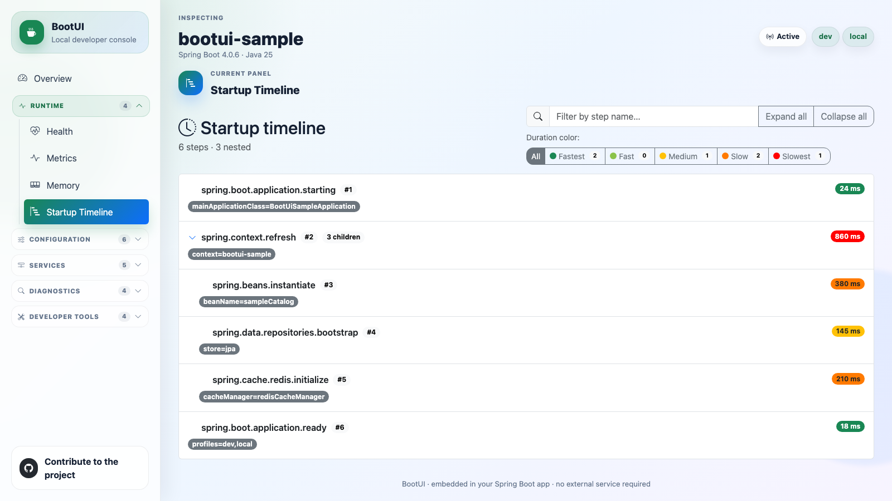

## Memory

The Memory panel summarizes JVM heap and non-heap usage, memory pools, garbage collectors, and selected runtime memory
settings. It also suggests JVM options that are useful during local development when memory pressure or startup behavior
needs tuning.

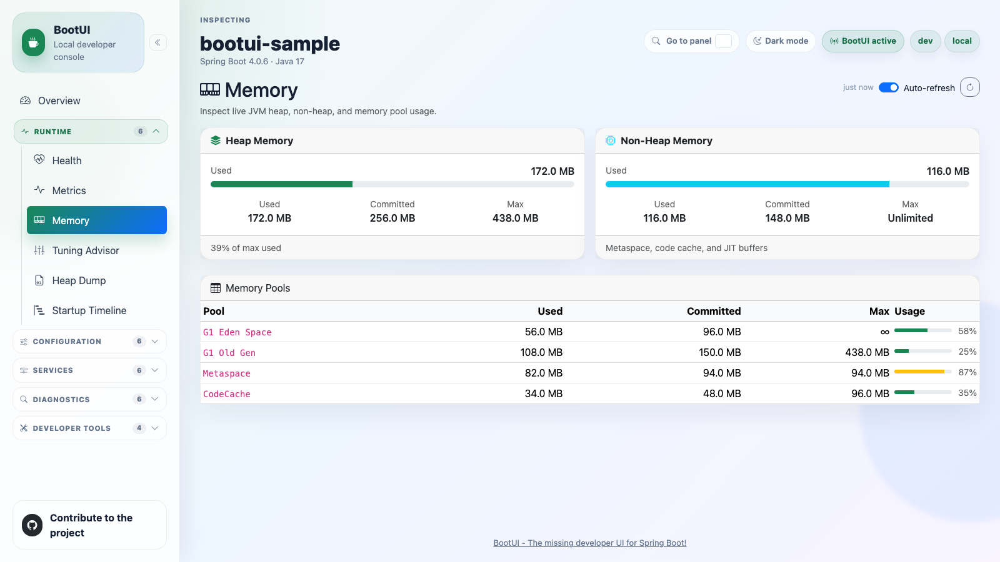

## Health

The Health panel displays the Actuator health tree, including nested contributors and detailed status information when
the host app exposes it. It keeps unavailable health data separate from unhealthy application state so missing Actuator
infrastructure is clear.

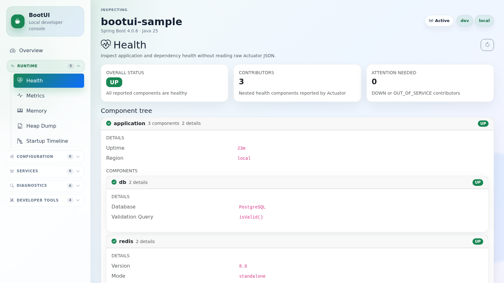

## Metrics

The Metrics panel browses Micrometer meters exposed by Actuator. You can inspect meter descriptions, base units, tags,
available measurements, and render a local live chart for a selected metric/tag combination.

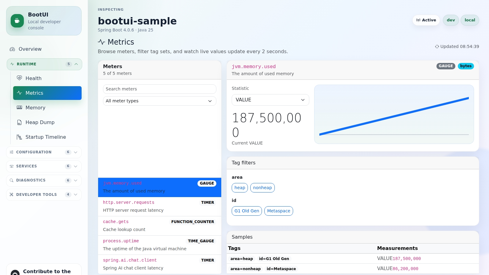

## Conditions

The Conditions panel explains Spring Boot auto-configuration decisions. It groups positive matches, negative matches,
and unconditional classes so you can see why an auto-configuration applied or why it was skipped. Large condition reports
load in bounded pages, and filtering runs on the server so the browser does not need the full report before narrowing
results.

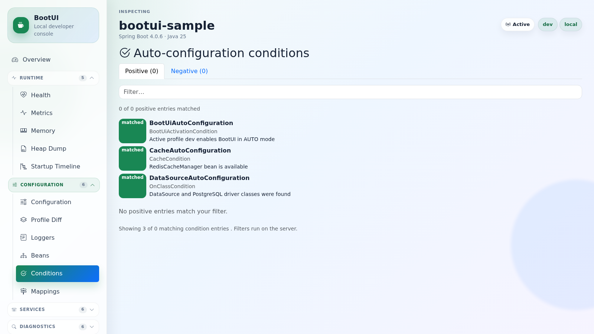

## Beans

The Beans panel helps answer which Spring beans exist and where they came from. It supports server-side search across
bean names and types, plus BootUI classifications such as application, BootUI, Spring framework, Java/Jakarta, and other
beans. Large bean lists load in bounded pages so the initial payload stays small while filters still apply to the full
bean set.

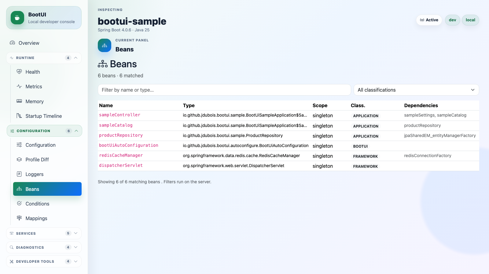

## Mappings

The Mappings panel lists HTTP routes from Actuator mappings data. It shows request methods, path patterns, handlers, and
produces/consumes metadata so the running application's web surface is visible without reading controllers manually.
Large mapping lists load through a stable, paged BootUI DTO, and the filter continues to search every discovered route
on the server.

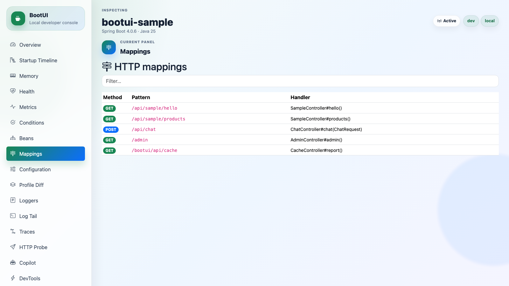

## Configuration

The Configuration panel shows effective configuration properties, sources, metadata descriptions, defaults when known,
active profiles, and masked values. It can create, update, and delete local runtime overrides persisted to
`.bootui/application-bootui.properties`, with restart and rebinding caveats shown for every mutation. Large property
tables load in bounded server-side pages for search, source, and override-only filters. The override property-name
picker limits its datalist suggestions while narrowing against the full metadata catalog as you type.

## Profile Diff

The Profile Diff panel compares profile-specific property sources and values. It is useful for understanding what
changes between local development profiles while still routing browser-visible names and values through BootUI's secret
masking rules.

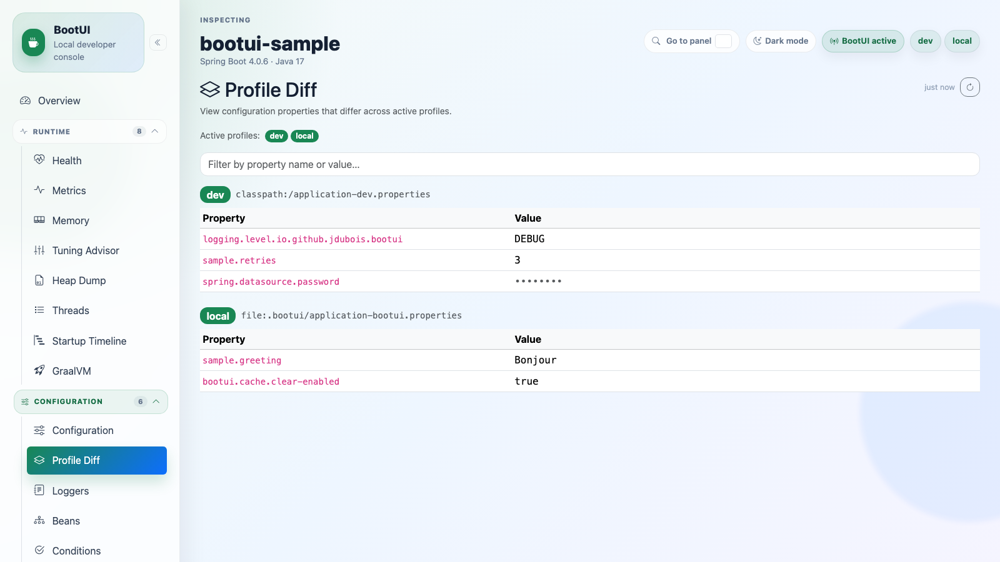

## Loggers

The Loggers panel lists runtime logger configuration from Actuator. It shows configured and effective levels, supports
server-side search, and can update or clear logger levels without restarting the application. Large logger lists load in
bounded pages while filtering still searches the full logger set.

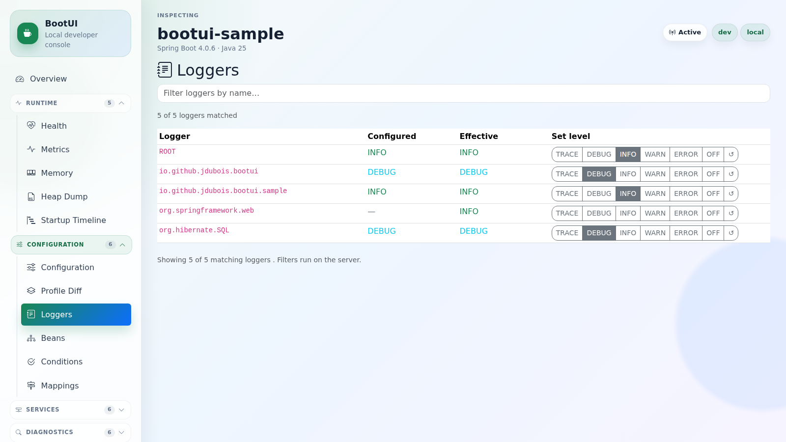

## Log Tail

The Log Tail panel reads recent local application logs and streams new log events from the running process. It is
intended for quick local diagnosis without leaving the BootUI console.

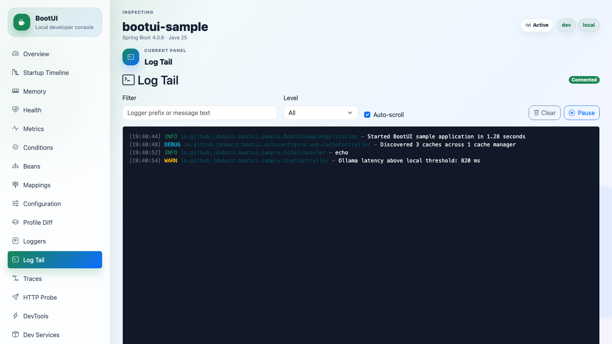

## Traces

The Traces panel shows distributed tracing spans collected by BootUI's embedded OTLP/HTTP receiver at
`/bootui/api/otlp/v1/traces`. Any Spring Boot service that uses Micrometer Tracing with the OpenTelemetry bridge —
including the host application itself when self-tracing is enabled — can export to this endpoint and have its traces
appear here. The list shows the most recent traces with service name, root span name, status, duration, and span count;
opening a trace renders a waterfall view of its spans so you can see latency contributions, errors, and parent/child
relationships across services. Spans emitted by BootUI's own API are filtered out by default to keep the view focused on
application traffic; this can be tuned with `bootui.telemetry.exclude-self-spans=false`. When
`bootui.telemetry.enabled=false`, the sidebar dims the panel and the view shows a disabled state instead of implying
that tracing is merely empty. The in-memory trace buffer is bounded by `bootui.telemetry.max-traces`,
`bootui.telemetry.max-spans-per-trace`, request-size limits, and attribute-value truncation, with additional internal
caps to keep misconfigured local exporters from overflowing the UI. Trace data is reset on application restart or via
the panel's clear action.

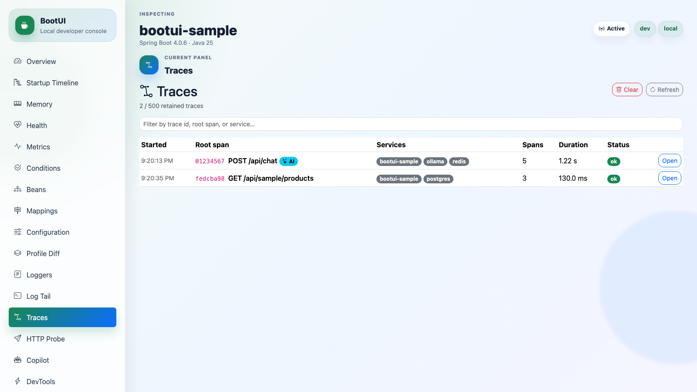

## HTTP Probe

The HTTP Probe panel sends local-only requests to the running application and displays response status, headers,
duration, and body. It is designed for quick route checks from inside the same local development context as BootUI.

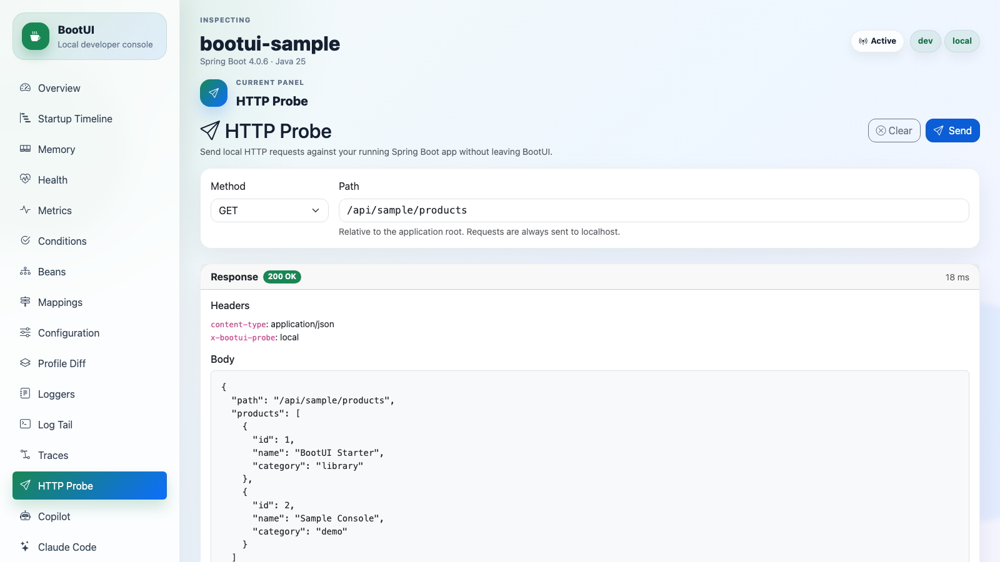

## Copilot

The Copilot panel surfaces sanitized signals from local
[GitHub Copilot CLI](https://github.com/github/copilot-cli) sessions. It reads the session directories and `events.jsonl`
files Copilot CLI writes under `~/.copilot/session-state/` (configurable via `bootui.copilot.session-state-dir`) and
aggregates recent activity into a clean dashboard: active sessions, total sanitized events, failures, 24-hour activity,
7-day activity, event category mix, top tools, model usage, and recent sessions. The session explorer remains available
for drilling into tool calls, edits, reads, searches, shell commands, web/docs lookups, MCP tool calls, hook callbacks,
skills, sub-agents, and ASK/intent/plan calls. To keep large local histories responsive, the session explorer returns the
most recent `bootui.copilot.max-sessions` sessions by default, and the activity charts can filter the explorer to sessions
active during a selected hour or day. Failure lists use retained failure events and include sanitized tool/type context.
Each event row shows only an allowlisted summary - raw prompts, tool arguments, command output, and diffs are deliberately
excluded. The per-event "Reveal raw" action is an explicit, local-only escape hatch that returns the source JSON; it can be disabled with
`bootui.copilot.allow-raw-reveal=false` and is also blocked when `bootui.expose-values=METADATA_ONLY`. The sidebar dims
the panel when no session-state directory is found. Data is read-only - BootUI never modifies anything under
`~/.copilot/`. The panel watches the directory through a Java NIO `WatchService` thread and pushes live updates via
Server-Sent Events. Inspired by
[copilot-mission-control](https://github.com/DanWahlin/copilot-mission-control), which pioneered this dashboarding of
Copilot CLI session state.

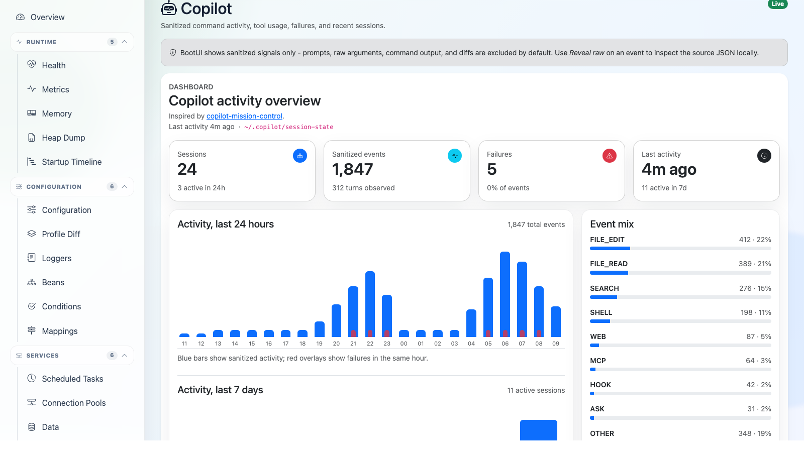

## Claude Code

The Claude Code panel mirrors the Copilot dashboard for local
[Claude Code](https://www.anthropic.com/claude-code) project logs. It reads JSONL session files under
`~/.claude/projects/` (configurable via `bootui.claude-code.session-state-dir`) and surfaces sanitized activity trends,
tool usage, model usage, failures, recent sessions, and per-session event drill-downs. BootUI treats Claude Code logs as
especially sensitive: prompts, assistant text, tool inputs, file contents, command output, and tool-result content are
excluded from normal responses. The raw JSONL reveal endpoint is disabled by default with
`bootui.claude-code.allow-raw-reveal=false`; enabling it is an explicit local-only escape hatch and is still blocked when
`bootui.expose-values=METADATA_ONLY`. The sidebar dims the panel when no Claude Code projects directory is found. Data is
read-only - BootUI never modifies anything under `~/.claude/`. Because Claude Code writes sessions inside per-project
subdirectories, BootUI refreshes this panel through bounded polling rather than relying on root-directory file-system
events.

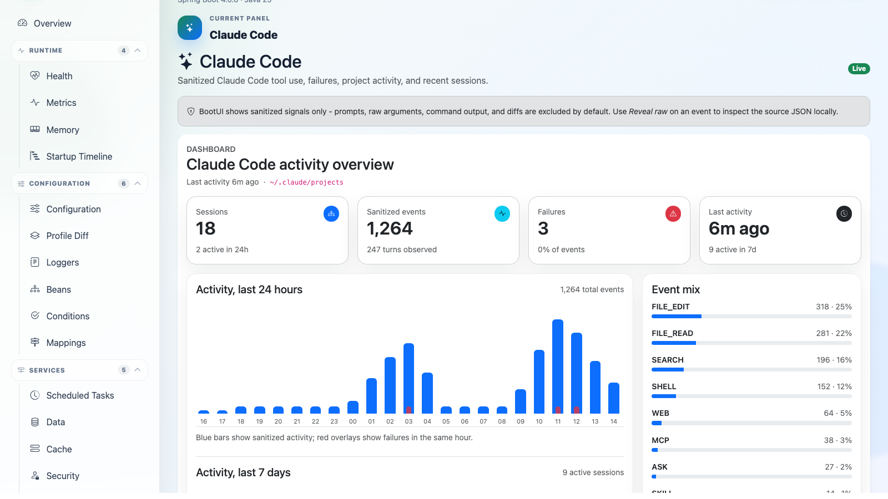

## DevTools

The DevTools panel reports Spring Boot DevTools availability, LiveReload status, and restart support. Restart actions
are shown only when available and require explicit confirmation before execution.

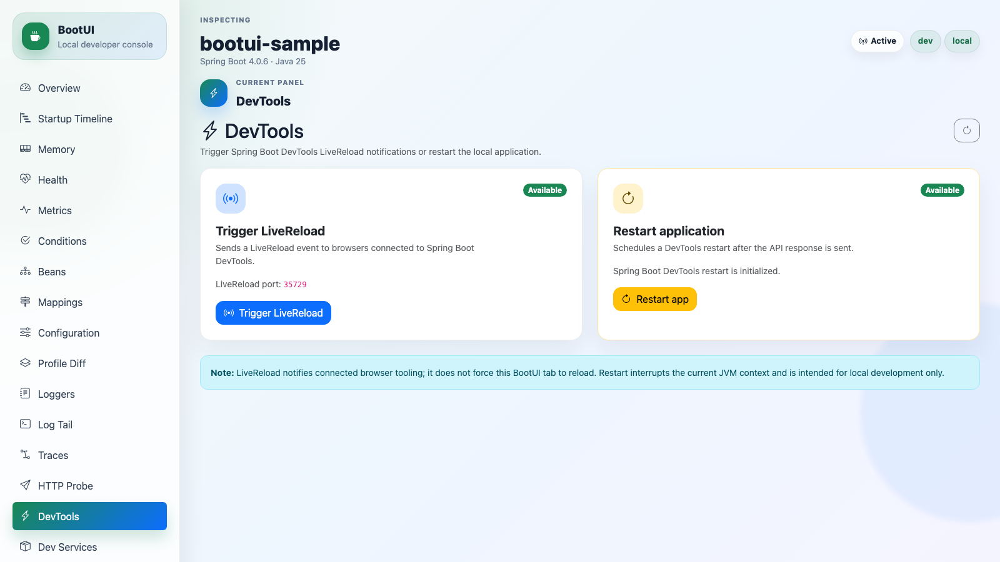

## Dev Services

The Dev Services panel surfaces local development services discovered from Docker Compose snapshots, Testcontainers
beans, and service connection metadata. It masks sensitive connection information, can show bounded logs for supported
services, and shows restart controls only for supported Testcontainers services when
`bootui.dev-services.restart-enabled=true`. To keep opening the panel side-effect free, BootUI skips lazy,
prototype, or otherwise uninitialized service beans that would need to be created just for inspection and reports those
skips as warnings in the panel.

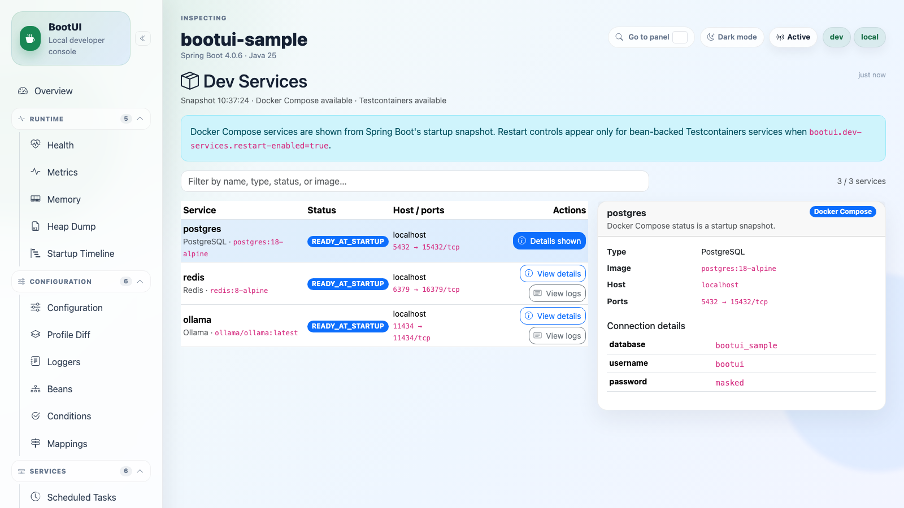

## Scheduled Tasks

The Scheduled Tasks panel lists scheduled jobs registered with Spring scheduling infrastructure. It shows task type and
trigger metadata so background activity is visible during local development.

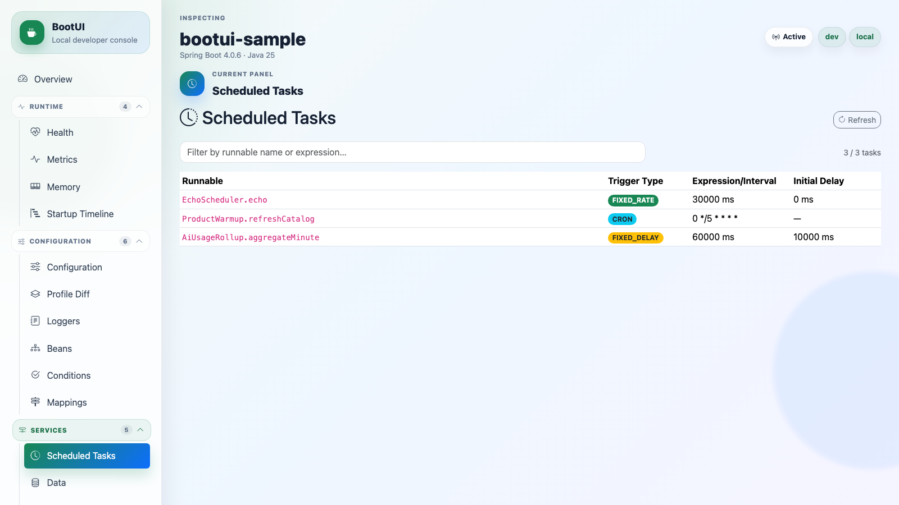

## Data

The Data panel inspects Spring Data repositories. It shows repository interfaces, domain types, ID types, and query
methods, and degrades to a clear empty state when Spring Data is not present or no repositories are registered.

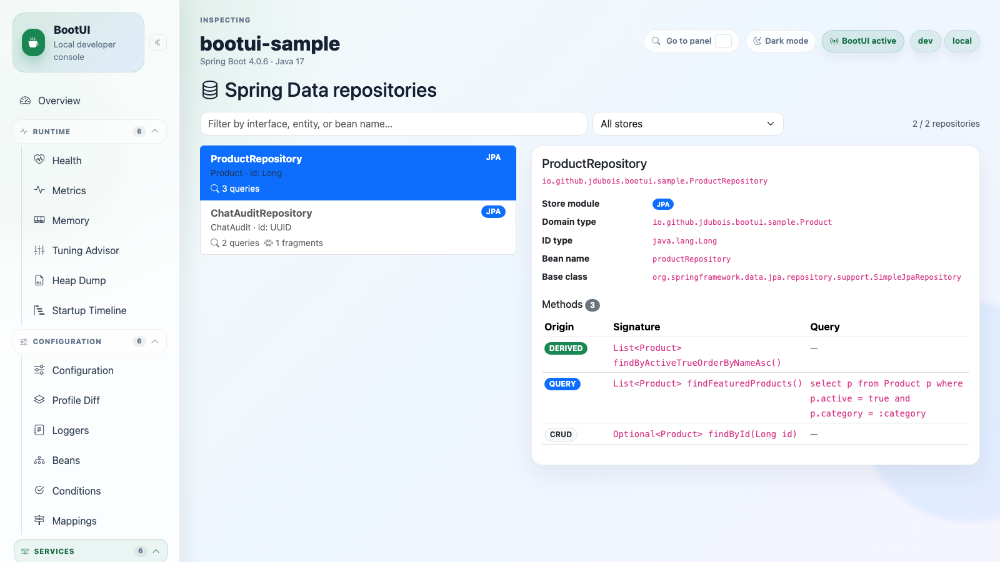

## Cache

The Cache panel inspects Spring Cache infrastructure. It lists cache manager beans, known caches, native
implementations, safe local sizes, Micrometer cache metrics when registered, and discovered `@Cacheable`, `@CachePut`,
and `@CacheEvict` operations. Cache clear actions are enabled by default for local development, require explicit browser
confirmation, and can be disabled with `bootui.cache.clear-enabled=false`.

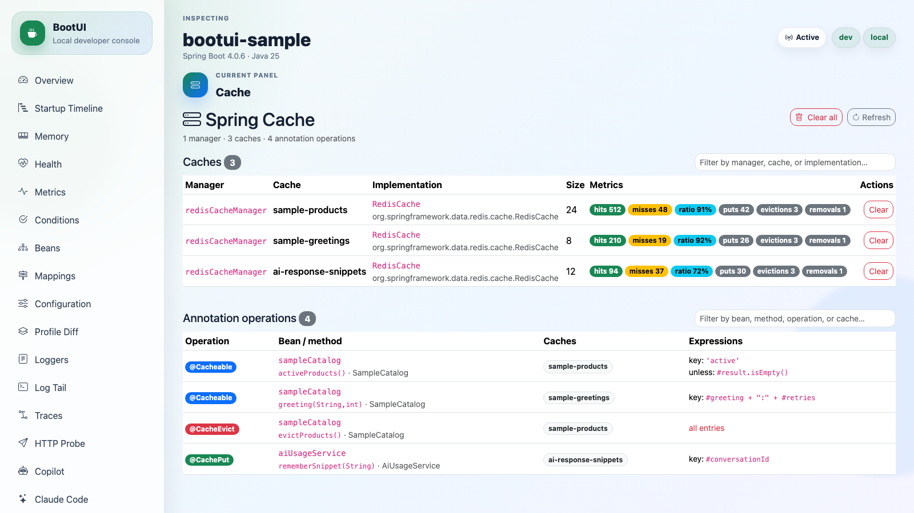

## AI Usage

The AI Usage panel summarizes Spring AI activity collected from OpenTelemetry spans emitted by Spring AI's built-in
observability. It groups chat client and chat model spans by conversation so you can see request count, token usage (
prompt, completion, total), latency, model, and the prompt/response snippet when Spring AI is configured to capture
content (`spring.ai.chat.client.observations.log-prompt`, `spring.ai.chat.observations.log-prompt`,
`spring.ai.chat.observations.log-completion`). A small inline chart shows total token usage over recent calls so you can
spot expensive interactions during local development. Vector store and embedding spans appear alongside chat spans when
present. The sidebar dims the panel when telemetry is disabled or Spring AI is not on the classpath, and the view
explains the unavailable state. When both prerequisites are ready but no chat spans have arrived yet, the panel shows a
ready empty state rather than setup guidance. Recent chats, model breakdowns, token-series windows, spans, and attributes
are bounded so large local runs stay responsive. As with the Traces panel, data is sourced from the embedded OTLP
receiver, is in-memory only, and is cleared on restart.

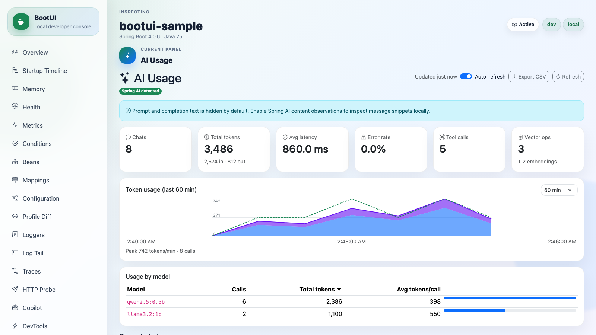

## Security

The Security panel inspects Spring Security filter chains and provides best-effort endpoint rule explanations. It is
meant to explain local security wiring without exposing credentials or replacing a full security audit.

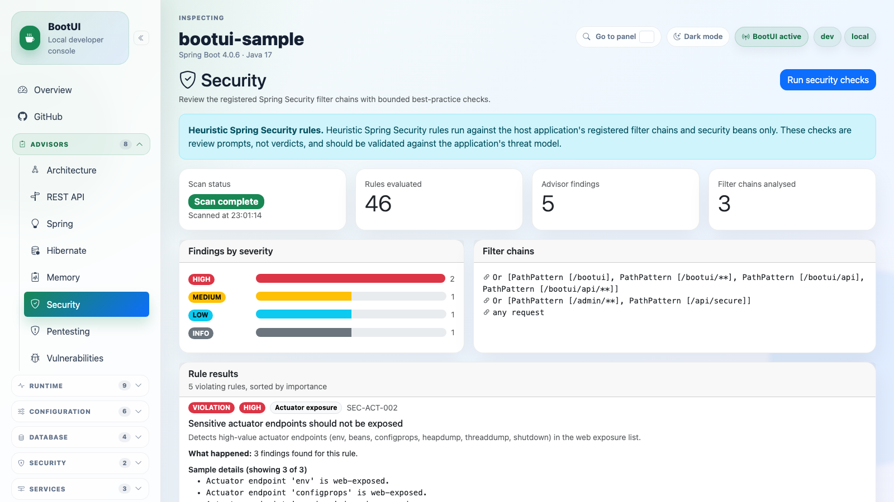

## Vulnerabilities

The Vulnerabilities panel shows dependency inventory and local OSV vulnerability scan results. It helps identify known
vulnerable dependencies from the running project's dependency set during the local development loop.

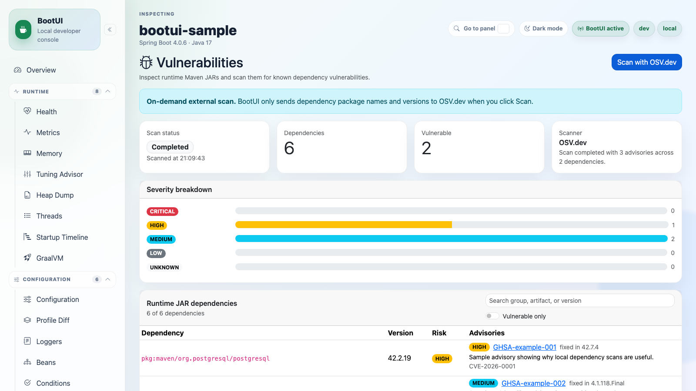
