# BootUI feature details

BootUI panels are documented here in the same grouped order as the application menu. When a panel's backing
infrastructure is missing, the sidebar moves non-overview panels into the collapsed Disabled / unavailable group so you
can tell at a glance which panels have no live data for the current application. Opening a dimmed panel also shows the
unavailable reason at the top of the page.

Every visible panel can be hidden with `bootui.panels.<panel-id>.enabled=false`. Panels with browser-triggered actions
also support `bootui.panels.<panel-id>.read-only=true`, and `bootui.read-only=true` makes the whole BootUI application
read-only. The complete list is in the [property reference](PROPERTIES.md).

Monitoring-oriented panels hide BootUI's own runtime data by default so Beans, Conditions, Mappings, Loggers, Metrics,
Startup Timeline, Scheduled Tasks, Spring Cache, Spring Security, Security Logs, and Traces stay focused on the host
application. Set
`bootui.monitoring.exclude-self=false` to include BootUI internals while debugging the console itself.

## Overview

The Overview panel is the BootUI landing page and acts as a guided "understand your app in minutes" dashboard rather than
a static summary. It opens with a hero banner and quick links to the running application's homepage and the BootUI GitHub
project.

Below the hero is an on-demand security & health scoring dashboard. An overall score out of 100 summarizes the
application's posture, with a qualitative band (Good at 80+, Needs attention at 50+, At risk below 50) and a breakdown of
how much each scanner deducted from a perfect score. A single "Run all scanners" button triggers every available scanner,
or each scanner card can be run individually.

Each scanner card shows its own 0–100 score, status, and severity counts. The severity-based scanners are Architecture, Memory,
REST API, Spring, Hibernate, Security, Pentesting, and Vulnerabilities; scores start at 100
and subtract a fixed weighted
penalty per finding (critical 25, high 10, medium 3, low 1), so a clean scan stays at 100. The GitHub card is not a
severity scanner: it connects to the local repository and, only when the credential is connected and authenticated,
contributes a score derived from open security alerts. The overall score is the mean of the scanners that were actually
scored, and only scanners whose panels are available for the current application are shown, so the dashboard degrades
gracefully when optional infrastructure is missing.


## Live Activity

The Live Activity panel is the diagnostics "home base": a single reverse-chronological stream of everything the
application just did, plus a per-request profiler for drilling into any single request. It does not add any new
instrumentation — instead it reuses BootUI's existing in-memory signal buffers by calling the same controllers that back
the HTTP Exchanges, SQL Trace, Exceptions, and Security Logs panels, so every value is already masked, self-filtered, and
bounded exactly as those panels are.

The stream merges four signal types into one feed: requests (`REQUEST`), SQL statements (`SQL`), exceptions
(`EXCEPTION`), and security events (`SECURITY`). Each row carries a timestamp, a type icon, a colour-coded severity
(`OK`, `SLOW`, `WARN`, `ERROR`), a one-line summary, and a duration where applicable; failed rows are highlighted and
slow requests are tinted on a graduated yellow-to-red heat scale (crossing 100, 200, 500, and 1000 ms) with a matching
latency badge so you can see at a glance *how* slow a request was, adjacent identical entries are collapsed with an
occurrence count to cut noise, and the feed can be narrowed
by type, severity, a free-text needle (path, status, SQL, or exception class), and an **errors-only** quick toggle — the
chosen filters are persisted in the browser so they survive a reload. A small **requests-over-time** sparkline above the
table makes spikes and error bursts (drawn in red) visible at a glance. A KPI strip across the top summarises requests per
minute, error rate, p50/p95 latency, SQL rate, the slowest recent endpoint, active exception count, health status, and
heap usage computed from the same buffers (sub-millisecond SQL is shown as `<1 ms`). Several KPI cards are themselves
launchpads: the slowest-endpoint card opens **HTTP Exchanges** pre-filtered to that endpoint, while the
active-exceptions, health, and heap-usage cards jump to the **Exceptions**, **Health**, and **Heap Dump** panels
respectively. Because the merged feed is genuinely event-driven, it refreshes over **Server-Sent Events** instead of
fixed-interval polling: the browser subscribes to
`/bootui/api/activity/stream` and re-fetches whenever any source signals a change (a new request, SQL statement,
exception, or security event), and the feed can be paused and resumed so a row you are inspecting does not scroll away.
When the feed is unfiltered, correlated signals are **nested chronologically under the request that produced them**: the
SQL statements, exceptions, and security events that BootUI can pin precisely to a request — by trace id, by the
request's serving thread, or by request method and path — are folded into a collapsible group beneath that request row
(expanded by default), so one click reveals exactly what a single request did, in order. Requests that triggered a
security event are flagged as **authenticated** — a lock icon plus a grey pill naming the caller's principal — so a
secured call and who made it are obvious without opening the profiler, and the nested child rows are shaded a distinct
grey so they read clearly as belonging to the request above them. Signals that cannot be tied to a
request stay top-level, and applying any filter or free-text search flattens the feed again so the query spans every
signal.

Every row is also a launchpad: clicking anywhere on a request row opens its profiler, and each row carries a deep link
that jumps to the dedicated panel with the originating record pre-filtered — requests open in **HTTP Exchanges**, SQL in
**SQL Trace**, and exceptions in **Exceptions**. The per-request profiler drawer is a Symfony-style view that correlates
that single request's signals using a tiered join that degrades gracefully and never fabricates data: the distributed
trace is matched by trace id, exceptions are matched by request method, path, and time window — and, when the
request's serving thread is uniquely known, further disambiguated by that thread so a concurrent identical request
cannot steal the occurrence — security audit events are
matched by time window and the request principal (so an `AUTHENTICATION_SUCCESS` or `AUTHORIZATION_FAILURE` raised while
serving a secured endpoint is linked to that very request) — and, like SQL, are pinned **exactly to the request's
serving thread** when BootUI captured the audit event on it, so two concurrent requests sharing a principal no longer
trade security events; an event proven to have fired on another thread is excluded and an on-thread one is badged
**exact**. SQL is matched
**exactly by trace id** when Micrometer Tracing is present (BootUI threads the active `traceId` from the SLF4J MDC onto
each captured statement). When no trace id is available — the common local-dev case — SQL is still matched **exactly by
the request's serving thread** within its handling window: a servlet request runs start-to-finish on one worker thread
that serves only one request at a time, so statements on that thread are unambiguously its own. Only when the serving
thread cannot be uniquely identified (for example two genuinely concurrent identical requests, or SQL run on an async
thread) does SQL fall back to a time-window heuristic, which is then clearly labelled **approximate** in the drawer;
identical repeated `SELECT`s above
`bootui.activity.n-plus-one-threshold` are flagged as a potential N+1. The drawer also shows the request's timing
breakdown (time spent in SQL versus the rest), its auth/principal context, and the trace span list, can be dismissed with
the **Escape** key (with focus trapped inside while open), and offers a **Copy profile** action that exports the
already-masked correlated timeline (request + SQL + exceptions + security events) as plain text to paste straight into a
bug report.

The panel is read-only and inherits BootUI's full safety model (loopback filter, Host allow-list, cross-site write
defenses, value masking). The stream is capped by `bootui.activity.max-entries`, the slow-request threshold is
`bootui.activity.request-slow-threshold-ms`, and individual sources can be turned off through their existing
`bootui.panels.*` toggles (a disabled source simply drops out of the stream).

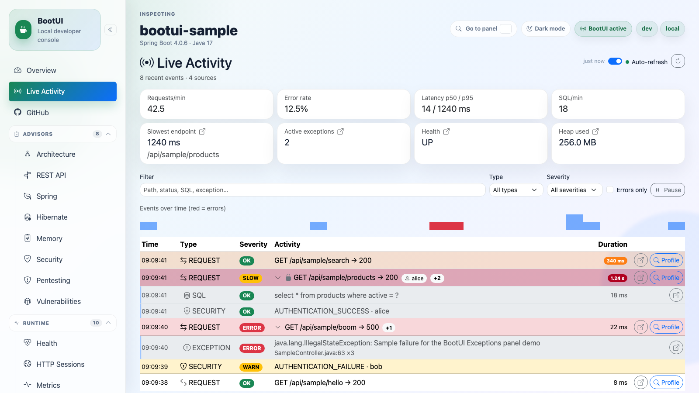

## GitHub

The GitHub panel sits in the Overview group and summarizes the current project's GitHub state from the local `origin`
remote. It uses BootUI's standard auto-refresh control with a one-minute interval while the tab is visible; the initial
refresh and each interval are bounded and blocked by the panel's read-only settings.

The panel shows repository metadata and an eight-card summary grid with click-through detail drawers for open pull
requests, open issues, the latest GitHub Actions executions, quotas, Copilot usage report availability, and the three
security signals. The open-issues drawer summarizes the label/staleness buckets and then lists the bounded set of open
issues returned by the refresh, linking each to its issue page with its author, labels, comment count, and last-updated
time (pull requests returned by the issues endpoint are excluded). GitHub Actions execution rows link to the matching
run, show the workflow, branch, event, status, and
duration, and mirror the recent-run list from the GitHub Actions page. The workflow failure count only considers the
latest execution for each workflow and branch, so older failures drop out once a later run fixes that workflow on that
branch; security signal drawers link to the matching GitHub alert pages.
The quota card shows the lowest remaining quota percentage with a red-to-green threshold palette. The quota drawer is
hidden by default, renders every resource returned by GitHub's `/rate_limit` response dynamically,
highlights resources with 10% or less remaining or at quota, then adds best-effort cards for repository or owner quotas
such as Actions cache, artifacts, and Actions billing when the credential can access those endpoints. Copilot usage uses
GitHub's organization report metadata endpoint when available; BootUI shows the report window and link count only, without
downloading or exposing signed report URLs.

Credentials are read from the current device only: `GITHUB_TOKEN`, `GH_TOKEN`, or an existing `gh auth token` login. The
token is never sent to the browser, persisted by BootUI, or included in warnings; without a token, public repositories use
GitHub's unauthenticated rate limits. Refreshes are bounded by per-request timeouts, a maximum API-call budget, and a quota
safety threshold that skips optional sections before exhausting the core API quota.

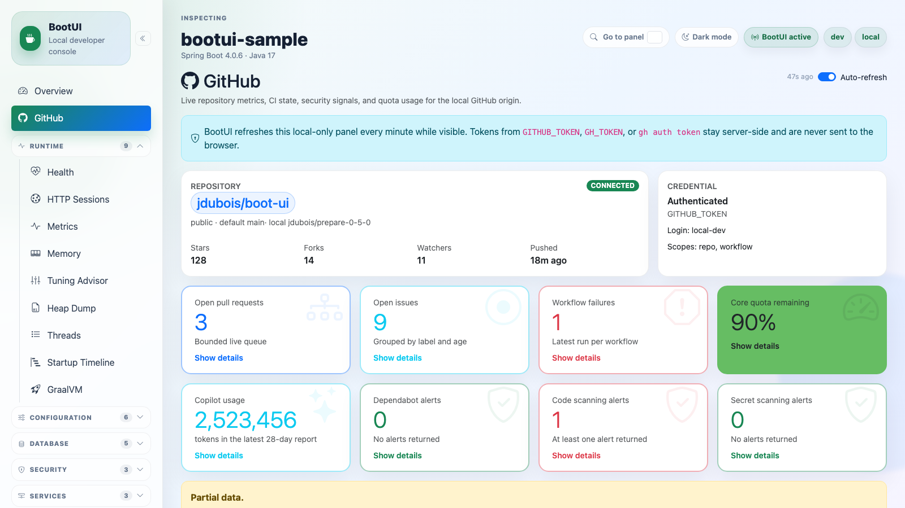

## Advisors

BootUI's advisors run explicit, on-demand rule-based scans and surface severity-ranked findings, feeding the weighted
score on the Overview dashboard. Each advisor inspects a different facet of the application — compiled architecture, the
REST layer, the live Spring context, persistence, JVM memory, and security posture — and is read-only. Once an advisor
has run, its panel shows the same 0–100 score the Overview computes for it (100 minus the weighted finding penalty), so
each panel and the dashboard always agree.

Every advisor finding can be **dismissed** when it does not apply to your project. Each rule result carries a _Dismiss_
button; dismissing a rule moves it into a collapsed "Dismissed rules" list at the bottom of the panel and excludes it
from the panel's finding count, severity bars, the panel's own advisor score, and the weighted Overview score. The
panel's score recomputes immediately, and the Overview dashboard — which stays mounted in the background — re-reads the
advisor's score when you return to it, so dismissing or restoring a finding is reflected in both places. Dismissed rules
can be restored at any time from that list. Dismissals are applied server-side and persisted under the `dismissedRules`
node of a local `.bootui/boot-ui.yml` configuration file (next to the runtime overrides file), so they survive restarts
and stay consistent between each panel and the Overview dashboard. The file is developer-local and intended to be
git-ignored; rule identifiers are globally unique across advisors, so a dismissal always targets exactly one rule.

### Architecture

The Architecture panel runs a curated, zero-config [ArchUnit](https://www.archunit.org/) ruleset against the host
application's own classes at runtime. It detects the application's base package from the `@SpringBootApplication`
configuration, imports the compiled classes from that package, and evaluates a fixed set of universally-sensible
architecture hygiene rules: package cycles between slices, general coding practices (no standard streams, generic
exceptions, `java.util.logging`, JodaTime, `printStackTrace`, `System.exit`, JDK-internal APIs, legacy date/time, or
deprecated APIs, poorly named exceptions/interfaces, mutable/visible loggers, production dependencies on test
frameworks, public mutable static fields, or non-final utility classes), and Spring stereotype/proxy heuristics (no field
injection, controllers should not depend on repositories, repositories should not depend on controllers or services,
services should not depend on controllers, services and repositories should stay servlet-agnostic, no self-invocation or
unproxyable proxy annotations, async/scheduled method signatures should be supported, async should stay out of
configuration classes, stereotypes should stay outside the default package, `@ConfigurationProperties` classes should be
immutable, stereotype dependencies should flow web → service → repository, and code should avoid
`AopContext.currentProxy()`). When BootUI is installed through
`bootui-spring-boot-starter`, ArchUnit is included transitively; the panel is available when a base package is resolvable
and the scan runs on demand, caching the last report.

Generic rules are necessarily less powerful than project-authored ArchUnit tests, so the panel is positioned as a
starting-point and review aid that complements — rather than replaces — a project-specific ArchUnit test suite. Each
rule is registered with a stable identifier, category, severity, and recommendation; the rule results list shows only
violating rules, sorted by severity and violation count. See
[ARCHITECTURE-CHECKS.md](ARCHITECTURE-CHECKS.md) for the full catalogue of rules and what each one inspects.

> **Not available in GraalVM native images.** The advisor scans compiled `.class` files via ArchUnit's
> `ClassFileImporter`, which is incompatible with a native executable; the panel is automatically hidden when the
> application is detected to be running as a native image.

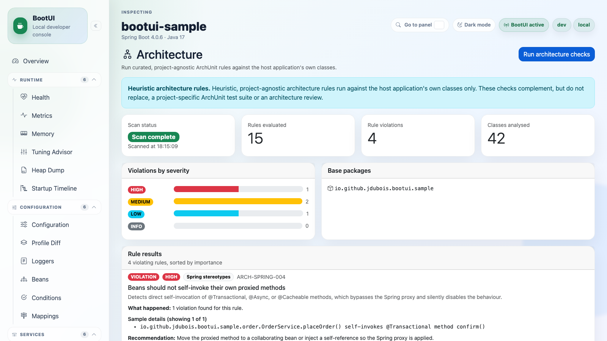

### REST API

The REST API panel runs a curated, zero-config ruleset against the host application's own web layer
(`@RestController` / `@Controller` handler methods) at runtime. Like the Architecture panel, it detects the
application's base package from the `@SpringBootApplication` configuration, imports the compiled controllers from that
package with ArchUnit's `ClassFileImporter` (bounded to the application's own classes), and derives a read-only handler
model — HTTP method(s), path(s), parameters and their annotations, return type, `produces`/`consumes`, validation flags,
and declared throws. It then evaluates 36 universally-sensible REST best-practice rules across eight categories: routing
and HTTP-method mapping, resource naming, status codes and responses, input validation and binding, DTO and payload
contracts, pagination, versioning and content negotiation, and error handling and documentation. The `RAPI-DOC-*`
documentation rules only run when springdoc-openapi is on the host classpath.

The advisor deliberately avoids security concerns (CORS, authentication, authorization), which remain owned by the
Security panel. The scan runs on demand and caches the last report; each rule is registered with a stable
identifier, category, severity, recommendation, and a learn-more link, and the rule results list shows only flagged
rules, sorted by severity and finding count. The heuristics complement — rather than replace — an API design review or
contract testing. See [REST-API-CHECKS.md](REST-API-CHECKS.md) for the full catalogue of rules and what
each one inspects.

> **Not available in GraalVM native images.** The advisor scans compiled `.class` files via ArchUnit's
> `ClassFileImporter`, which is incompatible with a native executable; the panel is automatically hidden when the
> application is detected to be running as a native image.

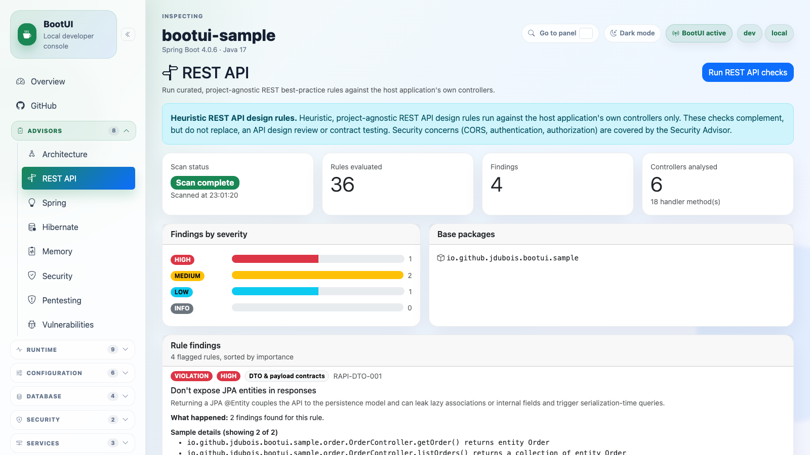

### Spring

The Spring panel runs an explicit, read-only scan of the host application's running Spring application context and
`Environment`. It takes a bounded snapshot of selected bean groups (Jackson `ObjectMapper`s, `TaskExecutor`s,
`DataSource`s) and feature flags, then evaluates a curated ruleset across bean wiring, configuration hygiene, profiles and
environment, performance and concurrency (including virtual threads), web/HTTP settings, and Actuator/management exposure.
Because it runs inside the
already-started application, it focuses on "started but suboptimal" states rather than fatal startup conditions. It
complements the Architecture panel, which statically analyses compiled bytecode with ArchUnit, by inspecting the live,
wired runtime context instead. The report is a heuristic review prompt, not a verdict: it never mutates the context,
intercepts live traffic, or surfaces secrets. See [SPRING-CHECKS.md](SPRING-CHECKS.md) for the full rule
catalogue and remediation links.

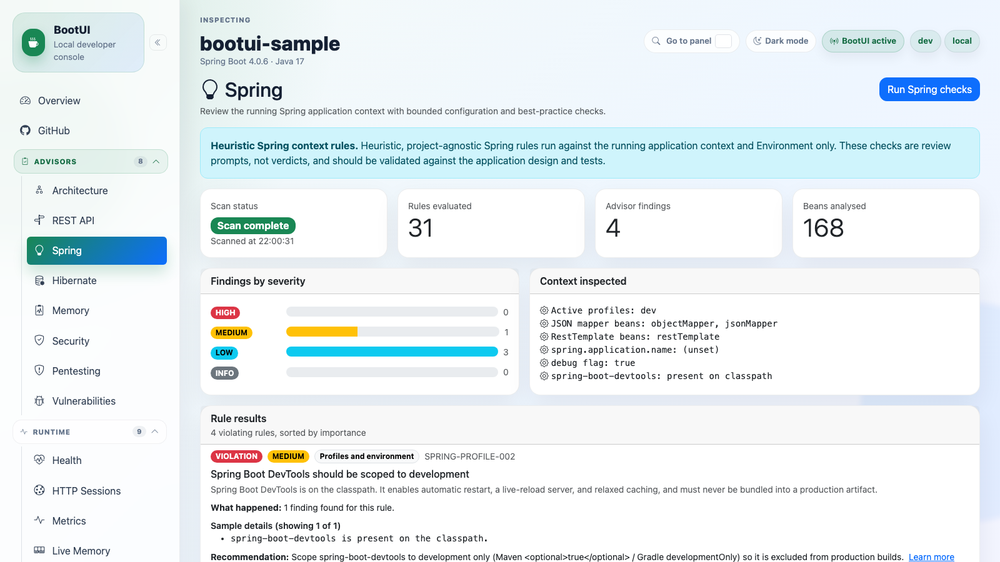

### Hibernate

The Hibernate panel runs an explicit, read-only scan against the JPA `EntityManagerFactory` metamodel when
Hibernate ORM is present. It reviews mapped entities, selected persistence configuration, and Spring Data repository
metadata for common Hibernate/JPA performance and mapping risks such as eager fetching, problematic identifier
generators, collection fetch pagination, unsafe cascades, cache misconfiguration, and risky `ddl-auto` values. The report
is framed as a review prompt, not a verdict: it never intercepts queries, invokes repositories, executes SQL, or modifies
mappings. See [HIBERNATE-CHECKS.md](HIBERNATE-CHECKS.md) for the full rule catalogue and remediation links.

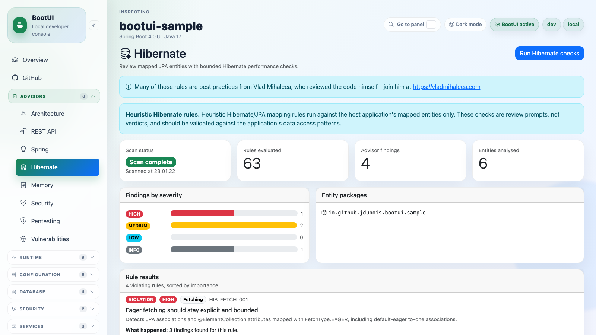

### Memory

The Memory panel runs an explicit, read-only scan over the live JVM management beans (heap and memory pools,
garbage collection, threads, loaded classes, and an optional class histogram) and turns them into severity-ranked
findings such as heap pressure, metaspace saturation, native-footprint risk inside a container, lifetime GC overhead,
thread deadlocks, and collection bloat. It complements the raw Live Memory and Threads panels by diagnosing the data they
expose. The scan is on demand and caches the last report; new rules are added as small, focused classes in the `memory`
package. See [MEMORY-CHECKS.md](MEMORY-CHECKS.md) for the full rule catalogue and remediation links.


### Security

The Security panel runs an explicit, read-only scan of the host application's registered Spring Security
`SecurityFilterChain` beans and related security beans when Spring Security is on the classpath. It introspects the filter
lists, simulates an anonymous authorization decision, and inspects security-relevant beans (`PasswordEncoder`,
`CorsConfigurationSource`, `JwtDecoder`) and `Environment` properties to flag common hardening gaps across authentication,
authorization, CSRF, session management, transport/security headers, CORS, method security, actuator exposure, OAuth2
resource-server validation, and configuration hygiene. The report is framed as a review prompt, not a verdict: it never
intercepts live traffic, exposes credentials, keys, or session identifiers, or modifies the security configuration. See
[SECURITY-CHECKS.md](SECURITY-CHECKS.md) for the full rule catalogue and remediation links.


### Pentesting

The Pentesting panel runs explicit, local-only OWASP Top 10 2025 hygiene checks against the host application, not
BootUI's `/bootui` routes. It combines passive Spring metadata with bounded synthetic localhost requests under the
application context path for missing or unsafe security headers, CORS behavior, cookie flags, verbose error exposure,
Spring Security wiring, and actuator exposure. It also inspects Spring Boot configuration for common hardening gaps such
as wildcard actuator exposure, health detail exposure, an enabled H2 console, in-config security credentials,
value-revealing actuator endpoints, request-detail logging, and DevTools left on the classpath. It intentionally does not
sweep discovered application endpoints, send SQL/XSS/destructive payloads, or store raw response bodies. Findings are
heuristic review prompts, not proof of exploitability or a replacement for a full security assessment.

Each hygiene check is registered with a stable identifier, OWASP 2025 category, evidence source, and recommendation so
new checks can be added without expanding the scanner's HTTP surface. See [PENTEST-CHECKS.md](PENTEST-CHECKS.md) for the
full catalogue of checks and what each one inspects.

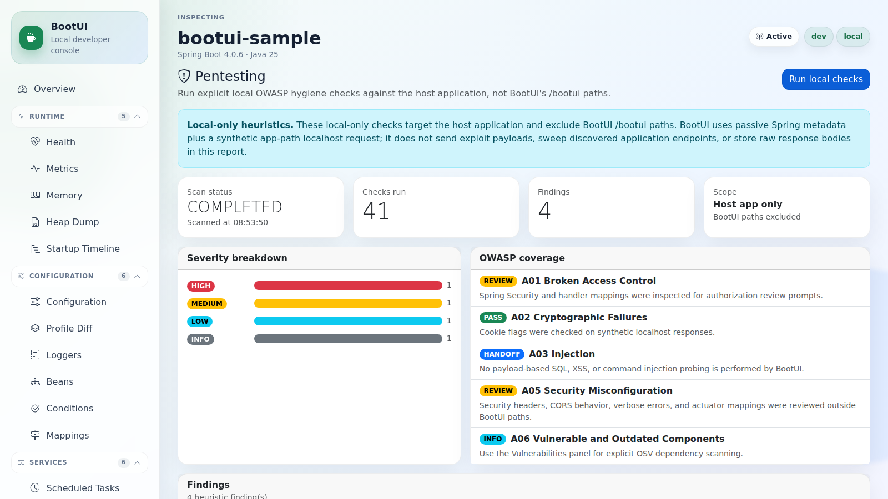

### Vulnerabilities

The Vulnerabilities panel shows dependency inventory and local OSV vulnerability scan results. It helps identify known
vulnerable dependencies from the running project's dependency set during the local development loop. Scan findings are
ordered by severity first, with dependencies and advisories alphabetized within the same severity.


## Runtime

### Health

The Health panel displays the Actuator health tree, including nested contributors and detailed status information when
the host app exposes it. It keeps unavailable health data separate from unhealthy application state so missing Actuator
infrastructure is clear, and shows setup guidance instead of a healthy-looking status when the Actuator health endpoint
is not available. When Actuator health is present but only Spring Boot's default indicators are reported, it keeps the
live statuses visible and shows guidance for adding application or dependency health contributors.


### HTTP Sessions

The HTTP Sessions panel lists local embedded Tomcat sessions with creation time, last access time, idle duration,
attribute count, and current-session highlighting. Session identifiers are treated as bearer credentials: by default the
UI only receives an opaque action key and a masked display id, and every attribute value is masked. Setting
`bootui.expose-values=FULL` reveals display ids and stringified attribute values for local troubleshooting and shows an
explicit FULL exposure warning, while `METADATA_ONLY` keeps attribute names and types without values. The panel returns
at most 50 sessions by default; raise `bootui.http-sessions.max-sessions` if a local app needs a larger bounded view.

Clear and destroy actions are confirmation-gated and disabled by global or per-panel read-only mode. Clear removes all
attributes from the selected session while keeping it valid; destroy invalidates the selected session. When the app is
not running on embedded Tomcat, the panel shows an unavailable state instead of guessing at container internals.

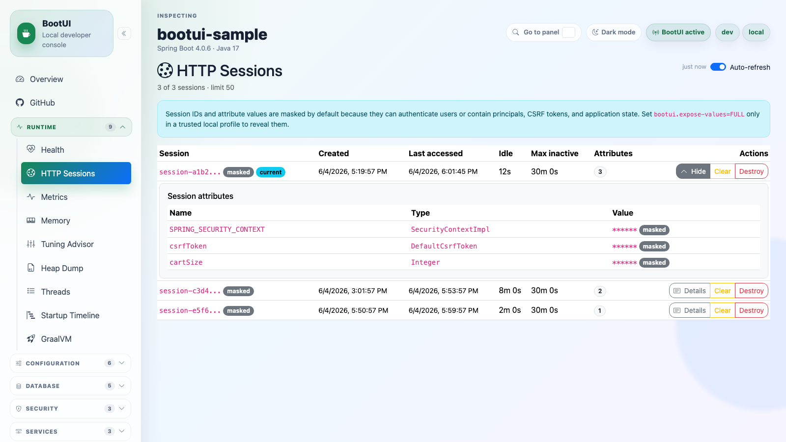

### Metrics

The Metrics panel browses Micrometer meters exposed by Actuator. You can inspect meter descriptions, base units, tags,
available measurements, and render a local live chart for a selected metric/tag combination.


### Live Memory

The Live Memory panel summarizes current live JVM heap and non-heap usage plus memory pool utilization. It stays focused on
the running process metrics so you can spot high heap pressure, non-heap growth, and pool-level saturation without the
JVM sizing controls mixed into the view.

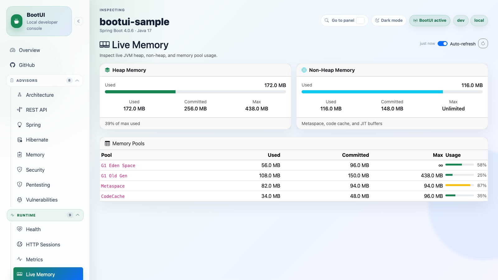

### JVM Tuning

The JVM Tuning panel uses the same live JVM context to review current JVM input arguments, explain
`spring.threads.virtual.enabled=true`, and run JVM sizing calculators for both dedicated hosts and Kubernetes. It detects
whether Spring virtual threads are enabled in the current application, shows an information or warning bubble, and feeds
that detected state into platform-thread stack budgets and heap sizing recommendations without adding the Spring property
to generated JVM or Kubernetes snippets.

The bare-metal calculator partitions a target JVM process memory budget into heap, metaspace, code cache, direct memory,
thread stacks, and headroom, then turns that plan into copyable JVM options with fixed `-Xms` and `-Xmx` values. The
Kubernetes calculator keeps `requests.memory == limits.memory` for Guaranteed QoS by default, but can switch to a
snapshot-based Burstable request when the operator intentionally overcommits memory. Its `JAVA_TOOL_OPTIONS` uses
`-XX:MaxRAMPercentage` and `-XX:InitialRAMPercentage` instead of fixed heap sizes so the JVM heap follows the container
memory limit when an operator resizes the pod. A Spring Boot Actuator probes toggle initializes from the current health
probe configuration and, when enabled, adds startup/readiness/liveness probe YAML plus the health-probes property. Fixed
non-heap caps remain visible in the snippet and sizing notes because they still need to fit inside any smaller limit.

> **Not available in GraalVM native images.** JVM heap, GC, and flag tuning does not apply to a native executable;
> the panel is automatically hidden when the application is detected to be running as a native image.

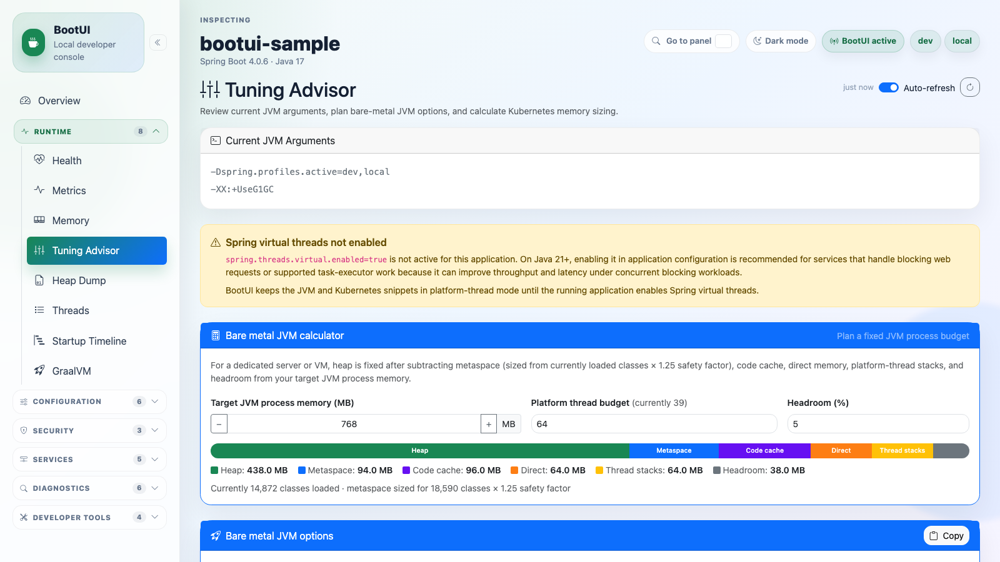

### Heap Dump

The Heap Dump panel captures local JVM heap dumps on demand and analyzes them through a value-free class histogram, so
you can investigate suspected memory leaks or unexpected retention during the local development loop. Capture and analyze
actions run an explicit, confirmed request that triggers a full GC and writes an `.hprof` file under the configured
output directory; the panel then shows live heap usage, the top retaining classes by instance count and shallow size,
and the list of captured dumps with retention-based eviction.

Heap dumps can contain plaintext secrets, credentials, and personal data, so the panel is designed to be safe by
default: it only summarizes class names and sizes (never object values), all capture/analyze/delete operations are
mutating `POST` requests that are blocked when the panel is read-only, and downloading the raw `.hprof` file is disabled
unless explicitly enabled via configuration. Use it on a local JVM only, and treat any exported dump as sensitive.

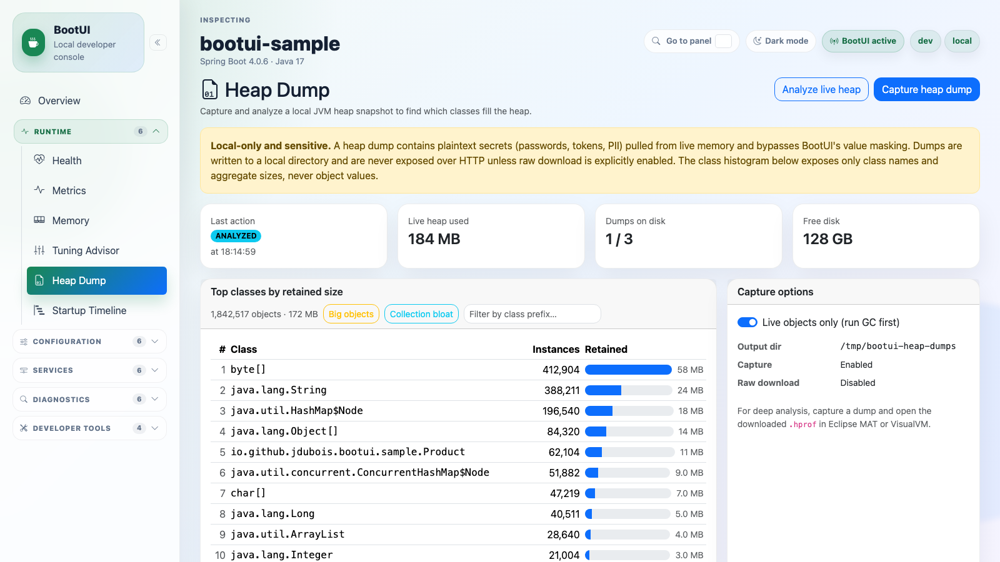

### Threads

The Threads panel shows a live snapshot of the JVM's threads so you can answer "what is the application doing right
now?" during local development. It reads thread information in-process through `ThreadMXBean` rather than requiring the
host application to expose the Actuator `threaddump` endpoint, and presents a state summary header (counts per thread
state), a flag when a deadlock is detected, and virtual-thread context when running on a JDK that supports it. The thread
list supports server-side filtering by name and by state with paging, and each row can expand to show its stack trace.

Stack frames and thread names can incidentally contain sensitive values, so the panel reuses BootUI's masking and
value-exposure model: names are masked when they look like secrets, and stack traces are omitted entirely under
metadata-only exposure. The raw text thread dump is offered as a confirmation-gated `POST` download that is blocked when
the panel is read-only. The panel stays loopback-only and fails closed, showing an explained unavailable state instead
of disappearing when thread information cannot be read.

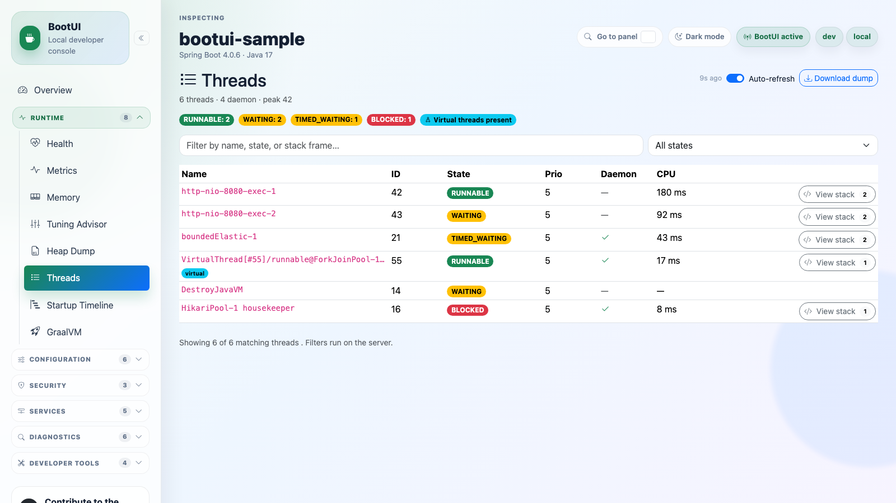

### Startup Timeline

The Startup Timeline panel visualizes Spring Boot startup steps from Actuator startup data. It helps identify expensive
startup phases, slow bean initialization, and the overall application startup shape. When BootUI is active, the starter
installs a `BufferingApplicationStartup` by default so the panel has data without host-app setup; disable that with
`bootui.startup.enabled=false` or tune the retained step count with `bootui.startup.capacity`. If startup data is still
unavailable, the panel shows an empty state instead of failing.


### GraalVM

The GraalVM panel surveys the host application for [GraalVM native-image](https://www.graalvm.org/latest/reference-manual/native-image/)
readiness. On demand it imports the application's own classes (bounded to the detected base package(s)) and runs a
curated set of heuristic checks for constructs that native-image cannot resolve at build time — reflection, dynamic
class loading, deep reflection, dynamic proxies, runtime resource loading, resource bundles, service loading,
serialization, build-time-initialization side effects, and native access. With the _Include dependencies_ toggle on (it is
on by default), it also surveys the classpath to report which third-party libraries already ship reachability metadata under
`META-INF/native-image/`, and — for libraries that do not — looks up Oracle's
[GraalVM reachability metadata repository](https://github.com/oracle/graalvm-reachability-metadata) to show whether the
detected dependency version is `covered`, only `partial` (the repository has metadata for a different version), or has
`none`, with links to the matching repository entry and metadata file. That repository lookup is the panel's only
outbound network call; it is user-initiated, time-bounded, and can be disabled with
`bootui.graalvm.repository-lookup-enabled=false`. Long dependency lookups report progress and can be aborted from the
panel. From the same scan the panel generates a downloadable `reachability-metadata.json` scaffold
(modern unified schema, with `condition.typeReached` guards) seeded with reflection/serialization candidates and the
standard configuration resource globs. When BootUI detects the application is running from an exploded build (for
example `mvn spring-boot:run` or an IDE) rather than a packaged jar, the panel also offers a **Write into project**
action that writes the same scaffold directly to
`src/main/resources/META-INF/native-image/<groupId>/<artifactId>/reachability-metadata.json` (resolving coordinates from
`build-info.properties` or the project `pom.xml`, falling back to a `bootui-generated` namespace). The install is
fail-closed: it is confined under `src/main/resources` and never overwrites a `reachability-metadata.json` that BootUI
did not generate. Alongside the metadata scaffold the panel also generates a tailored, multi-stage
**`Dockerfile-native`** that builds a GraalVM native image of the host application. It detects the project's build
system — Maven or Gradle, with or without the wrapper — and uses the matching native build command (`./mvnw`/`mvn
-Pnative -DskipTests clean native:compile`, or `./gradlew`/`gradle nativeCompile`), then packages the resulting executable —
named after the resolved `artifactId` — into a minimal, distroless runtime image (`gcr.io/distroless/base-debian12:nonroot`,
which runs as a non-root user and carries no shell/curl/perl/tar, keeping the OS-package CVE surface near zero; the binary
is built *mostly static* so it needs only glibc, and the build stage installs a known, pinned Maven/Gradle
release when the project has no wrapper). It can be downloaded, or written directly to the project root under the
same exploded-build constraint and the same fail-closed guard (BootUI never overwrites a `Dockerfile-native` it did not
generate). The metadata scaffold and the `Dockerfile-native` are presented in a three-drawer accordion whose default,
top drawer is an **All files** action that generates and writes both artifacts into the project's source tree in a
single step (under the same exploded-build constraint and fail-closed guards), reporting each file's outcome. The checks
and generated
metadata are heuristic review aids that complement, but do not replace, the GraalVM tracing agent and an actual native
build. See [GRAALVM-READINESS-CHECKS.md](GRAALVM-READINESS-CHECKS.md) for the full catalogue of checks and what each one
inspects.

> **Not available when already running as a GraalVM native image.** The readiness advisor scans compiled `.class` files
> to help you *prepare* an application for native-image compilation; once the application is already running as a native
> executable the advisor has no purpose, and the panel is automatically hidden.

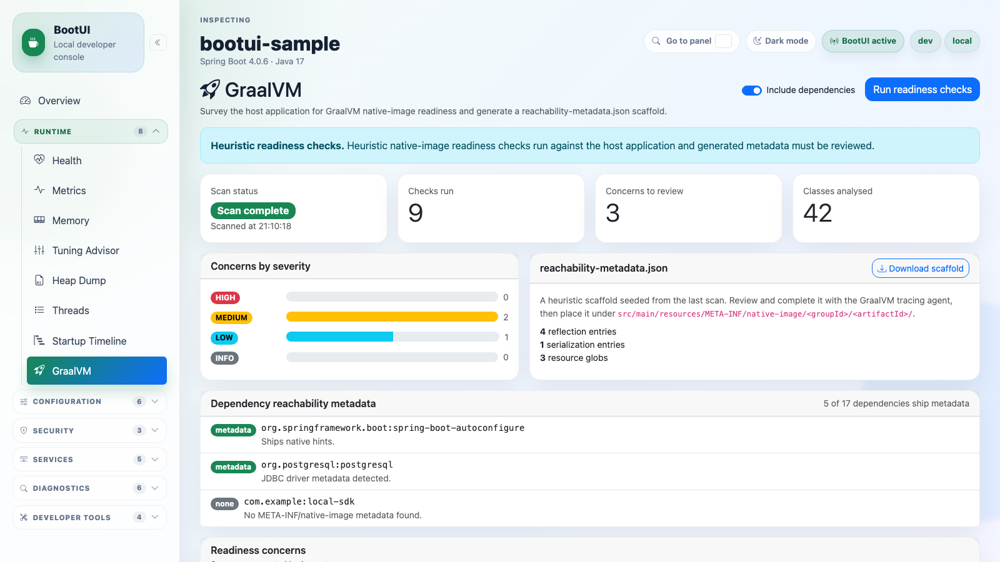

### CRaC

The CRaC panel reviews the host application's [Coordinated Restore at Checkpoint](https://docs.spring.io/spring-framework/reference/integration/checkpoint-restore.html)
readiness, combining live runtime status with a heuristic readiness advisor. The runtime-status card (always read-only)
reports whether the `org.crac` API is on the classpath, whether the running JVM is a CRaC-capable JDK (such as Azul Zulu
CRaC or BellSoft Liberica, detected via the real CRaC implementation rather than the no-op shim), whether
`spring.context.checkpoint=onRefresh` is set, and any `-XX:CRaCCheckpointTo` / `-XX:CRaCRestoreFrom` JVM arguments (read
from the same `RuntimeMXBean` input arguments the JVM Tuning panel uses). On demand the readiness advisor imports the
application's own classes (bounded to the detected base package(s)) and runs a curated set of `CRaC-*` checks for
constructs that complicate checkpoint/restore — open resources and file handles held outside Spring/CRaC lifecycle,
network listeners, live connection pools and cache managers, unmanaged threads, captured timestamps, captured
environment/system configuration, static random seeds, eagerly captured secrets, and missing `org.crac.Resource`
registrations. The checks are heuristic review aids that complement, but do not replace, an actual checkpoint/restore run
on a CRaC-enabled JDK. See [CRAC-READINESS-CHECKS.md](CRAC-READINESS-CHECKS.md) for the full catalogue of checks and what
each one inspects.

The panel also generates ready-to-use container assets for the host application: a multi-stage `Dockerfile-crac` that
builds with a plain JDK and runs on a CRaC-enabled BellSoft Liberica JDK, plus the `checkpoint-and-run.sh` entrypoint it
relies on (it takes a checkpoint on the first start via `spring.context.checkpoint=onRefresh` and restores it on later
starts). The build command is tailored to the detected build system (Maven or Gradle, with or without the wrapper). Each
file can be downloaded, and — when the application is running from an exploded build (for example `mvn spring-boot:run`
or an IDE) rather than a packaged jar — written directly into the project root. Writes are fail-closed and never
overwrite a file BootUI did not generate. This shares the same source-tree writer the GraalVM panel uses for its
`Dockerfile-native`.

> **Not available in GraalVM native images.** CRaC (Coordinated Restore at Checkpoint) is a JVM-only feature and is
> mutually exclusive with native executables; the panel is automatically hidden when the application is detected to be
> running as a native image.

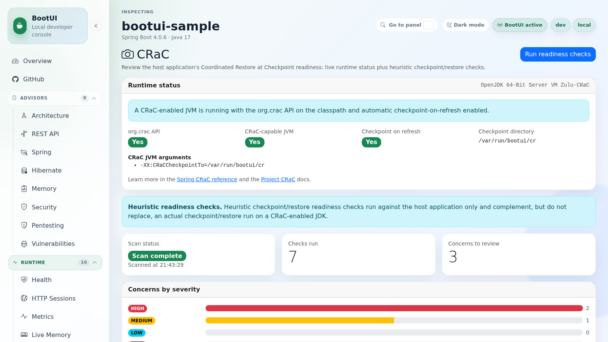

## Configuration

### Configuration

The Configuration panel shows effective configuration properties, sources, metadata descriptions, defaults when known,
active profiles, and masked values. It can create, update, and delete local runtime overrides persisted to
`.bootui/application-bootui.properties`, with restart and rebinding caveats shown for every mutation. Large property
tables load in bounded server-side pages for search, source, and override-only filters. The override property-name
picker limits its datalist suggestions while narrowing against the full metadata catalog as you type.


### Profile Diff

The Profile Diff panel compares profile-specific property sources and values. It is useful for understanding what
changes between local development profiles while still routing browser-visible names and values through BootUI's secret
masking rules.


### Loggers

The Loggers panel lists runtime logger configuration from Actuator. It shows configured and effective levels, supports
server-side search, and can update or clear logger levels without restarting the application. Large logger lists load in
bounded pages while filtering still searches the full logger set.


### Beans

The Beans panel helps answer which Spring beans exist and where they came from. It supports server-side search across
bean names and types, plus classifications such as application, Spring framework, Java/Jakarta, and other beans. BootUI's
own beans are hidden by default; when self-data filtering is disabled they are classified separately as BootUI beans.
Large bean lists load in bounded pages so the initial payload stays small while filters still apply to the full bean set.


### Conditions

The Conditions panel explains Spring Boot auto-configuration decisions. It groups positive matches, negative matches,
and unconditional classes so you can see why an auto-configuration applied or why it was skipped. Large condition reports
load in bounded pages, and filtering runs on the server so the browser does not need the full report before narrowing
results.


### Mappings

The Mappings panel lists HTTP routes from Actuator mappings data. It shows request methods, path patterns, handlers, and
produces/consumes metadata so the running application's web surface is visible without reading controllers manually.
Large mapping lists load through a stable, paged BootUI DTO, and the filter continues to search every discovered route
on the server.


## Database

### Database Connection Pools

The Database Connection Pools panel inspects supported JDBC connection pool beans. It is read-only and fails closed when
no supported pool implementation or pool beans are present. For each pool it shows the pool identity, masked JDBC URL and
username, driver, min/max sizing, and timeout/lifetime settings, and surfaces a clear unavailable reason for closed or
uninitialized pools. A local live chart polls bounded snapshots of active, idle, total, and pending connections every two
seconds so you can watch saturation trends without leaving BootUI. It never executes SQL, borrows connections, or resizes
pools.

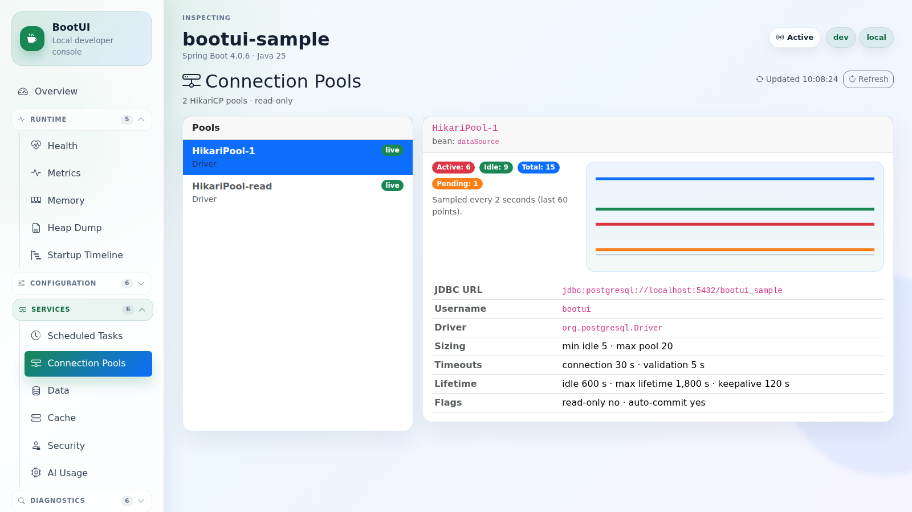

### SQL Trace

The SQL Trace panel shows the SQL statements your application recently executed, captured by a hand-written JDBC tracing
proxy built on the JDK's own dynamic-proxy support — BootUI does **not** bundle a third-party database-proxy library to
power this. When BootUI is active it transparently wraps each `DataSource` bean and intercepts statement execution on the
resulting `Connection`/`Statement`/`PreparedStatement`/`CallableStatement` objects, recording the SQL text, statement
type, SQL category (`SELECT`/`INSERT`/`UPDATE`/`DELETE`/`DDL`/`OTHER`), wall-clock duration, affected-row counts, batch
size, originating connection, executing thread, and any failure. Spring's delegating/routing `DataSource` wrappers are
skipped so executions are not double-counted, and wrapping **fails open**: if a `DataSource` cannot be proxied it is left
untouched so application database access is never compromised.

Executions are retained in a bounded in-memory ring buffer (most recent first) alongside aggregate stats (total/average/
max time, slow-query and failure counts, per-category counters, and evictions). The panel also groups identical
statements into a "Most frequent statements" table and flags repeated `SELECT`s that look like an **N+1 access pattern**
(the repeat count is configurable via `bootui.sql-trace.n-plus-one-threshold`). Each execution row expands to reveal the
full statement, bound parameters, statement type, connection id, executing thread, and error. A configurable slow-query
threshold highlights expensive statements, and local-only **Pause/Resume** and **Clear** actions let you stop recording
without unwrapping the data source or empty the buffer.

The panel is read-mostly and privacy-conscious: parameter bindings are **not** captured by default, and even when
capture is enabled they are suppressed under metadata-only value exposure and routed through the same masking rules as
the rest of BootUI; an inline warning reminds you when captured parameters are being shown in clear text. It fails closed
when no `DataSource` bean is wrapped. Tracing, the initial recording state, parameter capture, buffer size, the
slow-query and N+1 thresholds, and SQL/parameter truncation limits are all configurable under `bootui.sql-trace.*`.

Because the trace buffer is genuinely event-driven, the panel refreshes over **Server-Sent Events** instead of fixed-interval
polling: the browser subscribes to `/bootui/api/sql-trace/stream` and the server pushes a small coalesced notification the
moment a statement is captured, the buffer is cleared, or recording is paused/resumed, prompting the panel to re-fetch. The
push carries no data — masking, truncation, and value-exposure rules still apply through the regular endpoint — and bursts of
statements are folded into a single refresh so high-volume workloads do not flood the UI. When the auto-refresh toggle is off
or the tab is hidden the stream is closed, and the panel falls back to its initial load when Server-Sent Events are unavailable.

> **GraalVM native images are supported.** The tracing proxies are created over a fixed set of standard JDBC API
> interfaces, and those JDK proxies are registered as native-image proxy metadata by BootUI, so SQL Trace works in a
> native executable. If a proxy ever cannot be created (for example an interface set that was not registered), wrapping
> still fails open and the `DataSource` is left untraced rather than breaking application startup.

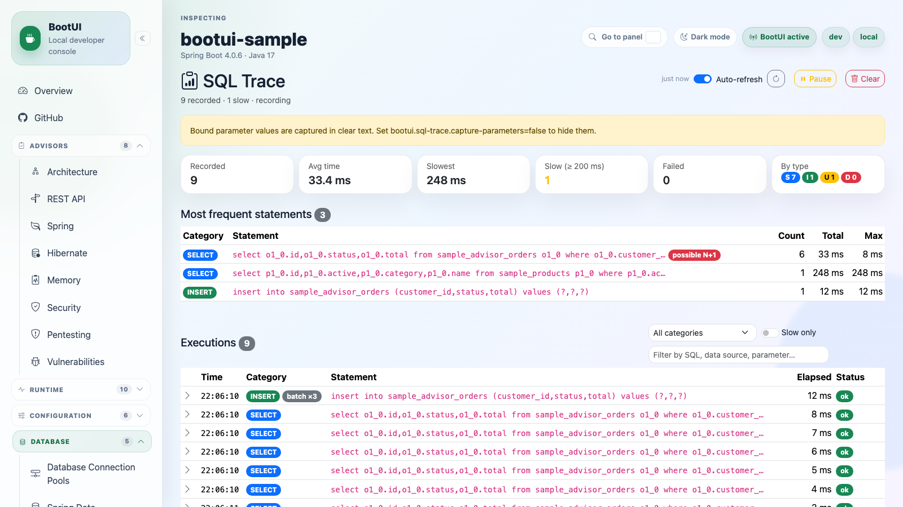

### Spring Data

The Spring Data panel inspects Spring Data repositories. It shows repository interfaces, domain types, ID types, and query
methods, and degrades to a clear empty state when Spring Data is not present or no repositories are registered.


### Flyway

The Flyway panel shows schema migrations for each `Flyway` bean in the context and lists, per database, the current schema
version together with applied and pending migrations (version, description, type, script, state, installed-by,
installed-on, execution time, and checksum). Multiple or named datasources appear independently. When Spring Modulith
module-aware Flyway migrations are active, the panel shows the root and module-specific history tables separately so
module-local migrations are visible even though Spring Modulith creates those Flyway views only during migration.

The panel also exposes confirmation-gated `migrate` and `clean` actions. They are available by default for trusted local
sessions and are blocked by `bootui.read-only=true` or `bootui.panels.flyway.read-only=true`; `clean` also requires
Flyway's own `clean-disabled=false` setting. Spring Modulith module-aware entries are read-only in BootUI because their
module-specific history tables are managed by Spring Modulith's migration strategy. The panel degrades to a clear empty
state when Flyway is not on the classpath or no `Flyway` beans are present.

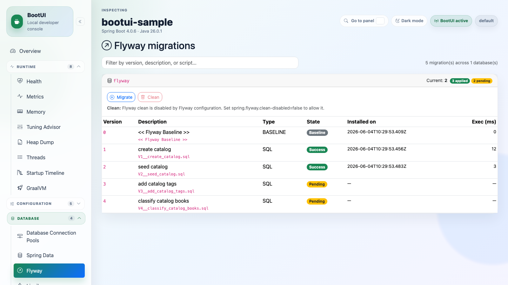

### Liquibase

The Liquibase panel shows change sets for each `SpringLiquibase` bean in the context. It reads the change-log history and
configured changelog, then lists applied and pending change sets per database (id, author, change-log, description,
comments, execution type, date executed, order executed, checksum, tag, deployment id, contexts, and labels). Multiple or
named datasources appear independently.

The panel also exposes a confirmation-gated `update` action that applies pending change sets. It is available by default
for trusted local sessions and is blocked by `bootui.read-only=true` or `bootui.panels.liquibase.read-only=true`. The panel
fails closed per bean when its history cannot be read and degrades to a clear empty state when Liquibase is not on the
classpath or no `SpringLiquibase` beans are present.

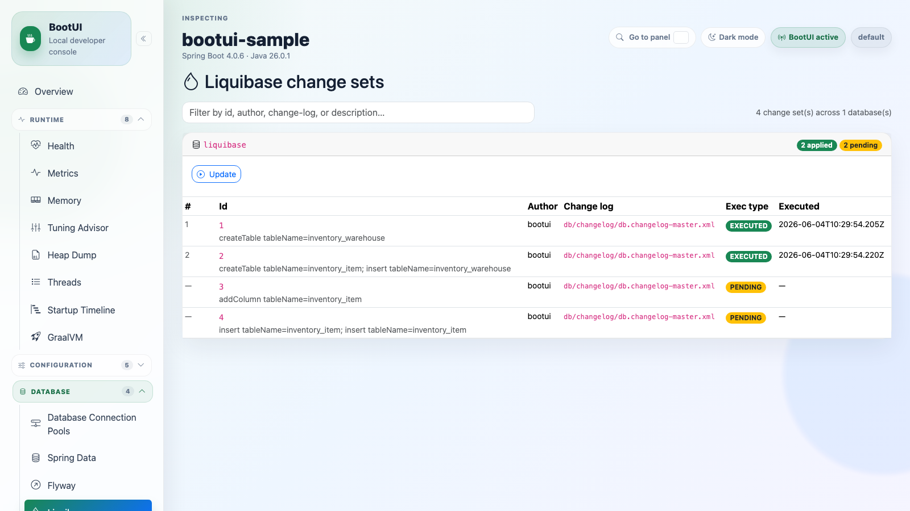

## Security

### Spring Security

The Spring Security panel inspects Spring Security filter chains and provides best-effort endpoint rule explanations. It is
meant to explain local security wiring without exposing credentials or replacing a full security audit.

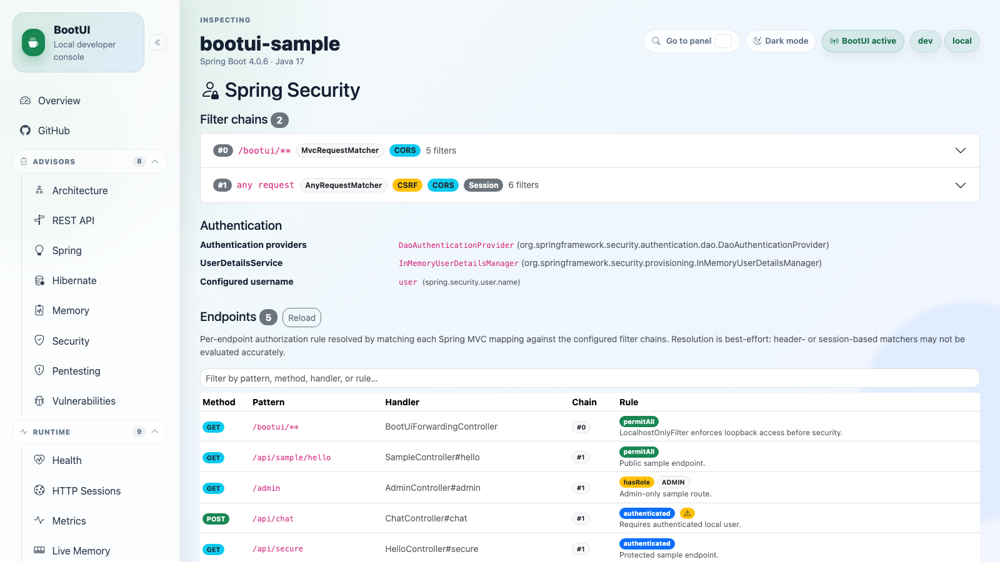

### Security Logs

The Security Logs panel reads recent Spring Boot audit events from the application's `AuditEventRepository`, including
authentication successes/failures and authorization denials when Spring Security audit listeners are active. When BootUI is
active and the panel is enabled, it contributes an in-memory repository if the host app has not already defined one, which
also lets Spring Boot create its standard audit listeners. It supports filtering by principal, event type, and time window,
summarizes retained event counts by type, refreshes live over **Server-Sent Events** (the browser subscribes to
`/bootui/api/security-logs/stream` and re-fetches when the server signals a new audit event, instead of polling on a timer),
and masks sensitive event data before rendering. Responses are bounded by `bootui.security-logs.max-logs`, which defaults to
`500`; if audit support is explicitly disabled with `management.auditevents.enabled=false`, the panel remains unavailable.

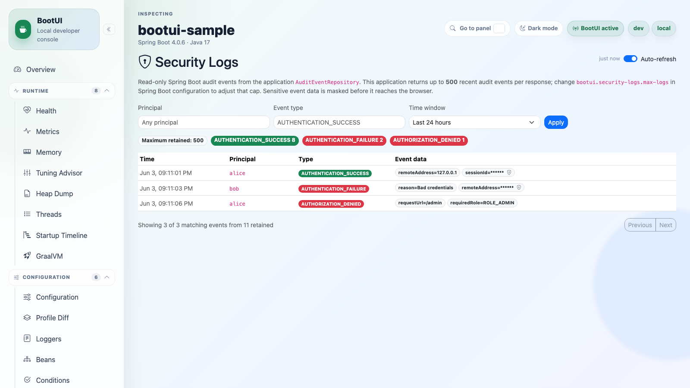

## Services

### Scheduled Tasks

The Scheduled Tasks panel lists scheduled jobs registered with Spring scheduling infrastructure. It shows task type and
trigger metadata so background activity is visible during local development.


### Spring Cache

The Spring Cache panel inspects Spring Cache infrastructure. It lists cache manager beans, known caches, native
implementations, safe local sizes, Micrometer cache metrics when registered, and discovered `@Cacheable`, `@CachePut`,
and `@CacheEvict` operations. Cache clear actions are enabled by default for local development, require explicit browser
confirmation, and can be disabled with `bootui.cache.clear-enabled=false`.

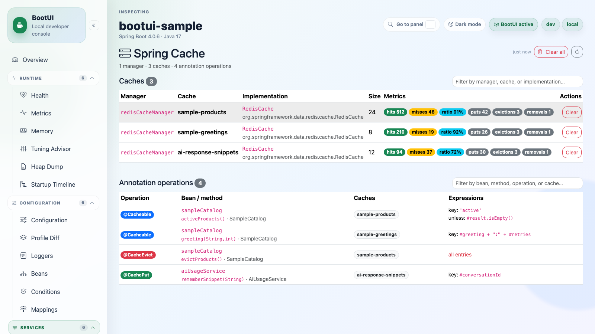

### AI Usage

The AI Usage panel summarizes Spring AI and LangChain4j activity collected from OpenTelemetry spans emitted by their
built-in
observability. It groups chat client and chat model spans by conversation so you can see request count, token usage (
prompt, completion, total), latency, model, and the prompt/response snippet when the framework is configured to capture
content (for Spring AI: `spring.ai.chat.client.observations.log-prompt`, `spring.ai.chat.observations.log-prompt`,
`spring.ai.chat.observations.log-completion`; for LangChain4j: enable GenAI message-content capture on the OpenTelemetry
instrumentation). A small inline chart shows total token usage over recent calls so you can
spot expensive interactions during local development. Vector store and embedding spans appear alongside chat spans when
present. The BootUI starter captures local application spans automatically when telemetry is enabled. Cooperating local
services can still send OTLP spans to the embedded receiver. The sidebar dims the panel when telemetry is disabled or
neither Spring AI nor LangChain4j is on the classpath, and the view
explains the unavailable state. When no framework is detected, the setup checklist also shows two side-by-side guides —
one for Spring AI and one for LangChain4j — explaining the dependency and configuration each needs to emit GenAI spans
(including optional prompt/completion content capture). When both prerequisites are ready but no chat spans have arrived
yet, the panel shows a ready empty state rather than setup guidance. Recent chats, model breakdowns, token-series
windows, spans, and attributes
are bounded so large local runs stay responsive. As with the Traces panel, data is sourced from BootUI's local telemetry
capture, is in-memory only, and is cleared on restart.


## Diagnostics

### Traces

The Traces panel shows distributed tracing spans captured locally by the BootUI starter when telemetry and the Traces
panel are enabled. The starter contributes the tracing dependencies and sampling default needed for local development, so
the host application does not need manual `management.*` tracing properties. Because that default raises sampling to
100% (`management.tracing.sampling.probability=1.0`), the OpenTelemetry SDK and Micrometer Tracing span/propagation code
runs on every request; to keep that from flooding the console when the host's root logger is at `DEBUG`, BootUI also
pins `logging.level.io.opentelemetry` and `logging.level.io.micrometer.tracing` to `INFO` as overridable defaults (set
either key yourself to opt back in). BootUI also keeps an embedded OTLP/HTTP
receiver at `/bootui/api/otlp/v1/traces` so cooperating local services can export spans into the same in-memory store.
The list shows the most recent traces with service name, the HTTP request path each trace served (falling back to the
root span name when no path attribute is present), status, duration, and span count; opening a trace
renders a waterfall view of its spans so you can see latency contributions, errors, and parent/child relationships across
services. Traces emitted by BootUI's own API are filtered out on ingestion by default: as soon as any span in a trace is
recognized as BootUI traffic (for example the path-bearing HTTP server span for `/bootui/api/**`), the whole trace is
dropped, including nested spans that carry no path of their own such as Spring Security `security filterchain
before`/`after` observations. Retained self-only traces are also hidden from the panel, to keep the view focused on
application traffic. Span ingestion can be tuned with
`bootui.telemetry.exclude-self-spans=false`; read-time panel filtering follows `bootui.monitoring.exclude-self`. When
`bootui.telemetry.enabled=false`, the sidebar dims the panel and the view shows a disabled state instead of implying that
tracing is merely empty. The in-memory trace buffer is bounded by `bootui.telemetry.max-traces`,
`bootui.telemetry.max-spans-per-trace`, request-size limits, and attribute-value truncation, with additional internal
caps to keep misconfigured local exporters from overflowing the UI. Trace data is reset on application restart or via
the panel's clear action.


### Log Tail

The Log Tail panel reads recent local application logs and streams new log events from the running process. It is
intended for quick local diagnosis without leaving the BootUI console.


### Exceptions

The Exceptions panel captures exceptions thrown by the running application and groups repeated failures into a single
entry with an occurrence count, in the spirit of tools like Laravel Telescope. BootUI records exceptions from two
complementary sources while it is active: a non-intrusive Spring MVC `HandlerExceptionResolver` that observes exceptions
escaping web request handlers (capturing the request method, path, and handler), and a logback appender that picks up
anything logged with a throwable from scheduled tasks, async work, or `log.error("…", ex)` calls. A failure that is both
handled and logged is de-duplicated by throwable identity so it is counted only once.

Exceptions are grouped by a stable fingerprint derived from the exception type and the top stack frames, so a recurring
error collapses into one row showing its type, latest message, first/last seen times, originating location, and total
count. Opening a group shows the representative stack trace with application frames highlighted, the full cause chain
(`Caused by: …` with `… N more` common-frame folding), and the most recent occurrences with their thread, source, and
request context. The list updates live over **Server-Sent Events** — the browser subscribes to `/bootui/api/exceptions/stream`
and re-fetches whenever an exception is captured or the store is cleared, rather than polling on a fixed interval — and can be
filtered by text, by capture source (web vs. logged), or to application-originated exceptions only.

Exception messages follow the same exposure policy as the rest of BootUI: they are scrubbed of secret-like
`key=value` assignments under the default `bootui.expose-values=MASKED`, omitted entirely under `METADATA_ONLY`, and shown
verbatim only under `FULL`. Request paths are captured without their query string so query-string secrets are never
surfaced, and stack frames carry only class/method/file/line information. The in-memory store is bounded by
`bootui.exceptions.max-groups` (default 100, evicting the least-recently-seen group), `bootui.exceptions.max-occurrences-per-group`
(default 25), and `bootui.exceptions.max-stack-frames` (default 50), and is reset on application restart or via the
panel's clear action. The panel can be disabled with `bootui.panels.exceptions.enabled=false`, and clearing honors the
panel's read-only setting.

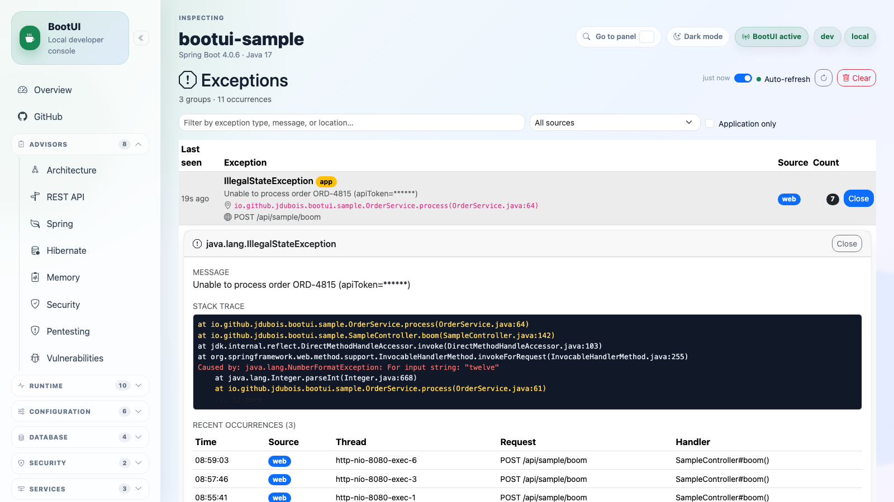

### HTTP Exchanges

The HTTP Exchanges panel records recent inbound requests handled by the running application. It lists timestamp, method,
path, status, duration, response size when a `Content-Length` header is present, and trace identifiers from common
propagation headers. Expanding a row shows request and response headers, with secret-like headers and query parameters
masked unless `bootui.expose-values=FULL` is explicitly configured. BootUI self-requests are hidden from the panel by
default through `bootui.monitoring.exclude-self`, though they still count against the bounded in-memory recorder.

BootUI contributes an in-memory `HttpExchangeRepository` when the panel is enabled and no application repository already
exists. The default buffer retains 200 exchanges and can be changed with `bootui.http-exchanges.max-exchanges`; changing
that capacity requires an application restart. If the repository is unavailable, the panel shows a clear unavailable
state instead of implying that no traffic has occurred.

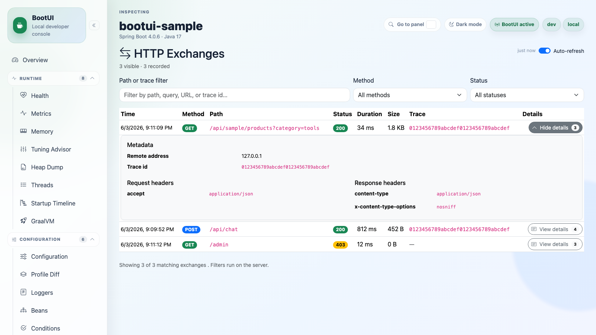

### HTTP Probe

The HTTP Probe panel sends local-only requests to the running application and displays response status, headers,
duration, and body. It is designed for quick route checks from inside the same local development context as BootUI.


## Developer tools

### MCP Server

BootUI can expose its advisors and read-only diagnostics to local AI coding agents (such as GitHub Copilot or Claude
Code) through a local, opt-in [Model Context Protocol](https://modelcontextprotocol.io) server, so an agent can consult
the advisors before proposing a fix and pull runtime diagnostics (exceptions, security logs, SQL traces, HTTP exchanges)
while investigating an issue. The server is a JSON-RPC 2.0 endpoint at `POST /bootui/api/mcp` (a `GET /bootui/api/mcp`
status request returns the advertised tool list for inspection); it is disabled by default (fail-closed) and, like the
rest of the BootUI API, only reachable over the loopback interface. Enable it headlessly with `bootui.mcp.enabled=ON`,
or use the prominent toggle at the top of this panel to turn it on or off **at runtime, overriding the
`bootui.mcp.enabled` Spring Boot property** for the lifetime of the running application — the configured mode only sets
the initial state, and the panel shows when the live state is an override.

The panel explains what the server does and lists every tool it exposes. Tools reuse the existing controllers and DTOs
rather than reimplementing anything, so every tool returns the same masked, bounded shape as the REST API, in three
groups:

- **Advisor scans (actions):** `architecture_scan`, `spring_scan`, `hibernate_scan`, `memory_scan`, `security_scan`,
  `pentest_scan`, `rest_api_scan`, `graalvm_scan`, `crac_scan`. Each triggers the same scan the panel's action button
  runs and returns the report DTO.
- **Diagnostics reads:** `get_exceptions`, `get_security_logs`, `get_sql_traces`, `get_traces`, `get_log_tail`,
  `get_http_exchanges`.
- **Core context reads:** `get_overview`, `get_health`, `get_config` (masked), `get_beans`, `get_mappings`.

Tools whose backing panel/controller is not present (for example Hibernate or Spring Security when those libraries are
absent) are simply not advertised. The server inherits BootUI's full safety model:

- It is only ever live while BootUI is active, so it is never reachable in production.
- The endpoint sits behind `LocalhostOnlyFilter` (loopback source, `Host` allow-list, cross-site write protection). It
  is exempt from BootUI's SPA CSRF token (which only browsers can present) so non-browser MCP clients connect with a
  plain HTTP config and no credentials, while `LocalhostOnlyFilter`'s cross-site defenses still block browser-driven
  writes.
- Read tools require the backing panel to be enabled; action (`*_scan`) tools are additionally refused when the panel is
  read-only or `bootui.read-only=true`, returning a clear tool error instead of running.
- Values pass through the same secret masking and `bootui.expose-values` mode as the REST API, and paginated reads are
  capped by `bootui.mcp.max-results`.

Connection details (transport, protocol revision, and the `bootui.mcp.max-results` cap) are shown alongside a
ready-to-use, copyable MCP client configuration JSON pointing at this running app — the `servers` block a GitHub Copilot
or Claude Code `mcp.json` expects. To wire it into an agent, point the client at the loopback HTTP endpoint of your
running app:

```json
{
  "servers": {
    "bootui": {
      "type": "http",
      "url": "http://127.0.0.1:8080/bootui/api/mcp"
    }
  }
}
```

See [docs/PROPERTIES.md](./PROPERTIES.md) for the `bootui.mcp.*` settings.

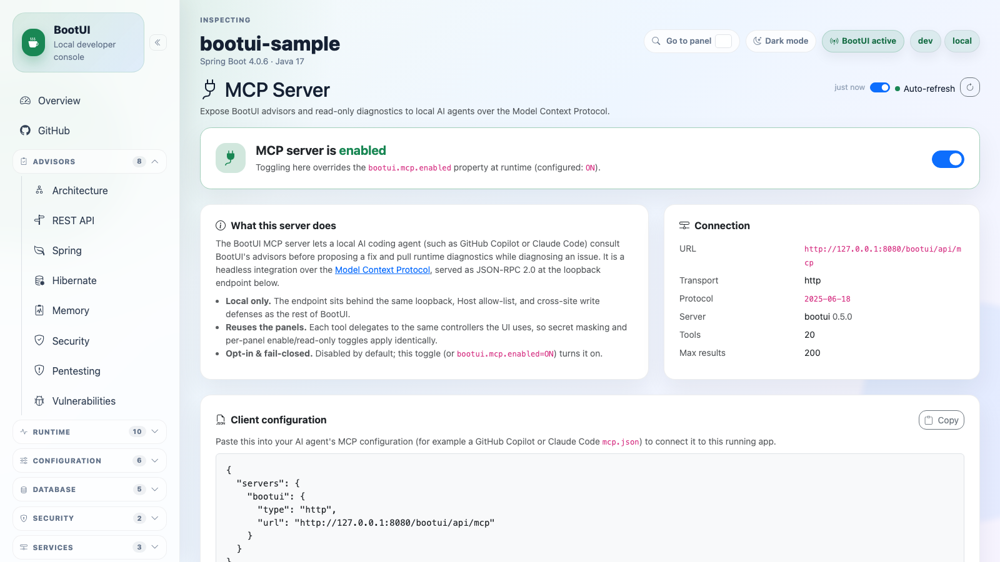

### DevTools

The DevTools panel reports Spring Boot DevTools availability, LiveReload status, and restart support. Restart actions
are shown only when available and require explicit confirmation before execution. When DevTools is on the classpath but
the LiveReload server is not running, the panel shows a tip to set `spring.devtools.livereload.enabled=true` (Spring
Boot 4 disables LiveReload by default).

The LiveReload card also reports how many browsers are currently connected to the LiveReload server. Triggering a reload
only reaches those connected clients — Spring Boot does not inject `livereload.js`, so a browser needs the LiveReload
extension (or the script) to connect on port 35729. When no clients are connected the panel warns that triggering has no
visible effect, and the trigger action returns that warning instead of a misleading success.


### Dev Services

The Dev Services panel surfaces local development services discovered from Docker Compose snapshots, Testcontainers
beans, and service connection metadata. It masks sensitive connection information, can show bounded logs for supported
services, and shows restart controls only for supported Testcontainers services when
`bootui.dev-services.restart-enabled=true`. To keep opening the panel side-effect free, BootUI skips lazy, prototype, or
otherwise uninitialized service beans that would need to be created just for inspection and reports those skips as
warnings in the panel.

> **Masking scope:** BootUI masks discovered _connection details_ (for example credentials embedded in a JDBC URL or
> connection properties) before they reach the browser. Raw container **log output** is streamed verbatim, bounded by
> `bootui.dev-services.log-tail-bytes`, and is **not** scanned for secrets — a service that prints credentials to its
> own logs will surface them in this panel. This is consistent with BootUI being a local-only, loopback-restricted
> developer console.


### Copilot

The Copilot panel surfaces sanitized signals from local
[GitHub Copilot CLI](https://github.com/github/copilot-cli) sessions. It reads the session directories and `events.jsonl`
files Copilot CLI writes under `~/.copilot/session-state/` (configurable via `bootui.copilot.session-state-dir`) and
aggregates recent activity into a clean dashboard: active sessions, total sanitized events, input/output token usage when
the local session logs include it, failures, 24-hour activity, 7-day activity, event category mix, top tools, model usage,
and recent sessions. The session explorer remains available
for drilling into tool calls, edits, reads, searches, shell commands, web/docs lookups, MCP tool calls, hook callbacks,
skills, sub-agents, and ASK/intent/plan calls. To keep large local histories responsive, the session explorer returns
the most recent `bootui.copilot.max-sessions` sessions by default, while `bootui.copilot.max-parsed-sessions` caps how
many recent session files are parsed and retained in JVM heap. The activity charts default to token usage, with input
tokens shown in blue and output tokens shown in red, and can be toggled back to sanitized events/failures. Selecting a
chart hour or day filters the explorer to sessions active during that window. Failure lists use retained failure events
and include sanitized tool/type context.
Each event row shows only an allowlisted summary - raw prompts, tool arguments, command output, and diffs are deliberately
excluded. The per-event "Reveal raw" action is an explicit, local-only escape hatch that returns the source JSON; it can
be disabled with `bootui.copilot.allow-raw-reveal=false` and is also blocked when `bootui.expose-values=METADATA_ONLY`.
The sidebar dims the panel when no session-state directory is found. Data is read-only - BootUI never modifies anything
under `~/.copilot/`. The panel uses the same header refresh button and visibility-aware auto-refresh toggle as the other
live data panels, while the backend watches the directory through a Java NIO `WatchService` thread. Inspired by
[copilot-mission-control](https://github.com/DanWahlin/copilot-mission-control), which pioneered this dashboarding of
Copilot CLI session state.


### Claude Code

The Claude Code panel mirrors the Copilot dashboard for local
[Claude Code](https://www.anthropic.com/claude-code) project logs. It reads JSONL session files under
`~/.claude/projects/` (configurable via `bootui.claude-code.session-state-dir`) and surfaces sanitized activity trends,
tool usage, model usage, input/output token usage, failures, recent sessions, and per-session event drill-downs. Its
activity charts use the same token-by-default view as the Copilot panel, with an events toggle for sanitized activity and
failures. BootUI treats Claude Code logs as
especially sensitive: prompts, assistant text, tool inputs, file contents, command output, and tool-result content are
excluded from normal responses. `bootui.claude-code.max-parsed-sessions` caps how many recent JSONL files are parsed and
retained in JVM heap. The raw JSONL reveal endpoint is disabled by default with `bootui.claude-code.allow-raw-reveal=false`;
enabling it is an explicit local-only escape hatch and is still blocked when `bootui.expose-values=METADATA_ONLY`. The
sidebar dims the panel when no Claude Code projects directory is found. Data is read-only - BootUI never modifies anything
under `~/.claude/`. Because Claude Code writes sessions inside per-project subdirectories, BootUI refreshes this panel
through the shared visibility-aware auto-refresh polling used by the other live data panels.


