# BootUI feature details

BootUI panels are documented here in the same grouped order as the application menu. When a panel's backing
infrastructure is missing, the sidebar moves non-overview panels into the collapsed Disabled / unavailable group so you
can tell at a glance which panels have no live data for the current application. Opening a dimmed panel also shows the
unavailable reason at the top of the page.

Every visible panel can be hidden with `bootui.panels.<panel-id>.enabled=false`. Panels with browser-triggered actions
also support `bootui.panels.<panel-id>.read-only=true`, and `bootui.read-only=true` makes the whole BootUI application
read-only. The complete list is in the [property reference](PROPERTIES.md).

Any action that changes server state — restarting a dev service, deleting or capturing a heap dump, writing GraalVM or
CRaC artifacts into your project, running a Flyway/Liquibase migration, clearing a cache or trace buffer, or destroying
an HTTP session — first opens a branded confirmation dialog that names the affected resource and flags irreversible
operations. The dialog defaults focus to Cancel, dismisses on Escape or a backdrop click, and honors
`prefers-reduced-motion`. Read-only scans and reversible toggles never prompt.

Monitoring-oriented panels hide BootUI's own runtime data by default so Beans, Conditions, Mappings, Loggers, Metrics,
Startup Timeline, Scheduled Tasks, Cache, Spring Security, Security Logs, and Traces stay focused on the host
application. Set
`bootui.monitoring.exclude-self=false` to include BootUI internals while debugging the console itself.

## Overview

The Overview panel is the BootUI landing page and acts as a guided "understand your app in minutes" dashboard rather than
a static summary. It opens with the standard panel header and a link to the running application's homepage, matching the
calm, instrument-like layout of every other panel.

It is built around an on-demand security & health scoring dashboard. Before any scan has run, the overall-score card
stays honest — it shows how many scanners have been scored and a prompt to run them rather than an empty gauge. Once at
least one scanner has scored, an overall score out of 100 summarizes the application's posture, with a qualitative band
(Good at 80+, Needs attention at 50+, At risk below 50) and a breakdown of how much each scanner deducted from a perfect
score. A single "Run all scanners" button triggers every available scanner, or each scanner card can be run individually.
After a run-all, a dismissible tip points to the MCP Server panel, since enabling the BootUI MCP Server lets an AI agent
read these same scan results and fix the findings for you.

Each scanner card shows its own 0–100 score, status, and severity counts. The severity-based scanners are Architecture, Memory,
REST API, Spring, Hibernate, Security, Pentesting, and Vulnerabilities; scores start at 100
and subtract a fixed weighted
penalty per finding (critical 25, high 10, medium 3, low 1), so a clean scan stays at 100. The GitHub card is not a
severity scanner: it connects to the local repository and, only when the credential is connected and authenticated,
contributes a score derived from open security alerts. The overall score is the mean of the scanners that were actually
scored, and only scanners whose panels are available for the current application are shown, so the dashboard degrades
gracefully when optional infrastructure is missing.

On Quarkus the Overview panel is fully available. Its scoring *dashboard* is rendered entirely in the browser:
the shell aggregates each advisor's own scan/report endpoints (only those whose panels are available on Quarkus
contribute) and computes the same combined score, so no backend dashboard service is involved. The shared shell
chrome around every panel — the header application name, framework and version (for example "Quarkus 3.33"), Java
version, active profiles, and the active/disabled status — is populated by the same framework-neutral
`GET /bootui/api/overview` endpoint that both adapters expose for the shell.

On Spring Boot WebFlux the Overview panel is fully available and identical in behavior — the dashboard aggregates
whichever scanner panels are available on the reactive adapter (see [docs/WEBFLUX-SUPPORT.md](WEBFLUX-SUPPORT.md) for
the current per-panel list), and the shell chrome is populated by the same `GET /bootui/api/overview` endpoint.

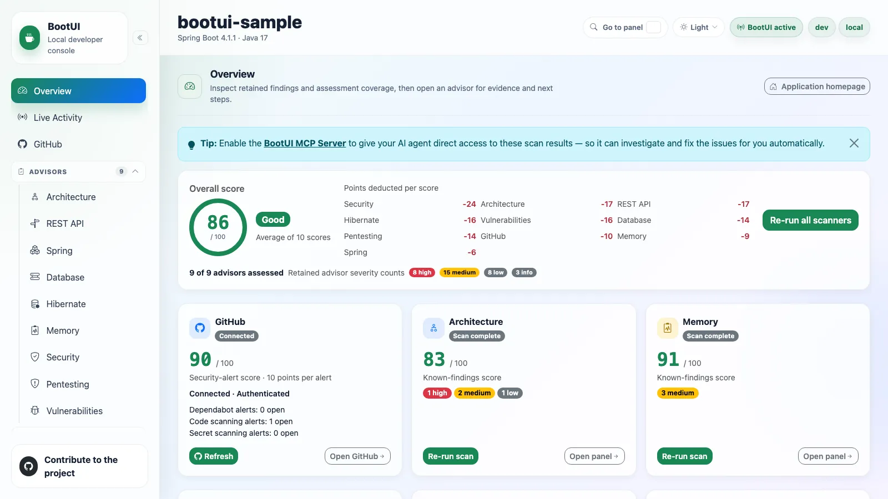

### Live Activity

The Live Activity panel is the diagnostics "home base": a single reverse-chronological stream of everything the
application just did, plus a per-request profiler for drilling into any single request. It adds no new instrumentation
for six of its nine signals — instead it reuses BootUI's existing in-memory signal buffers by calling the same
controllers that back the HTTP Exchanges, SQL Trace, REST Client, Exceptions, Security Logs, and Email panels, so
every value is already masked, self-filtered, and bounded exactly as those panels are. The seventh signal, cache
accesses, is captured by a small dedicated recorder (Spring servlet and WebFlux adapters only — see below) that only
ever stores a hashed cache key, never a raw key or value. The eighth signal, scheduled-task runs, captures each
`@Scheduled` method *execution* (start, success, failure, duration) on both adapters: Spring taps its own scheduling
observability hook (no extra proxying), Quarkus observes the CDI `SuccessfulExecution`/`FailedExecution` events its
scheduler always fires — feeding a bounded in-memory buffer the same way the other sources do. The ninth signal,
messaging activity (Kafka and RabbitMQ on both adapters, plus JMS on Spring), is described below.

The stream merges nine signal types into one feed: requests (`REQUEST`), SQL statements (`SQL`), exceptions
(`EXCEPTION`), security events (`SECURITY`), scheduled-task runs (`SCHEDULED`), messaging producer/consumer activity
(`MESSAGING`), and captured emails (`MAIL`) on both adapters, plus — on the Spring servlet and WebFlux adapters only —
outbound REST client calls (`REST_CLIENT`) and cache accesses (`CACHE`). Each row carries a timestamp, a type icon, a
color-coded severity
(`OK`, `SLOW`, `WARN`, `ERROR`), a one-line summary, and a duration where applicable; failed rows are highlighted and
slow requests are tinted on a graduated yellow-to-red heat scale (crossing 100, 200, 500, and 1000 ms) with a matching
latency badge so you can see at a glance *how* slow a request was. A request whose correlated SQL contains a suspected
N+1 access pattern carries a red **N+1** badge right in the row — the same detection the per-request profiler flags in
detail, computed with the identical threshold/logic so the two views never disagree — so a developer scanning the feed
can spot a suspect request without opening every drawer. A `CACHE` row summarizes the operation and cache name (e.g.
"MISS orders"), with a `WARN` severity for a miss and `OK` for every other operation, and its detail shows only a short
hashed key (`key a1b2c3…`) — the raw key or value is never captured, even under full value exposure. Adjacent identical
entries are collapsed with an
occurrence count to cut noise, and the feed can be narrowed
by type, severity, a free-text needle (path, status, SQL, or exception class), and an **errors-only** quick toggle — the
chosen filters are persisted in the browser so they survive a reload. A small **requests-over-time** sparkline above the
table makes spikes and error bursts (drawn in red) visible at a glance. A KPI strip across the top summarises requests per
minute, error rate, p50/p95 latency, SQL rate, (Spring servlet/WebFlux only) outbound REST-call error rate/p95 latency,
the slowest recent endpoint, active exception count, health status, heap
usage, (Spring servlet/WebFlux only) the cache hit ratio, and scheduled-task failure count, computed from the same buffers (sub-millisecond SQL is shown as `<1 ms`).
Several KPI cards are themselves
launchpads: the outbound-errors card opens **REST Client**, the slowest-endpoint card opens **HTTP Exchanges**
pre-filtered to that endpoint, while the
active-exceptions, health, heap-usage, cache-hit-ratio, and scheduled-failures cards jump to the **Exceptions**, **Health**, **Heap Dump**,
**Cache**, and **Scheduled Tasks** panels
respectively. Because the merged feed is genuinely event-driven, it refreshes over **Server-Sent Events** instead of
fixed-interval polling: the browser subscribes to
`/bootui/api/activity/stream` and re-fetches whenever any source signals a change (a new request, SQL statement, REST
client call, exception, security event, cache access, scheduled-task run, messaging event, or captured email), and the
feed can be paused and resumed so a row you are inspecting does not scroll away.
When the feed is unfiltered, correlated signals are **nested chronologically under the request that produced them**: the
SQL statements, REST client calls, exceptions, security events, cache accesses, and emails that BootUI can pin precisely
to a request — by trace id, by the
request's serving thread, or by request method and path — are folded into a collapsible group beneath that request row
(expanded by default), so one click reveals exactly what a single request did, in order. Requests that triggered a
security event are flagged as **authenticated** — a lock icon plus a gray pill naming the caller's principal — so a
secured call and who made it are obvious without opening the profiler, and the nested child rows are shaded a distinct
gray so they read clearly as belonging to the request above them. Signals that cannot be tied to a
request stay top-level, and applying any filter or free-text search flattens the feed again so the query spans every
signal.

Every row is also a launchpad: clicking anywhere on a request row opens its profiler, and each row carries a deep link
that jumps to the dedicated panel with the originating record pre-filtered — requests open in **HTTP Exchanges**, SQL in
**SQL Trace**, REST client calls in **REST Client**, exceptions in **Exceptions**, cache accesses in **Cache**,
scheduled-task runs in **Scheduled Tasks**, and captured emails open the very same message's detail drawer in **Email**
(the `MAIL` entry's id is the captured message's own id, so the link opens that exact email rather than only a
filtered list). REST client calls nest under their correlated request in the stream
using the same trace-id-first, serving-thread-second join described below for SQL, exactly like cache accesses and
emails — but, unlike SQL, exceptions, and security events, none of REST client calls, cache accesses, or scheduled-task
runs are yet part of the per-request profiler drawer's correlated timeline or **Copy profile** export; that
correlation, and the N+1-style "chatty" badge, stay scoped to the REST Client panel itself for now. The
per-request profiler drawer is a Symfony-style view that correlates
that single request's signals using a tiered join that degrades gracefully and never fabricates data: the distributed
trace is matched by trace id, exceptions are matched by request method, path, and time window — and, when the
request's serving thread is uniquely known, further disambiguated by that thread so a concurrent identical request
cannot steal the occurrence — security audit events are
matched by time window and the request principal (so an `AUTHENTICATION_SUCCESS` or `AUTHORIZATION_FAILURE` raised while
serving a secured endpoint is linked to that very request) — and, like SQL, are pinned **exactly to the request's
serving thread** when BootUI captured the audit event on it, so two concurrent requests sharing a principal no longer
trade security events; an event proven to have fired on another thread is excluded and an on-thread one is badged
**exact**. SQL is matched
**exactly by trace id** when Micrometer Tracing is present (BootUI threads the active `traceId` from the SLF4J MDC onto
each captured statement). When no trace id is available — the common local-dev case — SQL is still matched **exactly by
the request's serving thread** within its handling window: a servlet request runs start-to-finish on one worker thread
that serves only one request at a time, so statements on that thread are unambiguously its own. Only when the serving
thread cannot be uniquely identified (for example two genuinely concurrent identical requests, or SQL run on an async
thread) does SQL fall back to a time-window heuristic, which is then clearly labelled **approximate** in the drawer;
identical repeated `SELECT`s above
`bootui.activity.n-plus-one-threshold` are flagged as a potential N+1, and each flagged group lists the distinct call
site(s) in your own application code that issued it — the class, method, and line captured by SQL Trace's call-site
capture (`bootui.sql-trace.capture-call-site`, on by default) — so you know exactly which repository or service method
to go fix. The drawer also shows the request's timing
breakdown (time spent in SQL versus the rest), its auth/principal context, and the trace span list, can be dismissed with
the **Escape** key (with focus trapped inside while open), and offers a **Copy profile** action that exports the
already-masked correlated timeline (request + SQL + exceptions + security events, including any flagged N+1 call sites)
as plain text to paste straight into a bug report.

The panel inherits BootUI's full safety model (loopback filter, Host allow-list, cross-site write defenses, value
masking); its reads are read-only, and its one state-changing action (switching to a database, described below) is
confirmation-gated and blocked like any other action when the app or panel is read-only. The stream is capped by
`bootui.activity.max-entries`, the slow-request threshold is `bootui.activity.request-slow-threshold-ms`, and individual
sources can be turned off through their existing `bootui.panels.*` toggles (a disabled source simply drops out of the
stream).

When Kafka support is present, BootUI captures producer/consumer activity into the stream as `MESSAGING` entries. On
Spring, it wraps every application-owned `KafkaTemplate` (a `ProducerListener`) and `@KafkaListener` container factory
(a `RecordInterceptor`) — composing with, never replacing, any listener/interceptor the application already configured,
exactly like `HttpExchangesController`'s repository wrapper. On Quarkus, it hooks SmallRye Reactive Messaging's Kafka
interceptors. Each entry records topic, partition, offset (for consumed records), a hash of the key, direction (`→`/`←`
for produce/consume), success/failure, and — for consumed records — the consumer group id, a listener identifier, and
processing duration (a producer send's duration is not exposed by either framework's callback, so it is not tracked).
That listener identifier is intentionally framework-specific: on Spring it is currently the **listener container
factory bean name** (the per-`@KafkaListener` id is not exposed at the factory-wide interception point), while on
Quarkus it is the channel name. **The message value/payload is never captured** — only metadata — since a Kafka payload
is an arbitrary, potentially large and sensitive application object with no generic masking strategy. Raw exception
messages are not retained either; failed operations carry only generic failure text. Kafka entries are top-level in the
feed today (not yet nested under a correlated request). Capture is on by default whenever the relevant Kafka integration
is present and the panel is enabled, and can be tuned or disabled entirely via `bootui.kafka.enabled`,
`bootui.kafka.capture-key`, `bootui.kafka.max-entries`, and `bootui.kafka.max-key-length` — see `docs/PROPERTIES.md`.

When Spring JMS support is present (`spring-jms` and `jakarta.jms` on the classpath), BootUI also captures JMS producer and consumer
activity into the same `MESSAGING` stream. Every `JmsTemplate` bean is wrapped via a CGLIB proxy that intercepts
`send`/`convertAndSend` calls; every `AbstractJmsListenerContainerFactory` bean is similarly proxied so that each
container it creates has its message listener wrapped by a matching plain or session-aware capture adapter. Both the
proxy and adapters compose with the application's existing converters, callbacks, and error handlers without replacing
them or changing the listener dispatch interface. Direct `JMSContext`, `MessageProducer`, or `MessageConsumer` usage is
outside this capture seam, matching Kafka and RabbitMQ's framework-integration-level instrumentation.
Each entry records a sanitized JMS destination name (only explicit names and standard `Queue`/`Topic` accessors are
trusted), direction, success/failure, and duration. When a `MessageCreator` or `MessagePostProcessor` exposes the
provider-assigned JMS message ID, BootUI retains only its one-way hash. **The message payload, arbitrary
headers/properties, raw message ID, and exception message are never captured.** JMS uses its own framework-neutral
`JmsActivityRecorder`, bounded buffer, and `MESSAGING` mapper, so JMS traffic cannot evict Kafka panel history and either
transport can be disabled independently. Tune it with `bootui.jms.enabled`, `bootui.jms.capture-message-id`,
`bootui.jms.max-entries`, and `bootui.jms.max-message-id-length`. JMS capture is available on Spring MVC and WebFlux;
no Quarkus JMS equivalent is claimed.

By default the stream is in-memory only, so history is lost on a restart and the feed can only show as far back as the
small buffers behind it reach. Setting `bootui.activity.persistence.enabled=true` additionally buffers
captured entries and flushes them to a SQL database over direct JDBC every `bootui.activity.persistence.flush-interval`
(5 seconds by default), so history survives a restart and the dashboard can page back much further. The backing table
(`bootui.activity.persistence.table-name`, default `bootui_activity`) is created automatically the first time it is
needed, and several BootUI instances — for example several replicas of the same application — can safely point at the
same table: each instance tags its own rows with an `instanceId` (defaulting to the `HOSTNAME` environment variable) and
never reads or prunes another instance's rows. Recently captured entries are visible in the dashboard immediately, even
before they have been flushed, because reads always merge the in-memory buffer with the durable store; if a flush ever
fails, its entries are put back in the buffer rather than lost, and are retried on the next flush. Once persistence is
confirmed on, the panel gains a **Load older** button beneath the stream that pages further back into history, and the
type/severity/free-text filters are additionally pushed to the database as a real query instead of only filtering the
entries already on screen; a small "· persisted history" note next to the panel subtitle confirms durable storage is
active. By default (persistence off) none of this changes anything: no extra bean, thread, or connection is created, and
the feed behaves exactly as before. See `docs/PROPERTIES.md` for the full list of `bootui.activity.persistence.*`
properties, including how to point at a small dedicated connection instead of reusing the host application's own
`DataSource`.

Turning persistence on does not require editing configuration or restarting the app. Whenever it is not yet active, a
"Currently saving N events in memory" tip appears next to the panel title alongside a **Use a database** button; opening
it reveals setup documentation and, if the application already has a `DataSource` bean, a **Use the existing
datasource** action. That action is confirmation-gated exactly like other destructive/state-changing actions elsewhere
in BootUI (Flyway migrate/clean, Liquibase update, Cache clear): once confirmed, it checks the current datasource,
creates the backing table if it does not already exist, and hot-switches the running instance from the in-memory buffer
to durable storage — with no dropped entries and no restart. This switch is **runtime-only**: it changes nothing on
disk, so a later restart reverts to the in-memory default unless `bootui.activity.persistence.enabled=true` is also set
in configuration. If no `DataSource` is present, the button instead links straight to the setup documentation for
configuring one (a dedicated one, just for Live Activity, or reusing an existing one).

On Quarkus the panel merges eight signals: HTTP requests (from the same Vert.x-fed ring buffer as HTTP Exchanges), SQL
trace, exceptions, security events, scheduled-task runs, messaging activity, captured emails, and outbound
REST Client Reactive calls, alongside JVM heap KPIs. Cache accesses remain Spring-servlet/WebFlux-only today (see their
own section above), so only that slot stays empty/unavailable on Quarkus. SQL trace
contributes only when a JDBC datasource is
configured (the recorder is gated on Agroal); when none is present those entries drop out and the report carries a clear
note. Signal-to-request correlation works by **trace id**: Spring's thread-per-request anchor is unportable on the Vert.x
event loop (a thread does not map to a single request), so when `quarkus-opentelemetry` is present the adapter stamps the
active server span's trace id at each capture point — the HTTP filter, REST Client recorder, SQL recorder, exception store,
and CDI security-event observer — and the engine nests REST Client, SQL, exception, security, and email entries under the
request sharing that trace id, exactly as on Spring (scheduled-task runs and messaging activity always stay top-level); the
OpenTelemetry context propagates across the event-loop→worker hop, so the same trace id is available even for
blocking JDBC on a worker thread or a security event fired from a CDI observer. A request whose trace id uniquely matches
a correlated security event is flagged **authenticated** exactly like Spring, naming the audit event's principal; Quarkus's
own security layer authenticating the caller (surfaced directly on the captured HTTP exchange) takes precedence over a
correlated audit event when both are known. With OpenTelemetry absent, entries carry no trace id and the feed renders
flat. The per-request **profiler** drawer (the Symfony-style drill-down, `GET /bootui/api/activity/{id}`) is available on
Quarkus too, but in a reduced, trace-id-only form: when the request carries a trace id it correlates SQL, exceptions, and
security events that share that exact trace id (`sqlCorrelationApproximate: false`, since trace-id matching is exact); it
does **not** attempt Spring's time-window/thread-based tiers for requests without a trace id, since those lean on
serving-thread identity that the Vert.x event-loop model has no equivalent for. Without `quarkus-opentelemetry` present —
or for a request that has no trace id captured — the drawer honestly reports itself unavailable with a clear reason
rather than fabricating a partial profile (see `docs/QUARKUS-SUPPORT.md` for the detailed reasoning). N+1 detection, its
list-level row badge, and call-site capture are computed by the same shared engine code Spring uses (the correlation
tier above only changes *which* SQL gets grouped, never how a group is flagged or its call sites collected), so a
Quarkus request that resolves any SQL correlation gets byte-identical N+1 flagging to Spring.

The optional durable persistence backend described above is available on Quarkus too, with an identical config surface,
wire contract, and shared engine machinery (`ActivityStore`/`BufferedActivityStore`/`JdbcActivityStore`). A dedicated
`QuarkusActivityCapture` CDI bean owns the capture-poller lifecycle (starting it at `@Observes StartupEvent` and
stopping it, with a final flush, at `@Observes ShutdownEvent`) where the Spring adapter instead wires the same
poller/coordinator inline in its controller. One narrower, pre-existing gap carries over: because Quarkus's baseline
feed has no server-side `type`/`severity`/`since` filtering to begin with (see above), those filters only take effect
on Quarkus once persistence is switched on. The runtime "Use the existing datasource" switch described above works
identically on Quarkus: the same engine-level `ActivitySwitchService` backs a thin JAX-RS mirror of Spring's endpoint,
so the tip, button, and confirmation flow behave the same regardless of adapter.

On Spring Boot WebFlux the panel is available too, merging all nine signals like the servlet adapter does. Seven of
them needed no new *capture* pipeline at all: HTTP requests, SQL trace, exceptions, security events, scheduled-task
runs, messaging activity, and captured emails are each already reactive-safe — their engine beans live
in the shared `BootUiEngineConfiguration` both the servlet and reactive auto-configurations import — so the WebFlux
port is purely a merge over those existing sources (see their own sections below). The remaining two needed one each.
Cache accesses reuse the exact same `CacheActivityRecorder`/`CacheActivityCacheManagerBeanPostProcessor` pair the
servlet adapter uses — both wired once in that same shared configuration so servlet and WebFlux behave identically —
rather than a WebFlux-specific implementation. Outbound REST/WebClient calls work the same way: the shared
`RestClientTraceRecorder` + Spring Boot client customizers live in that common engine wiring too, so a WebFlux
application's own `WebClient` calls are captured and merged here as well. Correlation is **trace-id only** for cache
and REST-client entries — the same shared-engine rule SQL/exceptions/security already use on WebFlux and Quarkus —
because Reactor Netty has no thread-per-request model to correlate by (a request isn't served start-to-finish on one
dedicated worker thread), so the servlet adapter's thread-based/time-window correlation tiers, including its
serving-thread fallback for `CACHE` (the same one it uses for `SQL`), do not apply. Both Spring adapters stamp the
server-created trace id onto Actuator's trace-id-less HTTP exchange model through the same bounded
`HttpExchangeTraceRegistry`: MVC reads the SLF4J MDC value already used by its SQL/cache/REST capture, while WebFlux
reads the active OpenTelemetry span across Reactor hops. When a shared trace id is present on both sides, matching
signals nest under the request exactly as on Quarkus; without one, every signal
still appears in the feed, just flat/top-level rather than nested per-request. The per-request **profiler** drawer is
available too, in the same reduced, trace-id-only form as Quarkus: it correlates by exact trace id when the request
has one, and honestly reports itself unavailable rather than fabricating a partial profile when it does not. N+1
detection, its row badge, and call-site capture are computed by the same shared engine code as every other adapter,
so a WebFlux request that resolves a trace-id correlation gets byte-identical flagging to Spring MVC and Quarkus. The
optional durable persistence backend and the "Use the existing datasource" hot-switch described above work
identically on WebFlux too, over the same shared engine machinery. The dedicated REST Client panel is also available
on WebFlux (see [docs/WEBFLUX-SUPPORT.md](WEBFLUX-SUPPORT.md) for the full detail), delivering the same
pause/resume controls, retained-call table, and "Most frequent calls" grouping over `WebClient` calls captured via
the reactive adapter.

#### Live flow (service map)

Live Activity has a second reading of the same evidence: a **Live flow** mode, reached from the Feed / Live flow switch
next to the panel title. Where the feed answers "what just happened, in order?", the map answers "what does this
application actually talk to?" — the running application at the centre, a single generic **Local HTTP clients** lane
feeding into it, and one node per outbound dependency, grouped by safe identity. It is served by
`GET /bootui/api/activity/service-map` on Spring MVC, Spring WebFlux, and Quarkus.

Nothing new is instrumented and nothing is contacted. The map is assembled entirely from bounded buffers other panels
already fill: completed inbound requests (HTTP Exchanges), outbound HTTP calls grouped to a `scheme://host[:port]`
origin (REST Client), configured JDBC pools with a target that the map independently strips of JDBC user-info and
driver parameters even under full value exposure, retained SQL
statements (SQL Trace), cache accesses grouped by cache manager/cache name (Cache — see below), Kafka **producer**
topics, and RabbitMQ **publisher** exchange/routing destinations. Opening the
map performs no network call, probe, DNS lookup, connection attempt, or scan. Consumed Kafka records and consumed AMQP
messages are inbound work this application performs, so they are deliberately never drawn as outbound dependencies.

**Cache is a first-class dependency on Spring MVC and Spring WebFlux when at least one `CacheManager` was successfully
instrumented.** The same recorder behind the Cache panel and Live Activity's `CACHE` entries feeds a `CACHE`-protocol
node here too, filterable and iconed like every other dependency, grouped by cache manager and cache name — never the
accessed key or value — and showing the same `HIT`/`MISS`/`PUT`/`EVICT`/`CLEAR` operations. An enabled recorder without
an instrumented manager does not advertise a source that cannot receive runtime evidence. Selecting a cache node
deep-links into the Cache panel. A cache `MISS` is a normal, expected outcome, never a retained failure. Quarkus
honestly reports no cache dependency at all here: `quarkus-cache`'s built-in interceptors leave no comparable
interception seam, the same reason its Live Activity feed has no `CACHE` entries either.

The map separates what is **configured** from what has been **observed**, and never collapses the two: a declared
datasource with no traffic is drawn with a dashed outline and reads "configured, no recent evidence" rather than
disappearing, and an observed HTTP origin is never presented as a declared dependency. Selecting any node — by click or
by keyboard — opens an evidence panel with the retained interaction and failure counts, the distinct-operation count
where the source can report one honestly, when it was last seen, an explicit note about what that node does and does not
prove, the small tail of recent interactions, and a deep link into the panel the evidence came from. A retained failure
is reported as debugging evidence, never as a health check of the remote system, because BootUI has not contacted it.

Statement evidence is only attributed to a pool when attribution is unambiguous — exactly one configured pool and
exactly one traced datasource whose name matches that pool. With multiple or unmatched sources, or with no pool metadata
at all, the statements are summarized on their own **SQL statements** node, the pools stay configured-only, and the
reason is stated as a warning. BootUI does not invent a statement-to-pool relationship it cannot prove.

Identity is deliberately subtractive. An HTTP dependency is only ever an origin: user-info credentials, paths, query
strings, and fragments are dropped before anything is serialized, and a call that cannot be reduced to a safe origin is
left off the map with a visible warning rather than shown under a guessed identity. JDBC targets reuse the existing
masking and independently lose authority/Oracle credentials plus any driver parameter tail. Complete sanitized
identities drive grouping and stable opaque ids; only display labels are truncated, so shared long prefixes do not
collapse distinct dependencies. SQL text, bound parameters, message keys, payloads, and headers
never reach this contract at all. Cardinality is capped before rendering (28 dependencies, with a small per-edge
interaction tail); anything withheld is reported as a visible count, never dropped silently.

Motion is evidence, not decoration. The map refreshes off the same Server-Sent Events tick as the feed, and animates a
short particle only when a **stable** edge — one present both before and after the refresh — carries an interaction id
the previous snapshot did not. A first load animates nothing, a brand-new dependency simply appears, and an idle
application is completely still. Bursts are coalesced to a small per-edge count and a hard concurrent cap rather than
queued, so motion can never lag behind reality.

When freshly animated interactions share a non-null opaque flow id, the inbound pulse starts immediately and downstream
pulses replay only after it would have arrived at the application, in retained completion-time order with a small,
bounded stagger. A downstream pulse whose current batch carries no retained inbound item fires immediately rather than
waiting for evidence that may already have scrolled out of the retained tail; uncorrelated pulses are never delayed.
Sequencing changes only the pacing of already-completed evidence, never the evidence itself or the queue's existing
concurrency and per-edge bounds.

Slow interactions pulse a calm amber for longer than normal completions or failures, with a restrained trailing halo,
so timing carries meaning without relying on color alone. A matching temporary target ring and text chip (`SLOW · 1.3
s` or `ERROR`) appears only for the pulse's scheduled window: inbound HTTP targets the application and outbound
evidence targets its dependency. Retained failures remain visible in counts, details, recent rows, and accessible text,
but never leave the map's nodes or edges permanently red. Under `prefers-reduced-motion`, particles are replaced by a
brief static target/edge highlight plus a polite live-region sentence naming what changed and its duration.

The spatial model is hybrid and deterministic: inbound lane on the left, application hub in the centre, and an airy
right-facing fan for up to six dependencies before denser maps switch to a two-column rack. The fan uses a fixed
288-pixel radius and 72-pixel vertical pitch, keeping typical maps around 800–844 logical pixels wide. The dense rack
uses a 72-pixel application gap, 32-pixel column gap, and 72-pixel row pitch, and is bounded at 1,040 pixels wide and
1,046 pixels tall at the 28-dependency cap inside the scrollable stage. Smooth fan connectors and deterministic
collision-free rack routes are reused exactly by each pulse and slow trail through CSS Motion Path, so dynamically
inserted evidence starts on its own mount-relative delay instead of the SVG document timeline. The whole map is keyboard
navigable (arrow keys move between nodes, Enter or Space selects), carries a hidden textual list of every node and
relationship for screen readers, and supports protocol and free-text filters plus zoom. Evidence from a disabled or
unavailable source panel never reaches the map.

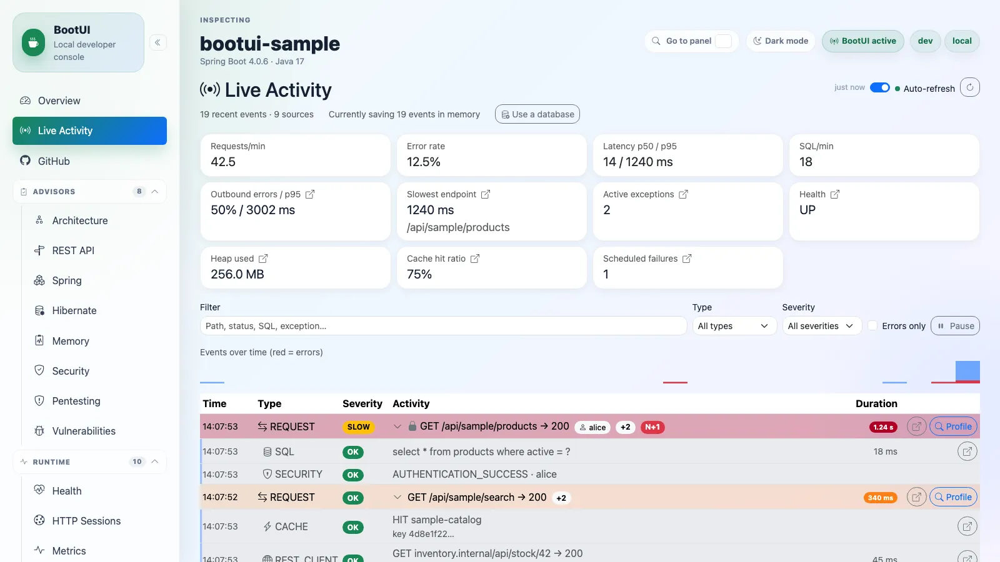

### GitHub

The GitHub panel sits in the Overview group and summarizes the current project's GitHub state from the local `origin`
remote. It uses BootUI's standard auto-refresh control with a one-minute interval while the tab is visible; the initial
refresh and each interval are bounded and blocked by the panel's read-only settings.

The panel shows repository metadata and an eight-card summary grid with click-through detail drawers for open pull
requests, open issues, the latest GitHub Actions executions, quotas, Copilot usage report availability, and the three
security signals. The open-issues drawer summarizes the label/staleness buckets and then lists the bounded set of open
issues returned by the refresh, linking each to its issue page with its author, labels, comment count, and last-updated
time (pull requests returned by the issues endpoint are excluded). GitHub Actions execution rows link to the matching
run, show the workflow, branch, event, status, and
duration, and mirror the recent-run list from the GitHub Actions page. The workflow failure count only considers the
latest execution for each workflow and branch, so older failures drop out once a later run fixes that workflow on that
branch; security signal drawers link to the matching GitHub alert pages. The Dependabot drawer additionally lists the
bounded set of open alerts with their package, ecosystem, severity, advisory ID, summary, affected range, and fixed
version (capped by `bootui.github.max-security-alerts`); code scanning and secret scanning stay count-only and never
inline secret values or vulnerable code snippets.
The quota card shows the lowest remaining quota percentage with a red-to-green threshold palette. The quota drawer is
hidden by default, renders every resource returned by GitHub's `/rate_limit` response dynamically,
highlights resources with 10% or less remaining or at quota, then adds best-effort cards for repository or owner quotas
such as Actions cache, artifacts, and Actions billing when the credential can access those endpoints. Copilot usage uses
GitHub's organization report metadata endpoint when available; BootUI shows the report window and link count only, without
downloading or exposing signed report URLs.

Credentials are read from the current device only: `GITHUB_TOKEN`, `GH_TOKEN`, or an existing `gh auth token` login. The
token is never sent to the browser, persisted by BootUI, or included in warnings; without a token, public repositories use
GitHub's unauthenticated rate limits. Refreshes are bounded by per-request timeouts, a maximum API-call budget, and a quota
safety threshold that skips optional sections before exhausting the core API quota.

On Quarkus the panel is identical, running over the same framework-neutral engine `GitHubDashboardService` and the same
`/bootui/api/github` contract. The Quarkus adapter supplies a Jackson 2 (`com.fasterxml.jackson.*`)
`GitHubClient` implementation in place of the Spring adapter's Jackson 3 one — the only difference, since Quarkus ships
Jackson 2 while Spring Boot 4 ships Jackson 3 — and reuses the shared, framework-free `DefaultGitHubTokenProvider` (env
tokens + `gh` CLI) for credentials. The same `bootui.github.*` keys and defaults bind from MicroProfile Config, panel
availability is computed the same way (the host application's working directory is a GitHub-origin git checkout on an
allow-listed API host), and the no-network-on-render rule holds: `GET /bootui/api/github` never calls GitHub, and only the
explicit `POST /bootui/api/github/refresh` action does (gated by `bootui.github.api-enabled` and the host allow-list).


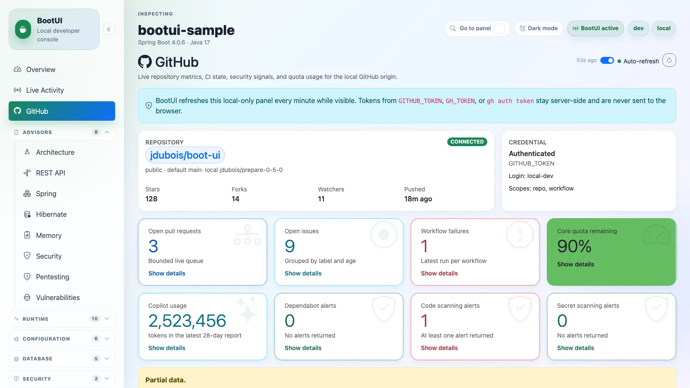

## Advisors

BootUI's advisors run explicit, on-demand rule-based scans and surface severity-ranked findings, feeding the weighted
score on the Overview dashboard. Each advisor inspects a different facet of the application — compiled architecture, the
REST layer, the live Spring context, persistence, JVM memory, and security posture — and is read-only. Once an advisor
has run, its panel shows the same 0–100 score the Overview computes for it (100 minus the weighted finding penalty), so
each panel and the dashboard always agree.

Expensive advisor actions are single-flight per scanner: a second tab, Overview card, REST caller, or MCP tool cannot
start the same scanner while it is active. Duplicate REST requests fail immediately with the shared `409` busy response
instead of waiting or repeating work; MCP reports the same message as an in-band tool error. The panel keeps the last
completed report and Overview score visible and shows the conflict as a warning. Different scanners remain independent.

Every advisor finding can be **dismissed** when it does not apply to your project. Each rule result carries a _Dismiss_
button; dismissing a rule moves it into a collapsed "Dismissed rules" list at the bottom of the panel and excludes it
from the panel's finding count, severity bars, the panel's own advisor score, and the weighted Overview score. The
panel's score recomputes immediately, and the Overview dashboard — which stays mounted in the background — re-reads the
advisor's score when you return to it, so dismissing or restoring a finding is reflected in both places. Dismissed rules
can be restored at any time from that list. Dismissals are applied server-side and persisted under the `dismissedRules`
node of a local `.bootui/boot-ui.yml` configuration file (next to the runtime overrides file), so they survive restarts
and stay consistent between each panel and the Overview dashboard. The file is developer-local and intended to be
git-ignored; rule identifiers are globally unique across advisors, so a dismissal always targets exactly one rule.

### Architecture

The Architecture panel runs a curated, zero-config [ArchUnit](https://www.archunit.org/) ruleset against the host
application's own classes at runtime. It detects the application's base package from the `@SpringBootApplication`
configuration, imports the compiled classes from that package, and evaluates a fixed set of universally-sensible
architecture hygiene rules: package cycles between slices, general coding practices (no standard streams, generic
exceptions, `java.util.logging`, JodaTime, `printStackTrace`, `System.exit`, JDK-internal APIs, legacy date/time, or
deprecated APIs, poorly named exceptions/interfaces, mutable/visible loggers, production dependencies on test
frameworks, public mutable static fields, non-final utility classes, standard-annotation (`jakarta.inject.Inject` /
`@Resource`) field injection, direct `Thread` instantiation, or message-less assertions), and Spring stereotype/proxy
heuristics (no `@Autowired`/`@Value` field injection, controllers should not depend on repositories, repositories
should not depend on controllers or services, services should not depend on controllers, services and repositories
should stay servlet-agnostic, no self-invocation or unproxyable proxy annotations, async/scheduled method signatures
should be supported, async should stay out of configuration classes, stereotypes should stay outside the default
package, `@ConfigurationProperties` classes should be immutable, and code should avoid `AopContext.currentProxy()`).
When BootUI is installed through
`bootui-spring-boot-starter`, ArchUnit is included transitively; the panel is available when a base package is resolvable
and the scan runs on demand, caching the last report.

Generic rules are necessarily less powerful than project-authored ArchUnit tests, so the panel is positioned as a
starting-point and review aid that complements — rather than replaces — a project-specific ArchUnit test suite. Each
rule is registered with a stable identifier, category, severity, and recommendation; the rule results list shows only
violating rules, sorted by severity and violation count. See
[ARCHITECTURE-CHECKS.md](ARCHITECTURE-CHECKS.md) for the full catalogue of rules and what each one inspects.

> **Not available in GraalVM native images.** The advisor scans compiled `.class` files via ArchUnit's
> `ClassFileImporter`, which is incompatible with a native executable; the panel is automatically hidden when the
> application is detected to be running as a native image.

On Quarkus the panel is identical, running the same shared ArchUnit ruleset and on-demand scan over the same report
contract — the framework-agnostic hygiene rules apply unchanged, while the Spring-stereotype rules simply find no
matching classes on a Quarkus application. Framework-sensitive proxy rules receive the active platform explicitly:
the Spring self-invocation rule is skipped because Arc supports intercepted self-invocation, while proxy visibility
follows Arc's support for static interception and final-method transformation instead of applying Spring's proxy
restrictions. On Spring, protected and package-private methods are accepted for Spring Boot's default class-based
proxies, matching Spring Framework 6+ behavior — see
[ARCHITECTURE-CHECKS.md](ARCHITECTURE-CHECKS.md) for the per-rule detail. The one platform
difference is base-package discovery: Quarkus has no
`@SpringBootApplication` to read and no reliable runtime package scan under its classloader, so the application's base
packages are discovered at **build time** from the Jandex application index and supplied to the scanner. Discovery is
single-module today (sibling modules in a multi-module build are not auto-discovered; the `bootui.internal.base-packages`
config key — a comma-separated package list — overrides it when needed). The scan still runs on demand and caches the
last report, and dismissing a rule persists to `.bootui/boot-ui.yml` exactly as on Spring Boot.

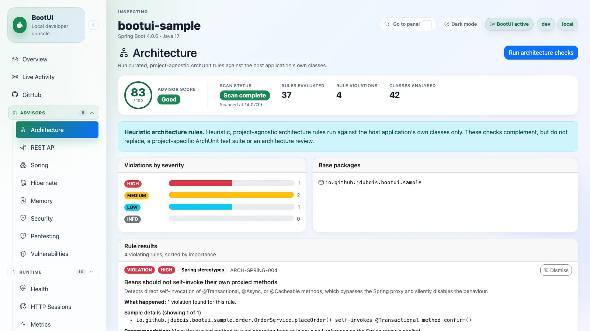

### REST API

The REST API panel runs a curated, zero-config ruleset against the host application's own web layer
(`@RestController` / `@Controller` handler methods on Spring or JAX-RS resources on Quarkus) at runtime. Like the
Architecture panel, it imports the compiled handlers from bounded application base packages and derives a read-only
model — HTTP method(s), path(s), parameters and their annotations, return type, `produces`/`consumes`, validation flags,
and declared throws. It then evaluates 53 REST best-practice rules across eight categories: routing
and HTTP-method mapping, resource naming, status codes and responses, input validation and binding, DTO and payload
contracts, pagination, versioning and content negotiation, and error handling and documentation. The `RAPI-DOC-*`
documentation rules only run when Swagger or MicroProfile OpenAPI annotations are on the host classpath.

The advisor deliberately avoids security concerns (CORS, authentication, authorization), which remain owned by the
Security panel. The scan runs on demand and caches the last report; each rule is registered with a stable
identifier, category, severity, recommendation, and a learn-more link, and the rule results list shows only flagged
rules, sorted by severity and finding count. The heuristics complement — rather than replace — an API design review or
contract testing. See [REST-API-CHECKS.md](REST-API-CHECKS.md) for the full catalogue of rules and what
each one inspects.

> **Not available in GraalVM native images.** The advisor scans compiled `.class` files via ArchUnit's
> `ClassFileImporter`, which is incompatible with a native executable; the panel is automatically hidden when the
> application is detected to be running as a native image.

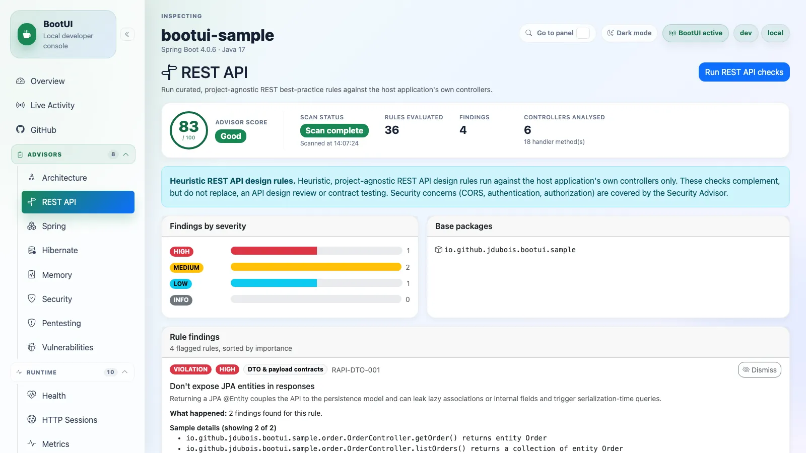

### Spring

The Spring panel runs an explicit, read-only scan of the host application's running Spring application context and
`Environment`. It takes a bounded snapshot of selected bean groups (Jackson `ObjectMapper`s, `TaskExecutor`s,
`DataSource`s) and feature flags, then evaluates a curated ruleset across bean wiring, configuration hygiene, profiles and
environment, performance and concurrency (including virtual threads), web/HTTP settings, data and persistence,
Actuator/management exposure, and reactive (WebFlux-only) checks.
Because it runs inside the
already-started application, it focuses on "started but suboptimal" states rather than fatal startup conditions. It
complements the Architecture panel, which statically analyzes compiled bytecode with ArchUnit, by inspecting the live,
wired runtime context instead. The report is a heuristic review prompt, not a verdict: it never mutates the context,
intercepts live traffic, or surfaces secrets. The ruleset detects whether the host is running the servlet (Spring MVC) or
reactive (Spring WebFlux) stack and adjusts a handful of rules accordingly — see [SPRING-CHECKS.md](SPRING-CHECKS.md) for
the full rule catalogue and remediation links.

This is a single framework-application advisor that is **relabelled per framework**: it appears as **Spring** on the
Spring Boot adapter and as **Quarkus** on the Quarkus adapter — the same menu slot, the same `/bootui/api/spring`
contract, and the same report shape. The [Quarkus](#quarkus) section below covers the Quarkus flavour.

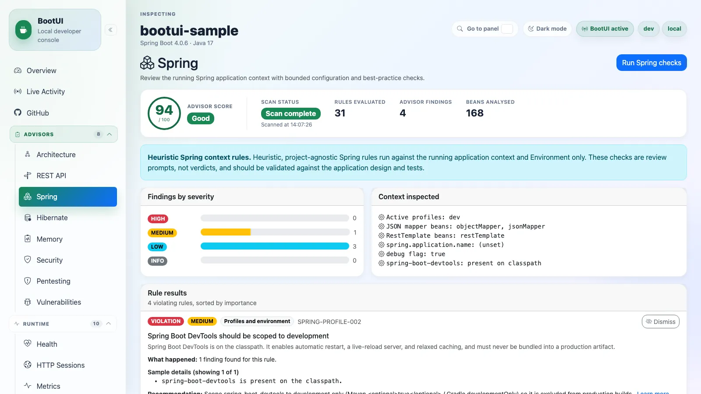

### Quarkus

On the Quarkus adapter the framework-application advisor above is relabelled **Quarkus** and runs a Quarkus-native idiom
ruleset in place of the Spring rules. It takes the same explicit, read-only approach — evaluating a curated set of checks
against the running application and its MicroProfile `Config` — but the rules target Quarkus idioms: CDI/Arc scopes and
shared mutable state on `@ApplicationScoped`/`@Singleton` beans, build-time type-safe configuration (`@ConfigProperty` vs
`@ConfigMapping`), reactive-versus-blocking endpoints, `@Scheduled` clustering, and production-profile hygiene
(destructive Hibernate schema strategies, SQL logging). It is the **same panel and menu slot** as the Spring advisor —
the same `/spring` route, `/bootui/api/spring` endpoint, and report contract — so the shared UI simply renders the
"Quarkus" label and Quarkus-flavoured copy. The report is a heuristic review prompt, not a verdict. See
[QUARKUS-ADVISOR-CHECKS.md](QUARKUS-ADVISOR-CHECKS.md) for the full rule catalogue and remediation links.

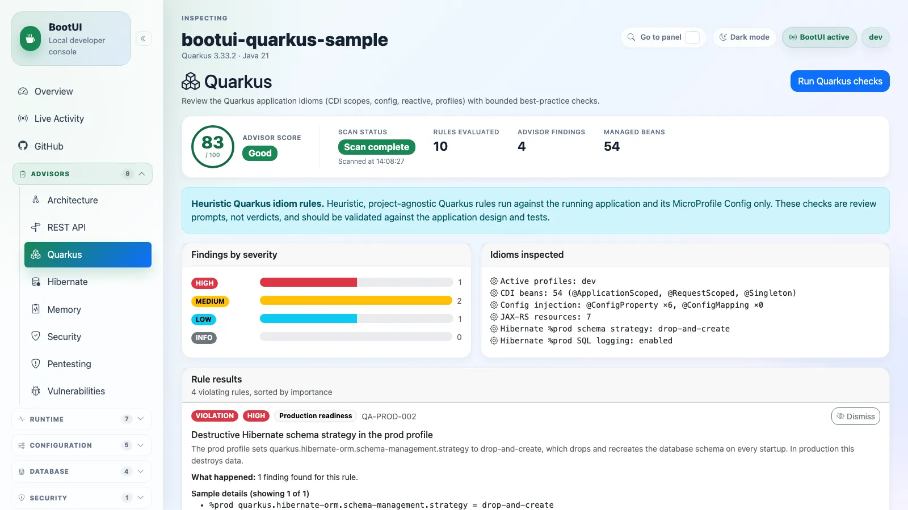

### Hibernate

The Hibernate panel runs an explicit, read-only scan against the JPA `EntityManagerFactory` metamodel when
Hibernate ORM is present. It reviews mapped entities, selected persistence configuration, and Spring Data repository
metadata for common Hibernate/JPA performance and mapping risks such as eager fetching, problematic identifier
generators, collection fetch pagination, unsafe cascades, cache misconfiguration, and risky `ddl-auto` values. The report
is framed as a review prompt, not a verdict: it never intercepts queries, invokes repositories, executes SQL, or modifies
mappings. See [HIBERNATE-CHECKS.md](HIBERNATE-CHECKS.md) for the full rule catalogue and remediation links.

On Quarkus the panel is identical, running the same shared rule engine over the same report contract when
`quarkus-hibernate-orm` is present: entities are discovered from the live JPA `EntityManagerFactory` metamodel (across
all persistence units, de-duplicated by identity), and most mapping/identifier/fetch rules apply unchanged. A few
platform differences are worth noting. First, persistence configuration is read through a key-mapping layer
(`QuarkusHibernatePropertyLookup`) that translates the Spring/native-Hibernate property names the rules expect onto
their Quarkus equivalents — `ddl-auto`/`hbm2ddl.auto` → `quarkus.hibernate-orm.schema-management.strategy` (or the
deprecated `quarkus.hibernate-orm.database.generation`, including the `drop-and-create` ↔ `create-drop` value alias),
`show-sql` → `quarkus.hibernate-orm.log.sql`, `format_sql` → `quarkus.hibernate-orm.log.format-sql`, `batch_size` →
`quarkus.hibernate-orm.jdbc.statement-batch-size`, `default_batch_fetch_size` → `quarkus.hibernate-orm.fetch.batch-size`,
`jdbc.time_zone` → `quarkus.hibernate-orm.jdbc.timezone`, `generate_statistics` → `quarkus.hibernate-orm.statistics`,
`query.in_clause_parameter_padding` → `quarkus.hibernate-orm.query.in-clause-parameter-padding`,
`query.fail_on_pagination_over_collection_fetch` →
`quarkus.hibernate-orm.query.fail-on-pagination-over-collection-fetch`, and both `cache.use_query_cache` and
`cache.use_second_level_cache` → Quarkus' single unified `quarkus.hibernate-orm.second-level-caching-enabled` toggle.
A native `quarkus.hibernate-orm.log.bind-parameters` flag is also read as the neutral bind-parameter-logging signal. For
any other `hibernate.*` key with no first-class Quarkus config option (for example `hibernate.order_inserts` /
`hibernate.order_updates`), the lookup falls back to Quarkus' generic
`quarkus.hibernate-orm.unsupported-properties."..."` escape hatch, which a live-boot test confirmed reaches Hibernate's
own bootstrapped settings. Only a handful of genuinely Hikari/Spring-specific signals stay unmapped (Hikari's
auto-commit setting, which Agroal has no equivalent for) and their INFO advisories may still cite the Spring-flavored
property name. Second, the Open-Session-in-View check is correctly **inert** on Quarkus: Quarkus has no OSIV concept,
so the effective state is always disabled and the rule never fires (on Spring a missing `spring.jpa.open-in-view`
defaults to the web-on behaviour). Third, bytecode enhancement is always considered enabled on Quarkus — it enhances
every entity unconditionally at build time with no config-based opt-out — so the two lazy-`@OneToOne` findings that
depend on enhancement being disabled never fire there. Fourth, and specific to **Panache** active-record entities:
once a Panache extension (`quarkus-hibernate-orm-panache` or `quarkus-hibernate-reactive-panache`) is on the
classpath, its build-time bytecode rewrite makes public-field access on any Hibernate-managed class behave like a
getter/setter call app-wide, so the public-persistent-field finding does not fire; and the
`@GeneratedValue`-without-strategy finding ignores the `id` field Panache's own base entity declares (an
application-declared identifier is still checked normally). Spring Data repository hints (missing-strategy-aware
`isNew()` detection for assigned identifiers) are specific to Spring Data JPA's `save()` semantics: without Spring Data
Commons on the classpath — the normal case for a Panache app, whose `persist()` has no such ambiguity — that whole
check is skipped rather than reported.

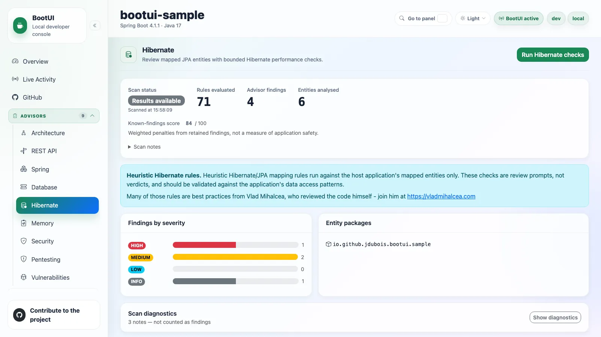

### Memory

The Memory panel runs an explicit, read-only scan over the live JVM management beans (heap and memory pools,
garbage collection, threads, loaded classes, and an optional class histogram) and turns them into severity-ranked
findings such as heap pressure, metaspace saturation, native-footprint risk inside a container, lifetime GC overhead,
thread deadlocks, and collection bloat. It complements the raw Live Memory and Threads panels by diagnosing the data they
expose. The scan is on demand and caches the last report; new rules are added as small, focused classes in the `memory`
package. See [MEMORY-CHECKS.md](MEMORY-CHECKS.md) for the full rule catalogue and remediation links.

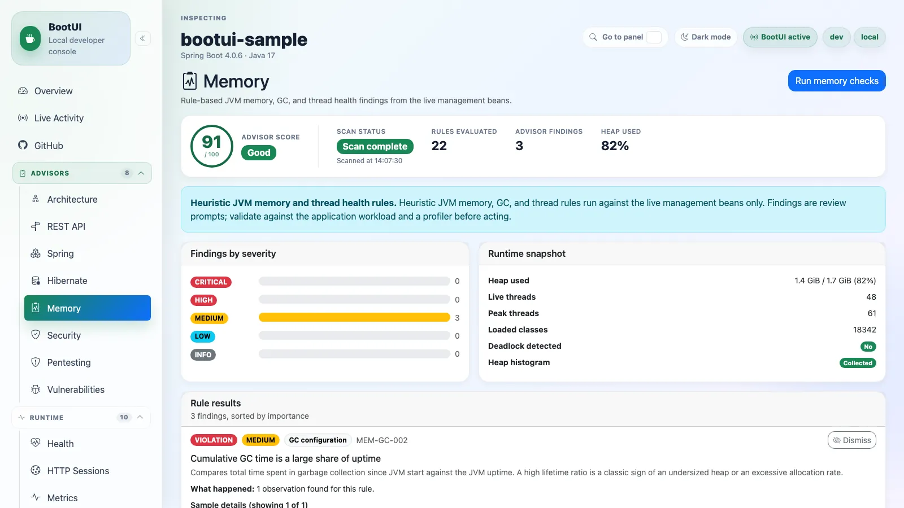

### Security

The Security panel runs an explicit, read-only scan of the host application's registered Spring Security
`SecurityFilterChain` beans and related security beans when Spring Security is on the classpath. It introspects the filter
lists, simulates an anonymous authorization decision, and inspects security-relevant beans (`PasswordEncoder`,
`CorsConfigurationSource`, `JwtDecoder`) and `Environment` properties to flag common hardening gaps across authentication,
authorization, CSRF, session management, transport/security headers, CORS, method security, actuator exposure, OAuth2
resource-server validation, and configuration hygiene. The report is framed as a review prompt, not a verdict: it never
intercepts live traffic, exposes credentials, keys, or session identifiers, or modifies the security configuration. See
[SECURITY-CHECKS.md](SECURITY-CHECKS.md) for the full rule catalogue and remediation links.

The Security advisor supports **all three** runtime security stacks from the same panel, menu slot, and
`/bootui/api/security` report contract. On **Spring Boot** it analyses Spring Security — the `SecurityFilterChain` beans
and security beans described above.

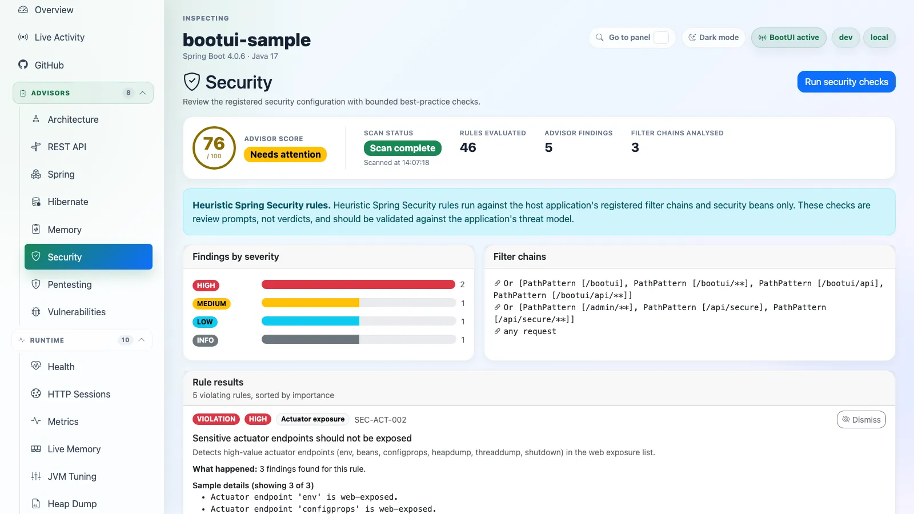

On **Quarkus** it runs a Quarkus-native ruleset instead, reading the application's HTTP permission policies, MicroProfile
`Config`, and role-annotated endpoints: Elytron/OIDC authentication, `quarkus.http.auth.permission.*` authorization, TLS
and transport policy, CORS (including the wildcard-origin-with-credentials trap), security response headers, and
`@RolesAllowed`/`@PermitAll`/`@DenyAll` usage. It surfaces the same severity-ranked review prompts, so the shared UI only
relabels the metrics ("Permission policies" in place of "Filter chains") — the panel is otherwise identical. See
[QUARKUS-CHECKS.md](QUARKUS-CHECKS.md) for the full Quarkus rule catalogue and remediation links.

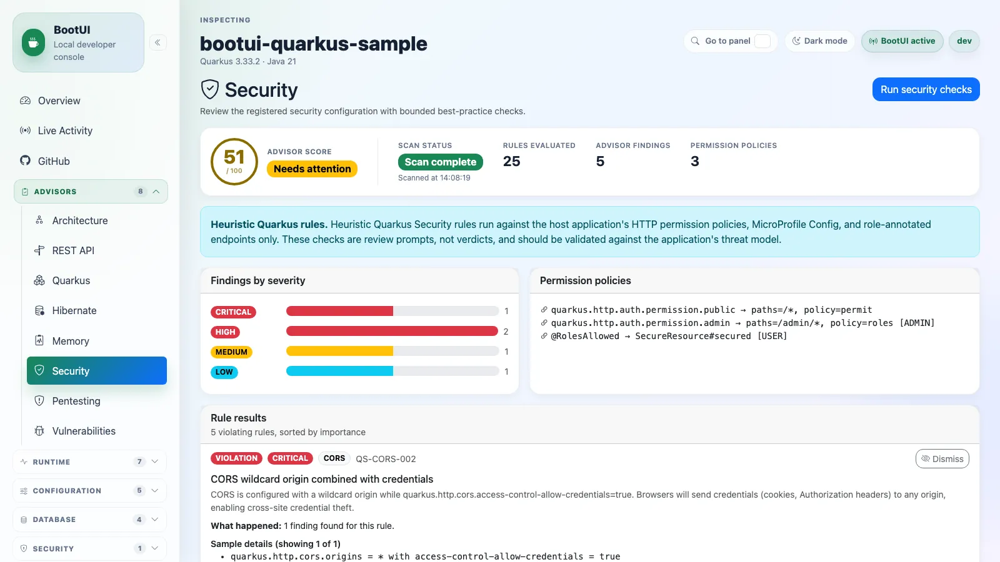

On **Spring Boot WebFlux** it evaluates a dedicated 25-rule `SEC-RXF-*` catalogue over a framework-neutral observation
of the application's `SecurityWebFilterChain` beans, reactive CORS/OAuth2 beans, and security-relevant configuration.
The Spring adapter owns collection and excludes BootUI's own permit-all chain; the shared engine owns deterministic
rule evaluation and never receives Spring types or secret values. See [WEBFLUX-SUPPORT.md](WEBFLUX-SUPPORT.md).

### Pentesting

The Pentesting panel runs explicit, local-only OWASP Top 10 2025 hygiene checks against the host application, not
BootUI's `/bootui` routes. It combines passive Spring metadata with bounded synthetic localhost requests under the
application context path for missing or unsafe security headers, CORS behavior, cookie flags, verbose error exposure,
Spring Security wiring, and actuator exposure. It also inspects Spring Boot configuration for common hardening gaps such
as wildcard actuator exposure, health detail exposure, an enabled H2 console, in-config security credentials,
value-revealing actuator endpoints, request-detail logging, and DevTools left on the classpath. It intentionally does not
sweep discovered application endpoints, send SQL/XSS/destructive payloads, or store raw response bodies. Findings are
heuristic review prompts, not proof of exploitability or a replacement for a full security assessment.

Each hygiene check is registered with a stable identifier, OWASP 2025 category, evidence source, and recommendation so
new checks can be added without expanding the scanner's HTTP surface. See [PENTEST-CHECKS.md](PENTEST-CHECKS.md) for the
full catalogue of checks and what each one inspects.

On Quarkus the panel is identical, running the same shared scanner over the same report contract and the same on-demand
`POST /bootui/api/pentesting/scan` action. The framework-neutral value comes entirely from the engine's bounded synthetic
loopback probes (missing or unsafe security headers, cookie flags, CORS, TRACE, technology disclosure, verbose error
bodies); the Quarkus adapter supplies only the inputs those probes need — the live server port (resolved per scan by the
same launch-mode-aware port supplier the HTTP Probe panel uses) and the `quarkus.http.root-path` context path. The
Spring-specific inputs are deliberately neutral: the adapter reports an **empty endpoint inventory** (a non-zero mapping
count would otherwise flag every Quarkus application as "spring-security-web is not present", a false positive), no Spring
Security wiring, and an absent Spring/Actuator configuration snapshot, so the Spring-Security and Actuator-exposure checks
stay correctly silent rather than misfiring. One honesty caveat: the OWASP coverage matrix copy is engine-owned and
Spring-worded, so a category in which nothing fired (for example A07) renders a Spring-flavored `PASS`/`REVIEW` line even
though no Spring-specific probe ran on Quarkus.

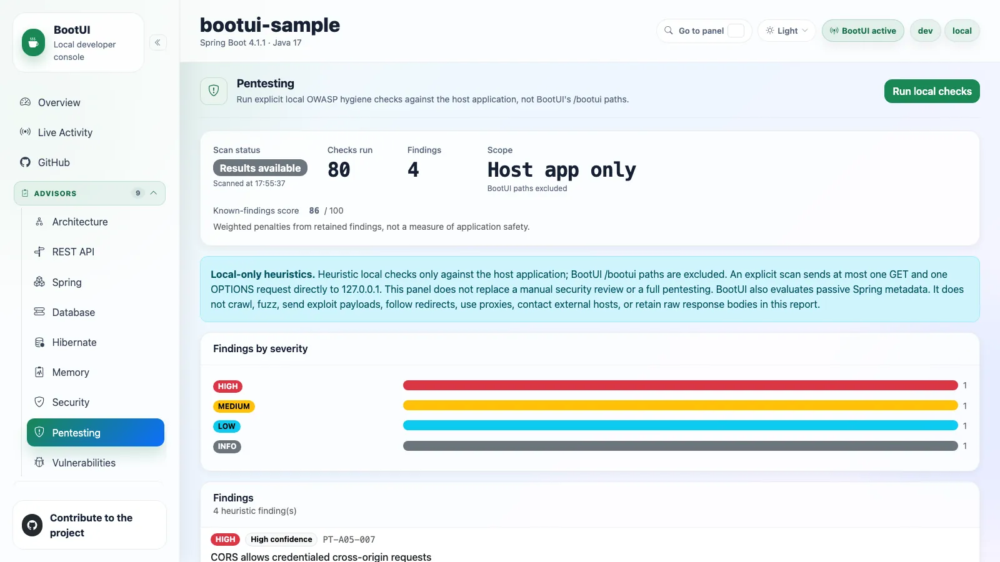

### Vulnerabilities

The Vulnerabilities panel shows dependency inventory and local OSV vulnerability scan results. It helps identify known
vulnerable dependencies from the running project's dependency set during the local development loop. Scan findings are
ordered by severity first (dismissed findings sink to the bottom regardless of severity), with dependencies and
advisories alphabetized within the same severity.

Severity is derived from [OSV.dev](https://osv.dev/)'s `severity[]` entries, whose `type` identifies how its `score`
must be interpreted. BootUI computes only `CVSS_V3` entries carrying a CVSS v3.0/v3.1 vector (for example
`CVSS:3.1/AV:N/AC:L/PR:N/UI:N/S:U/C:H/I:H/A:H`); it never treats a bare number or another provider's scale as CVSS. Per the
[OSV schema](https://ossf.github.io/osv-schema/#severity), a package-level `affected[].severity` entry — when present for
the specific dependency being scored — takes priority over the advisory's top-level `severity[]` (the schema states the
two are mutually exclusive, and some advisories only carry severity at the package level), so the scanner looks there
first before falling back to the top-level array. When an array contains multiple valid CVSS v3 entries, the highest
Base Score is used conservatively. A CVSS v3.0/v3.1 vector is parsed using the formula from the
[FIRST.org CVSS v3.1 specification](https://www.first.org/cvss/v3-1/specification-document); CVSS v4.0 has no
closed-form Base Score equation (its MacroVector lookup table is a much larger undertaking), and BootUI's calculator is
intentionally v3-specific rather than implementing the separate CVSS v2 formula, so both fall back to the advisory's
`database_specific.severity` label (`CRITICAL`/`HIGH`/`MODERATE`/`LOW`, normalized to BootUI's `MEDIUM` label) when no
v3 score is present at either level. CVSS `0.0` is reported as `NONE`, matching FIRST's qualitative scale. An advisory
with neither a parseable CVSS v3 score nor a `database_specific` label renders as `UNKNOWN` rather than being silently
dropped. Advisories carrying a `withdrawn` timestamp are excluded from results. OSV omits withdrawn records from POST
query responses but returns them from `GET /v1/vulns/{id}`, so the scanner keeps a defensive detail-stage check. A single advisory detail
fetch that fails (network hiccup, rate limiting) no longer aborts the whole scan: it is counted and the scan degrades to
`PARTIAL`, keeping every advisory that *did* fetch successfully instead of discarding the whole result. Advisory detail
fetches (`GET /v1/vulns/{id}`) run with a small bounded concurrency (up to 10 at a time) rather than one at a time, so a
dependency tree with many distinct advisories no longer risks a scan taking up to `maxAdvisories` times the request
timeout in a bad-network scenario; OSV.dev documents no rate limit for this endpoint.

OSV's `/v1/querybatch` endpoint paginates when an individual query matches more than 1,000 vulnerabilities or the whole
batch exceeds 3,000 total, returning a `next_page_token` per affected query. The scanner follows that token with
follow-up `/v1/querybatch` calls, merging every page back into one result set, bounded by a fixed page-count safety
limit so a pathological advisory can't loop the scan forever (degrading to `PARTIAL` if the bound is hit before
pagination is exhausted, rather than silently truncating). Independently, OSV also enforces a hard limit of 1,000
queries per `/v1/querybatch` request; the scanner partitions the (already `max-packages`-bounded) package list into
batches of at most 1,000 before querying, so configuring `max-packages` above 1,000 no longer causes OSV to reject the
whole batch with an HTTP 400. Every successful response must contain exactly one structurally valid result per query,
and every reported vulnerability reference must carry a non-blank id. Missing, short, or malformed result arrays fail
visibly instead of being interpreted as a clean scan. Repeated advisory
ids are fetched/reported once per dependency, and a detail response whose id does not match the requested advisory is
counted as a failed fetch. If a later query chunk fails after an earlier chunk completed, the completed results are
preserved as `PARTIAL` and `packagesScanned` reports only the completed package queries.

Each advisory whose own id or `aliases` includes a canonical `CVE-*` id is additionally enriched with
[EPSS](https://www.first.org/epss/) (Exploit Prediction Scoring System) data from FIRST.org's free, unauthenticated API
— one or more batched `GET /data/v1/epss?cve=...` requests per scan, each respecting FIRST's documented 2,000-character
maximum for the comma-separated `cve` parameter, alongside the OSV calls and following the same "network call only on
the user-initiated scan action" pattern. Returned ids must belong to the request and probability/percentile values must
be finite numbers from 0 to 1. EPSS reports the modeled probability that a CVE will be
exploited in the wild in the next 30 days, plus the percentile that probability ranks against every other scored CVE —
a likelihood-of-exploitation signal that deliberately complements (rather than replaces) CVSS's severity-if-exploited
score, and is rendered as a secondary badge next to the severity/CVSS badge (for example "2.3% EPSS", with a tooltip
spelling out the percentile). EPSS lookups can be disabled independently of OSV scanning via
`bootui.vulnerabilities.epss-enabled=false`, and a failed or unreachable EPSS request never fails the scan or discards
the OSV results — it simply omits the badge for that scan.

Each advisory also carries a derived `fixAvailable` boolean, computed by comparing the dependency's currently-resolved
version against the advisory's Maven fixed-version candidates with `ComparableVersion` qualifier ordering, including
alpha/beta/milestone/RC/SNAPSHOT/release/service-pack semantics. Git commit hashes from `GIT` ranges are not presented as
Maven upgrades, and candidates are de-duplicated and sorted using Maven semantics. The UI renders a newer candidate as
"fixed in `x.y.z`"; if every reported candidate is at or below the installed version, it says only that OSV reported no
newer fixed version, never that the installed dependency is fixed when OSV just matched it as affected. When OSV reports no
`fixed` event, the UI says only "No fixed version reported by OSV": under the OSV schema a range may instead close
with a mutually exclusive `last_affected` event, which identifies the final vulnerable version without naming the first
non-vulnerable version, so absence of `fixedVersions` is not proof that no fix exists.

Like every other advisor, a vulnerability can be **dismissed** when it does not apply to your project (already
patched downstream, accepted risk, or a fix not yet available upstream) — see the shared dismiss/restore explanation
at the top of this section. The one difference from a flat rule-based advisor is the dismissal key's shape: because a
vulnerability is scoped to one dependency, it is keyed by `<vulnerability id>::<package name>` (for example
`GHSA-xxxx-xxxx-xxxx::org.example:sample`) rather than a bare rule id, so dismissing a finding for one dependency never
accidentally hides the same advisory id reported against a different dependency, and a dismissal survives a
patch-version bump of the still-vulnerable dependency. Dismissed vulnerabilities stay visible (dimmed, with a
_Restore_ button) rather than disappearing, are excluded from the per-dependency and panel-level vulnerable counts, and
trigger a fresh deterministic dependency ordering from the recomputed active severity. Dismiss/restore controls are
disabled when the Vulnerabilities panel is read-only.

On Quarkus the panel is identical, listing the local inventory first and contacting OSV.dev only on the user-initiated
scan, over the same report contract, the same CVSS/withdrawn/partial-failure handling, the same pagination/batch-
chunking, the same EPSS enrichment, and the same dismiss/restore workflow. The one platform difference is dependency
discovery: the Spring adapter scans the classpath for `META-INF/maven/*/pom.properties`, which is unreliable under the
Quarkus runtime classloader. For JARs without embedded metadata, Spring also reads an adjacent Maven POM (including in
nonstandard local-repository paths), and only falls back to path-derived coordinates when a literal `repository`
directory makes the group path unambiguous; it never guesses a group id from an arbitrary cache path. Unreadable
individual `pom.properties` resources are logged and skipped instead of failing the complete inventory, and classpath
JAR filenames must match the resolved artifact/version exactly (with an optional classifier) rather than merely sharing
a version prefix. The Quarkus
inventory is captured at build time from the application's resolved runtime
dependency model and read back at runtime (mirroring the Architecture panel's build-time base-package discovery). The
OSV and EPSS lookups are identical, and `bootui.vulnerabilities.osv-enabled=false` /
`bootui.vulnerabilities.epss-enabled=false` disable on-demand scanning / EPSS enrichment on both adapters.

Two known limitations, documented honestly rather than hidden: the dependency inventory on both adapters is
coordinate-based (one resolved JAR = one Maven `groupId:artifactId:version`), so a vulnerable library that has been
relocated or repackaged inside a shaded/uber JAR carries no `pom.properties`/build-time coordinate of its own and is
invisible to the inventory — the same reduced-fidelity honesty precedent already applied to other panels (for example
Cache, Beans). And direct-vs-transitive dependency provenance ("introduced through") is not yet tracked on either
adapter: Quarkus could source it from its existing build-time application dependency graph, but Spring's classpath-based
inventory has no equivalent dependency graph today (adding one would need POM/Maven-plugin integration, a much larger
change), so this is deferred rather than shipped as a Quarkus-only asymmetry for now.

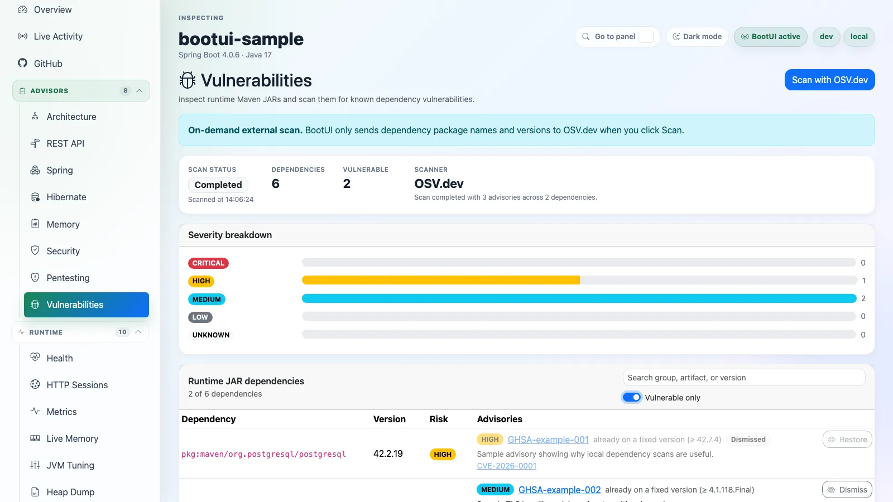

## Runtime

### Health

The Health panel displays the Actuator health tree, including nested contributors and detailed status information when
the host app exposes it. It keeps unavailable health data separate from unhealthy application state so missing Actuator
infrastructure is clear, and shows setup guidance instead of a healthy-looking status when the Actuator health endpoint
is not available. When Actuator health is present but only Spring Boot's default indicators are reported, it keeps the
live statuses visible and shows guidance for adding application or dependency health contributors.

On Quarkus the panel is identical, served over SmallRye Health (the MicroProfile Health implementation Quarkus uses): it
reads the aggregated liveness and readiness report in-process and maps each check onto the same neutral status tree, with
every check's reported data shown as nested details. When `quarkus-smallrye-health` is absent the panel stays visible and
shows setup guidance for adding it instead of a healthy-looking status. SmallRye has no fixed framework-default
contributors — every check is application-authored — so the Spring-only "default indicators only" guidance does not apply
on Quarkus.

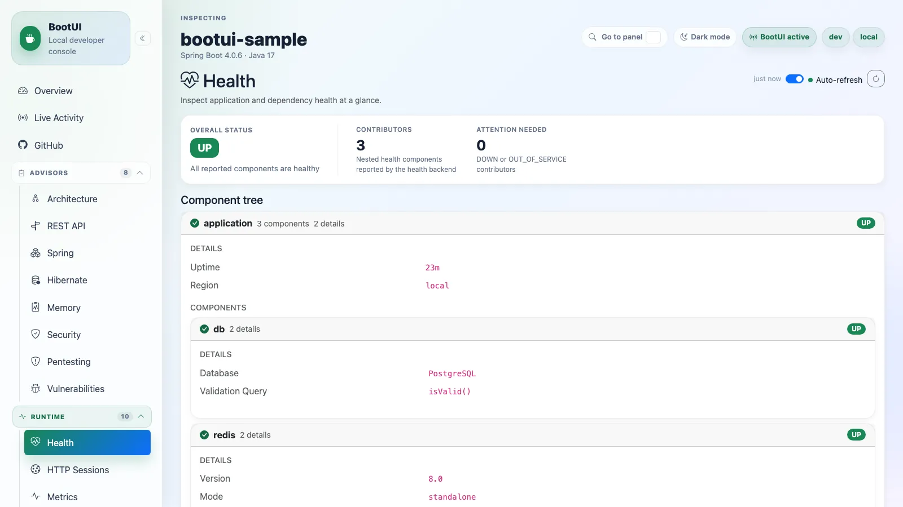

### HTTP Sessions

The HTTP Sessions panel lists local embedded Tomcat sessions with creation time, last access time, idle duration,
attribute count, and current-session highlighting. Session identifiers are treated as bearer credentials: by default the
UI only receives an opaque action key and a masked display id, and every attribute value is masked. Setting
`bootui.expose-values=FULL` reveals display ids and stringified attribute values for local troubleshooting and shows an
explicit FULL exposure warning, while `METADATA_ONLY` keeps attribute names and types without values. The panel returns
at most 50 sessions by default; raise `bootui.http-sessions.max-sessions` if a local app needs a larger bounded view.

Clear and destroy actions are confirmation-gated and disabled by global or per-panel read-only mode. Clear removes all
attributes from the selected session while keeping it valid; destroy invalidates the selected session. When the app is
not running on embedded Tomcat, the panel shows an unavailable state instead of guessing at container internals.

This panel is **deliberately not applicable on Spring Boot WebFlux**: HTTP Sessions are the servlet container's
`HttpSession` API, which has no reactive equivalent (`WebSession` is a different, non-container-managed model), so the
panel reports an honest "not applicable" reason rather than implying a port is forthcoming — the same treatment
GraalVM/CRaC get on Quarkus.

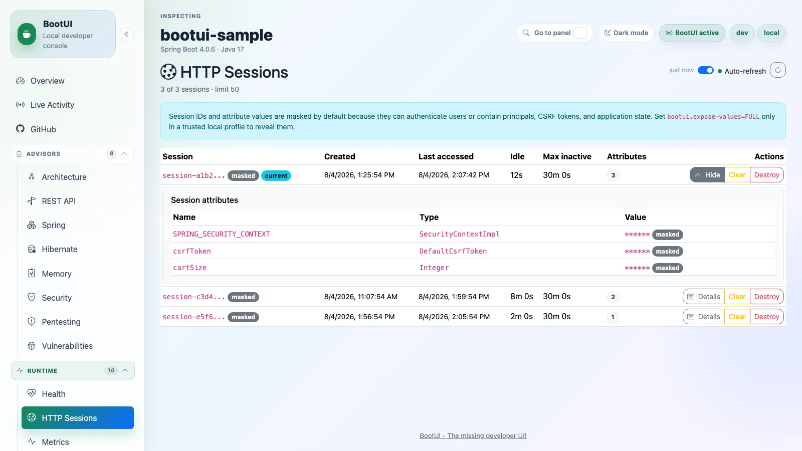

### Metrics

The Metrics panel browses Micrometer meters exposed by Actuator. You can search meter names/descriptions and filter by
meter type on the server, inspect descriptions, base units, tags and available measurements, and render a local live chart
for a selected metric/tag combination. Meter names are returned in deterministic 200-row pages (up to 1,000 per request),
while a selected meter's concrete tagged samples use 100-row pages (also capped at 1,000). The UI reports the total,
matching and displayed counts, provides load-more and sample Previous/Next controls, and keeps tag-value choices bounded to
the first 100 sorted values per key with an explicit truncation badge.

On Quarkus the panel is identical, served over Micrometer directly (Quarkus has no Actuator): it reads the live composite
`MeterRegistry` when the application adds a `quarkus-micrometer` registry (for example
`quarkus-micrometer-registry-prometheus`), and otherwise renders as unavailable while staying in the sidebar. As on Spring
Boot, meters describing BootUI's own `/bootui/**` traffic are hidden so the console never reports on itself.

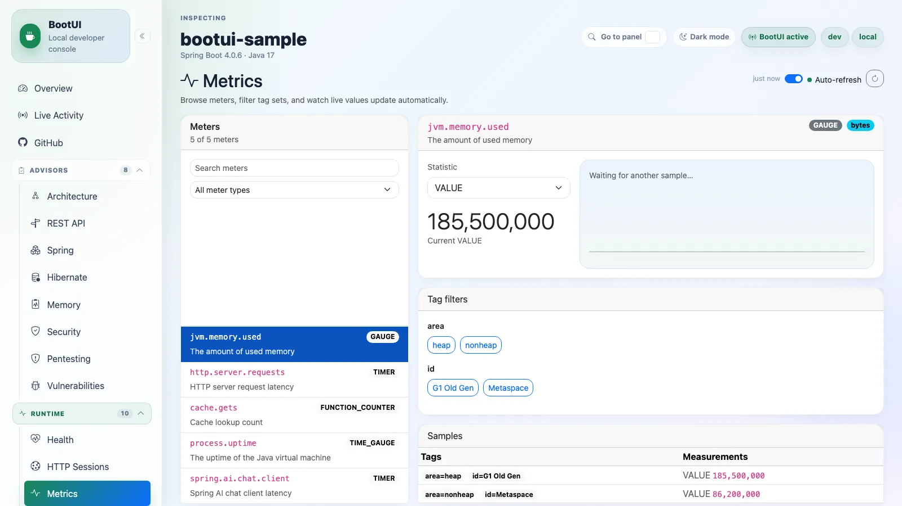

### Live Memory

The Live Memory panel summarizes current live JVM heap and non-heap usage plus memory pool utilization. It stays focused on
the running process metrics so you can spot high heap pressure, non-heap growth, and pool-level saturation without the
JVM sizing controls mixed into the view.

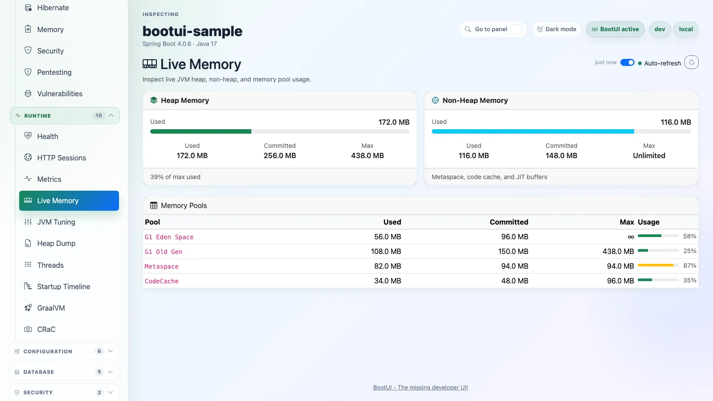

### JVM Tuning

The JVM Tuning panel uses the same live JVM context to review current JVM input arguments, explain
`spring.threads.virtual.enabled=true`, and run JVM sizing calculators for both dedicated hosts and Kubernetes. It detects
whether Spring virtual threads are enabled in the current application, shows an information or warning bubble, and feeds
that detected state into platform-thread stack budgets and heap sizing recommendations without adding the Spring property
to generated JVM or Kubernetes snippets.

The bare-metal calculator partitions a target JVM process memory budget into heap, metaspace, code cache, direct memory,
thread stacks, and headroom, then turns that plan into copyable JVM options with fixed `-Xms` and `-Xmx` values. The
Kubernetes calculator keeps `requests.memory == limits.memory` for Guaranteed QoS by default, but can switch to a
snapshot-based Burstable request when the operator intentionally overcommits memory. Its `JAVA_TOOL_OPTIONS` uses
`-XX:MaxRAMPercentage` and `-XX:InitialRAMPercentage` instead of fixed heap sizes so the JVM heap follows the container
memory limit when an operator resizes the pod. A Kubernetes health probes toggle initializes from the current health
probe configuration and, when enabled, adds startup/readiness/liveness probe YAML plus the health-probes property. Fixed
non-heap caps remain visible in the snippet and sizing notes because they still need to fit inside any smaller limit.

> **Not available in GraalVM native images.** JVM heap, GC, and flag tuning does not apply to a native executable;
> the panel is automatically hidden when the application is detected to be running as a native image.

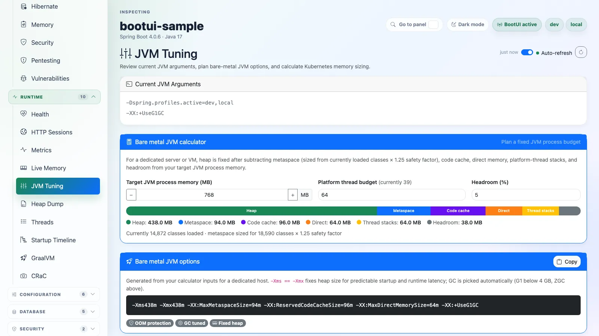

### Heap Dump

The Heap Dump panel captures local JVM heap dumps on demand and analyzes them through a value-free class histogram, so
you can investigate suspected memory leaks or unexpected retention during the local development loop. Capture and analyze
actions run an explicit, confirmed request that triggers a full GC and writes an `.hprof` file under the configured
output directory; the panel then shows live heap usage, the top retaining classes by instance count and shallow size,
and the list of captured dumps with retention-based eviction.

Capture, live analysis, and delete share one single-flight admission because they operate on the same dump directory,
histogram, and status. A conflicting action receives the canonical `409` busy response naming both the requested and
active operation; passive report reads remain available throughout.

Heap dumps can contain plaintext secrets, credentials, and personal data, so the panel is designed to be safe by
default: it only summarizes class names and sizes (never object values), all capture/analyze/delete operations are
mutating `POST` requests that are blocked when the panel is read-only, and downloading the raw `.hprof` file is disabled
unless explicitly enabled via configuration. Use it on a local JVM only, and treat any exported dump as sensitive.

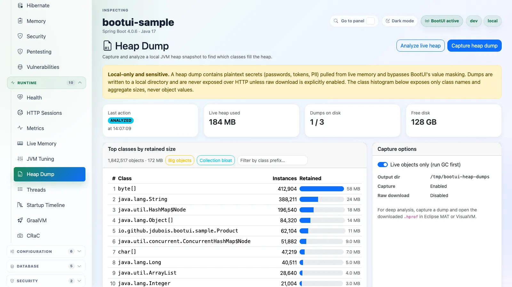

### Threads

The Threads panel shows a live snapshot of the JVM's threads so you can answer "what is the application doing right
now?" during local development. It reads thread information in-process through `ThreadMXBean` rather than requiring the
host application to expose the Actuator `threaddump` endpoint, and presents a state summary header (counts per thread
state), a flag when a deadlock is detected, and virtual-thread context when running on a JDK that supports it. The thread
list supports server-side filtering by name and by state with paging, and each row can expand to show its stack trace.

Stack frames and thread names can incidentally contain sensitive values, so the panel reuses BootUI's masking and
value-exposure model: names are masked when they look like secrets, and stack traces are omitted entirely under
metadata-only exposure. The raw text thread dump is offered as a confirmation-gated `POST` download that is blocked when
the panel is read-only. The panel stays loopback-only and fails closed, showing an explained unavailable state instead
of disappearing when thread information cannot be read.

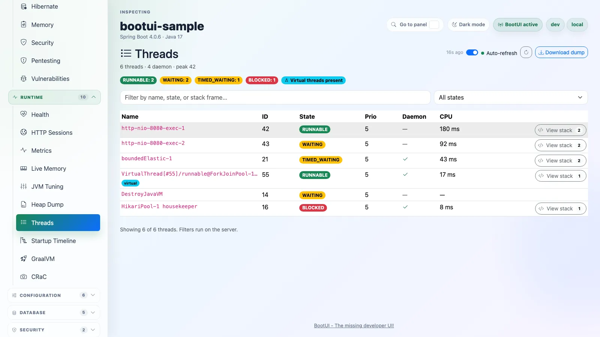

### Startup Timeline

The Startup Timeline panel visualizes Spring Boot startup steps from Actuator startup data. It helps identify expensive
startup phases, slow bean initialization, and the overall application startup shape. When BootUI is active, the starter
installs a `BufferingApplicationStartup` by default so the panel has data without host-app setup; disable that with
`bootui.startup.enabled=false` or tune the retained step count with `bootui.startup.capacity`. If startup data is still
unavailable, the panel shows an empty state instead of failing.

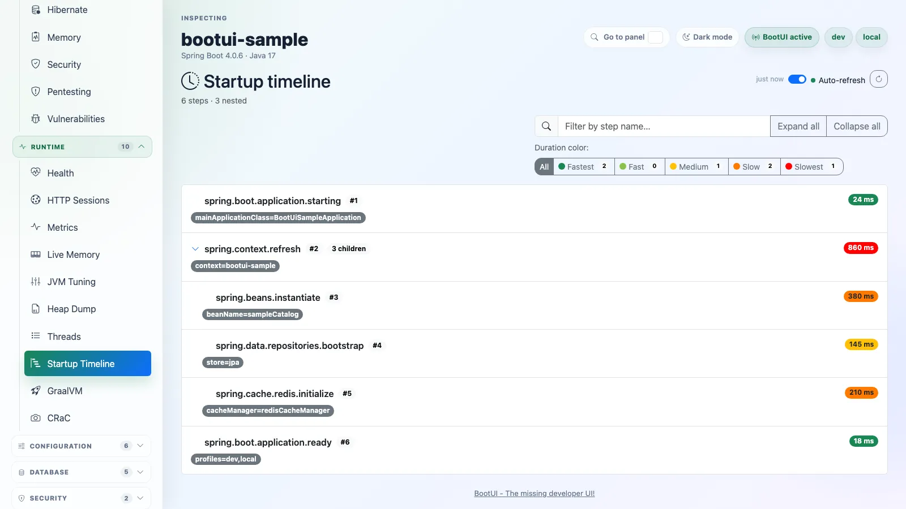

### GraalVM

The GraalVM panel surveys the host application for [GraalVM native-image](https://www.graalvm.org/latest/reference-manual/native-image/)
readiness. On demand it imports the application's own classes (bounded to the detected base package(s)) and runs **27
curated checks (22 GraalVM and 5 Spring AOT)** for constructs that native-image or Spring AOT cannot resolve reliably —
reflection, dynamic class loading, deep reflection, dynamic proxies, runtime resource loading, resource bundles,
serialization, native access, runtime class generation, classpath scanning, MethodHandles, security providers, JMX, FFM,
and Spring AOT boundaries. With the _Include dependencies_ toggle on (it is
on by default), it also surveys the classpath to report which third-party libraries already ship unified or canonical
legacy reachability metadata under `META-INF/native-image/` (arbitrary JSON is ignored), and — for libraries that do not
— looks up Oracle's
[GraalVM reachability metadata repository](https://github.com/oracle/graalvm-reachability-metadata) to show whether the
detected dependency version is `covered`, only `partial` (the repository has metadata for a different version), or has
`none`, with links to the matching repository entry and metadata file. Repository matching prefers exact tested versions
and then honors the repository's `default-for` Java regular expressions. That repository lookup is the panel's only
outbound network call; it is user-initiated, time-bounded, and can be disabled with
`bootui.graalvm.repository-lookup-enabled=false`. Long dependency lookups report progress and can be aborted from the
panel. From the same scan the panel generates a downloadable `reachability-metadata.json` scaffold
(modern unified schema, with `condition.typeReached` guards) seeded with reflection/serialization candidates and the
standard configuration resource globs. When BootUI detects the application is running from an exploded build (for
example `mvn spring-boot:run` or an IDE) rather than a packaged jar, the panel also offers a **Write into project**
action that writes the same scaffold directly to
`src/main/resources/META-INF/native-image/<groupId>/<artifactId>-additional-hints/reachability-metadata.json` (resolving
coordinates from `build-info.properties` or the project `pom.xml`, falling back to
`bootui-generated/additional-hints`). The non-clashing suffix follows Spring Boot 4.1 guidance because Spring AOT writes
generated hints to `<groupId>/<artifactId>/`. The install is
fail-closed: it is confined under `src/main/resources` and never overwrites a `reachability-metadata.json` that BootUI
did not generate. Alongside the metadata scaffold the panel also generates a tailored, multi-stage
**`Dockerfile-native`** that builds a GraalVM native image of the host application. It detects the project's build
system — Maven or Gradle, with or without the wrapper — and uses the matching native build command (`./mvnw`/`mvn
-Pnative -DskipTests clean native:compile`, or `./gradlew`/`gradle nativeCompile`), then packages the resulting executable —
named after the resolved `artifactId` — into a minimal, distroless runtime image (`gcr.io/distroless/base-debian12:nonroot`,
which runs as a non-root user and carries no shell/curl/perl/tar, keeping the OS-package CVE surface near zero; the binary
is built *mostly static* so it needs only glibc, and the build stage installs a known, pinned Maven/Gradle
release when the project has no wrapper). It can be downloaded, or written directly to the project root under the
same exploded-build constraint and the same fail-closed guard (BootUI never overwrites a `Dockerfile-native` it did not
generate). The metadata scaffold and the `Dockerfile-native` are presented in a three-drawer accordion whose default,
top drawer is an **All files** action that generates and writes both artifacts into the project's source tree in a
single step (under the same exploded-build constraint and fail-closed guards), reporting each file's outcome. After a
scan, the concerns list can be filtered in place by severity, category, or free-text search to focus on a subset of
findings without rerunning the scan. The checks and generated
metadata are heuristic review aids that complement, but do not replace, the GraalVM tracing agent and an actual native
build. See [GRAALVM-READINESS-CHECKS.md](GRAALVM-READINESS-CHECKS.md) for the full catalogue of checks and what each one
inspects.

> **Not available when already running as a GraalVM native image.** The readiness advisor scans compiled `.class` files
> to help you *prepare* an application for native-image compilation; once the application is already running as a native
> executable the advisor has no purpose, and the panel is automatically hidden.

This panel is Spring Boot only and is **deliberately not applicable on Quarkus**. Quarkus compiles native images itself
(`quarkus build -Dnative` / the native build profile) and generates its own reachability metadata at build time through
its build-time augmentation, so a Spring-oriented native-readiness advisor — and the generic `reachability-metadata.json`
and `Dockerfile-native` it scaffolds — would not match how Quarkus produces native images. The panel therefore reports an
honest "not applicable on Quarkus" reason rather than implying a port is forthcoming.

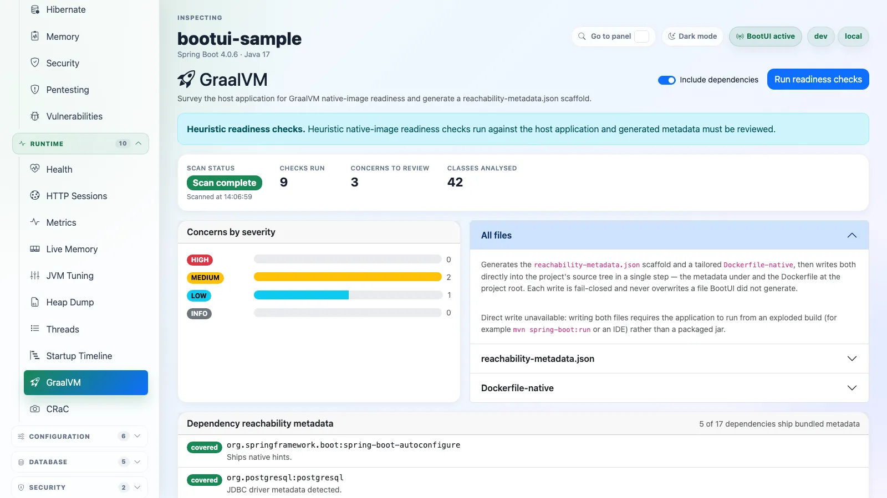

### CRaC

The CRaC panel reviews the host application's [Coordinated Restore at Checkpoint](https://docs.spring.io/spring-framework/reference/integration/checkpoint-restore.html)
readiness, combining live runtime status with a heuristic readiness advisor. The runtime-status card (always read-only)
reports whether the `org.crac` API is on the classpath, whether the running JVM is a CRaC-capable JDK (such as Azul Zulu
CRaC or BellSoft Liberica, detected via the real CRaC implementation rather than the no-op shim), whether
`spring.context.checkpoint=onRefresh` is set, and any `-XX:CRaCCheckpointTo` / `-XX:CRaCRestoreFrom` JVM arguments (read
from the same `RuntimeMXBean` input arguments the JVM Tuning panel uses). On demand the readiness advisor imports the
application's own classes (bounded to the detected base package(s)) and runs a curated set of `CRaC-*` checks for
constructs that complicate checkpoint/restore — open resources and file handles held outside a managed CRaC/Spring
lifecycle, network listeners (including NIO channels), live connection pools, cache managers, and HTTP/RPC clients,
unmanaged threads and fixed-rate scheduled tasks that may run a catch-up burst after an on-demand restore, captured
timestamps, captured environment/system configuration, Random/SecureRandom and secret state held in static or instance
fields, and a missing `org.crac.Resource` registration or `org.crac:crac` dependency. After a scan, the concerns list
can be filtered in place by severity, category, or free-text search to focus on a subset of findings without rerunning
the scan. The checks are heuristic review aids that complement, but do not replace, an actual checkpoint/restore run on
a CRaC-enabled JDK. See [CRAC-READINESS-CHECKS.md](CRAC-READINESS-CHECKS.md) for the full catalogue of checks and what
each one inspects.

The panel also generates ready-to-use container assets for the host application: a multi-stage `Dockerfile-crac` that
builds with a plain JDK and runs on a CRaC-enabled BellSoft Liberica JDK, plus the `checkpoint-and-run.sh` entrypoint it
relies on (it takes a checkpoint on the first start via `spring.context.checkpoint=onRefresh` and restores it on later
starts). The build command is tailored to the detected build system (Maven or Gradle, with or without the wrapper). Each
file can be downloaded, and — when the application is running from an exploded build (for example `mvn spring-boot:run`
or an IDE) rather than a packaged jar — written directly into the project root. Writes are fail-closed and never
overwrite a file BootUI did not generate. This shares the same source-tree writer the GraalVM panel uses for its
`Dockerfile-native`.

> **Not available in GraalVM native images.** CRaC (Coordinated Restore at Checkpoint) is a JVM-only feature and is
> mutually exclusive with native executables; the panel is automatically hidden when the application is detected to be
> running as a native image.

This panel is Spring Boot only and is **deliberately not applicable on Quarkus**. The advisor and its generated assets
target the Spring Boot startup model (`spring.context.checkpoint=onRefresh` and Spring's checkpoint/restore lifecycle),
whereas Quarkus achieves fast startup through build-time augmentation and native images rather than CRaC checkpoint/
restore. The panel therefore reports an honest "not applicable on Quarkus" reason rather than implying a port is
forthcoming.

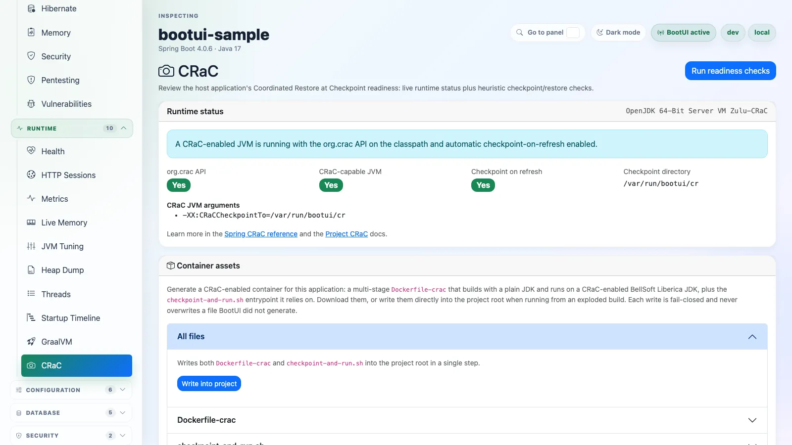

## Configuration

### Configuration

The Configuration panel shows effective configuration properties, sources, metadata descriptions, defaults when known,
active profiles, and masked values. It can create, update, and delete local runtime overrides persisted to
`.bootui/application-bootui.properties`, with restart and rebinding caveats shown for every mutation. Large property
tables load in bounded server-side pages for search, source, and override-only filters. The override property-name
picker limits its datalist suggestions while narrowing against the full metadata catalog as you type.


### Profile Diff

The Profile Diff panel compares profile-specific property sources and values. It is useful for understanding what
changes between local development profiles while still routing browser-visible names and values through BootUI's secret
masking rules.


### Loggers

The Loggers panel lists runtime logger configuration. On Spring Boot it reads from Actuator's loggers endpoint. It shows
configured and effective levels, supports server-side search, and can update or clear logger levels without restarting
the application. Large logger lists load in bounded pages while filtering still searches the full logger set.

On Quarkus the panel is identical, served over the JBoss LogManager that Quarkus uses at runtime: it enumerates the live
loggers, maps their levels onto the same canonical vocabulary (`OFF`, `FATAL`, `ERROR`, `WARN`, `INFO`, `DEBUG`,
`TRACE`), and applies level changes to the running JVM. BootUI refuses to change the level of its own loggers on either
platform.


### Beans

The Beans panel helps answer which application-managed beans exist, how they are connected, and where they came from.
It supports server-side search across
bean names and types, plus classifications such as application, Spring framework, Java/Jakarta, and other beans. BootUI's
own beans are hidden by default, and the empty BootUI classification option is omitted; when self-data filtering is
disabled they are classified separately as BootUI beans and the option appears. A labeled Graph/List segmented control
switches between the dependency visualization and the server-paged bean inventory.
When connected application beans are present, the graph selects the one with the most direct dependencies and dependents
on first open (breaking ties alphabetically) and centers its node in the scroll viewport.
Large bean lists load in bounded pages so the initial payload stays small while filters still apply to the full bean set.

**Dependency graph mode.** The panel opens on the dependency neighbourhood graph; a header toggle switches to the
server-paged list when needed. Each bean name in the list is a keyboard-accessible link back to its focused graph and
automatically selects that bean's classification. Graph mode fetches beans in bounded 1 000-row pages, up to a 2 000-bean client-side
inventory; if the inventory is larger, the panel reports both the loaded and total counts. Focus search starts with
Application beans selected while a classification control can switch the graph to Framework, BootUI, Platform, Other, or
all beans. The selected classification applies to both focus choices and rendered neighbours, so the Application graph
contains only host-application beans. A search field accepts a bean name, alias, or unique type match. The graph renders a
concentric-ring SVG showing the focused bean at the centre, its direct
dependencies (beans it depends on, coloured blue), its direct dependents (beans that depend on it, coloured green),
mutual / cycle nodes (coloured amber), and deeper-hop nodes (grey) up to three hops away and sixty nodes in total.
Zoom-out, reset, and zoom-in controls scale the graph from 60% to 200% while its scroll region keeps large layouts bounded.
Clicking any node re-focuses the graph on that bean so you can navigate the neighbourhood iteratively. When the
sixty-node or three-hop limit is hit, a notice identifies the bound and invites you to re-focus. Duplicate bean names are
combined deterministically and explained instead of silently dropping one definition. A focused-bean details area shows
type, scope, resource, aliases, definition count, and direct relationship counts. When a Spring bean's recorded classpath
resource establishes an exact configuration class, the panel queries the existing positive Conditions endpoint and shows
only matching class or method-level evidence under "Why this bean exists"; missing, disabled, failed, or unmatched
Conditions data is reported honestly instead of inferred. Graph and list implementations are split into separate loading
paths: opening the default graph does not fetch the server-paged list, and switching to the list loads it only once.
Keyboard navigation uses one graph tab stop, arrow/Home/End movement between nodes, and Enter or Space to re-focus; all
nodes carry visible focus rings and `aria-label` attributes with the full bean name. The static layout introduces no
motion, and its role colours meet contrast requirements in both light and dark themes.

**Quarkus dependency capture.** Arc resolves injection points during augmentation rather than exposing its wiring model
at runtime, so the Quarkus deployment adapter captures the retained beans' resolved injection edges after Arc validation
and emits them as a generated classpath resource. The runtime adapter overlays those edges on the live CDI inventory,
giving graph mode the same `BeanSummary.dependencies` contract as Spring. The details area still explains that Spring Boot
Conditions evidence and defining resources are unavailable on Quarkus.

On Quarkus the panel is identical from the UI's point of view, running over the same framework-neutral engine
`BeansService` and the same `/bootui/api/beans` contract. The Quarkus adapter enumerates beans from the live Arc/CDI
container (in place of the Spring adapter's Actuator beans endpoint), filters out BootUI's own beans, and classifies them
with Quarkus-aware framework prefixes (`io.quarkus.`, `io.vertx.`, `org.jboss.`, …). A few fields have reduced fidelity
because Arc does not expose them at runtime the way Actuator does: the defining `resource` is empty, the `scope` uses the CDI vocabulary (`ApplicationScoped`, `Singleton`, …) rather than Spring's
`singleton`/`prototype`, and unnamed beans get a synthetic decapitalized class name. The inventory also reflects only the
beans Arc retains, since Arc removes unused beans at build time.


### Conditions

The Conditions panel explains Spring Boot auto-configuration decisions. It groups positive matches, negative matches,
and unconditional classes so you can see why an auto-configuration applied or why it was skipped. Large condition reports
load in bounded pages, and filtering runs on the server so the browser does not need the full report before narrowing
results.


### Mappings

The Mappings panel lists HTTP routes from the running application's route table (Actuator mappings data on Spring Boot,
the JAX-RS resource table on Quarkus). It shows request methods, path patterns, handlers, and
produces/consumes metadata so the running application's web surface is visible without reading controllers manually.
Large mapping lists load through a stable, paged BootUI DTO, and the filter continues to search every discovered route
on the server.

On Quarkus the same panel is served by scanning the application's JAX-RS resources from the build-time Jandex index
(Vert.x exposes no clean runtime route-enumeration API carrying the per-route method and produces/consumes the panel
renders), then mapping each JAX-RS resource method one-to-one onto the same paged, filterable DTO the Spring adapter
serves from Actuator. `quarkus-rest` is a hard dependency of the BootUI extension, so the panel is available on both
frameworks; BootUI's own `/bootui` routes are filtered out on each.


## Database

### Database Connection Pools

The Database Connection Pools panel inspects supported JDBC connection pool beans. It is read-only and fails closed when
no supported pool implementation or pool beans are present. For each pool it shows the pool identity, masked JDBC URL and
username, driver, min/max sizing, and timeout/lifetime settings, and surfaces a clear unavailable reason for closed or
uninitialized pools. A local live chart polls bounded snapshots of active, idle, total, and pending connections every two
seconds so you can watch saturation trends without leaving BootUI. It never executes SQL, borrows connections, or resizes
pools.

On the Quarkus adapter the same panel is served over **Agroal** (Quarkus' pool library) instead of HikariCP: the shared
engine `ConnectionPoolService` and the `HikariPool*` wire contract are unchanged, and a Quarkus provider maps the live
Agroal pool configuration and `AgroalDataSourceMetrics` (active/available/awaiting counts) into the same DTO shape — so
the panel looks and behaves identically. Pool metrics require `quarkus.datasource.jdbc.metrics.enabled=true`; with metrics
disabled the pool configuration still renders but the live snapshot is marked unavailable. A few Hikari-specific fields
have no faithful Agroal equivalent and are reported as neutral defaults (per-call validation timeout, keepalive interval,
and read-only flag).

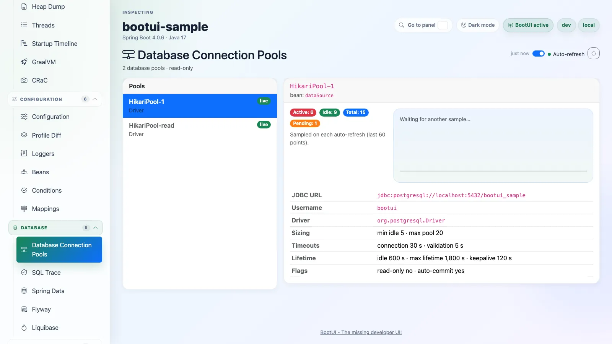

### SQL Trace

The SQL Trace panel shows the SQL statements your application recently executed, captured by a hand-written JDBC tracing
proxy built on the JDK's own dynamic-proxy support — BootUI does **not** bundle a third-party database-proxy library to
power this. When BootUI is active it transparently wraps each `DataSource` bean and intercepts statement execution on the
resulting `Connection`/`Statement`/`PreparedStatement`/`CallableStatement` objects, recording the SQL text, statement
type, SQL category (`SELECT`/`INSERT`/`UPDATE`/`DELETE`/`DDL`/`OTHER`), wall-clock duration, affected-row counts, batch
size, originating connection, executing thread, the call site in your own application code that triggered it (when
call-site capture is enabled — see below), and any failure. Spring's delegating/routing `DataSource` wrappers are
skipped so executions are not double-counted, and wrapping **fails open**: if a `DataSource` cannot be proxied it is left
untouched so application database access is never compromised.

Executions are retained in a bounded in-memory ring buffer (most recent first) alongside aggregate stats (total/average/
max time, slow-query and failure counts, per-category counters, and evictions). The panel also groups identical
statements into a "Most frequent statements" table and flags repeated `SELECT`s that look like an **N+1 access pattern**
(the repeat count is configurable via `bootui.sql-trace.n-plus-one-threshold`); a flagged group also lists the distinct
call site(s) — class, method, and line — that issued it, most-recently-seen first and bounded to a handful of entries,
so you can jump straight to the repository or service method causing the repetition. Each execution row expands to
reveal the full statement, bound parameters, statement type, connection id, executing thread, call site, and error. A
configurable slow-query threshold highlights expensive statements, and local-only **Pause/Resume** and **Clear** actions
let you stop recording without unwrapping the data source or empty the buffer.

The panel is read-mostly and privacy-conscious: parameter bindings are **not** captured by default, and even when
capture is enabled they are suppressed under metadata-only value exposure and routed through the same masking rules as
the rest of BootUI; an inline warning reminds you when captured parameters are being shown in clear text. Call-site
capture is a separate concern: a call site is metadata about your own application's code (class, method, line), never a
bound value, so it is **not** privacy-gated — `bootui.sql-trace.capture-call-site` defaults to `true` and only trades a
small, defensively-bounded stack walk per statement for the ability to see where a query came from; set it to `false`
to skip that walk entirely. It fails closed
when no `DataSource` bean is wrapped. Tracing, the initial recording state, parameter capture, call-site capture, buffer
size, the slow-query and N+1 thresholds, and SQL/parameter truncation limits are all configurable under
`bootui.sql-trace.*`.

Because the trace buffer is genuinely event-driven, the panel refreshes over **Server-Sent Events** instead of fixed-interval
polling: the browser subscribes to `/bootui/api/sql-trace/stream` and the server pushes a small coalesced notification the
moment a statement is captured, the buffer is cleared, or recording is paused/resumed, prompting the panel to re-fetch. The
push carries no data — masking, truncation, and value-exposure rules still apply through the regular endpoint — and bursts of
statements are folded into a single refresh so high-volume workloads do not flood the UI. When the auto-refresh toggle is off
or the tab is hidden the stream is closed, and the panel falls back to its initial load when Server-Sent Events are unavailable.

> **GraalVM native images are supported.** The tracing proxies are created over a fixed set of standard JDBC API
> interfaces, and those JDK proxies are registered as native-image proxy metadata by BootUI, so SQL Trace works in a
> native executable. If a proxy ever cannot be created (for example an interface set that was not registered), wrapping
> still fails open and the `DataSource` is left untraced rather than breaking application startup.

On Quarkus the panel is identical, running over the same framework-neutral engine recorder (the bounded buffer, grouping,
stats, N+1 detection, and call-site capture are byte-identical to Spring — call site capture runs once, at the single
`SqlTraceRecorder.record(...)` choke point both feeders below call into, so neither feeder needs its own stack-walking
logic). Capture comes from two complementary feeders into that one
recorder: an `@Alternative` Agroal `DataSource` that wraps the default pool with the same JDK-proxy tracer (manual JDBC
access, gated on a datasource being present), and — because Hibernate ORM resolves its pool from Agroal's own registry
and so bypasses that CDI `DataSource` — a `@PersistenceUnitExtension` Hibernate `StatementInspector` that records
ORM-issued SQL for the default persistence unit (gated on `quarkus-hibernate-orm`; SQL from a named persistence
unit is not traced). Between them the panel reaches parity with Spring regardless of
whether SQL originates from raw JDBC or the ORM. Statement text, type, category, execution count and N+1 detection are
full-fidelity; for ORM SQL the per-statement duration, affected-row count, and bound parameters are not available (the
`StatementInspector` SPI exposes only the SQL text at prepare time, with no execution-end hook), so those degrade
cleanly while never leaking ORM parameter values. Both feeders are wired in dev/test only and never in production.

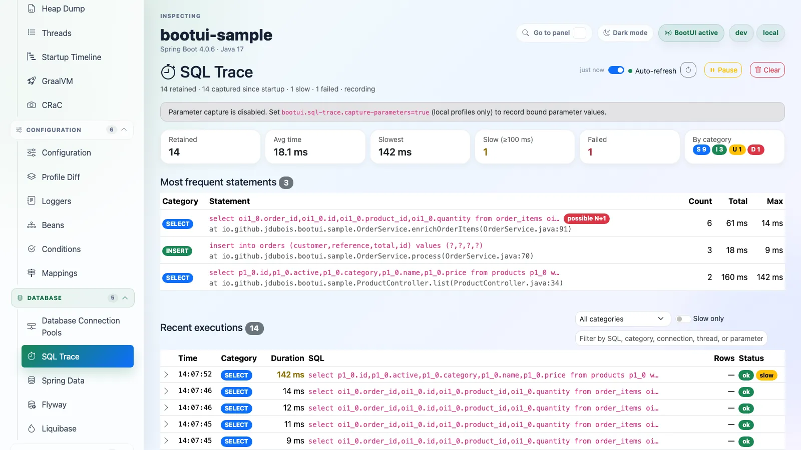

### Spring Data

The Spring Data panel inspects Spring Data repositories. It shows repository interfaces, domain types, ID types, and query
methods, and degrades to a clear empty state when Spring Data is not present or no repositories are registered.

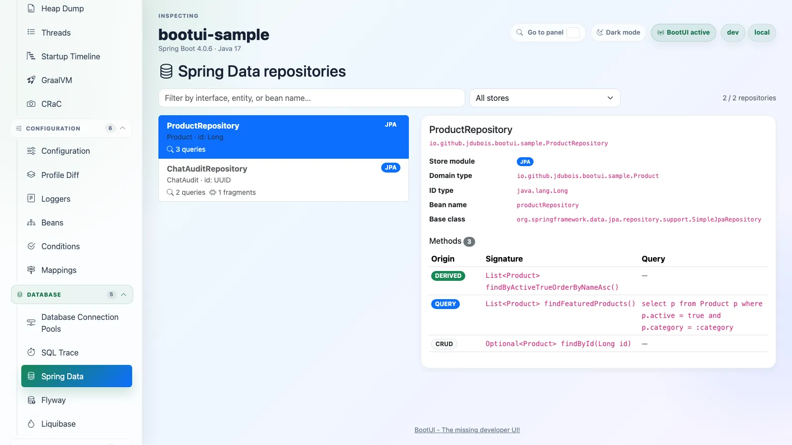

### Flyway

The Flyway panel shows schema migrations for each `Flyway` bean in the context and lists, per database, the current schema
version together with applied and pending migrations (version, description, type, script, state, installed-by,
installed-on, execution time, and checksum). Multiple or named datasources appear independently. When Spring Modulith
module-aware Flyway migrations are active, the panel shows the root and module-specific history tables separately so
module-local migrations are visible even though Spring Modulith creates those Flyway views only during migration.

The panel also exposes confirmation-gated `migrate` and `clean` actions. They are available by default for trusted local
sessions and are blocked by `bootui.read-only=true` or `bootui.panels.flyway.read-only=true`; `clean` also requires
Flyway's own `clean-disabled=false` setting. Spring Modulith module-aware entries are read-only in BootUI because their
module-specific history tables are managed by Spring Modulith's migration strategy. The panel degrades to a clear empty
state when Flyway is not on the classpath or no `Flyway` beans are present.

On Quarkus the panel is identical, running over the same framework-neutral engine `FlywayService` and the same report
contract — because both frameworks use the same `org.flywaydb.core.Flyway` library. The Quarkus adapter reads the active
`io.quarkus.flyway.runtime.FlywayContainer` beans (one per datasource, default or `@FlywayDataSource`-named) and exposes
the same confirmation-gated `migrate`/`clean` actions, with `clean` likewise honoring Flyway's disabled-by-default
setting (`quarkus.flyway.clean-disabled`). The optional `quarkus-flyway` extension is capability-gated, so when it is
absent the panel reports an honest "add the quarkus-flyway extension" reason rather than failing. The Spring Modulith
module-aware history block is Spring-specific and is not reported on Quarkus.

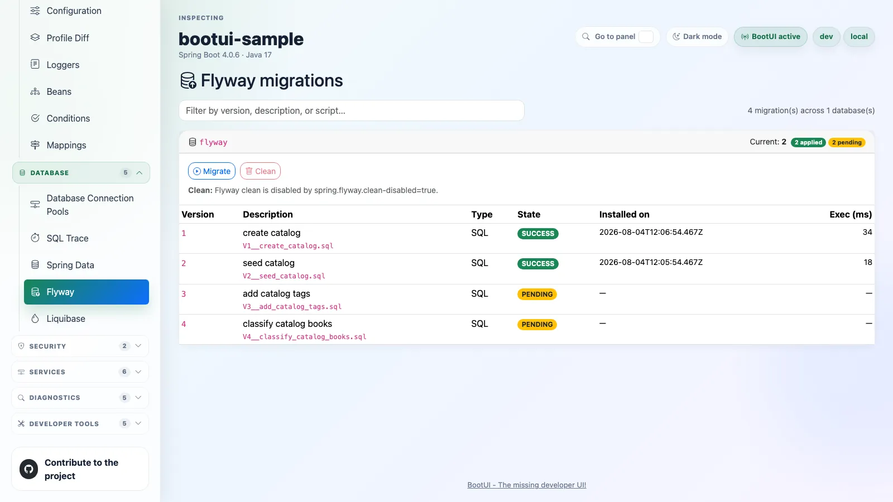

### Liquibase

The Liquibase panel shows change sets for each discovered Liquibase database (on Spring Boot, each `SpringLiquibase`
bean; on Quarkus, each active `LiquibaseFactory` — including `@LiquibaseDataSource`-named datasources). It reads the
change-log history and configured changelog, then lists applied and pending change sets per database (id, author,
change-log, description, comments, execution type, date executed, order executed, checksum, tag, deployment id,
contexts, and labels). Multiple or named datasources appear independently.

The panel also exposes a confirmation-gated `update` action that applies pending change sets. It is available by default
for trusted local sessions and is blocked by `bootui.read-only=true` or `bootui.panels.liquibase.read-only=true`
(enforced identically on Spring and Quarkus). The panel fails closed per database when its history cannot be read
and degrades to a clear empty state when Liquibase is not on the classpath or no Liquibase databases are present.

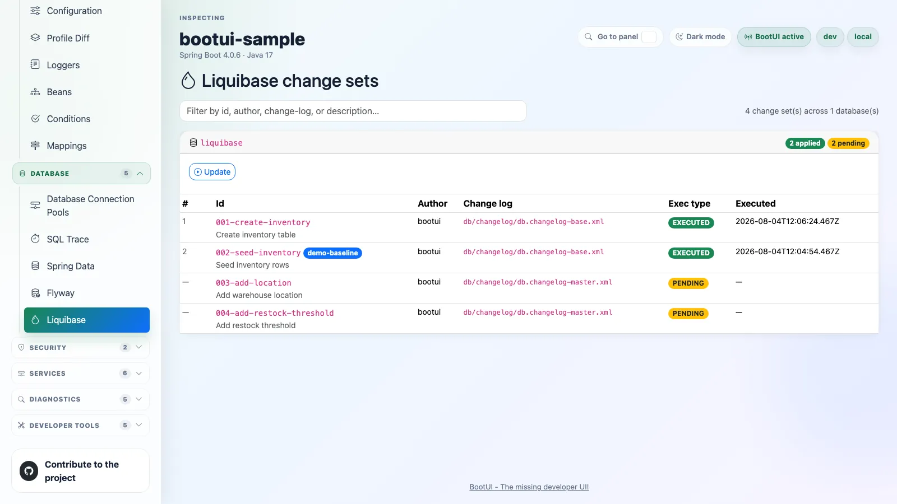

## Security

### Spring Security

The Spring Security panel inspects Spring Security filter chains and provides best-effort endpoint rule explanations. It is
meant to explain local security wiring without exposing credentials or replacing a full security audit.

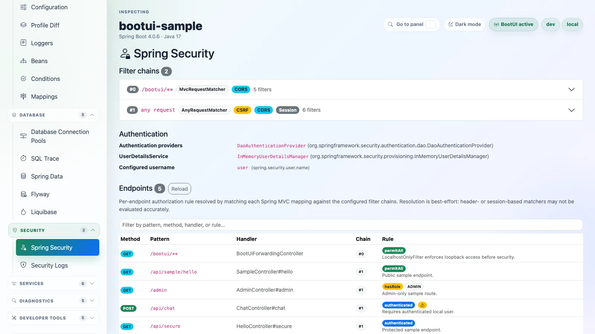

On **Spring Boot WebFlux**, the same panel reads ordered application `SecurityWebFilterChain` beans and lists their
`WebFilter` pipelines. Chain matching remains fully non-blocking and uses each chain's public reactive matcher. Explain
and annotation-endpoint authorization views use a sanitized path-and-method-only exchange: they never reuse the current
request's headers, cookies, principal, session, body, or network metadata, and mark reduced results as best effort instead
of guessing context-dependent rules. Functional `RouterFunction` routes are not listed. The compatibility
`sessionManagementPresent` signal is labelled **Security context** on WebFlux and does not claim that `WebSession`
persistence is configured. See [docs/WEBFLUX-SUPPORT.md](WEBFLUX-SUPPORT.md) for the fidelity and safety details.

### Security Logs

The Security Logs panel reads recent Spring Boot audit events from the application's `AuditEventRepository`, including
authentication successes/failures and authorization denials when Spring Security audit listeners are active. When BootUI is
active and the panel is enabled, it contributes an in-memory repository if the host app has not already defined one, which
also lets Spring Boot create its standard audit listeners. It supports filtering by principal, event type, and time window,
summarizes retained event counts by type, refreshes live over **Server-Sent Events** (the browser subscribes to
`/bootui/api/security-logs/stream` and re-fetches when the server signals a new audit event, instead of polling on a timer),
and masks sensitive event data before rendering. Responses are bounded by `bootui.security-logs.max-logs`, which defaults to
`500`; if audit support is explicitly disabled with `management.auditevents.enabled=false`, the panel remains unavailable.

On Quarkus, the panel sources its events from CDI security events (`io.quarkus.security.spi.runtime.SecurityEvent`) captured into a capped buffer instead of an `AuditEventRepository`. This is honestly partial: it requires a security extension with `quarkus.security.events.enabled=true`, and only authentication success/failure and authorization failure events are emitted — there is no Quarkus equivalent for logout/session events — otherwise the panel reports unavailable with a clear reason. Filtering, type summary, masking, and the `bootui.security-logs.max-logs` cap are identical across both frameworks.

On Spring Boot WebFlux the panel is available and identical: it reads from the same `AuditEventRepository`
abstraction, which is itself framework-neutral (Spring publishes audit events over the ordinary
`ApplicationEventPublisher`, regardless of servlet or reactive), so no reactive-specific capture code was needed
beyond wiring the same fallback in-memory repository.

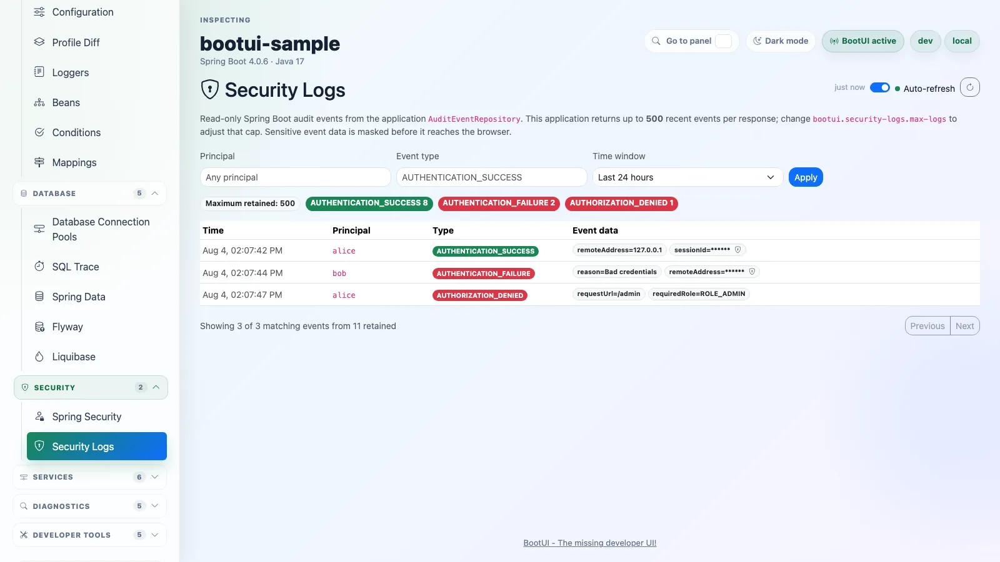

## Services

### Scheduled Tasks

The Scheduled Tasks panel lists scheduled jobs registered with Spring scheduling infrastructure. It shows task type and
trigger metadata so background activity is visible during local development.

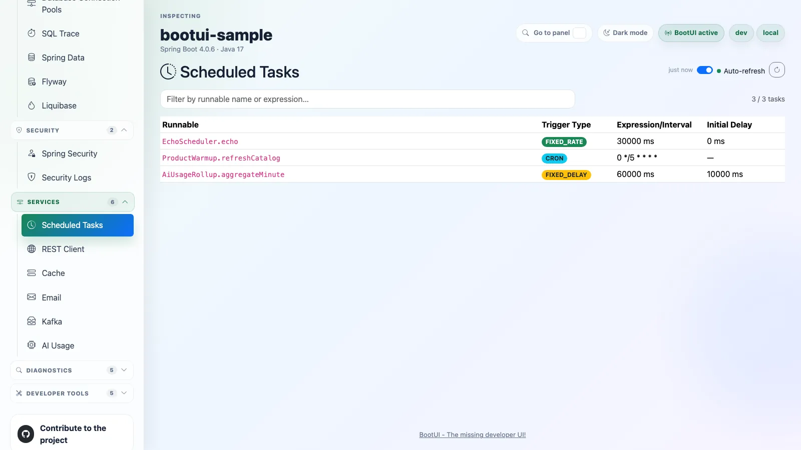

On Quarkus the panel is identical, running over the same framework-neutral engine `ScheduledTasksService` and the same
`/bootui/api/scheduled` contract. The data source differs because the runtime `io.quarkus.scheduler.Scheduler` exposes
only trigger ids and next-fire times — neither of which the shared task contract carries — while the cron/`every`
expressions and target method are known only at build time. So the Quarkus adapter captures every `@Scheduled` method
from the application's Jandex index at **build time** (the same pattern as Architecture base-package and Vulnerabilities
dependency-inventory capture) and maps it onto the same trigger/expression/initial-delay fields: a `cron` member becomes a
`CRON` row, an `every` member a `FIXED_RATE` row (with the duration parsed to milliseconds), and a `delay`/`delayed`
initial delay is carried through. The panel is available only when the `quarkus-scheduler` extension is present;
programmatic `Scheduler.newJob()` jobs are not captured (annotation-discovered tasks only).

### REST Client

The REST Client panel shows outbound HTTP calls your application recently made through Spring's own REST clients (Spring
adapter) or through Quarkus REST Client Reactive proxies (Quarkus adapter),
captured without a third-party HTTP proxy library. When BootUI is active it customizes every auto-configured `RestClient`
and `RestTemplate` with a shared `ClientHttpRequestInterceptor` (Spring) or hooks into every `@RegisterRestClient` proxy
via the MicroProfile `RestClientListener` SPI (Quarkus), recording each call's method, host, path, sanitized query string,
response status, wall-clock duration, success/failure, the client type, a trace id when one is active, the executing
thread, and, when the interception stack still exposes it, the call site in your own application code that issued it
(when call-site capture is enabled — see below). A capture failure never disrupts the
outbound call itself: both instrumentation points always let the request through and only best-effort record around it.

Calls are retained in a bounded in-memory ring buffer (most recent first) alongside aggregate stats: retained count,
average and slowest duration, a configurable slow-call count, and — unlike SQL Trace's single failure counter — two
distinct failure counts, because an outbound HTTP call can fail two different ways: **Failed** counts transport-level
failures (the call never got a response — connection refused, timeout, DNS failure), while **Error responses** counts
calls that completed with a `4xx`/`5xx` status. A per-method breakdown badges GET/POST/PUT/DELETE/other call counts, and
an "Instrumented clients" row lists which client types (`RestClient`, `RestTemplate`, `WebClient`, or
`Quarkus REST Client Reactive`) are actually wired in
the running application. The panel also groups calls by method, host, and normalized path — numeric and UUID path
segments collapse to `{id}`, so calls to `/orders/1`, `/orders/2`, … group under `/orders/{id}` — into a "Most frequent
calls" table, flagging a group at or above `bootui.rest-client-trace.chatty-call-threshold` calls as a **chatty**
(repeated-call) pattern; unlike SQL's N+1 rule, which only flags repeated `SELECT`s, a chatty pattern is flagged for
calls of *any* HTTP method, since looping a `POST`/`PUT` once per item is just as real and costly an anti-pattern as
looping a `GET`. A flagged group also lists the distinct call site(s) that issued it, most-recently-seen first and
bounded to a handful of entries. Each individual call row expands to reveal the full URI, request headers when that
adapter supports them,
client type, trace id, executing thread, call site, and error message, and can be filtered by HTTP method, a slow-only
toggle, or free text across URI, host, method, client, and thread. Local-only **Pause/Resume** and **Clear** actions let
you stop recording without removing the client instrumentation, or empty the buffer.

The panel is read-mostly and privacy-conscious. On Spring, the URI is retained and query values are masked **by name**
(the same `SecretMasker` rules the Config and HTTP Exchanges panels use); request headers are withheld by default, and
`bootui.rest-client-trace.capture-headers=true` opts into bounded, exposure-aware header capture. Quarkus is deliberately
stricter: it is always metadata-only, ignores that header property, never reads or retains request/response bodies,
arbitrary headers, authorization, cookies, credentials, or tokens, and strips URI user-info/fragments plus masks
sensitive path/query values **before storage**. Call-site
capture is a separate concern, exactly as in SQL Trace: a call site names only your own application's code (class,
method, line), never a value, so it is **not** privacy-gated — `bootui.rest-client-trace.capture-call-site` defaults to
`true` and only trades a small, defensively-bounded stack walk per call for the ability to see where it came from. On
Quarkus this attribution is best-effort because a reactive client callback can run after the application's issuing stack
has unwound. The
recorder bean itself is still registered unconditionally whenever the panel is enabled — it doubles as the source for
Live Activity's REST entries. On Spring MVC, panel-level availability mirrors the recorder's "has anything been
instrumented yet" signal. On Quarkus, the manifest is capability-driven because REST Client proxies are built lazily:
when `quarkus-rest-client` is present the panel stays visible and reports that no proxy has been initialized until the
first one is built, then its SSE stream refreshes on the first captured call. Only the customizer that
wires a given client type fails open, skipping itself entirely when that client's Spring Boot module (for example
`spring-boot-webclient`) is not on the classpath, so an app without `WebClient` simply never gets a `WebClient`
customizer rather than failing startup. Tracing, the initial recording state, header capture, call-site capture, buffer
size, the slow-call and chatty-call thresholds, and URI/header truncation limits are all configurable under
`bootui.rest-client-trace.*`.

Because the trace buffer is genuinely event-driven, the panel refreshes over **Server-Sent Events** instead of
fixed-interval polling: the browser subscribes to `/bootui/api/rest-client-trace/stream` and the server pushes a small
coalesced notification the moment a call is captured, the buffer is cleared, or recording is paused/resumed. The push
carries no data — masking and truncation rules still apply through the regular endpoint — and bursts of calls are folded
into a single refresh so high-volume workloads do not flood the UI.

Recent calls also surface in **Live Activity**, nested under the request that made them using the same trace-id-first,
serving-thread-second correlation SQL statements use, and carry a deep link back to this panel. The "chatty" grouping
above is not (yet) surfaced as a row-level badge in the merged stream the way SQL's N+1 suspicion is — it is visible only
in this panel's own "Most frequent calls" table.

**REST Client's dedicated panel is available on Spring MVC (servlet), Spring WebFlux (reactive), and Quarkus adapters.**
On Spring MVC, client calls are intercepted via `RestClientCustomizer`/`RestTemplateCustomizer` hooks. On WebFlux,
`WebClient` calls are captured through an `ExchangeFilterFunction` installed by Spring Boot's auto-configured
`WebClient.Builder`; the panel becomes available after that builder has customized a client, and its reactive
`/stream` endpoint provides the same pause/resume, clear, and live-refresh behavior without linking servlet classes.
On Quarkus, the MicroProfile
`RestClientListener` SPI (`QuarkusRestClientTraceListener`, registered via `ServiceProviderBuildItem` when
`quarkus-rest-client` capability is present) attaches a `QuarkusRestClientTraceFilter` on every proxy. The filter runs
after application request filters and before application response filters, so it brackets the transport without
replacing application customization. Quarkus reports a pre-response transport failure to the response filter with status
`0`; BootUI records that as a failed call with no invented HTTP status, while any real `4xx`/`5xx` response remains a
transport-successful error response. The same `RestClientTraceRecorder` backs both adapters, so the panel shape is
identical.

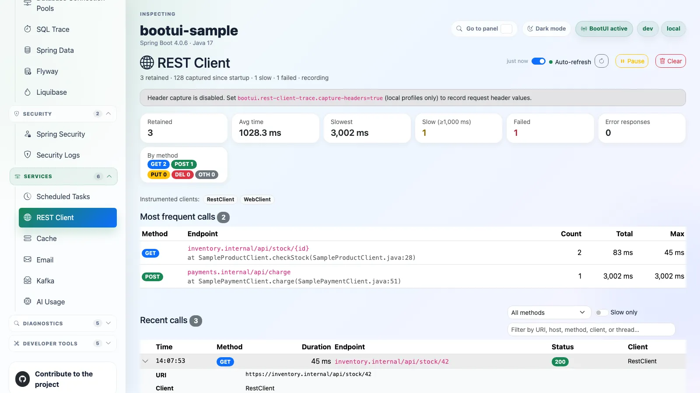

### AI Framework

The AI Framework panel summarizes Spring AI and LangChain4j activity collected from OpenTelemetry spans emitted by their
built-in
observability. It groups chat client and chat model spans by conversation so you can see request count, token usage (
prompt, completion, total), latency, model, and the prompt/response snippet when the framework is configured to capture
content (for Spring AI: `spring.ai.chat.client.observations.log-prompt`, `spring.ai.chat.observations.log-prompt`,
`spring.ai.chat.observations.log-completion`; for LangChain4j: enable GenAI message-content capture on the OpenTelemetry
instrumentation). A small inline chart shows total token usage over recent calls so you can
spot expensive interactions during local development. Vector store and embedding spans appear alongside chat spans when
present. The BootUI starter captures local application spans automatically when telemetry is enabled. Cooperating local
services can still send OTLP spans to the embedded receiver. The sidebar dims the panel when telemetry is disabled or
neither Spring AI nor LangChain4j is on the classpath, and the view
explains the unavailable state. When no framework is detected, the setup checklist also shows two side-by-side guides —
one for Spring AI and one for LangChain4j — explaining the dependency and configuration each needs to emit GenAI spans
(including optional prompt/completion content capture). When both prerequisites are ready but no chat spans have arrived
yet, the panel shows a ready empty state rather than setup guidance. Recent chats, model breakdowns, token-series
windows, spans, and attributes
are bounded so large local runs stay responsive. As with the Traces panel, data is sourced from BootUI's local telemetry
capture, is in-memory only, and is cleared on restart.

On Quarkus the AI Framework panel is identical and reads from the same in-memory telemetry store; GenAI spans are captured
when the application depends on `quarkus-opentelemetry` (for example alongside `quarkus-langchain4j`, or any
OpenTelemetry GenAI instrumentation that emits the `gen_ai.*` semantic-convention spans). When no framework is detected,
the setup checklist adapts to the platform: on Quarkus it shows a single LangChain4j guide using `quarkus-langchain4j`
plus `quarkus-opentelemetry` and BootUI's in-process capture model — no embedded OTLP receiver — instead of the Spring
AI / LangChain4j side-by-side guides.

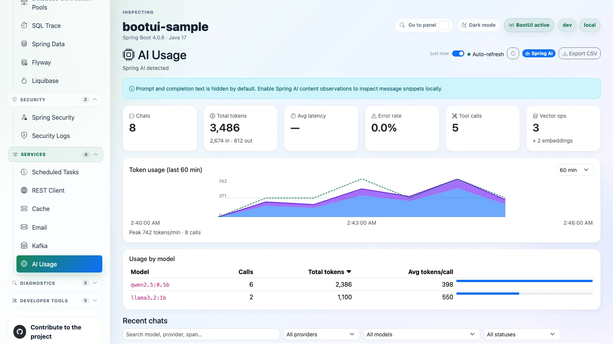

### Cache

The Cache panel inspects the application's cache infrastructure on **both** frameworks from one shared panel and report
contract: Spring's cache abstraction on Spring Boot, and `quarkus-cache` on Quarkus (covered below). On Spring Boot it
lists cache manager beans, known caches, native implementations, safe local sizes, Micrometer cache metrics when
registered, and discovered `@Cacheable`, `@CachePut`, and `@CacheEvict` operations. Cache clear actions are enabled by
default for local development, require explicit browser confirmation, and can be disabled with
`bootui.cache.clear-enabled=false`.

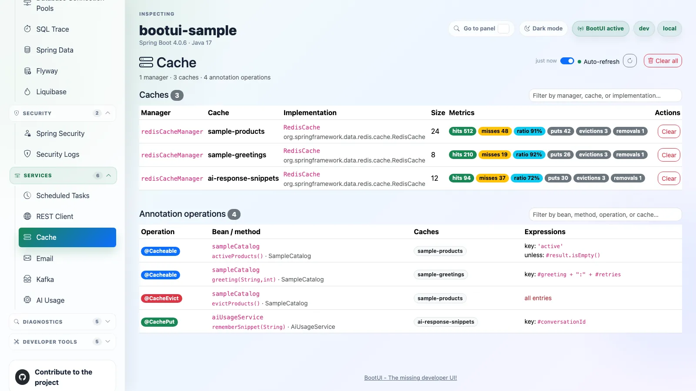

On Quarkus the same panel (kept under the shared id `cache`) is served over `quarkus-cache`: the shared engine
`CacheService` reads the live cache topology from the application's `io.quarkus.cache.CacheManager`, overlays the same
Micrometer cache metrics (when a `quarkus-micrometer` registry is present and per-cache metrics are enabled), and the
clear action evicts via `cache.invalidateAll()`. Because Quarkus binds caching with build-time annotations
(`@CacheResult`, `@CacheInvalidate`, `@CacheInvalidateAll`) woven into methods, there is no runtime registry of cached
operations, so the operations table is replaced by a short explanatory note and the panel shows cache names + metrics +
clear. The panel is gated on the `quarkus-cache` extension (the `CACHE` capability) and is reported unavailable, with a
capability hint, on applications that do not use it.

### Email

The Email panel captures outgoing application mail: it intercepts the application's
`JavaMailSender` so every outgoing `send(...)` call is recorded into a bounded ring buffer *before* delegating to the
real sender — pass-through by default, so application behaviour is unchanged. Captured messages list newest-first with
sender, recipients, subject, and attachment count; opening a message shows the parsed `from`/`to`/`cc`/`bcc`, an HTML
preview rendered in a sandboxed iframe (scripts and same-origin access are both disabled), the plain-text alternative,
and attachment metadata (name/type/size, never contents). Each message can be downloaded as a `.eml` file, and the whole
buffer can be cleared.

Recipients, subjects, and bodies are revealed by default — consistent with
BootUI's other data-capture panels (HTTP Exchanges, SQL Trace), email content is not treated as a config secret, so it
is not masked by the global `bootui.expose-values` flag. Teams that route real customer PII through a shared dev
environment can opt into masking with `bootui.email.mask-content=true`, which reuses the same name-based `SecretMasker`
heuristic as Configuration/HTTP Exchanges and is only then lifted back under `bootui.expose-values=FULL`. An optional,
explicitly opt-in **dev-trap** mode (`bootui.email.dev-trap=true`) records messages without actually sending them,
similar to MailDev/GreenMail; it is off by default so BootUI never silently swallows application mail. The panel is
available only when a `JavaMailSender` bean is present (e.g. `spring-boot-starter-mail`); otherwise it reports a clear
unavailable reason.

Each captured message's text/HTML body is truncated at `bootui.email.max-body-length` characters (default 200,000,
matching `EmailStore.DEFAULT_MAX_BODY_LENGTH`) so a single oversized message cannot spike memory before the
`bootui.email.max-entries` entry-count cap would evict it — attachment content is never captured (metadata only), so
this cap only applies to bodies.

On Quarkus the panel is identical, running over the same shared engine `EmailCaptureService` and the same
`/bootui/api/email` contract (list/detail/`.eml`/clear, with the `.eml` bytes produced by the shared engine renderer so
they match Spring's). Because Quarkus's blocking/reactive/Mutiny `Mailer` beans all funnel through one internal mailer
that fires a CDI `SentMail` event after every successful send, a single `@Observes SentMail` observer captures every
send style — the Quarkus analogue of Spring's `CapturingJavaMailSender` decorator. The panel is available when
`quarkus-mailer` is on the classpath (and dark in production); otherwise it reports a clear unavailable reason. One
behaviour differs by necessity: because the event fires *after* the send, BootUI cannot trap a message the way Spring's
dev-trap does, so on Quarkus the recorded-but-not-sent distinction reflects the framework's own mock-mail mode
(`quarkus.mailer.mock=true`, the default in dev and test) rather than a BootUI trap — the panel labels such messages
**mock** instead of **dev-trap**. Attachment sizes are shown as unknown on Quarkus, since the sent-attachment API
exposes none.

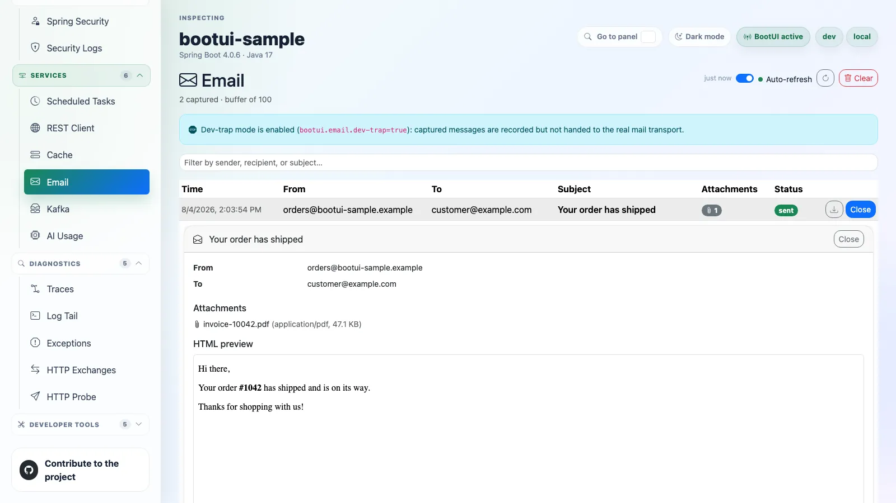

### Kafka

The Kafka panel is a dedicated, filterable view over the same producer/consumer capture that already feeds `MESSAGING`
entries into Live Activity (see above): every application-owned `KafkaTemplate` send and `@KafkaListener` consume is
recorded into a bounded ring buffer, newest-first, without altering delivery. Each row shows the timestamp, direction
(produced/consumed, with an icon), topic, partition, offset (consumed records only — a produced record's offset isn't
known at send time), a short hash of the key, processing duration (consume only; a producer send's duration is not
exposed by either framework's callback), success/failure with privacy-safe generic failure text on hover, and — for
consumed records — the consumer group id and listener identifier. As with Live Activity, **the message value/payload and
raw exception messages are never captured, only bounded metadata**, since a Kafka payload is an arbitrary, potentially
large and sensitive application object with no generic masking strategy. A text filter matches topic, key, group, and
listener, a direction filter isolates produced or consumed records, and the whole buffer can be cleared.

Capture is on by default whenever a Kafka integration is present and the panel is enabled, and is tuned through the same
`bootui.kafka.*` properties Live Activity uses (`enabled`, `capture-key`, `max-entries`, `max-key-length`) — see
`docs/PROPERTIES.md`. Turning off key capture (`bootui.kafka.capture-key=false`) is reflected in the panel with a notice
instead of blank hashes, and turning off capture entirely (`bootui.kafka.enabled=false`) leaves already-captured
messages visible with a similar notice. The panel is available only when a `KafkaTemplate` bean is present (e.g.
Spring Boot's `spring-boot-starter-kafka`); otherwise it reports a clear unavailable reason.

On Quarkus the same UI and `/bootui/api/kafka` contract (list/clear) run over the shared engine
`KafkaActivityRecorder`, with the reduced metadata exposed by SmallRye Reactive Messaging: the listener identifier is
the channel name, while consumer group id and producer duration are unavailable. The panel is available when
`quarkus-messaging-kafka` is on the classpath in a non-production launch; configured `@Incoming`/`@Outgoing` channels
determine whether it receives any activity. Incoming deliveries carry connector metadata automatically; outgoing
messages are captured only when they already carry `OutgoingKafkaRecordMetadata`, so a payload-only emission that relies
entirely on channel configuration is not recorded. Without the extension the panel reports a clear unavailable reason.

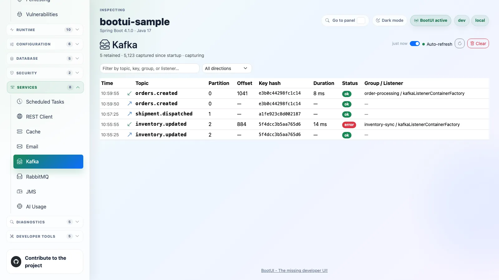

### RabbitMQ

The RabbitMQ panel is a dedicated, filterable view over AMQP publish/consume capture that also feeds `MESSAGING` entries
into Live Activity. On Spring, BootUI installs a `MessagePostProcessor` on every `RabbitTemplate` bean via the public
`addBeforePublishPostProcessors` API and prepends a `MethodInterceptor` to every
`AbstractRabbitListenerContainerFactory`'s advice chain — composing with, not replacing, any existing post-processors or
advice. On Quarkus, it hooks SmallRye Reactive Messaging's `OutgoingInterceptor`/`IncomingInterceptor` SPI, so the same
`RabbitActivityRecorder` is fed from either framework. Each row shows timestamp, direction (PUBLISH/CONSUME, with an
icon), exchange, routing key, queue (consume side), processing duration (consume only — a publish's duration is not
exposed without publisher confirms), and success/failure. Spring publishes are captured at the supported before-publish
hook and therefore represent a publish attempt; Quarkus publish ack/nack and both consumer paths represent terminal
outcomes. When `capture-correlation-id` is
enabled (opt-in, default `false`), a truncated SHA-256 hash of the correlation ID is shown. **The message body/payload
and arbitrary headers are never captured** — only bounded routing metadata, timing, and success/failure are retained;
failure text is generic so framework exception messages cannot leak payload or credential data.

Capture is on by default whenever a RabbitMQ integration is present and the panel is enabled, and is tuned via
`bootui.rabbitmq.enabled`, `bootui.rabbitmq.capture-correlation-id`, `bootui.rabbitmq.max-entries`, and
`bootui.rabbitmq.max-correlation-id-length` — see `docs/PROPERTIES.md`. The panel is available when a `RabbitTemplate`
bean is present (e.g. `spring-rabbit` / `spring-boot-starter-amqp`); otherwise it reports a clear unavailable reason.

On Quarkus the same UI and `/bootui/api/rabbitmq` contract (list/clear) run over the shared engine
`RabbitActivityRecorder`. SmallRye does not expose a producer exchange, consumer queue, or producer duration at these
callbacks, so those per-message fields render as unavailable; routing key, outcome, and opt-in correlation-ID hash
remain available. The panel is available when `quarkus-messaging-rabbitmq` is on the classpath in a non-production
launch. Incoming deliveries carry connector metadata automatically; outgoing messages are captured only when they
already carry `OutgoingRabbitMQMetadata`, so a payload-only emission that relies entirely on channel configuration is
not recorded. Without the extension the panel reports a clear unavailable reason.

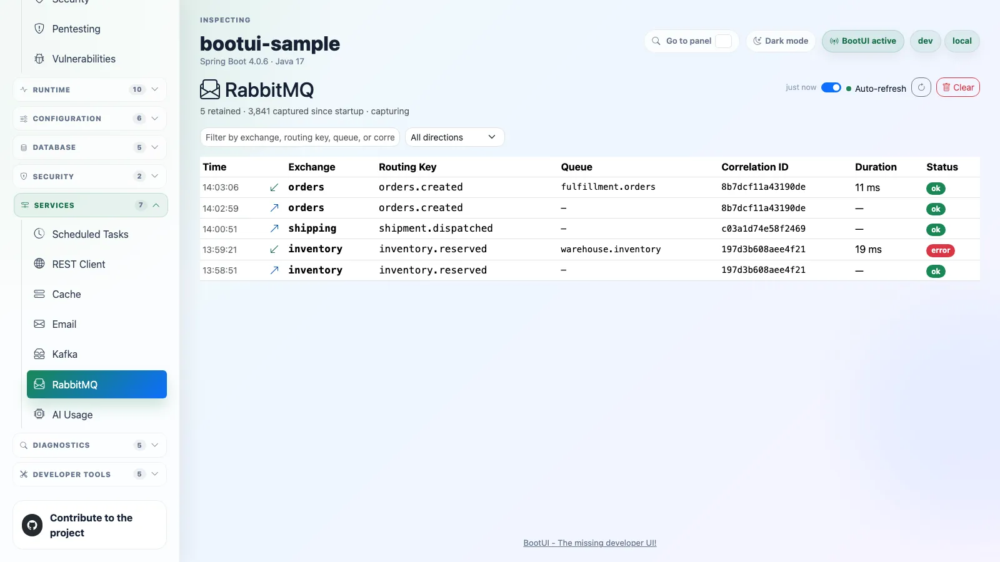

### JMS

The JMS panel is the dedicated, filterable view over the Spring JMS producer/consumer capture that also feeds
`MESSAGING` entries into Live Activity. It lists retained messages newest-first with their direction, sanitized queue or
topic destination, processing duration, success/failure, subscription and listener identifiers, and—when enabled—a short
SHA-256 hash of the provider-assigned message ID. The message payload, arbitrary headers/properties, raw message ID, and
exception message are never captured.

Capture uses the same `JmsActivityRecorder` as Live Activity, so both surfaces stay synchronized and clearing the panel
also clears retained JMS entries from the merged feed. Filter by destination, message-ID hash, subscription, listener, or
failure type; narrow the table to produced or consumed messages; and use the confirmation-gated clear action to reset the
bounded buffer. `bootui.jms.enabled`, `bootui.jms.capture-message-id`, `bootui.jms.max-entries`, and
`bootui.jms.max-message-id-length` configure both surfaces. The panel is available when a `JmsTemplate` bean is present
(for example through Spring Boot's Artemis starter); otherwise it remains visible with a clear unavailable reason.

JMS capture is currently Spring-only. On Quarkus the shared route remains visible but reports the panel not yet available;
BootUI directs Quarkus applications to the Kafka and RabbitMQ panels backed by Reactive Messaging instead. The Spring
interception uses runtime class proxies, so the JMS panel reports unavailable in a GraalVM native image rather than
claiming capture is active when those proxies cannot be generated.

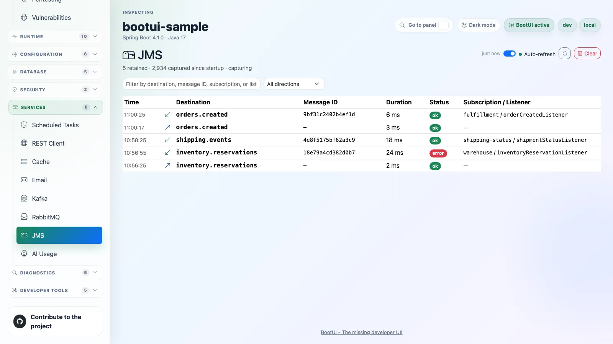

## Diagnostics

### Traces

The Traces panel shows distributed tracing spans captured locally by the BootUI starter when telemetry and the Traces
panel are enabled. The starter contributes the tracing dependencies and sampling default needed for local development, so
the host application does not need manual `management.*` tracing properties. Because that default raises sampling to
100% (`management.tracing.sampling.probability=1.0`), the OpenTelemetry SDK and Micrometer Tracing span/propagation code
runs on every request; to keep that from flooding the console when the host's root logger is at `DEBUG`, BootUI also
pins `logging.level.io.opentelemetry` and `logging.level.io.micrometer.tracing` to `INFO` as overridable defaults (set
either key yourself to opt back in). BootUI also keeps an embedded OTLP/HTTP
receiver at `/bootui/api/otlp/v1/traces` so cooperating local services can export spans into the same in-memory store.
The list shows the most recent traces with service name, the HTTP request path each trace served (falling back to the
root span name when no path attribute is present), status, duration, and span count; opening a trace
renders a waterfall view of its spans so you can see latency contributions, errors, and parent/child relationships across
services. Traces emitted by BootUI's own API are filtered out on ingestion by default: as soon as any span in a trace is
recognized as BootUI traffic (for example the path-bearing HTTP server span for `/bootui/api/**`), the whole trace is
dropped, including nested spans that carry no path of their own such as Spring Security `security filterchain
before`/`after` observations. Retained self-only traces are also hidden from the panel, to keep the view focused on
application traffic. Span ingestion can be tuned with
`bootui.telemetry.exclude-self-spans=false`; read-time panel filtering follows `bootui.monitoring.exclude-self`. When
`bootui.telemetry.enabled=false`, the sidebar dims the panel and the view shows a disabled state instead of implying that
tracing is merely empty. The in-memory trace buffer is bounded by `bootui.telemetry.max-traces`,
`bootui.telemetry.max-spans-per-trace`, request-size limits, and attribute-value truncation, with additional internal
caps to keep misconfigured local exporters from overflowing the UI. Trace data is reset on application restart or via
the panel's clear action.

The capture mechanics above (starter-contributed tracing dependencies, the `management.tracing.sampling.probability`
default, and the `logging.level.io.opentelemetry`/`io.micrometer.tracing` pins) and the embedded OTLP/HTTP receiver are
specific to the Spring Boot starter. On Quarkus the same Traces panel and in-memory store are served by the extension,
but spans are captured **in-process** through an OpenTelemetry `SpanProcessor` that is registered only when the
application depends on `quarkus-opentelemetry` — there is no embedded OTLP receiver. Self-span filtering and the
`bootui.telemetry.*` retention bounds behave identically on both platforms. The panel's empty-state guidance adapts too:
on Quarkus it points to `quarkus-opentelemetry` and the in-process capture model rather than the embedded
`/bootui/api/otlp/v1/traces` receiver.

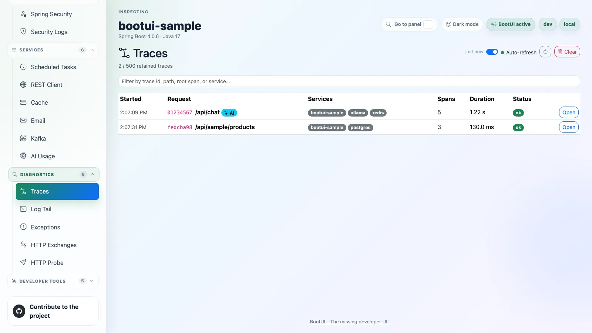

### Log Tail

The Log Tail panel reads recent local application logs and streams new log events from the running process. It is
intended for quick local diagnosis without leaving the BootUI console.

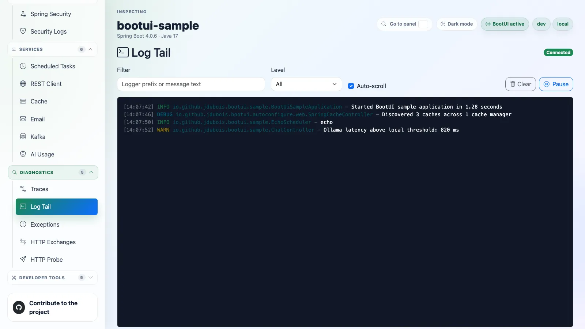

### Exceptions

The Exceptions panel captures exceptions thrown by the running application and groups repeated failures into a single
entry with an occurrence count. BootUI records exceptions from two
complementary sources while it is active: a non-intrusive Spring MVC `HandlerExceptionResolver` that observes exceptions
escaping web request handlers (capturing the request method, path, and handler), and a logback appender that picks up
anything logged with a throwable from scheduled tasks, async work, or `log.error("…", ex)` calls. A failure that is both
handled and logged is de-duplicated by throwable identity so it is counted only once.

Exceptions are grouped by a stable fingerprint derived from the exception type and the top stack frames, so a recurring
error collapses into one row showing its type, latest message, first/last seen times, originating location, and total
count. Opening a group shows the representative stack trace with application frames highlighted, the full cause chain
(`Caused by: …` with `… N more` common-frame folding), and the most recent occurrences with their thread, source, and
request context. The list updates live over **Server-Sent Events** — the browser subscribes to `/bootui/api/exceptions/stream`
and re-fetches whenever an exception is captured or the store is cleared, rather than polling on a fixed interval — and can be
filtered by text, by capture source (web vs. logged), or to application-originated exceptions only.

On top of that existing grouping, each group carries a Sentry-style triage status — **Open** (the default for every new
group), **Acknowledged** (seen, still being investigated), or **Resolved** (believed fixed) — shown as a badge on the row
and changed inline with a button group, the same one-click convention used by the Loggers panel's per-logger level
setter. Changing status calls `POST /bootui/api/exceptions/{id}/status` with `{"status": "..."}`, validated against the
three values (400 on anything else, 404 for an unknown group), and returns the updated group. If a group marked
**Resolved** throws again, BootUI treats this as a regression: the group automatically reopens to **Open** and a
lifetime "Reopened ×N" counter is incremented and surfaced next to the status badge, so a developer immediately sees
that a failure they thought was fixed has come back. An **Acknowledged** group does not auto-transition on new
occurrences — it keeps accumulating its count and last-seen time, since the developer already knows about it and
hasn't claimed it's fixed; only a **Resolved** group can regress. An optional status filter (All/Open/Acknowledged/
Resolved) narrows the list alongside the existing text/source filters.

Exception messages follow the same exposure policy as the rest of BootUI: they are scrubbed of secret-like
`key=value` assignments under the default `bootui.expose-values=MASKED`, omitted entirely under `METADATA_ONLY`, and shown
verbatim only under `FULL`. Request paths are captured without their query string so query-string secrets are never
surfaced, and stack frames carry only class/method/file/line information. The in-memory store is bounded by
`bootui.exceptions.max-groups` (default 100, evicting the least-recently-seen group), `bootui.exceptions.max-occurrences-per-group`
(default 25), and `bootui.exceptions.max-stack-frames` (default 50), and is reset on application restart or via the
panel's clear action. The panel can be disabled with `bootui.panels.exceptions.enabled=false`, and clearing honors the
panel's read-only setting.

On Quarkus the panel is identical, running over the same framework-neutral engine store and `ExceptionsService`, so
the wire is byte-identical to Spring. In place of the MVC resolver and logback appender, capture comes from two
complementary sources: a `java.util.logging` handler that records anything logged with a throwable (excluding BootUI's
own loggers), and a Vert.x failure handler that records the throwable escaping a failed request with its method and
path. The shared store still de-duplicates by throwable identity across the cause chain, so a failure seen by both
sources is counted once. Capture is installed on `StartupEvent` and detached on `ShutdownEvent`, wired in dev/test
only and never in production, and bounded by the same `bootui.exceptions.*` limits. The triage workflow and regression
detection above are engine-level, so they behave identically on Quarkus: `ExceptionsResource` exposes the same
`POST /bootui/api/exceptions/{id}/status` endpoint with the same validation and status codes.

On Spring Boot WebFlux the panel is available too, capturing into the same `ExceptionStore` over the same
`GET /bootui/api/exceptions`/SSE contract and the same triage workflow. In place of the MVC `HandlerExceptionResolver`,
capture comes from a `WebExceptionHandler` at the highest precedence, plus the same logback appender used on the
servlet adapter. One honest, documented fidelity gap: a `@RestController`'s own local `@ExceptionHandler` method
consumes an exception *inside* the WebFlux dispatch pipeline, before any `WebExceptionHandler` sees it — narrower than
the servlet adapter's resolver-chain-based capture, which observes `@ExceptionHandler`-resolved exceptions too.
Unhandled exceptions (the common case) are captured identically on both stacks; see
[docs/WEBFLUX-SUPPORT.md](WEBFLUX-SUPPORT.md) for detail.

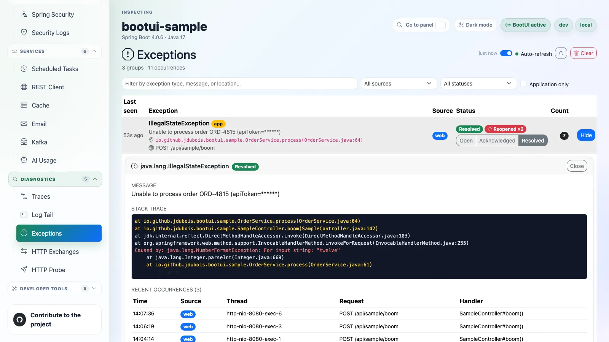

### HTTP Exchanges

The HTTP Exchanges panel records recent inbound requests handled by the running application. It lists timestamp, method,
path, status, duration, response size when a `Content-Length` header is present, and trace identifiers from common
propagation headers. Expanding a row shows request and response headers, with secret-like headers and query parameters
masked unless `bootui.expose-values=FULL` is explicitly configured. BootUI self-requests are hidden from the panel by
default through `bootui.monitoring.exclude-self`, though they still count against the bounded in-memory recorder.

BootUI contributes an in-memory `HttpExchangeRepository` when the panel is enabled and no application repository already
exists. The default buffer retains 200 exchanges and can be changed with `bootui.http-exchanges.max-exchanges`; changing
that capacity requires an application restart. If the repository is unavailable, the panel shows a clear unavailable
state instead of implying that no traffic has occurred.

On Quarkus the panel is identical, but Quarkus has no Actuator `HttpExchangeRepository`, so capture is done by a small
Vert.x route filter that samples each completed request — recorded in the response body-end handler so status, duration
and size are final — into a capped, framework-neutral ring buffer sized by the same `bootui.http-exchanges.max-exchanges` key (default 200) as Spring. The
masking, trace-id extraction, self-exclusion and paging run through the same shared engine service, so the wire is
byte-identical to Spring. Capture is wired in dev/test only and never in production.

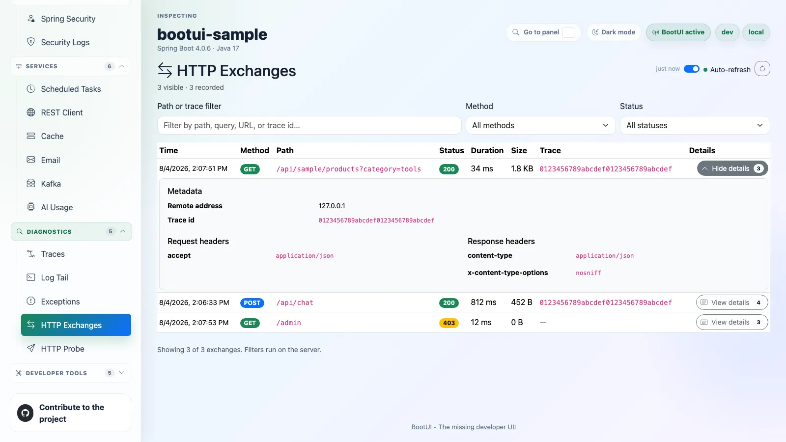

### HTTP Probe

The HTTP Probe panel sends local-only requests to the running application and displays response status, headers,
duration, and body. It is designed for quick route checks from inside the same local development context as BootUI.

On Quarkus the panel is identical: the probe always targets the application's *own* loopback address, so it can never
reach an external host. The only platform difference is how the live local port is resolved — Quarkus has no single
config key that always equals the bound port, so the adapter selects `quarkus.http.test-port` or `quarkus.http.port` by
launch mode (and a random `=0` port still resolves, because Quarkus rewrites the property to the actual port once the
server is up). As a state-changing action it is gated by the same localhost-only safety floor as every other write.

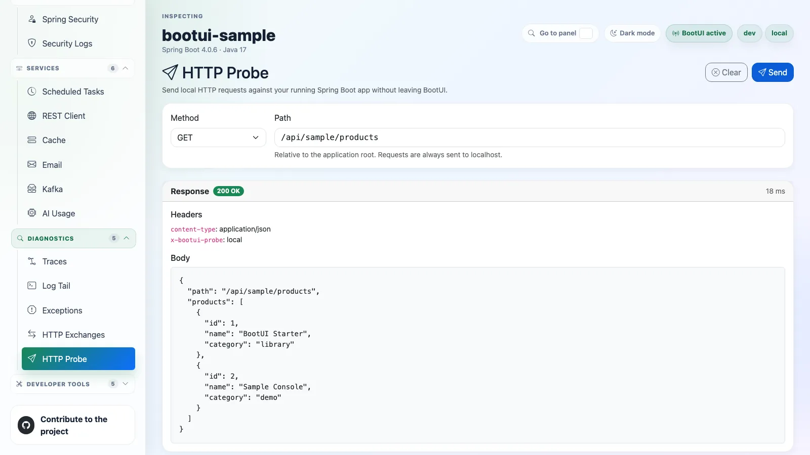

## Developer tools

### MCP Server

BootUI can expose its advisors and read-only diagnostics to local AI coding agents (such as GitHub Copilot or Claude
Code) through a local, opt-in [Model Context Protocol](https://modelcontextprotocol.io) server, so an agent can consult
the advisors before proposing a fix and pull runtime diagnostics (a correlated live activity feed, exception detail,
security logs, SQL traces, HTTP exchanges) while investigating an issue. The server is a JSON-RPC 2.0 endpoint at
`POST /bootui/api/mcp`; human-readable status and the advertised tool list are available from
`GET /bootui/api/mcp-server`. The server is disabled by default (fail-closed) and, like the rest of the BootUI API, only
reachable over the loopback interface unless non-loopback access is explicitly enabled, which requires authentication.
Enable it headlessly with `bootui.mcp.enabled=ON`, or use the prominent toggle at the top of this panel to turn it on
or off **at runtime, overriding the `bootui.mcp.enabled` Spring Boot property** for the lifetime of the running
application — the configured mode only sets the initial state, and the panel shows when the live state is an override.

The panel explains what the server does and lists every tool it exposes. Tools reuse the existing controllers and DTOs
rather than reimplementing anything, so every tool returns the same masked, bounded shape as the REST API, in three
groups:

- **Advisor scans (actions):** `architecture_scan`, `spring_scan`, `hibernate_scan`, `memory_scan`, `security_scan`,
  `pentest_scan`, `rest_api_scan`, `graalvm_scan`, `crac_scan`, `vulnerabilities_scan`. Each triggers the same scan the
  panel's action button runs and returns the report DTO; `vulnerabilities_scan` additionally makes outbound calls to
  OSV.dev.
- **Diagnostics reads:** `get_live_activity`, `get_exceptions`, `get_exception_detail`, `get_security_logs`,
  `get_sql_traces`, `get_traces`, `get_log_tail`, `get_http_exchanges`. `get_live_activity` returns the correlated feed
  the [Live Activity panel](#live-activity) shows (HTTP requests, SQL statements, exceptions, security events,
  scheduled-task runs, and — Spring only — cache accesses, grouped by request/trace); `get_exception_detail` takes a required `id` (from `get_exceptions` or
  `get_live_activity`) and returns that exception group's full stack trace, causes, and individual occurrences.
- **Core context reads:** `get_overview`, `get_health`, `get_config` (masked), `get_beans`, `get_mappings`,
  `get_loggers`, `get_conditions` (Spring MVC/WebFlux only — Quarkus has no runtime condition-match graph),
  `get_scheduled_tasks`, `get_cache_stats`, `get_database_connection_pools`.

Tools whose backing panel/controller is not present (for example Hibernate or Spring Security when those libraries are
absent) are simply not advertised. The server inherits BootUI's full safety model:

- It is only ever live while BootUI is active, so it is never reachable in production.
- The endpoint sits behind `LocalhostOnlyFilter` (loopback source, `Host` allow-list, cross-site write protection). It
  is exempt from BootUI's SPA CSRF token (which only browsers can present) so non-browser MCP clients connect with a
  plain HTTP config and no credentials on loopback, while `LocalhostOnlyFilter`'s cross-site defenses still block
  browser-driven writes. If non-loopback access is explicitly enabled, the client must send the configured or generated
  BootUI bearer token like every other remote API caller.
- Read tools require the backing panel to be enabled; action (`*_scan`) tools are additionally refused when the panel is
  read-only or `bootui.read-only=true`, returning a clear tool error instead of running.
- Values pass through the same secret masking and `bootui.expose-values` mode as the REST API, and paginated reads are
  capped by `bootui.mcp.max-results`.
- Unexpected server failures return only JSON-RPC `-32603` with the message `Internal error`; exception messages, stack
  traces, paths, queries, and credentials are never included. BootUI logs the original throwable once on the server,
  while expected protocol, disabled-server, and panel-policy errors keep their actionable messages.

Connection details (transport, protocol revision, and the `bootui.mcp.max-results` cap) are shown alongside a
ready-to-use, copyable MCP client configuration JSON pointing at this running app — the `servers` block a GitHub Copilot
or Claude Code `mcp.json` expects. To wire it into an agent, point the client at the loopback HTTP endpoint of your
running app:

```json
{
  "servers": {
    "bootui": {
      "type": "http",
      "url": "http://127.0.0.1:8080/bootui/api/mcp"
    }
  }
}
```

See [docs/PROPERTIES.md](./PROPERTIES.md) for the `bootui.mcp.*` settings, and [AI agents](./AI-AGENTS.md) for an
end-to-end agent workflow and how BootUI pairs with [Coffilot](https://github.com/jdubois/coffilot).

On Quarkus the panel is identical, running the same live JSON-RPC bridge over the same `POST /bootui/api/mcp` endpoint
and the same working enable/disable toggle (the `bootui.mcp.*` keys are read from MicroProfile Config). The protocol
core — method routing, per-panel gating, tool lookup, and the `max-results` cap — lives in the shared framework-neutral
engine; each adapter only supplies a thin Jackson envelope codec (Jackson 2 on Quarkus) and its own tool catalog, so
requests and responses are byte-identical across the two backends. The advertised tools track which panels are actually
live on Quarkus: `graalvm_scan`, `crac_scan`, and `get_conditions` (all deliberately not applicable on Quarkus) are not
offered, `get_overview` is advertised (the Overview panel is available, its dashboard rendering client-side), and
`spring_scan` runs the Quarkus-native idiom advisor.

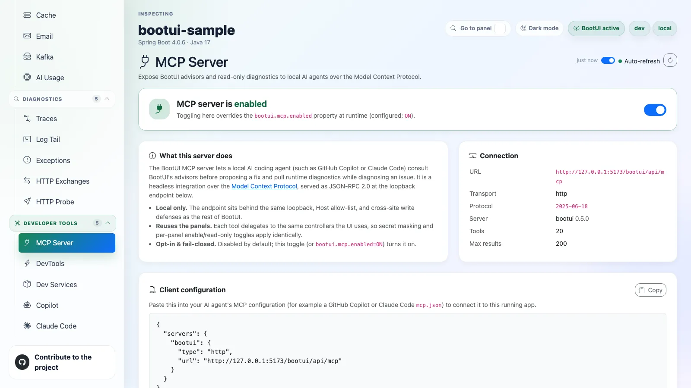

On Spring Boot WebFlux the panel is available too. A reactive tool catalog binds the WebFlux-specific Live Activity,
Exceptions, Security Logs, SQL Trace, and Log Tail controllers while reusing the shared controllers for the rest of the
surface, including `security_scan` through the shared reactive advisor service. The JSON-RPC transport, runtime toggle,
panel/read-only gating, payload/concurrency limits, and response envelopes are otherwise identical across all three
adapters.

### DevTools

The DevTools panel reports Spring Boot DevTools availability, LiveReload status, and restart support. Restart actions
are shown only when available and require explicit confirmation before execution. When DevTools is on the classpath but
the LiveReload server is not running, the panel shows a tip to set `spring.devtools.livereload.enabled=true` (Spring
Boot 4 disables LiveReload by default).

The LiveReload card also reports how many browsers are currently connected to the LiveReload server. Triggering a reload
only reaches those connected clients — Spring Boot does not inject `livereload.js`, so a browser needs the LiveReload
extension (or the script) to connect on port 35729. When no clients are connected the panel warns that triggering has no
visible effect, and the trigger action returns that warning instead of a misleading success.

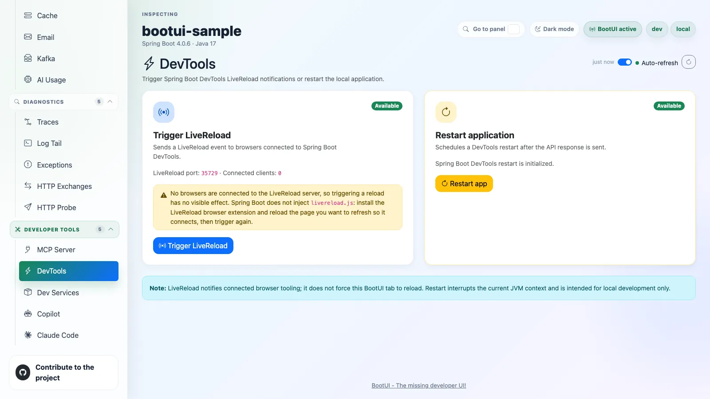

### Dev Services

The Dev Services panel surfaces local development services discovered from Docker Compose snapshots, Testcontainers
beans, and service connection metadata. It masks sensitive connection information, can show bounded logs for supported
services, and shows restart controls only for supported Testcontainers services when
`bootui.dev-services.restart-enabled=true`. To keep opening the panel side-effect free, BootUI skips lazy, prototype, or
otherwise uninitialized service beans that would need to be created just for inspection and reports those skips as
warnings in the panel.

> **Masking scope:** BootUI masks discovered _connection details_ (for example credentials embedded in a JDBC URL or
> connection properties) before they reach the browser. Raw container **log output** is streamed verbatim, bounded by
> `bootui.dev-services.log-tail-bytes`, and is **not** scanned for secrets — a service that prints credentials to its
> own logs will surface them in this panel. This is consistent with BootUI being a local-only, loopback-restricted
> developer console.

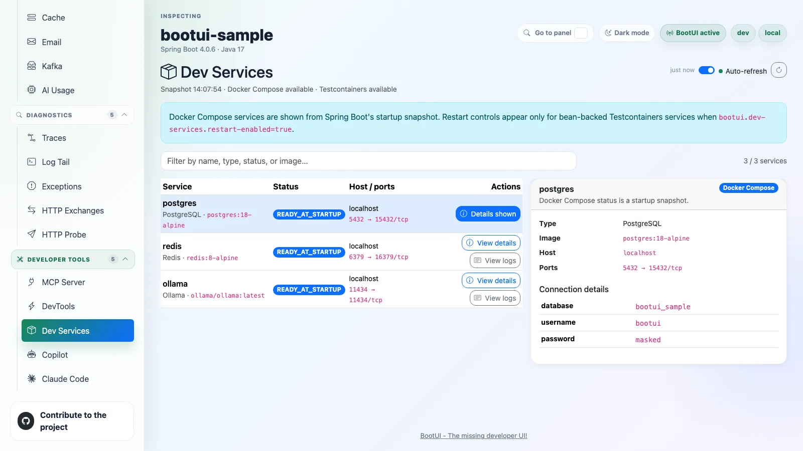

On Quarkus, the Dev Services panel reports the framework's native Dev Services (auto-started dev/test containers such as
databases, Kafka, or Redis). The list is captured from the build-time `DevServicesResultBuildItem` snapshot via a
recorder + synthetic bean: each entry shows the service name, container id, and configuration injected by the
container, with secret-bearing config values masked. Live logs and restart are managed by Quarkus itself, so those
controls are unavailable on Quarkus. DevTools is reported *not applicable* on Quarkus, which uses built-in dev-mode
live reload instead of a Spring Boot DevTools restart bridge.

### Copilot

The Copilot panel surfaces sanitized signals from local
[GitHub Copilot CLI](https://github.com/github/copilot-cli) sessions. It reads the session directories and `events.jsonl`
files Copilot CLI writes under `~/.copilot/session-state/` (configurable via `bootui.copilot.session-state-dir`) and
aggregates recent activity into a clean dashboard: active sessions, total sanitized events, input/output token usage when
the local session logs include it, failures, 24-hour activity, 7-day activity, event category mix, top tools, model usage,
and recent sessions. The session explorer remains available
for drilling into tool calls, edits, reads, searches, shell commands, web/docs lookups, MCP tool calls, hook callbacks,
skills, sub-agents, and ASK/intent/plan calls. To keep large local histories responsive, the session explorer returns
the most recent `bootui.copilot.max-sessions` sessions by default, while `bootui.copilot.max-parsed-sessions` caps how
many recent session files are parsed and retained in JVM heap. The activity charts default to token usage, with input
tokens shown in blue and output tokens shown in red, and can be toggled back to sanitized events/failures. Selecting a
chart hour or day filters the explorer to sessions active during that window. Failure lists use retained failure events
and include sanitized tool/type context.
Each event row shows only an allowlisted summary - raw prompts, tool arguments, command output, and diffs are deliberately
excluded. The per-event "Reveal raw" action is an explicit, local-only escape hatch that returns the source JSON; it can
be disabled with `bootui.copilot.allow-raw-reveal=false` and is also blocked when `bootui.expose-values=METADATA_ONLY`.
The sidebar dims the panel when no session-state directory is found. Data is read-only - BootUI never modifies anything
under `~/.copilot/`. The panel uses the same header refresh button and visibility-aware auto-refresh toggle as the other
live data panels, while the backend watches the directory through a Java NIO `WatchService` thread. Inspired by
[copilot-mission-control](https://github.com/DanWahlin/copilot-mission-control), which pioneered this dashboarding of
Copilot CLI session state.

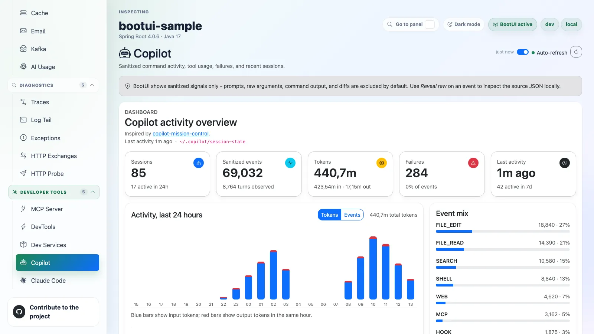

### Claude Code

The Claude Code panel mirrors the Copilot dashboard for local
[Claude Code](https://www.anthropic.com/claude-code) project logs. It reads JSONL session files under
`~/.claude/projects/` (configurable via `bootui.claude-code.session-state-dir`) and surfaces sanitized activity trends,
tool usage, model usage, input/output token usage, failures, recent sessions, and per-session event drill-downs. Its
activity charts use the same token-by-default view as the Copilot panel, with an events toggle for sanitized activity and
failures. BootUI treats Claude Code logs as
especially sensitive: prompts, assistant text, tool inputs, file contents, command output, and tool-result content are
excluded from normal responses. `bootui.claude-code.max-parsed-sessions` caps how many recent JSONL files are parsed and
retained in JVM heap. The raw JSONL reveal endpoint is disabled by default with `bootui.claude-code.allow-raw-reveal=false`;
enabling it is an explicit local-only escape hatch and is still blocked when `bootui.expose-values=METADATA_ONLY`. The
sidebar dims the panel when no Claude Code projects directory is found. Data is read-only - BootUI never modifies anything
under `~/.claude/`. Because Claude Code writes sessions inside per-project subdirectories, BootUI refreshes this panel
through the shared visibility-aware auto-refresh polling used by the other live data panels.

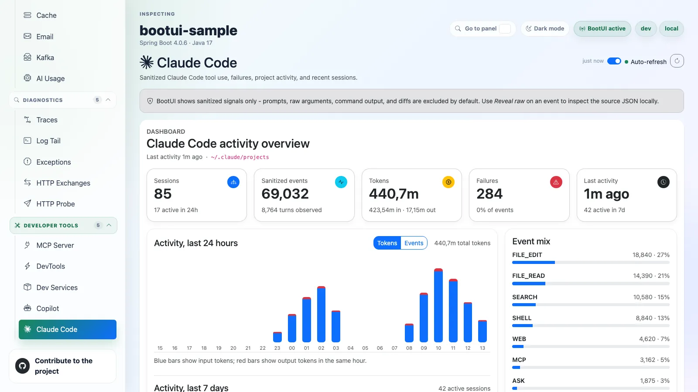
