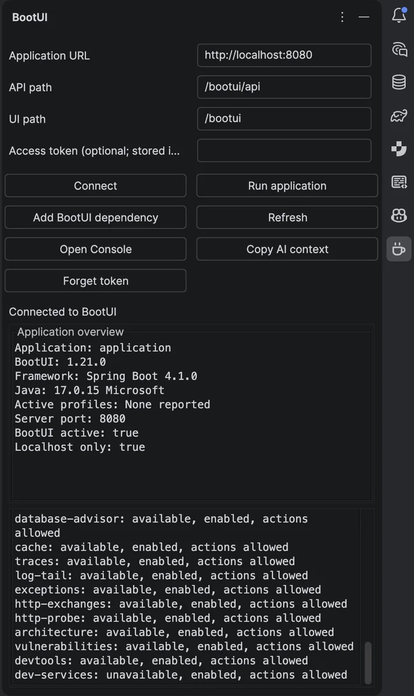

# JetBrains companion

BootUI's experimental **Kotlin JetBrains companion** brings a running application's overview and panel availability into
a native IntelliJ tool window. It can help add BootUI to a Maven or Gradle project and start an existing IDE run
configuration. It does **not** replace the BootUI dependency inside your application or the full browser console.

The plugin is a source-built prototype, **not published on JetBrains Marketplace**. Compatibility has been verified
against **IntelliJ IDEA 2025.3** (build 253). Later IDE versions and other JetBrains products have not been verified.
The plugin requires XML support and the bundled Groovy and Kotlin plugins.

## Build and install

Building requires **JDK 21** and network access to resolve Gradle and IntelliJ dependencies. From the repository root:

```bash
cd plugins/jetbrains
./gradlew test buildPlugin verifyPluginStructure verifyPlugin
```

The independent Gradle project is not part of the Maven reactor or BootUI's Maven Central release.

1. Open **Settings > Plugins** in IntelliJ.
2. From the gear menu, choose **Install Plugin from Disk...**.
3. Select `plugins/jetbrains/build/distributions/bootui-jetbrains-0.1.0.zip`.
4. Restart if requested, then open a project and choose **View > Tool Windows > BootUI**.

After rebuilding the plugin, install the new ZIP using the same steps. No Copilot, JetBrains AI Assistant, or AI
subscription is required.

## Add BootUI to your application

Skip this step if the application already has BootUI.

Click **Add BootUI dependency**, select the application's build file, choose **Spring Boot 4 MVC**,
**Spring Boot 4 WebFlux**, or **Quarkus**, and select a stable BootUI version. The current default is `1.20.0`.
The action supports `pom.xml`, `build.gradle`, and `build.gradle.kts` from the current project's indexed content.

Choose **Preview exact change**, review the current and proposed documents, then confirm with **Add dependency**.
Cancel changes nothing. The edit respects unsaved changes and supports IntelliJ's normal Undo/Redo. If the document
changes after preview, preview it again before applying.

The action adds only the selected dependency. It does not upgrade an existing BootUI declaration, combine integrations,
create a dev-only build profile, or change application activation settings. Spring dependencies use `runtimeOnly` in
Gradle; Quarkus uses `implementation`. Maven edits only the direct application dependencies, not dependency management,
profiles, or plugin dependencies. Gradle adds a separate top-level dependency block rather than guessing a nested scope.

Complex Gradle declarations such as version catalogs, variables, constraints, and applied scripts require manual
review. The action is not a build evaluator and cannot discover inherited or convention-plugin dependencies. Existing
BootUI declarations and unsupported or ambiguous input produce a no-change explanation. See the
[plugin source README](https://github.com/jdubois/boot-ui/blob/main/plugins/jetbrains/README.md) for detailed editing limits.

Save the edited build file and reload Maven or Gradle through IntelliJ when ready. Reloading may download artifacts.
The plugin does not request a reload, though your IDE's auto-reload setting may independently do so.

## Run and connect

BootUI must be installed **and active in the running application**:

- Spring Boot 4 MVC: follow [Setup](SETUP.md) and use an active `dev` or `local` profile, DevTools, or explicit
  development activation.
- Spring Boot 4 WebFlux: use the [reactive starter](setup/webflux.md), not the MVC starter.
- Quarkus: use the [Quarkus extension](setup/quarkus.md) and run in dev mode.

Select the application's existing configuration in IntelliJ's Run toolbar and click **Run application** in the BootUI
tool window. This uses IntelliJ's standard execution workflow; it does not create a configuration, change profiles,
choose a port, or automatically connect. Watch the Run window for startup or execution errors.

Once the app is ready, configure the connection:

| Field | Default | Purpose |
| --- | --- | --- |
| Application URL | `http://localhost:8080` | Running application's origin, including its context/root path if present |
| API path | `/bootui/api` | Application-relative API mount |
| UI path | `/bootui` | Application-relative browser console mount |
| Access token | Blank | Optional bearer token, stored in IntelliJ Password Safe |

For example, an application at `http://localhost:9000/host` with custom mounts uses that **Application URL**,
`/internal/bootui-api` as **API path**, and `/dev-console` as **UI path**. Do not repeat `/host` in the mount fields.

Click **Connect** to fetch the overview and panel availability. **Refresh** repeats these reads. **Open Console**
opens the configured URL in your browser, where the full panels and diagnostic actions remain available.
The plugin does not issue application requests simply because its tool window opens.



The connected tool window above shows a Spring Petclinic development session. Runtime versions and panel availability
come from the running application; they are not the plugin's build requirements or dependency-installation defaults.

## Context export and AI

**Copy AI context** copies a bounded JSON summary of the connected overview and panel availability to the clipboard.
It includes only allowlisted fields, filters free-text labels, excludes tokens, URLs, unavailable reasons, and raw
response bodies, and has an 8,000-character limit. It is an overview export, not a complete finding or exception report.

Review the clipboard content before sharing it: even filtered application names and profiles can be sensitive.
Copying sends nothing to an AI provider. Embedded chat, direct Copilot handoff, and ACP sessions are **not implemented**.
Copilot and other agents can separately use BootUI's existing opt-in [MCP server](AI-AGENTS.md); installing this plugin
does not enable it.

## Troubleshooting and safety

| Situation | What to check |
| --- | --- |
| Cannot connect | Wait for application startup; verify the port and context path, then open the configured console URL in a browser. Installing the plugin alone does not install BootUI in the app. |
| API unavailable or 404 | Confirm BootUI is active, the API mount is correct, and the selected runtime has the required starter or extension. |
| Authentication failure | Supply the application's bearer token if required. A blank token field reuses the saved token; **Forget token** removes it from Password Safe. |
| No run configuration | Select the application's configuration in the Run toolbar; the button does not generate one. |
| Dependency action unavailable | Finish indexing, trust the project only if appropriate, and choose a writable supported build file. Complex builds may need manual installation. |

Connections are local-only: `localhost`, numeric IPv4 loopback, or numeric IPv6 loopback. The client bypasses configured
proxies, does not follow redirects, requires JSON, and bounds requests to 8 seconds and response bodies to 256 KiB.
URL credentials, queries, fragments, and ambiguous paths are rejected. Errors are redacted; inspect the application
and IDE Run logs for startup failures. URL/path settings are project-local; bearer tokens are not written into them.

The companion does not run advisor scans, mutate the runtime, or implement the complete browser UI. Adding a dependency
does not ensure it is excluded from production artifacts; follow [activation and safety](setup/activation.md) for that.

## Developing the plugin

Use `./gradlew runIde` from `plugins/jetbrains` to launch a disposable IDE sandbox with the plugin installed.
The project uses Kotlin, the IntelliJ Platform Gradle Plugin, public IDE APIs, and lifecycle-aware background work.
See the [contributor guide](REPOSITORY.md#independently-built-integrations) for its place in the repository.
