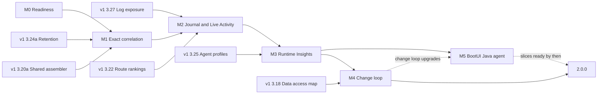
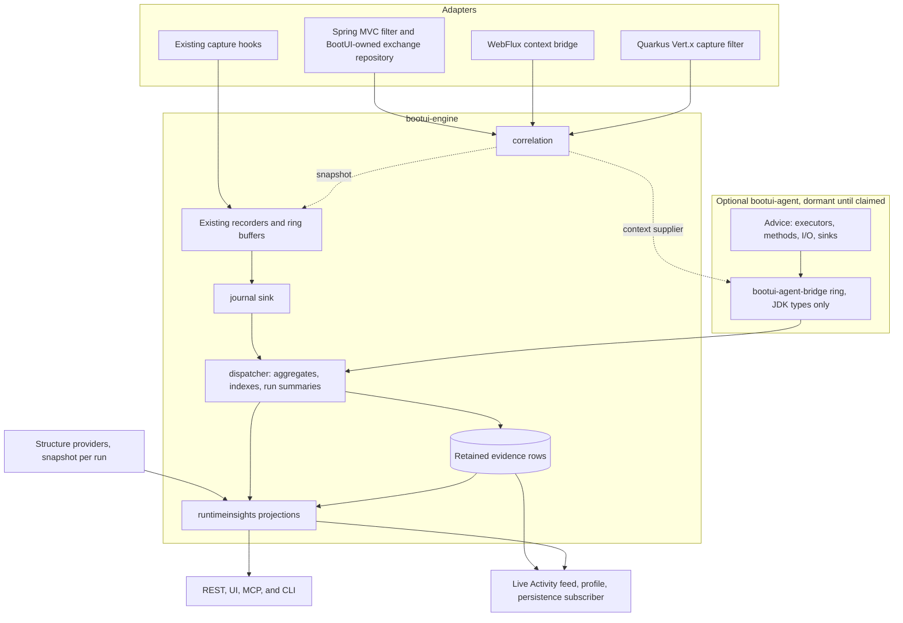

# BootUI v2 Plan: from panels to runtime understanding

This document plans **BootUI 2.0**. The v1 plan, [PLAN.md](PLAN.md), keeps governing the 1.x line on `main`. All v2
work happens on the long-lived `v2` branch, and nothing from it is released before 2.0.0 (§4). Section numbers are
stable identifiers: cite them as `PLAN-v2.md §5.1`, and never renumber or reuse them. An item is 📋 Planned, 🚧 In
progress, ✅ Delivered, 💤 Deferred, or ❌ Cut.

This revision incorporates three independent audits, on product strategy, technical feasibility, and adoption and
agent value, and the reordered v1 plan. Appendix A records every proposal and what was done with it.

## 1. Strategy

### 1.1 The problem

BootUI 1.x ships 60 panels. Each panel is precise about its own source: SQL Trace about statements, Traces about
spans, Security about authentication events, Transactions about transactions. The questions developers and their AI
agents actually ask cross those sources:

- Why is this route slow, across all its requests rather than in one trace?
- What does my change touch, and how much real traffic goes through it?
- Did my last change make anything slower, or break anything?
- Which work ran without a request, and why?
- Can an anonymous user reach data that only administrators should see?

Today a developer answers these by joining panels in their head. Where BootUI joins sources itself (Live Activity
nesting, the request profiler, SQL route attribution), the join is re-derived after the fact from trace ids, serving
threads, and time windows. A proof of concept on the Spring MVC sample app measured the gaps:

| Evidence on Spring MVC, 1.19.0 | Measured |
| --- | --- |
| HTTP exchanges carrying a trace id when identical requests overlap, tracing on | 79 % (608 of 767) |
| Request-thread SQL linked to its request by trace id | 163 of 206 on H2; 205 of 207 with PostgreSQL. Without tracing, only the serving-thread and time tiers remain |
| Exception occurrences and security events carrying a trace id | None. Live Activity nests 43–63 % of security events by serving thread and time |
| Kafka sends attached to the request that produced them | Live Activity keeps every Kafka row top-level; the PoC's time join matched 4 of 31 |
| SQL statements with no owning request | 90 of 425, on `pool-N-thread-N` |
| Live Activity window at the scenario's 88 events per second | 200 entries, about 2.3 seconds |
| Live Activity persistence | A poller reading that window every 2 seconds, lossy above about 100 events per second |

Spring WebFlux and Quarkus already stamp trace ids on some of these records, but none of the stacks has a request
identity that works without tracing.

The M0 correlation scenario (§5.1) then measured the same gap in CI, with tracing on, by sending identical requests
paced like a developer clicking, back-to-back like a test loop, and simultaneously like parallel calls:

| Stack | Paced | Back-to-back | Simultaneous |
| --- | --- | --- | --- |
| Spring MVC: requests with a trace id; SQL, security, and cache nested under their request | 100 % | 0 % | 0 % |
| Spring WebFlux: requests with a trace id; SQL and cache nested under their request | 100 % | 0 % | 0 % |
| Quarkus: requests with a trace id; SQL and exceptions nested under their request | 100 % | 100 % | 100 % |

On Spring, any two identical requests within ±50 ms of each other lose their link, which a test suite or a page's
parallel calls do all the time. Quarkus is exact because BootUI owns its exchange capture and stamps the trace id
directly, which is the design §5.1 extends to every stack.

After M1 (M1-6f), the extended scenario, which adds a Kafka send, a raw executor, and runners with tracing off, measures:

| Stack | Paced | Back-to-back | Simultaneous |
| --- | --- | --- | --- |
| Spring MVC, tracing on and off: SQL, security, cache, exceptions, and Kafka sends nested under their request | 100 % | 100 % | 100 % |
| Spring WebFlux, tracing on: SQL, cache, and exceptions nested under their request | 100 % | 100 % | 100 % |
| Quarkus, tracing on and off: SQL and exceptions nested under their request | 100 % | 100 % | 100 % |
| Every stack with tracing on: requests carrying their own trace id | 100 % | 100 % | 100 % |

No child is nested under a request that was not running when it happened, work on the raw executor is reported and
never nested, and no request-thread profile is approximate. The scenario enforces all of it in CI.

Once the PoC joined the same events exactly, it surfaced findings no single panel shows:

- secured routes spending 94 % of their time before the controller, in HTTP Basic password hashing;
- the 7 beans and 571 requests that a change to one repository reaches;
- a transaction holding its connection while doing almost no database work;
- 90 statements that lost their request context on an executor;
- a search route whose median moved from 2 ms to 9.5 ms between two runs, which the comparison must attribute to the
  switch from H2 to PostgreSQL rather than report as a regression.

### 1.2 The v2 thesis

**Stamp every runtime event with exact keys when it happens, keep it in a bounded local journal, and turn it into a
few trustworthy observations exactly where developers and agents already look.** BootUI 2.0 delivers three outcomes:

1. **Exact.** Every event knows its request, trace, span, transaction, and run, with or without tracing. Live Activity,
   the profiler, and route attribution stop guessing (§5.1).
2. **Remembered.** Evidence outlives the 200-entry window and survives a DevTools restart or Quarkus live reload, so
   "what changed since the last run?" has an answer (§5.2, §5.3, §5.8).
3. **Explained.** Observations answer the questions in §1.1 in one sentence with numbers, a sample size, and a concrete
   check, in Live Activity, a Runtime Insights panel, and agent tools (§5.4–§5.9, §5.12).

The graph from the study remains the conceptual model: requests, routes, beans, tables, transactions, and messages,
joined by typed relations. With exact keys, most joins become indexed group-bys maintained as events arrive. The rest
walk a small in-memory typed runtime model (§5.4), so 2.0 needs neither a graph database nor a general graph engine.

### 1.3 What does not change

The five v1 priorities stay in force: safety and local-only operation, easy installation, useful runtime explanations,
a polished but simple UI, and testable architecture. In addition:

- **No new infrastructure.** No graph database, external process, or new heavy dependency.
- **Instrumentation stays optional.** Every capability in §5.1–§5.12 works from framework hooks alone. The BootUI Java
  agent (§5.13) is a separate artifact the developer attaches on purpose; it deepens the same evidence and never
  becomes a prerequisite.
- **A runtime view, not an advisor.** Observations carry no severity, no score, and no effect on the Scorecard, like the
  PostgreSQL and MySQL panels. They do say what to check.
- **Nothing expensive on page load.** Observations are projections over aggregates the journal maintains as events
  arrive, read the way Live Activity already computes its KPI strip. Opening a panel or calling a read tool never
  starts a capture, a scan, a database read, or a network call.
- **Nothing leaves the machine.** The journal is local, bounded, and governed by the live exposure policy. BootUI still
  collects no telemetry about its users.
- **Honest across stacks.** Spring MVC stays the reference. Spring WebFlux and Quarkus report each capability they
  cannot provide as unavailable, with a reason.

### 1.4 Positioning

| Category | Examples | What they answer | BootUI v2's edge |
| --- | --- | --- | --- |
| Local telemetry viewers | Sentry Spotlight, the .NET Aspire dashboard | Errors, traces, and logs from a local run, some with MCP access | Nothing to run beside the application; route, principal, security decision, transaction, bean, and table joined at capture |
| Runtime-aware code intelligence | Digma, including its MCP server | Issues and change impact derived from OpenTelemetry traces | No collector or backend, and no agent required; framework structure (mappings, beans, security, transactions) joined with traffic |
| Diagnostic and coverage agents | Arthas, Glowroot, Lightrun, BlockHound, JaCoCo, Azul Code Inventory | One method, one trace, one test failure, or one coverage report at a time, each in its own tool | The optional BootUI agent (§5.13) feeds the same request ids, journal, runtime model, and observations, so method timings, executed code, and side effects join routes, transactions, and runs |
| Framework tooling | Quarkus Dev UI, Spring Boot Admin, IDE Spring debuggers | State at a breakpoint, or one source at a time | Aggregates over every request of a run, and across runs |
| Production APM | Datadog, Dynatrace, New Relic, Elastic | Sampled production behavior in a remote backend | Development-time, complete within bounds, and zero setup |
| Static software intelligence | CAST Imaging | What the code could do | What the code did in this run, with counts and timings |

The differentiator is **in-process, zero-infrastructure, framework-aware runtime evidence, the same on Spring MVC,
Spring WebFlux, and Quarkus, readable by humans and agents alike**.

## 2. Business value and success measures

### 2.1 Jobs to be done

| Job | Today in 1.x | With 2.0 | Where |
| --- | --- | --- | --- |
| Explain a slow route | One trace, then SQL Trace, then Transactions | Named phases across a route's warm requests: authentication, filters, connection wait, handler, and response write, with CPU and allocation | §5.5 `route-time-breakdown` |
| Fix repeated queries | N+1 flags one request at a time | Repeated SELECTs across a route, with the call site and the phase, including queries run while the response is written | §5.5 `repeated-selects`, `lazy-sql-after-handler` |
| Find what broke | Scan the Exceptions list | Exception groups per route, not observed in the previous run, with a check for well-known framework exceptions | §5.5 `exception-hotspots` |
| Catch a hidden failure | A 200 in HTTP Exchanges, an exception in another panel | 2xx responses whose transaction rolled back, or that recorded an exception, an error log, or a failed downstream call | §5.5 `errors-behind-2xx` |
| Understand Spring's machinery | Guess from annotations and log noise | Transactions bypassed by self-invocation, one request holding two connections, writes split across transactions, GET requests that write, and framework warnings by route | §5.5, §5.12 |
| Keep reactive code non-blocking | Invisible until production stalls | JDBC started on event-loop threads, per route and call site | §5.5 `event-loop-blocking` |
| Control AI usage | Token counts per span, one at a time | Tokens, model calls per request, prompt growth, and length-limited answers per route or job | §5.5 `ai-usage-by-route` |
| Check a change | Remember numbers, or nothing | What the reload changed: new queries, hosts, exceptions, dependencies, and restart cost, then latency | §5.8 |
| Prepare a refactoring | Beans graph without traffic | Routes a change reaches, through beans or shared tables and hosts, with observed traffic and unexercised routes | §5.7 |
| Review anonymous access | Security and SQL Trace, separately | Anonymous writes, and anonymous 2xx on routes declared protected | §5.9 |
| Give an agent runtime ground truth | The last few seconds of `get_live_activity` | Compact observations with exemplar request ids, and targeted impact and comparison tools | §5.6 |
| Know the edited code ran | Nothing: route traffic, never the method | With the agent, changed methods since the previous run, and whether any request or test executed them | §5.15, §5.17 `changed-code-not-executed` |
| Explain the handler phase | A duration between SQL and REST calls | With the agent, the application methods a route spends its handler time in, and which bean calls which | §5.14 |
| Follow work onto executors | Unowned statements on `pool-N-thread-N` | With the agent, executor work nested under its request, and work still running after the response | §5.13, §5.17 `work-after-response` |
| See everything the application touches | Only what hooked clients capture | With the agent, hosts, files, processes, environment variables, threads, thread locals, and leaked streams, per route | §5.16 |
| Find hidden failures and risky sinks | Exceptions that reach a handler | With the agent, exceptions caught and dropped in application code, and request input pasted unchanged into SQL or a command | §5.17 `exceptions-caught-in-code`, `request-input-in-sink` |
| Triage vulnerable dependencies | Every declared advisory, loaded or not | With the agent, whether the affected dependency's classes were ever loaded in this run | §5.15 |

### 2.2 How success is measured

BootUI collects no usage telemetry, and v2 does not change that. Success is measured with evidence the project
controls:

| Measure | Target | How it is verified |
| --- | --- | --- |
| Exact correlation | ≥ 99 % of request-thread events carry their request id on Spring MVC and Quarkus, with and without tracing; WebFlux reports its measured coverage | Concurrency scenario on the sample apps, in CI (§5.1) |
| Capture overhead | < 2 µs p99 for the full application-thread path on a reference machine; sample-app throughput within 5 % with the journal on versus off | Timed engine test and a sample-app benchmark scenario |
| External validity | On five open-source applications not written for BootUI (Spring PetClinic, a JHipster sample, Quarkus Super Heroes, a WebFlux sample, and a Kafka application), ≥ 70 % of observations judged actionable or informative by two reviewers, and none misleading. Since D35, the unit is a default-visible distinct fact, scored on these five tuned applications and on two holdout applications separately | A validation report under `docs/`, under a protocol registered before each run (M4-20), rerun before 2.0.0 |
| Agent effectiveness | Ten scripted investigations answered correctly from tool output alone, with fewer tool calls than with 1.x tools, and five refusal fixtures where the right answer is not to edit (§5.6); with the agent (M5), an eleventh investigation ("did my change run?") and a sixth refusal fixture against treating an agent-gated `NOT_APPLICABLE` as healthy (§5.17) | A local agent benchmark with no telemetry, baseline measured first |
| Time to first observation | ≤ 5 minutes from adding the dependency to reading a first observation, with tracing off and no extra property | Scripted walkthrough on each sample app |
| Honesty | No observation on any counterexample fixture; "not enough evidence" never reads as "no change" | Fixture tests per observation |

The M0-3 overhead baseline (`CaptureOverheadBenchmarkTest`, opt-in) measured today's capture cost on Spring MVC, on a
worst-case route that answers in about 0.7 ms: with BootUI on, the sample app sustains a median 83 % of the throughput
it reaches with BootUI off, and its p99 latency rises from 1.81 ms to 2.52 ms, with tracing sampling every request in
both configurations. Slower, realistic requests dilute this cost. The journal target above is measured on top of this
baseline, with BootUI on in both runs, and M1 and M2 must not make the BootUI-on figure worse. After M1, the same
benchmark, on JDK 26, measures a median 87 % of the BootUI-off throughput, with p99 latency rising from 1.25 ms to
1.54 ms, so M1's request ids, execution ids, phases, and thread kinds cost no measurable throughput. After M2-3, with
every request and statement also recorded in the runtime journal, it measures 84.4 %, with p99 latency rising from
1.29 ms to 1.65 ms: the journal costs about 3 points of throughput on this worst-case route, inside the 5 % target.
The absolute ratio drifts by several points between sessions on the same machine, so a slice is compared against its
predecessor in the same session. After M2-4c, three commits measured back to back give 75.4 % for M2-3c, 76.0 % for
M2-4b, and 74.9 % for M2-4c: transactions, log events, connections, and application frames cost no measurable
throughput beyond that drift.

### 2.3 Gates

- **After M1.** If exact correlation stays below 95 % on Spring MVC or Quarkus, fix capture before building on it.
  Passed: the M1-6f scenario measures 100 % on every stack, in every phase, with and without tracing (§1.1).
- **After M3.** If fewer than 50 % of external-application observations are judged useful, stop adding observations and
  fold the useful ones into the existing panels they belong to.
  Tripped: the first validation run measured 14 % (16 of 116 observations; first published as 115, corrected by M4-20a), and an estimated 14–23 % after the fixes
  merged since. The maintainer chose to freeze new observation kinds, cut default-visible noise, register a per-kind
  protocol, rerun with holdout applications, and apply this gate per kind (D35, D36, M4-19, M4-20). If the rerun's
  default-visible score is under 30 %, or the holdout applications score more than 20 points below the tuned ones,
  every kind that misses its per-kind gate folds into its existing panel as this gate first said.
- **Before 2.0.0.** If the overhead target is missed, the journal ships disabled by default and the release notes say
  so.

### 2.4 Feedback without releases

Nothing is published before 2.0.0 (§4.3), so feedback comes from outside the release channel:

- the external-validation report on five open-source applications (§2.2);
- a scripted three-minute demo on the sample apps, recorded at the end of M3;
- documented early-adopter builds of the `v2` branch into a local Maven repository;
- a pinned GitHub discussion for v2 feedback, linked from the README once M3 lands.

## 3. Relationship to the v1 plan

The v1 plan's diagnostics workstream (PLAN.md §2) shapes evidence BootUI already captures. BootUI 1.x is in maintenance
since 2026-09-30: its foundations (✅) are delivered on `main` and merged into `v2`, only §3.25 and §3.18 remain planned
there, and the rest of its roadmap was dropped. Where v2 relied on a dropped item, v2 now builds what it needs itself,
as the last column states. v2 builds exact
keys, the journal, and observations on top of it. **Each shared capability has one implementation and one owner.** A
v1 foundation is delivered on `main` in its wave and merged into `v2`; v2 extends it instead of duplicating it.

| v1 item and wave | Dependency | How v2 uses it |
| --- | --- | --- |
| §3.27 Log exposure policy, wave 0 ✅ | Hard, M2 | Journal `LOG` events reuse its read-time path (`LogTailReader` and the shared `MessageExposure` helper), and the journal follows the same read-time model (§8) |
| §3.24a Failure-preserving retention, wave 1 ✅ | Hard, M1 | Exact exchange correlation stamps the context in its BootUI-owned Spring `BootUiHttpExchangeRepository`, over the engine `TieredCaptureBuffer`. There is no second repository decorator |
| §3.20a Shared profile assembler, wave 1 ✅ | Hard, M1 | v2 adds a `REQUEST_ID` tier ahead of the `TRACE_ID`, `SERVING_THREAD`, and `TIME_WINDOW` tiers of `ExecutionProfileAssembler` and `CorrelationTier` |
| §3.22 Route performance rankings, wave 1 ✅ | Hard, M2 | Its `Percentiles` helper, `RouteTemplateResolver`, and `HttpRouteSummaryService` serve route comparison and every route-level observation |
| §3.25 Agent-ready profiles, wave 2 | Hard, M3 | `get_request_profile` is the drill-down behind every exemplar request id |
| §3.18 Data access map, wave 2 | Hard, M4 | `anonymous-data-reach` joins its table extraction and access classification with request authentication |
| §3.20b and §3.20c execution profiles ❌ dropped in 1.x | None | v2 owns it: M1-6 gives scheduled runs and consumed messages their own `executionId`, which the journal records as execution anchors (§5.2) |
| §3.14 Correlation-ID filtering ❌ dropped in 1.x | None | Not rebuilt. `CorrelationContext` carries no keyed lookup identity; principals are still pseudonymized under a per-process key (§8) |
| §3.21 Log correlation ❌ dropped in 1.x | None | v2 owns it: journal `LOG` events carry the full correlation context at capture (§5.2) |
| §3.23 Scheduled task run history ❌ dropped in 1.x | None | v2 owns it: journal scheduled-run events feed run comparison (§5.2, §5.8) |

Three design points shape how v2 reuses v1 foundations:

- §3.20's tiers stay as fallbacks once `REQUEST_ID` exists.
- The journal follows §3.24's reservation for evidence rows only. Route and statement statistics come from aggregates
  counted before eviction, so retention never biases percentiles (§5.2).
- v2 CLI commands follow §3.25's naming rule: unique paths, never a prefix of another path.

## 4. Roadmap, branch, and releases

### 4.1 Order of work

| Milestone | Delivers | Depends on | Effort (engineer-days, rough) | Status |
| --- | --- | --- | --- | --- |
| **M0 Readiness** | CI on `v2`, the correlation and overhead scenarios as baselines, and the propagation and restart spikes (§5.1, §5.8) | — | 5–8 | ✅ Delivered |
| **M1 Exact correlation** (§5.1) | One correlation context on every event, with or without tracing, on all three stacks, and the request phase markers | M0; v1 wave 1 (§3.20a ✅, §3.24a ✅) | 45–56 | ✅ Delivered |
| **M2 Journal and Live Activity** (§5.2, §5.3, §5.11) | The in-memory journal, incremental aggregates, run summaries, resource correlation (scope readings, GC by id, CPU ledger, resource track), and Live Activity served from the journal with its unified timeline | M1; §3.22, §3.27 | 44–56 | ✅ Delivered; §5.11's opt-in JFR attribution followed in M4-4 (D17) |
| **M3 Runtime Insights** (§5.4–§5.6) | Projections, the runtime model, the panel, Live Activity entry points, twelve observations, agent tools, and the demo | M2; §3.25 | 52–65 | ✅ Delivered |
| **M4 Change loop and 2.0 readiness** (§5.7–§5.9, §5.12, §5.18) | Change impact, run comparison and behavior diff, anonymous access, proxy bypass, the journal sources they need, external validation, and the release path | M3; §3.18 | 33–45, plus 17–23 for M4-19 to M4-23 (D35) | 🚧 In progress: the post-M3 gate tripped (D35); M4-18's rest and M4-19 to M4-23 remain, with M4-17's maintainer tasks: pin the feedback discussion, record the demo after M4-19, and adjudicate the validation rerun |
| **M5 BootUI Java agent** (§5.13–§5.17) | The optional agent, executor propagation, Code Paths, Code Inventory, Side Effects, and agent evidence in observations, comparison, and tools | M3 for observations; M4 for the change-loop upgrades | 111–140, plus 7–12 for M5-11 and M5-12 | 🚧 In progress, beside M4 (D38): M5-0, M5-2, M5-3, and M5-4a–c delivered, M5-1 delivered but for its open checks; M5-11, M5-12, and later slices remain; slices reshaped by D37 |

M0–M4 total about **179–230 engineer-days**, roughly seven to nine months with two developers who also maintain 1.x.
Opt-in JFR attribution (§5.11, D17) adds 6–9 engineer-days to M4, so M0–M4 come to about 185–239 engineer-days with it.
D35's M4-19 to M4-23 add 17–23, bringing M0–M4 to about 202–262.
§5.18's journal coverage adds about 15–21 engineer-days for the slices §5.8 and §5.9 need (M3-8, M3-9, M4-5, M4-6)
and 25–35 for the others (M4-7 to M4-10), which D29 places.
M5 is estimated separately and **does not gate 2.0.0** (D20): its slices land on `v2` as they are ready, what is merged
when M4 meets its gates ships in 2.0.0, and the rest follows in 2.x.
The v1 foundations are estimated in their own plan. Before v1 wave 1 lands, `v2` works on M0 and the spikes.

M0 is split into four items:

| Item | Delivers | Status |
| --- | --- | --- |
| M0-1 | `build.yml` runs on `v2` pushes and pull requests | ✅ Delivered |
| M0-2 | The correlation coverage scenario on Spring MVC, Spring WebFlux, and Quarkus, recording the baseline in §1.1 | ✅ Delivered |
| M0-3 | The capture overhead scenario, recording the baseline for the §2.2 overhead target | ✅ Delivered |
| M0-4 | The WebFlux propagation spike (§5.1) and the DevTools restart and Quarkus live-reload spike (§5.8) | ✅ Delivered |

M3 is split into slices, each one pull request to `v2`. Only the agent tools and **Copy for AI** need v1 §3.25, so
they come last and everything before them proceeds without it:

| Item | Delivers | Depends on | Status |
| --- | --- | --- | --- |
| M3-1 | §5.4's request projection and §5.5's observation framework, in the engine's new `insights` package. `InsightsSnapshot` groups the journal's retained events into completed requests with their children, by route, with each source's coverage (linked by request id, by execution id, or not at all). An `Observation` is a pure function of the snapshot returning findings; `RuntimeInsightsService` evaluates every observation and caches the result until the journal records more. Each check reports whether it ran (`EVALUATED`, `PARTIAL` when a source it reads dropped events, or `NOT_APPLICABLE` with the source or disabled panel it lacks), so an empty list never reads as healthy. Each finding has a stable id (`kind:route:hash`) that survives refreshes and restarts, a sentence naming what was counted, eligible and affected counts, the `REQUEST_ID` tier, conditional checks, at most three exemplar request ids, and at most 20 evidence rows. First observations: `repeated-selects` (a SELECT fingerprint run 5 or more times after another statement, reported once 3 requests show it, insufficient below), `safe-method-dml`, and `connections-per-request`, which orders connections by a new monotonic `checkoutNanos` on `ConnectionPayload`, so back-to-back connections never count as held together. Additive core DTOs. Projecting and evaluating 50,000 retained events stays far inside the 250 ms read budget. The endpoints ship with the panel's registration in M3-4a, so no API path exists without its panel's access policy | M2 | ✅ Delivered |
| M3-2a | The observations journal facts answer directly. `exception-hotspots` groups each route's exceptions by a new cross-run signature (the class and its top frames' classes and methods, never line numbers) that `ExceptionPayload` and the run summaries now carry, so a group is marked "not observed in the previous run" when that run served the route without it, and never when the previous summary left entries out. Twenty-one framework exception classes carry a specific check; captured subclasses and causes select it, deepest cause first, with at most two specific checks per group. Naming the inner method that marked an `UnexpectedRollbackException`'s transaction rollback-only is not possible: Spring signals only boundaries that begin a physical transaction or a savepoint, never a method that joins one. `errors-behind-2xx` reads a request's own root rollback, exception, `ERROR` log, and downstream 5xx or transport failure, strongest first, and reports matching exceptions a retry or fallback recovered apart without hiding unrelated evidence in that request; recovery requires the same policy's terminal outcome, which current retry feeders do not report. A 4xx a client library threw never counts. `framework-warnings-by-route` groups framework loggers' `WARN` and `ERROR` events by logger, template, and route, with checks for known messages such as Hibernate's in-memory pagination, Hikari's leak detection, and Vert.x's blocked thread; comparing them with the previous run waits for the run summary to keep log templates. `event-loop-blocking` counts JDBC statements started on an adapter-identified event loop, per route and call site, and is not applicable on Spring MVC. `TransactionPayload` gains whether it was nested, whether it is a `NESTED` savepoint rather than its own physical transaction (from `TransactionExecution.isNested()`), and its monotonic start. Observations may read optional sources, naming any the journal does not record, and declare where they do not apply. The service takes the stack and the kept run summaries | M3-1 | ✅ Delivered |
| M3-2b | `split-transaction-writes`: requests whose committed writes span two or more independent units, each a physical transaction (savepoints count with theirs, rolled-back ones not at all) or an autocommit statement outside every recorded transaction, with each unit's method and first write. Not applicable on Quarkus, whose transactions are not recorded. `lazy-sql-after-handler`: statements run in the response phase outside every transaction, per route and fingerprint, from 3 requests or 10 executions in one, otherwise insufficient; not applicable on WebFlux, and on Quarkus, where such loads fail as `LazyInitializationException`. `SqlPayload` gains its request phase and monotonic completion, which a request's transactions, as monotonic intervals per thread, place inside or outside them; a request with an unplaceable transaction or statement is counted apart | M3-2a | ✅ Delivered |
| M3-3a | `route-time-breakdown`: each route's warm requests split into authentication, other filters, connection wait, SQL, REST client, other handler work, response write, and unattributed time, by a sweep over their monotonic intervals, so overlapping calls count once and the overlap is shown; the median CPU time and allocation join when measured, and the route's first request is reported apart as cold while the journal has evicted nothing and was not cleared (`gc-inflated-latency` leaves it out of its slowest tenth the same way). Insufficient below 5 warm requests. `HttpPayload` gains a `RequestTiming`: the monotonic start, authentication time, and handler and response offsets from the phase markers on Spring MVC and Quarkus; WebFlux marks no handler or response phase, so the time around its calls is unattributed apart from the authentication time named out of it. `RestClientPayload` gains its monotonic completion | M3-2b | ✅ Delivered |
| M3-3b | `transaction-across-remote-call`: a physical transaction open when a REST client call starts, per route and method, with the connection it held and, when the pool size is supplied, the labelled estimate pool size ÷ hold time. From 3 transactions, once one of the method's calls took 20 ms or more, since the slowest call holds the connection longest; a method whose calls were all faster is not reported at any traffic, rather than reported as needing more traffic, and the check's reason counts it; not applicable on Quarkus | M3-3a | ✅ Delivered |
| M3-3c | `ai-usage-by-route`: a new `ai` journal source, which the telemetry store publishes for each stored GenAI span it recognizes, as metadata only (operation, provider, model, input and output tokens, finish reason, failure; never prompts or answers), linked to its request by trace id since spans are exported after their request, and folded into that completed request's route aggregates through a bounded attribution ledger that reports expiry; GenAI spans imported through the OTLP receiver publish too when they are the application's own (started by it, or whose resource `service.name` is its own), never BootUI's own traces or other services' spans in the aggregator topology; a trace-only call that no request of its trace spans is counted as unowned, apart from expired or ambiguous attribution; coverage counts events linked this way apart. Per route: operations, model calls with the most in one request (agent loops), median latency, tokens with how many calls reported them, input growth across a request's successive model calls, length-limited stops, and failures. From 3 operations, one call above 8,000 tokens (`bootui.runtime-insights.ai-token-threshold`, M3-4a), or one length-limited stop; without tracing it is not applicable, never "no usage". Jobs are not covered yet, and prompt growth is not split by principal group | M3-3a | ✅ Delivered |
| M3-4a | The **Runtime Insights** panel (`runtime-insights`, Home group, after Live Activity, view-only) on every stack: `GET /runtime-insights` and `GET /runtime-insights/insights/{id}` served by a shared Spring controller (WebFlux runs it off the event loop through BootUI's handler adapter) and a Quarkus resource, wired with the stack, the kept run summaries, Hikari pool sizes read through SQL Trace's proxy, and `bootui.runtime-insights.ai-token-threshold`. Available while the journal is enabled, otherwise unavailable naming `bootui.runtime-journal.enabled`. Finding ids become `kind:hash` so they are safe in a URL path; the projection cache also keys on which panels are enabled. Contracts and a conformance test on all three stacks (report shape, a route's breakdown observed with a stable id, its evidence, an unknown id unavailable). The UI: the window line, a correlation coverage strip with text labels and a per-source table (garbage collections left out, as they belong to no request), search and theme chips, a master-detail list grouped by check, the sentence with backticked names as code, **What to check**, exemplar requests opening Live Activity's drawer, the evidence table, limits, a list of checks that could not fully run, and empty states for a disabled journal, an empty run, and nothing observed. Vitest and browser coverage on Spring MVC, WebFlux, and Quarkus; features, specification, properties, and support docs. MCP tools stay excluded until M3-7 | M3-1 | ✅ Delivered |
| M3-4b | Entry points and exports. The request drawer's **Why this route is slow** loads the route's `route-time-breakdown` on demand and links to it; Live Activity's KPIs link the slowest route to its breakdown; both only when the panel is enabled and available. The panel takes `?q=` and `?insight=` deep links, exports its report as JSON client-side, and lists **Not exercised in this run**: declared application routes (framework endpoints and catch-alls left out) no request reached, counted from the run's aggregates (a new lightweight `routeLabels()`), so evicted requests still count; at most 100, with the rest counted. Documentation screenshot from a mocked report. **Copy for AI** waits for M3-7 | M3-4a | ✅ Delivered |
| M3-5 | §5.4's runtime model, in the engine's new `model` package: typed nodes (route, GraphQL operation, scheduled job, listener, bean, repository, table, cache, outbound host, topic or queue, AI model, exception group) and edges (depends on, handled by, reads, writes, calls, publishes, consumes, raises) of interned ids, each edge `DECLARED`, `OBSERVED` with its count and first and last seen, or `INFERRED`, never merged; capped at 5,000 nodes and 30,000 edges. `RuntimeModelProjection` builds it on read from the retained events, where executions own work by request or execution id (AI spans by trace id), so an event no execution owns adds no edge, and from a `StructureSnapshot` of routes, handlers, beans, and dependencies that `RuntimeModelService` reads once per run; it stops at the 250 ms read budget as a partial model. Three algorithms with seeded property tests against brute-force references: `ReverseClosure` (backwards only, allowlisted edge types, depth ≤ 5), `IntervalUnion`, and `EdgeDiff`. The PoC's change-impact evidence is a fixture: one repository reaches 7 beans and 571 requests; two routes sharing only a table never reach each other; 50,000 events project well inside the budget. Tables come from the existing `SqlTables` extraction until v1 §3.18 lands. The adapters' structure suppliers arrive with the model's first consumers, M3-7's agent tools and M4's change impact | M3-1 | ✅ Delivered |
| M3-6 | Sample-app seeds and counterexamples for every observation, and the scripted demo on each stack, including §5.9's two seeded cases moved from M4-12 and §5.12's self-invocation from M4-13 | M3-2b, M3-3c, M3-4b | ✅ Delivered: the Spring MVC sample's `InsightSeedController` seeds repeated SELECTs, a GET write, a `REQUIRES_NEW` audit (connections held together and split writes), a remote call inside a transaction, a self-invoked `@Transactional` method, a rolled-back import answered 200, SQL during the response write, an unreadable body, an anonymous debug write, and a payroll report reachable anonymously through a case-sensitive matcher in front of a case-insensitive handler, each beside its counterexample; `RuntimeInsightsSeedsTest` asserts each pair. The WebFlux sample seeds JDBC in a `map` after a `WebClient` response, on the event loop, and a per-note loop, beside `boundedElastic` JDBC and an asynchronous client (`WebFluxRuntimeInsightsSeedsTest`). The Quarkus sample seeds what Quarkus records through BootUI's traced `DataSource`: repeated SELECTs, a GET write, JDBC in a `@NonBlocking` route, and the two anonymous cases, with permission paths. `e2e/scripts/insights-demo.mjs` sends the traffic, and a `runtime-insights-demo` browser test on each stack checks the observations, opens the secured route's breakdown, and follows its request to Live Activity. GC, heap, and AI observations keep their engine fixtures, since a sample cannot make a collection or a model answer deterministic; seed tables are created by portable SQL at startup, not by Hibernate, so the Hibernate advisor's sample findings do not change |
| M3-7 | §5.6's agent tools, CLI commands, prompts, and Quarkus Dev MCP registration, and the panel's **Copy for AI** | M3-4a, v1 §3.25 | ✅ Delivered: `get_runtime_insights` (`QUERY_LIMIT`), `get_runtime_insight`, `get_runtime_impact`, and `get_runtime_run_comparison` on all three stacks, as `bootui insights list`, `show`, `impact`, and `compare`; comparison now uses `OPTIONAL_ID` (omitted or `previous` selects the newest kept run; a run id selects another). The engine's `RuntimeInsightsAgentView` compacts the panel's answers, putting coverage and the checks that did not run first, leaving latency-only rows out of the default list until M4-18b's latency-rows slice included them, and keeping eight comparison rows without latency. `diagnose_runtime_issue` starts with `get_runtime_insights`, `get_live_activity`'s description points to it, and the new `verify_after_change` prompt stops at the comparison. The panel's **Copy for AI** renders the open observation through §3.25's Markdown helper. Quarkus Dev MCP registration is deferred: it needs a Dev UI JSON-RPC provider rather than a registration, so the four tools reach Quarkus agents through BootUI's own MCP endpoint. The ten scripted investigations and five refusal fixtures of §5.6 remain M4-17's validation |
| M3-8 | §5.18's fixes to existing sources. `TransactionPayload` gains its read-only flag, isolation, propagation, and the exception class of a rollback. `InsightsSnapshot` projects scheduled runs and consumed messages as executions with their children, named like routes (`@Scheduled OrderJob.run`, `consume orders`), so the request-level observations also cover jobs and listeners. `route-time-breakdown` names AI calls and synchronous message sends in the handler phase. `spanId` is either filled from the current span at capture or removed from the envelope. Lands before M3-6 when possible, so its seeds cover a job and a listener | M3-5, M2-8e4 | ✅ Delivered: `TransactionPayload` gains `readOnly`, `isolation`, `rollbackOnly` (read at `beforeCommit` and `beforeRollback`), the `failureClass` of a failed commit or rollback, and a derived effective `propagation`; Spring's `TransactionExecution` exposes no rollback cause, so the request's own exception events name it (decided on the maintainer's behalf, reversible). `InsightsSnapshot` projects each scheduled run and consumed message as a `ProjectedRequest` of kind `SCHEDULED` or `MESSAGE` with its execution-id children, named `@Scheduled OrderJob.run` or `consume kafka:orders`, and `httpByRoute()` keeps the observations that read a status, method, phases, authorization, or resources on HTTP requests; shared observations count runs or messages. `route-time-breakdown` carves `AI calls` and `Message sends` out of the handler's other work. `spanId` left the envelope, since no reader used it, and moved to `AiPayload`, where it identifies a call |
| M3-9 | §5.18's AI calls without tracing: Spring AI's `gen_ai.client.operation` observation and Quarkus LangChain4j's `ChatModelListener` publish `ai` events stamped with the request or execution id at capture, so `ai-usage-by-route` no longer needs tracing and covers jobs. GenAI spans stay the fallback, deduplicated by trace and span id | M3-3c | ✅ Delivered: `AiCallEvents` publishes a framework-reported call stamped with its request or execution and remembers it, by trace and span id, or by trace and operation when its span is unknown, so `TelemetryStore` skips the GenAI span of the same call. Spring's `AiObservationJournalHandler` reads `gen_ai.client.operation`'s key values by name, so it loads without Spring AI, and takes the span id from Micrometer Tracing when present. Quarkus's `QuarkusAiCallListener` is a `ChatModelListener` compiled against a provided `langchain4j-core` and registered only when LangChain4j is on the classpath. `ai-usage-by-route` applies once any AI call is stamped, even without tracing, and links each route at the weakest tier its calls used: `REQUEST_ID`, `PROPAGATED`, or `TRACE_ID` with a limitation counting the calls joined from GenAI spans. A stamped call also carries its monotonic completion, so `route-time-breakdown` places it on its request's clock over the model's REST client call instead of counting that time twice; a call known only from a GenAI span is placed by its wall-clock start, to the millisecond and with a limitation, and moves only its model time inside the handler that no placed call covers |

M4's slices are defined as M3 completes, each one pull request to `v2`. M4-1 and M4-2 make the behavior diff possible:
today a run summary keeps routes, statements, exception groups, and transactional methods, but not the runtime
model's edges, and every summary lives in the in-memory run history, so a full JVM restart leaves nothing to compare
against.

| Item | Delivers | Depends on | Status |
| --- | --- | --- | --- |
| M4-1 | §5.8's edge set in the run summary. The aggregates count the runtime model's observed edges as events arrive, by each end's node type and name and the edge type, with a count and first and last seen, so an edge whose events the journal later evicts still counts. The run summary carries that set within its byte bound, the least-used edges left out first and counted, with a codec version bump. `EdgeDiff` compares the current run's edges with the previous summary's, and the comparison says when the previous run kept no edges or left some out | M3-5 | ✅ Delivered: `ObservedEdges` names each event's edges for both the model's projection and `JournalAggregates`, which count them as events arrive (at most 5,000 edges, an execution's edges held until it completes, and AI spans joined only to the unique request window containing their start); trace-only AI edges are inferred from bounded completed-request windows, may change while a later overlapping request is still completing, and become final in the run summary; attribution expiry is counted separately from edge-cardinality overflow. Run summary codec version 4 keeps the edge set, trims the least-observed edges first, and counts them in the header's `omittedEdges`; `RunEdgeDiff` compares whole runs with each side's counts and its limitations |
| M4-2 | §5.8's opt-in `bootui.runtime-journal.baseline-file`: at the end of a run, one run summary written to the build output directory (`target/` or `build/`), and read back at the next start as the previous run when the in-memory history has none, so a comparison survives a full JVM restart. The file holds only route templates, statement fingerprints, outbound hosts, exception-group ids and signatures, the edge set, and counts and histograms: never principals, literals, SQL text, or values. Written atomically, read best-effort, a file from another BootUI version or application ignored with the reason, and nothing written when the property is unset | M4-1 | ✅ Delivered: `RunBaselineFile` (a path, relative to the working directory, in a directory that must exist; versioned header with the BootUI version and application name; temporary file then atomic move; at most 260 KB read back), `RunHistory.loadBaseline` with its `baselineNote`, and `JournalAggregates.recordRunIn(history, run, baseline)` on Spring and Quarkus |
| M4-3 | §5.11's two resource observations (D18): `heap-growth-after-gc`, old-generation occupancy after collections rising across the run, from the resource track, with the Memory advisor linking to it; and `gc-inflated-latency`, the share of a route's slowest requests during which a stop-the-world pause completed, worded "a pause completed during", never "caused by". Both join the Runtime Insights checks with their minimums from §5.11 | M3-4b | ✅ Delivered: GC events now carry the old generation's occupancy before and after each collection, from the pools named `Old Gen`, `Tenured`, or `ZGC Old Generation`, and the insights snapshot keeps the retained collections. `GcInflatedLatency` compares a route's slowest tenth of measured requests, at least five, with its others, observed when pauses completed during at least two of them and twice the others' share, and totals the pauses joined by collector and id. `HeapGrowthAfterGc` reads the collections that reclaimed old-generation space, observed from three when the level rose at least 10 % and 4 MiB in two thirds of the steps, and is not applicable on a heap without an old generation. The UI adds a Memory theme, and the Memory panel links to it |
| M4-4 | §5.11's opt-in JFR attribution (D17): the `bootui.ExecutionSegment` event, a user-triggered **Profile resources** session bounded by `jfr.max-duration`, CPU and allocation samples joined to request segments, virtual threads included, which lifts `route-time-breakdown`'s virtual-thread limit and adds a route's hot frames. Never started on its own or on page load | M3-3a | ✅ Delivered: `ExecutionSegmentEvent` (`bootui.ExecutionSegment`, disabled by default) is begun on each segment's own thread and committed by whichever thread closes the segment (a Quarkus worker's segment is normally closed on the worker itself, by the inline body-end take, and by BootUI's completion close when the response body outlives the chain), carrying its own thread's id for the join, only while `JfrSegments` is active, a volatile read otherwise. `JfrProfiler` runs one JVM-wide session bounded by `bootui.resources.jfr.max-duration` (30 s, 1 s to 10 min) on a BootUI daemon, with `jdk.CPUTimeSample` on Linux where it exists and `jdk.ExecutionSample` every 10 ms elsewhere plus `jdk.ObjectAllocationSample`, then joins samples to segments by the segment's thread id and interval in JFR's clock; a real recording joins a virtual thread's samples to its request in `JfrProfilerTests`. `ResourceProfileService` names routes from the journal when the session ends and serves `GET`, `POST`, and `POST …/stop` on `/runtime-insights/resource-profile` on all three stacks, so Runtime Insights became action-capable with `bootui.panels.runtime-insights.read-only`. The panel's **Profile resources** card shows per-route CPU samples, allocation, virtual threads, and hot frames. CPU stays in samples rather than milliseconds, so `route-time-breakdown` names the session for virtual-thread routes instead of adding a CPU phase |
| M4-5 | §5.18's run-start facts. A new `lifecycle` source publishes one `RUN_STARTED` event per run: the time to ready, the slowest startup steps with their bean names from the `BufferingApplicationStartup` BootUI already installs (Spring only), and the comparability facts: active profiles, each data source's URL shape, the cache type, whether tracing is on, and the journal's sources. The run summary header keeps them, with a codec version bump, and the baseline file carries them. The input of §5.8's `NOT_COMPARABLE` and restart cost | M4-1 | ✅ Delivered: `LifecyclePayload` and `RunStartEvents` (one event per run, spanning start to ready, on no thread); Spring's `RunStartPublisher` on `ApplicationReadyEvent` (time taken, the 10 slowest `spring.beans.instantiate` steps outside BootUI, data sources through `DataSourceDeclarations.byBeanName` without creating beans, cache managers past BootUI's decorator, Micrometer tracing); Quarkus's `QuarkusRunStart` on `StartupEvent` (no time to ready or steps; Agroal pools, `quarkus.cache.type`, a build-time OpenTelemetry flag); `ComparabilityFacts` with URL shapes, `notComparableReasons` (data sources first) and `limitations`; codec version 5 keeps `RunStart` in the header, and Clear recording keeps it |
| M4-6 | §5.18's `authorization` source: one decision per request or method check, with its target, rule, authentication class (anonymous, authenticated, none, or unknown), and outcome, from Spring Security's authorization observations on Spring MVC and WebFlux and from Quarkus's authorization security events. Route aggregates count requests by authentication class, and the run summary keeps the counts. The evidence §5.9's two observations read, and an **authorization** phase in `route-time-breakdown` | M2-8e4 | ✅ Delivered: `AuthorizationPayload` (target, method subject, rule, authentication class, outcome, authority count); Spring's `AuthorizationDecisionObservationHandler` on Spring Security's authorization observations (servlet thread or the exchange's correlation on WebFlux; the caller from the observation, or the servlet security context, `UNKNOWN` when a reactive rule never asked), Quarkus's `QuarkusSecurityEventCapture` on authorization success and failure events, published through `SecurityEventBuffer.recordAuthorization` (method or request, `isAnonymous()`, no timing); `RouteAuthorization` per route (requests by authentication class, anonymous `2xx`, denied) in the run summary (codec version 7); `route-time-breakdown` moves a request's decision time out of the filters and a method's out of the handler. Denied requests stay in the feed through the `security` source, so `authorization` adds no feed row |
| M4-7 | §5.18's control and availability markers in the `lifecycle` source: BootUI's own actions (logger level, configuration override, cache clear or evict, migration, capture toggle, **Clear recording**, heap dump) with the name they targeted and never a value, availability changes, configuration refreshes, and shutdown. They are drawn as markers on Live Activity's time axis, and an observation whose window spans a marker that touched its subject names it as a limitation | M4-5 | ✅ Delivered: `ControlMarkers` publishes `ACTION`, `AVAILABILITY`, `CONFIG_REFRESH`, and `SHUTDOWN` `lifecycle` events naming their target, never a value, through `RuntimeJournal.offerMarker`, which admits a marker from BootUI's own request. Each stack's panel access filter marks a successful action of an action-capable panel with its panel, method, and path without the query. Spring's `ControlMarkerPublisher` marks availability changes once the run is ready, Spring Cloud's `EnvironmentChangeEvent` by name, and the context's close; Quarkus marks `ShutdownEvent`. The journal feed renders `MARKER` rows, Live Activity draws them as dashed lines on its sparkline, and Runtime Insights names the window's markers among its limitations, adding one to a finding whose evidence names the action's last path segment, unless it is a verb such as `clear` |
| M4-8 | §5.18's `app-event` source. On Spring, a BootUI subclass of `SimpleApplicationEventMulticaster` records application events published and each listener run, deferred transactional listeners included, with `transactional-listener-skipped` and `after-commit-writes`. Quarkus follows with a build-time interceptor binding on application `@Observes` and `@ObservesAsync` methods. The runtime model gains `EVENT` nodes, and change impact follows their edges | M3-5 | ✅ Delivered: the `app-event` source and `AppEventPayload` (publication or listener run, phase, outcome `RAN`, `FAILED`, `DEFERRED`, or `SKIPPED_NO_TRANSACTION`, and the listener's monotonic start). Spring's `BootUiApplicationEventMulticaster`, the context's `applicationEventMulticaster` unless the application defines one, records publications and listener runs, classifies a `TransactionalApplicationListener` as deferred, skipped, or run through `fallbackExecution`, and records a deferred run through the listener's `SynchronizationCallback`; events of framework packages and BootUI's modules are left out. Quarkus binds `QuarkusObserverInterceptor` at build time to the application's `@Observes` and `@ObservesAsync` methods and records their runs; it records no publication, since `Event.fire` has no hook. `transactional-listener-skipped` and `after-commit-writes` join Runtime Insights (19 checks), the latter counting DML in an after-completion listener outside every transaction begun within it, since the finished transaction's recorded window may still contain the listener. `EVENT` nodes with `PUBLISHES` and `CONSUMES` edges are resources for change impact, which resolves an event's simple name. Live Activity shows `APP_EVENT` rows. The Spring sample seeds both observations and their counterexamples, and the Quarkus sample an observer the demo checks. A failed listener is not yet evidence for `errors-behind-2xx`, and the listeners sub-phase and run comparison of event types follow by demand |
| M4-9 | §5.18's `orm` source, after a two-day spike on Hibernate 7's `SessionEventListener` on Spring and Quarkus: per session, statements, connection acquisitions, flushes, auto-flushes, dirty checks, entities in context, and second-level cache use. On Quarkus, ORM statements gain their execution time and connection. Adds `orm-auto-flush`, `large-persistence-context`, and a Hibernate sub-phase of `route-time-breakdown` | M3-8 | ✅ Delivered: the spike found Hibernate 7.2 (Quarkus) and 7.4 (Spring Boot 4.1) share `SessionEventListener`, created per session from `hibernate.session.events.auto`, which Spring sets through a `spring.jpa.properties` default and Quarkus through a runtime `unsupported-properties` default (Quarkus warns about it at startup; documented). `OrmPayload` and the `orm` source; the engine's `OrmSessionEvents` meters one session and publishes it when it ends, owned by the request or execution that opened it; an auto-flush counts only when it executed a statement, since Hibernate fires the partial-flush callbacks for every check, and flush times leave out their statements. `ORM` feed rows, `orm-auto-flush` and `large-persistence-context` (21 checks), and a **Hibernate flushes** phase in `route-time-breakdown`, which on Quarkus also takes its SQL time from the measured ORM statements. Seeds: Spring's `InsightTagService` (saving before each count, against counting first; and, for `large-persistence-context`, loading 600 tags as entities, against reading their labels only) and Quarkus's `/demo/tags/auto-flush` integration test. Completed in a second slice: the request profile's **Hibernate** block (`RequestOrmDto`, nullable and additive) and its flushes on the timeline (`OrmPayload.flushTimeline`, the first 16); per-route aggregates (`RouteOrm`: requests with a session, flushes, auto-flushes, entities, and an ORM-time histogram for the median; run summary format 8, so baseline files of format 7 are ignored once); `flushes-per-request` and `entities-per-request` behavior rows when both runs recorded the ORM source, including flush counts changing to or from zero under captured source settings, with the listener assumption explicit and entity counts requiring measured contexts in both runs (§5.8); `safe-method-dml` on Quarkus leaving out a Hibernate write prepared in a request whose metered sessions executed no statement (fewer executions than preparations prove nothing, since a JDBC batch over several tables counts once, and a request with no metered session is counted as before); named Quarkus persistence units, read from their `datasource` or `packages` build property; and `APP_EVENT`, `WEBSOCKET`, and `ORM` in Live Activity's type filter. The listener cannot know its persistence unit, so `persistenceUnit` stays `null` |
| M4-10 | §5.18's `websocket` source: each inbound application message opens an execution, so its SQL and exceptions nest under it and request-level observations cover message handlers. Spring MVC first, from its existing STOMP and handler capture; then WebFlux and Quarkus WebSockets Next, which need new hooks | M3-8 | ✅ Delivered on all three stacks: `WebSocketPayload` and the `websocket` source; an inbound message opens an execution named `consume websocket:<destination>`, a `WEBSOCKET` feed row with its work nested, a `LISTENER` node consuming a `DESTINATION` of broker `websocket`. Spring MVC: `BootUiStompChannelInterceptor` is an `ExecutorChannelInterceptor` that opens it around the `@MessageMapping` or `@SubscribeMapping` method only, with the destination as the mapping's template (`StompDestinationTemplates`); the broker's relay and unmapped destinations open nothing. WebFlux: `BootUiWebSocketHandlerAdapter` replaces the framework's exact adapter and opens it around each received data message's synchronous delivery, named by the handler mapping's pattern. Quarkus: `QuarkusWebSocketMessageInterceptor`, bound at build time to `@OnTextMessage` and `@OnBinaryMessage` methods, named by the endpoint's path. The sample's STOMP seed (`InsightStompController`) is reported by `repeated-selects`, its joined counterexample is not. Recorded: inbound application messages only; session open and close, outbound sends, and their per-execution pre-aggregation stay in the WebSockets panel, since no observation reads them yet |
| M4-11 | §5.8's run comparison: an engine `RunComparison` of the current run against the previous kept summary or a chosen one, behavior rows first per route (statements per request, new fingerprints, REST and AI calls, new hosts, new exception groups, status-class mix, routes newly hit, tokens, cache misses, median allocation, and new or gone edges from M4-1), restart cost from M4-5's startup steps, latency last and labelled noisy, `INSUFFICIENT` below its minimums and `NOT_COMPARABLE` with the configuration difference first. `GET /runtime-insights/comparison` on every stack, with its contract and conformance, and a **Compared with the previous run** section in Runtime Insights | M4-1, M4-2, M4-5 | ✅ Delivered: `RunComparison` and `RunComparisonService` with five explicit statuses; route and execution work from 3 samples per side, new and gone fingerprints, source-gated counters and edges, bounded median allocation (codec v10, reading v8/v9 with missing facts unavailable and SQL shapes sanitized), adjacent in-memory restart cost only (Quarkus timing unavailable with the reason), and warm p50/p95 minimums unchanged. The default is the newest kept run, including idle runs; reloadable history is `UNAVAILABLE`. DTO fields stay unchanged, with the shared endpoint, run picker, and three-stack conformance/e2e |
| M4-12 | §5.9's `anonymous-data-reach` and `anonymous-success-on-restricted-route`, reading M4-6's authorization decisions and the tables each statement writes (the existing lexical extraction until v1 §3.18 lands, labelled as such), with the sample apps' two seeded cases and their counterexamples on every stack with security | M4-6 | ✅ Delivered, with its seeds in M3-6: `AnonymousDataReach` and `AnonymousSuccessOnRestrictedRoute` read each request's decisions (its own first; a request no rule checked is never anonymous), the DML target of each statement including JDBC batch previews (ambiguous dialect forms retain explicitly labelled lexical candidates, not proven writes), and the restriction from this run's decisions on the route (an anonymous caller denied or an authority required), each with the "do not add authorization from this row alone" check, engine tests with counterexamples, and an **Access** theme in the panel. Quarkus Hibernate preparations are labelled as unverified even when its session executed some statements; when the Hibernate panel is hidden, preparations are omitted while timed JDBC writes remain. Intended public writes such as sign-up are facts to verify, not excluded routes; unproven anonymity stays outside the eligible count, yielding an `INSUFFICIENT` check at zero without inventing per-route findings. The two seeded cases moved to M3-6, which seeds every observation at once, because new sample endpoints shift the advisors' pinned counts on every stack |
| M4-13 | §5.12's `proxy-bypass`: a Spring SPI resolving a frame's `@Transactional`, `@Cacheable`, and `@Async` boundary once per frame on the dispatcher with merged-annotation lookup, the observation in Runtime Insights, a link to the Architecture advisor's static self-invocation finding, the sample app's seeded self-invocation with a through-the-bean counterexample, AspectJ mode and Quarkus reported not applicable | M3-1 | ✅ Delivered, with its seed in M3-6: `ProxyBypass` reads each statement's application frames and its request's transaction windows, cache accesses, and thread; `ProxyBoundaries` is the engine SPI, and Spring's `SpringProxyBoundaries` resolves a frame once with merged-annotation lookup over the type hierarchy, by annotation name so `spring-tx` stays optional, by method name since frames carry no parameter types (overloads that disagree are not judged), skips cache judgments for `sync = true` or a nonblank `condition` without suppressing other boundaries, and reports AspectJ transaction weaving not applicable; Quarkus is not applicable; findings name ARCH-SPRING-004. `ProjectedRequest` gained its thread. The seeded self-invocation moved to M3-6 with the other seeds, as a seeded case also changes the Architecture advisor's pinned findings |
| M4-14 | §5.7's change impact: the adapters' `StructureSnapshot` suppliers (Spring's bean graph and mappings, Quarkus's ArC injection edges, reported unavailable rather than empty when unreadable), symbol resolution to exactly one model node or `AMBIGUOUS` with candidates, and the three capped lists (observed routes, not exercised, through shared resources) worded as what was and was not exercised. `GET /runtime-insights/impact?symbol=` on every stack and an impact view in Runtime Insights. Tables come from the existing lexical extraction until v1 §3.18 lands; the swap then is internal | M3-5, M4-1 | ✅ Delivered: `StructureSnapshots` reads the structure from the framework-neutral `BeanProvider` and `MappingProvider` both stacks already have (Spring's bean graph and handler mappings, Quarkus's ArC injection edges and JAX-RS resources), leaving framework, platform, and BootUI beans out and saying why when the beans cannot be read; `ChangeImpactService` resolves a symbol by node key or bean type, walks `ReverseClosure` over `DEPENDS_ON` and `HANDLED_BY` from code or over access edges from a table, cache, or host, and lists observed, not exercised, and shared-resource routes with traffic from the aggregates and exemplars from the journal; shared resources are those the observed routes touched, as the limitations say; `GET /runtime-insights/impact?symbol=` on Spring MVC, WebFlux, and Quarkus with its contract and conformance; `ChangeImpact.vue` with `?impact=` deep links, candidates for an ambiguous symbol, and nothing read until asked; the sample app's `ProductRepository` is checked in its journal test and browser suite |
| M4-15 | D30's managed-executor propagation: a `TaskDecorator` on Spring's auto-configured executor and scheduler, and a SmallRye Context Propagation `ThreadContextProvider` on Quarkus, each task an execution linked to its parent request, so `@Async` work is owned; raw executors and `CompletableFuture` stay with M5-2 | M2-8e4 | ✅ Delivered: the engine's `ManagedTasks` gives a submitted task its request's correlation with a fresh `task-` execution id (BootUI's own work stays marked, and work outside a request is unchanged); Spring's `BootUiTaskDecorator`, which Spring Boot 4 applies to both its auto-configured executor and scheduler, is contributed only when the application defines no `TaskDecorator`, since Boot applies one only when it is unique, and propagates BootUI's correlation alone rather than every Micrometer context; Quarkus's `BootUiThreadContextProvider` is a SmallRye Context Propagation service. Tested through Boot's real `applicationTaskExecutor` and the provider's snapshot lifecycle |
| M4-16 | §4.3's release path, through the release agent's process and never a release: `release.yml` computes the next version within the source branch's major and redeploys documentation only for the newest major, in lockstep with `check-release-integrity.sh`; and 2.0.0's removals (`TraceIdProvider`, the Live Activity poller) with migration notes in `CHANGELOG.md` | M4-11 | ✅ Delivered. Release machinery: `release-version-policy.sh` (next version per major, release major must match the branch, documentation redeploy for the newest major only), guarded by `check-release-integrity.sh` and unit-tested in `build.yml`; and the 2.0.0 removals (D31): `spi.TraceIdProvider` is gone, every recorder and capture point reads its trace id from the adapter's `CorrelationContextProvider` (`CorrelationSource.traceId()`, falling back to the SLF4J MDC only while no adapter installed a provider), and the OpenTelemetry bridges on WebFlux and Quarkus became the internal `TraceIdSource` behind `ScopedCorrelationContextProvider`; the Live Activity persistence poller (`ActivityCapturePoller`, `ActivityCaptureFactory`) and `bootui.activity.persistence.capture-interval` are gone, durable history is written only by the journal subscriber, whatever the feed source, and a disabled journal logs a warning instead of falling back. Both migration notes are in `CHANGELOG.md` |
| M4-17 | §2.4's external validation: documented early-adopter builds of `v2` into a local Maven repository, the validation report on five open-source applications, and the pinned feedback discussion linked from the README. Running the demo and opening the discussion are the maintainer's | M3-6 | 🚧 Material delivered: [Try BootUI 2.0 early](V2-EARLY-ADOPTERS.md) builds `v2` into its own Maven repository (`~/.m2/bootui-v2`), since the branch still carries the 1.x version, and points Maven and Gradle applications at it; the [validation report](V2-VALIDATION-REPORT.md) template holds the release gates, the judging rubric, the five applications, the ten agent investigations, and the five refusal fixtures; the README on `v2` links both and GitHub Discussions, with an **Ideas** fallback until a v2 discussion is pinned. Remaining, the maintainer's: pin the discussion, record the demo, and fill in the report before 2.0.0. The README note is removed when `v2` merges into `main` |
| M4-18 | Fixes from the §11 validation run on `v2` at `fb4cc07e5` ([report](V2-VALIDATION-REPORT.md), 16 of 116 observations useful to both reviewers, which trips §2.3's post-M3 gate; the maintainer decided D35). M4-18a, honesty: `route-time-breakdown` stops calling time "application code" for requests that reached no marked handler (Security rejections, Actuator) and on WebFlux, and carves only synchronous sends (a Kafka send runs until its asynchronous acknowledgement); SQL checks report `UNAVAILABLE` when the stack records no SQL (R2DBC); **Not exercised** no longer drops `io.quarkus.*` applications, finds WebFlux routes, and says when the route inventory failed; `lazy-sql-after-handler` names view rendering (a Thymeleaf formatter) instead of lazy loading; the `errors-behind-2xx` sentence. M4-18b, comparison and agents: executions compared beside routes, so listener-only services compare; no `EVALUATED` with nothing eligible; `insights compare` defaults to the previous run; gone fingerprints listed; latency rows in the default agent view; change impact narrowed from beans to routes where the handler method is known. M4-18c: Live Activity's empty state, an agent-aware Java Agent browser spec, the demo's ORM seeds, persisted `bootui_activity` rows re-masked on read as §8 promises. M4-18d, performance: application frames formatted off the request thread, one lock a journal offer. M4-18e: a cross-observation counterexample harness and `PARTIAL` fixtures; `authorization-cost` is no longer a new kind but a prominence trigger on `route-time-breakdown`'s authorization phase, delivered with M4-19 (D36). About 6–9 days | M4-17 | ✅ Delivered: M4-18a delivered (an engine `SqlCapture` signal per stack; the WebFlux route inventory, which also fills the Mappings panel on WebFlux; `org.springframework.samples.`, `io.quarkus.sample.`, and compiled JSPs counted as application frames; the Spring MVC Actuator mapping keeps no phase interceptor, since Boot builds it without `WebMvcConfigurer`, so its requests are reported unmarked, not as application code); M4-18c delivered (Live Activity's empty state, `java-agent.spec.js` in the agent leg with an attached branch, the demo's `orm-auto-flush` seeds, `orm-auto-flush` reported from one request as §5.18 says; there is no `large-persistence-context` seed, and its 3-request threshold matches §5.18). Persisted `bootui_activity` rows re-masked on read delivered with the journal exposure fix, which also applies the live policy to every journal-rendered row, profile, and Runtime Insights sentence (§8). The latency-rows slice of M4-18b is delivered (the default agent list includes `route-time-breakdown` and `gc-inflated-latency`; comparison still omits latency). The rest of M4-18b (run comparison over executions, gone fingerprints, `insights compare` defaulting to the previous run, change impact by route) and the `work-after-response` race between a waited-for task's result and its handoff's close are delivered (#1218, #1221, #1222, #1223). M4-18d delivered (#1269): the request thread walks and selects application frames, and the dispatcher formats them with identical output; a single-lock journal queue makes admission and insert atomic, Clear recording detaches it in O(1), and the dispatcher batches for up to 1 ms instead of being woken by every offer (offer path 1.3 % → 0.17 % of CPU, dispatcher 8.4 % → 3.5 %, under load); the stack walk itself stays the main request-thread cost when call sites are on. M4-18e delivered (#1268): `ObservationFixtures` holds a seeded case and counterexamples for every kind, and `ObservationHonestyHarnessTests` (about 2,600 cases, 3 s) runs every kind on every fixture, then replays each fixture with each event dropped, a Clear recording at every point, and ring eviction at every point, on each stack (R2DBC included); all 23 default kinds pass, D29's four included, so they are listed by default. The one false positive it found, `proxy-bypass` judging a request whose cache event was lost, is fixed by a journal loss horizon: Runtime Insights leaves out, whole and counted, any request or execution that started at or before the latest lost event (clamped to the current time), and request-less `ERROR` logs on a lost request's thread; queue-full drops keep making the sources' checks `PARTIAL` instead. Follow-up: keep partial requests for kinds that only report what happened |
| M4-19 | Default-visible precision (D35), from the gate memo. `route-time-breakdown` is listed by default only when prominent, with the authorization phase as a prominence trigger in place of `authorization-cost`, in the panel, the agent default list, and the UI groups; other routes stay reachable through the route's detail and a **Show all routes** filter. `exception-hotspots` lists by default the groups seen behind a 5xx, uncaught, or not observed in the previous run, and collapses exceptions behind intentional 4xx responses into one counted line. `lazy-sql-after-handler` drops a fingerprint that `repeated-selects` already reports for the same call site. `gc-inflated-latency` and `heap-growth-after-gc` leave the default list and are reached from the Memory panel, revisiting D18. `framework-warnings-by-route` keeps its known messages and counts the `ERROR` logs no request owned. D29's four kinds stay out of the default list until M4-18e's harness passes. Conformance, browser, and demo expectations follow. About 6–8 days | M4-18a | ✅ Delivered (#1270): every observation carries `listed` and `unlistedReason`; agents reach hidden rows with `query=all`, a kind, or a route, and the default list adds an `all` next step; the panel shows them with **Show all routes**, a search, or a deep link, and keeps the selected row across refreshes. Listing rules: `route-time-breakdown` as §5.5 now states; `exception-hotspots` lists groups behind a 5xx, a failed run or message, a redirect, no status, or new since the previous run, counts 4xx-only groups in one row and groups caught in completed runs or messages in another, and hides groups behind 2xx and 4xx (Errors behind 2xx reports the 2xx side); `framework-warnings-by-route` keeps every `ERROR` and every known `WARN`, and a **No request** row counts framework `ERROR`s no request owned, except those on a failed request's thread within 1 s after it ended; `lazy-sql-after-handler` is hidden when a listed, at-least-as-sufficient `repeated-selects` row covers its call site; `gc-inflated-latency` and `heap-growth-after-gc` are unlisted and counted on the Memory panel's Runtime Insights link (D18 revisited); D29's four kinds stay unlisted in `DefaultListing.UNLISTED_KINDS` until M4-18e. Seeded demo traffic shows 60 → 30 rows on Spring MVC, 18 → 6 on Quarkus, and 10 → 2 on WebFlux. M4-20's hidden-row sample must deliberately include the slowest hidden route and the counted rows |
| M4-20 | §2.2's validation protocol and reruns (D35). Before any rerun, the validation report registers its protocol: the unit is a default-visible distinct fact; `INSUFFICIENT` and `NOT_APPLICABLE` rows are judged apart, as honesty; 10 hidden rows per application are sampled so the filters hide no value; recall is a list of known misses per application; and the maintainer adjudicates every misleading row and every disagreement. The first run's count of misleading rows (19 claimed, 18 itemized) is corrected. The harness is committed: application pins, traffic scripts, the rubric, and a per-kind scoring script. Two holdout applications not used for tuning cover real security rules, an AI client, and blocking JDBC on a reactive or Quarkus stack. Each rerun covers the 5 + 2 applications without the agent, two of them with the agent attached (JHipster for `work-after-response`, and one with a code change for `changed-code-not-executed`), the time to first observation on every stack, and the ten agent investigations, with §2.2's eleventh and its refusal fixture once M5-10 delivers them. It runs after M4-18, M4-19, M4-21, and M4-22; the maintainer then applies the global and per-kind gates. About 5–6 session days and 2–3 maintainer days | M4-18, M4-19, M4-21, M4-22 | ✅ Delivered: the protocol and harness (#1275, amended by #1280 as the immutable tag `m4-20-protocol-2`) and the rerun on seven applications (#1283, [V2-VALIDATION-REPORT.md](V2-VALIDATION-REPORT.md)), adjudicated by the maintainer ([V2-VALIDATION-ADJUDICATION.md](V2-VALIDATION-ADJUDICATION.md)) with three advisory models under a disclosed majority rule. Registered scorer: pooled 32.3 % (10 of 31) useful to both reviewers, tuned 35 % and holdout 27.3 %, so escalation is not triggered and the 70 % target is not met; 2 facts adjudicated Misleading; 100 of 100 honesty rows honest; 11 of 30 known misses found in the default list and 2 more only in hidden rows, with 6 regressions from the first run and counterexample TL-C2 violated by the subject-level rule; no behavior change in any no-change comparison; time to first observation 15–34 s except Kafka (none within 20 minutes); investigations with 2.0 as accurate as with 1.x in 47 % fewer calls. Per-kind gates: `errors-behind-2xx` and `changed-code-not-executed` pass and stay listed; `route-time-breakdown`, `exception-hotspots`, `connections-per-request`, and `ai-usage-by-route` fail and fold into their panels or stay hidden (applied, with the engine fixes the advisors found, by M4-24); under-sampled kinds stay hidden, and silent kinds stay listed as not externally validated |
| M4-21 | Agent discoverability: 58 of the benchmark's 123 tool calls were `--help`, and 2.0 used more calls than 1.x on investigations 2, 8, and 10. `bootui --help` lists every command with its arguments and one example, and `insights` answers and errors name the next command to run. About 1–2 days | M3-7 | ✅ Delivered (#1267): `bootui --help` and each group's `--help` list every command with its arguments, summary, stack note, where its `<id>` comes from, its `--query` words, and one example (the engine's `McpToolGuide`, written into the CLI manifest, each example run through the real command tree); the four Runtime Insights answers carry up to three `next` calls (command, MCP tool and arguments, why), naming only tools the adapter advertises, and unknown ids and ambiguous symbols name the call that resolves them; no new tool schema. Left: a named tool whose panel is disabled is still refused at call time, and `bootui tools` and the Command Line panel do not show the examples |
| M4-22 | Blind spots from the first run. M4-15's context-propagating `TaskDecorator` is also applied to application-defined `ThreadPoolTaskExecutor` and `ThreadPoolTaskScheduler` beans that have none, like JHipster's `AsyncConfigurer` executor, and `errors-behind-2xx` reads failures and `ERROR` logs of the request's own tasks, with a JHipster-shaped fixture. A coverage line says when Kafka Streams is present and its processing is not recorded. The WebFlux documentation and Runtime Insights say up front that R2DBC statements are not recorded (D39). About 3–4 days | M4-15 | ✅ Delivered (#1271): on Spring MVC and WebFlux, the application's own `ThreadPoolTaskExecutor`, `ThreadPoolTaskScheduler`, and `SimpleAsyncTaskExecutor` beans, and the pool one level inside a wrapping executor bean (JHipster's `ExceptionHandlingAsyncTaskExecutor`, Spring Security's delegating executors), carry the request: BootUI's decorator is set when none is, and composed inside the application's otherwise, never replacing it; propagation is idempotent, so Boot's `CompositeTaskDecorator` never applies it twice; a task on another thread is always its own `task-` execution; a periodic or cron task belongs to its request on its first run only (a trigger's reschedule from its own run is left undecorated), while work a request's task hands to a scheduler keeps the request. `errors-behind-2xx` reads failures of the request's own tasks (exceptions, `ERROR` logs, `WARN` logs with an exception, and agent-seen failures after the response started; a joined and handled future is not one), with a JHipster-shaped fixture and counterexamples. R2DBC (D39) and Kafka Streams, when present, are the first Runtime Insights limitation lines on every stack, and [WEBFLUX-SUPPORT.md](WEBFLUX-SUPPORT.md) states R2DBC up front. Left: executors that are not beans, `SimpleAsyncTaskScheduler`, `VirtualThreadTaskExecutor`, and Quarkus reactive SQL clients named up front; on Quarkus a `ManagedExecutor` task running where its request is current keeps the request's execution |
| M4-23 | Release-path hardening (§4.3): merging `v2` into `main` no longer publishes the 2.0 site before the tag and Maven Central artifacts exist, rehearsed on a non-publishing candidate; a `1.x` maintenance branch from `main`'s last 1.x commit (D40); a release sign-off in the validation report recording each §2.2 measure against its target, the per-kind gates, and every exception; and a known-limitations page, including the M5 scope that ships. About 2–3 days | M4-16 | 🚧 Pre-release part delivered (#1266): `.github/release-line` on every branch (at least 2 wherever `bootui-agent` exists), `release-line-gate.sh` gating the Pages deploy and the Docker publish until a stable tag of the branch's line has its artifacts on Maven Central and no newer major is there, failing on any unreadable answer; `release.yml` releasing only from `main` or `N.x` and rechecking the tagged contents before publishing; the integrity guard pinning all three workflows; `rehearse_v2_merge.py`, run live (25 pass, 0 fail, Pages and Docker skipped); [V2-RELEASE.md](V2-RELEASE.md) as the runbook, [KNOWN-LIMITATIONS.md](KNOWN-LIMITATIONS.md), and a sign-off template in the validation report. The `docker-hub` environment accepts only `main` (2026-10-04). Left for release day: the guard backport to `main` with `.github/release-line` = 1, `maven-central` accepting `1.x`, the sign-off from M4-20's rerun, and the release-day order in the runbook |
| M4-24 | M4-20 follow-ups: the per-kind gates applied to the product, and the engine issues the adjudication found ([report](V2-VALIDATION-REPORT.md#follow-ups-from-the-adjudication)). One engine registry, `ExternalValidation`, records each kind's outcome and decides the default list on every stack: `errors-behind-2xx` and `changed-code-not-executed` are listed; `route-time-breakdown`, `exception-hotspots`, `connections-per-request`, and `ai-usage-by-route` are folded into Live Activity's **Why this route is slow**, Exceptions, Database Connection Pools, and AI Framework, each linking to the rows; the five under-sampled kinds are hidden; the ten silent kinds stay listed; M5's observations and any later kind are `NOT_JUDGED` (D36). The outcome stays internal (maintainer decision, 2026-10-07): no check, row, panel mark, or agent answer names it or a plan identifier, and a row left out of the default list says only where its evidence is shown; `UserFacingPlanJargonTests` and the UI's `userFacingText.test.js` guard it. Fixes: a statement after the handler takes its render-time call site, and `repeated-selects` leaves to `lazy-sql-after-handler` a statement it reports from every call site of its rows, when every request repeated it after the handler (reversing M4-19's direction); AI input growth only from 1.5×; a route whose every request answers 4xx with one exception is not counted in **Behind 4xx responses**; `changed-code-not-executed` names the routes mapped to the method itself, or says none is known when another class's handler of its name may inherit it; an unmarked route says how much of its time authentication took whenever its evidence names authentication. About 2–3 days | M4-20 | ✅ Delivered (#1292) |
| M4-25 | Both MCP protocol eras, with progress and cancellation for 2026-07-28 clients ([#1340](https://github.com/jdubois/boot-ui/issues/1340)); the maintainer made it a 2.0.0 release gate on 2026-10-07. The `POST /bootui/api/mcp` endpoint keeps serving MCP 2025-06-18 clients exactly as today and also speaks MCP 2026-07-28, which it selects from the request shape and protocol metadata: `server/discover`, the required `_meta`, headers, result envelopes, and cache metadata. A tool called with a progress token that reports real phases answers on a request-scoped `text/event-stream`, with bounded, coalesced `notifications/progress` followed by exactly one final response; every other call stays one JSON response. Progress and SSE are modern-only for 2.0 (coordinator decision, 2026-10-07, reversible by the maintainer): a legacy request's progress token is ignored, never rejected, and legacy POST-SSE progress becomes a 2.x candidate only if no major client negotiates 2026-07-28. Closing the stream cancels the invocation, releases its concurrency permit exactly once, and is counted apart from timeouts, and `bootui.mcp.execution-timeout` stays the absolute bound. The progress and cancellation contract lives in the engine; Spring MVC, Spring WebFlux, and Quarkus render it natively. There is no `GET` stream, no live push, no resources, and no `subscriptions/listen`, and every local-only, Host, cross-site, token, masking, and panel policy holds on both response types. Slices: (1) dual-era parsing, `server/discover`, envelopes, and headers with JSON-only tools; (2) the engine contract and one instrumented tool; (3) request-scoped SSE on all three stacks with wire-conformance fixtures; (4) cancellation on disconnect, permit release under races, and statistics; (5) the slowest real scans instrumented, the MCP Server panel, and the docs, with Cursor, Claude Code, and VS Code checked | M4-21 | 🚧 In progress: slices 1 ([#1347](https://github.com/jdubois/boot-ui/pull/1347)), 2 ([#1350](https://github.com/jdubois/boot-ui/pull/1350)), and 3 ([#1353](https://github.com/jdubois/boot-ui/pull/1353), request-scoped SSE) delivered; slice 4 (cancellation on disconnect, statistics) in review; gates 2.0.0 |

M4-18b's comparison portion is delivered: executions beside routes, gone fingerprints when bounded evidence permits,
no `EVALUATED` check with no eligible work in its own unit (requests, executions, or collections), and an optional
comparison id (`OPTIONAL_ID`, default `previous`) on
MCP and CLI. Its agent-latency and change-impact work remains separate.

M4-5 and M4-6 are prerequisites of §5.8 and §5.9, which cannot be delivered as written without them. Per D29, M4-5,
M4-6, M3-8, and M3-9 join 2.0; M4-8 and M4-9 join it if capacity allows, their observations only once their
counterexample fixtures pass; M4-7 and M4-10 by capacity. What is merged when M4 meets its gates ships, and the rest
follows in 2.x. The order follows the gates: M4-1, M4-2, M4-5, M4-11, M4-6, M4-12, M4-13, M4-14, M4-15, M4-3, M4-4,
then M4-7 to M4-10, with M4-16 and M4-17 closing the milestone. After the post-M3 gate tripped (D35), M4-18 and M4-19
come first, then M4-21 and M4-22, then M4-20's rerun; M4-25 (MCP progress and cancellation, #1340) gates 2.0.0; M4-23 and M4-17 close the milestone.

M5 is split into slices ordered by business value, each one pull request to `v2` unless its row says otherwise (D37). The spike comes first; each later
slice depends on M5-1, and on the milestone named:

| Item | Delivers | Depends on | Effort (engineer-days) | Status |
| --- | --- | --- | --- | --- |
| M5-0 | Spike: one bridge class across DevTools restarts and Quarkus live reloads, retransformation cost, coexistence with the OpenTelemetry agent, JaCoCo, IntelliJ's debugger agent, and Mockito, and executor-propagation overhead (§5.13) | M1 | 10–14 | ✅ Delivered: two passes and three rubber-duck reviews (§5.13, **M5-0 spike, first pass** and **second pass**); identity-preserving propagation (D32) and OpenTelemetry's jar layout (D33) chosen; M5-1's acceptance items carry what the reviews left open |
| M5-1 | The `bootui-agent` artifact with its embedded bridge, the claim lifecycle (D34), and the **Java Agent** panel with setup snippets; the transport ring moves to M5-3 and self-attach after M5-4 | M5-0, M2 | 18–22 | ✅ Delivered: M5-1a delivered (the `bootui-agent-bridge` and `bootui-agent` modules in D33's layout, the claim protocol, and forked-JVM tests on JDK 17, 21, and 26); M5-1b and M5-1c delivered (the engine's `javaagent` package, the Spring `EnvironmentPostProcessor` and Quarkus `STATIC_INIT` claims with D34's lifecycle, and the **Java Agent** panel on the three stacks with `get_agent_status` and `bootui agent status`; the bridge is excluded from Central publishing); M5-1d delivered (the release workflow builds and publishes `bootui-agent`, polls it, and smoke-tests it from Central as a dormant `-javaagent` with an agent-only runtime classpath; the agent's forked-JVM tests run on every JDK lane). Verified since: Mockito's inline mock maker attached beside the agent spies a final probed class (an automated test); IntelliJ's debugger agent in both orders on JDK 17 and 26 (checked by hand, its jar is not on Maven Central); and the Spring and Quarkus samples run with the published jar report ARMED in their own package, every DevTools restart and Quarkus live reload claiming again in the same slot with no takeover, hold, stale token, or error. M5-1's open checks closed (#1261): on Spring PetClinic (JDK 26, under load, so upper bounds) the claim happens at 0.65–0.76 s of JVM uptime with only the application class loaded before it, premain takes about 25 ms, and installing the sensors takes 0.63–0.80 s within the 1 s budget; a DevTools restart takes 0.83 s with the agent against 0.70 s without. `HotSwapIT` proves IntelliJ-style redefinition through JDI and `Instrumentation` keeps the advice. `SpringAgentDevToolsRestartIT` and `BootUiAgentLiveReloadLeakIT` walk a heap dump after real DevTools restarts and Quarkus live reloads and find no earlier run reachable from the agent's roots, the first claim included, with a positive control (a deliberate leak from a named thread) walked separately and a deliberate leak through the bridge shown to fail it. The three review leftovers are fixed: Quarkus's report uses the build-time `bootui.agent.enabled`, the GraalVM dependency scan skips the agent jar, and a nested `SpringApplication` run (Spring Cloud bootstrap) neither claims nor releases. The browser suites with the agent attached run in CI since M5-12 |
| M5-2 | Executor propagation, the `PROPAGATED` tier, and **after response** work | M5-1 | 8–10 | ✅ Delivered: M5-2a delivered (the agent's `executors` sensor: D32's key and apply points with per-hook outcome detection and a per-step behavioral self-test requiring positive hits from every core hook, including when a step times out, is interrupted, or errors, verified on JDK 17, 21, and 26 beside OpenTelemetry in both orders, Mockito, JaCoCo with the JDK instrumented, and IntelliJ's debugger agent, with an agent-rooted and a thread-local leak walk); M5-2b delivered (each propagated task an `async-` handoff execution opened without its own meter segment, the `agent.executors` journal source, the `PROPAGATED` tier offered only while propagation is active and its core-hook self-test has passed, handoffs in the request profile and as `ASYNC` Live Activity entries with **after response**, **running**, and **past deadline** badges, `work-after-response` with seeds on the three stacks and 2 ms response-clock slack for a nested or self-published outcome preceding the response, the panel's sensor row with hooks and counters, a Spring sample IT with 100 % of the raw-executor statements owned at `PROPAGATED`, and an agent browser leg in CI); M5-2c delivered (the opt-in `threads` sensor, off by default as a reversible decision: `Thread.start`, `start(ThreadContainer)`, and virtual-thread starts keyed only when the first caller outside the JDK is in the claimed packages, which the implementation review substituted for the task-class rule so library threads, framework virtual-thread dispatch such as Quarkus's `@RunOnVirtualThread`, and context-propagating wrappers are never keyed; applied by member substitution in `Thread.run` and `Thread.runWith`; pool workers and JDK threads overriding `run()` never keyed; a bridge kill switch on a failed or inconclusive self-test of any present key or apply hook; behaviors with exactly-once reopen counts, `StructuredTaskScope` scoped-value inheritance on JDK 25+, release, and the leak walk, on JDK 17, 21, and 26 beside OpenTelemetry in both orders). Deferred from the M5-2b review: a nested metered scope inside a propagated task (an `open` or Reactor's accessor) still charges the rest of the task to its request until the task ends, and the CI agent leg runs without the OpenTelemetry agent and JaCoCo; the JMH runs of the M5-1 acceptance list (unowned submission against a populated map, cost after release, virtual-thread park and unpark, eight producers) are still to record |
| M5-3 | The transport ring, executed and changed methods, dependency use, and `changed-code-not-executed` (§5.15, §5.17) | M5-1, M3 | 10–12 | ✅ Delivered: M5-3a, the bridge's bounded multi-producer ring (position-stamped records, token- and generation-guarded single drainer, per-generation intern table) and the `inventory` sensor (on by default, D21: one-byte epoch hit flags read on the fast path, per-run tracked and late marks, unioned package matching across claims, a class-load recorder per code source, one exclusion list shared with the engine); M5-3b, the engine's Code Inventory (a drainer per claim; method hashes computed from the class files on disk by a JDK-only parser rather than at load, so other agents' transformations never change them, with resolved operands, bootstrap arguments, class and method annotations, and lambda ordinals stripped; per-slot run history at 12 bytes a method; changed, added, and removed methods without git, compared only where both scans covered the class; tracked, not-tracked with a reason, and generated statuses; dependency use by group and artifact, with `LOADED_EARLIER` for DevTools' base loader), the **Code Inventory** panel, its API on the three stacks, `get_code_inventory`, `bootui code inventory`, `changed-code-not-executed`, and `verify_after_change` starting from the inventory. Inventory records are not journal events (per-thread buffers move to M5-4). Reload attribution uses primitive defining-loader tokens, weak identity keys only in the isolated agent, and run-owned hit flags: retained old sibling definitions cannot mark a changed method executed in the new run, even after retransformation or byte-epoch wrap; the claim admits its context loader and ancestors, including classes defined before claiming, and loaders first seen defining new classes beneath them (M52-01, D34). Only claimed defining loaders and ancestry consume the bounded token pool; phantom retirement recycles dead loaders' slots, and capacity failures remain not tracked across claims until a newer valid transformation, with same-generation uncertainty retained regardless of callback order. Design and both slices reviewed on Claude Opus 5.5; the reload fix and token-lifetime follow-up's design and implementation reviewed on Claude Opus 5.5 and GPT-6 Sol. Verified by hand: a DevTools restart after editing one method lists exactly it as changed, then executed once its route is called. Not yet: Quarkus with the agent attached, a real `jar:nested:` fat jar |
| M5-4 | Component-boundary timing, route trees, the **Code Paths** panel, and the handler split of `route-time-breakdown` (§5.14) | M5-1, M3 | 12–15 | ✅ Delivered: M5-4a delivered (the `code-paths` sensor, on by default per D21, sharing one application-methods transformer with `inventory` through two gated visits; bean classes from Spring's bean factory and Quarkus's root archive index, kept as a union across claims; per-thread fragments in bridge-pooled primitive trees, started at the outermost bean call or by the adapters' `begin`/`end`, flushed as generation-stamped blobs through a byte-bounded lock-free queue, never the ring; adaptive exclusion decided by the engine from the fragments' own time; the drainer moved to the `javaagent` package, one per claim with routes per sensor; engine request trees with async children kept apart and self time never negative, in a bounded store outside the journal; the bridge compiled without line numbers so debuggers step over it; about 110 ns a timed call on macOS, of which two clock reads are 86 ns, and about 4 to 5 % on a 200-bean-call route, inside run-to-run noise); M5-4b delivered (route trees per route and run with log2 node histograms clamped to each node's min and max, a global node budget, and the first recorded request apart; assembly-only trees for Spring MVC async requests, every WebFlux request, and Quarkus event-loop or reactive endpoints; `route-time-breakdown` splits "Handler, other work" by handler-phase self time only while recorded calls take under 10 % of the handler window, until M5-4c's stamps; the **Code Paths** panel, a **Code path** section in the request drawer, `GET {api}/code-paths`, `/code-paths/route?route=`, `/code-paths/requests/{id}` on the three stacks, `get_code_paths`, `bootui code paths`; the seeded `SlowPricingService.quote` route named with its tree within 2 % of the handler phase on Spring MVC and Quarkus); M5-4c delivered (call-site stamps taken by the SQL, REST client, cache, and AI recorders on the issuing thread, with calls outside every timed method counted apart from calls on other threads; handoffs under their submitter; the handler split by own time, skipped while unstamped calls take a tenth of the handler or none is stamped; `repeated-selects` naming the issuing method above repositories; observed `INVOKES` bean edges, kept out of change impact's code closure; **Beans at runtime**, saying "not called in this run" only when both beans are timed; trees waiting for their HTTP exchange before joining a route; request phase in node identity; commit-time flushes shown under the `@Transactional` method's caller) |
| M5-5 | The **Side Effects** panel's sensors (§5.16, §5.17), in seven pull requests (D37): a shared sensor base (exclusions, aggregation, drop counters, coverage, a switch per sensor), then `network`, `blocking`, `files` with `environment`, `processes` with thread activity, `thread-locals`, and `resources`, each after its JDK retransformation check. Their findings ship as Side Effects rows, not Runtime Insights observations, until each passes the per-kind gate (D36); `thread-locals`, `resources`, and `environment` stay opt-in until their overhead is measured (D37) | M5-3, M5-11, M3 | 16–20 | 🚧 In progress: M5-5a delivered (#1262): the shared base (one switch per sensor in `bootui.agent.sensors`, catalog ids not shipped yet accepted with a warning and unknown ids failing startup on Spring and Quarkus; per-thread owner slots across handoffs; aggregation per scope, target, and call site; drop counters and coverage), the **Side Effects** panel in the Java agent group with `GET {api}/side-effects` and its agent tool, an agent evidence store (M5-11) cleared by **Clear recording**, and the `processes` sensor, on by default: `ProcessBuilder.start` and `Runtime.exec`, recording only the executable's file name (never past whitespace, `=`, or a quote, so no argument or secret reaches it), exit status, and duration, attributed to the request, the execution (scheduled, consumed, WebSocket), startup, or the thread family; seeded on the three stacks with agent e2e assertions; overhead within the 10 % budget with it on. Startup ends at context refresh (Quarkus `StartupEvent`), not `ApplicationReadyEvent`. M5-5b delivered (#1278): the `network` sensor, on by default: `Socket.connect` and `SocketChannelImpl.connect` (core), blocking connects, datagram sends, and name-service lookups (optional), each hook isolated so a failing one leaves only its sensor out, with a separate error budget per sensor; host, port, connect and lookup time, and the client recognized from the calling frames, and a connection that no REST client, SQL, messaging, or mail event matches is **not captured by any panel** once its owner is named (2 s for requests, 60 s for executions); telemetry exporters (OpenTelemetry exporter and SDK packages, Zipkin, Micrometer registries, configured exporter endpoints) and Docker Compose and Testcontainers readiness checks are infrastructure, and OpenTelemetry's own instrumentation never is; the runtime model's host nodes and opens edges from application frames. The agent-overhead job gains an I/O route (one outbound connect and one file read per request): 5.3–7.2 % with every default sensor, within the 10 % budget; the per-sensor A/B runs on pushes and the `agent` label. M5-5d delivered (#1277): the `files` and `environment` sensors, both opt-in for now: file opens, deletes, moves, and copies as normalized path patterns ($TMPDIR, the working directory, `~`, other users' homes collapsed, ids collapsed, secret-looking segments masked) with read or write, location, and origin, class-loading and logging access grouped apart as counts; direct `System.getenv` and `System.getProperty` reads as names only, never values or defaults; the runtime model's file-pattern and environment-variable nodes. `files` measured 10.0–10.6 % cumulative on the I/O route, within the benchmark's run-to-run noise of several points, so its default waited for a same-runner A/B. Follow-ups (#1287): that A/B ran twice, `files`' own increment 2.3 % and −0.3 % (15 pairs each), the cumulative median 10.6 % then 9.6 % (10.1 % pooled), so `files` stays opt-in; unowned raw thread names get their own bounded intern room, and a claim resets the rooms. `blocking` (M5-5c, #1288) passed its A/B (1.6 % own, 6.5 % cumulative) and lands on by default after the 2026-10-05 pause; a runtime switch for the opt-in sensors is M5-14. M5-5e delivered (#1295): the `thread-activity` sensor, distinct from M5-2c's `threads`, off by default until its same-runner A/B passes: `Thread.start`, `VirtualThread.start`, the `ThreadPoolExecutor`, `ForkJoinPool`, and thread-per-task executors' canonical constructors and shutdowns, pool workers recorded as their executor; origin from the first frame outside the JDK (application, library, JDK or static singleton, the last two grouped apart and never tracked); the application's threads and executors of a request tracked weakly and reported **left running** 250 ms after the request's response completed, from a lock-free ring of request ends the adapters feed (Spring MVC async requests now end when their async context completes); executors shut down or reclaimed without a shutdown; checked on JDK 17, 21, and 26, beside `executors` and `threads` and the OpenTelemetry agent; seeded on the three stacks with agent e2e assertions. Its first same-runner A/B, on a route that starts a thread and creates an executor on every request, measured 11.5 % own (pairs 7.1–16.2 %) and 16.6 % cumulative (15 pairs each), so it stays opt-in, switchable at run time (M5-14) on its own transformer, so another sensor's switch neither retransforms `Thread` nor drops its pending checks; executors and threads a lazily created singleton starts (a static initializer, Spring's `getSingleton`, ArC's shared contexts) are a singleton's, never left running. M5-5f delivered (#1299): the `thread-locals` sensor, opt-in (D37) and switchable at run time (M5-14): no `ThreadLocal` hook; when a request's or job's scope on a pooled platform thread closes, the thread's `threadLocals` and `inheritableThreadLocals` maps are diffed against their snapshot at its open (key identity and value nullness only, never a value), through `java.lang` opened and `jdk.internal.misc` exported to the agent's own module (Code Inventory fallback when `Unsafe.shouldBeInitialized` is missing); leftovers grouped by the static field that holds them, resolved lazily on the drain thread without initializing a class; the bridge's, BootUI's, JDK-defined, and self-cleaning framework thread locals excluded, Spring Security's context kept; initial-value caches reported only in the claimed packages; virtual threads and event loops never scanned; checked on JDK 17, 21, 25, and 27; seeded on the three stacks with counterexamples and agent e2e assertions. Its A/B measured 0.5 % own and 7.0 % cumulative on the default route. M5-5g delivered: the `resources` sensor, on by default (D47): the streams, channels, and sockets the `files` and `network` sensors record opening for a request or a job with an application frame on the stack (the JDK's exact channel and socket classes only), the JDK's close methods advised by a transformer of its own, so switching another sensor never removes them; a resource still open 250 ms after its request's response completed is counted open after the request, then closed after it (a hand-off, as a pool's connection), and one the collector found unreachable while never closed is reclaimed without `close()`, through weak references the drain thread polls (D46), never a `Cleaner`; request ends reach it through thread-activity's feed whether that sensor is on or not; a kind is tracked only while its close hook passed its self-test, and a close a hook missed stops that kind's reclaims for the run; origin is the application's or a library's the application called; checked on JDK 17, 21, and 26, beside the OpenTelemetry agent, with a library pool's socket and the JDK `HttpClient`'s pool as counterexamples; seeded on the three stacks with agent e2e assertions; its first same-runner A/B (`agent-overhead-resources`, I/O route, 15 pairs each) passed: −0.5 % own, 0.3 % beside `files`, 6.9 % cumulative, so it is on by default (D47), no longer switched at run time, and the A/B now fails CI when its own increment exceeds 3 % (the cumulative figure is report-only, D47). With it, every M5-5 sensor group ships |
| M5-6 | Caught exceptions, then security sinks, as panel rows first (D36). A caught exception whose handler outcome or log coverage is incomplete is reported as unknown, never as swallowed. Sink matching waits for a reviewed request-bound value holder: values never enter executor snapshots or outlive the response, with caps on their count, length, and matching work, and sink matching stays opt-in (D37) | M5-5, M5-11 | 10–12 | 🚧 In progress: M5-6a1 delivered (#1285): the `caught-exceptions` sensor's bridge and fourth gated visit (handler-entry calls and an appended rethrowing catch-any exit handler, maximum stack sizes only, no frame computed and no class loaded in the transformer, a retry without the visit on a JVM rejection), the `agent.caught-exceptions` journal source, and forked-JVM tests on JDK 17, 21, and 26 beside OpenTelemetry, JaCoCo, Mockito, and BlockHound, with a verifier stress test over Spring, Hibernate, Jackson, Netty, Vert.x, Quarkus, and Kotlin classes. M5-6a2 delivered (#1298): the merge-gate fixes (one-line and Kotlin handlers, no allocation on the caught path, same-request caught-again, nanoTime expiry), static handler shapes, identity marks on logged and reported throwables, the outcomes and the completeness rule (unknown with its reason, never swallowed), the Exceptions panel's **Caught in application code** section, `GET /exceptions/caught` and `caughtInCode` in `get_exceptions` on all three stacks, seeds and counterexamples asserted by the Spring agent IT and every agent browser leg, and the caught benchmark route whose CI steps print PASS or FAIL against 3 % and 10 % and fail once the sensor is on by default. The first labelled run passed (2.9 % own share, 5.9 % cumulative, 15 pairs each) and the second, with the sensor on by default, measured a 5.0 % own share, over its 3 % budget, so `caught-exceptions` stays opt-in. Evidence (e) of `errors-behind-2xx` follows. M5-6b1 (#1296): the request value holder, reviewed before any sink (a bridge table of 128 requests × 32 values of 4–256 characters, matched only for the request's own scope or capture, never a propagated task, removed at the response's real completion on the three stacks, swept after 60 s, wiped on claim changes, with per-request check, scan, and comparison budgets), and `request-input-in-sink` as opt-in Security sinks rows (`bootui.agent.security-sinks.request-values`): SQL text in the shared JDBC capture (literal-masked, inside or outside a literal), commands in the processes hook (argument index only), file paths in the files hooks (redacted pattern), and outbound URLs in the REST client recorders (query keys only); a match outside a literal or of digits only waits for a second request that confirms the text varies with it. The overhead job's sinks route (two query parameters, one SQL statement, one file read) measured matching's own increment at 2.6 %, −0.2 %, and, after the merge-gate fixes, 2.9 % and 1.1 % over four CI runs (15 pairs each, PASS against 3 %) and the cumulative overhead with every sensor, `files` included, at 10.9 %, 8.4 %, 10.8 %, and 9.7 % (15 pairs each), at the edge of the 10 % budget, so matching stays opt-in (D37). Left: form values, deserialization, weak algorithms, and trust managers (M5-6b2), and the `HttpClient`/`URL.openConnection` hooks (deferred) |
| M5-7 | M5-7a: change impact by method and run comparison led by code changes (§5.17), whose observed routes come from route-specific trees, never from global `invokes` edges composed across requests, and whose route aggregates are amended by late fragments or marked partial. M5-7b: new hosts, file patterns, processes, and variables in the comparison (D37) | M5-3, M5-4, M4; M5-7b also M5-5 | 6–8 | ✅ Delivered: M5-7a delivered (#1258): change impact accepts a method (`class#method`, with its descriptor for overloads), its observed routes taken from route-specific trees at any depth, never from global `INVOKES` edges, and amended by late fragments or marked partial; run comparison leads with changed, added, and removed methods, each executed or not in this run with the routes that reached it, and is unchanged without the agent. M5-7b delivered: the run summary keeps each run's side-effect keys (sensor, kind, masked target, and route, execution, or startup owner; at most 250 a sensor, within their own 48 KB of the summary, codec v12, baseline file format 2), frozen when the run ends before the claim is disarmed, with whether each of `network`, `files`, `processes`, and `environment` recorded the whole run (from the claim's arm for startup's keys, without ring losses, quota markers, a clear, or a switch); the comparison's **Outside the JVM** lists keys new (only where the previous run exercised the owner), gone (only where this run did), or not exercised, startup's keys from the thread that finished starting only, losses including the agent's refused strings, per sensor `COMPARED`, `PARTIAL` (rows a cut could make wrong withheld), or `NOT_COMPARED` with the reason, in the UI, its API, and `insights compare` on the three stacks (D45). Design and implementation reviewed on Claude Opus 5.5. Left: methods at bean boundaries no longer executed on routes exercised in both runs (needs the previous run's route trees in the run history), and linking the inventory's previous generation to the journal's run id M5-7b delivered (#1297): the run comparison adds the outbound hosts, file patterns, processes, and environment and property names that are new or gone since the previous run, by route, execution, or startup, from per-run side-effect keys carried in the run summary and the opt-in baseline file (masked names only, D45; codec v12, baseline format 2); a key is compared only when its sensor recorded the whole of both runs without loss, and gone only when its owner ran in both; Opus 5.5 design and implementation reviews |
| M5-8 | Method probes, in the UI and as agent tools (§5.14, §5.17): metadata first (invocations, durations, outcomes, and request ids), shipped with their approval guidance in `assess_application` and the tool descriptions; argument shapes later, from an allowlist of safe types, never through an arbitrary `toString()` (D37) | M5-4 | 8–10 | ✅ Delivered: metadata-only probes (#1260): **Probe this method** on a Code Paths node retransforms that one method (`DECORATE`) and records the next 20 invocations or 60 seconds, bounded in the bridge (five slots, ids never reused): duration, thread kind, request id, outcome (return or exception type), and the calling frame, never an argument or a return value; probes end with their run, a release, or a stop, and a restart only deregisters the transformer, leaving inert advice on the old copy; start and stop are actions blocked by read-only policy and XSRF-checked, `start_method_probe` respects D24; hits are an agent evidence store (Code Paths panel, request ids hidden with HTTP Exchanges, Clear recording, memory, export rules); agent-attached probe legs on Spring MVC, WebFlux, and Quarkus. Argument and return shapes delivered (D44): opt-in per probe (**Record argument and return shapes**, `recordShapes`), a second advice that builds its argument array only for a recorded invocation, the first nine arguments at entry and the return value as runtime types, nullness, and, by exact JDK class, collection, map, and array sizes and `Optional` presence, never calling an application method (`toString`, getters, a custom collection's `size()`); a string's length, a `char[]` or `byte[]` length, and an enum constant's name under `FULL` only, none under `METADATA_ONLY`; joined to their invocation by index through a `PROBE_SHAPES` ring record; shown in the Code Paths panel only, never to MCP, the CLI, or exports, with `get_method_probe` saying a probe records them; agent, bridge, engine, and three-stack browser tests |
| M5-9 | M5-9a: vulnerable code reach (§5.15), once the inventory keeps bounded class-name evidence and advisories are normalized to class or method symbols, an unknown reach never reading as `NOT_LOADED`. M5-9b, dynamic access recording, is cut (D41) | M5-3 | 8–10 | ✅ Delivered: M5-9a delivered (#1257): the bridge keeps per jar a lock-free table of class-name hashes (8,192 a jar, 65,536 overall); the Vulnerabilities panel gains **Runtime reach**: `LOADED`, `AFFECTED_CLASS_LOADED`, `UNKNOWN`, and `NOT_LOADED` only when the recorder walked every class, no table overflowed, the dependency's jar was found and holds classes, and nothing unlocated, unidentified, or shading shares its packages; reach never changes a score (tested). OSV Maven advisories carry no structured symbols (0 of 357 sampled), so advisory class names are mined from the text, labelled `ADVISORY_TEXT`, and never give a negative answer. M5-9b's spike (#1265, closed unmerged) measured a raw recording as noise and estimated a useful one at 19–24 days, so dynamic access recording is cut (D41) |
| M5-10 | The remaining agent tools, the `verify_after_change` and `diagnose_runtime_issue` updates, `McpGuidance.instructions` and `assess_application` updates, the agent benchmark investigation and its refusal fixture, the consumer skill, and documentation | M5-3, M5-4, M5-5, M5-6, M5-8, M5-9 | 5–7 | 🚧 M5-10a delivered: guidance for the merged agent features (`get_agent_status` first and an agent-gated `NOT_APPLICABLE` read as not measured in `McpGuidance.instructions`, verify-then-probe in `verify_after_change`, reach and verbatim matches worded as checks in `diagnose_runtime_issue`), investigation 11 and refusal fixture 6 under `bootui-engine/src/test/resources/agent-benchmark/` (outside `validation/`, so `m4-20-protocol-2` is unchanged), the consumer skill, and [setup/java-agent.md](setup/java-agent.md). Remaining: the `request-input-in-sink` and security-sink guidance, and the acceptance pass |
| M5-11 | The agent evidence contract (D37): one engine projection for evidence kept outside the journal (Code Paths trees and Code Inventory exemplars, then Side Effects rows and probe hits) applying the live exposure policy, source-panel visibility, **Clear recording**, export rules, and one memory accounting; §5.13, §5.14, and §5.17 aligned with the delivered stores, which carry no `CODE_PATH` journal event | M5-4b | 3–5 | ✅ Delivered (#1254): `AgentEvidence` with one store per agent-backed panel (Code Paths, Code Inventory), a `Read` resolving each panel's and HTTP Exchanges' visibility once per public read; **Clear recording** and **Free BootUI memory** clear every store under the journal's processing lock, with watermarks for records still queued and tombstones for requests that lost a fragment; an export-rules test listing every field reachable from the stores' read DTOs; per-store memory in the journal status under `bootui.runtime-journal.agent-evidence-max-bytes`. Left: per-run hit flags survive a clear (a bridge protocol change), so after a clear "executed" covers the whole run, as the panel says |
| M5-12 | The agent acceptance matrix in CI: Quarkus and WebFlux browser legs with the agent attached, the JDK 21 and 25 compatibility lanes on `v2`, a real Spring Boot fat jar, and cumulative overhead with every default sensor on, extended with each new sensor | M5-4b | 4–7 | ✅ Delivered (#1252): agent-attached browser legs for Spring MVC, Spring WebFlux, and Quarkus; the JDK 21, 25, and 27 lanes on `v2` with `SpringAgent*IT`; `SpringAgentExecutableJarIT` on the repackaged sample (`jar:nested:`), with Code Inventory mapping `BOOT-INF/lib` jars and Code Paths naming the seeded slow method; `AgentOverheadBenchmarkIT` in an `agent-overhead` job, warning above 10 % and failing above 30 %. Measured median overhead with the default sensors: 11 to 17.5 % on a 4-vCPU runner, of which `code-paths` alone is 15.5 %, executors and inventory within noise; M5-13 brings `code-paths` inside the budget. Completed (#1291): the whole MVC browser suite with the agent attached (the read-only spec's own samples included), on Java 17 and in `agent-e2e` legs on Java 21 and 25; companion legs running the agent's evidence specs beside the OpenTelemetry Java agent in both orders, its spans exported to BootUI's OTLP receiver and read back from the Traces API, and beside JaCoCo's agent, its coverage of the sample read from its TCP server, both jars resolved from Maven Central by the sample's build; and every agent leg asserting each sensor installed and self-tested with no failed transformation. The first OpenTelemetry run showed that an exporter pointed at the application's own `localhost:<port>` makes Side Effects attribute every connect there to that exporter, as designed, so the leg exports to `127.0.0.1` |
| M5-13 | `code-paths` overhead inside §5.13's budget: the agent overhead job measures 15.5 % for `code-paths` alone (M5-12). Profile the enter and exit path and the fragment flush on the benchmark route, reduce clock reads (one `nanoTime` per enter and exit pair where nesting allows, or a coarser clock for calls under the exclusion threshold), make adaptive exclusion act within the first second of a hot route, and keep `code-paths` default-on only if the default sensors together stay within 10 %; otherwise make it opt-in (D21), stated in the docs and the Java Agent panel | M5-12 | 3–5 | ✅ Delivered (#1256): profiling showed the cost was the engine's drain thread, not the advice (about 0.25 % of CPU): past 512 open trees each fragment settled one tree with a full journal read; the eldest quarter now settles in one read. Default sensors 16.0 % → 4.1 % (0.4 % in the PR's own `agent-overhead` run), `code-paths` alone 15.2 % → 5.5 %, so it stays on by default (D21) |
| M5-14 | A runtime switch for the opt-in agent sensors (`threads`, `files`, `environment`, and, since #1295 and #1299, `thread-activity` and `thread-locals`) in the **Java Agent** and **Side Effects** panels, like the MCP Server toggle: a token-guarded bridge call (`AgentBridge.switchSensor`, protocol 1, bound only when present) changes the armed claim's sensors without a new generation, ordered for the agent by a per-claim switch revision; the agent installs or removes `threads` and reinstalls the side-effect transformer with the new mask through its existing paths and self-tests. A runtime override, never written: the bridge keeps it per claim slot, so every DevTools restart and Quarkus live reload claims again with it applied, a full JVM restart forgets it, a test slot never inherits a dev switch, and it is dropped once `bootui.agent.sensors` agrees with it. `threads` is not switched back on in a run whose self-test failed. REST and UI only (`POST {api}/java-agent/sensors/{id}`, no MCP tool or CLI command); the Java Agent panel becomes action-capable, so its read-only property and `bootui.read-only` refuse it on the three stacks | M5-5, M5-2c | 2–3 | ✅ Delivered (#1290): per-sensor runtime switches for the opt-in `threads`, `files`, and `environment` sensors in the Java Agent and Side Effects panels, applied to the running JVM through a token-guarded bridge call, kept per claim slot across DevTools restarts and Quarkus live reloads and lost only at JVM end, refused for default sensors and for a sensor whose self-test failed in this JVM, read-only-blocked on the three stacks. Design and implementation reviewed on Claude Opus 5.5. `thread-activity` became switchable with #1295 and `thread-locals` with #1299. Not switchable yet: `caught-exceptions` |

M5-1/M5-2 lifecycle guarantees delivered: pending submissions from overlapping claim generations retain their count
and become sticky-ambiguous, never taking a newer run's snapshot (D32); direct fork/join rejections (including
already-completed tasks) and failed thread-per-task starts release their keyed submissions. Fork/join cleanup stays
at the admission boundary, without double-releasing an application failure from `invoke`'s subsequent join.
Both sensors supersede queued releases and reinstall after an in-flight reset when reclaimed (D34), with deterministic
worker-gated regression tests in both orderings. Threads transformers restore their own historical package set before
a changed-package reclaim installs its replacement, proved against real transformed subclasses.
Executor skip counters stop while disarmed, omitted from the current
claim, or disabled by the self-test. Retained tasks removed without a release hook can stay ambiguous until collected;
a generation change deliberately does not clear them.

#### M5 implementation steps

The slices above, broken into the steps each pull request takes. They carry the constraints of two rubber-duck reviews
on Claude Opus 5.5: of the M5-0 spike (§5.13, **M5-0 spike, first pass**) and of this plan itself. They are a plan, not
a contract: each slice's design is reviewed again before it is implemented, and its implementation before it is
committed, as the maintainer asked. Every review covers class loading and bridge survival across restarts and reloads,
retransformation safety, coexistence with other agents, overhead, and failure isolation.

**Every slice also:** keeps §5.1–§5.12 unchanged without the agent; makes each observation that needs the agent
`NOT_APPLICABLE` with "requires the BootUI agent" and the `-javaagent` line; adds its sensor to `bootui.agent.sensors` and
its journal source as `agent.<sensor>` to `bootui.runtime-journal.sources`, with drop counters; ships on Spring MVC,
WebFlux, and Quarkus in JVM mode, and reports the agent unavailable in native mode; moves panels, API contracts, MCP
tools, CLI commands, and documentation in lockstep (PLAN.md §4, the e2e panel lists, the contract catalog);
pre-aggregates per request before the journal; and re-measures overhead cumulatively, per sensor, against a budget, with
an agent-heavy route (executor fan-out, file reads, environment reads) on Spring MVC and Quarkus, run back to back with
and without the agent in one session, since the §2.2 route exercises none of what the sensors instrument.

**Rules for the bridge and advice**, since the bridge runs inside advised `java.base` methods, possibly while
`java.lang.invoke` itself is bootstrapping: no lambdas, method references, `invokedynamic` string concatenation (compile
with `-XDstringConcat=inline`), `VarHandle`, or `synchronized` (which pins virtual threads); a per-thread re-entrancy
guard that never calls `ThreadLocal.set`; class names, never `Class` objects, in any status or listener; advice on hot JDK
methods inlined as a single static call into a bridge method (delegation through the bootstrap bridge, since Byte Buddy's
`inline = false` needs the advice class itself visible to the bootstrap loader), so a JDK method grows by a few bytes and
never past the JIT's inlining limits; `suppress = Throwable.class` on every advice, timing advice included.

**M5-0, second pass** (✅ done, 2026-10-03; spike code kept outside the repository): the identity-preserving prototype
against wrapping, with a foreign wrapper and virtual threads; JMH of both mechanisms; the claim's timing; coexistence in
both agent orders; an agent-rooted heap-walk leak test with mutations; and both packaging candidates. Its results, the
two defects it found, and the limits it accepted are in §5.13, **M5-0 spike, second pass**; the decisions are D32 and
D33.

**M5-1 — Agent foundation and the Java Agent panel** (18–22 days, re-estimated; the transport ring moves to M5-3 and
self-attach after M5-4, both per the plan review):

1. Modules `bootui-agent-bridge` (Java 17, JDK types only, no dependency) and `bootui-agent` (Byte Buddy relocated under
   `io.github.jdubois.bootui.agent.shaded`, packaged per D33), with an enforcer rule or architecture test that neither
   depends on Spring, Quarkus, or the engine. Only `bootui-agent` is published; the bridge ships inside it, so no
   application classpath carries a child-first copy. Publishing changes the release machinery, so the release workflow,
   `check-release-integrity.sh`, and the published-artifact list move together through the `bootui-release` agent's
   process, never as a release.
2. The bridge: a `VERSION` constant; one immutable claim record (generation, token, configuration, capture and reopen
   held through `WeakReference`, with the engine's `AgentClaim` holding the only strong reference) in a single volatile
   field, replaced by compare-and-set; a token-checked release; first claimant wins, except that a claim whose weak
   references were cleared is abandoned and taken over, and a dev application takes over from a test application, so a
   test-context cache, Quarkus continuous testing, or a failed DevTools refresh never locks the application out;
   counters per thread or as `LongAdder`s; `Instrumentation` kept inside the agent.
3. The agent, in D33's layout: `premain` and `agentmain` behind the launcher, which catches `Throwable`, checks the
   bridge's loader is the bootstrap loader, keeps a second agent dormant with a status (reading a version mismatch from
   the `-javaagent` jars' manifests, since the first jar's launcher runs for every one of them), and installs nothing
   until claimed. On the
   first claim, one resettable `AgentBuilder` with `DECORATE`, batches of 64 split down to one class, and a redefinition
   listener that names each class still failing and reports an unsupported class-file version (each new JDK needs a
   BootUI release, as Byte Buddy is relocated); matchers that read the current claim, so a changed package list applies
   to classes loaded later; the installed flag set before retransformation, which runs off the startup thread, is
   cancelled on release, and reports its completion; the ignore list of §5.13.
4. D34's claim lifecycle: claimed as early as each adapter can (below), armed across DevTools restarts and Quarkus live
   reloads so reloaded classes are transformed as they load, with recording off between a run's end and the next
   claim, and fully released, with matchers matching nothing, when BootUI is disabled or the JVM exits.
5. The engine package `javaagent` (the name `agent` is taken by the Copilot sessions): `AgentClaim`, which finds the
   bridge with `Class.forName(name, false, null)` and calls it through method handles, catching `LinkageError`;
   `AgentStatus`; and `bootui.agent.*` properties on Spring and Quarkus, in `PROPERTIES.md`.
6. Adapters: Spring claims from an `EnvironmentPostProcessor` once BootUI's activation is resolved, passing the main
   application class's packages and the properties, and refines the claim with bean classes when the context is
   refreshed; it also disarms from `destroy` as well as on context close, and releases, with no token, when BootUI
   resolves to disabled (D34). Quarkus claims from a `STATIC_INIT` recorder
   in dev and test launch modes, passing the application archive's packages, and refines it on `StartupEvent`. The
   dependency catalog and SBOM views recognize the agent jar.
7. The **Java Agent** panel (`java-agent`, Developer tools, always available): status, versions, JDK, load mode, the
   claim (armed, recording, abandoned, or held by another application), sensors with their classes, exclusions, and
   failures, the claim's and each retransformation's cost, and the setup snippets of §5.13 and D23 for the build tool
   detected, with **Copy**. `GET {api}/java-agent` on all three stacks, its contract-catalog entry, `get_agent_status`
   (`NONE`) and `bootui agent status`, the e2e panel lists, and the documentation pages.
8. Tests: bridge unit tests (two claimants, an abandoned claim taken over after GC, dev over test, stale generations,
   release races); forked-JVM tests that a dormant agent installs nothing, that BootUI disabled or a Quarkus production
   build installs nothing, that a misplaced, duplicate, or mismatched agent never aborts the JVM, and that a failing
   advice never reaches the application; the second pass's heap-walk test in CI; and a CI job running the sample apps'
   browser suites with the agent beside the OpenTelemetry agent and JaCoCo, on JDK 17, 21, and the newest.
9. Acceptance items carried from the M5-0 reviews (the M5-1 design review moved those that need executor hooks to M5-2,
   those that need a sensor on application classes to M5-3, and startup reads to M5-5, as marked):
   - D32's snapshot map: counted entries with sticky ambiguity, with the "A, B, run, C" and "A, A, run, B" behaviors, and
     a unit test that a payload holding a `Class`, a collection, or a nested array is refused (M5-2, with the map);
   - the bootstrap-only fallback type pool under OpenTelemetry with timing advice on application packages: 0 failed
     transformations, and no class loaded by the fallback outside the bootstrap loader (done in M5-1a, with the
     diagnostic probe);
   - the version-gated privileged install, and every agent thread (off-thread retransformation, the self-test) created
     inside it, daemon, with a null context class loader, and terminating; the leak test run with both on JDK 17 and 21
     (done in M5-1a);
   - the leak test's roots extended to every instance of an agent class, `Instrumentation`'s transformer list, agent
     threads, and agent `ThreadLocal` values; JVM-wide threads (the common pool, `DelayScheduler`, `Delayer`) carrying no
     BootUI correlation after each restart (M5-2); every mutation caught on every JDK in the matrix; a real DevTools
     restart through the adapter's claim; and a minimal Quarkus application with a sentinel and mutations (agent
     classes, instances, and threads as roots, done in M5-1a; agent `ThreadLocal` values still to add);
   - overhead: an unowned submission against a populated map, the cost after release, virtual-thread park and unpark
     throughput, and the eight-producer case profiled (JFR lock events, `-prof gc`) with producers plus workers within
     the core count (M5-2);
   - a behavioral self-test per hook and per JDK, reporting whether each hook fired; JDK 22 to 25 run in CI or report
     "unsupported" (M5-2);
   - two agent jars of different versions, with a correct status (done in M5-1a);
   - pools whose workers started before the claim reported in the panel (M5-2); Spring PetClinic's retransformation
     against §8's one-second target (M5-3); the early claim's timing (M5-1) and the startup hits and environment reads it
     sees (M5-5); IntelliJ's debugger agent in both orders and HotSwap, and Mockito's inline mock maker beside the
     agent (M5-1); Mockito spying a claimed `ThreadPoolExecutor` (M5-2); and the agent/engine protocol version, distinct
     from the jar version (done in M5-1a).

**M5-2 — Executor propagation and work after the response** (8–10 days). The design review (Claude Opus 5.5) split it
into M5-2a, the agent's `executors` sensor; M5-2b, the engine, adapters, panel, and observation; and M5-2c, a separate
`threads` sensor for `Thread.start` and virtual-thread starts, kept apart because `java.lang.Thread` is the riskiest class
to retransform (keyed at `start` entry and released on failure, applied only by member substitution in `Thread.run` on 17
and `Thread.runWith` on 21 and later, never by advice, so scoped-value bindings keep their frame slot; never keyed inside
`ThreadPoolExecutor.addWorker` or a fork/join worker's creation, so a pool worker never inherits its creator's request).
Parallel-stream subtasks run by other workers stay unowned: only root submissions and `fork()` from non-workers are keyed.
As delivered, M5-2c keys a thread, platform or virtual, only when the first caller of `start()` outside the JDK is in the
claimed packages, looked up with a `StackWalker` only inside owned work; this replaces step 1's task-class rule below,
which an application lambda passed to a library's thread factory defeated.

As delivered, M5-2b distinguishes task-body completion from the full handoff lifetime: a plain `Runnable` is marked
at its return, and a confirmed JDK result marker runs before publication releases waiters.
An explicitly early-published JDK body is instead marked at its later return, including fork/join bodies whose
`exec()` returns false; external completion and cancellation do not invent a body marker. A raw promise-signalling
runnable keeps its own return boundary, including its synchronous completion callbacks, not the hidden future's
publication. An early failure's outcome retains its own response ordering.
`work-after-response` keeps earlier I/O as evidence when that body
ends after the response. Fast tasks starting after the response use the actual response boundary, never a boundary
recovered from their own lifetime. Result-publication tails still count by their late I/O; without a confirmed body
marker, earlier I/O followed only by computation remains indistinguishable from handoff-close bookkeeping
([Java Agent](features/java-agent.md#accepted-limits), follow-up to #1218).

1. The D32 mechanism, on D32's key and apply points (`ThreadPoolExecutor`'s `addWorker` and `workQueue.offer`,
   `ScheduledThreadPoolExecutor.delayedExecute` for one-shot tasks, a periodic task not propagated and marked as such),
   extended to the JDK 25 and later `ForkJoinPool` delayed tasks, `fork()` and `invokeAll` from threads that are not the
   pool's workers, and root submissions to a `ForkJoinPool` from threads that are not its workers (so a parallel stream is one child execution per worker and request, not one per subtask, and work-stealing
   or `invoke` on the caller's thread opens nothing), `ThreadPerTaskExecutor` (virtual threads, and `CompletableFuture`
   when parallelism is below 2), virtual-thread starts, and `Thread.start` when the `Runnable` or the `Thread` subclass
   is in the claimed packages, read from `Thread.target` on JDK 17 and `Thread.holder.task` on JDK 21 and later.
   Library threads started lazily inside a request (a pool filler, a client's I/O thread, an asynchronous appender) and
   the virtual-thread scheduler's own tasks are never propagated. A child execution is capped in duration.
2. Already-propagating work is detected by name, from strings in the claim's configuration: wrapper classes (M4-15's
   decorator, Micrometer's `ContextPropagatingTaskDecorator`), executor classes and thread names (Reactor's schedulers,
   Vert.x's workers), plus a check at reopen that the same request is not already open on the thread. Snapshots carry
   the claim's generation and JDK types only (D32), a stale one is never reopened, and the map is never cleared, since
   the claim stays armed across restarts (D34). A propagated task is attributed but not metered as its own segment
   (D32's metering policy).
3. Each handoff a child execution of its own, linked to the submitting request: an `ASYNC_HANDOFF` event with its start,
   end, thread, and outcome, and **after response** when it was still running once the request's response was committed
   (§5.1's phases). Work that ends after its request was profiled attaches late, within a bound, in
   `ExecutionProfileAssembler` and the Live Activity feed.
4. The `PROPAGATED` tier after `REQUEST_ID` in `ExecutionProfileAssembler`; handoffs nested in Live Activity and the
   request profile with an **after response** badge; `work-after-response` (§5.17) with a seed and a counterexample.
5. The correlation scenario's executor route: 100 % of its statements owned with the `PROPAGATED` tier with the agent,
   unowned without; regression tests for every behavior of the second pass's step 1, with
   `-XX:ActiveProcessorCount=2`, and with virtual threads on JDK 21.

**M5-3 — Code Inventory: executed and changed methods, dependency use** (10–12 days):

1. The transport ring, with this first consumer: per-thread buffers of fixed-size records of longs and interned string
   ids, flushed when a request's scope closes and when the dispatcher drains, published to a bounded multi-producer ring
   in the bridge; a bounded intern table that drops and counts overflow; drops counted per sensor; the §5.2 dispatcher
   drains it as the `agent.<sensor>` journal sources. Virtual threads write straight to the ring rather than to a buffer
   of their own.
2. The `inventory` sensor: method ids keyed by class, name, and descriptor, so HotSwap and restarts do not grow them,
   with a hit flag per method in bridge-held arrays (advice cannot add fields under `DECORATE`); a method's first call
   records its id, request, and route, and later calls cost one array read. With D34's early claim, startup's first hits
   are seen.
3. Method hashes over resolved, symbolic instructions without debug attributes, never raw constant-pool bytes, so a
   class hashed at load and at retransformation, or with OpenTelemetry's or JaCoCo's transformations present, hashes
   the same (a test asserts it); each class's method set, kept per run as a `long[]` of `(method key, hash)` pairs in the
   run history, within 1 MB; changed, added, and removed methods after a DevTools restart or a Quarkus live reload, with
   no git repository needed.
4. Dependency use from each loaded class's code source: classes loaded per jar, at startup or later, and the first route
   that loaded one; a jar with none is **not loaded in this run**, never unused.
5. The **Code Inventory** panel and its API, `get_code_inventory` and `bootui code inventory`, `changed-code-not-executed`
   ("your change has not run yet"), and `verify_after_change` starting from `get_code_inventory` with `changed`.
6. Acceptance: one edited method of the sample app listed as changed, executed or not according to the requests sent; a
   seeded never-called method; a declared but never-loaded jar.

**M5-4 — Code Paths: component-boundary timing and route trees** (12–15 days):

1. The `code-paths` sensor on the public and protected methods of application bean classes and of call-site classes,
   writing enter and exit marks to a per-thread shadow stack; adaptive exclusion (more than 50,000 calls a second under
   2 µs each) decided at method entry, so enter and exit stay balanced, through a per-method flag in the bridge.
2. The engine's request tree (512 nodes, depth 32, an **Other** node, overlapping children unioned), flushed once when
   the request's scope closes as a `CODE_PATH` event; property-based tests for the merge, the union, and the exclusion.
3. SQL, REST client, cache, and AI events stamped with the innermost open instrumented method, read from the shadow
   stack when they are recorded, an exact join by stack.
4. Route trees per route and run (2,000 nodes, an **Other** bucket, a histogram per node), `invokes` edges between beans
   in the runtime model, with the `ReverseClosure` allowlist decided explicitly.
5. Blocking handlers only: on WebFlux, reactive Quarkus endpoints, and asynchronous servlets, a shadow stack times the
   pipeline's assembly, not its execution, and the scope closes on another thread, so their trees are marked **assembly
   only** and kept out of `route-time-breakdown`'s handler split.
6. The **Code Paths** panel (routes, the tree with SQL, REST, cache, and AI children, callers, and **Beans at runtime**),
   its API, `get_code_paths` and `bootui code paths`, `route-time-breakdown`'s handler split, and `repeated-selects`
   naming the issuing method; the seeded slow blocking route names its slowest method within 5 % of the handler phase.

**M5-5 — Side Effects** (16–20 days, first planned as three pull requests and split into seven by D37: a shared sensor
base, then one per sensor group, each preceded by a check that Byte Buddy retransforms its JDK classes on JDK 17, 21,
and the newest, with delegating advice on every hot JDK target). The seven pull requests are a shared sensor base
(exclusions, aggregation, drop counters, coverage, and a switch per sensor), then `network`, `blocking`, `files` with
`environment`, `processes` with thread activity, `thread-locals`, and `resources`; the items below describe what each
group records, and their observations ship as Side Effects rows first (D36):

1. `network` and `blocking`: connects and lookups with the client recognized from frames and **not captured by any
   panel** when no event matches; blocking calls started on an adapter-identified event loop, reported, never thrown;
   `hidden-outbound-calls`, and `event-loop-blocking` extended beyond JDBC. `Thread.sleep` and `Object.wait` are
   `native` on JDK 17 and cannot be advised there without adding methods, which retransformation forbids: on JDK 17 they
   are recorded at their call sites in application classes only, and the panel states the gap.
2. `files`, `processes`, and `environment`: normalized path patterns, command file names, and variable names, never
   contents, arguments, or values; with D34's early claim, environment reads at startup are seen.
3. `threads`, `thread-locals`, and `resources`: threads and executors per route; thread locals left set on pooled
   platform threads, found by scanning the thread's `ThreadLocalMap` when the request's scope closes rather than by
   advising `ThreadLocal.set`, excluding BootUI's own and the agent's thread locals, a `null` value counting as cleared;
   resources a request or a job opened left open past the request, and reclaimed without `close()`, through weak
   references the drain thread polls, registered only for resources a request or a job opened (D46);
   `thread-local-left-set`, `resource-not-closed`, and `threads-per-request`.
4. Each: engine normalization and aggregation, model nodes and edges (§5.16), the **Side Effects** tab, a seed and a
   counterexample per sensor, a per-sensor overhead budget (D37 keeps `thread-locals`, `resources`, and `environment`
   opt-in until theirs is measured; D47 turned `resources` on by default once its A/B passed), and `get_side_effects` and `bootui side-effects` with the first pull request.

**M5-6 — Caught exceptions and security sinks** (10–12 days):

1. `CAUGHT_EXCEPTION` from exception-handler entry in application classes, through a Byte Buddy ASM visitor on handler
   labels, since advice cannot hook catch blocks, computing maximum stack sizes only, since recomputing frames loads
   classes inside the transformer; catch-any, `finally`, and synthetic handlers skipped. The caught type, the catch
   site, and whether it was rethrown or logged at `WARN` or above, matched by the identity of the exception and its
   chain against log and reported-exception events, whatever request they carry; `exceptions-caught-in-code`, and
   evidence (e) of `errors-behind-2xx`.
2. The `security-sinks` sensor, opt-in (D37): request parameter values of at least 4 characters, held in a request-bound
   value holder reviewed before any sink is instrumented, never copied into executor snapshots or kept past the
   response, with caps on their count, length, and matching work, compared at a sink and never stored; deserialization without an `ObjectInputFilter`; weak algorithms
   requested by application frames; trust managers and hostname verifiers installed by application code;
   `request-input-in-sink`, worded as a fact, with a concatenating route and a parameterized counterexample.

**M5-7 — Change impact by method and comparison led by code changes** (6–8 days, in two parts since D37). M5-7a: change
impact accepts a method, and its observed routes become those whose requests executed the changed code, read from
route-specific trees, never from global `invokes` edges composed across requests, structural reach staying a separate
count; late fragments amend their route's aggregates or mark them partial; run comparison leads with changed, added,
and removed methods, executed or not and where, and boundary methods no longer executed on routes exercised in both
runs. M5-7b, after the relevant M5-5 groups: new hosts, file patterns, processes, and variables in the comparison.

**M5-8 — Method probes** (8–10 days): a probe retransforms one method on demand through the resettable transformer and
restores it when it ends; its bound (20 invocations or 60 seconds, five probes at most, ending with the run) is enforced
in the advice through a per-probe flag and counter in the bridge, so it holds even if restoring fails; metadata first
(invocations, durations, outcomes, and request ids), shipped with its approval guidance (D37); argument and return
shapes later, from an allowlist of safe types and never through an arbitrary `toString()`, opt-in per probe, by the
live exposure (D44: none under `METADATA_ONLY`, value-derived details under `FULL` only), and never returned to MCP or
the CLI; blocked by read-only policy;
started from a Code Paths node, an exception frame, or a bean; `start_method_probe` and `get_method_probe`.

**M5-9 — Vulnerable code reach** (8–10 days; dynamic access recording cut by D41). M5-9a: the
Vulnerabilities panel's **Runtime reach** column and filter (`NOT_LOADED`, `LOADED`, `AFFECTED_CLASS_LOADED`), with
scores, severities, and Scorecard penalties identical with the agent on and off, once the inventory keeps bounded
class-name evidence and advisories are normalized to symbols; an unknown reach never reads as `NOT_LOADED`. M5-9b,
dynamic access recording for the GraalVM panel, was cut after its spike (D41).

**M5-10 — Agent tools, prompts, benchmark, and documentation** (5–7 days): the remaining tools of §5.17 with their CLI
commands and manifest, `diagnose_runtime_issue` suggesting `get_code_paths` and wording reach and verbatim-match facts
as checks rather than vulnerability verdicts, `verify_after_change` naming `start_method_probe` as its next step when
the test still did not execute the edited method, `McpGuidance.instructions` adding `get_agent_status` as a check
before relying on an agent-only tool, `assess_application` naming `start_method_probe` among the tools needing
separate approval, the scripted investigation "did my change to `OrderService` run?" and a refusal fixture against
misreading `NOT_APPLICABLE: requires the BootUI agent` as healthy, both in the §2.2 benchmark, the consumer skill (and
its Claude Code plugin mirror) documenting the verify-then-probe workflow, `AI-AGENTS.md`, a setup page for the agent,
and a final pass that every §5.1–§5.12 acceptance criterion still holds with the agent detached. Self-attach is
revisited here, after M5-4: `jdk.attach.allowAttachSelf` is read once at JVM start and a late attach always pays a full
retransformation, so it adds little over the `-javaagent` line.

Critical path: the second pass, then M5-1, then M5-2 and M5-3 in either order, then M5-4, then M5-7 and M5-8; M5-5 and
M5-6 follow M5-3 (the transport ring), and M5-9 follows M5-3. M5-10 follows M5-6, M5-8, and M5-9, since its prompt and
skill updates name `start_method_probe`, `request-input-in-sink`, and vulnerable code reach. Before 2.0.0 (D20), the
target is M5-0 to M5-3. With the review's re-estimates, M5 comes to about 111–140 engineer-days.

The remaining-plan audit of 2026-10-04 (Appendix A) reordered what follows M5-4b, beside M4 (D38).
M5-4c shipped before the planned M5-1 open checks, M5-11, and M5-12; those remain. M5-1's open checks include
the nested `SpringApplication` that releases the main run's claim, Quarkus's report
reading the build-time `bootui.agent.enabled`, the GraalVM scan listing the agent jar, and the leak tests through a real
DevTools restart and Quarkus live reload. M5-11 and M5-12 follow to align the evidence contract and acceptance matrix
with the shipped stamps: one owner submitting the same task from two methods has no single submitter, and a stamp is
captured where the operation starts. M5-5 to M5-9 then follow as D37 reshapes them: M5-7a builds on M5-4c, M5-7b after the relevant M5-5 groups; M5-9b is cut (D41). M5-11 and M5-12 bring M5 to about 118–152 engineer-days.



### 4.2 Branch strategy

- `v2` is a shared, long-lived branch created from `main`. It is never rebased or force-pushed.
- `main` keeps the 1.x line and the v1 plan. `main` is merged into `v2` at least weekly and after every 1.x release,
  with merge commits, so v1 fixes and foundations reach v2 continuously.
- **Before starting any new v2 work**, sync first:
  1. merge the latest `main` into `v2` and resolve conflicts;
  2. review what changed in PLAN.md and in the v1 items this plan depends on (§3);
  3. update this plan when those changes affect it, in its own documentation commit, before the work begins.

  Examples include a shipped or reordered wave, a changed v1 specification, a new shared helper, or a new
  cross-cutting rule.
- v2 pull requests target `v2`, stay small, and pass the same gates as `main` pull requests (§9, §11).
- **M0-1** extends `.github/workflows/build.yml` push and pull-request filters to `v2`, so the full build, conformance
  runners, and browser suites run on every v2 change.
- Existing 1.x bugs found by this work are fixed on `main` as 1.x patches, not held for 2.0 (D8). Both found so far
  are fixed and merged into `v2`: Live Activity persistence on MySQL and Oracle (#1144), and call sites in the sample
  apps (#1143).

### 4.3 Releases

- **Nothing is published from `v2` before 2.0.0**, a maintainer decision (D5). The release workflow accepts only
  `major.minor.patch` versions, so there are no preview coordinates on Maven Central.
- When M4 meets its gates, `v2` is merged into `main` and **2.0.0** is released from `main`.
- **Before 2.0.0**, the release path must allow later 1.x patches. `release.yml` computes the next version from the
  newest stable tag in the whole repository, so after `v2.0.0` a `1.x` patch would be rejected, and every release
  redeploys the documentation site at its tag. M4 changes both, in lockstep with
  `.github/scripts/check-release-integrity.sh`:
  - compute the next version within the source branch's major version;
  - redeploy documentation only when the release is the newest major.
- 2.0.0 removes what 1.x deprecates, each with a migration note in `CHANGELOG.md` (✅ M4-16):
  - `TraceIdProvider`, replaced by `CorrelationContextProvider` (§5.1);
  - the Live Activity poller, replaced by the journal subscriber (§5.3).
- Java 17, Spring Boot 4, and the newest Quarkus LTS remain the baselines.
- Merging `v2` into `main` must not publish the 2.0 documentation before the signed 2.0.0 tag and its Maven Central
  artifacts exist: `pages.yml` deploys on every push to `main`, so M4-23 guards that trigger and rehearses the merge on
  a non-publishing candidate.
- A `1.x` maintenance branch is cut from `main`'s last 1.x commit before `v2` merges, and later 1.x fixes and patch
  releases target it (D40, M4-23).
- The release sign-off in the validation report records each §2.2 measure against its target, the per-kind gates, and
  every exception; "done" is not "passed" (M4-23).

## 5. Feature specifications

### 5.1 Exact correlation — Cross-cutting ✅ Delivered

Every runtime event should know, when it happens, which request, trace, span, and run it belongs to, with
or without tracing. Before M1, the Spring MVC exchange's trace id was re-derived by `HttpExchangeTraceRegistry.match`
(method and path, ±50 ms, unique candidate only), exceptions and security events on Spring MVC carried no trace id,
and no stack had a request identity that worked without tracing. M1 delivered it (§1.1 has the measurements). Adding
fields is the easy part; **propagating the context across thread, Reactor, and Vert.x boundaries is the critical
engineering problem**.

Scope:

- Add `CorrelationContext` to the engine: a BootUI-generated `requestId`, `traceId`, `spanId`, `routeTemplate`,
  `handler`, an optional `transactionId` context slot (not populated by the current transaction listener), an optional
  `dataSource` context slot (the JDBC proxy instead stamps its named pool directly on SQL), an `executionId` for scheduled
  and consumed-message anchors.
- Add a `CorrelationContextProvider` SPI that replaces `TraceIdProvider`, and a scope-based holder that always restores
  the previous context. 1.x adapters keep `TraceIdProvider` as a fallback until 2.0.0 removes it.
- Stamp the context at the existing capture points of exchanges, SQL, transactions, exceptions, security events, REST
  client calls, cache accesses, logs, scheduled runs, Kafka, RabbitMQ, JMS, email, fault tolerance, and AI calls.
- Record exception **occurrences** as immutable events with their own identity, not the updated exception group.
- Snapshot the context before a message send and read producer metadata in the send callback. On consume, open a child
  context from `traceparent` when present. Metadata only, never payloads.
- Add a `REQUEST_ID` tier ahead of §3.20's tiers in the shared profile assembler.
- Add a run identity per **application-context start**, so a DevTools restart or Quarkus live reload starts a new run
  inside the same JVM, and publish `instanceId` and `runId` in `/overview` metadata.
- Add nullable, additive `requestId` fields (and `spanId`, `transactionId`, `dataSource`, `thread` where missing) to
  the affected DTOs, each with a secondary constructor matching today's canonical one.
- Record the **thread kind** of every event (pooled worker, virtual thread, Reactor Netty or Vert.x event loop, Reactor
  scheduler, or other), classified by the adapter that owns the thread rather than guessed from its name later. For an
  operation, record the kind of the thread it **started** on, not the one it completed on.
- Record **request phase markers** in the context: handler dispatch and handler return, and the start of response
  writing and view rendering. Spring MVC uses `HandlerInterceptor` and `ResponseBodyAdvice`, and Quarkus JAX-RS filters
  and a `WriterInterceptor`. WebFlux marks neither: its correlation filter begins the request's marker timeline before
  the chain is assembled and ends it when the chain terminates, including cancellation, so what is observed about the
  request is recorded while its handler and response phases stay unknown rather than guessed. Where Spring Security's
  authentication observation is active, an `ObservationHandler` records the authentication interval, as
  `ScheduledTaskRunObservationHandler` already does for scheduled runs.
- Record the Spring for GraphQL operation type and name from its `graphql.request` observation, so each operation is a
  route of its own.
- Keep the port in Live Activity REST client summaries, so two local services on different ports stay distinct.

Architecture:

- **Spring MVC.** `RequestCorrelationFilter` opens the scope before `chain.doFilter` and fills the route template and
  handler after routing. Async dispatch reopens the scope from a request attribute and closes it on completion,
  timeout, error, and cancellation. The exchange is stamped in §3.24a's BootUI-owned `HttpExchangeRepository`, whose
  `add` Actuator's `HttpExchangesFilter` calls synchronously on the request thread after `doFilter` (verified on Spring
  Boot 4.1.1). An application-provided repository is never wrapped: its exchanges keep the registry match and report
  their tier.
- **Spring WebFlux.** A BootUI WebFilter creates the request's `CorrelationContext`, stores it on the
  `ServerWebExchange`, writes it into the Reactor context, and exposes it through a Micrometer `ThreadLocalAccessor`
  backed by BootUI's scoped holder. BootUI contributes `spring.reactor.context-propagation=auto` as an overridable
  default whenever exact correlation is on, not only when OpenTelemetry is present as today, so blocking JDBC, cache,
  logging, and transaction callbacks read the request id synchronously. The BootUI-owned `HttpExchangeRepository`
  reads it in `add`, which Spring Boot 4.1.1's `HttpExchangesWebFilter` calls inside `beforeCommit`. An
  application-provided repository is not wrapped and keeps its fallback tier. Work outside Reactor and
  Spring-managed execution stays unowned, never guessed.
- **Quarkus.** `QuarkusHttpExchangeCaptureFilter` owns exchange capture, so it stamps the exchange directly, stores the
  context on the Vert.x `RoutingContext`, and restores it around worker dispatch and Mutiny hops it controls.
- **Transactions.** `BootUiTransactionExecutionListener` tracks nested blocking `PlatformTransactionManager`
  transactions on the invoking thread, including those run by WebFlux applications. It records each completed
  transaction with its request or execution id; SQL events do not carry a transaction id, so statement membership
  is inferred from recorded transaction intervals on that thread, not captured as an exact identity. R2DBC and
  Quarkus transactions stay unavailable.
- Every adapter keeps optional types (OpenTelemetry, messaging, security) in gated classes.

Out of scope:

- Generating, replacing, or propagating correlation headers on behalf of the application.
- `@Async`, `CompletableFuture`, and executor instrumentation. Work on unwrapped executors stays visible as unowned work
  (§5.5), with the `TaskDecorator` the application can add. The optional BootUI agent propagates the context through
  executors (§5.13).

Baseline (M0-2). `AbstractCorrelationCoverageTest` in `bootui-conformance` runs on all three stacks. It reads only
the public Live Activity feed and writes its report to `target/correlation-coverage/`. Besides the table in §1.1, it
found:

- **Exchange ids collide.** `HttpExchangesService` hashes an exchange's millisecond timestamp, method, displayed URI,
  status, and duration into its id, so identical requests that start in the same millisecond and take as long share an
  id, and their profiles become ambiguous. The scenario observed it on Spring MVC and Spring WebFlux. M1 gives each
  request its own identity.
- **Exceptions appear once per group.** Live Activity shows one `EXCEPTION` row per exception group, dated by its last
  occurrence, so repeated failures of one route nest at most once. M1 records immutable occurrences.
- **`since` is ignored on Quarkus** without persistence, while Spring honors it. The scenario filters by window itself.
- **Tracing could not be switched off** with `management.tracing.enabled=false` in a Spring Boot 4 test, so the
  tracing-off baseline moves to M1, together with the secured, Kafka, and raw-executor routes.

Acceptance criteria:

- The correlation scenario, extended with tracing off, Kafka sends, and a raw executor, enforces the §2.2 target as its
  floors on Spring MVC and Quarkus in every phase, and WebFlux reports its measured coverage.
- Contexts never leak between requests on reused platform threads, virtual threads, Reactor schedulers, or Vert.x
  worker hops, including after async timeouts and cancellations.
- A DevTools restart and a Quarkus live reload each produce a new `runId`.
- Every new DTO field is nullable and additive, and `BootUiApiContractCatalog` and the three conformance runners pass.
- The request profiler no longer marks request-thread work approximate.

Delivery slices, each one pull request to `v2` with its own tests and documentation:

| Slice | Delivers | Depends on | Status |
| --- | --- | --- | --- |
| M1-1 | Engine correlation core: `CorrelationContext` and the `CorrelationContextProvider` SPI, the scope-based `BootUiCorrelation` holder that always restores the previous context, `ScopedCorrelationContextProvider` (which fills in the trace id from `TraceIdProvider`), `RequestIds`, and `RunIdentity`. No capture changes yet | — | ✅ Delivered |
| M1-2 | Quarkus: `QuarkusHttpExchangeCaptureFilter` generates the request id, attaches its context to the request's Vert.x duplicated context (`QuarkusRequestCorrelation`), which Quarkus carries to worker and virtual threads, and opens a thread scope while the chain runs on the event loop. The exchange is stamped with it, and `HttpExchangeDto.requestId` becomes the exchange's id. A Quarkus `CorrelationContextProvider` bean reads it without OpenTelemetry | M1-1 | ✅ Delivered |
| M1-3 | Spring MVC: `RequestCorrelationFilter` generates the request id and opens its scope around the chain, reopening it on an async redispatch without recording the request twice. §3.24a's BootUI-owned repository stamps each exchange with the id current when Actuator adds it, and Live Activity nests SQL by request id before its time-window tiers. The Spring coverage scenario enforces 100 % SQL nesting in every phase. Phase markers move to M1-6, and work in the `/error` dispatch stays unscoped | M1-1, §3.24a ✅ | ✅ Delivered |
| M1-4 | Spring WebFlux: `ReactiveRequestCorrelationFilter` is both an `HttpHandlerDecoratorFactory`, so the request id also covers exception rendering and the response commit, and a WebFilter that keeps it on the exchange. It writes the id into the Reactor context, and `BootUiCorrelationThreadLocalAccessor` (loaded only with Micrometer context propagation) restores it on every scheduler hop. `spring.reactor.context-propagation=auto` is now contributed for every reactive application with Micrometer context propagation, not only with OpenTelemetry. The exchange is stamped in `beforeCommit` and SQL by the recorder. The WebFlux coverage scenario enforces 100 % SQL nesting in every phase, and all three scenarios enforce that no two requests share an id | M1-1, §3.24a ✅ | ✅ Delivered |
| M1-5a | Request ids on SQL: `SqlTraceRecorder` stamps `CapturedStatement.requestId` from a `CorrelationContextProvider` (the Quarkus Vert.x context on Quarkus), `SqlTraceEntryDto.requestId`, and Live Activity nests a statement under the request whose id it carries before trying its trace id. The Quarkus coverage scenario without tracing enforces 100 % SQL nesting in every phase | M1-2 | ✅ Delivered |
| M1-5b | Request ids on security events, REST client calls, cache accesses, email, and fault-tolerance events. The engine's `CorrelationSource` gives every recorder the same guarded, replaceable provider (the thread scope, or the Vert.x context on Quarkus), and `RequestIdStamps` keeps the id beside framework objects BootUI cannot extend: Actuator's `HttpExchange` and `AuditEvent`. Live Activity nests each signal by request id before its other tiers on all three stacks, and the N+1 flag and secured-principal badge use the same join. The Spring coverage scenarios enforce 100 % security and cache nesting in every phase, and Quarkus integration tests prove the REST client and security stamps | M1-5a | ✅ Delivered |
| M1-5c | `REQUEST_ID` is the first `CorrelationTier` in `ExecutionProfileAssembler`, available on every adapter: SQL, security events, REST client calls, and cache accesses carrying a request's id join its profile exactly, before the trace id, and a signal carrying another captured request's id is never claimed. A Spring WebFlux or Quarkus request carrying either id is profileable through the engine's shared `LiveActivityAssembler.withExactProfiles`, so a reduced profile no longer needs a trace id; the Quarkus integration test without OpenTelemetry now proves an available profile | M1-5b | ✅ Delivered |
| M1-5d | Request ids on exceptions: `ExceptionStore` stamps each immutable occurrence through the shared `CorrelationSource`, which also covers the Logback appender path that had no id at all. `ExceptionOccurrenceDto.requestId` and `ExceptionGroupDto.lastRequestId` are additive. Profiles attribute each occurrence by request id first, and Live Activity nests a group under the request its latest occurrence came from. All four coverage runners enforce 100 % exception nesting. Per-occurrence feed events and request ids on log events move to the §5.2 journal, whose `LOG` and exception-occurrence events carry the full context at capture | M1-5b | ✅ Delivered |
| M1-6a | Run identity: `/overview` publishes a `run` object (`instanceId`, `runId`, `ordinal`, `startedAt`) on all three stacks, in the contract catalog. Spring creates one eager `RunIdentity` bean per application context and Quarkus one per application start, so a DevTools restart or a Quarkus live reload is a new run of the same instance | M1-1 | ✅ Delivered |
| M1-6b | Execution ids for scheduled runs: each run opens its own `CorrelationContext` with an `executionId` (Spring through its scheduled-task observation scope, Quarkus through a build-time interceptor on `@Scheduled` methods, since the scheduler's single `JobInstrumenter` belongs to OpenTelemetry). SQL, exception occurrences, and REST client calls carry the id, and Live Activity nests them under the run on both adapters. Replaces the dropped §3.20b | M1-5 | ✅ Delivered |
| M1-6b2 | Spring messaging: each consumed Kafka record, RabbitMQ delivery or batch, and JMS message opens its own execution context around the listener, which the listener's SQL, exceptions, REST client calls, and messages carry, and Live Activity nests them under the consumed message. An outgoing message nests under the request, scheduled run, or consumed message that sent it; Kafka snapshots the sender's context in a `ProducerInterceptor`, keyed by record identity, because it reports sends on its I/O thread. Replaces the dropped §3.20c on Spring | M1-6b | ✅ Delivered |
| M1-6b3 | Quarkus messaging: the Kafka and RabbitMQ `IncomingInterceptor`s attach each delivery's execution context to the duplicated Vert.x context SmallRye processes it on (`LocalContextMetadata`), so it follows the listener to worker threads, and carry it in message metadata for the ack or nack that records it. The `OutgoingInterceptor`s snapshot the sender's context when a message enters its channel. A consume opening a child of `traceparent` moves to the §5.2 journal, which records trace links | M1-6b2 | ✅ Delivered |
| M1-6c | Thread kinds: a `ThreadKindClassifier` SPI with `WORKER`, `VIRTUAL_THREAD`, `EVENT_LOOP`, `REACTOR_SCHEDULER`, and `OTHER`, implemented per adapter from thread types (Reactor's `NonBlocking` marker and Netty's `FastThreadLocalThread` on WebFlux, Vert.x's own thread checks on Quarkus, the BootUI scope on Spring MVC). SQL statements and REST client calls, the blocking operations `event-loop-blocking` reads, carry the kind of the thread they started on; WebClient and the Quarkus REST client capture it when the call starts. The §5.2 journal records it for every event | M1-5 | ✅ Delivered |
| M1-6d | Request phase markers on Spring MVC: an engine `RequestPhases` registry keyed by request id, readable from any thread, begun by `RequestCorrelationFilter` and advanced by a `HandlerInterceptor` (handler entry, and return before a view renders) and a `ResponseBodyAdvice` (body serialization). SQL statements record the phase they ran in, `FILTERS`, `HANDLER`, or `RESPONSE`. The container's `/error` dispatch reopens the request's scope | M1-5 | ✅ Delivered |
| M1-6d2 | Request phase markers on Quarkus: a JAX-RS `@Provider` whose request filter runs last, just before the resource method, and whose response filter runs first, just after it, so entity writing runs in `RESPONSE`. Spring Security's authentication time is summed into each request's markers from its authentication observation, on both Spring stacks. Spring WebFlux has no hook between an annotated handler and its result writing short of replacing its `RequestMappingHandlerAdapter`, so its statements carry no phase; the §5.3 timeline falls back to handler-less intervals there | M1-6d | ✅ Delivered |
| M1-6e | Spring for GraphQL (an optional dependency) names each request's operation from its `graphql.request` observation, reading the operation graphql-java parsed, and the operation becomes part of the route, such as `/graphql (query ProductList)`, in the exchange list, route rankings, and route filter. REST client summaries keep the port their URI states, in both assemblers and the profile drawer | M1-5 | ✅ Delivered |
| M1-6f | The extended correlation scenario (§1.1). Spring MVC and Quarkus run it with tracing on and off. A route hands its query to a raw executor, and on Spring MVC a route sends to Kafka on an in-JVM broker. Every phase enforces 100 % nesting on every stack, WebFlux included, and every request carrying its own trace id when tracing is on. The scenario also checks that no child is nested under a request that was not running when it happened, that raw-executor work is reported and never nested, and, by reading one profile per route, that no request-thread profile is approximate. Spring exchanges now find their trace id and route template through their request id, so identical overlapping requests keep them. On Quarkus, Kafka and RabbitMQ sends need a container broker, so their sender nesting stays covered by `QuarkusKafkaCaptureTests` and the RabbitMQ integration test | M1-6e | ✅ Delivered |
| M1-6g | The no-leak guard. `CorrelationLeakGuard`, a JUnit extension every engine, Spring adapter, and Quarkus adapter test runs under, fails a test that leaves a correlation scope open on its thread, and clears the thread so only that test fails. Tests prove that a thread started inside a scope inherits nothing, that 200 virtual threads keep their own context across unmounts, that a Spring MVC async timeout and a failing error page run under the request id and leave the thread clean, that a cancelled, timed-out, or failed WebFlux request leaves nothing on the scheduler thread it used, and that a reused Vert.x worker carries nothing into the next request. A `QuarkusDevModeTest` edits a resource and reads a new `runId`, with the next ordinal, of the same BootUI instance; a Spring context restart already had its test | M1-6f | ✅ Delivered |

### 5.2 Runtime journal — Diagnostics ✅ Delivered

Each panel keeps its own ring buffer, and Live Activity persistence polls a 200-entry merged window, so bursts lose
events. This item records every runtime event once in a push-based, bounded, in-memory journal, and maintains the
aggregates that observations read.

Scope:

- A `RuntimeEvent` envelope: instance, run, sequence, stable event id, type, time, duration, request, execution,
  trace, span, thread, and correlation tier, with a small immutable payload per prioritized source (HTTP, SQL,
  transaction, exception occurrence, security, REST client, cache, messaging, scheduled run, and log).
- A `RuntimeEventSink` called right after each recorder's existing ring-buffer write, through a non-blocking `offer`
  into a bounded queue drained by one `bootui-journal-dispatch` daemon thread. On overflow the event is dropped and
  counted per source; the application thread never blocks.
- **Incremental aggregates** maintained by the dispatcher, before any eviction: per route (count, status classes,
  latency histogram, time split), per statement fingerprint (count, time, N+1 groups, call sites), per exception group
  and route, per transactional method, per thread family without a request, and per run. Every aggregate has a
  cardinality cap with an overflow bucket.
- **Evidence rows**: the retained events, bounded by `max-events` (50,000) and `max-bytes` (the smaller of 32 MB and
  5 % of the maximum heap), with §3.24's reserved share for failed and slow events. Aggregates, not retained rows, feed
  percentiles.
- **Run summaries**: a bounded (≤ 256 KB) summary of each run's aggregates, kept across application-context restarts
  in the same JVM (§5.8).
- Self-exclusion of BootUI's threads, paths, and JDBC (`BootUiJdbcCaptureGuard`), including BootUI's own PostgreSQL,
  MySQL, and Database Advisor reads.
- A journal status block (events, bytes, drops per source, evictions, oldest retained event) in Live Activity's
  persistence disclosure, and a confirmation-gated **Clear recording** action that read-only policy blocks.
- **Per-request CPU time, allocated bytes, and GC pauses**, measured by §5.11's scope readings: summed over every
  segment a request runs on a thread, including thread hops, and unavailable, with the reason, on virtual threads.
- **Connection checkout and release** timestamps and the pool of each logical connection, from the JDBC proxy, which
  already intercepts `getConnection`, so connection wait, connection holding, and connections per request are measured.
- Up to **four interned application frames** per SQL, REST client, and cache event, with their method types, where
  1.x keeps one call site.
- For framework loggers, the **unformatted message template** of each `WARN` and `ERROR` event, so warnings group
  exactly without storing their arguments.
- Properties under `bootui.runtime-journal.*`: `enabled`, `max-events`, `max-bytes`, `queue-capacity`, and `sources`,
  which also accepts `gc` and `resources` (§5.11).

Architecture:

- The journal is a sibling SPI to `ActivityStore` in a new `journal` engine package. It reuses sequencing, instance
  ids, and the capture guard.
- Sequences are unique per `(instanceId, runId)`, so a restart never collides with a previous run.
- The dispatcher owns aggregation, so the application thread only snapshots, allocates the envelope, and offers.

Storage design decisions (settled before M2; defaults are properties unless noted):

| Decision | Choice | Why |
| --- | --- | --- |
| Clocks | Durations come from `System.nanoTime()`; epoch milliseconds are kept only to order events across sources and to display them. Every event's epoch milliseconds are when its work **started** (a source that learns of its work on completion stamps completion minus the measured duration), and its duration is in nanoseconds wherever the source measured them; garbage collections, Quarkus scheduled runs, and retry waits know milliseconds only (M2-8e4) | Wall clocks jump, and sub-millisecond local SQL must not collapse to zero |
| Latency percentiles | A log-linear histogram written in the engine: microsecond values, 32 powers of two (1 µs to about 36 minutes), 16 linear sub-buckets each, so any percentile is within 6.25 % of the true value. Aggregates hold a dense `int[512]` (2 KB); run summaries serialize only non-empty buckets | Deterministic, mergeable across runs, and dependency-free. A t-digest is harder to merge and test, and fixed-width buckets cannot span 0.5 ms to 30 s |
| String sharing | A per-run dictionary interns route templates, handlers, statement fingerprints, normalized SQL, call sites, thread families, datasource names, and exception-group ids; events hold small integer codes. As delivered, events hold the dictionary's one shared `String` instance rather than an integer code, and a shared string is estimated at a reference's 8 bytes while a string the full dictionary could not share costs its characters; a statement with any literal, a log template with a digit, and a broker-named temporary destination are not shared, since each would be a one-off string, and **Clear recording** empties the dictionary with the ring (M2-8e4) | Keeps the average retained event within the byte budget |
| Byte accounting | The dispatcher estimates each retained row's size once (a fixed overhead per event type plus the lengths of its non-interned strings) and keeps a running total, evicting until both the count and byte bounds hold. Dictionaries count against the same budget | A bounded journal needs a bound it can compute in O(1) |
| Evidence ring | Array-backed rings, one for routine events and one for the reserved failed-and-slow share (10 % by default), newest first across both | O(1) insertion and eviction, and §3.24's semantics |
| Budget per event | At 50,000 events in 32 MB, about 670 bytes per event including indexes, which a typical interned SQL event (400–750 bytes) meets. On a small heap, the 5 % byte bound binds before the count bound | The status block names the bound that binds, with the oldest retained time |
| Cardinality caps | 500 routes, 2,000 statement fingerprints (50 per route), 500 exception groups, 100 thread families, and 20 call sites per fingerprint. Beyond a cap, events go to a visible **Other** bucket with a count | A dynamic path or unparameterized SQL cannot exhaust memory or silently disappear |
| Queue and drops | `queue-capacity` 10,000; the last 10 % admits only failed or slow events, so routine events drop first. The dispatcher drains in batches of up to 512 events | Bursts must not drop the evidence developers came for |
| Run summaries | The holder keeps the 5 most recent runs, each ≤ 256 KB (≤ 1.3 MB in total), evicting the oldest. Summaries hold templates, fingerprints, group ids, counts, histograms, and each run's comparability facts: never principals, values, or SQL literals | Enough history for "since the last few reloads" at a fixed cost |
| Windows | Every report states two windows: the **aggregate window** (all events of the run, before eviction) and the **evidence window** (retained rows, biased toward failures by the reservation) | Percentiles and exemplars answer different questions and must not be confused |

Out of scope for 2.0:

- A JDBC event journal. Live Activity persistence keeps its existing `bootui_activity` table, now fed by a journal
  subscriber instead of the poller (§5.3). A durable event store is revisited only on demand (§5.10).
- Payloads of messages, request bodies, bind values, and email bodies, subjects, or recipients.

Acceptance criteria:

- The PoC scenario (767 requests in about 22 s) records every event with zero drops at default settings on all three
  stacks.
- A burst beyond the queue drops and reports the drops, and a test proves request latency is unaffected by a stalled
  dispatcher.
- Aggregates reconcile with every event published, including events evicted from the retained rows.
- BootUI's own traffic and SQL never enter the journal.

Delivery slices for M2, which covers this item, §5.3, and §5.11's scope readings, GC by id, CPU ledger, and resource
track. Each slice is one pull request to `v2` with its own tests and documentation:

| Slice | Delivers | Depends on | Status |
| --- | --- | --- | --- |
| M2-1 | Engine journal core, in the new `journal` package. `RuntimeJournal` takes `RuntimeEvent`s (an envelope with the request, execution, trace, span, thread, and thread kind, plus an immutable payload) through the non-blocking `RuntimeEventSink.offer`. That feeds a bounded queue whose last 10 % admits only failed and slow events, and every dropped event is counted per source. One `bootui-journal-dispatch` daemon drains the queue in batches of up to 512, sequences each event within its run, retains it in `EvidenceRing`, and hands the batch to `JournalListener`s. `EvidenceRing` holds a routine ring and a reserved ring, bounded by count and by estimated bytes, including the run's capped `JournalDictionary`, and reports which bound binds. `RuntimeJournalSettings` holds the defaults (50,000 events; the smaller of 32 MB and 5 % of the heap; a 10,000-event queue) and parses `sources`, rejecting unknown names. Tests prove that 20,000 offers against a stalled dispatcher never block, and that listeners see every event the bounds evict. Nothing publishes yet, and the properties are bound in M2-3 | M1 | ✅ Delivered |
| M2-2 | `LatencyHistogram`, the log-linear histogram: a dense `long[512]` of microseconds, exact below 16 µs, 16 sub-buckets per power of two above, mergeable, with nearest-rank percentiles within 6.25 % of the exact value. `JournalAggregates`, a journal listener, keeps per-route requests, status classes, latency, and child count and time per source, plus statement counts. It also keeps statement fingerprints with their executions, failures, latency, and call sites, exception groups with their routes, transactional methods with their rollbacks, thread families with no request or execution, and the run. Each dimension is capped with a visible **Other** bucket and an overflow count. A request's children are held until its HTTP event folds them into its route, at most 4,096 open requests, and the oldest beyond that is counted as unattributed. The most recent 4,096 completed requests keep bounded route attribution too, so exactly owned children that finish after the response still update that route without counting the request twice; expiry and late events that miss it are reported in the aggregate overflow facts. The payloads the aggregates read (`HttpPayload`, `SqlPayload`, `ExceptionPayload`, and `TransactionPayload`) are added. A reconciliation test publishes 2,000 requests through a journal that retains only 100 and matches every count | M2-1 | ✅ Delivered |
| M2-3a | The journal on every stack: the `bootui.runtime-journal.*` properties, with the same keys and defaults on Spring and Quarkus. The journal and its aggregates are created with the run. HTTP events come from the correlation filters (Spring MVC's `RequestCorrelationFilter`, WebFlux's `ReactiveRequestCorrelationFilter`, and Quarkus's `QuarkusHttpExchangeCaptureFilter`), with the matched template, the GraphQL operation, and the status. SQL events come from `SqlTraceRecorder`, with the statement as retained and never its bind values. The aggregates name routes as route rankings do, from declared mappings where no template was recorded, as on Quarkus, and group statements by their literal-free fingerprint. Work on BootUI's own threads is never recorded | M2-2 | ✅ Delivered |
| M2-3b | Every other existing recorder publishes on all three stacks. Each now implements `RuntimeEventPublisher`, and the journal is installed on each once: by a bean post-processor on Spring, and by a startup observer over every CDI publisher on Quarkus. The recorders are exception occurrences (group and class, never the message), security events (type, never the principal), REST client calls (authority with its port, path, status, and client), cache accesses (cache and operation, never the key), Kafka, RabbitMQ, and JMS messages (broker, direction, and destination, never the key or body), and scheduled runs (task and exception class). Spring MVC and WebFlux publish security events from their audit listeners. Tests on each stack find security, cache, and exception events folded into the route that produced them | M2-3a | ✅ Delivered |
| M2-3c | Self-exclusion of BootUI's own work. `CorrelationContext` gains an additive `bootUi` flag, and the three correlation filters open `CorrelationContext.BOOTUI` for BootUI's own requests. The existing propagation carries it to every thread the request reaches, so the journal refuses the SQL BootUI's panels run, on Spring MVC, through Reactor on WebFlux, and through the Vert.x context on Quarkus. It also adds the status block and **Clear recording**: `GET /activity/journal` and the confirmation-gated `POST /activity/journal/clear`, served by the engine's `RuntimeJournalService` on all three stacks, with a contract and a conformance test. In the UI, a **Recording** disclosure in Live Activity loads the status only when opened, with browser tests on Spring MVC, WebFlux, and Quarkus. The correlation scenario now reads the journal on every stack and requires that no event was dropped and every request was recorded. The overhead benchmark measures BootUI on at 84.4 % of BootUI off with HTTP and SQL recorded, against 87 % before the journal. The stalled-dispatcher proof is M2-1's engine test | M2-3b | ✅ Delivered |
| M2-4a | Transactions and log events. A transaction publishes its method, whether it rolled back, its duration, and the request or execution it began in; Quarkus records no transactions, as §5.1 states. Application `WARN` and `ERROR` log events publish their logger, level, unformatted template, and the class of the exception they logged, never the formatted message or its arguments. On Spring, a Logback appender is installed with the context and removed when it closes. On Quarkus, the existing startup log handler publishes. Exception occurrences already publish one event each (M2-3b) | M2-3c | ✅ Delivered |
| M2-4b | Connections and thread kinds. The JDBC proxy follows each logical connection from `getConnection` to `close`: how long the application waited for it, which data source lent it (its bean name on Spring, the default datasource on Quarkus), the statements that ran on it, and the request or execution that checked it out. It publishes one `CONNECTION` event when the connection is released, whose duration is how long it was held, and the aggregates add each route's connection wait. The new `connection` source joins `bootui.runtime-journal.sources`. The journal fills in the thread kind of every event offered on the thread it ran on, from each stack's classifier, so HTTP, log, cache, and exception events carry it too | M2-4a | ✅ Delivered |
| M2-4c | Application frames and trace links. SQL, REST client, and cache events carry up to four application frames, innermost first, from one bounded stack walk that also yields the call site. It skips the JDK, frameworks, BootUI, and generated proxies such as Spring's CGLIB and Quarkus's ArC subclasses, and runs for cache accesses only when the journal records them. The dispatcher interns each frame in the run's dictionary, so a repeated frame is stored once. A consumed Kafka, RabbitMQ, or JMS message whose `traceparent` names a trace opens its execution with that trace as `CorrelationContext.linkedTraceId`, on Spring and on Quarkus, and its journal event carries the link. Frame method types are left to M3, which decides how observations name a frame's role | M2-4b | ✅ Delivered |
| M2-5 | Run summaries. When the journal closes at the end of a run, it processes the events still queued and its aggregates record the run's summary in the engine's static `RunHistory`, which keeps the 5 most recent runs. Each summary is a byte array of at most 256 KB: the run's header, a table of its distinct strings, and its aggregates, with variable-length numbers and only the non-empty histogram buckets. A summary beyond the bound keeps the most-used entries of each aggregate and counts the ones it left out. The history detects when BootUI is loaded by Spring DevTools' restart class loader or Quarkus's reloadable class loader and says previous runs are unavailable. The journal status lists the previous runs, shown under **Recording** as **Previous runs**, with a contract field. A Spring context restart and a `QuarkusDevModeTest` live reload each list the run that ended (D26) | M2-2 | ✅ Delivered |
| M2-6 | §5.11's scope readings and GC by id. The engine's new `resources` package adds `SegmentMeter`, which `BootUiCorrelation` tells every time a thread's context changes: a segment opens when a thread switches to a measured request's work and closes when it switches away, reading the thread's CPU time, allocated bytes, and each pause collector's collection count. Only requests the HTTP publishers begin are measured, until they take the usage they publish on the `HTTP` event: CPU and allocation summed over the measured segments, the unmeasured ones counted with their reason (a virtual thread, a thread that ended, or an unsupported JVM), and the collections that completed as id ranges per collector, merged where segments overlap. Taking closes the segments still open on other threads with those threads' own readings, the fallback for a chain that never came back to its thread; on Quarkus REST the worker writes the response itself, so the body-end take runs inline on that worker and closes its own segment, and a worker whose response body outlives its chain — a `File` or `Path` streamed with `sendFile` — is released when Quarkus completes the request on it, so the next thing it does back in its pool is not charged to the finished request. A suspended chain releases its worker at a point Quarkus 3.33 exposes no hook for, so that worker stays attributed until the request is taken. Spring MVC publishes an async request when its first dispatch returns, so its later dispatches are not measured, as they are not timed. `GcEventSource` publishes one `GC` event per collection with its collector, id, cause, pause-or-cycle kind from the Memory panel's classifier, and heap before and after, and the journal removes its listeners when the run ends. The aggregates add each route's resources, summing CPU and allocation only over fully measured requests, and join pauses by id whether the `GC` event arrives before or after the request. Tests cover the arithmetic with deterministic readings, a virtual thread on JDK 21 and later, late and concurrent-cycle collections, and, on each stack, the honest result: platform threads measured, Spring MVC's virtual threads unavailable, WebFlux's virtual bounded-elastic hops partial, and a Quarkus worker's CPU fully counted. Run back to back on platform threads, the overhead benchmark measured BootUI on at 74.4 % of BootUI off with scope readings and 73.8 % without them, a difference within run-to-run noise | M2-3a | ✅ Delivered |
| M2-7a | §5.11's CPU ledger and resource track in the engine. `SegmentMeter` keeps each platform thread's CPU credited to requests, its closed segments plus its open segment's progress, read consistently while segments close. `ResourceSampler` sweeps on one `bootui-resources` daemon, reading at most `bootui.resources.max-threads` threads: each thread's CPU minus its credited share goes to its family, named as the aggregates name families without a request, with BootUI's own threads as one family; process CPU beyond every thread read is the JVM's own work, which also absorbs threads that ended or went unread. The parts sum to process CPU by construction. `ResourceTrack`, held by the aggregates and emptied by **Clear recording**, keeps the 900 most recent points (heap used and committed, heap after collections, allocation, thread counts, and the journal's sequence) and the run's totals, with at most 32 named families and an **Other** one. The journal starts the sampler when it records `resources` and stops it when the run ends. `bootui.resources.sample-interval` and `max-threads` bind on Spring and Quarkus, and tests on each stack find balanced points at the configured interval | M2-6 | ✅ Delivered |
| M2-7b | `GET /activity/resources`, a detail read of Live Activity served by the engine's `RuntimeJournalService` on Spring MVC, WebFlux, and Quarkus: the family names, the kept points oldest first with each family's share in that order, and the run's totals, or why the sampler does not run (the journal is disabled or does not record `resources`). Additive core DTOs (`RuntimeResourcesDto`, `RuntimeResourcePointDto`, `RuntimeResourceTotalsDto`), a contract-catalog entry, and a conformance test on all three stacks that also checks every point's CPU parts sum to the process's CPU | M2-7a | ✅ Delivered |
| M2-8a | §5.3's feed renderer in the engine. `JournalActivityFeed` renders Live Activity entries and KPIs from the journal's retained events, the same way for every stack. Children nest by identity only: under their request's `REQUEST` entry by request id, or under the `SCHEDULED` or consumed `MESSAGING` entry of their execution; a child of a request still in flight stays top-level until the request completes. A `REQUEST` entry's id is its request id; every other entry's id is its journal event id. Severities, summaries, the N+1 flag, and the KPIs follow 1.x's rules over the retained events. Transactions and log events become `TRANSACTION` and `LOG` rows; logical connections and collections are not rows. Filters by type, severity, time, route (with its requests' children), run, request id, and **No request** | M2-4c | ✅ Delivered |
| M2-8b | The feed served from the journal on all three stacks, through `bootui.activity.feed-source` (`buffers` by default until parity) or `?source=journal`, through the engine's `JournalActivityReports`, which leaves out a disabled panel's rows as 1.x does. The journal's feed takes `route`, `run`, `requestId`, and `noRequest`; the buffers' feed reports those filters as not applied rather than dropping them, and an unknown source is rejected. The profile drill-down resolves a request id as well as an exchange id. WebFlux's `HTTP` events now carry their trace id, which the innermost trace filter captures before the span closes. The UI shows `TRANSACTION` and `LOG` rows and links journal messaging rows by broker. The correlation scenario now also measures the journal's feed on all three stacks, with and without tracing: every floor holds, every request is retained, each child type nests at least as well as in the buffers' feed (100 % throughout), and every profile it reads by request id is exact | M2-8a | ✅ Delivered |
| M2-8c | Live Activity persistence follows the feed source: with `bootui.activity.feed-source=journal`, `JournalActivityCapture`, a journal listener, renders each recorded batch as the journal's feed renders it and hands the rows to the existing capture coordinator, instead of the poller of the panel buffers, on all three stacks; with `buffers` the poller stays. Rows carry only what the journal records, so they are never less masked than `MASKED` (§8), and a disabled panel's rows are not written. A scheduled run's or consumed message's entry is now identified by its execution id, as a request's is by its request id, so a persisted child names its parent before the parent is recorded; a request's `SELECT` counts carry over between batches for its N+1 flag. On Spring, a capture asked for before the journal is installed starts when it is, or with the poller once the lazily created controller is initialized without one. What a journal row shows beyond metadata stays D27's question | M2-8b | ✅ Delivered |
| M2-8d | The SSE stream ticks whenever the journal records a batch, through `RuntimeJournal.subscribe`, on all three stacks, so transactions, log events, and every other journal source refresh the panel. The UI's **Recorded by** choice asks for the journal's feed, with **Route**, **Request id**, and **No request** filters applied on the server and persisted with the panel's other filters. The run filter stays in the API only, since the journal holds the current run alone | M2-8b | ✅ Delivered |
| M2-8e1 | `mail` and `fault-tolerance` journal sources on all three stacks, as D27 recommends. A captured email publishes its recipient and attachment counts and whether dev-trap kept it, never its sender, recipients, subject, or body; a fault-tolerance outcome publishes its policy, type, target, outcome, attempt, breaker state, and failure class, never the failure's message. The journal's feed renders them as `MAIL` and `FAULT_TOLERANCE` rows under their request, and a journal mail row opens the Email panel rather than a message it cannot name. `JournalDictionary.shared` replaces `canonical` for payload strings, which no longer become `null` once the dictionary is full | M2-8c | ✅ Delivered |
| M2-8e2 | The journal is the default feed source on all three stacks (`bootui.activity.feed-source=journal`), and therefore also writes durable history; `buffers` keeps the 1.x feed until 2.0.0 removes it, and serves the feed whenever the journal is disabled. Per D27, `JournalRowDetails` completes live rows by identity with the panels' masked detail. `EXCEPTION` rows name their request's method and path, as 1.x rows do. The correlation scenario keeps comparing the journal's feed with the 1.x feed, now read with `source=buffers`; tests that pin the 1.x assembler's own labels name that source. Live Flow's service map keeps reading the panels: it draws topology (hosts, pools, brokers) that the buffers describe richly and needs no correlation, so moving it brings no exactness (decided in M2-8e2) | M2-8e1 | ✅ Delivered |
| M2-8e3 | Journal correctness. Pausing a panel or releasing its buffers while idle (`bootui.free-on-idle`) stops only what the panel keeps: SQL statements and connections, transactions, REST client calls, AI calls, and Quarkus security events still reach the journal whenever it records their source, and panel-only work (bound parameters, listeners, span enrichment) is skipped. An event observed on no thread, such as an AI call or a message sent from an I/O callback, joins no thread family instead of inflating `(unknown thread)`. AI calls become `AI` rows in the journal's feed and persisted history, summarized by operation, model, and provider with their tokens and finish reason, an error when they failed and a warning when they stopped at the length limit, and nested under the request that started them by id: BootUI's span processor reads the request or execution on the thread that starts each span and the telemetry store stamps it on the AI call when the span is exported, on Spring MVC, Spring WebFlux, and Quarkus. A call whose span started outside any request BootUI knew of, such as an asynchronous Spring MVC handler's executor thread, falls back to its trace and time (`AiCallOwners`): it nests under the request with its trace whose time span contains its start, never a later request sharing the trace, and under none when several such requests contain it or when the journal evicted a request recorded with that trace, which may have made the call. The feed, the request profile, and Runtime Insights attribute a fallback call the same way; persisted history, whose rows are never revised, writes a fallback call on its own, since a request recorded later could change the inference. **Clear recording** waits for the batch being processed and drops the queued events, so no event recorded before it is counted after it. The request profile places them on its timeline and lists their models among its touched resources (additive `models`). The AI panel's policy holds, and the UI filters and links `AI` rows | M2-8e2 | ✅ Delivered |
| M2-8e4 | Journal consistency. Every publisher on every stack builds its event with `RuntimeEvent.of` from the correlation it captured, so request, execution, and span ids are filled the same way, and the trace id the recorder read with the work wins over the correlation's, which is used when the recorder read none; Spring MVC and WebFlux share one engine security publisher (`SecurityJournal`), and building an event never throws into the observed work. Every event's epoch milliseconds are when its work started: SQL, REST client, messaging, and fault tolerance stamp completion minus their duration, and the request profile no longer corrects SQL and REST client items; their journal durations are nanoseconds as measured (SQL, REST client on every stack, Kafka, RabbitMQ, and JMS consumers and producers that time them, Resilience4j calls, and Spring scheduled runs); Kafka sends on Spring and Quarkus and RabbitMQ sends on Quarkus, which learn their outcome from an acknowledgement, are timed from the send and stamped at it, while panel DTOs keep their milliseconds and microseconds. The run's dictionary shares statements with no literal at all (a literal in a predicate, an `INSERT`'s values, a `LIMIT` or `OFFSET`, or a DDL or seed script may be a concatenated value that makes each run a one-off string, so such a statement keeps and is counted for its own copy), data sources, and call sites, and the repeated strings of HTTP, REST client, cache, messaging, log, scheduled, transaction, exception, security, connection, AI, fault-tolerance, and GC payloads, except a broker-named temporary destination and a log template with a digit, where an application concatenated an id or a number; **Clear recording** empties the dictionary after the ring, under the dispatcher's processing lock, so no retained event references a forgotten string and one-off strings never outlive the recording; a shared string is estimated at a reference, so repeated statements retain fewer bytes. A bounded cache (`SqlShapes`: 4,096 statements and about 1 MiB, outside the journal's byte bound, cleared by **Clear recording** and after a run's last events are processed) computes each statement's fingerprint and tables once for the aggregates, the model, the request profile, and the observations. SQL and REST client recorders walk the stack only when their call-site setting is on and the panel captures or the journal records the source | M2-8e3 | ✅ Delivered |
| M2-9a | §5.3's request profile additions as a detail read, `GET /activity/request/{id}/journal`, served by the engine's `RequestJournalProfiles` on all three stacks. The **unified timeline** places each of the request's events at its start, timed from the request's start: SQL and REST client calls are stamped at completion, so their duration is taken off, and logical connections show how long they were waited for and held. The **GC lane** lists each collection the request saw complete, joined by collector and id to its retained `GC` event. The profile adds the request's measured CPU time, allocated bytes, and availability; a **route comparison** against its route's p50 and p95 from the aggregates, saying where it stands once the route has 5 requests; and **touched resources**: tables its statements name, data sources, transactions with their outcome, caches with their operation, destinations, hosts, and log templates. A disabled panel's events are left out. Additive core DTOs, a contract-catalog entry, and a conformance test on all three stacks that reads a recorded request's profile. **Why this route is slow** waits for §5.5's `route-time-breakdown` (M3) | M2-7b, M2-8b | ✅ Delivered |
| M2-9b | The journal profile in the request drawer, as **Recorded by the runtime journal**, loaded after the HTTP-exchange lookup (or directly for a scheduled/message execution), even when the buffer no longer retains the request. It shows the route and where the request stands against it, its CPU time, memory, and GC pauses, or why they are unavailable or partial, never zero; the timeline on the request's own axis, with instants as markers and the GC lane's retained pauses at their offsets; and the touched resources. Vitest covers the component and the drawer, and browser tests on Spring MVC, WebFlux, and Quarkus find the section in a real request's drawer | M2-9a | ✅ Delivered |
| M2-9c | §5.11's **Work outside requests** breakdown, opened on demand from a **Resources** button in Live Activity's header and read from `GET /activity/resources`: the run's process CPU time split into requests, each thread family, BootUI's own threads, and JVM internals, as a stacked bar and an accessible table, and a resource lane of heap used and process CPU over the kept points. Vitest covers the component and its on-demand loading, and browser tests on Spring MVC, WebFlux, and Quarkus find the ledger | M2-7b | ✅ Delivered |

### 5.3 Live Activity on the journal — Home ✅ Delivered

Live Activity is where developers already connect events, and where the missing links show. This item serves it from
the journal and extends its request profile, behind parity tests, before the poller is retired.

Scope:

- Serve the Live Activity feed, Live Flow, and SSE stream from the journal. Live Activity persistence writes the
  existing `bootui_activity` rows from a journal subscriber, so bursts are no longer lost and no table changes. The
  subscriber never writes rows less masked than `MASKED` (§8).
- Nest children by `REQUEST_ID` first, then §3.20's tiers, so request-thread SQL, security, cache, exception, log, and
  Kafka rows sit under their request.
- Add transaction, log, and AI call rows on the stacks that capture them. AI calls, which carry only their span's
  trace id, nest under the request recorded with it whose time span contains their start (M2-8e3).
- Add filters for route template, run, and request id, and show work with no request under a **No request** filter,
  with its thread family and reason.
- Extend the request profile, additively, with:
  - a **unified timeline** of spans, SQL, transactions, cache accesses, and log lines on one axis, with a GC lane
    naming the collections that completed during the request (§5.11);
  - a **route comparison**: this request against its route's p50 and p95 from the aggregates;
  - **touched resources**: tables, transactions, caches, messages, and log lines;
  - **why this route is slow**: the route's `route-time-breakdown` observation when it exists (§5.5).

Architecture:

- `LiveActivityAssembler` keeps its severity and KPI logic and reads journal events instead of polling buffers.
- Route comparison reuses §3.22's percentile helper over the journal's histograms.
- The poller path remains available until parity passes on all three stacks, and 2.0.0 removes it.

Acceptance criteria:

| Measure | 1.19.0 | 2.0 target |
| --- | --- | --- |
| Request-thread SQL under its request | 79 % on H2 by trace id; none without tracing beyond serving-thread and time tiers | 100 %, with or without tracing |
| Security events under their request | 43–63 %, by serving thread and time | 100 % of request-scoped events, by request id |
| Kafka sends under their request | 0 % | 100 % of sends on a request thread |
| Default history at 88 events per second | about 2.3 seconds | up to about 9.5 minutes when the count bound binds first; the oldest retained time is always shown |
| Loss with persistence on | above about 100 events per second | none below the queue bound; drops counted |

- Parity tests on the same fixture cover KPIs, ordering, SSE, clear and toggle behavior, profiles, and disabled
  sources, against the 1.x feed.
- Existing Live Activity API consumers keep working: DTO changes are additive.

### 5.4 Runtime projections and runtime model — Engine ✅ Delivered

Observations need joins across sources. With exact keys, those joins are lookups in the journal's aggregates and small
indexes, so this item replaces the draft's general graph engine with bounded projections and one small typed graph.

Scope:

- Per-request, per-route, per-table, and per-bean indexes over retained events, maintained by the dispatcher. As
  delivered (M3-5), the per-route aggregates are maintained by the dispatcher, while the runtime model and the
  per-request and per-table joins are built on read from the retained events within the read budget below.
- Structure from existing providers only: mappings, beans and their dependencies, repositories, and ArC injection
  edges on Quarkus. Snapshot the structure per run, so an observation never joins one run's events with another run's
  mappings or beans.
- Table references from §3.18's extraction, computed once per statement fingerprint on the dispatcher, never on the
  capture path. As delivered (M2-8e4), fingerprints and tables are computed once per distinct statement by a bounded
  cache (`SqlShapes`, 4,096 statements and about 1 MiB, cleared by **Clear recording** and after a run's last events)
  shared by the aggregates, the model, the request profile, and the observations, on read or on the dispatcher, never
  on capture.
- A **runtime model**: typed nodes (route, GraphQL operation, scheduled job, bean, repository, table, cache, outbound
  host, topic or queue, AI model, and exception group) and typed edges (depends on, handled by, reads, writes, calls,
  publishes, consumes, and raises). Each edge carries per-run counts, first and last seen, and its **provenance**:
  declared by structure, observed in an owned execution, or inferred from shared access to a resource. The dispatcher
  builds it from the aggregates, within the cardinality caps and the byte budget: about 5,000 nodes and 30,000 edges
  at most. As delivered (M3-5), the model is not maintained by the dispatcher: `RuntimeModelProjection` builds it on
  read from the retained events within the 250 ms read budget, returning a partial model when it stops early. Its
  observed SQL write edges name only confidently identified DML targets, with read-side sources retained as reads;
  ambiguous lexical write candidates and zero-duration unverified preparations are not asserted as writes or reads,
  and the retained model names this limitation.
  Earlier run summaries' table edges cannot be compared after this attribution correction (summary version 11).
  Observed edge counts and first and last seen therefore cover the evidence window, not the whole run, so change impact
  (§5.7) reports traffic the window still holds, and run comparison (§5.8) compares run summaries, which outlive the
  window, rather than two models.
- Three small algorithms with property-based tests: reverse closure over an allowlist of edge types, depth ≤ 5 (change
  impact); interval unions (timeline breakdowns); and edge-set differences between runs (behavior diff).
- A read budget of 250 ms per projection over a full journal. Exceeding it returns a `PARTIAL` result with the reason.
- Every join carries its correlation tier, and each observation declares the minimum tier it accepts.

Architecture:

- Structural reach, observed execution, and shared-resource access are never merged into one claim. A path through a
  shared table means two routes used the same table, never that one read the rows the other wrote.
- The model is an in-memory adjacency structure of interned ids, not a database: it has no query language, and agents
  reach it only through named tools (§5.6).

Out of scope for 2.0:

- A graph database, graph query languages, community detection, and centrality (§5.10).

Acceptance criteria:

- Projections over 50,000 retained events and full aggregates stay within the read budget on a reference machine,
  pinned by a tagged, generously margined timed test.
- The PoC evidence, converted into a Java fixture builder, reproduces the PoC's findings that 2.0 keeps.
- A fixture where two routes share only a table never reports a path between their executions.

### 5.5 Runtime Insights panel — Home ✅ Delivered

A new panel, `runtime-insights`, titled **Runtime Insights**, in the Home group directly after Live Activity. It
lists the current observations and is reachable from where developers already are.

Scope:

- `GET {api}/runtime-insights` returns the current observations, projected on read from the journal's aggregates.
  There is no analyze action, so there is no busy state and no read-only exception.
- `GET {api}/runtime-insights/insights/{id}` returns one observation's evidence: the top 20 rows, a truncation count,
  and deep links.
- The report carries its window (runs, time range, events per source, drops, evictions), a **correlation coverage**
  breakdown per source, the observations, a **Not exercised in this run** list of declared routes, and limitations.
- Each observation carries a stable id (`kind:subject`, surviving refreshes), a status (`OBSERVED`, `INSUFFICIENT`,
  `NOT_APPLICABLE`, `NOT_COMPARABLE`, or `PARTIAL`), one measured sentence, the eligible and affected request counts,
  the minimum tier used, **What to check** (one to three imperatives with panel links), at most three exemplar request
  ids, bounded masked evidence, and limitations. Insufficient evidence names what is missing, for example "`GET
  /api/orders`: 2 of 5 requests needed".
- **Evidence completeness comes first.** Each observation reports the coverage of the sources it reads and their drops.
  Drops, capture pauses, cardinality overflow, or incomplete correlation make an absence claim `PARTIAL`. Minimum
  counts decide when an observation is shown, not how confident it is: a single exact event can establish a fact, and
  repetition establishes recurrence, never a cause.
- The first request of each route in a run is reported apart as **cold** (for example "first request 412 ms; warm
  median 11 ms") and excluded from percentiles.
- A Spring for GraphQL operation is a route of its own: its type and name, from the `graphql.request` observation,
  subdivide `POST /graphql`, so route-level observations stay meaningful for GraphQL applications.
- Observations in M3:

| Id | Observation | Minimums | Stacks |
| --- | --- | --- | --- |
| `route-time-breakdown` | Where a route's warm requests spend their time, as named phases: **authentication** (Spring Security's authentication observation), **other filters**, **connection wait**, **handler** (SQL, REST client, AI calls, and the rest), and **response write** (serialization and view rendering). Intervals are unioned, so overlapping calls never add up to more than the request, and overlap and unattributed time are shown. CPU time and allocated bytes per request appear as columns where measured (§5.11) | ≥ 5 warm requests. Shown at any latency; prominent, and listed by default, when the warm median is ≥ 20 ms, authorization takes ≥ 20 % of the warm time, or the median request makes ≥ 50 authorization decisions; routes with fewer than 5 warm requests are hidden unless 2 to 4 of them have a warm median ≥ 100 ms, listed as `INSUFFICIENT` (M4-19; "one phase ≥ 50 %" was dropped because almost every route has one) | All three. The authentication phase is Spring only, and on WebFlux it is the only named phase, the rest of the time around the calls being unattributed. Quarkus ORM SQL time is unknown, and the sentence says so. CPU is unavailable on virtual threads without JFR attribution |
| `repeated-selects` | Repeated SELECTs (suspected N+1): one normalized SELECT fingerprint executed ≥ 5 times in a request after a different statement, with the call site, the phase (handler, response write, filters, unknown, or mixed), and whether the repeats ran in a transaction (yes, no, or unknown; never no when the statement cannot be placed). Statements carry no row count, so whether the repeat count tracks a parent result size is a limitation, not a column | ≥ 3 affected requests to report as observed. The default agent list also keeps an insufficient finding at ≥ 50 ms, or one that ran ≥ 10 times in a single request. It omits only an insufficient finding under 50 ms that ran fewer than 10 times in any one; exactly 50 ms stays, a total of 0 is unmeasured, not cheap, and a limitation names how many rows the floor dropped | All three. Quarkus ORM statements count as preparations |
| `exception-hotspots` | Exception groups per route, with a cross-run signature (type and bounded class and method frames, never line numbers), marked "not observed in the previous run" when that run exercised the route. Twenty-one framework exception classes carry a specific check, including captured subclasses and causes, deepest cause first: `LazyInitializationException`, `UnexpectedRollbackException`, Jackson recursion, `OptimisticLockException`, `DataIntegrityViolationException`, and `SQLTransientConnectionException` among them. The inner method that marked a joined transaction rollback-only is not recorded | ≥ 1 occurrence | All three. Exceptions handled inside WebFlux handlers are partial |
| `errors-behind-2xx` | A 2xx response while, in the same request, (a) the root transaction rolled back, (b) an exception occurrence was recorded, (c) an `ERROR` log was written, or (d) a downstream call returned 5xx, ordered by that strength. Matching exceptions that a retry or fallback of the same policy recovered are listed apart as **recovered**, without hiding other evidence in the request. Each failed attempt matches at most one earlier exception of its reported class on the same thread, with a recorded terminal success for the same policy name, type, and target, or a successful fallback; this is not causal proof. Logs, downstream failures, and root rollbacks remain unrecovered. Current retry feeders do not report terminal success or fallback, so they cannot establish recovery alone. Worded "verify the response or fallback contract" | ≥ 1 request; `REQUEST_ID` tier only | All three. Evidence (a) is Spring MVC and WebFlux only |
| `transaction-across-remote-call` | A transaction still open when a timed REST client or AI call starts, with the connection it held (checkout to release, §5.2) and, as a labelled estimate, the throughput at which this route alone would exhaust the pool: pool size ÷ hold time; a REST call contained within a measured AI call counts once | ≥ 3 transactions of one method; ≥ 20 ms | Spring MVC and WebFlux blocking transactions. Reactive transactions are not applicable; Quarkus is unavailable |
| `event-loop-blocking` | A synchronous blocking operation that **started** on an adapter-identified event-loop thread: timed JDBC execution first. An asynchronous client completing on an event loop is normal and never counts | One confirmed operation; recurrence after 3 requests | Spring WebFlux and Quarkus. Not applicable to Spring MVC inbound requests |
| `ai-usage-by-route` | AI operations per route or job, counted once per inference layer: model, latency, errors, input and output tokens with token coverage, model calls per request (agent loops), prompt growth across successive calls of one route and principal group, and operations that stopped at the length limit. No money figure unless a local, versioned price table is configured | ≥ 3 operations per route, or one above `ai-token-threshold`, or one length-limited stop | All three, where Spring AI or Quarkus LangChain4j reports its calls (M3-9) or GenAI spans are recognized. Otherwise it is not applicable, never "no usage" |
| `lazy-sql-after-handler` | SQL executed after the handler returned, while the response was written or the view rendered, outside a transaction (open session in view), by route and fingerprint | ≥ 3 requests, or 1 request with ≥ 10 statements | Spring MVC. On Quarkus these surface as `LazyInitializationException` in `exception-hotspots`; not applicable to WebFlux |
| `connections-per-request` | One request holding two or more connections of one pool at the same time, for example `REQUIRES_NEW` inside a transaction, with the known pool maximum and a labelled estimate of the first concurrency that can exhaust it while waiting for another connection: ⌊(pool − 1) ÷ (held − 1)⌋ + 1 requests, using the observed maximum held per request. Unknown pool sizes keep the symbolic formula. This assumes nested hold-and-wait checkouts, not parallel independent work; other pool users can exhaust it sooner. It is not proof of a deadlock | ≥ 1 request; `REQUEST_ID` tier only | All three, for JDBC pools (HikariCP and Agroal) |
| `split-transaction-writes` | One request committing its writes in two or more independent transactions or autocommit statements, with their boundaries. Worded "if these writes must succeed together…" | ≥ 1 request | Spring MVC and WebFlux blocking transactions; Quarkus is unavailable |
| `safe-method-dml` | GET or HEAD requests that executed or, on Quarkus, prepared an INSERT, UPDATE, DELETE, or MERGE, by route, fingerprint, and call site. Preparations and timed JDBC executions are separate findings; a metered session with executions does not prove a particular prepared statement ran. Worded as a question: an incidental audit write, or a state change the caller asked for? | ≥ 1 request | All three for executed JDBC; Quarkus ORM statements are unverified preparations |
| `framework-warnings-by-route` | `WARN` and `ERROR` events from framework loggers (Hibernate, Spring, HikariCP, Quarkus, Vert.x, Reactor, Jackson, and Tomcat) carrying a request id, grouped by logger, message template, and route, and marked new in the run. About ten known codes carry a specific check, such as Hibernate's in-memory pagination `HHH90003004`, Hikari's leak detection, and Vert.x's blocked-thread warning | ≥ 1 event | All three |

- `gc-inflated-latency` and `heap-growth-after-gc` (§5.11) joined these checks in M4-3 (D18).
- Entry points where developers already look:
  - the Live Activity request profile's **why this route is slow** section (§5.3);
  - a link from Live Activity's slowest-request KPI to its route's observation;
  - the **No request** filter in Live Activity, which lists work that ran without a request by thread family;
  - command-palette keywords: *why slow*, *slow*, *what changed*, *impact*, *new exceptions*, *blocking*, *tokens*,
    *open session*, *connections*.
- The UI, following `DESIGN.md`:
  - the header states the window and **What this run did that no single panel shows.**, with **Export** offering JSON
    and **Copy for AI** (Markdown through §3.25's helper), and no observation count;
  - a correlation coverage strip with text labels, so the reliability of everything below is visible first;
  - a search field by route, table, bean, or thread, then theme chips: time, queries, errors, transactions, framework,
    AI, security, and change;
  - a master-detail list: observations in sentence-case groups on the left; on the right the sentence, **What to
    check**, the evidence table, limits, source-panel links, and the equivalent CLI command. The request timeline is
    the only chart;
  - empty states for an empty journal, a disabled journal, needs-more-traffic, and partial windows.

```text
┌ Runtime Insights ─────────────── Run 3 · 18,412 events · last 9 min · 0 dropped      [Export ▾] [Copy for AI] ┐
│ What this run did that no single panel shows.                                                                 │
│ Linked by  request id ██████████████████░ 96 %  trace id █ 2 %  background (expected) ░ 1 %  none ░ 1 %       │
├──────────────────────────────┬────────────────────────────────────────────────────────────────────────────────┤
│ Search routes, tables, beans │ GET /api/secure/products spends 96 of 101 ms in authentication                 │
│ [Time] [Queries] [Errors] …  │ 30 warm requests · request id · HTTP Basic re-authenticated 30 of 30 requests  │
│ Time                         │ What to check                                                                  │
│ ▸ /api/secure/products 95 %  │  1. HTTP Basic verifies the password on every call: compare a session or token │
│ Queries                      │  2. Check the password encoder's cost for the dev profile  → Security, Config  │
│   Repeated SELECT, 40 × req  │ Evidence (20 of 30 rows) · Limits · CLI: bootui insights show <id>             │
│ Transactions                 │                                                                                │
│   2 connections per request  │                                                                                │
└──────────────────────────────┴────────────────────────────────────────────────────────────────────────────────┘
```

Architecture:

- Observations are pure engine classes (`id()`, `minimumTier()`, `availability(snapshot)`, `project(indexes)`), each
  with fixtures for a justified observation, a plausible counterexample, and insufficient evidence. Unknown never reads
  as healthy.
- Projections are cached per journal watermark, clear generation, per-source drop counters, panel visibility, SQL
  capture, and exposure policy, so a drop before the next dispatched event refreshes completeness and a live exposure
  change never serves a stale, less-masked result. Completeness counts recorded, visible anchors for the kinds of
  work an observation examines (HTTP, scheduled runs, messaging, and WebSocket handlers), deduplicated with its
  required and available optional sources; collection and Code Inventory checks count no execution anchors.
- Sentences name what was counted, never a cause, a severity, or a patch. **What to check** stays conditional ("if
  these writes must succeed together…").
- Human text and agent text differ. The panel's **What to check** may suggest a design alternative. The agent
  payload's `verify` line only says how to confirm the fact: open one exemplar request, and do not apply a fix from
  this row alone (§5.6).
- Thin adapters: a Spring MVC controller, a WebFlux controller on `boundedElastic` where projection work could block,
  and a Quarkus resource registered in `BootUiQuarkusProcessor`. Quarkus registers nothing in `LaunchMode.NORMAL`.
- The panel is available when the journal is enabled, and otherwise unavailable with the property to set.

Out of scope for 2.0:

- Severities, scores, Scorecard contributions, rule catalogs, and free-form query languages.

Acceptance criteria:

- Opening the panel or a profile starts no capture, scan, database read, or network call.
- The demo scenario on each stack, with tracing off, shows the `route-time-breakdown` observation for the secured
  route, opens its evidence, and follows a deep link.
- Every observation's unavailable state names its missing capability instead of returning an empty success.
- The sample apps seed one case for every observation, and a counterexample for each that must not fire: a public
  catalog read, an intentional fallback, an asynchronous client completing on an event loop, and an audit write on GET.

### 5.6 Runtime Insights for agents — Developer tools ✅ Delivered

Agents need short, stable, diffable facts that can refuse to answer, not a dashboard. Passing raw traces or pass/fail
results to agents leads to wrong repairs, so every tool returns compact observations. All tools are read tools on
existing `McpToolSchema` names, which the published CLI binds, and add no schema.

| Tool | Schema | CLI command | Returns |
| --- | --- | --- | --- |
| `get_runtime_insights` | `QUERY_LIMIT` | `bootui insights list` | Coverage first, then at most `limit` (8 by default) observations: id, status, one sentence, eligible and affected counts, tier, at most one exemplar request id, a `verify` line, and a truncation count. `query` is empty, `new`, `security`, `diff`, or a route, table, bean, or class. The default includes latency rows and omits only an insufficient repeated-selects row under 50 ms that ran fewer than 10 times in any request. `requests` counts completed HTTP exchanges only; zero is not proof nothing ran |
| `get_runtime_insight` | `ID` | `bootui insights show <id>` | The same compact object and at most 20 evidence rows; drill down with `get_request_profile` on the exemplar |
| `get_runtime_impact` | `ID` | `bootui insights impact <id>` | For a route, bean, class, repository, table, cache, or host: `AMBIGUOUS` with candidates, or the checklist of §5.7, capped at 8 rows per list |
| `get_runtime_run_comparison` | `OPTIONAL_ID` | `bootui insights compare [<id>]` | Omitted id or `previous` selects the newest kept run, including idle and listener-only runs. Comparability first, then at most 8 behavior rows (§5.8). Too few samples is `INSUFFICIENT`, never "no change" |

- `INSUFFICIENT`, `NOT_APPLICABLE`, `NOT_COMPARABLE`, and `PARTIAL` are statuses an agent cannot collapse into success,
  and an empty list never means "healthy". `requests` counts completed HTTP exchanges only; zero is not proof nothing ran when an observation names a request or execution, a non-HTTP limitation, or eviction says otherwise. A run-level observation with no exemplar does not. The empty query includes latency rows and omits only an insufficient repeated-selects row under 50 ms that ran fewer than 10 times in any request; a limitation names how many. Since M4-24, the empty query lists only the kinds that passed their external validation or stayed silent on it, and names the kinds of the rows it returns that are not externally validated.
- `McpGuidance.diagnose_runtime_issue` starts with `get_runtime_insights`, then one `get_request_profile`.
  `get_live_activity`'s description changes to: "Newest events and entry ids only. For why a route is slow, what a
  reload changed, or what a test run did not exercise, call `get_runtime_insights` or `get_runtime_run_comparison`
  first."
- A new `verify_after_change` prompt: run the tests, call `get_runtime_insights` with `query=repeated-selects` and,
  since M4-24, `query=lazy-sql-after-handler` (the default list no longer lists either kind), then `get_runtime_run_comparison` with `previous`, and stop. Do not edit
  from a latency row, and do not treat a missing observation as proof that a behavior is gone.
- A documented **analyze after tests** workflow: run the application's integration or browser tests, then
  `bootui insights list --json`. Tests are where realistic traffic comes from.
- Quarkus Dev MCP registration of these four read tools joins M3 if it is only a registration, so that Quarkus agents
  discover them where they already look.
- As validated end to end on the Spring MVC sample's seeded run, through MCP and the CLI: a call without `limit` gets
  the 8-row default (the dispatcher had replaced it with `max-results`); past the limit every kind is listed once
  before any kind twice, so one route-by-table kind cannot hide the others; the list carries the run's HTTP `requests`
  and up to 8 `notExercised` routes; `previous` skips a newer kept run that served no request, as DevTools leaves when
  it restarts twice for one change; and the agent comparison lists the kept `runs` an agent may name instead.

Acceptance criteria:

- Every tool moves in lockstep as PLAN.md §4 requires, and `ToolManifestGeneratorTests` and
  `mcpToolCatalogIsDocumentedInEveryCanonicalToolList` pass.
- A 1.x CLI binary keeps its commands against a 2.0 application; new commands need a 2.x CLI.
- The ten scripted agent investigations in §2.2 pass, and so do five refusal fixtures that an agent fails by editing:
  H2 against PostgreSQL (`NOT_COMPARABLE` before any delta), ten-sample p50 jitter below the noise floor, a public
  catalog read, an intentional fallback behind a 2xx, and virtual-thread CPU reported as unavailable.

### 5.7 Change impact — Runtime Insights ✅ Delivered

"Is my change safe?" is asked by an agent that just edited a class, so the input is a symbol and the output is a
checklist, not a node list.

Scope:

- Resolve a bean name, simple class name, repository name, table, cache, or outbound host to exactly one node of the
  runtime model (§5.4). Ambiguity returns `AMBIGUOUS` with candidates, never a guessed closure.
- Report, as separate lists capped at 8 rows each with a total count:
  - **observed routes**: routes reached through the reverse dependency closure (depth ≤ 5) that ran in this run, with
    request, anonymous, and error counts, exemplar request ids, and the tables they read and wrote;
  - **not exercised**: mapped routes in the closure with no traffic in this run, each with one check;
  - **through shared resources**: routes outside the closure that read the tables or caches, or call the hosts, that
    the changed code writes or calls. They share a resource with it, not code.
- A route is a symbol too: it is its own impact, listed itself with the routes that share what it touched.
- The impact box suggests, as the developer types, the routes, beans, repositories, tables, caches, hosts, and events
  of the run's model, each labelled with its kind (`GET /runtime-insights/impact/symbols?query=`); picking one asks for
  `KIND name`, which names exactly one node.
- Structural reach is a count, never a node dump, and it stays apart from observed execution: route traffic does not
  prove that a request went through the changed bean.
- Word the result as what was and was not exercised, never as "safe".

Acceptance criteria:

- Spring MVC and WebFlux use the bean graph; Quarkus uses ArC injection edges and reports them unavailable, not empty,
  when it cannot read them.
- Changing `ProductRepository` in the sample app lists its observed routes, the unexercised route, and a route that
  reads `sample_products` through another repository.

### 5.8 Run comparison — Runtime Insights ✅ Delivered

A developer changes code, the application reloads, and the developer wants to know what moved. This is the inner loop,
so comparison must work without a database. On a laptop, warmup and noise dominate latency, while the counts identical
requests produce are stable, so the comparison leads with **behavior** and reports latency last.

Scope:

- Compare the current run with the previous run, or with a chosen run. Behavior rows come first, per route: statements
  per request, new and gone statement fingerprints, REST and AI calls, new outbound hosts, new exception groups, the status-class
  mix, routes newly hit, tokens, cache misses, and median allocated bytes; and runtime-model edges that are new or gone,
  such as "run 5 added `OrderService → pay.internal:8443`, 15 calls". A count shift needs ≥ 3 requests on each side;
  a new item appears at its first occurrence. Scheduled jobs and consumed messages compare per execution beside routes.
  Source-specific facts and edges require the source in both runs and an enabled, available owning panel from
  `JournalSourcePanels`. ORM counters compare positive counts against zero when both runs' start facts record the
  ORM source; summaries without both start facts conservatively require ORM events in both runs. A run with no ORM
  events names the capture-listener assumption instead of claiming capture was verified.
  Disabled source facts and their roots/edges are not shown; a limitation names each disabled
  panel. Broker panels gate their own messaging roots and edges independently. HTTP Exchanges policy also hides every
  run reference's request count (`0` in the stable JSON field, explicitly labelled hidden in the UI); configuration
  comparability facts and restart timings remain independent of source-panel evidence.
  Summary codec v10 retains bounded allocation histograms and execution aggregates and persists only literal-free
  SQL shapes; v8/v9 remain readable with SQL fingerprints sanitized on read, and v8's missing allocation and execution
  facts explicitly unavailable. Masking-indistinguishable statements share a group, never a persisted hash of a value.
- **Restart cost**: after a DevTools restart, the context's time to ready and the beans whose initialization moved by
  ≥ 200 ms and ≥ 50 %, compared only with the immediately preceding restart in the same JVM, never with the first
  cold start or a baseline file. Quarkus restart timing is unavailable: `StartupEvent` supplies neither the complete
  live-reload duration nor its start timestamp, so BootUI cannot honestly reconstruct the total.
  Spring timing comes from the run-start facts of §5.18 (M4-5).
- Latency comes last and is labelled noisy: the warm p50 only, with ≥ 10 warm samples on each side, reported when it
  moved by ≥ 50 % and ≥ 20 ms. A p95 appears only with ≥ 60 warm samples on each side, as sparse tail evidence.
- Keep run summaries across DevTools restarts and Quarkus live reloads in the engine's static run history (D26),
  which keeps each summary as an encoded byte array, a JDK type, never an application, framework, or BootUI object
  that would pin the previous class loader. The M0-4 spike showed that a dependency jar stays in DevTools' base class
  loader and in Quarkus's Base Runtime ClassLoader, so its state survives the next application-context start by
  default. M2-5 delivers this history.
- When DevTools `restart.include`, IDE or reactor output directories, or Quarkus
  `quarkus.class-loading.reloadable-artifacts` make the holder reloadable, the holder detects that its own class
  loader is the reloadable one, and comparison reports that previous runs are unavailable, with the reason and the
  baseline file as the remedy.
- Mark a comparison `NOT_COMPARABLE`, with the reason first, when the active profiles, datasource URL shape, or cache
  enablement differ; list configuration differences as limitations. These facts are recorded when the run starts
  (§5.18, M4-5); a previous run that kept none is compared with that limitation.
- Count the runtime model's observed edges in the aggregates as events arrive, never from the retained window, and
  keep that edge set in each run summary, so the behavior diff compares whole runs (M4-1).
- Offer an opt-in `bootui.runtime-journal.baseline-file` (M4-2) that writes one run summary into the build output directory
  (`target/` or `build/`), so a comparison survives a full JVM restart. It holds only route templates, statement
  fingerprints, outbound hosts, exception-group ids, status-class and per-route counts, histograms, and the top bean
  initialization times, and the edge set: never principals, literals, or SQL text.

Acceptance criteria:

- Reloading the sample app after a change that adds a query to a route reports the new fingerprint and the higher
  statement count after 3 requests, without any property set.
- A comparison with too few samples returns `INSUFFICIENT`, never "no change".
- Switching the sample app from H2 to PostgreSQL returns `NOT_COMPARABLE` with the datasource difference first.

### 5.9 Anonymous access — Runtime Insights ✅ Delivered

The draft's `data-exposure` flagged a table read by both anonymous and protected routes. That is the normal
public-catalog-plus-admin pattern, including the sample app's own `sample_products`, so it would teach users to ignore
the panel. Both observations here report facts, never vulnerability verdicts.

Scope:

- Authentication is three-valued: anonymous, authenticated, or unknown. A missing principal means anonymous only where
  the adapter's capture establishes it. The journal's `security` source records only authentication results and
  authorization failures, so a granted anonymous request leaves no trace there; the `authorization` source of §5.18
  (M4-6) records each decision with its authentication class and rule, and is what both observations read. Without it,
  every request is unknown.
- `anonymous-data-reach` reports anonymous successful requests that executed INSERT, UPDATE, DELETE, or MERGE,
  reading every statement in a JDBC batch preview. When a single target can be confidently read at a statement head,
  it never promotes INSERT … SELECT sources, subquery tables, or UPDATE … FROM sources to writes. Ambiguous dialect
  forms, including multi-table DELETE/UPDATE and FROM/USING aliases, retain all lexically identified names as explicitly
  labelled candidates, not proven writes; these can include read-side tables or aliases. CTE-headed statements are
  not parsed. Anonymous and protected reads of the same table stay in §3.18's data access map as exploration, not as
  an observation.
  The evidence counts captured DML texts, not affected rows or prepared-batch executions. Statement batches retain
  only five previews, each truncated at 256 characters; prepared batches retain one SQL text. Truncation can hide
  targets, so findings state these bounds and checks explicitly flag requests with possibly truncated SQL.
  Truncation-marked captures, unparsed hash syntax, and nested or executable block comments yield candidates only; a truncated
  literal cannot hide later previews separated by the capture's truncation marker and batch boundary.
  Proven targets and ambiguous candidates are reported separately rather than downgrading a known write. On Quarkus,
  Hibernate SQL is captured at preparation time: a prepared statement is never a proven write, even when its session
  executed other statements. Preparations with a metered session that executed nothing, or with Hibernate evidence
  hidden, are omitted; timed JDBC executions remain judgeable.
- `anonymous-success-on-restricted-route` reports a 2xx answered to a proven-anonymous request on a route whose first
  matching declared security rule requires authentication or a role. If a preceding filter chain cannot be read, it
  reports nothing. Worded: "a successful anonymous response, not proof that the rule is wrong". As delivered (M4-12),
  a route counts as restricted from this run's own decisions on it, another anonymous caller denied or an authority
  required, rather than from the declared rules, which BootUI does not yet read per route; the finding says so.
- Agent `verify` lines say "do not add authorization from this row alone". Evidence links to Security and §3.18's data
  access map.
- The sample apps gain two seeded cases: an anonymous debug endpoint that writes a table otherwise written only by
  administrators, and a route declared protected but reachable anonymously through a matcher mistake. As delivered
  (M3-6), the mistake is an exact, case-sensitive matcher in front of a handler that matches names case-insensitively.

Acceptance criteria:

- Both seeded cases are found on every stack with security. Anonymous reads and authenticated writes produce no
  anonymous-write finding; intended anonymous writes such as registration or contact forms are reported as facts,
  with the explicit check that public writes are often intended, not treated as vulnerabilities.
- Every stack, including Quarkus, counts anonymity only where its authorization capture proves it. Requests with
  no decision or an unknown authentication class are outside the eligible count. With the required sources recorded
  and visible, checks report `INSUFFICIENT` with zero eligible requests when none proves anonymity, following the
  shared eligible-work policy; they do not fabricate anonymous requests or per-route findings. A missing required
  source makes the check `NOT_APPLICABLE`.

### 5.10 After 2.0 💤 Deferred and ❌ Cut

| Item | Status | Reason |
| --- | --- | --- |
| Named path templates | 💤 Deferred, first after 2.0 | Three templates over the runtime model (§5.4): `message-consumer-reach` (send → consume → table → other route), `shared-resource-coupling` (routes sharing a table, cache, or host without a common bean), and `data-lineage` (a last-writer index per table and cache). At most 8 paths each, with the tier and the limitation "the same table is not the same row"; never a user- or agent-written query |
| Runtime model export | 💤 Deferred | Nodes and edges of one run as JSON, masked like every export, which GraphML and Neo4j import can consume; replaces the GraphML export |
| Embedded graph database | 💤 Deferred, with a trigger | Three audits and a storage research found no insight that needs one at BootUI's volumes, where anchored traversals over about 5,000 nodes take under a millisecond. Revisit only if users ask for ad-hoc questions no named template answers, as a separate optional in-memory module that runs on Java 17 and loads safely on all three stacks. ArcadeDB's mainline needs Java 21, DuckPGQ downloads its extension at runtime, and Neo4j embedded is GPLv3 |
| `retry-amplification` | 💤 Deferred | Proving amplification needs policy-invocation ids and attempt boundaries, and Quarkus capture records circuit-breaker transitions, not retries. Until then an agent would remove retries that work; retry events stay in the Fault Tolerance panel |
| `unowned-work` as an observation | 💤 Deferred | Mostly reports background work or BootUI's own coverage gaps. It stays a **No request** filter in Live Activity |
| `sql-outside-database` | 💤 Deferred | Needs two explicit database snapshots with aligned interval deltas, reset detection, and datasource identity; cumulative server-wide statistics include other clients |
| `cache-effectiveness` | 💤 Deferred | Replaces `cache-shielding`: per cache and route, hits, misses, key churn (distinct keys close to lookups while distinct URLs are few), and stampedes (overlapping misses on one key). Spring only |
| `pool-pressure-by-route` | 💤 Deferred | Which route can starve the connection pool under concurrency. `connections-per-request` covers the structural case in 2.0; low dev concurrency makes this one an estimate |
| `unbounded-result-ramp` | 💤 Deferred | Queries without a limit whose row counts or response sizes grow over the run. Needs result-set row counts and response sizes |
| `secret-shape-counts` | 💤 Deferred | Replaces `sensitive-runtime-egress`: per route, counts by category of secret-like assignments masked in log lines and outbound URLs, from §3.27's shared masking helper. Never values, and never prompts |
| `virtual-thread-pinning` | 💤 Deferred | `jdk.VirtualThreadPinned` per route and application frame, frequent on JDK 21 with `synchronized`. Cheap once §5.11's opt-in JFR attribution exists |
| `external-ack-before-rollback` | 💤 Deferred | A remote POST acknowledged inside a transaction that then rolled back: a consistency question, which needs careful boundary fixtures |
| `unbatched-write-loop` | 💤 Deferred | Many single prepared INSERTs of one shape in a request and transaction, with no JDBC batch |
| `unparameterized-sql-by-route` | 💤 Deferred | `DB-RUNTIME-001` joined with routes and call sites, never displaying literals or claiming injection |
| `session-id-stable-across-login`, `outbound-host-fanout` | 💤 Deferred | Narrow runtime security facts; the first needs a keyed session hash per request |
| Slow-versus-fast cohort comparison | 💤 Deferred | "What distinguishes the slow requests of a route?" over curated attributes (cache miss, statement set, exception, thread kind, principal group), as Honeycomb BubbleUp does. Curated dimensions first; an optional embedded analytics engine only if users ask for ad-hoc slicing |
| Log and exception text search | 💤 Deferred | An optional in-memory Lucene index over retained, already-masked rows, rebuilt when the exposure policy changes, if users ask for it |
| `consecutive-outbound-waterfall`, `read-only-transaction-writes`, `scheduled-overlap-drift`, `message-consumer-backpressure` | 💤 Deferred | Useful but narrower; revisit with the external-validation results (§2.2) |
| Non-JDBC data-store commands | 💤 Deferred, client by client | §5.18's `datastore` source: Redis, MongoDB, and similar commands (system, command, collection or index; never keys, documents, or filters) from native listeners such as MongoDB's `CommandListener`, and R2DBC statements as `sql` events through `r2dbc-proxy`, so `repeated-selects`, `event-loop-blocking`, and the runtime model cover them. One client per slice, by demand. R2DBC stays after 2.0 (D39); M4-22 states the gap in the WebFlux documentation and in Runtime Insights |
| Cache events on Quarkus | 💤 Deferred | `quarkus-cache` exposes no access listener, so the `cache` source stays Spring-only until a spike finds a supported hook |
| GraphQL field fetches, Spring Batch steps, HTTP sessions, deadlocks | 💤 Deferred | §5.18's lower-priority sources: field-level N+1 from Spring for GraphQL's `graphql.datafetcher` observation, batch steps as executions, sessions created on stateless routes, and deadlocks found by the resource sampler. Each by demand |
| JDBC event journal | 💤 Deferred | A storage product in its own right (idempotent retries, three dialects, disk bounds); revisit on demand |
| CI budgets on observations | 💤 Deferred | Once run comparison is proven |
| Quarkus Dev UI card | 💤 Deferred | Would meet Quarkus developers where they already look; Dev MCP registration joins M3 (§5.6) |
| Test impact mapping | 💤 Deferred | With the agent (§5.15), which tests executed a changed method, as Teamscale's test impact analysis does. Needs a JUnit extension marking test boundaries inside a shared test context |
| Configuration reads by key | 💤 Deferred | Which properties the application reads, where, and on which routes. Needs no agent on Spring, where a property-source wrapper sees every read; the agent's `environment` sensor covers raw `System` reads (§5.16) |
| Exception replay | 💤 Deferred | Argument shapes at the throw site of an exception group, as Datadog Exception Replay does, reusing method probes (§5.14) on the group's top application frame; after probes prove their bounds |
| Fault injection | 💤 Deferred | Byteman-style delays or exceptions at a chosen method, to exercise fallback paths in development. A mutation of application behavior, so it needs its own safety review |
| Deprecated and removal-bound API use at runtime | 💤 Deferred | Calls into `@Deprecated(forRemoval = true)` APIs that actually executed, by route; JFR's `jdk.DeprecatedInvocation` covers JDK methods on recent JDKs |
| Live class patching and structural hot reload | ❌ Cut | JRebel, DCEVM, and Arthas's `redefine`: DevTools and Quarkus live reload own this loop, and redefinition cannot change a class's shape on a stock JVM |
| Full taint tracking (IAST) | ❌ Cut | Contrast-style propagation through every string operation costs too much for an always-on development tool. `request-input-in-sink` checks verbatim matches at sinks instead (§5.16) |
| Time-tunnel replay and local-variable capture | ❌ Cut | Arthas's `tt` and Lightrun snapshots retain object graphs, which pins memory and holds data the exposure policy cannot mask reliably. Probes record shapes only (§5.14) |
| Dynamic access recording | ❌ Cut (D41) | Recording reflection, proxies, resources, and deserialization for a `reachability-metadata.json` export. The M5-9b spike (#1265) found it safe and cheap, but a Spring Boot and JPA startup gave 1,313 accesses with none from application code, most already covered by Spring AOT or bundled metadata, and Jackson 3's record binding never appeared. A useful version was estimated at 19–24 days, gated on native ground truth, for value the GraalVM panel's static scan and the GraalVM tracing agent already approach |
| Native sampling profiler | ❌ Cut | async-profiler needs a native library and platform permissions; opt-in JFR attribution (§5.11) covers hot frames by route |
| Decompiling loaded classes | ❌ Cut | Arthas's `jad`: developers have the source in their IDE |
| `noisy-neighbours` | ❌ Cut | Measures laptop contention (IDE, GC, local models), not the application |
| `runtime-modules` (Louvain), community detection, and centrality | ❌ Cut | Architecture curiosities, not inner-loop answers; declared Spring Modulith modules are actionable where detected communities are not |
| `journeys` | ❌ Cut | In development, the journey is the developer's own clicks |
| `messaging-flows` as an observation | ❌ Cut | Exact nesting under the request (§5.1, §5.3) is the feature; the `message-consumer-reach` template follows it |
| Neo4j CSV and OCEL 2.0 exports | ❌ Cut | Niche audiences, with documentation, conformance, and native-hint costs |

### 5.11 Resource correlation — Diagnostics ✅ Delivered

BootUI shows CPU, heap, and GC in the JVM panels, and requests in Live Activity, but never links them: nothing says
which request allocated the most, which work outside requests burns CPU, or which collections completed while a slow
request ran. Joining them by time is misleading under concurrency. This item links resources **by identity, not by
timestamp**: each resource fact is attached at the moment it is measured, on the thread and in the scope that owns it,
and time is kept only for display. The hook is §5.1's scope-based `CorrelationContext` holder, which opens and closes a
scope whenever request work runs on a thread, so one engine change covers all three stacks.

Scope, verified on JDK 27 by the resource-correlation research (Appendix A):

1. **Scope readings (exact, on by default).** When a scope opens and closes on a thread, read that thread's CPU time,
   allocated bytes, and each pause collector's collection count, and add the deltas to the request. A request that hops
   threads sums its segments, which lifts the "same platform thread" limit. Each segment costs about 0.85 µs. The JVM
   returns `-1` for both CPU time and allocated bytes on virtual threads, so their segments record CPU and allocation
   as unavailable, with the reason, while still recording GC.
2. **GC by id (exact, on by default).** A `gc` journal source built on `GarbageCollectionNotificationInfo` publishes
   one event per collection, keyed by collector and `GcInfo.getId()`, with its cause, duration, and heap before and
   after. That id equals the collector's collection count (verified on G1 and ZGC), so the counts read in (1) name the
   exact collections that **completed** during a request, whenever their notification arrives (2–30 ms late).
   Collections are classified as pauses or concurrent cycles with `MemoryCollector`'s existing logic: ZGC and
   Shenandoah "Cycles" beans report concurrent time, never a pause. Durations are whole milliseconds.
3. **CPU ledger (once a second).** For each Java thread, its CPU time minus what scopes already credited to requests
   goes to its thread family, named from the thread's name as §5.2's aggregates name work outside requests; §5.1's
   thread kind classifies only the calling thread, so a sampler cannot use it for others. Virtual threads' CPU time
   appears in their carriers' family. Process CPU minus all Java threads is **JVM internals (GC, JIT,
   VM)**. Requests, thread families, and JVM internals sum to process CPU, a built-in consistency check. Under an
   allocation-heavy probe, JVM internals used 73 % of process CPU. A full sweep costs about 0.4 ms at 300 threads, so
   the sampler caps the threads it reads per sweep.
4. **Resource track (once a second).** Heap used and committed, heap after the last collection, process CPU,
   allocation rate, and thread counts, in fixed rings of about 900 points in the aggregates, outside the evidence
   budget. Each point stores the journal sequence number, which places it among events by order rather than by clock.
5. **JFR attribution (opt-in, user-triggered, bounded).** A custom `bootui.ExecutionSegment` JFR event carries the
   request id of each scope segment; it costs under 100 ns while no recording runs. During a **Profile resources**
   session, bounded by `jfr.max-duration`, CPU and allocation samples are joined to segments by Java thread id and
   interval inside JFR's own clock, virtual threads included. That lifts the virtual-thread CPU limit of
   `route-time-breakdown` and adds the hot frames of a route. `jdk.CPUTimeSample` is used where available (Linux,
   JDK 25 and later), and the report says which sampler ran. Starting JFR costs about 330 ms and 42 MB of process
   memory and writes a repository to the temporary directory, so it never starts on its own or on page load. Its
   milestone is M4-4 (D17).

Surfaces:

- The request profile gains CPU time, allocated bytes, and GC pauses (count, milliseconds, and collection ids), each
  with its availability and reason (§5.3), and a GC lane on the unified timeline.
- Live Activity gains a resource lane and a **Work outside requests** breakdown: request work, each thread family,
  BootUI's own threads, and JVM internals.
- Resource observations, in M4-3 (D18):

| Id | Observation | Minimums |
| --- | --- | --- |
| `gc-inflated-latency` | The share of a route's slowest requests during which a stop-the-world pause completed, with the pauses' total. Worded "a pause completed during", never "caused by" | ≥ 5 slow requests; pause collectors only |
| `heap-growth-after-gc` | Old-generation occupancy after collections rising across the run | ≥ 3 full or mixed collections |

Architecture:

- A new engine `resources` package, dependency-free and classloading-safe: `SegmentMeter` (scope readings, called by the
  §5.1 holder), `GcEventSource`, `ResourceSampler` (ledger and track, on one self-excluding BootUI daemon thread),
  `ResourceTrack`, and `JfrAttribution` with `ExecutionSegmentEvent`. `com.sun.management` and `jdk.jfr` are reached
  only through guarded classes that report unavailable when absent, for example on runtimes without JFR.
- The adapters add little beyond §5.1's scopes: each HTTP publisher begins a request's measurement and takes its usage
  when it publishes the request, and each adapter already classifies its threads' kind. Quarkus REST runs a blocking
  method on a worker thread that no thread scope covers, because Quarkus keeps the request's context on its duplicated
  Vert.x context, so its existing request filter opens the worker's segment there. That segment stays open through
  serialization, until the response is written and the usage is taken (M2-6).
- DTO changes are additive and nullable: request-profile `cpuNanos`, `allocatedBytes`, `gcPauses`, and
  `resourceAvailability`, and a new resource-track and ledger DTO, with contract-catalog entries on all three stacks.
- Properties: `bootui.runtime-journal.sources` gains `gc` and `resources`; `bootui.resources.sample-interval` (1 s),
  `bootui.resources.max-threads`, and `bootui.resources.jfr.max-duration`.

Out of scope for 2.0:

- Per-request blame for process-wide effects: a pause is reported as completed during a request, never as its cause.
- Continuous JFR recording, and any JFR recording started without the developer's action.
- Native memory tracking and off-heap attribution.

Acceptance criteria:

- Scope arithmetic holds across thread hops, async redispatches, Reactor hops, and Vert.x worker dispatch, and virtual
  threads report CPU and allocation as unavailable, never zero.
- GC joins by id are exact with late and out-of-order notifications, on G1, Parallel, Serial, ZGC, and Shenandoah, and
  concurrent cycles never count as pauses.
- Requests, thread families, and JVM internals sum to process CPU within 1 % per ledger interval.
- A synthetic JFR recording joins samples to the right request, including on a virtual thread.
- The overhead scenario (§2.2) measures scope readings on and off and stays within its budget.

### 5.12 Proxy bypass — Runtime Insights ✅ Delivered

Spring applies `@Transactional`, `@Cacheable`, and `@Async` through proxies, so a call from inside the same bean, a
`private` or `final` method, or an instance created with `new` silently skips them. These are among the most viewed
Spring questions on Stack Overflow (together more than 480,000 views). The Architecture advisor's self-invocation rule
can only say that a call **may** bypass the proxy; runtime evidence shows that it **did**.

Scope:

- `proxy-bypass` reports an annotated method that ran without its effect, in the same request:
  - `@Transactional`, with a propagation that requires a transaction, while no open transaction had that boundary;
  - `@Cacheable` for cache X, with no access to cache X before the method ran; `sync = true` and a nonblank
    `condition` are not judged, because a synchronous miss is recorded after its loader and a condition can skip
    cache access entirely. `unless` remains judgeable because it only vetoes the later put;
  - `@Async`, running on the calling request's own thread.
- Each finding names the method, the route, the affected and eligible request counts, and the calling frame, and links
  the static self-invocation finding when there is one. Minimum: 1 request, `REQUEST_ID` tier only.
- What to check: "Call the method through the bean: inject it, or move it to another bean."

Architecture:

- SQL, REST client, and cache events keep up to four interned application frames, with their method types for exact
  overload resolution (§5.2). A Spring adapter SPI resolves the boundary annotations of a frame once, on the
  dispatcher, with Spring's merged-annotation lookup, so annotations inherited from interfaces count.
- AspectJ weaving mode is detected and reported not applicable. `TransactionTemplate` boundaries, which have no method,
  are skipped.

Acceptance criteria:

- The sample app's seeded self-invocation of a `@Transactional` method is found, while calls through the bean are not.
- A synchronous cache miss whose SQL precedes its MISS event and a condition-skipped cache call produce no cache
  bypass finding; other judgeable annotations on the same method still count.
- Quarkus reports not applicable, because ArC intercepts self-invocation by design.

### 5.13 BootUI Java agent — Developer tools 🚧 In progress

Everything in §5.1–§5.12 comes from framework hooks: filters, observations, `DataSource` proxies, listeners, and JDK
management beans. They see what the framework sees, and stop there. Four questions stay out of reach, and the research
behind this item (Appendix A, **Agent research**) found each answered by a Java agent elsewhere:

- **What ran inside the handler?** §5.5's `handler` phase is a black box between SQL and REST calls. Glowroot, Pinpoint,
  and Arthas's `trace` time application methods; Digma turns OpenTelemetry-agent spans into code-level insights.
- **Did the code I just changed run?** Change impact (§5.7) proves route traffic, never that a request went through the
  changed bean. JaCoCo and Azul Code Inventory record which methods executed; Azul Vulnerability Detection uses the same
  evidence to say whether a vulnerable class was ever loaded.
- **What did the application touch that no panel captures?** Sockets opened by SDKs, files, processes, environment
  variables, threads, and executors that bypass Spring and Quarkus hooks. The OpenTelemetry agent instruments over 100
  libraries, BlockHound instruments blocking JDK methods, and Kohsuke's file-leak-detector records who opened a file.
- **Where did the request go after it left the thread?** §5.1 leaves `@Async`, `CompletableFuture`, and executors out of
  scope, and the PoC found 90 of 425 statements on `pool-N-thread-N` with no owner. Every APM agent propagates context
  through executors by instrumenting them.

This item adds an **optional** agent, `bootui-agent`, that feeds the same correlation context, journal, runtime model,
and observations as the rest of v2. Without it, BootUI behaves exactly as §5.1–§5.12 specify. With it, the new panels in
§5.14–§5.16 become available and existing observations gain evidence (§5.17). It is not an APM agent: it is local,
development-only, dormant until BootUI claims it, and it never exports anything.

Scope:

- A new published artifact, `bootui-agent`: a `-javaagent` jar with `Premain-Class`, `Agent-Class`, and
  `Can-Retransform-Classes`, compiled for Java 17, with Byte Buddy relocated under
  `io.github.jdubois.bootui.agent.shaded`. It has no Spring, Quarkus, or BootUI engine dependency, and it is **never** a
  dependency of the starters or the Quarkus extension, so the "no new heavy dependency" rule (§1.3) holds for every
  application that does not opt in.
- A tiny `bootui-agent-bridge` module of JDK-typed classes only, the contract between the agent and the engine. The
  agent appends it to the bootstrap class loader search, so JDK classes, library classes, and application classes all
  see one copy. The engine never links it from its own class path, which would define a second, inert copy under
  self-attach or Quarkus's class loaders: it looks the bridge up on the bootstrap loader only and reports "not attached"
  when absent (M5-0).
  Like §5.8's run history, it holds only strings, numbers, arrays, JDK collections, and JDK functional
  interfaces, never an application, framework, or engine class that would pin a discarded class loader.
- **Dormant until claimed.** `premain` stores the `Instrumentation` instance and installs nothing. Only when BootUI
  activates under its existing rules (Spring activation, Quarkus dev and test launch modes) does the engine **claim**
  the agent, passing the enabled sensors, the application's package prefixes, and its bean classes. The agent then
  installs its transformers and retransforms the matching classes already loaded. A production JVM that keeps the flag
  by mistake, a JVM without BootUI, or a run with BootUI disabled pays for `premain` only. A DevTools restart or Quarkus
  live reload stops recording until the next run claims it again, while the claim stays armed, so reloaded application
  classes are transformed as they load; the claim is made as early as each adapter can (D34).
- The engine and the agent's bridge speak a protocol version (`AgentBridge.PROTOCOL`, the jar's `BootUI-Agent-Protocol`
  manifest entry). Another protocol leaves the agent unused, with both versions in the status; a different agent version
  on the same protocol is shown as a warning.
- **Transport.** Advice writes fixed-size records of longs and interned string ids into per-thread buffers, published to
  a bounded multi-producer ring in the bridge. The engine drains that ring on one thread per claim: executor handoffs
  become one more journal source (`agent.executors`), and the `inventory` and `code-paths` records feed bounded stores
  outside the journal, under the agent evidence contract (§5.17). The ring
  never blocks: on overflow a record is dropped and counted per sensor, exactly like the journal queue. Advice never
  calls engine code on the application thread, except the correlation reads below.
- **Correlation.** The engine installs, in the bridge, a `Supplier` that returns the current `CorrelationContext`
  snapshot through the engine's `CorrelationSource` (the thread scope, or the Vert.x context on Quarkus), and a thread
  kind flag that §5.1's adapters already classify. Recording advice reads them at most once per flushed record;
  propagation must capture on every submit, so its capture reads only the raw thread-local or Vert.x context, never
  filling in trace ids (M5-0).
- **Context propagation through executors**, the first sensor and the one that closes §5.1's largest gap. Advice on
  `ThreadPoolExecutor.execute`, `ScheduledThreadPoolExecutor.schedule*`, `ForkJoinPool.execute` and `submit`, and
  `Thread.start` for a thread created with a `Runnable` wraps the task with the submitting thread's context snapshot and
  reopens it, as a child execution, around the task. Work handed to an executor now carries its request id and its own
  `executionId`, and the event records that it ran on another thread. Spring's `ContextPropagatingTaskDecorator`,
  Reactor schedulers, and Vert.x, which already propagate, are detected and never wrapped twice. Work still running
  after its request's response was committed is marked **after response**.
- A new `CorrelationTier`, `PROPAGATED`, after `REQUEST_ID` in `ExecutionProfileAssembler`, so a profile says which of
  its children reached it through an executor handoff.
- **Self-protection.** Every advice suppresses its own exceptions; a class that fails to transform is skipped, counted,
  and named in the status; BootUI, the agent, Byte Buddy, JDK internals, Spring CGLIB and AOT proxies, ArC's generated
  `_Subclass`, `_ClientProxy`, and `_Bean` classes, and Hibernate's enhanced proxies are never instrumented. Advice only
  inlines code at method entry, exit, and exception handlers, and never changes a class's shape, so releasing the claim
  needs no reverse transformation. Retransformation still fails for some classes: the agent uses Byte Buddy's `DECORATE`
  type strategy, splits failing batches down to one class, and names each class still failing, since Byte Buddy's
  default listener swallows those errors (M5-0).
- **Adaptive exclusion.** An instrumented method called more than 50,000 times a second with a mean under 2 µs is
  switched off in its advice and listed as excluded, as Glowroot and Kieker do, so a getter loop never dominates.
- **Activation.** The recommended path is an explicit `-javaagent:` flag, which JEP 451 never restricts. The **Java
  Agent** panel shows the resolved path of the jar and a copy-paste line for the Spring Boot Maven plugin's `agents`
  parameter, Gradle's `bootRun` JVM arguments, Quarkus dev mode's `-Djvm.args`, the Surefire and Failsafe `argLine`
  (appended to `@{argLine}`, so JaCoCo keeps working), and IDE run configurations. An opt-in `bootui.agent.self-attach`
  attaches at startup through the Attach API. On JDK 21 and later that prints JEP 451's warning unless the JVM runs with
  `-XX:+EnableDynamicAgentLoading`, and a future JDK may refuse it, which the panel says; it is never the default.
- Properties under `bootui.agent.*`: `enabled` (claim the agent when present, default `true`), `sensors` (an allowlist,
  like `bootui.runtime-journal.sources`), `packages` (application package prefixes, detected by default from
  `@SpringBootApplication` or the Quarkus application artifact), `excluded-classes`, `ring-capacity`, and `self-attach`.

Surfaces:

- A new panel, `java-agent`, titled **Java Agent**, in the Developer tools group. It is always available, because its
  first job is to explain how to attach the agent:
  - status: not attached, attached and dormant, active for this run, or failed, with the reason; agent and BootUI
    versions; JDK; and whether it was loaded by `-javaagent` or self-attach;
  - sensors, each with its state, instrumented classes and methods, adaptively excluded methods, records, drops, and
    transformation errors;
  - the claim's cost: retransformed classes and the time retransformation took;
  - the setup snippets above, for the build tool BootUI detects, with **Copy**.
- The `route-time-breakdown` observation, Live Activity, and the request profile show handoffs as child executions,
  with an **after response** badge.

Architecture:

- New modules `bootui-agent-bridge` (JDK only) and `bootui-agent` (the jar, in D33's layout, with the bridge inside it),
  and a new engine package `javaagent` (the name `agent` is taken by the Copilot sessions): `AgentClaim`,
  `AgentJournalSource`, `AgentStatus`, and one reader per sensor. Adapters only contribute their bean classes and
  application packages at claim. The engine always looks the bridge up in the bootstrap loader
  (`Class.forName(name, false, null)`), so a copy any other class loader defines, such as one of Quarkus's, is never used.
- Agent evidence is either journal-backed, as executor handoffs are (an additive `RuntimeEvent` payload), or kept in
  bounded stores outside the journal, as Code Paths' trees and Code Inventory's first calls are, read, cleared, and
  counted under the agent evidence contract (§5.17, M5-11). Nothing in §5.1–§5.12 depends on either.
- An M5-0 spike proves, before any sensor is built: one bridge class across Spring DevTools restarts and Quarkus live
  reloads; retransformation cost on the sample apps and Spring PetClinic; coexistence with the OpenTelemetry Java agent,
  JaCoCo, IntelliJ's debugger agent, and Mockito's inline mock maker; and the overhead of executor propagation.

**M5-0 spike, first pass** (2026-10-02, spike code outside the repository, reviewed by a rubber-duck agent on Claude
Opus 5.5 at the maintainer's request):

- Proven: one bootstrap `AgentBridge` class served a start and ten DevTools restarts, and a start and ten Quarkus live
  reloads, each run claiming and releasing it; executor propagation put 8 of 8 raw-pool statements of
  `/api/sample/pool-stress` under their request on Spring MVC and Quarkus, against 0 of 8 without the agent; the agent
  claimed and propagated beside the OpenTelemetry Java agent 2.31.1, JaCoCo 0.8.15, and IntelliJ's debugger agent, and
  the Spring autoconfigure suite (2,594 tests, Mockito's inline mock maker) passed with it claimed in 162 contexts,
  except for the dependency catalog counting the agent jar itself, which M5-1 must recognize.
- Found: `REDEFINE` silently failed Quarkus's only retransformation batch ("attempted to change the class modifiers"),
  so `DECORATE`, batch splitting, and a redefinition-error listener are required; the engine's existing `agent` package
  (Copilot sessions) means M5's engine package needs another name, such as `javaagent`.
- Not proven, and corrected in its report: no class loader pinned (the Spring sample retains every restart loader by
  itself, so the comparison could not fail); the overhead (+40 ns a task is a lower bound with a stub scope, not
  `SegmentMeter`); coexistence beyond starting and propagating BootUI's context; JDK 17 and 21; Spring PetClinic.
- Design constraints for M5-1 and M5-2, from the review: one jar that appends its embedded bridge from `premain` behind a
  trampoline, catches `Throwable`, refuses a duplicate or mismatched agent, and suppresses every advice's exceptions; one
  immutable claim record with a generation and a token-checked release, so two BootUI instances in one JVM (a test-context
  cache, Quarkus continuous testing) never disable each other; capture and reopen held weakly by the bridge; matchers that
  match nothing while released; identity-preserving propagation (submit-time snapshots in a weak identity map, applied
  where the task runs) instead of wrapping, so `remove`, `purge`, `afterExecute`, `shutdownNow`, and `ForkJoinTask`
  identity keep working; never propagating into executor worker threads, the virtual-thread scheduler, or JDK tasks; and
  no global counters in advice.
- Second pass, before M5-1: a heap-walk test on a minimal application with a mutation check and a queued task at restart;
  JMH with the real scope and `SegmentMeter`, several producers, fan-out, and p99 on JDK 17, 21, and the newest; Spring
  PetClinic's retransformation cost; OpenTelemetry parent spans inside pool tasks in both agent orders; and
  `-XX:ActiveProcessorCount=2`.

**M5-0 spike, second pass** (2026-10-02 to 2026-10-03, JDK 17, 21, and 26, spike code outside the repository, reviewed
twice more by a rubber-duck agent on Claude Opus 5.5, each finding fixed and re-measured, every new check shown able to
fail by a mutation):

- Mechanism (D32): identity-preserving propagation passes every executor behavior on JDK 17, 21, and 26 (28 with the
  OpenTelemetry API on the class path), including `remove`, `purge`, `shutdownNow`, rejection handlers, `afterExecute`,
  `ForkJoinTask` identity, a shared task object submitted by several owners, virtual threads, and
  `-XX:ActiveProcessorCount=2`; wrapping fails 9 of the first 17. It keys where `ThreadPoolExecutor` hands the task over
  (`addWorker`, `workQueue.offer`), not at `execute`'s entry, because the OpenTelemetry agent replaces lambdas with its
  own wrapper there; with OpenTelemetry 2.31.1 in both orders, BootUI's context and OpenTelemetry's trace both reach the
  task, and on the Spring sample 8 of 8 pooled statements are owned while OpenTelemetry's 8 JDBC spans stay in their
  request's trace.
- Two defects found and fixed: with OpenTelemetry first, Byte Buddy could not read the bootstrap interface OpenTelemetry
  adds to JDK classes as they load, so transformations failed silently on all three JDKs (a type pool falling back to
  bootstrap-loaded types fixes it); and on JDK 17 to 23, Byte Buddy's transformer captured the claiming stack's access
  control context, pinning the first run's class loader for the JVM's life (installing in a privileged block fixes it).
- Retention: the first pass's saturated baseline was soft references (Spring's caches), plus one-time pins of the first
  run (Spring Boot's shutdown-hook thread, H2's static exception, the JDK delay scheduler's thread, and on JDK 23 and
  earlier every `new Thread()`'s access control context). An agent-rooted walk of the heap (what the agent's own statics
  strongly reach) replaces loader counting: after ten DevTools restarts the agent reaches only the base loader and the
  current run, with BootUI in the restart loader or not, on JDK 17, 21, and 26; engine-typed payloads, a careless
  transformer, an unprivileged install, and an application object in a bridge static are each caught. Quarkus: 7 class
  loaders after 11 live reloads, with and without the agent.
- Claim timing: the first claim costs 239 to 512 ms (Byte Buddy's start and the loaded-class scan), once per JVM; later
  claims cost nothing, and restart and live-reload times are unchanged.
- Overhead: with one producer, propagation adds about 100 to 150 ns a task; reopening each task as a metered segment adds
  about 1 to 1.5 µs (`SegmentMeter.switchTo` reads CPU time, allocation, and every collector, and opens a JFR event under
  the request's monitor), so propagated tasks are not metered individually (D32). Thread CPU time costs 592 ns a read on
  macOS. Eight producers add about 1.7 µs of latency a task, unexplained yet; M5-2 profiles it.
- Packaging (D33): OpenTelemetry's layout works under `-javaagent` on JDK 17, 21, and 26, keeps a second copy dormant,
  needs no temporary file or writable directory, and shows JaCoCo two launcher classes instead of about 775 relocated
  Byte Buddy classes.
- Accepted limits, recorded in D32: hooks verified on JDK 17, 21, and 26 only; `fork()` from a non-worker, `invokeAll`,
  and JDK 25 and later `ForkJoinPool` delayed tasks not keyed until M5-2; pool workers started before the first claim
  never apply snapshots; a task handed over by a drain or serializing executor carries the handing thread's context.

Out of scope:

- GraalVM native executables and Quarkus native mode, where no agent can run. Their panels report the agent unavailable.
- Structural hot reload or live patching (JRebel, DCEVM, Arthas's `redefine`): DevTools and Quarkus already own reload.
- Remote attach to another JVM, and any control channel other than the application's own BootUI API.

Acceptance criteria:

- With the agent attached and BootUI disabled, or in a Quarkus production build, no transformer is installed.
- The correlation scenario gains an executor route: with the agent, 100 % of its statements carry their request id and
  the `PROPAGATED` tier; without it, they stay unowned, as today.
- Ten DevTools restarts and ten Quarkus live reloads with the agent claimed leave no previous application class loader
  reachable, proven by a heap-walk test like M0-4's.
- The sample apps start and pass their browser suites with the agent attached, beside the OpenTelemetry Java agent and
  JaCoCo, on Java 17, 21, and the newest JDK the build supports.
- The overhead scenario (§2.2) with the agent's default sensors claimed stays within 10 % of the same scenario without
  the agent, on top of the BootUI-on baseline.

### 5.14 Code Paths — Diagnostics 🚧 In progress

Business value: the handler is where developers spend their time, and today BootUI can only say how long it took. Code
Paths names the application methods a route spends that time in, across all its warm requests, and shows which bean
calls which at runtime. It turns "handler 80 ms" into "`PricingService.quote` 55 ms, 40 of them in `TaxClient.rate`",
without tracing, spans, or a profiler session, and it gives change impact (§5.7) its missing proof.

Scope:

- **Component-boundary timing.** With the `code-paths` sensor, the agent instruments the public and protected methods
  of application bean classes (Spring beans and ArC beans in the application packages, passed at claim), and the
  methods of application classes that SQL, REST client, and cache events already name as call sites (§5.2). It does not
  instrument every method: a JDK, framework, or library method appears only as the time of its caller.
- A per-thread shadow stack of `System.nanoTime()` enter and exit marks builds a **per-request call tree** merged by
  `(parent, method)`, capped at 512 nodes and depth 32, with an **Other** node. Each thread flushes its fragment of the
  tree when the request's scope or the executor's task closes on it, stamped with its correlation context, and the
  engine merges a request's fragments into its tree. Children reached through an executor (§5.13) attach to the
  submitting node, and overlapping children are unioned (§5.4) so self time is never negative.
- SQL, REST client, cache, and AI events attach to the **innermost instrumented method open on their thread** when they
  run, an exact join by stack, not by time.
- The engine merges each settled request tree, once the journal named its request's route, into a **route tree** per
  route and run (count, total, self time, and a latency histogram per node), capped at 2,000 nodes per route with an
  **Other** bucket, and the runtime model reads an observed `bean → bean` **invokes** edge per call pair from the route
  trees.
- **Storage.** Request trees (the recent ones, each route's slowest and latest failed, and those waiting for their
  exchange) and route trees are kept in bounded stores of the run, outside the journal: there is no `CODE_PATH` event.
  They follow the agent evidence contract (§5.17): every read, `get_code_paths`, Beans at runtime, the handler split,
  and `repeated-selects`' issuing method resolve once whether the Code Paths panel and HTTP Exchanges are visible;
  **Clear recording** drops every tree and any fragment flushed before it, leaving a request that lost one out whole;
  and their estimated bytes are reported beside the journal's, bounded by
  `bootui.runtime-journal.agent-evidence-max-bytes`.
- **Method probes** (user-triggered, bounded). From a Code Paths node, an exception frame, or a bean, the developer
  starts a probe on `class#method` (with its descriptor for overloads). The agent retransforms that one method and
  records the next 20 invocations, or 60 seconds, whichever comes first: duration, thread kind, request id, outcome
  (return or the exception's type), and the calling frame. Started with them (opt-in per probe), a probe also records
  argument and return **shapes** (D37, D44): runtime types, nullness, and, by exact JDK class, collection, map, and
  array sizes and `Optional` presence, read without calling any application method, never a `toString()`; under
  `MASKED` exposure, those; under `FULL`, also a string's length, a `char[]` or `byte[]` length, and an enum constant's
  name; under `METADATA_ONLY`, none. At most five probes run at once. Probes are actions: read-only policy blocks them, and they end with the
  run. This is the useful core of Arthas's `watch` and Lightrun's snapshots, without a shell, expression language, or
  variable capture.
- `GET {api}/code-paths` returns the routes with a tree; `GET {api}/code-paths/routes/{route}` returns one route tree,
  paged by depth; `GET {api}/code-paths/probes` lists probes; and `POST {api}/code-paths/probes` starts one.

The UI:

- A route list ranked by warm p50, then the selected route's tree as an indented table (method, calls per request,
  total, self, share of the handler), with SQL, REST, cache, and AI children shown under the method that ran them.
  Selecting a method shows its callers, the routes that reach it, and **Probe this method**.
- A **Beans at runtime** tab: the observed `invokes` edges with call counts, beside the Beans panel's declared
  dependencies, with a filter for declared dependencies never called in this run.

Architecture:

- The tree merge, the interval union, and the adaptive exclusion are engine code with property-based tests; the agent
  only writes marks. The Spring and Quarkus adapters contribute bean classes at claim, and a thin controller or
  resource.
- `route-time-breakdown` (§5.5) splits its `handler` phase into the route tree's top methods by self time when the agent
  is active, with the rest shown as **other handler time**.

Acceptance criteria:

- On the sample apps, the seeded slow route names its slowest application method, and the tree's times reconcile with
  the handler phase within 5 %, overlap shown apart.
- A probe never outlives its bound, is blocked by read-only policy, never runs an application method for a shape, and
  never returns a shape under `METADATA_ONLY`, a value-derived detail below `FULL`, or any shape to MCP or the CLI.
- Without the agent, the panel is unavailable with the `-javaagent` line as its remedy.

### 5.15 Code Inventory — Diagnostics 🚧 In progress

Business value: this is the answer an AI agent needs most after an edit, and the one no BootUI signal gives today: **did
the code I changed actually run, and on which routes?** The same evidence says which application code a run or a test
suite never exercised, which dependencies were never loaded, and whether a vulnerable dependency's classes were ever
loaded at all, which Azul reports cuts vulnerability noise by orders of magnitude.

Scope:

- **Executed methods.** With the `inventory` sensor, every method of every application class carries a one-time hit
  flag, as JaCoCo's probes do but at method granularity: after the first call it costs one static field read. The first
  hit records the method, its first request id and route, and the time. Each run keeps a bitset of executed methods.
  Line and branch coverage stay JaCoCo's job, and both agents run together.
- **Changed methods, without git.** The transformer already sees every application class's bytes as it loads, so it
  hashes each method's instructions (excluding line numbers and other debug attributes) and each class's method set.
  After a DevTools restart or a Quarkus live reload, comparing those hashes with the previous run's gives the exact set
  of **changed, added, and removed methods**, even for changes an IDE compiled without a commit. The previous run's
  hashes are kept as a `long[]` of `(method key, code hash)` pairs in the run history (§5.8), about 16 bytes per
  method and at most 1 MB, outside the 256 KB run summary.
- For each changed or added method: executed in this run or not, requests and routes that executed it (through §5.14's
  route trees when the method is a component boundary), and its callers. Removed methods are a count.
- **Dependency use.** The agent records the code source of every loaded class, so each dependency jar gets: classes
  loaded, loaded during startup or later, and the first route whose request loaded one. Jars with no class loaded in
  the run are listed as **not loaded in this run**, never as unused, with the run's traffic as the caveat.
- **Vulnerable code reach.** The Vulnerabilities panel gains a **Runtime reach** column and filter when the agent is
  active: `NOT_LOADED`, `LOADED` (with the class count and first route), or, where an OSV advisory names affected
  classes or methods, `AFFECTED_CLASS_LOADED`. Reach never changes a finding's severity, score, or Scorecard penalty:
  a class not loaded in this run may load in another.
- `GET {api}/code-inventory` returns the run's summary; `GET {api}/code-inventory/changes`, `/methods`, and
  `/dependencies` return paged lists.

The UI:

- A header stating the run and **N of M application methods executed**, then three tabs: **Changed since the previous
  run** (first, when there is a previous run), **Application code** (packages and classes with executed and never
  executed counts, filterable to *never executed*), and **Dependencies**.

Architecture:

- Hashes, bitsets, and diffs are engine code over JDK types, so the run holder never pins a class loader. The agent only
  sets flags and emits load and first-hit records.

Acceptance criteria:

- Editing one method of the sample app and letting DevTools restart lists exactly that method as changed, executed or
  not executed according to the requests sent, with no git repository present.
- A seeded never-called service method is listed as never executed, and a jar the sample app declares but never loads is
  listed as not loaded in this run.
- The Vulnerabilities panel's scores are identical with the agent on and off.

### 5.16 Side Effects — Diagnostics 📋 Planned

Business value: what an application touches is a design, security, and deployment question at once: which hosts it
calls, which files it reads and writes, which processes it starts, which environment variables it needs, and which
threads and thread locals it leaves behind. BootUI sees only what goes through the clients it hooks. Side Effects shows
the rest, per route and call site, with the request that did it, and finds a class of bugs no framework hook can:
blocking calls on event loops beyond JDBC, thread locals leaking data between requests, streams never closed, and
request input pasted into SQL or a command.

Scope, one agent sensor per row, each aggregated per `(route or thread family, kind, target, call site)` with counts
before it reaches the journal:

| Sensor | Instruments | Records | Never records |
| --- | --- | --- | --- |
| `network` | `Socket.connect`, `SocketChannel.connect`, `DatagramChannel` and `DatagramSocket` sends, `InetAddress` lookups | Host, port, DNS resolution time, connect time, and the client recognized from the calling frames (JDBC driver, Lettuce, MongoDB, Kafka, JDK `HttpClient`, an SDK). A connection matched by no REST client, SQL, messaging, or mail event is marked **not captured by any panel** | Payloads, bytes read or written |
| `files` | `FileInputStream`, `FileOutputStream`, and `RandomAccessFile` constructors, `Files.newByteChannel`, `newInputStream`, `newOutputStream`, `delete`, `move`, and `copy`, and `FileChannel.open` | Normalized path pattern (`~`, `$TMPDIR`, `{n}` for digits), read or write, and whether the path is inside the working directory, the temporary directory, or elsewhere. Class loading, JDK, and logging-appender access are grouped apart | File contents |
| `processes` | `ProcessBuilder.start` and `Runtime.exec` | The command's file name, exit status, and duration | Arguments and environment, which can hold secrets |
| `environment` | `System.getenv` and `System.getProperty` | Names read, and whether at startup or during a request | Values |
| `thread-activity` | `Thread.start`, `ThreadPoolExecutor` construction and `shutdown`, `Executors` factories | Threads started and executors created per route; executors never shut down; threads a request started that are still alive when it ends | Thread-local contents |
| `thread-locals` | No `ThreadLocal` hook: the thread's `ThreadLocalMap`s, scanned when a request's or a job's scope on a pooled platform thread opens and closes, through `java.lang` opened and `jdk.internal.misc` exported to the agent's own module only (`Instrumentation.redefineModule`) | Thread locals with a value when the scope closes that had none when it opened, found by scanning the thread's `ThreadLocalMap` when the scope closes, grouped by holder field, else `ThreadLocal` class, excluding known per-thread caches and frameworks that clear their own | Their values |
| `resources` | Streams, channels, and sockets opened by the sensors above (sockets by default through `network`, file streams once the opt-in `files` is on), and the JDK's close methods; on by default (D47) | Resources opened during a request or a job and still open when the request ends (a hand-off, as a pool's connection), and those reclaimed by the garbage collector without `close()` (weak references polled by the drain thread, registered only for resources a request or a job opened, D46) | Contents |
| `blocking` | `Thread.sleep`, `Object.wait`, `LockSupport.park`, and the `network` and `files` operations above | Any of them **started** on an adapter-identified event-loop thread, with the frames, as BlockHound's method list does, but reported, never thrown | — |
| `security-sinks` | `Statement.execute*`, `Connection.prepareStatement`, the `processes` and `files` operations, `URL` and `URI` connections, `ObjectInputStream.readObject`, `MessageDigest.getInstance`, `Cipher.getInstance`, `SSLContext.init`, and `HttpsURLConnection.setDefault*` | (a) A query parameter, path variable, or form parameter value of the current request, at least 4 characters long, appearing **verbatim** in SQL text, a command, a file path, or an outbound URL; (b) deserialization without an `ObjectInputFilter`, with the classes read; (c) MD5, SHA-1, DES, or ECB requested by application frames; (d) a trust manager or hostname verifier installed by application code | The matched value; the sink's text is shown masked, as SQL Trace shows it |

- Request parameter values for (a) are held in the correlation context only while the request runs, compared only when
  a sink is reached, and never stored, logged, or displayed. Bodies and headers are never read.
- Since D37, `thread-locals`, `resources`, `environment`, and `security-sinks`' request-value matching are opt-in until
  their overhead budgets are measured; the other sensors are on by default once their JDK retransformation check and
  budget pass. D47 makes `resources` on by default, an exception to D37, after its A/B passed. Their findings are Side Effects rows until each passes the per-kind gate (D36).
- `thread-activity` is not M5-2c's `threads` sensor, which carries a request's context into the threads its work
  starts. It is off by default until a same-runner A/B of the agent's overhead benchmark passes the overhead rule (its
  own median increment at most 3 %, the cumulative median at most 10 %), then on.
- `GET {api}/side-effects` returns the counts per sensor; `GET {api}/side-effects/{sensor}` returns its paged rows.
- The runtime model (§5.4) gains **host**, **file pattern**, **process**, and **environment variable** nodes, and
  **opens**, **spawns**, and **reads** edges from routes, jobs, and application methods.

The UI:

- One tab per sensor group: **Network**, **Files and processes**, **Environment**, **Threads and leaks**, **Blocking**,
  and **Security sinks**, each a table by route or thread family, target, and call site, with counts, the exemplar
  request id, and links to Live Activity. Security sinks are worded as facts ("the value of `name` appeared in this SQL
  text"), never as vulnerabilities.

Architecture:

- Target normalization, recognition of clients from frames, and every aggregation are engine code; advice only records
  the operation, target, call-site id, and outcome.

Acceptance criteria:

- The sample apps seed one case per sensor and a counterexample for each: an SDK call to a local host no panel captures;
  a report written outside the temporary directory; a `ThreadLocal` left set after a request (and a `ThreadLocal`
  cleared in `finally`, which must not appear); a `FileInputStream` never closed; a `Thread.sleep` on an event loop; and
  a search route concatenating its parameter into SQL (and a parameterized one, which must not appear).
- Sensor values never appear in any mode: no payload, file content, argument, environment value, or matched parameter.

### 5.17 Agent evidence in the journal, Runtime Insights, and agent tools — Cross-cutting 🚧 In progress

The agent is only worth its setup if its evidence joins everything else by request id. This item wires §5.13–§5.16 into
the v2 core, so the same observations, comparisons, and agent tools become more exact when the agent is present, and
stay exactly as specified when it is not.

Agent evidence takes one of two paths. Evidence that is an event of a unit of work, with its own time and owner, is
journal-backed: executor handoffs (`ASYNC_HANDOFF`, the `agent.executors` source), and later caught exceptions. Evidence
that aggregates many requests, or that the agent marks once a run, is kept in bounded stores of the run outside the
journal: Code Paths' request and route trees (§5.14) and Code Inventory's first calls and loads (§5.15) since M5-4 and
M5-3, and Side Effects rows (§5.16) and method-probe hits (§5.14) when they ship. There is no `CODE_PATH` or
`CODE_CHANGE` event: Code Inventory's changes come from its disk scan and the run history's method hashes.

**The agent evidence contract** (M5-11). One engine projection, `AgentEvidence`, applies to every store outside the
journal what the journal applies to its own events (§8), in one place:

- **Source-panel visibility.** A read resolves once whether the store's own panel and HTTP Exchanges, which owns
  requests and routes, are visible, and derives its answer, its cache key, and its reason from that one read; Runtime
  Insights resolves it once per projection and passes it to every Code Paths and Code Inventory read it makes. While the
  store's panel is disabled, its evidence is neither shown nor counted, in its panel, its MCP tool and CLI command, or
  the observations that read it; while HTTP Exchanges is, no request or route of it is shown. A predicate that fails
  reads as hidden, and the agent's own unavailable reason comes first.
- **Live exposure.** The stores keep method keys, route templates or observed paths masked when written, request ids,
  times, and counts, never a value. Exports cannot carry more than the reads return, and every field the Code Paths and
  Code Inventory reads can return is listed and reviewed as metadata in a test, so a new field, such as a Side Effects
  target, must be reviewed against the live policy before it ships; masking a target or an argument shape belongs to
  the projection that reads it.
- **Clear recording.** The projection is a journal listener: every clear of the journal, **Clear recording** after its
  confirmation and under read-only policy, or **Free BootUI memory**, clears every store in the same step, under the
  journal's lock. A store drops what it recorded before the clear, what is still queued in the agent's ring included;
  Code Paths leaves a request that lost a fragment to the clear out whole. Counts since the claim, adaptive exclusions,
  and what the agent marks once a run (which methods executed, which jars loaded) are kept, and the stores say when
  they were cleared.
- **Export rules.** The panels, Runtime Insights' **Export JSON** and **Copy for AI**, the MCP tools, and the CLI carry
  only what the stores' reads return under one read; no surface serializes a store, nothing of them is written to disk
  except, in the opt-in baseline file (`bootui.runtime-journal.baseline-file`), the run summary's masked side-effect
  keys (D45), and M5-8's argument and return shapes never reach an export, MCP, or the CLI, in any exposure mode.
- **Memory accounting.** The journal status reports the stores' estimated bytes, beside the journal's own, against
  `bootui.runtime-journal.agent-evidence-max-bytes`: by default the sum of the stores' fixed caps, about 55 MB, so it
  changes nothing; a smaller bound shrinks the scalable stores (Code Paths' trees) in proportion, and a store bounded
  elsewhere, as Code Inventory's first calls by the agent's method limit, is only counted. A hidden store adds its bytes
  to the total without its own figures.

Journal (§5.2):

- Journal-backed agent evidence is additive `RuntimeEvent` types, each with the standard envelope and a small interned
  payload: `ASYNC_HANDOFF` (a child execution's start and end), and, when M5-6 ships, `CAUGHT_EXCEPTION`. Side Effects
  rows (`SIDE_EFFECT`, `THREAD_LOCAL_LEFTOVER`, `RESOURCE_LEAK`, `BLOCKING_CALL`, `SINK_MATCH`) and probe hits
  (`PROBE_HIT`) were first planned as journal types; each is decided journal-backed or a store under the contract
  above when its slice ships.
- `CAUGHT_EXCEPTION` comes from exception-handler entry in application classes, instrumented by the agent: the caught
  type, the catch site, and whether the handler rethrew, logged at `WARN` or above, or did neither. Only application
  code is instrumented, so the cost is paid on the exception path only.
- `bootui.runtime-journal.sources` accepts `agent.<sensor>`. Agent records count against the same evidence budget, the
  same cardinality caps, and the same per-source drop counters, and are pre-aggregated per request so a loop of
  identical operations is one row with a count.

Runtime model (§5.4):

- Node types **method** (component boundaries and changed methods only, capped at 5,000), **dependency**, **file
  pattern**, **process**, and **environment variable**; edge types **invokes**, **executes**, **opens**, **spawns**,
  **reads**, and **hands off to**. Agent edges carry the provenance "observed in an owned execution", like other
  observed edges, with the agent named as their source.

Change impact (§5.7) and run comparison (§5.8):

- Change impact accepts a method as well as a bean or class. With the agent, **observed routes** become routes whose
  requests executed the changed code, from the route trees and `invokes` edges, instead of routes merely reachable
  through the bean graph; structural reach stays a separate count.
- Run comparison leads with **code changes** when the agent is active: changed, added, and removed methods, which of
  them executed, and on which routes. Its behavior rows gain new hosts, file patterns, processes, and environment
  variables, and bean-boundary methods executed in the previous run but not in this one, reported only for routes
  exercised in both runs.

Observations (§5.5), each `NOT_APPLICABLE` with the reason "requires the BootUI agent" when it is absent:

| Id | Observation | Minimums |
| --- | --- | --- |
| `changed-code-not-executed` | Methods changed since the previous run that no request or job executed in this run, with the routes that reach them. Worded "your change has not run yet" | ≥ 1 changed method; a previous run in the holder |
| `exceptions-caught-in-code` | Exceptions caught in application code during a request without being rethrown or logged, per route, type, and catch site. Also becomes evidence (e) of `errors-behind-2xx` | ≥ 3 requests, or ≥ 1 for `SQLException`, `IOException`, and `DataAccessException` |
| `work-after-response` | Executor work a request started that was still running when its response was committed, with what it did (SQL, REST, messaging) and whether it failed after the response | ≥ 1 request |
| `hidden-outbound-calls` | Hosts a route connected to that no BootUI panel captured, with the recognized client and call site | ≥ 1 connection |
| `thread-local-left-set` | Thread locals left set when a request ended on a pooled platform thread, by holder field, else `ThreadLocal` class: memory held across requests, and data visible to the next request on that thread | ≥ 3 requests |
| `resource-not-closed` | Streams, channels, or sockets opened by a route and reclaimed by the garbage collector without `close()` | ≥ 1 resource |
| `threads-per-request` | Threads started or executors created while serving requests, per route | ≥ 3 requests |
| `request-input-in-sink` | A request parameter's value appearing verbatim in SQL text, a command, a file path, or an outbound URL. Worded "request input reached this text unchanged; check that it is bound or validated", never as a vulnerability | ≥ 1 request |

- Since D36, each new observation above ships first as rows in its panel (Side Effects, Code Inventory, or Code Paths)
  and becomes a Runtime Insights kind only after its seeded case and counterexample pass and an agent-attached external
  run passes the per-kind gate (§2.3, M4-20). `work-after-response` and `changed-code-not-executed`, merged before D36,
  are judged by M4-20's rerun under the same rule.
- `event-loop-blocking` extends from JDBC to every blocking operation of the `blocking` sensor when the agent is active.
- `route-time-breakdown` gains the handler split of §5.14, and `repeated-selects` names the application method that
  issued the repeats.

Agent tools (§5.6), on existing schemas only, each moving in lockstep as PLAN.md §4 requires:

| Tool | Schema | CLI command | Returns |
| --- | --- | --- | --- |
| `get_agent_status` | `NONE` | `bootui agent status` | Attached, dormant, active, or failed, with the reason and the `-javaagent` line to add |
| `get_code_paths` | `QUERY_LIMIT` | `bootui code paths` | For a route, the top methods by self time; for a method, its callers and routes; at most `limit` rows |
| `get_code_inventory` | `QUERY_LIMIT` | `bootui code inventory` | `query` is `changed` (the default), `never-executed`, `dependencies`, or a package or class: counts first, then at most `limit` rows |
| `get_side_effects` | `QUERY_LIMIT` | `bootui side-effects` | `query` is a sensor or a route: counts first, then at most `limit` rows |
| `start_method_probe` | `ID` | `bootui probe start <id>` | An action on `class#method`, blocked by read-only policy. Returns the probe id |
| `get_method_probe` | `ID` | `bootui probe show <id>` | Invocations, durations, outcomes, and request ids. Argument shapes are **never** returned to MCP or the CLI, in any exposure mode |

- The `verify_after_change` prompt (§5.6) starts with `get_code_inventory` and `changed` when the agent is active: an
  agent that finds its edited method not executed runs the test that reaches it, or says so, before reading any latency.
  When the method still was not executed after that test, the prompt names `start_method_probe` as the next step: with
  separate approval, start a probe on the method, rerun the candidate test or route, then read `get_method_probe`; no
  hits is evidence the candidate path never reaches the method (wrong route, wrong bean, never wired).
- `diagnose_runtime_issue` suggests `get_code_paths` on the exemplar's route after `get_request_profile`. Wherever
  `get_side_effects`'s sink matches (§5.16) or `get_code_inventory`'s dependency and reach results (§5.15, vulnerable
  code reach) surface a finding, it states plainly that these are checks, not a vulnerability verdict: verify against
  source and configuration before treating a `request-input-in-sink` or reach result as actionable.
- `McpGuidance.instructions` gains one line: call `get_agent_status` once before relying on an agent-only tool or
  observation, so an agent learns up front whether Code Paths, Code Inventory, and Side Effects questions are
  answerable at all, instead of discovering `NOT_APPLICABLE` one tool call at a time.
- `assess_application`'s "Discover and collect" step names `start_method_probe` beside `memory_scan`, `pentest_scan`,
  `vulnerabilities_scan`, and `database_advisor_scan` as needing separate approval before it starts, since it is the
  one M5 agent tool that acts, even gated by read-only policy.
- The consumer skill (`skills/bootui/SKILL.md`, mirrored into the Claude Code plugin payload) documents the
  verify-then-probe workflow as a named step, not just the tool list, so skill-based agents gain the same "did my
  change run" workflow MCP-native agents get from the prompt text.

Acceptance criteria:

- Every observation above has a seeded case and a counterexample in the sample apps, and is `NOT_APPLICABLE` with the
  reason, never empty, without the agent.
- A scripted agent investigation, "did my change to `OrderService` run?", is answered correctly from tool output alone,
  and joins the benchmark in §2.2, together with a refusal fixture where an agent must not treat a
  `NOT_APPLICABLE: requires the BootUI agent` observation as "nothing to worry about" and ship unverified.
- With the agent detached, every §5.1–§5.12 acceptance criterion still passes unchanged.

### 5.18 Journal event coverage — Cross-cutting ✅ Delivered

The journal records fifteen event sources, but an audit of what each one records against what §5.5–§5.9 read found
two planned features with no evidence to read, and whole kinds of work the journal never sees. This item closes those
gaps with framework hooks only, as §1.3 requires. The agent's event types (§5.17) are not repeated here. The audit read
`v2` after M3-5, together with M2-8e3 and M2-8e4, whose fixes it does not repeat.

What the journal records, and who reads it:

| Source | Records | Read by |
| --- | --- | --- |
| `http` | Method, path, route, GraphQL operation, status, CPU, allocation, GC ids, phase offsets | Aggregates, feed, profile, model, every observation |
| `sql` | Statement, call site, data source, failure, frames, phase, completion | Aggregates, feed, profile, model, six observations |
| `transaction` | Method, rollback, nested, savepoint, start | Aggregates, feed, profile, four observations |
| `connection` | Data source, wait, statements, checkout | Aggregates, profile, three observations |
| `exception` | Group, class, cross-run signature | Aggregates, feed, model, two observations |
| `log` | Logger, level, template, exception class | Feed, profile, two observations |
| `rest-client` | Method, authority, path, status, client, failure, frames, completion | Feed, profile, model, three observations |
| `ai` | Operation, provider, model, tokens, finish reason, failure; stamped with the request or execution when the AI framework reports the call (M3-9), otherwise linked by trace id | Feed, profile, model, `ai-usage-by-route` |
| `fault-tolerance` | Policy, type, target, outcome, attempt, breaker state, failure category | Feed, `errors-behind-2xx` |
| `security` | Event type only | Feed only |
| `cache` | Cache, operation, frames; Spring only | Feed, profile, model |
| `messaging` | Broker, direction, destination, failure, linked trace | Feed, profile, model |
| `scheduled` | Task, exception class | Feed, model |
| `mail` | Recipient and attachment counts, sent or trapped | Feed |
| `gc` | Collector, id, cause, pause, heap before and after | Aggregates, profile (D18 pending) |

Gaps in the existing sources:

- **Authorization is not recorded.** `security` carries only an event type. Spring audits authentication results and
  authorization failures; Quarkus's capture drops `AuthorizationSuccessEvent`. A granted anonymous request therefore
  leaves no trace, and §5.9 has nothing to read.
- **Runs carry no comparability facts or startup cost.** `RunSummary.Header` holds ids, times, and counts, while §5.8's
  `NOT_COMPARABLE` and restart cost need profiles, data source shapes, cache type, and startup steps.
- **Quarkus ORM statements have no duration or connection**: the `StatementInspector` sees them at prepare time, and
  Hibernate reaches Agroal through its own registry, not BootUI's wrapped pool.
- **Reactive data access is invisible**: R2DBC on WebFlux, and Vert.x clients and Hibernate Reactive on Quarkus.
- **Transactions drop facts the recorder already has**: read-only, isolation, and the cause of a rollback.
- **Insights project only requests.** Scheduled runs and consumed messages have execution ids since M1-6b, but
  `InsightsSnapshot` never groups them, so `repeated-selects` or `safe-method-dml` stay silent for jobs and listeners.
- **AI calls need tracing**, because they come from GenAI spans joined by trace id, and jobs are not covered.
- **`route-time-breakdown` leaves AI calls and synchronous sends in "other handler work"**, although §5.5 names them.
- **WebSocket messages are not journaled and open no correlation**, so the SQL of a `@MessageMapping` handler is work
  with no owner on `clientInboundChannel-N`.
- **`spanId` is always `null`**: nothing that creates a `CorrelationContext` sets it.
- **Application events, Hibernate's own work, and BootUI's own actions are not recorded**: a listener skipped for lack
  of a transaction, an auto-flush before every query, or a cache cleared from the Cache panel in the middle of a run.

New sources, each recorded only as metadata and each one a `bootui.runtime-journal.sources` name:

| Source | Value | Hooks | Slice |
| --- | --- | --- | --- |
| `lifecycle` | Restart cost and `NOT_COMPARABLE` for §5.8; markers explaining discontinuities in a run; an audit of BootUI's own mutations | `ApplicationReadyEvent` and BootUI's `BufferingApplicationStartup`, `AvailabilityChangeEvent`, Spring Cloud's `EnvironmentChangeEvent` when present, `ContextClosedEvent`; Quarkus `StartupEvent` and `ShutdownEvent`; BootUI's own action endpoints | M4-5, M4-7 |
| `authorization` | The evidence of §5.9; method-security cost; an authorization phase | `ObservationHandler<AuthorizationObservationContext<?>>` on Spring Security's observed authorization managers, servlet and reactive; Quarkus `AuthorizationSuccessEvent` and `AuthorizationFailureEvent` with `SecurityIdentity.isAnonymous()` | M4-6 |
| `app-event` | Event coupling in change impact; skipped transactional listeners; writes after commit; listener time | A BootUI `applicationEventMulticaster` subclass overriding `multicastEvent` and `invokeListener`, with `TransactionalApplicationListener` callbacks; on Quarkus, a build-time interceptor binding on application observer methods | M4-8 |
| `orm` | Hibernate time beside SQL time; persistence-context size; measured ORM statements on Quarkus | Hibernate's `SessionEventListener` through `hibernate.session.events.auto`, contributed on Spring as the lowest-priority `spring.jpa.properties.hibernate.session.events.auto` default by `BootUiActuatorDefaultsEnvironmentPostProcessor`, and by a build step on Quarkus. An application-provided listener wins; the ORM source then records nothing. | M4-9 |
| `websocket` | Message handlers become owned executions, so request-level observations cover them | Spring's existing `BootUiStompChannelInterceptor` (as an `ExecutorChannelInterceptor`) and `BootUiWebSocketHandlerDecorator`; WebFlux's session receive flux; a Quarkus interceptor binding on `@OnTextMessage` and `@OnBinaryMessage` | M4-10 |
| `datastore` | Repeated reads and event-loop blocking for Redis and MongoDB; SQL for R2DBC applications | Native client listeners; `r2dbc-proxy` | Deferred (§5.10) |

Payloads:

```java
record AuthorizationPayload(String target /* REQUEST or METHOD */, String subject /* route or Class#method */,
        String rule, String authentication /* ANONYMOUS, AUTHENTICATED, NONE, UNKNOWN */, boolean granted,
        int authorities /* a count */) {}
record LifecyclePayload(String kind /* RUN_STARTED, CONTROL, AVAILABILITY, CONFIG_REFRESHED, SHUTDOWN */,
        String target /* logger, cache, or property name; never a value */, Long readyNanos,
        List<StartupStep> slowestSteps, ComparabilityFacts facts) {}
record AppEventPayload(String kind /* PUBLISHED or LISTENER */, String eventType, String listener,
        String phase /* IMMEDIATE, BEFORE_COMMIT, AFTER_COMMIT, AFTER_ROLLBACK, AFTER_COMPLETION, ASYNC */,
        String outcome /* RAN, SKIPPED_NO_TRANSACTION, DEFERRED, FAILED */, String exceptionClass, int listeners) {}
record OrmPayload(String persistenceUnit, int statements, long statementNanos, int connectionAcquisitions,
        long acquisitionNanos, int flushes, long flushNanos, int partialFlushes, long partialFlushNanos,
        int dirtyEntities, int entitiesInContext, int l2Hits, int l2Misses, int l2Puts) {}
record WebSocketPayload(String endpoint, String kind /* OPEN, CLOSE, MESSAGE */, boolean inbound,
        String destination /* a template such as /app/chat/{room} */, long payloadBytes, String closeStatus,
        boolean failed) {}
```

Never recorded: principals, authority names, or the secured method's arguments; an event's fields or `toString()`;
entity ids or field values; configuration values; credentials or hosts beyond a data source URL's shape
(`jdbc:postgresql://localhost`); WebSocket payloads or session ids beyond the recorder's opaque hash. Framework events
(`ServletRequestHandledEvent`, context, audit, and security events) are excluded from `app-event` by package.

How each source joins the rest of v2:

| Source | Aggregates and run summary | Feed and profile | Runtime model | Observations and comparison |
| --- | --- | --- | --- | --- |
| `lifecycle` | Header facts and startup steps, codec version bump | Top-level markers on the time axis and resource lane | — | §5.8's `NOT_COMPARABLE` and restart cost; a marker that touched an observation's subject becomes one of its limitations |
| `authorization` | Per route, requests by authentication class and outcome; anonymous-success counts kept in the summary | A row only when denied; each decision on the profile's timeline | `SECURITY_RULE` node, `GUARDED_BY` edge, beside §3.18's declared rules | §5.9's two observations; an authorization phase in `route-time-breakdown`, which makes a route prominent at ≥ 20 % of warm time or ≥ 50 decisions a request (D36 replaced the `authorization-cost` kind); "route newly reachable anonymously" as a behavior row |
| `app-event` | No per-event-type or per-listener counters; event types and edges are kept in the run's observed edge set | `APP_EVENT` rows under their request; listener intervals | `EVENT` node, `PUBLISHES` (Spring only) and `CONSUMES` edges, in `ReverseClosure`'s allowlist | `transactional-listener-skipped` (≥ 1 event); `after-commit-writes`: DML inside an `AFTER_COMMIT` or `AFTER_COMPLETION` listener outside every inferred transaction interval (≥ 1 request, Spring only); a failed listener as evidence of `errors-behind-2xx`; a listeners sub-phase; new event types and edges between runs |
| `orm` | Per route, median flushes, auto-flushes, entities in context, and ORM time | An **ORM** block in the profile; flush intervals on the timeline | — | Measured Quarkus SQL time in `route-time-breakdown`, plus a Hibernate sub-phase; `orm-auto-flush` (≥ 3 partial flushes a request, or ≥ 20 % of ORM time flushing); `large-persistence-context` (≥ 500 entities in ≥ 3 requests of a route); excluding preparations in `safe-method-dml` when metered sessions executed nothing, without claiming a particular statement ran; entities and flushes per request as behavior rows |
| `websocket` | No per-destination message counts; sends pre-aggregated per execution; destination edges kept in the run's observed edge set | `WEBSOCKET` rows with their SQL nested | `DESTINATION` nodes of broker `websocket` | Every request-level observation, through executions projected as routes (M3-8) |

Payload enrichments that need no new source, each additive:

| Payload | Gains | Enables | Slice |
| --- | --- | --- | --- |
| `TransactionPayload` | Read-only, isolation, propagation, rollback exception class | `read-only-transaction-writes` (§5.10), the cause of a rollback | M3-8 |
| `HttpPayload` | Request and response sizes; the authentication class from `authorization` | `unbounded-result-ramp` (§5.10), §5.9 | M4-6, then by demand |
| `SqlPayload` | Rows returned or updated, batch flag and size | `unbounded-result-ramp`, `unbatched-write-loop` (§5.10) | By demand |
| `CachePayload` | A keyed per-run hash of the key | `cache-effectiveness` (§5.10) | By demand |
| `ExceptionPayload` | Handled or propagated | `errors-behind-2xx` wording | By demand |
| `ScheduledPayload` | Skipped or overlapping run, lateness against its trigger | `scheduled-overlap-drift` (§5.10) | By demand |
| `MessagingPayload` | Redelivery attempt, batch size | `message-consumer-backpressure` (§5.10) | By demand |

Architecture, the same steps for every new source:

1. A `JournalSource` constant and property name, and a payload with `estimatedBytes()` and `interned(...)`, published
   through `RuntimeEvent.of(...)` (M2-8e4), guarded so publishing never throws into the application, and only while
   the source is recorded, whatever the panel's capture state.
2. The recorder is a `RuntimeEventPublisher`, installed by `RuntimeEventPublisherInstaller` on Spring and by the
   startup observer on Quarkus; optional types stay in gated classes, as messaging's do.
3. Correlation from `CorrelationSource`; anchors (messages, listeners) open `CorrelationContext.forExecution`.
4. Add a capped aggregate dimension with an **Other** bucket when the source needs a dedicated roll-up.
   `app-event` and `websocket` currently contribute observed edges to run summaries but no dedicated
   per-type or per-destination count dimension.
5. A feed row type, its masked detail in `JournalRowDetails`, its persisted form in `JournalActivityCapture`, and its
   filter and icon in the UI, leaving the 1.x buffers' feed untouched.
6. Timeline and touched resources in `RequestJournalProfiles`, with additive DTO fields and contract-catalog entries.
7. Node and edge types in the runtime model, counted in the aggregates once M4-1 lands, with the `ReverseClosure`
   allowlist decided explicitly.
8. Source coverage in `InsightsSnapshot`, and each new observation as a pure class with justified, counterexample,
   and insufficient fixtures, `NOT_APPLICABLE` with a reason on a stack that cannot record it, and its theme chip and
   command-palette keywords.

Out of scope:

- A catch-all source for every Micrometer observation: unbounded shapes and duplicates of dedicated sources.
  Observations are used as hooks for specific sources instead.
- `INFO` and `DEBUG` logs, HTTP headers, and cookies.
- Health status transitions, which would need polling.
- Executor propagation, unless D30 brings Spring's and Quarkus's managed executors in before the agent (M5-2).

Acceptance criteria:

- Every new source is in `bootui.runtime-journal.sources`, documented in `PROPERTIES.md`, reported unavailable with a
  reason where its stack or dependency cannot record it, and counted in the journal status with its drops.
- A DevTools restart and a Quarkus live reload each record one `RUN_STARTED` with its facts, a profile switch makes a
  comparison `NOT_COMPARABLE`, and a data source URL with a user and password records neither.
- A permit-all public route records `ANONYMOUS` and a protected one `AUTHENTICATED` on all three stacks, in the
  conformance runners, and a missing observation registry records `UNKNOWN`, never `ANONYMOUS`.
- The sample apps seed a `@TransactionalEventListener` fired outside a transaction (and one inside, which must not be
  reported), an `AFTER_COMMIT` listener that saves an entity, a route with repeated auto-flushes, and a STOMP handler
  that queries; 100 requests record no framework event as an `app-event`.
- The correlation scenario nests 100 % of a STOMP handler's SQL under its message on Spring MVC.
- The overhead scenario stays within §8's budgets with every new source on.

## 6. Architecture



New engine packages: `correlation`, `journal`, `resources`, `runtimeinsights`, and `agent`, plus the
`CorrelationContextProvider` SPI. The optional agent adds two modules outside the engine: `bootui-agent-bridge`, which
depends only on the JDK and which the engine depends on, and the `bootui-agent` jar, which no starter or extension
depends on. The dependency direction `bootui-core <- bootui-engine <- adapters` is unchanged, and no shared module gains
a Spring, Quarkus, or JSON dependency.

## 7. Cross-stack availability

| Capability | Spring MVC | Spring WebFlux | Quarkus |
| --- | --- | --- | --- |
| Request id without tracing | Filter and scoped holder | Reactor context and a `ThreadLocalAccessor`, with automatic context propagation | Vert.x context |
| Exact exchange → request | BootUI-owned repository; registry match for application repositories | Same, stamped at `beforeCommit` | Direct |
| SQL transaction id | Not captured; blocking transactions inferred by thread and interval | Same; no R2DBC | Unavailable: no transaction capture |
| SQL durations | ✓ | JDBC ✓; R2DBC not recorded (D39) | ORM statements unknown; JDBC ✓ |
| Cache events | ✓ | ✓ | Unavailable: no cache capture |
| WebSocket frames | ✓ | Unavailable | Unavailable |
| Authorization decisions (§5.18) | Spring Security's authorization observations | Same, reactive | Quarkus authorization security events |
| Run-start facts (§5.18) | With startup steps | With startup steps | Live-reload total, no steps |
| Application events (§5.18) | BootUI's event multicaster, unless the application declares its own | Same | CDI observer methods; the publishing side is not recorded, since only an observer can be intercepted |
| ORM session facts (§5.18) | Hibernate ORM | Hibernate ORM, blocking | Hibernate ORM, with measured statements |
| WebSocket messages as executions (§5.18) | STOMP and handlers | Handlers | WebSockets Next |
| Journal, aggregates, run summaries | ✓ | ✓ | ✓ |
| `route-time-breakdown` | ✓ | Authentication and the recorded calls; no handler or response phase, so the rest is unattributed | ✓, without the authentication phase; ORM SQL time unknown |
| `repeated-selects`, `exception-hotspots`, `errors-behind-2xx`, `connections-per-request`, `safe-method-dml`, `framework-warnings-by-route` | ✓ | ✓; SQL checks `UNAVAILABLE` with R2DBC (D39) | ✓ (ORM statements are preparations) |
| `transaction-across-remote-call`, `split-transaction-writes` | ✓ | Blocking transactions | Unavailable |
| `lazy-sql-after-handler` | ✓ | Not applicable | As `LazyInitializationException` |
| `proxy-bypass` | ✓ | ✓ | Not applicable: ArC intercepts self-invocation |
| `change-impact` | Bean graph | Bean graph | ArC injection edges |
| Run comparison across reloads | DevTools restart | DevTools restart | Live reload |
| `anonymous-data-reach`, `anonymous-success-on-restricted-route` | With Spring Security | With Spring Security | Where security capture proves anonymity |
| `ai-usage-by-route` | Where GenAI spans are recognized | Same | Same |
| `event-loop-blocking` | Not applicable to inbound requests | Reactor Netty event loops | Vert.x event loops |
| CPU and allocation in `route-time-breakdown` | Platform threads, summed across hops; virtual threads through opt-in JFR | Event loops and schedulers, summed across hops | Worker and event-loop threads, summed across hops |
| GC by id, CPU ledger, and resource track | ✓ | ✓ | ✓ |
| JFR attribution | Where the runtime ships JFR | Same | Same |
| BootUI Java agent (§5.13) | JVM mode, `-javaagent` or opt-in self-attach | Same | JVM dev and test modes; unavailable in native mode |
| Executor propagation | Platform executors and `Thread.start`; Spring's task decorators detected | Same; Reactor schedulers already propagate | Same; Vert.x and Mutiny hops already propagate |
| Code Paths and component-boundary timing | Spring beans | Spring beans | ArC beans, excluding generated subclasses and client proxies |
| Code Inventory, changed methods | Across DevTools restarts | Across DevTools restarts | Across live reloads |
| Side Effects sensors | ✓ | ✓; `blocking` on Reactor Netty event loops | ✓; `blocking` on Vert.x event loops |
| `thread-local-left-set` | Pooled request threads | Not applicable to event loops; pooled `boundedElastic` workers | Worker threads |
| `request-input-in-sink` | Query, path, and form parameters | Query and path parameters; form parameters where already decoded | Query, path, and form parameters |

Each unavailable cell is returned as availability with a reason and documented in `docs/QUARKUS-SUPPORT.md` and
`docs/WEBFLUX-SUPPORT.md`.

## 8. Safety, privacy, and performance

The journal follows the model the 1.x buffers and §3.27 already use: **store bounded raw evidence in memory, apply the
live exposure policy at read time, and never write to disk anything less masked than `MASKED`.**

| Concern | Rule |
| --- | --- |
| Never captured | Bind values (even with SQL Trace's `capture-parameters` on), message payloads, request bodies, and email bodies, subjects, and recipients, in every mode |
| Read-time exposure | Journal rows, observations, evidence, exports, and MCP output pass through `SecretMasker` and the live `ExposurePolicy` when read, so a change from `FULL` to `MASKED` applies at once |
| Cached projections | Keyed by exposure generation, and discarded when the policy changes |
| Source-panel policy | Evidence from a disabled panel's source is omitted, with the reason. One mapping, `JournalSourcePanels`, names the panel that owns each source, so Live Activity, request profiles, and Runtime Insights cannot gate a source in one surface and serve it in another. It is exhaustive on `JournalSource`: a new source fails compilation until its owning panel, or its deliberate absence of one, is declared. `app-event`, `lifecycle`, `gc`, and `resources` own no panel by design; `messaging` is owned by its broker's panel (`kafka`, `rabbitmq`, `jms`), so disabling one broker leaves the others' evidence in place. An observation that treats a source as optional evidence reads `InsightsSnapshot.available`, which is "recorded **and** visible", so a disabled panel reads as absent evidence rather than as proof that nothing happened |
| Source-panel policy: what is left out | A unit of work is left out whole when the panel owning the event that opens it is disabled — a request, a scheduled run, a consumed message, a WebSocket handler — because that event names the route, destination, status, and timing the disabled panel publishes, and keeping it to carry its children would publish exactly that. Trace-only AI calls uniquely owned by a hidden request are left out with it. Checks needing only HTTP requests are `NOT_APPLICABLE` when HTTP exchanges are hidden; checks accepting other work units name only disabled panels whose hidden anchors opened kinds of work they examine, and are `NOT_APPLICABLE` when no units of those kinds remain visible. On Quarkus, `safe-method-dml` leaves out unverified preparations when recorded Hibernate sessions are hidden, but still counts timed JDBC executions, and names the limitation. A source's dropped events count only once for a check even when HTTP is required evidence. One projection reads each owning panel's state once and derives its cache key, the events it keeps, and the reason it gives from that single read, so a panel toggled mid-read cannot drop a source's events and then evaluate as though the source were visible. Change impact projects only visible entries and names relevant disabled sources when evidence was recorded; it is unavailable without HTTP visibility. Likewise, without HTTP visibility a request's journal profile is unavailable, Runtime Insights lists no not-exercised route, resource profiling lists no per-route row, Code Inventory and `changed-code-not-executed` leave out every first request and route, and Code Paths, its handler split included, is unavailable. Run comparison omits a disabled or unavailable panel's evidence and says so (configuration comparability and restart timings stay visible), and persisted `bootui_activity` rows are re-gated by `JournalSourcePanels` on every read with bounded paging, so a history page can come back empty while "Load older" remains |
| Principals and sessions | Pseudonymized with a keyed hash under a per-process random key, never a plain hash. Run summaries and the baseline file hold only counts of anonymous and authenticated requests, never principals |
| On disk: baseline file | Metadata only: route templates, statement fingerprints, exception-group ids, counts, histograms, and comparability facts |
| On disk: `bootui_activity` rows | Opt-in Live Activity persistence stores the journal-rendered `MASKED` view even when the live policy is `FULL`. It writes no principals, bind values, exception or log messages, or email subjects. Under `METADATA_ONLY`, persisted reads omit log messages, 1.x free text, and stored principals while keeping structural summaries (method, masked path and status, SQL shape, cache, destination, or task) and safe details. A search of stored rows matches only the text the read shows, under every mode. This is a 2.0 behavior change, noted in `CHANGELOG.md` |
| Page load | Reads project aggregates within a time budget; nothing captures, scans, reads a database, or calls a network |
| Production | Quarkus registers nothing in `LaunchMode.NORMAL`; Spring activation rules are unchanged |
| Self-exclusion | BootUI's threads, paths, and JDBC never enter the journal |
| Clear recording | Confirmation-gated, blocked by read-only policy |
| Agent activation | The agent installs nothing until BootUI claims it under its existing activation rules; Quarkus `LaunchMode.NORMAL` and a disabled BootUI never claim it. Self-attach is opt-in and never the default |
| Agent evidence | Operation names, targets as normalized patterns, call sites, and counts only: never payloads, file contents, process arguments, environment values, thread-local values, or the request values `request-input-in-sink` compares |
| Method probes | Actions, blocked by read-only policy, bounded to 20 invocations or 60 seconds and five at once; argument and return shapes opt-in, read without running application code, value-derived details (a string's length, an enum constant) only under `FULL`, none under `METADATA_ONLY`, and never returned to MCP or the CLI (D44) |
| Journal sources of §5.18 | Authorization decisions record rule and class names, never principals or authority names; application events record types, never fields; ORM facts record counts, never entity ids; run-start facts record a data source URL's shape and property names, never credentials or values |

| Path | Budget |
| --- | --- |
| Application thread: snapshot, envelope, and `offer` | < 2 µs p99 on a reference machine; never blocks |
| Sample-app throughput, journal on versus off | Within 5 % |
| Retained rows | ≤ the smaller of 32 MB and 5 % of the maximum heap, evictions counted |
| Live and persisted Live Activity SELECT bookkeeping | The same literal-free fingerprints determine N+1 badges in both views. Persisted capture keeps at most 1,024 open requests with 16 distinct fingerprints each; overlong fingerprints use SHA-256. At capacity, the least frequent fingerprint is replaced and counted as overflow, so a later repeated shape can enter; repeated shapes already kept continue counting |
| Scope readings (§5.11) | About 0.85 µs per scope segment, included in the overhead scenario; removing `resources` from `sources` turns them off |
| Resource sampler (§5.11) | About 0.4 ms per second at 300 threads, on a BootUI daemon thread, with a thread cap |
| JFR attribution (§5.11) | About 330 ms and 42 MB to start; opt-in, user-triggered, and bounded by `jfr.max-duration` |
| Dispatcher | Sustains at least 20,000 events per second on a reference machine (the PoC produced 88), measured by the overhead scenario |
| Projection read | ≤ 250 ms, then `PARTIAL` |
| Agent, attached but not claimed | `premain` only: no transformer installed |
| Agent claim (§5.13) | Retransformation of already-loaded matching classes within 1 second on Spring PetClinic, measured by M5-1 (the M5-0 spike measured 239 to 512 ms on a minimal application and the sample apps) |
| Agent, default sensors claimed | Sample-app throughput within 10 % of the same scenario without the agent; an executed-method flag costs one static field read after its first hit; methods above 50,000 calls a second under 2 µs are excluded adaptively |
| Agent transport | Advice never blocks; the bridge ring drops and counts per sensor on overflow |

## 9. Cross-cutting work

Every v2 item follows PLAN.md §4, "Every item", and the Runtime Insights panel also follows "Adding a panel". v2 adds:

- the correlation and overhead scenarios in the sample apps, run by CI on `v2`;
- counterexample fixtures for every observation;
- Spring AOT runtime hints for the new DTOs, and Quarkus production and native **absence** tests, because Quarkus
  native BootUI stays out of scope;
- `CHANGELOG.md` migration notes for every 2.0.0 removal.

## 10. Risks

| Risk | Item | Impact | Mitigation |
| --- | --- | --- | --- |
| Context propagation fails across Reactor, Vert.x, or async boundaries | §5.1 | High | The M0-4 spike proved the Reactor path; adapter-owned bridges, and honest "unowned" results instead of guesses |
| Resource figures read as causes, for example a GC pause blamed for a request | §5.11 | Medium | Joins by identity, "completed during" wording, process-wide effects never assigned to one request, and the ledger's sum check |
| JFR raises the sampling rate of another recording, since JFR merges settings to the most detailed | §5.11 | Low | Opt-in and bounded sessions, and a note in the documentation and the session's report |
| Automatic Reactor context propagation is JVM-global and changes every Reactor chain | §5.1 | Medium | Contribute it only as an overridable default, never disable it, and measure its cost in the overhead scenario |
| Contexts leak between requests on pooled or virtual threads | §5.1 | High | Scopes that restore the previous context, and tests on reused, virtual, scheduler, and worker threads |
| Capture overhead on JDBC and logging hot paths | §5.1, §5.2 | High | Aggregation on the dispatcher, budgets pinned by tests, a `sources` allowlist, and one switch to disable |
| Observations mislead on small or biased samples | §5.5–§5.9 | High | Minimums, tier floors, aggregates counted before eviction, counterexample fixtures, and the external-validity gate |
| A less-masked result survives an exposure change | §5.2, §5.5 | High | Read-time exposure and projections keyed by exposure generation |
| Moving Live Activity onto the journal regresses it | §5.3 | Medium | Parity tests against the 1.x feed before retiring the poller |
| The restart-surviving holder breaks class loading or leaks | §5.8 | Medium | A separate holder artifact of plain JDK types, proven by the M0-4 spike, with an explicit unavailable state and the opt-in file as a fallback |
| No user feedback before 2.0.0 | §4.3 | High | External validation, a recorded demo, early-adopter builds, and a feedback discussion (§2.4) |
| `v2` drifts from `main` | §4.2 | Medium | Weekly merges and CI on `v2` from M0 |
| A 1.x patch cannot be released after 2.0.0 | §4.3 | High | The release workflow change in M4, with the integrity guard in lockstep |
| Estimates slip, especially M1 and M2 | §4.1 | Medium | Spikes first, the gates in §2.3, and the binding out-of-scope lists |
| Scope creep toward APM | all | Medium | Development-only, no production mode, no hosted service, and no query language |
| The agent breaks application startup or class verification | §5.13 | High | Shape-preserving advice only, suppressed advice exceptions, skipped and counted failing classes, `bootui.agent.enabled=false` and a `sensors` allowlist, and a startup matrix on Java 17, 21, and the newest JDK |
| The agent conflicts with another agent (OpenTelemetry, JaCoCo, IntelliJ's debugger agent, Mockito's inline mock maker) | §5.13 | Medium | The M5-0 coexistence spike, then those agents in the sample apps' CI matrix |
| The agent's bridge pins a discarded class loader across restarts | §5.13 | Medium | JDK types only in the bridge, as in the run history (§5.8), proven by a heap-walk test over ten reloads |
| A future JDK refuses dynamic attach (JEP 451) | §5.13 | Low | `-javaagent` is the documented path; self-attach is opt-in and reports its restriction |
| Byte Buddy lags a new class-file version | §5.13 | Medium | Unsupported class versions are skipped and reported; track the JDK's Class-File API (JEP 484) once the Java baseline allows it |
| Agent overhead distorts the timings it explains | §5.14 | Medium | Component boundaries only, adaptive exclusion, the overhead budget in §8, and the agent's own cost shown in the Java Agent panel |
| Agent findings read as verdicts: dead code, vulnerabilities, or injections | §5.15–§5.17 | High | "In this run" wording, reach that never changes a severity, verbatim-match facts worded as checks, and counterexample fixtures |

## 11. Validation checklist

Before starting each v2 item, `v2` contains the latest `main` and this plan reflects it (§4.2). Run after each v2 item
lands on `v2` and before 2.0.0:

- [ ] PLAN.md §6's checklist passes on `v2`, on Java 17.
- [ ] The correlation scenario meets §2.2's target on every stack, or reports its measured gap.
- [ ] The overhead and projection budgets in §8 hold.
- [ ] Runtime Insights and Live Activity handle empty, unavailable, needs-more-traffic, and partial states with clear
      reasons.
- [ ] Nothing captures, scans, reads a database, or calls a network on page load.
- [ ] Every exposure mode, and a live change between them, holds in the journal, observations, exports, and MCP output.
- [ ] Every observation passes its counterexample fixtures.
- [ ] With the BootUI agent detached, every panel and observation behaves as without M5; with it attached, the sample
      apps' browser suites pass, and nothing is instrumented when BootUI does not claim it.
- [ ] Every default-visible observation kind passes its per-kind gate, or is folded into its panel or hidden (D35).
- [ ] Agent evidence kept outside the journal honors the live exposure policy, source-panel visibility, and **Clear
      recording** (M5-11).
- [ ] Before 2.0.0: the external-validation report and the agent benchmark pass §2.2's targets under M4-20's registered
      protocol, with D35's folding applied to every kind that misses its gate; the release sign-off records the results;
      the release-path changes (M4-16, M4-23) are done.

## 12. Decisions

| # | Decision | Outcome |
| --- | --- | --- |
| D1 | Keep the in-memory journal on by default? | Yes, bounded by the smaller of 32 MB and 5 % of the heap, pending the overhead gate |
| D2 | New panel, or only a Live Activity section? | A new panel for the list, policy, and agent parity, plus entry points in Live Activity |
| D3 | Allow analysis under `bootui.read-only=true`? | Moot: observations are read-time projections with no action. Only **Clear recording** is an action, blocked by read-only |
| D4 | How does v2 depend on v1 items? | One owner per capability; v1 foundations land on `main` in their wave and merge into `v2` |
| D5 | Release strategy? | **Maintainer decision:** nothing is published before 2.0.0, released from `main` after `v2` merges |
| D6 | Which exports? | JSON and **Copy for AI** only; GraphML deferred; Neo4j CSV and OCEL cut |
| D7 | Open the request profile beside the feed? | **Decided, as recommended** (2026-10-02, taken on the maintainer's behalf; reversible on review): the drawer stays for 2.0. It now carries the journal profile and **Why this route is slow**, and Runtime Insights already offers the master-detail layout; a split pane beside the feed is a 2.x candidate, decided with screenshots then |
| D8 | Where do 1.x bugs found by v2 go? | `main`, as 1.x patches |
| D9 | Persist a baseline across JVM restarts? | Opt-in file in the build output directory; JDBC deferred |
| D10 | Panel name? | Runtime Insights, the maintainer's term. "Explain" was proposed and rejected |
| D11 | How are percentiles computed? | An engine log-linear histogram within 6.25 %, mergeable across runs (§5.2) |
| D12 | What may reach disk? | Nothing less masked than `MASKED`; the baseline file holds metadata only (§8) |
| D13 | How many previous runs are kept? | The 5 most recent, each ≤ 256 KB (§5.2) |
| D14 | Which insights are in 2.0? | **Maintainer decision, revised after three insight audits:** twelve M3 observations (§5.5) and, in M4, change impact through shared resources, the behavior diff, the two anonymous-access observations, and `proxy-bypass`. `cpu-or-waiting` became CPU and allocation columns of `route-time-breakdown`; `retry-amplification` and `unowned-work` moved after 2.0 (§5.10) |
| D15 | Graph database or search engine? | No graph database, search engine, or query language in 2.0. Re-examined at the maintainer's request by three audits, which agreed that the graph **model** has value and a graph **database** adds none at BootUI's volumes. 2.0 builds an in-memory typed runtime model (§5.4) for change impact through shared resources and for new dependencies between runs. Named path templates come first after 2.0; an optional graph module waits for a trigger (§5.10) |
| D16 | Are the GC source, scope readings, ledger, and resource track on by default? | **Decided, as recommended** (2026-10-02, taken on the maintainer's behalf; reversible on review): on by default with the journal (D1), and removable through `bootui.runtime-journal.sources`, as M2-6 and M2-7 ship them |
| D17 | Is JFR attribution in 2.0? | **Decided, as recommended** (2026-10-02, taken on the maintainer's behalf; reversible on review): yes, as an opt-in, user-triggered M4 slice (M4-4), because it is the only way to measure CPU on virtual threads, which the sample apps and many Spring Boot 4 applications enable. It adds 6–9 engineer-days to M4 |
| D18 | Is heap growth after GC a Runtime Insights observation, or a Memory advisor rule? | **Decided, as recommended** (2026-10-02, taken on the maintainer's behalf; reversible on review): `heap-growth-after-gc` is a Runtime Insights observation fed by the resource track, with the Memory advisor linking to it; `gc-inflated-latency` joins it. Both are M4-3, after M3's twelve observations. Revisited by D35: M4-19 takes both GC and heap kinds out of the default list, reached from the Memory panel |
| D19 | Does the resource track survive application-context restarts, like run summaries? | **Decided, as recommended** (2026-10-02, taken on the maintainer's behalf; reversible on review): no: the resource track stays per run, and only its per-run totals join the run summary (§5.8) |
| D20 | Does the BootUI Java agent gate 2.0.0? | **Decided, as recommended** (2026-10-02, taken on the maintainer's behalf; reversible on review): no. M5 starts after M3; slices merged when M4 meets its gates ship in 2.0.0, the rest in 2.x. M5-0 to M5-3 come first |
| D21 | Which agent sensors are on by default once the agent is attached and claimed? | **Decided, as recommended** (2026-10-02, taken on the maintainer's behalf; reversible on review): executor propagation, `inventory`, `code-paths`, and every Side Effects sensor are on once the agent is attached and claimed; method probes and dynamic access recording stay user-triggered sessions. Revised by D37: `thread-locals`, `resources`, `environment`, and request-value sink matching are opt-in until their overhead is measured |
| D22 | Byte Buddy or plain ASM for the agent? | **Decided, as recommended** (2026-10-02, taken on the maintainer's behalf; reversible on review): Byte Buddy, relocated, for its inlined advice and retransformation support, which the OpenTelemetry, Elastic, Datadog, and BlockHound agents rely on; the jar's size only affects developers who attach it |
| D23 | How is the agent jar obtained? | **Decided, as recommended** (2026-10-02, taken on the maintainer's behalf; reversible on review): published to Maven Central as `bootui-agent` and fetched into `target/` or `build/` by a documented `maven-dependency-plugin` or Gradle snippet, which the Java Agent panel prints with the resolved path. Never a transitive dependency |
| D24 | May AI agents start method probes? | **Decided, as recommended** (2026-10-02, taken on the maintainer's behalf; reversible on review): yes, through `start_method_probe`, blocked by read-only policy, bounded like a user-started probe, with metadata only in every exposure mode |
| D25 | Should Quarkus apply the same instrumentation at build time instead of through the agent? | **Decided, as recommended** (2026-10-02, taken on the maintainer's behalf; reversible on review): not in M5: Quarkus's bytecode transformer build items cannot instrument JDK classes, so the agent stays the one mechanism; revisit after M5-4 |
| D26 | Does the run history need its own `bootui-run-holder` artifact? | No. The engine jar already stays in the class loader that survives restarts, which `RunIdentity`'s ordinal relies on and the M1-6g live-reload test proves, so a separate artifact would keep nothing more and add a published module. `RunHistory` keeps encoded byte arrays, so it pins no class loader, and reports when BootUI itself is reloadable (M2-5) |
| D27 | What does a Live Activity row rendered from the journal show? | **Decided, as recommended** (the maintainer asked to finish M2): the journal stays metadata-only. The live feed completes rows by identity with the detail the panels still hold, already masked under the live policy: a request's principal, an exception's message and location, an email's subject and recipients. Persisted rows are never completed, so they stay at least as masked as `MASKED` (§8). `mail` and `fault-tolerance` are journal sources carrying no subject, address, body, or message. Exceptions are shown per occurrence, not per group |
| D28 | Does the pinned top of the sidebar grow with Runtime Insights? | **Maintainer decision:** it holds only what a developer starts from. It becomes **Home**: the Overview panel is renamed **Scorecard** (route `#/scorecard`, with `#/overview` redirecting; the `overview` id, properties, `GET /overview`, and `get_overview` unchanged), followed by Live Activity and Runtime Insights. GitHub moves to Developer tools. Change impact, run comparison, and anonymous access stay inside Runtime Insights instead of adding panels |
| D29 | Which §5.18 sources and observations join 2.0? | **Decided, as recommended** (2026-10-02, taken on the maintainer's behalf; reversible on review): M4-5 (run-start facts) and M4-6 (authorization decisions) join 2.0, because §5.8 and §5.9 cannot be delivered without them, together with M3-8 and M3-9. Application events (M4-8) and ORM facts (M4-9) join it if capacity allows, their four observations (`transactional-listener-skipped`, `after-commit-writes`, `orm-auto-flush`, `large-persistence-context`) joining D14's list only once their counterexample fixtures pass; control markers (M4-7) and WebSocket messages (M4-10) by capacity; data-store commands after 2.0 |
| D30 | Should Spring- and Quarkus-managed executors propagate the request's context before the agent? | **Decided, as recommended** (2026-10-02, taken on the maintainer's behalf; reversible on review): yes, for managed executors only, as M4-15: a `TaskDecorator` (Micrometer's `ContextPropagatingTaskDecorator` with `BootUiCorrelationThreadLocalAccessor`) on Spring's auto-configured executor and scheduler, and a SmallRye Context Propagation `ThreadContextProvider` on Quarkus, each task an execution linked to its parent request. Raw executors and `CompletableFuture` stay with M5-2 |
| D31 | When are `TraceIdProvider` and the Live Activity poller removed? | **Decided by the maintainer** (2026-10-02): now, in M4-16, with their migration notes in `CHANGELOG.md`, rather than at the 2.0.0 cut as first proposed on the maintainer's behalf. New `TraceIdProvider` uses that later merges of `main` bring in are converted as part of each merge |
| D32 | How does the agent propagate BootUI's context across executors? | **Decided, as recommended by the M5-0 spike** (2026-10-03, taken on the maintainer's behalf after three rubber-duck reviews; reversible on review): identity-preserving propagation. The task object is never replaced: a weak identity map in the bootstrap bridge keys the task the executor actually receives to the submitter's snapshot, counting pending submissions; a submission by another owner, or an unowned one, while one is pending makes the entry ambiguous, and it runs unowned. A task carries the context of the thread that hands it over. The snapshot is a flat array of `String`, `Long`, `Integer`, and `Boolean` stamped with the claim's generation (never the thread-bound transaction or data source), so the map can never pin a class loader and is never cleared. Key points: `ThreadPoolExecutor.addWorker` and the `workQueue.offer` in `execute` (after any other agent's wrapping), released when either fails and on a successful `remove`; `ScheduledThreadPoolExecutor.delayedExecute` for one-shot tasks; a `ForkJoinPool`'s root submissions of application `ForkJoinTask`s and its own adapters where they are constructed; `CompletableFuture$ThreadPerTaskExecutor` (verified on 17 and 21, absent on 26). Apply points: `runWorker`'s `task.run()`, `ForkJoinTask.doExec`, and `CompletableFuture`'s asynchronous tasks. Excluded: virtual-thread continuations and periodic tasks. Verified on JDK 17, 21, and 26; other JDKs report "unsupported" until CI covers them; `fork()` from a non-worker, `invokeAll`, JDK 25 and later `ForkJoinPool` delayed tasks, `Thread.start`, and virtual-thread starts come with M5-2. Pool workers started before the first claim never apply snapshots, and the panel says so. Byte Buddy runs with `DECORATE`, split batches, a mandatory redefinition-failure listener, a type pool falling back to bootstrap-loaded types only, and, on JDK 17 to 23, a privileged install. Refined by M5-2a: owners are told apart by their request, execution, trace, and span ids only; a fork/join worker skips only root submissions into its own pool; the JDK 25 and later delayed task is `DelayScheduler$ScheduledForkJoinTask`, keyed at construction when its period is 0; a task's failure is read per hook (`FutureTask`'s outcome, `ForkJoinTask.isCompletedAbnormally`, the completed `CompletableFuture` stage); a cancelled task never reopens; and `CompletableFuture`'s async tasks are left to their own hook only once its self-test passed. A propagated task is attributed but is not its own metered segment: its wall time and allocation join a per-request aggregate, and thread CPU time is read per request, never per task. A behavioral self-test reports whether each hook fired |
| D33 | How is the agent packaged? | **Decided, as recommended by the M5-0 spike** (2026-10-03, taken on the maintainer's behalf; reversible on review): one published `bootui-agent.jar` in OpenTelemetry's layout. The launcher (the only `Premain-Class` and `Agent-Class`), its class loader, and the bridge sit at the root; the launcher appends the agent jar itself to the bootstrap search and loads the rest (the agent and relocated Byte Buddy, stored as `inst/**.classdata`) through an isolated class loader whose parent is the platform loader, which maps `.class` resource lookups to `.classdata` (Byte Buddy reads advice bytes that way). No temporary file and no writable directory are needed, and class-path scanners and coverage tools see only the launcher. A second agent jar stays dormant and says so; the first jar's launcher runs for every `-javaagent`, so a version mismatch is read from the jars' manifests. Appending to the bootstrap class path costs class data sharing: HotSpot warns "Sharing is only supported for boot loader classes because bootstrap classpath has been appended", and CDS, AppCDS, and AOT caches stop applying outside the boot loader (a dormant agent added about 40 ms to a trivial JVM's start in M5-1a), which is acceptable for a development-time agent and why it never belongs on a production or AOT-cached JVM. Extracting an embedded bridge to a temporary file was rejected: a predictable shared file reused when present is a path for injecting code onto the bootstrap class path |
| D34 | When does BootUI claim the agent, and what happens to the claim across a DevTools restart or a Quarkus live reload? | **Decided, as recommended by the plan review** (2026-10-02, taken on the maintainer's behalf; reversible on review; the M5-0 second pass measured that an armed claim adds nothing to restarts and reloads, and M5-1 measures the early claim's timing): as early as each adapter can, from an `EnvironmentPostProcessor` on Spring once BootUI's activation is resolved, and from a `STATIC_INIT` recorder on Quarkus in dev and test modes, refined with bean classes once the context starts; the claim stays armed across restarts and reloads, so reloaded classes are transformed as they load, with recording off between a run's end and the next claim, and is fully released only when BootUI is disabled or the JVM exits. A claim at application start would miss startup's first hits, environment reads, and executors, and would retransform every application class at each restart |
| D35 | What does v2 do after the post-M3 gate tripped at 14 %? | **Maintainer decision** (2026-10-04), from the gate memo of the same day: neither the gate applied literally (option a) nor a plain rerun (option b), which the memo estimated would fail again at 14–23 % since `route-time-breakdown` is 68 % of the rows. Instead: freeze new observation kinds (D36); cut default-visible noise (M4-19, which revisits D18 for the two GC and heap kinds); register a per-kind protocol counting default-visible distinct facts with maintainer adjudication; rerun on the five applications plus two holdouts, with and without the agent (M4-20); then apply §2.3's gate globally, on tuned and holdout applications separately, and per kind (at least 3 facts on at least 2 applications: at least 50 % useful to both reviewers and nothing misleading stays listed by default; below that the kind folds into its panel or stays hidden; silent kinds stay listed, marked as not externally validated). Escalation: under 30 %, or holdouts more than 20 points below, every kind missing its gate folds, and Runtime Insights is presented as a Live Activity view in 2.0.0. About 17–23 engineer-days and 2.5–3 maintainer days; 2.0.0 slips about two to three weeks |
| D36 | May new observation kinds be added while D35 runs? | **Maintainer decision** (2026-10-04): no. M4-18e's `authorization-cost` becomes a prominence trigger on `route-time-breakdown`. M5's six planned observations ship first as panel rows, and become Runtime Insights kinds only after their seeded case and counterexample pass and an agent-attached external run passes the per-kind gate. `work-after-response` and `changed-code-not-executed`, merged before this decision, are judged by M4-20's rerun |
| D37 | Does the remaining agent work keep its shape? | **Maintainer decision** (2026-10-04), from the remaining-plan audit: reshaped, with no change of total scope. M5-1's open checks close first; M5-11 (an evidence contract for stores outside the journal) and M5-12 (the agent's CI acceptance matrix) precede M5-4c; M5-5 splits into a shared base and six sensor groups; M5-6's sink matching waits for a reviewed request-bound value holder; M5-7 splits into code changes (7a) and side effects (7b, after M5-5); M5-8 ships metadata-only probes first, with their approval guidance; M5-9 splits into reach (9a) and a dynamic access spike (9b). D21 is revised: `thread-locals`, `resources`, `environment`, and request-value sink matching are opt-in until their overhead is measured |
| D38 | Does M5 pause until the 2.0.0 gates pass? | **Maintainer decision** (2026-10-04): no. M5 continues beside M4-18 to M4-23; the audit's proposal to freeze new M5 features after M5-4c and M5-7 was rejected |
| D39 | Is R2DBC capture pulled into 2.0? | **Maintainer decision** (2026-10-04): no. It stays with §5.10's data-store commands; M4-22 states the gap in the WebFlux documentation and in Runtime Insights |
| D40 | How are 1.x patches released once `main` carries 2.x? | **Maintainer decision** (2026-10-04): from a `1.x` maintenance branch cut from `main`'s last 1.x commit before `v2` merges (M4-23); the release workflow's per-major version policy (M4-16) already allows them |
| D41 | Does dynamic access recording (M5-9b) ship, in 2.0 or later? | **Maintainer decision** (2026-10-04), after the M5-9b spike: no, cut, not deferred. The raw recording was noise for application developers and missed real native failures, and a useful version cost 2–3× M5-9's whole budget for unproven value. The spike PR (#1265) was closed unmerged and its prototype discarded; only its Byte Buddy exclusion finding was fixed |
| D42 | How many artifacts does 2.0 publish to Maven Central? | **Maintainer decision** (2026-10-05), delivered in #1284: 8 instead of 13: `bootui-core`, `bootui-engine`, `bootui-ui`, `bootui-spring-boot-starter`, `bootui-quarkus`, `bootui-quarkus-deployment`, `bootui-cli` (with its `all` classifier), and `bootui-agent`. The two parent POMs are flattened into each published POM and no longer published; `bootui-spring-autoconfigure` and `bootui-spring-boot-starter-reactive` fold into `bootui-spring-boot-starter`, which serves Spring MVC and WebFlux without pulling either web stack (an enforcer rule and the consumer smoke tests keep WebFlux applications REACTIVE); `bootui-client` folds into `bootui-cli`, with picocli optional and a test that the client package stays dependency-free. The release stages the bundle and smoke-tests it from a file repository before tagging. Folding `bootui-core` into `bootui-engine` (7 artifacts) was considered and rejected by the maintainer (2026-10-05): `bootui-core` stays a separate published module |
| D43 | Does `bootui-core` fold into `bootui-engine`? | **Maintainer decision** (2026-10-05): no. `bootui-core` stays its own published artifact, so 2.0 publishes the 8 coordinates of D42 |
| D44 | Under which exposure do method probes' argument and return shapes show, now that D37 made them allowlist-only? | **Decided, as recommended** (2026-10-05, taken in M5-8's design review; reversible on review): by the live exposure, in the panel only. `METADATA_ONLY` shows none and refuses a probe that asks for them; `MASKED`, the default, shows runtime types, nullness, collection, map, and array sizes, and `Optional` presence; `FULL` (or `MASKED` with `bootui.mask-secrets=false`) adds the details derived from a value: a string's length, a `char[]` or `byte[]` length, and an enum constant's name. Numbers and booleans never show a value. MCP, the CLI, and exports never return a shape (D24, §5.17). §5.14 had put shapes under `FULL` only when they still carried a masked `toString()`; without it, `FULL` only, documented as discouraged, would have left the feature unused. Shapes stay opt-in per probe |
| D45 | May the run summary, and so the opt-in baseline file, keep agent evidence? | **Maintainer decision** (2026-10-05), for M5-7b: yes, Side Effects' keys only, as names and masked, normalized patterns (hosts and ports, path patterns, process file names, variable names) with their route, execution, or startup owner, never a value, an argument, or a file's contents; kept only while the Side Effects panel is shown when the run ends, route owners as one hidden route while HTTP Exchanges is hidden, and re-gated by the live visibility on every read. The file is opt-in and already held outbound hosts, route templates, and exception signatures (M4-2); §5.17's export rule names this one exception, and a test asserts no secret-looking segment survives in the file |
| D46 | How does the `resources` sensor (M5-5g) see a resource reclaimed without `close()`? | **Maintainer decision** (2026-10-07), from M5-5g's reviewed design: weak references with a reference queue the agent's drain thread polls, as the thread-activity sensor's executors are, instead of `java.lang.ref.Cleaner`. A `Cleaner`'s phantom reference cannot be found again by identity when the resource is closed, so a second identity map would be needed anyway, and each `Cleaner` starts a thread of its own. Nothing captures the resource: a close sets the entry's flag and never clears the reference. A weak reference is cleared before finalization, so a reclaim means the resource became unreachable while still open |
| D47 | Is the `resources` sensor (M5-5g) on by default? | **Maintainer decision** (2026-10-07): yes, an exception to D37's opt-in rule. Its same-runner A/B on the benchmark's I/O route (one socket connected and closed and one file read per request, 15 pairs each) measured its own increment at −0.5 % over the default sensors, 0.3 % beside `files`, and the cumulative overhead at 6.9 %, within the 3 % and 10 % budgets. It joins `bootui.agent.sensors`' defaults, is no longer switched at run time, as `blocking` is not, and the `agent-overhead-resources` job now fails CI when its own increment exceeds 3 %. Its enforced A/B gates its own increment; the default set's cumulative overhead on the I/O route (10.7 % and 11.7 % on noisy runners, other default sensors at 6.9 % earlier) is tracked separately. It tracks sockets by default, through `network`; file streams still need the opt-in `files` sensor |

## Appendix A. Review log

The first draft was audited independently by three models, each with a primary lens and a shared brief to maximize
business value: Claude Opus 5.5 (product strategy, **S**), GPT-6.1 Sol (technical feasibility, **F**), and Grok 4.7
(adoption and agent value, **A**). The draft was then reconciled with the reordered v1 plan (commit `be7762ab1`). A
later design review of storage and algorithms (**Design review**) settled the journal's storage decisions before M2.
Two research reviews then assessed new insights (**Insights research**) and graph or search storage (**Storage
research**). Three insight audits followed, again one per model: GPT-6.1 Sol (evidence and false positives, **E**),
Claude Opus 5.5 (developer value, **V**), and Grok 4.7 (agents, security, and a contrarian view, **G**). At the
maintainer's request, each also challenged the "no graph database" decision. A later survey of Java agents (**Agent
research**) shaped the optional agent of §5.13–§5.17. An audit of the journal's event types (**Journal audit**)
shaped §5.18. After the first validation run, a remaining-plan audit (**Remaining-plan audit**, 2026-10-04: Claude
Opus 5.5 on value, GPT-6.1 Sol on the agent's feasibility, and GPT-6 Sol on release readiness) and a memo on the
post-M3 gate (**Gate memo**) shaped D35 to D40, M4-19 to M4-23, M5-11, and M5-12.

| Proposal | By | Outcome |
| --- | --- | --- |
| Release milestones as 1.x minors instead of holding everything for 2.0.0 | S, F, A | Rejected by the maintainer (D5). Mitigated by §2.4, weekly merges, and fixing 1.x bugs on `main` |
| Allow 1.x patches after 2.0.0 in the release workflow | S | Accepted (§4.3) |
| Replace the general graph engine with indexes and projections | S, F, A | Accepted (§5.4) |
| Cut Louvain modules, journeys, noisy neighbours, Neo4j CSV, OCEL, and the embedded store | S, F, A | Accepted (§5.10) |
| Re-specify `data-exposure`, which flags the normal public-plus-admin pattern | S, F, A | Accepted as `anonymous-data-reach` (§5.9) |
| `postgresql.read` is blocked under read-only, not allowed | S, F | Accepted: the analyze action is removed altogether (D3) |
| Observations where developers already are, not behind an **Analyze** click | A | Accepted: read-time projections and Live Activity entry points (§5.5) |
| No new sidebar panel | A | Partly accepted: the panel stays for the list, policy, and agents (D2) |
| Rename the panel **Explain** | A | Rejected (D10) |
| `route-time-breakdown` without tracing, including pre-handler (security) time | A | Accepted (§5.5) |
| Promote change impact and run comparison; make comparison survive hot reload | S, A | Accepted (§5.7, §5.8) |
| A run per application-context start, not per JVM | S, F | Accepted (§5.1) |
| New observations: N+1 hotspots, exception hotspots, transactions held during remote calls | S, A | Accepted (§5.5) |
| Rename lost context to unowned work, and keep it as a filter plus a low-rank observation | F, A | Accepted (§5.5) |
| Replace `runtime-coverage` | S kept, A cut | Merged: a **Not exercised in this run** list and change-impact checks |
| Defer `sql-outside-database`: cumulative statistics, pool time outside statement timing | S, F, A | Accepted (§5.10) |
| Defer the JDBC event journal; feed `bootui_activity` from the journal | S, F | Accepted (§5.2, §5.3) |
| Read-time exposure, exposure-keyed caches, keyed pseudonyms, and no email content | F | Accepted (§8) |
| Immutable exception occurrences, `(instance, run, sequence)` identity, per-run structure snapshots | F | Accepted (§5.1, §5.2, §5.4) |
| Aggregates counted before eviction, so reserved retention never biases percentiles | F | Accepted (§5.2) |
| Heap-relative memory bound | S | Accepted (§5.2) |
| `QUERY_LIMIT` listing, compact agent output, explicit `INSUFFICIENT` and `NOT_COMPARABLE` | A | Accepted (§5.6) |
| Update `get_live_activity` and `diagnose_runtime_issue` guidance | A | Accepted (§5.6) |
| **Analyze after tests** workflow and a needs-more-traffic state | S | Accepted (§5.5, §5.6) |
| External validity, agent benchmark, and time-to-first-observation measures instead of downloads | S, A | Accepted (§2.2) |
| **What to check** as the primary block; header without a disclaimer or count | A | Accepted (§5.5) |
| One chart, no custom diagram per observation | A | Accepted (§5.5) |
| Correct the evidence: mechanisms and denominators, WebFlux transactions, WebSocket frames, Quarkus ORM timing | S, F | Accepted (§1.1, §5.3, §7) |
| Revise effort upward (critical path through propagation and storage) | F | Accepted (§4.1) |
| Quarkus Dev UI card and Dev MCP registration | S | Deferred (§5.10) |
| One exchange-repository design shared with v1 §3.24a | S, F | Accepted (§3, §5.1) |
| v1's new waves, CLI naming rule, and cross-cutting checklist | Main | Adopted (§3, §4.1, §5.6, §9) |
| Sync `v2` with `main` and update this plan before each new piece of work | Maintainer | Adopted (§4.2, §11) |
| Settle the histogram, byte accounting, cardinality caps, drop priority, run-summary retention, and the two report windows before M2 | Design review | Adopted (§5.2) |
| `bootui_activity` persists summaries, paths, and principals, contradicting "metadata only on disk" | Design review | Fixed: never less masked than `MASKED`, principal pseudonymized, live policy re-applied on read (§8) |
| Name a dispatcher throughput budget, since a single thread can become the bottleneck | Design review | Adopted (§8) |
| Add high-value insights from runtime-analysis prior art (Sentry, Digma, BlockHound, Resilience4j, Honeycomb, pganalyze): event-loop blocking, retry amplification, LLM cost by route, swallowed 2xx errors, CPU versus waiting, pool pressure, unbounded result ramps, sensitive egress | Insights research | Five adopted for 2.0 (D14, §5.5); three deferred (§5.10) |
| Per-thread CPU and allocation for `cpu-or-waiting` | Insights research | Adopted, with a verified limit: the JVM returns `-1` on virtual threads, reported as unavailable (§5.2) |
| Insight audits: make evidence completeness the first gate, with explicit statuses; union overlapping intervals; name phases; separate cold requests; rename observations to what is measured (`repeated-selects`, `errors-behind-2xx`, `transaction-across-remote-call`, `ai-usage-by-route`) | E, V, G | Adopted (§5.5) |
| Merge `cpu-or-waiting` into `route-time-breakdown`; defer `retry-amplification` and `unowned-work` | E, V, G | Adopted, reversing part of D14 with the maintainer's agreement |
| Add `lazy-sql-after-handler`, `connections-per-request`, `split-transaction-writes`, `safe-method-dml`, `framework-warnings-by-route`, `proxy-bypass`, and `anonymous-success-on-restricted-route` | V, E, G | Adopted (§5.5, §5.9, §5.12) |
| Lead run comparison with a behavior diff of stable counts, new hosts, and restart cost; latency last and labelled noisy | V, G, E | Adopted (§5.8) |
| Compact agent payloads with statuses, a `verify` line, a `verify_after_change` prompt, refusal fixtures, and Quarkus Dev MCP registration | G | Adopted (§5.6) |
| Challenge "no graph database" | E, V, G | Kept for the database; a typed runtime model and named path templates adopted (D15, §5.4, §5.10) |
| Link CPU, allocation, and GC to runtime events by identity: scope readings, GC by id, a CPU ledger, a resource track, and opt-in JFR attribution | Resource-correlation research (user-directed) | Adopted as §5.11 in M2; D16–D19 decided |
| Store events in a graph database or a search engine for richer insights | Storage research | Rejected for 2.0 (D15): no insight needs a graph database at these volumes; cohort comparison, bounded path templates, and optional Lucene deferred (§5.10) |
| Add an optional Java agent, after surveying APM agents (OpenTelemetry, Glowroot, SkyWalking, Pinpoint, Elastic, Datadog, New Relic, Dynatrace, Sentry, inspectIT Ocelot, Kieker), diagnostic agents (Arthas, BTrace, Byteman, Lightrun, Rookout, Digma), profilers (async-profiler, JFR, Pyroscope, YourKit, JProfiler), coverage and inventory tools (JaCoCo, Azul Code Inventory and Vulnerability Detection, Contrast), hot-reload agents (JRebel, HotswapAgent), leak and concurrency tools (BlockHound, file-leak-detector), GraalVM's tracing agent, and JEP 451 and JEP 484 | Agent research | Adopted as M5, not gating 2.0.0 (D20): executor propagation, Code Paths with method probes, Code Inventory with changed methods and vulnerable reach, Side Effects, and eight agent observations (§5.13–§5.17). Exception replay, fault injection, test impact, and configuration reads deferred; live patching, full taint tracking, time-tunnel replay, a native profiler, and decompilation cut (§5.10) |
| Audit the journal's event types against what §5.5–§5.9 read, and add sources from framework hooks: authorization decisions, run lifecycle and BootUI's own actions, application events, Hibernate session facts, WebSocket messages, and non-JDBC data stores; enrich transaction, HTTP, SQL, and cache payloads; project jobs and listeners as executions; record AI calls without tracing | Journal audit (user-directed) | Adopted as §5.18: M3-8, M3-9, and M4-5 to M4-10 planned, data stores and four narrower sources deferred (§5.10), placement in D29, managed-executor propagation in D30 |
| Freeze new observation kinds, cut default-visible noise, register a per-kind protocol, and rerun with holdout applications | Gate memo | Adopted (D35, D36, M4-19, M4-20) |
| Freeze new M5 features after M5-4c and M5-7 until the 2.0.0 gates pass | Remaining-plan audit | Rejected by the maintainer (D38) |
| An evidence contract for agent stores outside the journal, and an agent acceptance matrix in CI | Remaining-plan audit | Adopted (M5-11, M5-12) |
| Split M5-5, M5-7, and M5-9; a request-bound value holder before sink matching; metadata-only probes first; opt-in for the riskiest sensors | Remaining-plan audit | Adopted (D37) |
| CLI discoverability for agents | Remaining-plan audit | Adopted (M4-21) |
| `@Async` failures on application-defined executors without the agent, and a Kafka Streams coverage line | Remaining-plan audit | Adopted (M4-22) |
| Pull R2DBC capture into 2.0 | Remaining-plan audit | Rejected for 2.0; the gap is documented (D39) |
| Guard the documentation site at the merge, a 1.x maintenance branch, a release sign-off, and a known-limitations page | Remaining-plan audit | Adopted (M4-23, D40) |

## Appendix B. Proof-of-concept evidence

The proof of concept ran the Spring MVC sample app on JDK 26 twice: with H2 (655 requests), and with PostgreSQL, Redis,
Kafka, and Ollama (767 requests). It read 30 BootUI endpoints, built a graph of 7,589 nodes and 14,093 edges, and found
twelve patterns. Six of them survive the audit into 2.0 as route time breakdown, transaction hold, unowned work, change
impact, run comparison, and anonymous data reach. Its weaknesses define M1: joins by time and thread, a trace id
recovered from root spans within ±3 ms, and authentication inferred from span names.
