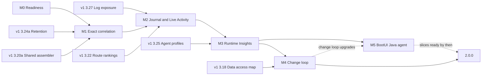
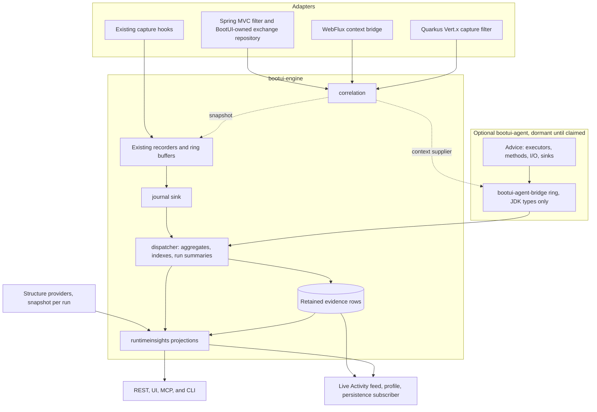

# BootUI v2 Plan: from panels to runtime understanding

This document plans **BootUI 2.0**. The v1 plan, [PLAN.md](PLAN.md), keeps governing the 1.x line on `main`. All v2
work happens on the long-lived `v2` branch, and nothing from it is released before 2.0.0 (§4). Section numbers are
stable identifiers: cite them as `PLAN-v2.md §5.1`, and never renumber or reuse them. An item is 📋 Planned, 🚧 In
progress, ✅ Delivered, 💤 Deferred, or ❌ Cut.

This revision incorporates three independent audits, on product strategy, technical feasibility, and adoption and
agent value, and the reordered v1 plan. Appendix A records every proposal and what was done with it.

## 1. Strategy

### 1.1 The problem

BootUI 1.x ships 60 panels. Each panel is precise about its own source: SQL Trace about statements, Traces about
spans, Security about authentication events, Transactions about transactions. The questions developers and their AI
agents actually ask cross those sources:

- Why is this route slow, across all its requests rather than in one trace?
- What does my change touch, and how much real traffic goes through it?
- Did my last change make anything slower, or break anything?
- Which work ran without a request, and why?
- Can an anonymous user reach data that only administrators should see?

Today a developer answers these by joining panels in their head. Where BootUI joins sources itself (Live Activity
nesting, the request profiler, SQL route attribution), the join is re-derived after the fact from trace ids, serving
threads, and time windows. A proof of concept on the Spring MVC sample app measured the gaps:

| Evidence on Spring MVC, 1.19.0 | Measured |
| --- | --- |
| HTTP exchanges carrying a trace id when identical requests overlap, tracing on | 79 % (608 of 767) |
| Request-thread SQL linked to its request by trace id | 163 of 206 on H2; 205 of 207 with PostgreSQL. Without tracing, only the serving-thread and time tiers remain |
| Exception occurrences and security events carrying a trace id | None. Live Activity nests 43–63 % of security events by serving thread and time |
| Kafka sends attached to the request that produced them | Live Activity keeps every Kafka row top-level; the PoC's time join matched 4 of 31 |
| SQL statements with no owning request | 90 of 425, on `pool-N-thread-N` |
| Live Activity window at the scenario's 88 events per second | 200 entries, about 2.3 seconds |
| Live Activity persistence | A poller reading that window every 2 seconds, lossy above about 100 events per second |

Spring WebFlux and Quarkus already stamp trace ids on some of these records, but none of the stacks has a request
identity that works without tracing.

The M0 correlation scenario (§5.1) then measured the same gap in CI, with tracing on, by sending identical requests
paced like a developer clicking, back-to-back like a test loop, and simultaneously like parallel calls:

| Stack | Paced | Back-to-back | Simultaneous |
| --- | --- | --- | --- |
| Spring MVC: requests with a trace id; SQL, security, and cache nested under their request | 100 % | 0 % | 0 % |
| Spring WebFlux: requests with a trace id; SQL and cache nested under their request | 100 % | 0 % | 0 % |
| Quarkus: requests with a trace id; SQL and exceptions nested under their request | 100 % | 100 % | 100 % |

On Spring, any two identical requests within ±50 ms of each other lose their link, which a test suite or a page's
parallel calls do all the time. Quarkus is exact because BootUI owns its exchange capture and stamps the trace id
directly, which is the design §5.1 extends to every stack.

Once the PoC joined the same events exactly, it surfaced findings no single panel shows:

- secured routes spending 94 % of their time before the controller, in HTTP Basic password hashing;
- the 7 beans and 571 requests that a change to one repository reaches;
- a transaction holding its connection while doing almost no database work;
- 90 statements that lost their request context on an executor;
- a search route whose median moved from 2 ms to 9.5 ms between two runs, which the comparison must attribute to the
  switch from H2 to PostgreSQL rather than report as a regression.

### 1.2 The v2 thesis

**Stamp every runtime event with exact keys when it happens, keep it in a bounded local journal, and turn it into a
few trustworthy observations exactly where developers and agents already look.** BootUI 2.0 delivers three outcomes:

1. **Exact.** Every event knows its request, trace, span, transaction, and run, with or without tracing. Live Activity,
   the profiler, and route attribution stop guessing (§5.1).
2. **Remembered.** Evidence outlives the 200-entry window and survives a DevTools restart or Quarkus live reload, so
   "what changed since the last run?" has an answer (§5.2, §5.3, §5.8).
3. **Explained.** Observations answer the questions in §1.1 in one sentence with numbers, a sample size, and a concrete
   check, in Live Activity, a Runtime Insights panel, and agent tools (§5.4–§5.9, §5.12).

The graph from the study remains the conceptual model: requests, routes, beans, tables, transactions, and messages,
joined by typed relations. With exact keys, most joins become indexed group-bys maintained as events arrive. The rest
walk a small in-memory typed runtime model (§5.4), so 2.0 needs neither a graph database nor a general graph engine.

### 1.3 What does not change

The five v1 priorities stay in force: safety and local-only operation, easy installation, useful runtime explanations,
a polished but simple UI, and testable architecture. In addition:

- **No new infrastructure.** No graph database, external process, or new heavy dependency.
- **Instrumentation stays optional.** Every capability in §5.1–§5.12 works from framework hooks alone. The BootUI Java
  agent (§5.13) is a separate artifact the developer attaches on purpose; it deepens the same evidence and never
  becomes a prerequisite.
- **A runtime view, not an advisor.** Observations carry no severity, no score, and no effect on Overview, like the
  PostgreSQL and MySQL panels. They do say what to check.
- **Nothing expensive on page load.** Observations are projections over aggregates the journal maintains as events
  arrive, read the way Live Activity already computes its KPI strip. Opening a panel or calling a read tool never
  starts a capture, a scan, a database read, or a network call.
- **Nothing leaves the machine.** The journal is local, bounded, and governed by the live exposure policy. BootUI still
  collects no telemetry about its users.
- **Honest across stacks.** Spring MVC stays the reference. Spring WebFlux and Quarkus report each capability they
  cannot provide as unavailable, with a reason.

### 1.4 Positioning

| Category | Examples | What they answer | BootUI v2's edge |
| --- | --- | --- | --- |
| Local telemetry viewers | Sentry Spotlight, the .NET Aspire dashboard | Errors, traces, and logs from a local run, some with MCP access | Nothing to run beside the application; route, principal, security decision, transaction, bean, and table joined at capture |
| Runtime-aware code intelligence | Digma, including its MCP server | Issues and change impact derived from OpenTelemetry traces | No collector or backend, and no agent required; framework structure (mappings, beans, security, transactions) joined with traffic |
| Diagnostic and coverage agents | Arthas, Glowroot, Lightrun, BlockHound, JaCoCo, Azul Code Inventory | One method, one trace, one test failure, or one coverage report at a time, each in its own tool | The optional BootUI agent (§5.13) feeds the same request ids, journal, runtime model, and observations, so method timings, executed code, and side effects join routes, transactions, and runs |
| Framework tooling | Quarkus Dev UI, Spring Boot Admin, IDE Spring debuggers | State at a breakpoint, or one source at a time | Aggregates over every request of a run, and across runs |
| Production APM | Datadog, Dynatrace, New Relic, Elastic | Sampled production behavior in a remote backend | Development-time, complete within bounds, and zero setup |
| Static software intelligence | CAST Imaging | What the code could do | What the code did in this run, with counts and timings |

The differentiator is **in-process, zero-infrastructure, framework-aware runtime evidence, the same on Spring MVC,
Spring WebFlux, and Quarkus, readable by humans and agents alike**.

## 2. Business value and success measures

### 2.1 Jobs to be done

| Job | Today in 1.x | With 2.0 | Where |
| --- | --- | --- | --- |
| Explain a slow route | One trace, then SQL Trace, then Transactions | Named phases across a route's warm requests: authentication, filters, connection wait, handler, and response write, with CPU and allocation | §5.5 `route-time-breakdown` |
| Fix repeated queries | N+1 flags one request at a time | Repeated SELECTs across a route, with the call site and the phase, including queries run while the response is written | §5.5 `repeated-selects`, `lazy-sql-after-handler` |
| Find what broke | Scan the Exceptions list | Exception groups per route, not observed in the previous run, with a check for well-known framework exceptions | §5.5 `exception-hotspots` |
| Catch a hidden failure | A 200 in HTTP Exchanges, an exception in another panel | 2xx responses whose transaction rolled back, or that recorded an exception, an error log, or a failed downstream call | §5.5 `errors-behind-2xx` |
| Understand Spring's machinery | Guess from annotations and log noise | Transactions bypassed by self-invocation, one request holding two connections, writes split across transactions, GET requests that write, and framework warnings by route | §5.5, §5.12 |
| Keep reactive code non-blocking | Invisible until production stalls | JDBC started on event-loop threads, per route and call site | §5.5 `event-loop-blocking` |
| Control AI usage | Token counts per span, one at a time | Tokens, model calls per request, prompt growth, and length-limited answers per route or job | §5.5 `ai-usage-by-route` |
| Check a change | Remember numbers, or nothing | What the reload changed: new queries, hosts, exceptions, dependencies, and restart cost, then latency | §5.8 |
| Prepare a refactoring | Beans graph without traffic | Routes a change reaches, through beans or shared tables and hosts, with observed traffic and unexercised routes | §5.7 |
| Review anonymous access | Security and SQL Trace, separately | Anonymous writes, and anonymous 2xx on routes declared protected | §5.9 |
| Give an agent runtime ground truth | The last few seconds of `get_live_activity` | Compact observations with exemplar request ids, and targeted impact and comparison tools | §5.6 |
| Know the edited code ran | Nothing: route traffic, never the method | With the agent, changed methods since the previous run, and whether any request or test executed them | §5.15, §5.17 `changed-code-not-executed` |
| Explain the handler phase | A duration between SQL and REST calls | With the agent, the application methods a route spends its handler time in, and which bean calls which | §5.14 |
| Follow work onto executors | Unowned statements on `pool-N-thread-N` | With the agent, executor work nested under its request, and work still running after the response | §5.13, §5.17 `work-after-response` |
| See everything the application touches | Only what hooked clients capture | With the agent, hosts, files, processes, environment variables, threads, thread locals, and leaked streams, per route | §5.16 |
| Find hidden failures and risky sinks | Exceptions that reach a handler | With the agent, exceptions caught and dropped in application code, and request input pasted unchanged into SQL or a command | §5.17 `exceptions-caught-in-code`, `request-input-in-sink` |
| Triage vulnerable dependencies | Every declared advisory, loaded or not | With the agent, whether the affected dependency's classes were ever loaded in this run | §5.15 |

### 2.2 How success is measured

BootUI collects no usage telemetry, and v2 does not change that. Success is measured with evidence the project
controls:

| Measure | Target | How it is verified |
| --- | --- | --- |
| Exact correlation | ≥ 99 % of request-thread events carry their request id on Spring MVC and Quarkus, with and without tracing; WebFlux reports its measured coverage | Concurrency scenario on the sample apps, in CI (§5.1) |
| Capture overhead | < 2 µs p99 for the full application-thread path on a reference machine; sample-app throughput within 5 % with the journal on versus off | Timed engine test and a sample-app benchmark scenario |
| External validity | On five open-source applications not written for BootUI (Spring PetClinic, a JHipster sample, Quarkus Super Heroes, a WebFlux sample, and a Kafka application), ≥ 70 % of observations judged actionable or informative by two reviewers, and none misleading | A validation report under `docs/`, rerun before 2.0.0 |
| Agent effectiveness | Ten scripted investigations answered correctly from tool output alone, with fewer tool calls than with 1.x tools, and five refusal fixtures where the right answer is not to edit (§5.6) | A local agent benchmark with no telemetry, baseline measured first |
| Time to first observation | ≤ 5 minutes from adding the dependency to reading a first observation, with tracing off and no extra property | Scripted walkthrough on each sample app |
| Honesty | No observation on any counterexample fixture; "not enough evidence" never reads as "no change" | Fixture tests per observation |

The M0-3 overhead baseline (`CaptureOverheadBenchmarkTest`, opt-in) measured today's capture cost on Spring MVC, on a
worst-case route that answers in about 0.7 ms: with BootUI on, the sample app sustains a median 83 % of the throughput
it reaches with BootUI off, and its p99 latency rises from 1.81 ms to 2.52 ms, with tracing sampling every request in
both configurations. Slower, realistic requests dilute this cost. The journal target above is measured on top of this
baseline, with BootUI on in both runs, and M1 and M2 must not make the BootUI-on figure worse.

### 2.3 Gates

- **After M1.** If exact correlation stays below 95 % on Spring MVC or Quarkus, fix capture before building on it.
- **After M3.** If fewer than 50 % of external-application observations are judged useful, stop adding observations and
  fold the useful ones into the existing panels they belong to.
- **Before 2.0.0.** If the overhead target is missed, the journal ships disabled by default and the release notes say
  so.

### 2.4 Feedback without releases

Nothing is published before 2.0.0 (§4.3), so feedback comes from outside the release channel:

- the external-validation report on five open-source applications (§2.2);
- a scripted three-minute demo on the sample apps, recorded at the end of M3;
- documented early-adopter builds of the `v2` branch into a local Maven repository;
- a pinned GitHub discussion for v2 feedback, linked from the README once M3 lands.

## 3. Relationship to the v1 plan

The v1 plan's diagnostics workstream (PLAN.md §2) shapes evidence BootUI already captures. BootUI 1.x is in maintenance
since 2026-09-30: its foundations (✅) are delivered on `main` and merged into `v2`, only §3.25 and §3.18 remain planned
there, and the rest of its roadmap was dropped. Where v2 relied on a dropped item, v2 now builds what it needs itself,
as the last column states. v2 builds exact
keys, the journal, and observations on top of it. **Each shared capability has one implementation and one owner.** A
v1 foundation is delivered on `main` in its wave and merged into `v2`; v2 extends it instead of duplicating it.

| v1 item and wave | Dependency | How v2 uses it |
| --- | --- | --- |
| §3.27 Log exposure policy, wave 0 ✅ | Hard, M2 | Journal `LOG` events reuse its read-time path (`LogTailReader` and the shared `MessageExposure` helper), and the journal follows the same read-time model (§8) |
| §3.24a Failure-preserving retention, wave 1 ✅ | Hard, M1 | Exact exchange correlation stamps the context in its BootUI-owned Spring `BootUiHttpExchangeRepository`, over the engine `TieredCaptureBuffer`. There is no second repository decorator |
| §3.20a Shared profile assembler, wave 1 ✅ | Hard, M1 | v2 adds a `REQUEST_ID` tier ahead of the `TRACE_ID`, `SERVING_THREAD`, and `TIME_WINDOW` tiers of `ExecutionProfileAssembler` and `CorrelationTier` |
| §3.22 Route performance rankings, wave 1 ✅ | Hard, M2 | Its `Percentiles` helper, `RouteTemplateResolver`, and `HttpRouteSummaryService` serve route comparison and every route-level observation |
| §3.25 Agent-ready profiles, wave 2 | Hard, M3 | `get_request_profile` is the drill-down behind every exemplar request id |
| §3.18 Data access map, wave 2 | Hard, M4 | `anonymous-data-reach` joins its table extraction and access classification with request authentication |
| §3.20b and §3.20c execution profiles ❌ dropped in 1.x | None | v2 owns it: M1-6 gives scheduled runs and consumed messages their own `executionId`, which the journal records as execution anchors (§5.2) |
| §3.14 Correlation-ID filtering ❌ dropped in 1.x | None | Not rebuilt. `CorrelationContext` carries no keyed lookup identity; principals are still pseudonymized under a per-process key (§8) |
| §3.21 Log correlation ❌ dropped in 1.x | None | v2 owns it: journal `LOG` events carry the full correlation context at capture (§5.2) |
| §3.23 Scheduled task run history ❌ dropped in 1.x | None | v2 owns it: journal scheduled-run events feed run comparison (§5.2, §5.8) |

Three design points shape how v2 reuses v1 foundations:

- §3.20's tiers stay as fallbacks once `REQUEST_ID` exists.
- The journal follows §3.24's reservation for evidence rows only. Route and statement statistics come from aggregates
  counted before eviction, so retention never biases percentiles (§5.2).
- v2 CLI commands follow §3.25's naming rule: unique paths, never a prefix of another path.

## 4. Roadmap, branch, and releases

### 4.1 Order of work

| Milestone | Delivers | Depends on | Effort (engineer-days, rough) | Status |
| --- | --- | --- | --- | --- |
| **M0 Readiness** | CI on `v2`, the correlation and overhead scenarios as baselines, and the propagation and restart spikes (§5.1, §5.8) | — | 5–8 | ✅ Delivered |
| **M1 Exact correlation** (§5.1) | One correlation context on every event, with or without tracing, on all three stacks, and the request phase markers | M0; v1 wave 1 (§3.20a ✅, §3.24a ✅) | 45–56 | 🚧 In progress |
| **M2 Journal and Live Activity** (§5.2, §5.3, §5.11) | The in-memory journal, incremental aggregates, run summaries, resource correlation (scope readings, GC by id, CPU ledger, resource track), and Live Activity served from the journal with its unified timeline | M1; §3.22, §3.27 | 44–56 | 📋 Planned |
| **M3 Runtime Insights** (§5.4–§5.6) | Projections, the runtime model, the panel, Live Activity entry points, twelve observations, agent tools, and the demo | M2; §3.25 | 52–65 | 📋 Planned |
| **M4 Change loop and 2.0 readiness** (§5.7–§5.9, §5.12) | Change impact, run comparison and behavior diff, anonymous access, proxy bypass, external validation, and the release path | M3; §3.18 | 33–45 | 📋 Planned |
| **M5 BootUI Java agent** (§5.13–§5.17) | The optional agent, executor propagation, Code Paths, Code Inventory, Side Effects, and agent evidence in observations, comparison, and tools | M3 for observations; M4 for the change-loop upgrades | 90–116 | 📋 Planned |

M0–M4 total about **179–230 engineer-days**, roughly seven to nine months with two developers who also maintain 1.x.
Opt-in JFR attribution (§5.11) is not included; it adds 6–9 engineer-days if D17 brings it into 2.0.
M5 is estimated separately and **does not gate 2.0.0** (D20): its slices land on `v2` as they are ready, what is merged
when M4 meets its gates ships in 2.0.0, and the rest follows in 2.x.
The v1 foundations are estimated in their own plan. Before v1 wave 1 lands, `v2` works on M0 and the spikes.

M0 is split into four items:

| Item | Delivers | Status |
| --- | --- | --- |
| M0-1 | `build.yml` runs on `v2` pushes and pull requests | ✅ Delivered |
| M0-2 | The correlation coverage scenario on Spring MVC, Spring WebFlux, and Quarkus, recording the baseline in §1.1 | ✅ Delivered |
| M0-3 | The capture overhead scenario, recording the baseline for the §2.2 overhead target | ✅ Delivered |
| M0-4 | The WebFlux propagation spike (§5.1) and the DevTools restart and Quarkus live-reload spike (§5.8) | ✅ Delivered |

M5 is split into slices ordered by business value, each one pull request to `v2`. The spike comes first; each later
slice depends on M5-1, and on the milestone named:

| Item | Delivers | Depends on | Effort (engineer-days) | Status |
| --- | --- | --- | --- | --- |
| M5-0 | Spike: one bridge class across DevTools restarts and Quarkus live reloads, retransformation cost, coexistence with the OpenTelemetry agent, JaCoCo, IntelliJ's debugger agent, and Mockito, and executor-propagation overhead (§5.13) | M1 | 5–7 | 📋 Planned |
| M5-1 | The `bootui-agent` and `bootui-agent-bridge` artifacts, claim and release, the transport ring, the **Java Agent** panel with setup snippets, and opt-in self-attach | M5-0, M2 | 12–15 | 📋 Planned |
| M5-2 | Executor propagation, the `PROPAGATED` tier, and **after response** work | M5-1 | 6–8 | 📋 Planned |
| M5-3 | Executed and changed methods, dependency use, and `changed-code-not-executed` (§5.15, §5.17) | M5-1, M3 | 8–10 | 📋 Planned |
| M5-4 | Component-boundary timing, route trees, the **Code Paths** panel, and the handler split of `route-time-breakdown` (§5.14) | M5-1, M3 | 12–15 | 📋 Planned |
| M5-5 | The **Side Effects** panel's network, files, processes, environment, threads, thread-local, resource, and blocking sensors, with their observations (§5.16, §5.17) | M5-1, M3 | 14–18 | 📋 Planned |
| M5-6 | Caught exceptions and security sinks, with `exceptions-caught-in-code` and `request-input-in-sink` | M5-5 | 8–10 | 📋 Planned |
| M5-7 | Change impact by method and run comparison led by code changes (§5.17) | M5-3, M5-4, M4 | 6–8 | 📋 Planned |
| M5-8 | Method probes, in the UI and as agent tools (§5.14, §5.17) | M5-4 | 8–10 | 📋 Planned |
| M5-9 | Vulnerable code reach and dynamic access recording with its reachability-metadata export (§5.15) | M5-3 | 6–8 | 📋 Planned |
| M5-10 | The remaining agent tools, the `verify_after_change` and `diagnose_runtime_issue` updates, the agent benchmark investigation, and documentation | M5-3, M5-4, M5-5 | 5–7 | 📋 Planned |



### 4.2 Branch strategy

- `v2` is a shared, long-lived branch created from `main`. It is never rebased or force-pushed.
- `main` keeps the 1.x line and the v1 plan. `main` is merged into `v2` at least weekly and after every 1.x release,
  with merge commits, so v1 fixes and foundations reach v2 continuously.
- **Before starting any new v2 work**, sync first:
  1. merge the latest `main` into `v2` and resolve conflicts;
  2. review what changed in PLAN.md and in the v1 items this plan depends on (§3);
  3. update this plan when those changes affect it, in its own documentation commit, before the work begins.

  Examples include a shipped or reordered wave, a changed v1 specification, a new shared helper, or a new
  cross-cutting rule.
- v2 pull requests target `v2`, stay small, and pass the same gates as `main` pull requests (§9, §11).
- **M0-1** extends `.github/workflows/build.yml` push and pull-request filters to `v2`, so the full build, conformance
  runners, and browser suites run on every v2 change.
- Existing 1.x bugs found by this work are fixed on `main` as 1.x patches, not held for 2.0 (D8). Both found so far
  are fixed and merged into `v2`: Live Activity persistence on MySQL and Oracle (#1144), and call sites in the sample
  apps (#1143).

### 4.3 Releases

- **Nothing is published from `v2` before 2.0.0**, a maintainer decision (D5). The release workflow accepts only
  `major.minor.patch` versions, so there are no preview coordinates on Maven Central.
- When M4 meets its gates, `v2` is merged into `main` and **2.0.0** is released from `main`.
- **Before 2.0.0**, the release path must allow later 1.x patches. `release.yml` computes the next version from the
  newest stable tag in the whole repository, so after `v2.0.0` a `1.x` patch would be rejected, and every release
  redeploys the documentation site at its tag. M4 changes both, in lockstep with
  `.github/scripts/check-release-integrity.sh`:
  - compute the next version within the source branch's major version;
  - redeploy documentation only when the release is the newest major.
- 2.0.0 removes what 1.x deprecates, each with a migration note in `CHANGELOG.md`:
  - `TraceIdProvider`, replaced by `CorrelationContextProvider` (§5.1);
  - the Live Activity poller, replaced by the journal subscriber (§5.3).
- Java 17, Spring Boot 4, and the newest Quarkus LTS remain the baselines.

## 5. Feature specifications

### 5.1 Exact correlation — Cross-cutting 📋 Planned

Every runtime event should know, when it happens, which request, trace, span, transaction, and run it belongs to, with
or without tracing. Today the Spring MVC exchange's trace id is re-derived by `HttpExchangeTraceRegistry.match` (method
and path, ±50 ms, unique candidate only), exceptions and security events on Spring MVC carry no trace id, and no stack
has a request identity that works without tracing. Adding fields is the easy part; **propagating the context across
thread, Reactor, and Vert.x boundaries is the critical engineering problem**.

Scope:

- Add `CorrelationContext` to the engine: a BootUI-generated `requestId`, `traceId`, `spanId`, `routeTemplate`,
  `handler`, the innermost BootUI `transactionId`, the current statement's `dataSource`, an `executionId` for scheduled
  and consumed-message anchors.
- Add a `CorrelationContextProvider` SPI that replaces `TraceIdProvider`, and a scope-based holder that always restores
  the previous context. 1.x adapters keep `TraceIdProvider` as a fallback until 2.0.0 removes it.
- Stamp the context at the existing capture points of exchanges, SQL, transactions, exceptions, security events, REST
  client calls, cache accesses, logs, scheduled runs, Kafka, RabbitMQ, JMS, email, fault tolerance, and AI calls.
- Record exception **occurrences** as immutable events with their own identity, not the updated exception group.
- Snapshot the context before a message send and read producer metadata in the send callback. On consume, open a child
  context from `traceparent` when present. Metadata only, never payloads.
- Add a `REQUEST_ID` tier ahead of §3.20's tiers in the shared profile assembler.
- Add a run identity per **application-context start**, so a DevTools restart or Quarkus live reload starts a new run
  inside the same JVM, and publish `instanceId` and `runId` in `/overview` metadata.
- Add nullable, additive `requestId` fields (and `spanId`, `transactionId`, `dataSource`, `thread` where missing) to
  the affected DTOs, each with a secondary constructor matching today's canonical one.
- Record the **thread kind** of every event (request worker, virtual thread, Reactor Netty or Vert.x event loop, Reactor
  scheduler, or other), classified by the adapter that owns the thread rather than guessed from its name later. For an
  operation, record the kind of the thread it **started** on, not the one it completed on.
- Record **request phase markers** in the context: handler dispatch and handler return, and the start of response
  writing and view rendering. Spring MVC uses `HandlerInterceptor` and `ResponseBodyAdvice`, WebFlux its handler
  adapter, and Quarkus JAX-RS filters and a `WriterInterceptor`. Where Spring Security's authentication observation is
  active, an `ObservationHandler` records the authentication interval, as `ScheduledTaskRunObservationHandler` already
  does for scheduled runs.
- Record the Spring for GraphQL operation type and name from its `graphql.request` observation, so each operation is a
  route of its own.
- Keep the port in Live Activity REST client summaries, so two local services on different ports stay distinct.

Architecture:

- **Spring MVC.** `RequestCorrelationFilter` opens the scope before `chain.doFilter` and fills the route template and
  handler after routing. Async dispatch reopens the scope from a request attribute and closes it on completion,
  timeout, error, and cancellation. The exchange is stamped in §3.24a's BootUI-owned `HttpExchangeRepository`, whose
  `add` Actuator's `HttpExchangesFilter` calls synchronously on the request thread after `doFilter` (verified on Spring
  Boot 4.1.1). An application-provided repository is never wrapped: its exchanges keep the registry match and report
  their tier.
- **Spring WebFlux.** A BootUI WebFilter creates the request's `CorrelationContext`, stores it on the
  `ServerWebExchange`, writes it into the Reactor context, and exposes it through a Micrometer `ThreadLocalAccessor`
  backed by BootUI's scoped holder. BootUI contributes `spring.reactor.context-propagation=auto` as an overridable
  default whenever exact correlation is on, not only when OpenTelemetry is present as today, so blocking JDBC, cache,
  logging, and transaction callbacks read the request id synchronously. The BootUI-owned `HttpExchangeRepository`
  reads it in `add`, which Spring Boot 4.1.1's `HttpExchangesWebFilter` calls inside `beforeCommit`. An
  application-provided repository is not wrapped and keeps its fallback tier. Work outside Reactor and
  Spring-managed execution stays unowned, never guessed.
- **Quarkus.** `QuarkusHttpExchangeCaptureFilter` owns exchange capture, so it stamps the exchange directly, stores the
  context on the Vert.x `RoutingContext`, and restores it around worker dispatch and Mutiny hops it controls.
- **Transactions.** `BootUiTransactionExecutionListener` pushes and pops the transaction id for blocking
  `PlatformTransactionManager` transactions, including those run by WebFlux applications. R2DBC and Quarkus
  transactions stay unavailable.
- Every adapter keeps optional types (OpenTelemetry, messaging, security) in gated classes.

Out of scope:

- Generating, replacing, or propagating correlation headers on behalf of the application.
- `@Async`, `CompletableFuture`, and executor instrumentation. Work on unwrapped executors stays visible as unowned work
  (§5.5), with the `TaskDecorator` the application can add. The optional BootUI agent propagates the context through
  executors (§5.13).

Baseline (M0-2). `AbstractCorrelationCoverageTest` in `bootui-conformance` runs on all three stacks. It reads only
the public Live Activity feed and writes its report to `target/correlation-coverage/`. Besides the table in §1.1, it
found:

- **Exchange ids collide.** `HttpExchangesService` hashes an exchange's millisecond timestamp, method, displayed URI,
  status, and duration into its id, so identical requests that start in the same millisecond and take as long share an
  id, and their profiles become ambiguous. The scenario observed it on Spring MVC and Spring WebFlux. M1 gives each
  request its own identity.
- **Exceptions appear once per group.** Live Activity shows one `EXCEPTION` row per exception group, dated by its last
  occurrence, so repeated failures of one route nest at most once. M1 records immutable occurrences.
- **`since` is ignored on Quarkus** without persistence, while Spring honors it. The scenario filters by window itself.
- **Tracing could not be switched off** with `management.tracing.enabled=false` in a Spring Boot 4 test, so the
  tracing-off baseline moves to M1, together with the secured, Kafka, and raw-executor routes.

Acceptance criteria:

- The correlation scenario, extended with tracing off, Kafka sends, and a raw executor, enforces the §2.2 target as its
  floors on Spring MVC and Quarkus in every phase, and WebFlux reports its measured coverage.
- Contexts never leak between requests on reused platform threads, virtual threads, Reactor schedulers, or Vert.x
  worker hops, including after async timeouts and cancellations.
- A DevTools restart and a Quarkus live reload each produce a new `runId`.
- Every new DTO field is nullable and additive, and `BootUiApiContractCatalog` and the three conformance runners pass.
- The request profiler no longer marks request-thread work approximate.

Delivery slices, each one pull request to `v2` with its own tests and documentation:

| Slice | Delivers | Depends on | Status |
| --- | --- | --- | --- |
| M1-1 | Engine correlation core: `CorrelationContext` and the `CorrelationContextProvider` SPI, the scope-based `BootUiCorrelation` holder that always restores the previous context, `ScopedCorrelationContextProvider` (which fills in the trace id from `TraceIdProvider`), `RequestIds`, and `RunIdentity`. No capture changes yet | — | ✅ Delivered |
| M1-2 | Quarkus: `QuarkusHttpExchangeCaptureFilter` generates the request id, attaches its context to the request's Vert.x duplicated context (`QuarkusRequestCorrelation`), which Quarkus carries to worker and virtual threads, and opens a thread scope while the chain runs on the event loop. The exchange is stamped with it, and `HttpExchangeDto.requestId` becomes the exchange's id. A Quarkus `CorrelationContextProvider` bean reads it without OpenTelemetry | M1-1 | ✅ Delivered |
| M1-3 | Spring MVC: `RequestCorrelationFilter` generates the request id and opens its scope around the chain, reopening it on an async redispatch without recording the request twice. §3.24a's BootUI-owned repository stamps each exchange with the id current when Actuator adds it, and Live Activity nests SQL by request id before its time-window tiers. The Spring coverage scenario enforces 100 % SQL nesting in every phase. Phase markers move to M1-6, and work in the `/error` dispatch stays unscoped | M1-1, §3.24a ✅ | ✅ Delivered |
| M1-4 | Spring WebFlux: `ReactiveRequestCorrelationFilter` is both an `HttpHandlerDecoratorFactory`, so the request id also covers exception rendering and the response commit, and a WebFilter that keeps it on the exchange. It writes the id into the Reactor context, and `BootUiCorrelationThreadLocalAccessor` (loaded only with Micrometer context propagation) restores it on every scheduler hop. `spring.reactor.context-propagation=auto` is now contributed for every reactive application with Micrometer context propagation, not only with OpenTelemetry. The exchange is stamped in `beforeCommit` and SQL by the recorder. The WebFlux coverage scenario enforces 100 % SQL nesting in every phase, and all three scenarios enforce that no two requests share an id | M1-1, §3.24a ✅ | ✅ Delivered |
| M1-5a | Request ids on SQL: `SqlTraceRecorder` stamps `CapturedStatement.requestId` from a `CorrelationContextProvider` (the Quarkus Vert.x context on Quarkus), `SqlTraceEntryDto.requestId`, and Live Activity nests a statement under the request whose id it carries before trying its trace id. The Quarkus coverage scenario without tracing enforces 100 % SQL nesting in every phase | M1-2 | ✅ Delivered |
| M1-5b | Request ids on security events, REST client calls, cache accesses, email, and fault-tolerance events. The engine's `CorrelationSource` gives every recorder the same guarded, replaceable provider (the thread scope, or the Vert.x context on Quarkus), and `RequestIdStamps` keeps the id beside framework objects BootUI cannot extend: Actuator's `HttpExchange` and `AuditEvent`. Live Activity nests each signal by request id before its other tiers on all three stacks, and the N+1 flag and secured-principal badge use the same join. The Spring coverage scenarios enforce 100 % security and cache nesting in every phase, and Quarkus integration tests prove the REST client and security stamps | M1-5a | ✅ Delivered |
| M1-5c | `REQUEST_ID` is the first `CorrelationTier` in `ExecutionProfileAssembler`, available on every adapter: SQL, security events, REST client calls, and cache accesses carrying a request's id join its profile exactly, before the trace id, and a signal carrying another captured request's id is never claimed. A Spring WebFlux or Quarkus request carrying either id is profileable through the engine's shared `LiveActivityAssembler.withExactProfiles`, so a reduced profile no longer needs a trace id; the Quarkus integration test without OpenTelemetry now proves an available profile | M1-5b | ✅ Delivered |
| M1-5d | Request ids on exceptions: `ExceptionStore` stamps each immutable occurrence through the shared `CorrelationSource`, which also covers the Logback appender path that had no id at all. `ExceptionOccurrenceDto.requestId` and `ExceptionGroupDto.lastRequestId` are additive. Profiles attribute each occurrence by request id first, and Live Activity nests a group under the request its latest occurrence came from. All four coverage runners enforce 100 % exception nesting. Per-occurrence feed events and request ids on log events move to the §5.2 journal, whose `LOG` and exception-occurrence events carry the full context at capture | M1-5b | ✅ Delivered |
| M1-6a | Run identity: `/overview` publishes a `run` object (`instanceId`, `runId`, `ordinal`, `startedAt`) on all three stacks, in the contract catalog. Spring creates one eager `RunIdentity` bean per application context and Quarkus one per application start, so a DevTools restart or a Quarkus live reload is a new run of the same instance | M1-1 | ✅ Delivered |
| M1-6b | Execution ids for scheduled runs: each run opens its own `CorrelationContext` with an `executionId` (Spring through its scheduled-task observation scope, Quarkus through a build-time interceptor on `@Scheduled` methods, since the scheduler's single `JobInstrumenter` belongs to OpenTelemetry). SQL, exception occurrences, and REST client calls carry the id, and Live Activity nests them under the run on both adapters. Replaces the dropped §3.20b | M1-5 | ✅ Delivered |
| M1-6b2 | Spring messaging: each consumed Kafka record, RabbitMQ delivery or batch, and JMS message opens its own execution context around the listener, which the listener's SQL, exceptions, REST client calls, and messages carry, and Live Activity nests them under the consumed message. An outgoing message nests under the request, scheduled run, or consumed message that sent it; Kafka snapshots the sender's context in a `ProducerInterceptor`, keyed by record identity, because it reports sends on its I/O thread. Replaces the dropped §3.20c on Spring | M1-6b | ✅ Delivered |
| M1-6b3 | Quarkus messaging: SmallRye Reactive Messaging has no same-thread bracket around a listener, so consumed messages need a build-time interceptor on `@Incoming` methods, like `@Scheduled`, and outgoing messages the request's Vert.x context; and a consume opens a child of `traceparent` when present | M1-6b2 | 📋 Planned |
| M1-6c | Thread kinds recorded by the adapter that owns the thread (request worker, virtual thread, event loop, Reactor scheduler, other), for the thread an operation started on | M1-5 | 📋 Planned |
| M1-6d | Request phase markers (handler dispatch and return, response writing, view rendering, the Spring Security authentication interval), and the Spring MVC `/error` dispatch reopening the request's scope | M1-5 | 📋 Planned |
| M1-6e | Spring for GraphQL operation type and name from its `graphql.request` observation, and the port kept in REST client summaries | M1-5 | 📋 Planned |

### 5.2 Runtime journal — Diagnostics 📋 Planned

Each panel keeps its own ring buffer, and Live Activity persistence polls a 200-entry merged window, so bursts lose
events. This item records every runtime event once in a push-based, bounded, in-memory journal, and maintains the
aggregates that observations read.

Scope:

- A `RuntimeEvent` envelope: instance, run, sequence, stable event id, type, time, duration, request, execution,
  trace, span, thread, and correlation tier, with a small immutable payload per prioritized source (HTTP, SQL,
  transaction, exception occurrence, security, REST client, cache, messaging, scheduled run, and log).
- A `RuntimeEventSink` called right after each recorder's existing ring-buffer write, through a non-blocking `offer`
  into a bounded queue drained by one `bootui-journal-dispatch` daemon thread. On overflow the event is dropped and
  counted per source; the application thread never blocks.
- **Incremental aggregates** maintained by the dispatcher, before any eviction: per route (count, status classes,
  latency histogram, time split), per statement fingerprint (count, time, N+1 groups, call sites), per exception group
  and route, per transactional method, per thread family without a request, and per run. Every aggregate has a
  cardinality cap with an overflow bucket.
- **Evidence rows**: the retained events, bounded by `max-events` (50,000) and `max-bytes` (the smaller of 32 MB and
  5 % of the maximum heap), with §3.24's reserved share for failed and slow events. Aggregates, not retained rows, feed
  percentiles.
- **Run summaries**: a bounded (≤ 256 KB) summary of each run's aggregates, kept across application-context restarts
  in the same JVM (§5.8).
- Self-exclusion of BootUI's threads, paths, and JDBC (`BootUiJdbcCaptureGuard`), including BootUI's own PostgreSQL,
  MySQL, and Database Advisor reads.
- A journal status block (events, bytes, drops per source, evictions, oldest retained event) in Live Activity's
  persistence disclosure, and a confirmation-gated **Clear recording** action that read-only policy blocks.
- **Per-request CPU time, allocated bytes, and GC pauses**, measured by §5.11's scope readings: summed over every
  segment a request runs on a thread, including thread hops, and unavailable, with the reason, on virtual threads.
- **Connection checkout and release** timestamps and the pool of each logical connection, from the JDBC proxy, which
  already intercepts `getConnection`, so connection wait, connection holding, and connections per request are measured.
- Up to **four interned application frames** per SQL, REST client, and cache event, with their method types, where
  1.x keeps one call site.
- For framework loggers, the **unformatted message template** of each `WARN` and `ERROR` event, so warnings group
  exactly without storing their arguments.
- Properties under `bootui.runtime-journal.*`: `enabled`, `max-events`, `max-bytes`, `queue-capacity`, and `sources`,
  which also accepts `gc` and `resources` (§5.11).

Architecture:

- The journal is a sibling SPI to `ActivityStore` in a new `journal` engine package. It reuses sequencing, instance
  ids, and the capture guard.
- Sequences are unique per `(instanceId, runId)`, so a restart never collides with a previous run.
- The dispatcher owns aggregation, so the application thread only snapshots, allocates the envelope, and offers.

Storage design decisions (settled before M2; defaults are properties unless noted):

| Decision | Choice | Why |
| --- | --- | --- |
| Clocks | Durations come from `System.nanoTime()`; epoch milliseconds are kept only to order events across sources and to display them | Wall clocks jump, and sub-millisecond local SQL must not collapse to zero |
| Latency percentiles | A log-linear histogram written in the engine: microsecond values, 32 powers of two (1 µs to about 36 minutes), 16 linear sub-buckets each, so any percentile is within 6.25 % of the true value. Aggregates hold a dense `int[512]` (2 KB); run summaries serialize only non-empty buckets | Deterministic, mergeable across runs, and dependency-free. A t-digest is harder to merge and test, and fixed-width buckets cannot span 0.5 ms to 30 s |
| String sharing | A per-run dictionary interns route templates, handlers, statement fingerprints, normalized SQL, call sites, thread families, datasource names, and exception-group ids; events hold small integer codes | Keeps the average retained event within the byte budget |
| Byte accounting | The dispatcher estimates each retained row's size once (a fixed overhead per event type plus the lengths of its non-interned strings) and keeps a running total, evicting until both the count and byte bounds hold. Dictionaries count against the same budget | A bounded journal needs a bound it can compute in O(1) |
| Evidence ring | Array-backed rings, one for routine events and one for the reserved failed-and-slow share (10 % by default), newest first across both | O(1) insertion and eviction, and §3.24's semantics |
| Budget per event | At 50,000 events in 32 MB, about 670 bytes per event including indexes, which a typical interned SQL event (400–750 bytes) meets. On a small heap, the 5 % byte bound binds before the count bound | The status block names the bound that binds, with the oldest retained time |
| Cardinality caps | 500 routes, 2,000 statement fingerprints (50 per route), 500 exception groups, 100 thread families, and 20 call sites per fingerprint. Beyond a cap, events go to a visible **Other** bucket with a count | A dynamic path or unparameterized SQL cannot exhaust memory or silently disappear |
| Queue and drops | `queue-capacity` 10,000; the last 10 % admits only failed or slow events, so routine events drop first. The dispatcher drains in batches of up to 512 events | Bursts must not drop the evidence developers came for |
| Run summaries | The holder keeps the 5 most recent runs, each ≤ 256 KB (≤ 1.3 MB in total), evicting the oldest. Summaries hold templates, fingerprints, group ids, counts, histograms, and each run's comparability facts: never principals, values, or SQL literals | Enough history for "since the last few reloads" at a fixed cost |
| Windows | Every report states two windows: the **aggregate window** (all events of the run, before eviction) and the **evidence window** (retained rows, biased toward failures by the reservation) | Percentiles and exemplars answer different questions and must not be confused |

Out of scope for 2.0:

- A JDBC event journal. Live Activity persistence keeps its existing `bootui_activity` table, now fed by a journal
  subscriber instead of the poller (§5.3). A durable event store is revisited only on demand (§5.10).
- Payloads of messages, request bodies, bind values, and email bodies, subjects, or recipients.

Acceptance criteria:

- The PoC scenario (767 requests in about 22 s) records every event with zero drops at default settings on all three
  stacks.
- A burst beyond the queue drops and reports the drops, and a test proves request latency is unaffected by a stalled
  dispatcher.
- Aggregates reconcile with every event published, including events evicted from the retained rows.
- BootUI's own traffic and SQL never enter the journal.

### 5.3 Live Activity on the journal — Overview 📋 Planned

Live Activity is where developers already connect events, and where the missing links show. This item serves it from
the journal and extends its request profile, behind parity tests, before the poller is retired.

Scope:

- Serve the Live Activity feed, Live Flow, and SSE stream from the journal. Live Activity persistence writes the
  existing `bootui_activity` rows from a journal subscriber, so bursts are no longer lost and no table changes. The
  subscriber never writes rows less masked than `MASKED` (§8).
- Nest children by `REQUEST_ID` first, then §3.20's tiers, so request-thread SQL, security, cache, exception, log, and
  Kafka rows sit under their request.
- Add transaction, log, and AI call rows on the stacks that capture them.
- Add filters for route template, run, and request id, and show work with no request under a **No request** filter,
  with its thread family and reason.
- Extend the request profile, additively, with:
  - a **unified timeline** of spans, SQL, transactions, cache accesses, and log lines on one axis, with a GC lane
    naming the collections that completed during the request (§5.11);
  - a **route comparison**: this request against its route's p50 and p95 from the aggregates;
  - **touched resources**: tables, transactions, caches, messages, and log lines;
  - **why this route is slow**: the route's `route-time-breakdown` observation when it exists (§5.5).

Architecture:

- `LiveActivityAssembler` keeps its severity and KPI logic and reads journal events instead of polling buffers.
- Route comparison reuses §3.22's percentile helper over the journal's histograms.
- The poller path remains available until parity passes on all three stacks, and 2.0.0 removes it.

Acceptance criteria:

| Measure | 1.19.0 | 2.0 target |
| --- | --- | --- |
| Request-thread SQL under its request | 79 % on H2 by trace id; none without tracing beyond serving-thread and time tiers | 100 %, with or without tracing |
| Security events under their request | 43–63 %, by serving thread and time | 100 % of request-scoped events, by request id |
| Kafka sends under their request | 0 % | 100 % of sends on a request thread |
| Default history at 88 events per second | about 2.3 seconds | up to about 9.5 minutes when the count bound binds first; the oldest retained time is always shown |
| Loss with persistence on | above about 100 events per second | none below the queue bound; drops counted |

- Parity tests on the same fixture cover KPIs, ordering, SSE, clear and toggle behavior, profiles, and disabled
  sources, against the 1.x feed.
- Existing Live Activity API consumers keep working: DTO changes are additive.

### 5.4 Runtime projections and runtime model — Engine 📋 Planned

Observations need joins across sources. With exact keys, those joins are lookups in the journal's aggregates and small
indexes, so this item replaces the draft's general graph engine with bounded projections and one small typed graph.

Scope:

- Per-request, per-route, per-table, and per-bean indexes over retained events, maintained by the dispatcher.
- Structure from existing providers only: mappings, beans and their dependencies, repositories, and ArC injection
  edges on Quarkus. Snapshot the structure per run, so an observation never joins one run's events with another run's
  mappings or beans.
- Table references from §3.18's extraction, computed once per statement fingerprint on the dispatcher, never on the
  capture path.
- A **runtime model**: typed nodes (route, GraphQL operation, scheduled job, bean, repository, table, cache, outbound
  host, topic or queue, AI model, and exception group) and typed edges (depends on, handled by, reads, writes, calls,
  publishes, consumes, and raises). Each edge carries per-run counts, first and last seen, and its **provenance**:
  declared by structure, observed in an owned execution, or inferred from shared access to a resource. The dispatcher
  builds it from the aggregates, within the cardinality caps and the byte budget: about 5,000 nodes and 30,000 edges
  at most.
- Three small algorithms with property-based tests: reverse closure over an allowlist of edge types, depth ≤ 5 (change
  impact); interval unions (timeline breakdowns); and edge-set differences between runs (behavior diff).
- A read budget of 250 ms per projection over a full journal. Exceeding it returns a `PARTIAL` result with the reason.
- Every join carries its correlation tier, and each observation declares the minimum tier it accepts.

Architecture:

- Structural reach, observed execution, and shared-resource access are never merged into one claim. A path through a
  shared table means two routes used the same table, never that one read the rows the other wrote.
- The model is an in-memory adjacency structure of interned ids, not a database: it has no query language, and agents
  reach it only through named tools (§5.6).

Out of scope for 2.0:

- A graph database, graph query languages, community detection, and centrality (§5.10).

Acceptance criteria:

- Projections over 50,000 retained events and full aggregates stay within the read budget on a reference machine,
  pinned by a tagged, generously margined timed test.
- The PoC evidence, converted into a Java fixture builder, reproduces the PoC's findings that 2.0 keeps.
- A fixture where two routes share only a table never reports a path between their executions.

### 5.5 Runtime Insights panel — Overview 📋 Planned

A new panel, `runtime-insights`, titled **Runtime Insights**, in the Overview group directly after Live Activity. It
lists the current observations and is reachable from where developers already are.

Scope:

- `GET {api}/runtime-insights` returns the current observations, projected on read from the journal's aggregates.
  There is no analyze action, so there is no busy state and no read-only exception.
- `GET {api}/runtime-insights/insights/{id}` returns one observation's evidence: the top 20 rows, a truncation count,
  and deep links.
- The report carries its window (runs, time range, events per source, drops, evictions), a **correlation coverage**
  breakdown per source, the observations, a **Not exercised in this run** list of declared routes, and limitations.
- Each observation carries a stable id (`kind:subject`, surviving refreshes), a status (`OBSERVED`, `INSUFFICIENT`,
  `NOT_APPLICABLE`, `NOT_COMPARABLE`, or `PARTIAL`), one measured sentence, the eligible and affected request counts,
  the minimum tier used, **What to check** (one to three imperatives with panel links), at most three exemplar request
  ids, bounded masked evidence, and limitations. Insufficient evidence names what is missing, for example "`GET
  /api/orders`: 2 of 5 requests needed".
- **Evidence completeness comes first.** Each observation reports the coverage of the sources it reads and their drops.
  Drops, capture pauses, cardinality overflow, or incomplete correlation make an absence claim `PARTIAL`. Minimum
  counts decide when an observation is shown, not how confident it is: a single exact event can establish a fact, and
  repetition establishes recurrence, never a cause.
- The first request of each route in a run is reported apart as **cold** (for example "first request 412 ms; warm
  median 11 ms") and excluded from percentiles.
- A Spring for GraphQL operation is a route of its own: its type and name, from the `graphql.request` observation,
  subdivide `POST /graphql`, so route-level observations stay meaningful for GraphQL applications.
- Observations in M3:

| Id | Observation | Minimums | Stacks |
| --- | --- | --- | --- |
| `route-time-breakdown` | Where a route's warm requests spend their time, as named phases: **authentication** (Spring Security's authentication observation), **other filters**, **connection wait**, **handler** (SQL, REST client, AI calls, and the rest), and **response write** (serialization and view rendering). Intervals are unioned, so overlapping calls never add up to more than the request, and overlap and unattributed time are shown. CPU time and allocated bytes per request appear as columns where measured (§5.11) | ≥ 5 warm requests. Shown at any latency; prominent when p50 ≥ 20 ms or one phase ≥ 50 % | All three. The authentication phase is Spring only. Quarkus ORM SQL time is unknown, and the sentence says so. CPU is unavailable on virtual threads without JFR attribution |
| `repeated-selects` | Repeated SELECTs (suspected N+1): one normalized SELECT fingerprint executed ≥ 5 times in a request after a different statement, with the call site, the phase (handler or response write), whether the repeats ran in a transaction, and whether their count tracks the result size | ≥ 3 affected requests. In the default agent list only when their total time is ≥ 50 ms | All three. Quarkus ORM statements count as preparations |
| `exception-hotspots` | Exception groups per route, with a cross-run signature (type and bounded class and method frames, never line numbers), marked "not observed in the previous run" when that run exercised the route. About twelve framework exceptions carry a specific check: `LazyInitializationException`, `UnexpectedRollbackException` with the inner transaction that marked it rollback-only, Jackson recursion, `OptimisticLockException`, `DataIntegrityViolationException`, and `SQLTransientConnectionException` among them | ≥ 1 occurrence | All three. Exceptions handled inside WebFlux handlers are partial |
| `errors-behind-2xx` | A 2xx response while, in the same request, (a) the root transaction rolled back, (b) an exception occurrence was recorded, (c) an `ERROR` log was written, or (d) a downstream call returned 5xx, ordered by that strength. Errors that a retry or fallback of the same policy recovered are listed apart as **recovered**. Worded "verify the response or fallback contract" | ≥ 1 request; `REQUEST_ID` tier only | All three. Evidence (a) is Spring MVC and WebFlux only |
| `transaction-across-remote-call` | A transaction still open when a REST client or AI call starts, with the connection it held (checkout to release, §5.2) and, as a labelled estimate, the throughput at which this route alone would exhaust the pool: pool size ÷ hold time | ≥ 3 transactions of one method; ≥ 20 ms | Spring MVC and WebFlux blocking transactions. Reactive transactions are not applicable; Quarkus is unavailable |
| `event-loop-blocking` | A synchronous blocking operation that **started** on an adapter-identified event-loop thread: timed JDBC execution first. An asynchronous client completing on an event loop is normal and never counts | One confirmed operation; recurrence after 3 requests | Spring WebFlux and Quarkus. Not applicable to Spring MVC inbound requests |
| `ai-usage-by-route` | AI operations per route or job, counted once per inference layer: model, latency, errors, input and output tokens with token coverage, model calls per request (agent loops), prompt growth across successive calls of one route and principal group, and operations that stopped at the length limit. No money figure unless a local, versioned price table is configured | ≥ 3 operations per route, or one above `ai-token-threshold`, or one length-limited stop | All three, where GenAI spans are recognized. Without tracing it is not applicable, never "no usage" |
| `lazy-sql-after-handler` | SQL executed after the handler returned, while the response was written or the view rendered, outside a transaction (open session in view), by route and fingerprint | ≥ 3 requests, or 1 request with ≥ 10 statements | Spring MVC. On Quarkus these surface as `LazyInitializationException` in `exception-hotspots`; not applicable to WebFlux |
| `connections-per-request` | One request holding two or more connections of one pool at the same time, for example `REQUIRES_NEW` inside a transaction, with the pool size and the concurrency at which the route deadlocks the pool: ⌊(pool − 1) ÷ (held − 1)⌋ requests | ≥ 1 request; `REQUEST_ID` tier only | All three, for JDBC pools (HikariCP and Agroal) |
| `split-transaction-writes` | One request committing its writes in two or more independent transactions or autocommit statements, with their boundaries. Worded "if these writes must succeed together…" | ≥ 1 request | Spring MVC and WebFlux blocking transactions; Quarkus is unavailable |
| `safe-method-dml` | GET or HEAD requests that successfully executed an INSERT, UPDATE, or DELETE, by route, fingerprint, and call site. Worded as a question: an incidental audit write, or a state change the caller asked for? | ≥ 1 request | All three for executed JDBC; Quarkus ORM statements are unverified preparations |
| `framework-warnings-by-route` | `WARN` and `ERROR` events from framework loggers (Hibernate, Spring, HikariCP, Quarkus, Vert.x, Reactor, Jackson, and Tomcat) carrying a request id, grouped by logger, message template, and route, and marked new in the run. About ten known codes carry a specific check, such as Hibernate's in-memory pagination `HHH90003004`, Hikari's leak detection, and Vert.x's blocked-thread warning | ≥ 1 event | All three |

- `gc-inflated-latency` and `heap-growth-after-gc` (§5.11) join this table if D18 confirms them.
- Entry points where developers already look:
  - the Live Activity request profile's **why this route is slow** section (§5.3);
  - a link from Live Activity's slowest-request KPI to its route's observation;
  - the **No request** filter in Live Activity, which lists work that ran without a request by thread family;
  - command-palette keywords: *why slow*, *slow*, *what changed*, *impact*, *new exceptions*, *blocking*, *tokens*,
    *open session*, *connections*.
- The UI, following `DESIGN.md`:
  - the header states the window and **What this run did that no single panel shows.**, with **Export** offering JSON
    and **Copy for AI** (Markdown through §3.25's helper), and no observation count;
  - a correlation coverage strip with text labels, so the reliability of everything below is visible first;
  - a search field by route, table, bean, or thread, then theme chips: time, queries, errors, transactions, framework,
    AI, security, and change;
  - a master-detail list: observations in sentence-case groups on the left; on the right the sentence, **What to
    check**, the evidence table, limits, source-panel links, and the equivalent CLI command. The request timeline is
    the only chart;
  - empty states for an empty journal, a disabled journal, needs-more-traffic, and partial windows.

```text
┌ Runtime Insights ─────────────── Run 3 · 18,412 events · last 9 min · 0 dropped      [Export ▾] [Copy for AI] ┐
│ What this run did that no single panel shows.                                                                 │
│ Linked by  request id ██████████████████░ 96 %  trace id █ 2 %  background (expected) ░ 1 %  none ░ 1 %       │
├──────────────────────────────┬────────────────────────────────────────────────────────────────────────────────┤
│ Search routes, tables, beans │ GET /api/secure/products spends 96 of 101 ms in authentication                 │
│ [Time] [Queries] [Errors] …  │ 30 warm requests · request id · HTTP Basic re-authenticated 30 of 30 requests  │
│ Time                         │ What to check                                                                  │
│ ▸ /api/secure/products 95 %  │  1. HTTP Basic verifies the password on every call: compare a session or token │
│ Queries                      │  2. Check the password encoder's cost for the dev profile  → Security, Config  │
│   Repeated SELECT, 40 × req  │ Evidence (20 of 30 rows) · Limits · CLI: bootui insights show <id>             │
│ Transactions                 │                                                                                │
│   2 connections per request  │                                                                                │
└──────────────────────────────┴────────────────────────────────────────────────────────────────────────────────┘
```

Architecture:

- Observations are pure engine classes (`id()`, `minimumTier()`, `availability(snapshot)`, `project(indexes)`), each
  with fixtures for a justified observation, a plausible counterexample, and insufficient evidence. Unknown never reads
  as healthy.
- Projections are cached per journal watermark and per exposure generation, so a live exposure change never serves a
  stale, less-masked result.
- Sentences name what was counted, never a cause, a severity, or a patch. **What to check** stays conditional ("if
  these writes must succeed together…").
- Human text and agent text differ. The panel's **What to check** may suggest a design alternative. The agent
  payload's `verify` line only says how to confirm the fact: open one exemplar request, and do not apply a fix from
  this row alone (§5.6).
- Thin adapters: a Spring MVC controller, a WebFlux controller on `boundedElastic` where projection work could block,
  and a Quarkus resource registered in `BootUiQuarkusProcessor`. Quarkus registers nothing in `LaunchMode.NORMAL`.
- The panel is available when the journal is enabled, and otherwise unavailable with the property to set.

Out of scope for 2.0:

- Severities, scores, Overview contributions, rule catalogs, and free-form query languages.

Acceptance criteria:

- Opening the panel or a profile starts no capture, scan, database read, or network call.
- The demo scenario on each stack, with tracing off, shows the `route-time-breakdown` observation for the secured
  route, opens its evidence, and follows a deep link.
- Every observation's unavailable state names its missing capability instead of returning an empty success.
- The sample apps seed one case for every observation, and a counterexample for each that must not fire: a public
  catalog read, an intentional fallback, an asynchronous client completing on an event loop, and an audit write on GET.

### 5.6 Runtime Insights for agents — Developer tools 📋 Planned

Agents need short, stable, diffable facts that can refuse to answer, not a dashboard. Passing raw traces or pass/fail
results to agents leads to wrong repairs, so every tool returns compact observations. All tools are read tools on
existing `McpToolSchema` names, which the published CLI binds, and add no schema.

| Tool | Schema | CLI command | Returns |
| --- | --- | --- | --- |
| `get_runtime_insights` | `QUERY_LIMIT` | `bootui insights list` | Coverage first, then at most `limit` (8 by default) observations: id, status, one sentence, eligible and affected counts, tier, at most one exemplar request id, a `verify` line, and a truncation count. `query` is empty, `new`, `security`, `diff`, or a route, table, bean, or class. The default omits latency-only rows and anything below its tier floor |
| `get_runtime_insight` | `ID` | `bootui insights show <id>` | The same compact object and at most 20 evidence rows; drill down with `get_request_profile` on the exemplar |
| `get_runtime_impact` | `ID` | `bootui insights impact <id>` | For a bean, class, repository, table, cache, or host: `AMBIGUOUS` with candidates, or the checklist of §5.7, capped at 8 rows per list |
| `get_runtime_run_comparison` | `ID` | `bootui insights compare <id>` | For `previous` or a run id: comparability first, then at most 8 behavior rows (§5.8). Too few samples is `INSUFFICIENT`, never "no change" |

- `INSUFFICIENT`, `NOT_APPLICABLE`, `NOT_COMPARABLE`, and `PARTIAL` are statuses an agent cannot collapse into success,
  and an empty list never means "healthy".
- `McpGuidance.diagnose_runtime_issue` starts with `get_runtime_insights`, then one `get_request_profile`.
  `get_live_activity`'s description changes to: "Newest events and entry ids only. For why a route is slow, what a
  reload changed, or what a test run did not exercise, call `get_runtime_insights` or `get_runtime_run_comparison`
  first."
- A new `verify_after_change` prompt: run the tests, call `get_runtime_run_comparison` with `previous`, and stop. Do
  not edit from a latency row, and do not treat a missing observation as proof that a behavior is gone.
- A documented **analyze after tests** workflow: run the application's integration or browser tests, then
  `bootui insights list --json`. Tests are where realistic traffic comes from.
- Quarkus Dev MCP registration of these four read tools joins M3 if it is only a registration, so that Quarkus agents
  discover them where they already look.

Acceptance criteria:

- Every tool moves in lockstep as PLAN.md §4 requires, and `ToolManifestGeneratorTests` and
  `mcpToolCatalogIsDocumentedInEveryCanonicalToolList` pass.
- A 1.x CLI binary keeps its commands against a 2.0 application; new commands need a 2.x CLI.
- The ten scripted agent investigations in §2.2 pass, and so do five refusal fixtures that an agent fails by editing:
  H2 against PostgreSQL (`NOT_COMPARABLE` before any delta), ten-sample p50 jitter below the noise floor, a public
  catalog read, an intentional fallback behind a 2xx, and virtual-thread CPU reported as unavailable.

### 5.7 Change impact — Runtime Insights 📋 Planned

"Is my change safe?" is asked by an agent that just edited a class, so the input is a symbol and the output is a
checklist, not a node list.

Scope:

- Resolve a bean name, simple class name, repository name, table, cache, or outbound host to exactly one node of the
  runtime model (§5.4). Ambiguity returns `AMBIGUOUS` with candidates, never a guessed closure.
- Report, as separate lists capped at 8 rows each with a total count:
  - **observed routes**: routes reached through the reverse dependency closure (depth ≤ 5) that ran in this run, with
    request, anonymous, and error counts, exemplar request ids, and the tables they read and wrote;
  - **not exercised**: mapped routes in the closure with no traffic in this run, each with one check;
  - **through shared resources**: routes outside the closure that read the tables or caches, or call the hosts, that
    the changed code writes or calls. They share a resource with it, not code.
- Structural reach is a count, never a node dump, and it stays apart from observed execution: route traffic does not
  prove that a request went through the changed bean.
- Word the result as what was and was not exercised, never as "safe".

Acceptance criteria:

- Spring MVC and WebFlux use the bean graph; Quarkus uses ArC injection edges and reports them unavailable, not empty,
  when it cannot read them.
- Changing `ProductRepository` in the sample app lists its observed routes, the unexercised route, and a route that
  reads `sample_products` through another repository.

### 5.8 Run comparison — Runtime Insights 📋 Planned

A developer changes code, the application reloads, and the developer wants to know what moved. This is the inner loop,
so comparison must work without a database. On a laptop, warmup and noise dominate latency, while the counts identical
requests produce are stable, so the comparison leads with **behavior** and reports latency last.

Scope:

- Compare the current run with the previous run, or with a chosen run. Behavior rows come first, per route: statements
  per request, new statement fingerprints, REST and AI calls, new outbound hosts, new exception groups, the status-class
  mix, routes newly hit, tokens, cache misses, and median allocated bytes; and runtime-model edges that are new or gone,
  such as "run 5 added `OrderService → pay.internal:8443`, 15 calls". A count shift needs ≥ 3 requests on each side;
  a new item appears at its first occurrence.
- **Restart cost**: after a DevTools restart, the context's time to ready and the beans whose initialization moved by
  ≥ 200 ms and ≥ 50 %, compared only with the previous restart, never with the first cold start. Quarkus reports the
  live-reload total only.
- Latency comes last and is labelled noisy: the warm p50 only, with ≥ 10 warm samples on each side, reported when it
  moved by ≥ 50 % and ≥ 20 ms. A p95 appears only with ≥ 60 warm samples on each side, as sparse tail evidence.
- Keep run summaries across DevTools restarts and Quarkus live reloads in a tiny `bootui-run-holder` artifact whose
  static holder keeps only bounded JDK-typed data: strings, numbers, arrays, and JDK collections, never application,
  framework, or BootUI classes, which would pin the previous class loader. The M0-4 spike showed that a dependency jar
  stays in DevTools' base class loader and in Quarkus's Base Runtime ClassLoader, so its state survives the next
  application-context start by default.
- When DevTools `restart.include`, IDE or reactor output directories, or Quarkus
  `quarkus.class-loading.reloadable-artifacts` make the holder reloadable, the holder detects that its own class
  loader is the reloadable one, and comparison reports that previous runs are unavailable, with the reason and the
  baseline file as the remedy.
- Mark a comparison `NOT_COMPARABLE`, with the reason first, when the active profiles, datasource URL shape, or cache
  enablement differ; list configuration differences as limitations.
- Offer an opt-in `bootui.runtime-journal.baseline-file` that writes one run summary into the build output directory
  (`target/` or `build/`), so a comparison survives a full JVM restart. It holds only route templates, statement
  fingerprints, outbound hosts, exception-group ids, status-class and per-route counts, histograms, and the top bean
  initialization times: never principals, literals, or SQL text.

Acceptance criteria:

- Reloading the sample app after a change that adds a query to a route reports the new fingerprint and the higher
  statement count after 3 requests, without any property set.
- A comparison with too few samples returns `INSUFFICIENT`, never "no change".
- Switching the sample app from H2 to PostgreSQL returns `NOT_COMPARABLE` with the datasource difference first.

### 5.9 Anonymous access — Runtime Insights 📋 Planned

The draft's `data-exposure` flagged a table read by both anonymous and protected routes. That is the normal
public-catalog-plus-admin pattern, including the sample app's own `sample_products`, so it would teach users to ignore
the panel. Both observations here report facts, never vulnerability verdicts.

Scope:

- Authentication is three-valued: anonymous, authenticated, or unknown. A missing principal means anonymous only where
  the adapter's capture establishes it.
- `anonymous-data-reach` reports anonymous successful requests that executed INSERT, UPDATE, or DELETE on a table,
  joining §3.18's table access with the authentication observed on each request. Anonymous and protected reads of the
  same table stay in §3.18's data access map as exploration, not as an observation.
- `anonymous-success-on-restricted-route` reports a 2xx answered to a proven-anonymous request on a route whose first
  matching declared security rule requires authentication or a role. If a preceding filter chain cannot be read, it
  reports nothing. Worded: "a successful anonymous response, not proof that the rule is wrong".
- Agent `verify` lines say "do not add authorization from this row alone". Evidence links to Security and §3.18's data
  access map.
- The sample apps gain two seeded cases: an anonymous debug endpoint that writes a table otherwise written only by
  administrators, and a route declared protected but reachable anonymously through a matcher-ordering mistake.

Acceptance criteria:

- Both seeded cases are found on every stack with security, while registration, login, and the public catalog are not.
- Quarkus reports anonymity only where its security capture proves it, and is otherwise `INSUFFICIENT`.

### 5.10 After 2.0 💤 Deferred and ❌ Cut

| Item | Status | Reason |
| --- | --- | --- |
| Named path templates | 💤 Deferred, first after 2.0 | Three templates over the runtime model (§5.4): `message-consumer-reach` (send → consume → table → other route), `shared-resource-coupling` (routes sharing a table, cache, or host without a common bean), and `data-lineage` (a last-writer index per table and cache). At most 8 paths each, with the tier and the limitation "the same table is not the same row"; never a user- or agent-written query |
| Runtime model export | 💤 Deferred | Nodes and edges of one run as JSON, masked like every export, which GraphML and Neo4j import can consume; replaces the GraphML export |
| Embedded graph database | 💤 Deferred, with a trigger | Three audits and a storage research found no insight that needs one at BootUI's volumes, where anchored traversals over about 5,000 nodes take under a millisecond. Revisit only if users ask for ad-hoc questions no named template answers, as a separate optional in-memory module that runs on Java 17 and loads safely on all three stacks. ArcadeDB's mainline needs Java 21, DuckPGQ downloads its extension at runtime, and Neo4j embedded is GPLv3 |
| `retry-amplification` | 💤 Deferred | Proving amplification needs policy-invocation ids and attempt boundaries, and Quarkus capture records circuit-breaker transitions, not retries. Until then an agent would remove retries that work; retry events stay in the Fault Tolerance panel |
| `unowned-work` as an observation | 💤 Deferred | Mostly reports background work or BootUI's own coverage gaps. It stays a **No request** filter in Live Activity |
| `sql-outside-database` | 💤 Deferred | Needs two explicit database snapshots with aligned interval deltas, reset detection, and datasource identity; cumulative server-wide statistics include other clients |
| `cache-effectiveness` | 💤 Deferred | Replaces `cache-shielding`: per cache and route, hits, misses, key churn (distinct keys close to lookups while distinct URLs are few), and stampedes (overlapping misses on one key). Spring only |
| `pool-pressure-by-route` | 💤 Deferred | Which route can starve the connection pool under concurrency. `connections-per-request` covers the structural case in 2.0; low dev concurrency makes this one an estimate |
| `unbounded-result-ramp` | 💤 Deferred | Queries without a limit whose row counts or response sizes grow over the run. Needs result-set row counts and response sizes |
| `secret-shape-counts` | 💤 Deferred | Replaces `sensitive-runtime-egress`: per route, counts by category of secret-like assignments masked in log lines and outbound URLs, from §3.27's shared masking helper. Never values, and never prompts |
| `virtual-thread-pinning` | 💤 Deferred | `jdk.VirtualThreadPinned` per route and application frame, frequent on JDK 21 with `synchronized`. Cheap once §5.11's opt-in JFR attribution exists |
| `external-ack-before-rollback` | 💤 Deferred | A remote POST acknowledged inside a transaction that then rolled back: a consistency question, which needs careful boundary fixtures |
| `unbatched-write-loop` | 💤 Deferred | Many single prepared INSERTs of one shape in a request and transaction, with no JDBC batch |
| `unparameterized-sql-by-route` | 💤 Deferred | `DB-RUNTIME-001` joined with routes and call sites, never displaying literals or claiming injection |
| `session-id-stable-across-login`, `outbound-host-fanout` | 💤 Deferred | Narrow runtime security facts; the first needs a keyed session hash per request |
| Slow-versus-fast cohort comparison | 💤 Deferred | "What distinguishes the slow requests of a route?" over curated attributes (cache miss, statement set, exception, thread kind, principal group), as Honeycomb BubbleUp does. Curated dimensions first; an optional embedded analytics engine only if users ask for ad-hoc slicing |
| Log and exception text search | 💤 Deferred | An optional in-memory Lucene index over retained, already-masked rows, rebuilt when the exposure policy changes, if users ask for it |
| `consecutive-outbound-waterfall`, `read-only-transaction-writes`, `scheduled-overlap-drift`, `message-consumer-backpressure` | 💤 Deferred | Useful but narrower; revisit with the external-validation results (§2.2) |
| JDBC event journal | 💤 Deferred | A storage product in its own right (idempotent retries, three dialects, disk bounds); revisit on demand |
| CI budgets on observations | 💤 Deferred | Once run comparison is proven |
| Quarkus Dev UI card | 💤 Deferred | Would meet Quarkus developers where they already look; Dev MCP registration joins M3 (§5.6) |
| Test impact mapping | 💤 Deferred | With the agent (§5.15), which tests executed a changed method, as Teamscale's test impact analysis does. Needs a JUnit extension marking test boundaries inside a shared test context |
| Configuration reads by key | 💤 Deferred | Which properties the application reads, where, and on which routes. Needs no agent on Spring, where a property-source wrapper sees every read; the agent's `environment` sensor covers raw `System` reads (§5.16) |
| Exception replay | 💤 Deferred | Argument shapes at the throw site of an exception group, as Datadog Exception Replay does, reusing method probes (§5.14) on the group's top application frame; after probes prove their bounds |
| Fault injection | 💤 Deferred | Byteman-style delays or exceptions at a chosen method, to exercise fallback paths in development. A mutation of application behavior, so it needs its own safety review |
| Deprecated and removal-bound API use at runtime | 💤 Deferred | Calls into `@Deprecated(forRemoval = true)` APIs that actually executed, by route; JFR's `jdk.DeprecatedInvocation` covers JDK methods on recent JDKs |
| Live class patching and structural hot reload | ❌ Cut | JRebel, DCEVM, and Arthas's `redefine`: DevTools and Quarkus live reload own this loop, and redefinition cannot change a class's shape on a stock JVM |
| Full taint tracking (IAST) | ❌ Cut | Contrast-style propagation through every string operation costs too much for an always-on development tool. `request-input-in-sink` checks verbatim matches at sinks instead (§5.16) |
| Time-tunnel replay and local-variable capture | ❌ Cut | Arthas's `tt` and Lightrun snapshots retain object graphs, which pins memory and holds data the exposure policy cannot mask reliably. Probes record shapes only (§5.14) |
| Native sampling profiler | ❌ Cut | async-profiler needs a native library and platform permissions; opt-in JFR attribution (§5.11) covers hot frames by route |
| Decompiling loaded classes | ❌ Cut | Arthas's `jad`: developers have the source in their IDE |
| `noisy-neighbours` | ❌ Cut | Measures laptop contention (IDE, GC, local models), not the application |
| `runtime-modules` (Louvain), community detection, and centrality | ❌ Cut | Architecture curiosities, not inner-loop answers; declared Spring Modulith modules are actionable where detected communities are not |
| `journeys` | ❌ Cut | In development, the journey is the developer's own clicks |
| `messaging-flows` as an observation | ❌ Cut | Exact nesting under the request (§5.1, §5.3) is the feature; the `message-consumer-reach` template follows it |
| Neo4j CSV and OCEL 2.0 exports | ❌ Cut | Niche audiences, with documentation, conformance, and native-hint costs |

### 5.11 Resource correlation — Diagnostics 📋 Planned

BootUI shows CPU, heap, and GC in the JVM panels, and requests in Live Activity, but never links them: nothing says
which request allocated the most, which work outside requests burns CPU, or which collections completed while a slow
request ran. Joining them by time is misleading under concurrency. This item links resources **by identity, not by
timestamp**: each resource fact is attached at the moment it is measured, on the thread and in the scope that owns it,
and time is kept only for display. The hook is §5.1's scope-based `CorrelationContext` holder, which opens and closes a
scope whenever request work runs on a thread, so one engine change covers all three stacks.

Scope, verified on JDK 27 by the resource-correlation research (Appendix A):

1. **Scope readings (exact, on by default).** When a scope opens and closes on a thread, read that thread's CPU time,
   allocated bytes, and each pause collector's collection count, and add the deltas to the request. A request that hops
   threads sums its segments, which lifts the "same platform thread" limit. Each segment costs about 0.85 µs. The JVM
   returns `-1` for both CPU time and allocated bytes on virtual threads, so their segments record CPU and allocation
   as unavailable, with the reason, while still recording GC.
2. **GC by id (exact, on by default).** A `gc` journal source built on `GarbageCollectionNotificationInfo` publishes
   one event per collection, keyed by collector and `GcInfo.getId()`, with its cause, duration, and heap before and
   after. That id equals the collector's collection count (verified on G1 and ZGC), so the counts read in (1) name the
   exact collections that **completed** during a request, whenever their notification arrives (2–30 ms late).
   Collections are classified as pauses or concurrent cycles with `MemoryCollector`'s existing logic: ZGC and
   Shenandoah "Cycles" beans report concurrent time, never a pause. Durations are whole milliseconds.
3. **CPU ledger (once a second).** For each Java thread, its CPU time minus what scopes already credited to requests
   goes to its thread family, from §5.1's thread kind. Process CPU minus all Java threads is **JVM internals (GC, JIT,
   VM)**. Requests, thread families, and JVM internals sum to process CPU, a built-in consistency check. Under an
   allocation-heavy probe, JVM internals used 73 % of process CPU. A full sweep costs about 0.4 ms at 300 threads, so
   the sampler caps the threads it reads per sweep.
4. **Resource track (once a second).** Heap used and committed, heap after the last collection, process CPU,
   allocation rate, and thread counts, in fixed rings of about 900 points in the aggregates, outside the evidence
   budget. Each point stores the journal sequence number, which places it among events by order rather than by clock.
5. **JFR attribution (opt-in, user-triggered, bounded).** A custom `bootui.ExecutionSegment` JFR event carries the
   request id of each scope segment; it costs under 100 ns while no recording runs. During a **Profile resources**
   session, bounded by `jfr.max-duration`, CPU and allocation samples are joined to segments by Java thread id and
   interval inside JFR's own clock, virtual threads included. That lifts the virtual-thread CPU limit of
   `route-time-breakdown` and adds the hot frames of a route. `jdk.CPUTimeSample` is used where available (Linux,
   JDK 25 and later), and the report says which sampler ran. Starting JFR costs about 330 ms and 42 MB of process
   memory and writes a repository to the temporary directory, so it never starts on its own or on page load. Its
   milestone is D17.

Surfaces:

- The request profile gains CPU time, allocated bytes, and GC pauses (count, milliseconds, and collection ids), each
  with its availability and reason (§5.3), and a GC lane on the unified timeline.
- Live Activity gains a resource lane and a **Work outside requests** breakdown: request work, each thread family,
  BootUI's own threads, and JVM internals.
- Candidate observations for M3, decided with the insight audit and D18:

| Id | Observation | Minimums |
| --- | --- | --- |
| `gc-inflated-latency` | The share of a route's slowest requests during which a stop-the-world pause completed, with the pauses' total. Worded "a pause completed during", never "caused by" | ≥ 5 slow requests; pause collectors only |
| `heap-growth-after-gc` | Old-generation occupancy after collections rising across the run | ≥ 3 full or mixed collections |

Architecture:

- A new engine `resources` package, dependency-free and classloading-safe: `SegmentMeter` (scope readings, called by the
  §5.1 holder), `GcEventSource`, `ResourceSampler` (ledger and track, on one self-excluding BootUI daemon thread),
  `ResourceTrack`, and `JfrAttribution` with `ExecutionSegmentEvent`. `com.sun.management` and `jdk.jfr` are reached
  only through guarded classes that report unavailable when absent, for example on runtimes without JFR.
- No new adapter code beyond §5.1's scopes; each adapter already classifies its threads' kind.
- DTO changes are additive and nullable: request-profile `cpuNanos`, `allocatedBytes`, `gcPauses`, and
  `resourceAvailability`, and a new resource-track and ledger DTO, with contract-catalog entries on all three stacks.
- Properties: `bootui.runtime-journal.sources` gains `gc` and `resources`; `bootui.resources.sample-interval` (1 s),
  `bootui.resources.max-threads`, and `bootui.resources.jfr.max-duration`.

Out of scope for 2.0:

- Per-request blame for process-wide effects: a pause is reported as completed during a request, never as its cause.
- Continuous JFR recording, and any JFR recording started without the developer's action.
- Native memory tracking and off-heap attribution.

Acceptance criteria:

- Scope arithmetic holds across thread hops, async redispatches, Reactor hops, and Vert.x worker dispatch, and virtual
  threads report CPU and allocation as unavailable, never zero.
- GC joins by id are exact with late and out-of-order notifications, on G1, Parallel, Serial, ZGC, and Shenandoah, and
  concurrent cycles never count as pauses.
- Requests, thread families, and JVM internals sum to process CPU within 1 % per ledger interval.
- A synthetic JFR recording joins samples to the right request, including on a virtual thread.
- The overhead scenario (§2.2) measures scope readings on and off and stays within its budget.

### 5.12 Proxy bypass — Runtime Insights 📋 Planned

Spring applies `@Transactional`, `@Cacheable`, and `@Async` through proxies, so a call from inside the same bean, a
`private` or `final` method, or an instance created with `new` silently skips them. These are among the most viewed
Spring questions on Stack Overflow (together more than 480,000 views). The Architecture advisor's self-invocation rule
can only say that a call **may** bypass the proxy; runtime evidence shows that it **did**.

Scope:

- `proxy-bypass` reports an annotated method that ran without its effect, in the same request:
  - `@Transactional`, with a propagation that requires a transaction, while no open transaction had that boundary;
  - `@Cacheable` for cache X, with no access to cache X before the method ran;
  - `@Async`, running on the calling request's own thread.
- Each finding names the method, the route, the affected and eligible request counts, and the calling frame, and links
  the static self-invocation finding when there is one. Minimum: 1 request, `REQUEST_ID` tier only.
- What to check: "Call the method through the bean: inject it, or move it to another bean."

Architecture:

- SQL, REST client, and cache events keep up to four interned application frames, with their method types for exact
  overload resolution (§5.2). A Spring adapter SPI resolves the boundary annotations of a frame once, on the
  dispatcher, with Spring's merged-annotation lookup, so annotations inherited from interfaces count.
- AspectJ weaving mode is detected and reported not applicable. `TransactionTemplate` boundaries, which have no method,
  are skipped.

Acceptance criteria:

- The sample app's seeded self-invocation of a `@Transactional` method is found, while calls through the bean are not.
- Quarkus reports not applicable, because ArC intercepts self-invocation by design.

### 5.13 BootUI Java agent — Developer tools 📋 Planned

Everything in §5.1–§5.12 comes from framework hooks: filters, observations, `DataSource` proxies, listeners, and JDK
management beans. They see what the framework sees, and stop there. Four questions stay out of reach, and the research
behind this item (Appendix A, **Agent research**) found each answered by a Java agent elsewhere:

- **What ran inside the handler?** §5.5's `handler` phase is a black box between SQL and REST calls. Glowroot, Pinpoint,
  and Arthas's `trace` time application methods; Digma turns OpenTelemetry-agent spans into code-level insights.
- **Did the code I just changed run?** Change impact (§5.7) proves route traffic, never that a request went through the
  changed bean. JaCoCo and Azul Code Inventory record which methods executed; Azul Vulnerability Detection uses the same
  evidence to say whether a vulnerable class was ever loaded.
- **What did the application touch that no panel captures?** Sockets opened by SDKs, files, processes, environment
  variables, threads, and executors that bypass Spring and Quarkus hooks. The OpenTelemetry agent instruments over 100
  libraries, BlockHound instruments blocking JDK methods, and Kohsuke's file-leak-detector records who opened a file.
- **Where did the request go after it left the thread?** §5.1 leaves `@Async`, `CompletableFuture`, and executors out of
  scope, and the PoC found 90 of 425 statements on `pool-N-thread-N` with no owner. Every APM agent propagates context
  through executors by instrumenting them.

This item adds an **optional** agent, `bootui-agent`, that feeds the same correlation context, journal, runtime model,
and observations as the rest of v2. Without it, BootUI behaves exactly as §5.1–§5.12 specify. With it, the new panels in
§5.14–§5.16 become available and existing observations gain evidence (§5.17). It is not an APM agent: it is local,
development-only, dormant until BootUI claims it, and it never exports anything.

Scope:

- A new published artifact, `bootui-agent`: a `-javaagent` jar with `Premain-Class`, `Agent-Class`, and
  `Can-Retransform-Classes`, compiled for Java 17, with Byte Buddy relocated under
  `io.github.jdubois.bootui.agent.shaded`. It has no Spring, Quarkus, or BootUI engine dependency, and it is **never** a
  dependency of the starters or the Quarkus extension, so the "no new heavy dependency" rule (§1.3) holds for every
  application that does not opt in.
- A tiny `bootui-agent-bridge` module of JDK-typed classes only, the contract between the agent and the engine. The
  agent appends it to the bootstrap class loader search, so JDK classes, library classes, and application classes all
  see one copy. The engine depends on it too: without the agent, it loads from the classpath and reports "not attached".
  Like §5.8's `bootui-run-holder`, it holds only strings, numbers, arrays, JDK collections, and JDK functional
  interfaces, never an application, framework, or engine class that would pin a discarded class loader.
- **Dormant until claimed.** `premain` stores the `Instrumentation` instance and installs nothing. Only when BootUI
  activates under its existing rules (Spring activation, Quarkus dev and test launch modes) does the engine **claim**
  the agent, passing the enabled sensors, the application's package prefixes, and its bean classes. The agent then
  installs its transformers and retransforms the matching classes already loaded. A production JVM that keeps the flag
  by mistake, a JVM without BootUI, or a run with BootUI disabled pays for `premain` only. A DevTools restart or Quarkus
  live reload releases the claim, which switches every sensor off through one volatile flag, and the next run claims it
  again; its reloaded application classes are transformed as they load.
- The agent and engine versions must match exactly. A mismatch leaves the agent dormant, with both versions in the
  status.
- **Transport.** Advice writes fixed-size records of longs and interned string ids into per-thread buffers, published to
  a bounded multi-producer ring in the bridge. The §5.2 dispatcher drains that ring as one more journal source. The ring
  never blocks: on overflow a record is dropped and counted per sensor, exactly like the journal queue. Advice never
  calls engine code on the application thread, except the correlation reads below.
- **Correlation.** The engine installs, in the bridge, a `Supplier` that returns the current `CorrelationContext`
  snapshot through the engine's `CorrelationSource` (the thread scope, or the Vert.x context on Quarkus), and a thread
  kind flag that §5.1's adapters already classify. Advice reads them at most once per flushed record, not per
  instrumented call.
- **Context propagation through executors**, the first sensor and the one that closes §5.1's largest gap. Advice on
  `ThreadPoolExecutor.execute`, `ScheduledThreadPoolExecutor.schedule*`, `ForkJoinPool.execute` and `submit`, and
  `Thread.start` for a thread created with a `Runnable` wraps the task with the submitting thread's context snapshot and
  reopens it, as a child execution, around the task. Work handed to an executor now carries its request id and its own
  `executionId`, and the event records that it ran on another thread. Spring's `ContextPropagatingTaskDecorator`,
  Reactor schedulers, and Vert.x, which already propagate, are detected and never wrapped twice. Work still running
  after its request's response was committed is marked **after response**.
- A new `CorrelationTier`, `PROPAGATED`, after `REQUEST_ID` in `ExecutionProfileAssembler`, so a profile says which of
  its children reached it through an executor handoff.
- **Self-protection.** Every advice suppresses its own exceptions; a class that fails to transform is skipped, counted,
  and named in the status; BootUI, the agent, Byte Buddy, JDK internals, Spring CGLIB and AOT proxies, ArC's generated
  `_Subclass`, `_ClientProxy`, and `_Bean` classes, and Hibernate's enhanced proxies are never instrumented. Advice only
  inlines code at method entry, exit, and exception handlers, and never changes a class's shape, so retransformation
  always succeeds and releasing the claim needs no reverse transformation.
- **Adaptive exclusion.** An instrumented method called more than 50,000 times a second with a mean under 2 µs is
  switched off in its advice and listed as excluded, as Glowroot and Kieker do, so a getter loop never dominates.
- **Activation.** The recommended path is an explicit `-javaagent:` flag, which JEP 451 never restricts. The **Java
  Agent** panel shows the resolved path of the jar and a copy-paste line for the Spring Boot Maven plugin's `agents`
  parameter, Gradle's `bootRun` JVM arguments, Quarkus dev mode's `-Djvm.args`, the Surefire and Failsafe `argLine`
  (appended to `@{argLine}`, so JaCoCo keeps working), and IDE run configurations. An opt-in `bootui.agent.self-attach`
  attaches at startup through the Attach API. On JDK 21 and later that prints JEP 451's warning unless the JVM runs with
  `-XX:+EnableDynamicAgentLoading`, and a future JDK may refuse it, which the panel says; it is never the default.
- Properties under `bootui.agent.*`: `enabled` (claim the agent when present, default `true`), `sensors` (an allowlist,
  like `bootui.runtime-journal.sources`), `packages` (application package prefixes, detected by default from
  `@SpringBootApplication` or the Quarkus application artifact), `excluded-classes`, `ring-capacity`, and `self-attach`.

Surfaces:

- A new panel, `java-agent`, titled **Java Agent**, in the Developer tools group. It is always available, because its
  first job is to explain how to attach the agent:
  - status: not attached, attached and dormant, active for this run, or failed, with the reason; agent and BootUI
    versions; JDK; and whether it was loaded by `-javaagent` or self-attach;
  - sensors, each with its state, instrumented classes and methods, adaptively excluded methods, records, drops, and
    transformation errors;
  - the claim's cost: retransformed classes and the time retransformation took;
  - the setup snippets above, for the build tool BootUI detects, with **Copy**.
- The `route-time-breakdown` observation, Live Activity, and the request profile show handoffs as child executions,
  with an **after response** badge.

Architecture:

- New modules `bootui-agent-bridge` (JDK only) and `bootui-agent` (the jar), and a new engine package `agent`:
  `AgentClaim`, `AgentJournalSource`, `AgentStatus`, and one reader per sensor. Adapters only contribute their bean
  classes and application packages at claim, and the Quarkus extension declares the bridge a parent-first artifact so
  its class loaders never define a second copy.
- Journal payloads for agent records are additive `RuntimeEvent` types (§5.17). Nothing in §5.1–§5.12 depends on them.
- An M5-0 spike proves, before any sensor is built: one bridge class across Spring DevTools restarts and Quarkus live
  reloads; retransformation cost on the sample apps and Spring PetClinic; coexistence with the OpenTelemetry Java agent,
  JaCoCo, IntelliJ's debugger agent, and Mockito's inline mock maker; and the overhead of executor propagation.

Out of scope:

- GraalVM native executables and Quarkus native mode, where no agent can run. Their panels report the agent unavailable.
- Structural hot reload or live patching (JRebel, DCEVM, Arthas's `redefine`): DevTools and Quarkus already own reload.
- Remote attach to another JVM, and any control channel other than the application's own BootUI API.

Acceptance criteria:

- With the agent attached and BootUI disabled, or in a Quarkus production build, no transformer is installed.
- The correlation scenario gains an executor route: with the agent, 100 % of its statements carry their request id and
  the `PROPAGATED` tier; without it, they stay unowned, as today.
- Ten DevTools restarts and ten Quarkus live reloads with the agent claimed leave no previous application class loader
  reachable, proven by a heap-walk test like M0-4's.
- The sample apps start and pass their browser suites with the agent attached, beside the OpenTelemetry Java agent and
  JaCoCo, on Java 17, 21, and the newest JDK the build supports.
- The overhead scenario (§2.2) with the agent's default sensors claimed stays within 10 % of the same scenario without
  the agent, on top of the BootUI-on baseline.

### 5.14 Code Paths — Diagnostics 📋 Planned

Business value: the handler is where developers spend their time, and today BootUI can only say how long it took. Code
Paths names the application methods a route spends that time in, across all its warm requests, and shows which bean
calls which at runtime. It turns "handler 80 ms" into "`PricingService.quote` 55 ms, 40 of them in `TaxClient.rate`",
without tracing, spans, or a profiler session, and it gives change impact (§5.7) its missing proof.

Scope:

- **Component-boundary timing.** With the `code-paths` sensor, the agent instruments the public and protected methods
  of application bean classes (Spring beans and ArC beans in the application packages, passed at claim), and the
  methods of application classes that SQL, REST client, and cache events already name as call sites (§5.2). It does not
  instrument every method: a JDK, framework, or library method appears only as the time of its caller.
- A per-thread shadow stack of `System.nanoTime()` enter and exit marks builds a **per-request call tree** merged by
  `(parent, method)`, capped at 512 nodes and depth 32, with an **Other** node. It is flushed once, when the request's
  scope closes, and stamped with its correlation context. Children reached through an executor (§5.13) attach to the
  submitting node, and overlapping children are unioned (§5.4) so self time is never negative.
- SQL, REST client, cache, and AI events attach to the **innermost instrumented method open on their thread** when they
  run, an exact join by stack, not by time.
- The dispatcher merges request trees into a **route tree** per route and run (count, total, self time, and a latency
  histogram per node), capped at 2,000 nodes per route with an **Other** bucket, and records an observed
  `bean → bean` **invokes** edge per call pair in the runtime model.
- **Method probes** (user-triggered, bounded). From a Code Paths node, an exception frame, or a bean, the developer
  starts a probe on `class#method` (with its descriptor for overloads). The agent retransforms that one method and
  records the next 20 invocations, or 60 seconds, whichever comes first: duration, thread kind, request id, outcome
  (return or the exception's type), and the calling frame. Under `FULL` exposure only, a probe may also record argument
  and return **shapes**: types, nullness, collection sizes, and `SecretMasker`-masked `toString()` truncated to 200
  characters. At most five probes run at once. Probes are actions: read-only policy blocks them, and they end with the
  run. This is the useful core of Arthas's `watch` and Lightrun's snapshots, without a shell, expression language, or
  variable capture.
- `GET {api}/code-paths` returns the routes with a tree; `GET {api}/code-paths/routes/{route}` returns one route tree,
  paged by depth; `GET {api}/code-paths/probes` lists probes; and `POST {api}/code-paths/probes` starts one.

The UI:

- A route list ranked by warm p50, then the selected route's tree as an indented table (method, calls per request,
  total, self, share of the handler), with SQL, REST, cache, and AI children shown under the method that ran them.
  Selecting a method shows its callers, the routes that reach it, and **Probe this method**.
- A **Beans at runtime** tab: the observed `invokes` edges with call counts, beside the Beans panel's declared
  dependencies, with a filter for declared dependencies never called in this run.

Architecture:

- The tree merge, the interval union, and the adaptive exclusion are engine code with property-based tests; the agent
  only writes marks. The Spring and Quarkus adapters contribute bean classes at claim, and a thin controller or
  resource.
- `route-time-breakdown` (§5.5) splits its `handler` phase into the route tree's top methods by self time when the agent
  is active, with the rest shown as **other handler time**.

Acceptance criteria:

- On the sample apps, the seeded slow route names its slowest application method, and the tree's times reconcile with
  the handler phase within 5 %, overlap shown apart.
- A probe never outlives its bound, is blocked by read-only policy, and never returns argument shapes below `FULL`.
- Without the agent, the panel is unavailable with the `-javaagent` line as its remedy.

### 5.15 Code Inventory — Diagnostics 📋 Planned

Business value: this is the answer an AI agent needs most after an edit, and the one no BootUI signal gives today: **did
the code I changed actually run, and on which routes?** The same evidence says which application code a run or a test
suite never exercised, which dependencies were never loaded, and whether a vulnerable dependency's classes were ever
loaded at all, which Azul reports cuts vulnerability noise by orders of magnitude.

Scope:

- **Executed methods.** With the `inventory` sensor, every method of every application class carries a one-time hit
  flag, as JaCoCo's probes do but at method granularity: after the first call it costs one static field read. The first
  hit records the method, its first request id and route, and the time. Each run keeps a bitset of executed methods.
  Line and branch coverage stay JaCoCo's job, and both agents run together.
- **Changed methods, without git.** The transformer already sees every application class's bytes as it loads, so it
  hashes each method's instructions (excluding line numbers and other debug attributes) and each class's method set.
  After a DevTools restart or a Quarkus live reload, comparing those hashes with the previous run's gives the exact set
  of **changed, added, and removed methods**, even for changes an IDE compiled without a commit. The previous run's
  hashes are kept as a `long[]` of `(method key, code hash)` pairs in the `bootui-run-holder` (§5.8), about 16 bytes per
  method and at most 1 MB, outside the 256 KB run summary.
- For each changed or added method: executed in this run or not, requests and routes that executed it (through §5.14's
  route trees when the method is a component boundary), and its callers. Removed methods are a count.
- **Dependency use.** The agent records the code source of every loaded class, so each dependency jar gets: classes
  loaded, loaded during startup or later, and the first route whose request loaded one. Jars with no class loaded in
  the run are listed as **not loaded in this run**, never as unused, with the run's traffic as the caveat.
- **Vulnerable code reach.** The Vulnerabilities panel gains a **Runtime reach** column and filter when the agent is
  active: `NOT_LOADED`, `LOADED` (with the class count and first route), or, where an OSV advisory names affected
  classes or methods, `AFFECTED_CLASS_LOADED`. Reach never changes a finding's severity, score, or Overview penalty:
  a class not loaded in this run may load in another.
- **Dynamic access recording** (user-triggered, bounded session). While recording, the agent records reflection
  (`Class.forName`, `getDeclared*`, `Method.invoke`, `Constructor.newInstance`, and field access), `Proxy` creation,
  resource lookups, and deserialized classes, keeping only those whose calling frame is in the application or its
  dependencies, not in the JDK. The GraalVM panel shows those not already covered by the application's Spring AOT hints
  or reachability metadata, and exports them as a `reachability-metadata.json` fragment. This is what GraalVM's tracing
  agent does, on any JDK, filtered to what the developer has to act on.
- `GET {api}/code-inventory` returns the run's summary; `GET {api}/code-inventory/changes`, `/methods`, and
  `/dependencies` return paged lists; recording is an action under the GraalVM panel.

The UI:

- A header stating the run and **N of M application methods executed**, then three tabs: **Changed since the previous
  run** (first, when there is a previous run), **Application code** (packages and classes with executed and never
  executed counts, filterable to *never executed*), and **Dependencies**.

Architecture:

- Hashes, bitsets, and diffs are engine code over JDK types, so the run holder never pins a class loader. The agent only
  sets flags and emits load and first-hit records.

Acceptance criteria:

- Editing one method of the sample app and letting DevTools restart lists exactly that method as changed, executed or
  not executed according to the requests sent, with no git repository present.
- A seeded never-called service method is listed as never executed, and a jar the sample app declares but never loads is
  listed as not loaded in this run.
- The Vulnerabilities panel's scores are identical with the agent on and off.

### 5.16 Side Effects — Diagnostics 📋 Planned

Business value: what an application touches is a design, security, and deployment question at once: which hosts it
calls, which files it reads and writes, which processes it starts, which environment variables it needs, and which
threads and thread locals it leaves behind. BootUI sees only what goes through the clients it hooks. Side Effects shows
the rest, per route and call site, with the request that did it, and finds a class of bugs no framework hook can:
blocking calls on event loops beyond JDBC, thread locals leaking data between requests, streams never closed, and
request input pasted into SQL or a command.

Scope, one agent sensor per row, each aggregated per `(route or thread family, kind, target, call site)` with counts
before it reaches the journal:

| Sensor | Instruments | Records | Never records |
| --- | --- | --- | --- |
| `network` | `Socket.connect`, `SocketChannel.connect`, `DatagramChannel` and `DatagramSocket` sends, `InetAddress` lookups | Host, port, DNS resolution time, connect time, and the client recognized from the calling frames (JDBC driver, Lettuce, MongoDB, Kafka, JDK `HttpClient`, an SDK). A connection matched by no REST client, SQL, messaging, or mail event is marked **not captured by any panel** | Payloads, bytes read or written |
| `files` | `FileInputStream`, `FileOutputStream`, and `RandomAccessFile` constructors, `Files.newByteChannel`, `newInputStream`, `newOutputStream`, `delete`, `move`, and `copy`, and `FileChannel.open` | Normalized path pattern (`~`, `$TMPDIR`, `{n}` for digits), read or write, and whether the path is inside the working directory, the temporary directory, or elsewhere. Class loading, JDK, and logging-appender access are grouped apart | File contents |
| `processes` | `ProcessBuilder.start` and `Runtime.exec` | The command's file name, exit status, and duration | Arguments and environment, which can hold secrets |
| `environment` | `System.getenv` and `System.getProperty` | Names read, and whether at startup or during a request | Values |
| `threads` | `Thread.start`, `ThreadPoolExecutor` construction and `shutdown`, `Executors` factories | Threads started and executors created per route; executors never shut down; threads a request started that are still alive when it ends | Thread-local contents |
| `thread-locals` | `ThreadLocal.set` and `remove`, and `ThreadLocal` construction sites | Thread locals set during a request on a pooled platform thread and still set when the request's scope closes, grouped by where each `ThreadLocal` was created, excluding known per-thread caches | Their values |
| `resources` | Streams, channels, and sockets opened by the sensors above | Resources opened during a request and still open when it ends, and those reclaimed by the garbage collector without `close()` (a `Cleaner` registered only for resources opened in a request) | Contents |
| `blocking` | `Thread.sleep`, `Object.wait`, `LockSupport.park`, and the `network` and `files` operations above | Any of them **started** on an adapter-identified event-loop thread, with the frames, as BlockHound's method list does, but reported, never thrown | — |
| `security-sinks` | `Statement.execute*`, `Connection.prepareStatement`, the `processes` and `files` operations, `URL` and `URI` connections, `ObjectInputStream.readObject`, `MessageDigest.getInstance`, `Cipher.getInstance`, `SSLContext.init`, and `HttpsURLConnection.setDefault*` | (a) A query parameter, path variable, or form parameter value of the current request, at least 4 characters long, appearing **verbatim** in SQL text, a command, a file path, or an outbound URL; (b) deserialization without an `ObjectInputFilter`, with the classes read; (c) MD5, SHA-1, DES, or ECB requested by application frames; (d) a trust manager or hostname verifier installed by application code | The matched value; the sink's text is shown masked, as SQL Trace shows it |

- Request parameter values for (a) are held in the correlation context only while the request runs, compared only when
  a sink is reached, and never stored, logged, or displayed. Bodies and headers are never read.
- `GET {api}/side-effects` returns the counts per sensor; `GET {api}/side-effects/{sensor}` returns its paged rows.
- The runtime model (§5.4) gains **host**, **file pattern**, **process**, and **environment variable** nodes, and
  **opens**, **spawns**, and **reads** edges from routes, jobs, and application methods.

The UI:

- One tab per sensor group: **Network**, **Files and processes**, **Environment**, **Threads and leaks**, **Blocking**,
  and **Security sinks**, each a table by route or thread family, target, and call site, with counts, the exemplar
  request id, and links to Live Activity. Security sinks are worded as facts ("the value of `name` appeared in this SQL
  text"), never as vulnerabilities.

Architecture:

- Target normalization, recognition of clients from frames, and every aggregation are engine code; advice only records
  the operation, target, call-site id, and outcome.

Acceptance criteria:

- The sample apps seed one case per sensor and a counterexample for each: an SDK call to a local host no panel captures;
  a report written outside the temporary directory; a `ThreadLocal` left set after a request (and a `ThreadLocal`
  cleared in `finally`, which must not appear); a `FileInputStream` never closed; a `Thread.sleep` on an event loop; and
  a search route concatenating its parameter into SQL (and a parameterized one, which must not appear).
- Sensor values never appear in any mode: no payload, file content, argument, environment value, or matched parameter.

### 5.17 Agent evidence in the journal, Runtime Insights, and agent tools — Cross-cutting 📋 Planned

The agent is only worth its setup if its evidence joins everything else by request id. This item wires §5.13–§5.16 into
the v2 core, so the same observations, comparisons, and agent tools become more exact when the agent is present, and
stay exactly as specified when it is not.

Journal (§5.2):

- New `RuntimeEvent` types, each with the standard envelope and a small interned payload: `CODE_PATH` (one per request,
  the compact call tree), `ASYNC_HANDOFF` (a child execution's start and end), `SIDE_EFFECT` (one aggregated row per
  request and target), `THREAD_LOCAL_LEFTOVER`, `RESOURCE_LEAK`, `BLOCKING_CALL`, `SINK_MATCH`, `CAUGHT_EXCEPTION`,
  `PROBE_HIT`, and a per-run `CODE_CHANGE` summary.
- `CAUGHT_EXCEPTION` comes from exception-handler entry in application classes, instrumented by the agent: the caught
  type, the catch site, and whether the handler rethrew, logged at `WARN` or above, or did neither. Only application
  code is instrumented, so the cost is paid on the exception path only.
- `bootui.runtime-journal.sources` accepts `agent.<sensor>`. Agent records count against the same evidence budget, the
  same cardinality caps, and the same per-source drop counters, and are pre-aggregated per request so a loop of
  identical operations is one row with a count.

Runtime model (§5.4):

- Node types **method** (component boundaries and changed methods only, capped at 5,000), **dependency**, **file
  pattern**, **process**, and **environment variable**; edge types **invokes**, **executes**, **opens**, **spawns**,
  **reads**, and **hands off to**. Agent edges carry the provenance "observed in an owned execution", like other
  observed edges, with the agent named as their source.

Change impact (§5.7) and run comparison (§5.8):

- Change impact accepts a method as well as a bean or class. With the agent, **observed routes** become routes whose
  requests executed the changed code, from the route trees and `invokes` edges, instead of routes merely reachable
  through the bean graph; structural reach stays a separate count.
- Run comparison leads with **code changes** when the agent is active: changed, added, and removed methods, which of
  them executed, and on which routes. Its behavior rows gain new hosts, file patterns, processes, and environment
  variables, and bean-boundary methods executed in the previous run but not in this one, reported only for routes
  exercised in both runs.

Observations (§5.5), each `NOT_APPLICABLE` with the reason "requires the BootUI agent" when it is absent:

| Id | Observation | Minimums |
| --- | --- | --- |
| `changed-code-not-executed` | Methods changed since the previous run that no request or job executed in this run, with the routes that reach them. Worded "your change has not run yet" | ≥ 1 changed method; a previous run in the holder |
| `exceptions-caught-in-code` | Exceptions caught in application code during a request without being rethrown or logged, per route, type, and catch site. Also becomes evidence (e) of `errors-behind-2xx` | ≥ 3 requests, or ≥ 1 for `SQLException`, `IOException`, and `DataAccessException` |
| `work-after-response` | Executor work a request started that was still running when its response was committed, with what it did (SQL, REST, messaging) and whether it failed after the response | ≥ 1 request |
| `hidden-outbound-calls` | Hosts a route connected to that no BootUI panel captured, with the recognized client and call site | ≥ 1 connection |
| `thread-local-left-set` | Thread locals left set when a request ended on a pooled platform thread, by creation site: memory held across requests, and data visible to the next request on that thread | ≥ 3 requests |
| `resource-not-closed` | Streams, channels, or sockets opened by a route and reclaimed by the garbage collector without `close()` | ≥ 1 resource |
| `threads-per-request` | Threads started or executors created while serving requests, per route | ≥ 3 requests |
| `request-input-in-sink` | A request parameter's value appearing verbatim in SQL text, a command, a file path, or an outbound URL. Worded "request input reached this text unchanged; check that it is bound or validated", never as a vulnerability | ≥ 1 request |

- `event-loop-blocking` extends from JDBC to every blocking operation of the `blocking` sensor when the agent is active.
- `route-time-breakdown` gains the handler split of §5.14, and `repeated-selects` names the application method that
  issued the repeats.

Agent tools (§5.6), on existing schemas only, each moving in lockstep as PLAN.md §4 requires:

| Tool | Schema | CLI command | Returns |
| --- | --- | --- | --- |
| `get_agent_status` | `NONE` | `bootui agent status` | Attached, dormant, active, or failed, with the reason and the `-javaagent` line to add |
| `get_code_paths` | `QUERY_LIMIT` | `bootui code paths` | For a route, the top methods by self time; for a method, its callers and routes; at most `limit` rows |
| `get_code_inventory` | `QUERY_LIMIT` | `bootui code inventory` | `query` is `changed` (the default), `never-executed`, `dependencies`, or a package or class: counts first, then at most `limit` rows |
| `get_side_effects` | `QUERY_LIMIT` | `bootui side-effects` | `query` is a sensor or a route: counts first, then at most `limit` rows |
| `start_method_probe` | `ID` | `bootui probe start <id>` | An action on `class#method`, blocked by read-only policy. Returns the probe id |
| `get_method_probe` | `ID` | `bootui probe show <id>` | Invocations, durations, outcomes, and request ids. Argument shapes are **never** returned to MCP or the CLI, in any exposure mode |

- The `verify_after_change` prompt (§5.6) starts with `get_code_inventory` and `changed` when the agent is active: an
  agent that finds its edited method not executed runs the test that reaches it, or says so, before reading any latency.
- `diagnose_runtime_issue` suggests `get_code_paths` on the exemplar's route after `get_request_profile`.

Acceptance criteria:

- Every observation above has a seeded case and a counterexample in the sample apps, and is `NOT_APPLICABLE` with the
  reason, never empty, without the agent.
- A scripted agent investigation, "did my change to `OrderService` run?", is answered correctly from tool output alone,
  and joins the benchmark in §2.2.
- With the agent detached, every §5.1–§5.12 acceptance criterion still passes unchanged.

## 6. Architecture



New engine packages: `correlation`, `journal`, `resources`, `runtimeinsights`, and `agent`, plus the
`CorrelationContextProvider` SPI. The optional agent adds two modules outside the engine: `bootui-agent-bridge`, which
depends only on the JDK and which the engine depends on, and the `bootui-agent` jar, which no starter or extension
depends on. The dependency direction `bootui-core <- bootui-engine <- adapters` is unchanged, and no shared module gains
a Spring, Quarkus, or JSON dependency.

## 7. Cross-stack availability

| Capability | Spring MVC | Spring WebFlux | Quarkus |
| --- | --- | --- | --- |
| Request id without tracing | Filter and scoped holder | Reactor context and a `ThreadLocalAccessor`, with automatic context propagation | Vert.x context |
| Exact exchange → request | BootUI-owned repository; registry match for application repositories | Same, stamped at `beforeCommit` | Direct |
| SQL transaction id | ✓ | Blocking transactions only; no R2DBC | Unavailable: no transaction capture |
| SQL durations | ✓ | ✓ | ORM statements unknown; JDBC ✓ |
| Cache events | ✓ | ✓ | Unavailable: no cache capture |
| WebSocket frames | ✓ | Unavailable | Unavailable |
| Journal, aggregates, run summaries | ✓ | ✓ | ✓ |
| `route-time-breakdown` | ✓ | ✓ | ✓, without the authentication phase; ORM SQL time unknown |
| `repeated-selects`, `exception-hotspots`, `errors-behind-2xx`, `connections-per-request`, `safe-method-dml`, `framework-warnings-by-route` | ✓ | ✓ | ✓ (ORM statements are preparations) |
| `transaction-across-remote-call`, `split-transaction-writes` | ✓ | Blocking transactions | Unavailable |
| `lazy-sql-after-handler` | ✓ | Not applicable | As `LazyInitializationException` |
| `proxy-bypass` | ✓ | ✓ | Not applicable: ArC intercepts self-invocation |
| `change-impact` | Bean graph | Bean graph | ArC injection edges |
| Run comparison across reloads | DevTools restart | DevTools restart | Live reload |
| `anonymous-data-reach`, `anonymous-success-on-restricted-route` | With Spring Security | With Spring Security | Where security capture proves anonymity |
| `ai-usage-by-route` | Where GenAI spans are recognized | Same | Same |
| `event-loop-blocking` | Not applicable to inbound requests | Reactor Netty event loops | Vert.x event loops |
| CPU and allocation in `route-time-breakdown` | Platform threads, summed across hops; virtual threads through opt-in JFR | Event loops and schedulers, summed across hops | Worker and event-loop threads, summed across hops |
| GC by id, CPU ledger, and resource track | ✓ | ✓ | ✓ |
| JFR attribution | Where the runtime ships JFR | Same | Same |
| BootUI Java agent (§5.13) | JVM mode, `-javaagent` or opt-in self-attach | Same | JVM dev and test modes; unavailable in native mode |
| Executor propagation | Platform executors and `Thread.start`; Spring's task decorators detected | Same; Reactor schedulers already propagate | Same; Vert.x and Mutiny hops already propagate |
| Code Paths and component-boundary timing | Spring beans | Spring beans | ArC beans, excluding generated subclasses and client proxies |
| Code Inventory, changed methods | Across DevTools restarts | Across DevTools restarts | Across live reloads |
| Side Effects sensors | ✓ | ✓; `blocking` on Reactor Netty event loops | ✓; `blocking` on Vert.x event loops |
| `thread-local-left-set` | Pooled request threads | Not applicable to event loops; pooled `boundedElastic` workers | Worker threads |
| `request-input-in-sink` | Query, path, and form parameters | Query and path parameters; form parameters where already decoded | Query, path, and form parameters |

Each unavailable cell is returned as availability with a reason and documented in `docs/QUARKUS-SUPPORT.md` and
`docs/WEBFLUX-SUPPORT.md`.

## 8. Safety, privacy, and performance

The journal follows the model the 1.x buffers and §3.27 already use: **store bounded raw evidence in memory, apply the
live exposure policy at read time, and never write to disk anything less masked than `MASKED`.**

| Concern | Rule |
| --- | --- |
| Never captured | Bind values (even with SQL Trace's `capture-parameters` on), message payloads, request bodies, and email bodies, subjects, and recipients, in every mode |
| Read-time exposure | Journal rows, observations, evidence, exports, and MCP output pass through `SecretMasker` and the live `ExposurePolicy` when read, so a change from `FULL` to `MASKED` applies at once |
| Cached projections | Keyed by exposure generation, and discarded when the policy changes |
| Source-panel policy | Evidence from a disabled panel's source is omitted, with the reason |
| Principals and sessions | Pseudonymized with a keyed hash under a per-process random key, never a plain hash. Run summaries and the baseline file hold only counts of anonymous and authenticated requests, never principals |
| On disk: baseline file | Metadata only: route templates, statement fingerprints, exception-group ids, counts, histograms, and comparability facts |
| On disk: `bootui_activity` rows | Opt-in Live Activity persistence keeps its 1.x columns, including summaries, paths, and the principal. The journal subscriber writes them as rendered under `MASKED` even when the live policy is `FULL`, pseudonymizes the principal, and re-applies the live policy when rows are read, so `METADATA_ONLY` omits summaries and details. This is a 2.0 behavior change, noted in `CHANGELOG.md` |
| Page load | Reads project aggregates within a time budget; nothing captures, scans, reads a database, or calls a network |
| Production | Quarkus registers nothing in `LaunchMode.NORMAL`; Spring activation rules are unchanged |
| Self-exclusion | BootUI's threads, paths, and JDBC never enter the journal |
| Clear recording | Confirmation-gated, blocked by read-only policy |
| Agent activation | The agent installs nothing until BootUI claims it under its existing activation rules; Quarkus `LaunchMode.NORMAL` and a disabled BootUI never claim it. Self-attach is opt-in and never the default |
| Agent evidence | Operation names, targets as normalized patterns, call sites, and counts only: never payloads, file contents, process arguments, environment values, thread-local values, or the request values `request-input-in-sink` compares |
| Method probes | Actions, blocked by read-only policy, bounded to 20 invocations or 60 seconds and five at once; argument shapes only under `FULL`, masked, and never returned to MCP or the CLI |

| Path | Budget |
| --- | --- |
| Application thread: snapshot, envelope, and `offer` | < 2 µs p99 on a reference machine; never blocks |
| Sample-app throughput, journal on versus off | Within 5 % |
| Retained rows | ≤ the smaller of 32 MB and 5 % of the maximum heap, evictions counted |
| Scope readings (§5.11) | About 0.85 µs per scope segment, included in the overhead scenario; removing `resources` from `sources` turns them off |
| Resource sampler (§5.11) | About 0.4 ms per second at 300 threads, on a BootUI daemon thread, with a thread cap |
| JFR attribution (§5.11) | About 330 ms and 42 MB to start; opt-in, user-triggered, and bounded by `jfr.max-duration` |
| Dispatcher | Sustains at least 20,000 events per second on a reference machine (the PoC produced 88), measured by the overhead scenario |
| Projection read | ≤ 250 ms, then `PARTIAL` |
| Agent, attached but not claimed | `premain` only: no transformer installed |
| Agent claim (§5.13) | Retransformation of already-loaded matching classes within 1 second on Spring PetClinic, measured by M5-0 |
| Agent, default sensors claimed | Sample-app throughput within 10 % of the same scenario without the agent; an executed-method flag costs one static field read after its first hit; methods above 50,000 calls a second under 2 µs are excluded adaptively |
| Agent transport | Advice never blocks; the bridge ring drops and counts per sensor on overflow |

## 9. Cross-cutting work

Every v2 item follows PLAN.md §4, "Every item", and the Runtime Insights panel also follows "Adding a panel". v2 adds:

- the correlation and overhead scenarios in the sample apps, run by CI on `v2`;
- counterexample fixtures for every observation;
- Spring AOT runtime hints for the new DTOs, and Quarkus production and native **absence** tests, because Quarkus
  native BootUI stays out of scope;
- `CHANGELOG.md` migration notes for every 2.0.0 removal.

## 10. Risks

| Risk | Item | Impact | Mitigation |
| --- | --- | --- | --- |
| Context propagation fails across Reactor, Vert.x, or async boundaries | §5.1 | High | The M0-4 spike proved the Reactor path; adapter-owned bridges, and honest "unowned" results instead of guesses |
| Resource figures read as causes, for example a GC pause blamed for a request | §5.11 | Medium | Joins by identity, "completed during" wording, process-wide effects never assigned to one request, and the ledger's sum check |
| JFR raises the sampling rate of another recording, since JFR merges settings to the most detailed | §5.11 | Low | Opt-in and bounded sessions, and a note in the documentation and the session's report |
| Automatic Reactor context propagation is JVM-global and changes every Reactor chain | §5.1 | Medium | Contribute it only as an overridable default, never disable it, and measure its cost in the overhead scenario |
| Contexts leak between requests on pooled or virtual threads | §5.1 | High | Scopes that restore the previous context, and tests on reused, virtual, scheduler, and worker threads |
| Capture overhead on JDBC and logging hot paths | §5.1, §5.2 | High | Aggregation on the dispatcher, budgets pinned by tests, a `sources` allowlist, and one switch to disable |
| Observations mislead on small or biased samples | §5.5–§5.9 | High | Minimums, tier floors, aggregates counted before eviction, counterexample fixtures, and the external-validity gate |
| A less-masked result survives an exposure change | §5.2, §5.5 | High | Read-time exposure and projections keyed by exposure generation |
| Moving Live Activity onto the journal regresses it | §5.3 | Medium | Parity tests against the 1.x feed before retiring the poller |
| The restart-surviving holder breaks class loading or leaks | §5.8 | Medium | A separate holder artifact of plain JDK types, proven by the M0-4 spike, with an explicit unavailable state and the opt-in file as a fallback |
| No user feedback before 2.0.0 | §4.3 | High | External validation, a recorded demo, early-adopter builds, and a feedback discussion (§2.4) |
| `v2` drifts from `main` | §4.2 | Medium | Weekly merges and CI on `v2` from M0 |
| A 1.x patch cannot be released after 2.0.0 | §4.3 | High | The release workflow change in M4, with the integrity guard in lockstep |
| Estimates slip, especially M1 and M2 | §4.1 | Medium | Spikes first, the gates in §2.3, and the binding out-of-scope lists |
| Scope creep toward APM | all | Medium | Development-only, no production mode, no hosted service, and no query language |
| The agent breaks application startup or class verification | §5.13 | High | Shape-preserving advice only, suppressed advice exceptions, skipped and counted failing classes, `bootui.agent.enabled=false` and a `sensors` allowlist, and a startup matrix on Java 17, 21, and the newest JDK |
| The agent conflicts with another agent (OpenTelemetry, JaCoCo, IntelliJ's debugger agent, Mockito's inline mock maker) | §5.13 | Medium | The M5-0 coexistence spike, then those agents in the sample apps' CI matrix |
| The agent's bridge pins a discarded class loader across restarts | §5.13 | Medium | JDK types only in the bridge, as in `bootui-run-holder`, proven by a heap-walk test over ten reloads |
| A future JDK refuses dynamic attach (JEP 451) | §5.13 | Low | `-javaagent` is the documented path; self-attach is opt-in and reports its restriction |
| Byte Buddy lags a new class-file version | §5.13 | Medium | Unsupported class versions are skipped and reported; track the JDK's Class-File API (JEP 484) once the Java baseline allows it |
| Agent overhead distorts the timings it explains | §5.14 | Medium | Component boundaries only, adaptive exclusion, the overhead budget in §8, and the agent's own cost shown in the Java Agent panel |
| Agent findings read as verdicts: dead code, vulnerabilities, or injections | §5.15–§5.17 | High | "In this run" wording, reach that never changes a severity, verbatim-match facts worded as checks, and counterexample fixtures |

## 11. Validation checklist

Before starting each v2 item, `v2` contains the latest `main` and this plan reflects it (§4.2). Run after each v2 item
lands on `v2` and before 2.0.0:

- [ ] PLAN.md §6's checklist passes on `v2`, on Java 17.
- [ ] The correlation scenario meets §2.2's target on every stack, or reports its measured gap.
- [ ] The overhead and projection budgets in §8 hold.
- [ ] Runtime Insights and Live Activity handle empty, unavailable, needs-more-traffic, and partial states with clear
      reasons.
- [ ] Nothing captures, scans, reads a database, or calls a network on page load.
- [ ] Every exposure mode, and a live change between them, holds in the journal, observations, exports, and MCP output.
- [ ] Every observation passes its counterexample fixtures.
- [ ] With the BootUI agent detached, every panel and observation behaves as without M5; with it attached, the sample
      apps' browser suites pass, and nothing is instrumented when BootUI does not claim it.
- [ ] Before 2.0.0: the external-validation report, the agent benchmark, and the release-path change are done.

## 12. Decisions

| # | Decision | Outcome |
| --- | --- | --- |
| D1 | Keep the in-memory journal on by default? | Yes, bounded by the smaller of 32 MB and 5 % of the heap, pending the overhead gate |
| D2 | New panel, or only a Live Activity section? | A new panel for the list, policy, and agent parity, plus entry points in Live Activity |
| D3 | Allow analysis under `bootui.read-only=true`? | Moot: observations are read-time projections with no action. Only **Clear recording** is an action, blocked by read-only |
| D4 | How does v2 depend on v1 items? | One owner per capability; v1 foundations land on `main` in their wave and merge into `v2` |
| D5 | Release strategy? | **Maintainer decision:** nothing is published before 2.0.0, released from `main` after `v2` merges |
| D6 | Which exports? | JSON and **Copy for AI** only; GraphML deferred; Neo4j CSV and OCEL cut |
| D7 | Open the request profile beside the feed? | Prototype in M3 and decide with screenshots |
| D8 | Where do 1.x bugs found by v2 go? | `main`, as 1.x patches |
| D9 | Persist a baseline across JVM restarts? | Opt-in file in the build output directory; JDBC deferred |
| D10 | Panel name? | Runtime Insights, the maintainer's term. "Explain" was proposed and rejected |
| D11 | How are percentiles computed? | An engine log-linear histogram within 6.25 %, mergeable across runs (§5.2) |
| D12 | What may reach disk? | Nothing less masked than `MASKED`; the baseline file holds metadata only (§8) |
| D13 | How many previous runs are kept? | The 5 most recent, each ≤ 256 KB (§5.2) |
| D14 | Which insights are in 2.0? | **Maintainer decision, revised after three insight audits:** twelve M3 observations (§5.5) and, in M4, change impact through shared resources, the behavior diff, the two anonymous-access observations, and `proxy-bypass`. `cpu-or-waiting` became CPU and allocation columns of `route-time-breakdown`; `retry-amplification` and `unowned-work` moved after 2.0 (§5.10) |
| D15 | Graph database or search engine? | No graph database, search engine, or query language in 2.0. Re-examined at the maintainer's request by three audits, which agreed that the graph **model** has value and a graph **database** adds none at BootUI's volumes. 2.0 builds an in-memory typed runtime model (§5.4) for change impact through shared resources and for new dependencies between runs. Named path templates come first after 2.0; an optional graph module waits for a trigger (§5.10) |
| D16 | Are the GC source, scope readings, ledger, and resource track on by default? | Open. Recommendation: yes, with the journal (D1), and removable through `sources` |
| D17 | Is JFR attribution in 2.0? | Open. Recommendation: yes, as an opt-in M4 item, because it is the only way to measure CPU on virtual threads, which the sample apps and many Spring Boot 4 applications enable |
| D18 | Is heap growth after GC a Runtime Insights observation, or a Memory advisor rule? | Open. Recommendation: an observation, fed by the resource track, with the Memory advisor linking to it |
| D19 | Does the resource track survive application-context restarts, like run summaries? | Open. Recommendation: no, only its per-run totals, which join the run summary (§5.8) |
| D20 | Does the BootUI Java agent gate 2.0.0? | Open. Recommendation: no. M5 starts after M3; slices merged when M4 meets its gates ship in 2.0.0, the rest in 2.x. M5-0 to M5-3 carry most of the value and should come first |
| D21 | Which agent sensors are on by default once the agent is attached and claimed? | Open. Recommendation: executor propagation, `inventory`, `code-paths`, and every Side Effects sensor; probes and dynamic access recording stay user-triggered sessions |
| D22 | Byte Buddy or plain ASM for the agent? | Open. Recommendation: Byte Buddy, relocated. Its inlined advice and retransformation support are what the OpenTelemetry, Elastic, Datadog, and BlockHound agents rely on; the jar's size only affects developers who attach it |
| D23 | How is the agent jar obtained? | Open. Recommendation: published to Maven Central as `bootui-agent`, fetched into `target/` or `build/` by a documented `maven-dependency-plugin` or Gradle snippet, which the Java Agent panel prints with the resolved path. Never a transitive dependency |
| D24 | May AI agents start method probes? | Open. Recommendation: yes, through `start_method_probe`, blocked by read-only policy, with metadata only in every exposure mode |
| D25 | Should Quarkus apply the same instrumentation at build time instead of through the agent? | Open. Recommendation: not in M5. Quarkus's bytecode transformer build items could instrument application and dependency classes without an agent, but not JDK classes, so the agent stays the one mechanism; revisit after M5-4 |

## Appendix A. Review log

The first draft was audited independently by three models, each with a primary lens and a shared brief to maximize
business value: Claude Opus 5.5 (product strategy, **S**), GPT-6.1 Sol (technical feasibility, **F**), and Grok 4.7
(adoption and agent value, **A**). The draft was then reconciled with the reordered v1 plan (commit `be7762ab1`). A
later design review of storage and algorithms (**Design review**) settled the journal's storage decisions before M2.
Two research reviews then assessed new insights (**Insights research**) and graph or search storage (**Storage
research**). Three insight audits followed, again one per model: GPT-6.1 Sol (evidence and false positives, **E**),
Claude Opus 5.5 (developer value, **V**), and Grok 4.7 (agents, security, and a contrarian view, **G**). At the
maintainer's request, each also challenged the "no graph database" decision. A later survey of Java agents (**Agent
research**) shaped the optional agent of §5.13–§5.17.

| Proposal | By | Outcome |
| --- | --- | --- |
| Release milestones as 1.x minors instead of holding everything for 2.0.0 | S, F, A | Rejected by the maintainer (D5). Mitigated by §2.4, weekly merges, and fixing 1.x bugs on `main` |
| Allow 1.x patches after 2.0.0 in the release workflow | S | Accepted (§4.3) |
| Replace the general graph engine with indexes and projections | S, F, A | Accepted (§5.4) |
| Cut Louvain modules, journeys, noisy neighbours, Neo4j CSV, OCEL, and the embedded store | S, F, A | Accepted (§5.10) |
| Re-specify `data-exposure`, which flags the normal public-plus-admin pattern | S, F, A | Accepted as `anonymous-data-reach` (§5.9) |
| `postgresql.read` is blocked under read-only, not allowed | S, F | Accepted: the analyze action is removed altogether (D3) |
| Observations where developers already are, not behind an **Analyze** click | A | Accepted: read-time projections and Live Activity entry points (§5.5) |
| No new sidebar panel | A | Partly accepted: the panel stays for the list, policy, and agents (D2) |
| Rename the panel **Explain** | A | Rejected (D10) |
| `route-time-breakdown` without tracing, including pre-handler (security) time | A | Accepted (§5.5) |
| Promote change impact and run comparison; make comparison survive hot reload | S, A | Accepted (§5.7, §5.8) |
| A run per application-context start, not per JVM | S, F | Accepted (§5.1) |
| New observations: N+1 hotspots, exception hotspots, transactions held during remote calls | S, A | Accepted (§5.5) |
| Rename lost context to unowned work, and keep it as a filter plus a low-rank observation | F, A | Accepted (§5.5) |
| Replace `runtime-coverage` | S kept, A cut | Merged: a **Not exercised in this run** list and change-impact checks |
| Defer `sql-outside-database`: cumulative statistics, pool time outside statement timing | S, F, A | Accepted (§5.10) |
| Defer the JDBC event journal; feed `bootui_activity` from the journal | S, F | Accepted (§5.2, §5.3) |
| Read-time exposure, exposure-keyed caches, keyed pseudonyms, and no email content | F | Accepted (§8) |
| Immutable exception occurrences, `(instance, run, sequence)` identity, per-run structure snapshots | F | Accepted (§5.1, §5.2, §5.4) |
| Aggregates counted before eviction, so reserved retention never biases percentiles | F | Accepted (§5.2) |
| Heap-relative memory bound | S | Accepted (§5.2) |
| `QUERY_LIMIT` listing, compact agent output, explicit `INSUFFICIENT` and `NOT_COMPARABLE` | A | Accepted (§5.6) |
| Update `get_live_activity` and `diagnose_runtime_issue` guidance | A | Accepted (§5.6) |
| **Analyze after tests** workflow and a needs-more-traffic state | S | Accepted (§5.5, §5.6) |
| External validity, agent benchmark, and time-to-first-observation measures instead of downloads | S, A | Accepted (§2.2) |
| **What to check** as the primary block; header without a disclaimer or count | A | Accepted (§5.5) |
| One chart, no custom diagram per observation | A | Accepted (§5.5) |
| Correct the evidence: mechanisms and denominators, WebFlux transactions, WebSocket frames, Quarkus ORM timing | S, F | Accepted (§1.1, §5.3, §7) |
| Revise effort upward (critical path through propagation and storage) | F | Accepted (§4.1) |
| Quarkus Dev UI card and Dev MCP registration | S | Deferred (§5.10) |
| One exchange-repository design shared with v1 §3.24a | S, F | Accepted (§3, §5.1) |
| v1's new waves, CLI naming rule, and cross-cutting checklist | Main | Adopted (§3, §4.1, §5.6, §9) |
| Sync `v2` with `main` and update this plan before each new piece of work | Maintainer | Adopted (§4.2, §11) |
| Settle the histogram, byte accounting, cardinality caps, drop priority, run-summary retention, and the two report windows before M2 | Design review | Adopted (§5.2) |
| `bootui_activity` persists summaries, paths, and principals, contradicting "metadata only on disk" | Design review | Fixed: never less masked than `MASKED`, principal pseudonymized, live policy re-applied on read (§8) |
| Name a dispatcher throughput budget, since a single thread can become the bottleneck | Design review | Adopted (§8) |
| Add high-value insights from runtime-analysis prior art (Sentry, Digma, BlockHound, Resilience4j, Honeycomb, pganalyze): event-loop blocking, retry amplification, LLM cost by route, swallowed 2xx errors, CPU versus waiting, pool pressure, unbounded result ramps, sensitive egress | Insights research | Five adopted for 2.0 (D14, §5.5); three deferred (§5.10) |
| Per-thread CPU and allocation for `cpu-or-waiting` | Insights research | Adopted, with a verified limit: the JVM returns `-1` on virtual threads, reported as unavailable (§5.2) |
| Insight audits: make evidence completeness the first gate, with explicit statuses; union overlapping intervals; name phases; separate cold requests; rename observations to what is measured (`repeated-selects`, `errors-behind-2xx`, `transaction-across-remote-call`, `ai-usage-by-route`) | E, V, G | Adopted (§5.5) |
| Merge `cpu-or-waiting` into `route-time-breakdown`; defer `retry-amplification` and `unowned-work` | E, V, G | Adopted, reversing part of D14 with the maintainer's agreement |
| Add `lazy-sql-after-handler`, `connections-per-request`, `split-transaction-writes`, `safe-method-dml`, `framework-warnings-by-route`, `proxy-bypass`, and `anonymous-success-on-restricted-route` | V, E, G | Adopted (§5.5, §5.9, §5.12) |
| Lead run comparison with a behavior diff of stable counts, new hosts, and restart cost; latency last and labelled noisy | V, G, E | Adopted (§5.8) |
| Compact agent payloads with statuses, a `verify` line, a `verify_after_change` prompt, refusal fixtures, and Quarkus Dev MCP registration | G | Adopted (§5.6) |
| Challenge "no graph database" | E, V, G | Kept for the database; a typed runtime model and named path templates adopted (D15, §5.4, §5.10) |
| Link CPU, allocation, and GC to runtime events by identity: scope readings, GC by id, a CPU ledger, a resource track, and opt-in JFR attribution | Resource-correlation research (user-directed) | Adopted as §5.11 in M2, with D16–D19 open |
| Store events in a graph database or a search engine for richer insights | Storage research | Rejected for 2.0 (D15): no insight needs a graph database at these volumes; cohort comparison, bounded path templates, and optional Lucene deferred (§5.10) |
| Add an optional Java agent, after surveying APM agents (OpenTelemetry, Glowroot, SkyWalking, Pinpoint, Elastic, Datadog, New Relic, Dynatrace, Sentry, inspectIT Ocelot, Kieker), diagnostic agents (Arthas, BTrace, Byteman, Lightrun, Rookout, Digma), profilers (async-profiler, JFR, Pyroscope, YourKit, JProfiler), coverage and inventory tools (JaCoCo, Azul Code Inventory and Vulnerability Detection, Contrast), hot-reload agents (JRebel, HotswapAgent), leak and concurrency tools (BlockHound, file-leak-detector), GraalVM's tracing agent, and JEP 451 and JEP 484 | Agent research | Adopted as M5, not gating 2.0.0 (D20): executor propagation, Code Paths with method probes, Code Inventory with changed methods and vulnerable reach, Side Effects, and eight agent observations (§5.13–§5.17). Exception replay, fault injection, test impact, and configuration reads deferred; live patching, full taint tracking, time-tunnel replay, a native profiler, and decompilation cut (§5.10) |

## Appendix B. Proof-of-concept evidence

The proof of concept ran the Spring MVC sample app on JDK 26 twice: with H2 (655 requests), and with PostgreSQL, Redis,
Kafka, and Ollama (767 requests). It read 30 BootUI endpoints, built a graph of 7,589 nodes and 14,093 edges, and found
twelve patterns. Six of them survive the audit into 2.0 as route time breakdown, transaction hold, unowned work, change
impact, run comparison, and anonymous data reach. Its weaknesses define M1: joins by time and thread, a trace id
recovered from root spans within ±3 ms, and authentication inferred from span names.
