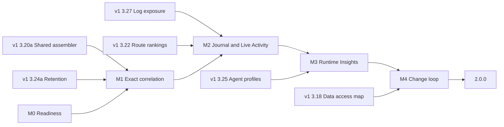
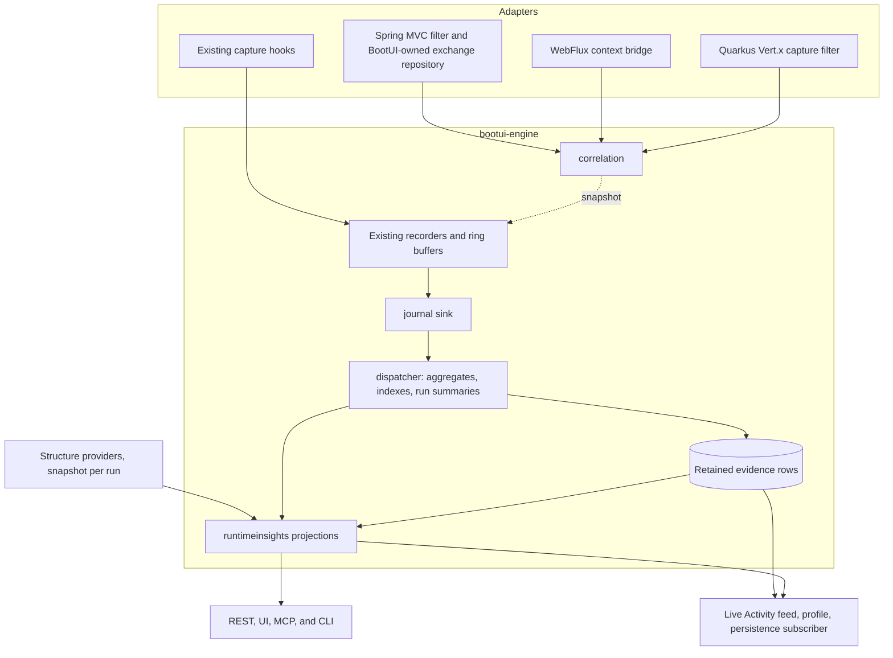

# BootUI v2 Plan: from panels to runtime understanding

This document plans **BootUI 2.0**. The v1 plan, [PLAN.md](PLAN.md), keeps governing the 1.x line on `main`. All v2
work happens on the long-lived `v2` branch, and nothing from it is released before 2.0.0 (§4). Section numbers are
stable identifiers: cite them as `PLAN-v2.md §5.1`, and never renumber or reuse them. An item is 📋 Planned, 🚧 In
progress, ✅ Delivered, 💤 Deferred, or ❌ Cut.

This revision incorporates three independent audits, on product strategy, technical feasibility, and adoption and
agent value, and the reordered v1 plan. Appendix A records every proposal and what was done with it.

## 1. Strategy

### 1.1 The problem

BootUI 1.x ships 60 panels. Each panel is precise about its own source: SQL Trace about statements, Traces about
spans, Security about authentication events, Transactions about transactions. The questions developers and their AI
agents actually ask cross those sources:

- Why is this route slow, across all its requests rather than in one trace?
- What does my change touch, and how much real traffic goes through it?
- Did my last change make anything slower, or break anything?
- Which work ran without a request, and why?
- Can an anonymous user reach data that only administrators should see?

Today a developer answers these by joining panels in their head. Where BootUI joins sources itself (Live Activity
nesting, the request profiler, SQL route attribution), the join is re-derived after the fact from trace ids, serving
threads, and time windows. A proof of concept on the Spring MVC sample app measured the gaps:

| Evidence on Spring MVC, 1.19.0 | Measured |
| --- | --- |
| HTTP exchanges carrying a trace id when identical requests overlap, tracing on | 79 % (608 of 767) |
| Request-thread SQL linked to its request by trace id | 163 of 206 on H2; 205 of 207 with PostgreSQL. Without tracing, only the serving-thread and time tiers remain |
| Exception occurrences and security events carrying a trace id | None. Live Activity nests 43–63 % of security events by serving thread and time |
| Kafka sends attached to the request that produced them | Live Activity keeps every Kafka row top-level; the PoC's time join matched 4 of 31 |
| SQL statements with no owning request | 90 of 425, on `pool-N-thread-N` |
| Live Activity window at the scenario's 88 events per second | 200 entries, about 2.3 seconds |
| Live Activity persistence | A poller reading that window every 2 seconds, lossy above about 100 events per second |

Spring WebFlux and Quarkus already stamp trace ids on some of these records, but none of the stacks has a request
identity that works without tracing.

The M0 correlation scenario (§5.1) then measured the same gap in CI, with tracing on, by sending identical requests
paced like a developer clicking, back-to-back like a test loop, and simultaneously like parallel calls:

| Stack | Paced | Back-to-back | Simultaneous |
| --- | --- | --- | --- |
| Spring MVC: requests with a trace id; SQL, security, and cache nested under their request | 100 % | 0 % | 0 % |
| Spring WebFlux: requests with a trace id; SQL and cache nested under their request | 100 % | 0 % | 0 % |
| Quarkus: requests with a trace id; SQL and exceptions nested under their request | 100 % | 100 % | 100 % |

On Spring, any two identical requests within ±50 ms of each other lose their link, which a test suite or a page's
parallel calls do all the time. Quarkus is exact because BootUI owns its exchange capture and stamps the trace id
directly, which is the design §5.1 extends to every stack.

Once the PoC joined the same events exactly, it surfaced findings no single panel shows:

- secured routes spending 94 % of their time before the controller, in HTTP Basic password hashing;
- the 7 beans and 571 requests that a change to one repository reaches;
- a transaction holding its connection while doing almost no database work;
- 90 statements that lost their request context on an executor;
- a search route whose median moved from 2 ms to 9.5 ms between two runs, which the comparison must attribute to the
  switch from H2 to PostgreSQL rather than report as a regression.

### 1.2 The v2 thesis

**Stamp every runtime event with exact keys when it happens, keep it in a bounded local journal, and turn it into a
few trustworthy observations exactly where developers and agents already look.** BootUI 2.0 delivers three outcomes:

1. **Exact.** Every event knows its request, trace, span, transaction, and run, with or without tracing. Live Activity,
   the profiler, and route attribution stop guessing (§5.1).
2. **Remembered.** Evidence outlives the 200-entry window and survives a DevTools restart or Quarkus live reload, so
   "what changed since the last run?" has an answer (§5.2, §5.3, §5.8).
3. **Explained.** Observations answer the questions in §1.1 in one sentence with numbers, a sample size, and a concrete
   check, in Live Activity, a Runtime Insights panel, and agent tools (§5.4–§5.9).

The graph from the study remains the conceptual model: requests, routes, beans, tables, transactions, and messages,
joined by typed relations. With exact keys, those joins become indexed group-bys maintained as events arrive, so 2.0
needs neither a graph database nor a general graph engine.

### 1.3 What does not change

The five v1 priorities stay in force: safety and local-only operation, easy installation, useful runtime explanations,
a polished but simple UI, and testable architecture. In addition:

- **No new infrastructure.** No graph database, external process, or new heavy dependency.
- **A runtime view, not an advisor.** Observations carry no severity, no score, and no effect on Overview, like the
  PostgreSQL and MySQL panels. They do say what to check.
- **Nothing expensive on page load.** Observations are projections over aggregates the journal maintains as events
  arrive, read the way Live Activity already computes its KPI strip. Opening a panel or calling a read tool never
  starts a capture, a scan, a database read, or a network call.
- **Nothing leaves the machine.** The journal is local, bounded, and governed by the live exposure policy. BootUI still
  collects no telemetry about its users.
- **Honest across stacks.** Spring MVC stays the reference. Spring WebFlux and Quarkus report each capability they
  cannot provide as unavailable, with a reason.

### 1.4 Positioning

| Category | Examples | What they answer | BootUI v2's edge |
| --- | --- | --- | --- |
| Local telemetry viewers | Sentry Spotlight, the .NET Aspire dashboard | Errors, traces, and logs from a local run, some with MCP access | Nothing to run beside the application; route, principal, security decision, transaction, bean, and table joined at capture |
| Runtime-aware code intelligence | Digma, including its MCP server | Issues and change impact derived from OpenTelemetry traces | No agent, collector, or backend; framework structure (mappings, beans, security, transactions) joined with traffic |
| Framework tooling | Quarkus Dev UI, Spring Boot Admin, IDE Spring debuggers | State at a breakpoint, or one source at a time | Aggregates over every request of a run, and across runs |
| Production APM | Datadog, Dynatrace, New Relic, Elastic | Sampled production behavior in a remote backend | Development-time, complete within bounds, and zero setup |
| Static software intelligence | CAST Imaging | What the code could do | What the code did in this run, with counts and timings |

The differentiator is **in-process, zero-infrastructure, framework-aware runtime evidence, the same on Spring MVC,
Spring WebFlux, and Quarkus, readable by humans and agents alike**.

## 2. Business value and success measures

### 2.1 Jobs to be done

| Job | Today in 1.x | With 2.0 | Where |
| --- | --- | --- | --- |
| Explain a slow route | One trace, then SQL Trace, then Transactions | Where a route's time goes across all its requests, with or without tracing | §5.5 `route-time-breakdown` |
| Fix repeated queries | N+1 flags one request at a time | N+1 groups across a route, with the call site | §5.5 `n-plus-one-hotspots` |
| Find what broke | Scan the Exceptions list | Exception groups per route, marked new in this run | §5.5 `exception-hotspots` |
| Check a change | Remember numbers, or nothing | Per-route and per-statement deltas against the previous run, after a hot reload | §5.8 |
| Prepare a refactoring | Beans graph without traffic | Beans, routes, and tables a change can reach, with observed traffic and unexercised routes | §5.7 |
| Review data access | Security and SQL Trace, separately | Anonymous writes, and anonymous reach of tables otherwise used only by protected routes | §5.9 |
| Catch a hidden failure | A 200 in HTTP Exchanges, an exception in another panel | Routes that answered 2xx while an exception or error log was recorded in the same request | §5.5 `swallowed-error-2xx` |
| Keep reactive code non-blocking | Invisible until production stalls | Blocking SQL, REST, or sleeps observed on event-loop threads, per route and call site | §5.5 `event-loop-blocking` |
| Control LLM spend | Token counts per span, one at a time | Tokens, model, latency, and errors per route or job, and their change since the last run | §5.5 `llm-cost-by-route` |
| Give an agent runtime ground truth | The last few seconds of `get_live_activity` | Compact observations with exemplar request ids, and targeted impact and comparison tools | §5.6 |

### 2.2 How success is measured

BootUI collects no usage telemetry, and v2 does not change that. Success is measured with evidence the project
controls:

| Measure | Target | How it is verified |
| --- | --- | --- |
| Exact correlation | ≥ 99 % of request-thread events carry their request id on Spring MVC and Quarkus, with and without tracing; WebFlux reports its measured coverage | Concurrency scenario on the sample apps, in CI (§5.1) |
| Capture overhead | < 2 µs p99 for the full application-thread path on a reference machine; sample-app throughput within 5 % with the journal on versus off | Timed engine test and a sample-app benchmark scenario |
| External validity | On five open-source applications not written for BootUI (Spring PetClinic, a JHipster sample, Quarkus Super Heroes, a WebFlux sample, and a Kafka application), ≥ 70 % of observations judged actionable or informative by two reviewers, and none misleading | A validation report under `docs/`, rerun before 2.0.0 |
| Agent effectiveness | Ten scripted investigations answered correctly from tool output alone, with fewer tool calls than with 1.x tools | A local agent benchmark with no telemetry, baseline measured first |
| Time to first observation | ≤ 5 minutes from adding the dependency to reading a first observation, with tracing off and no extra property | Scripted walkthrough on each sample app |
| Honesty | No observation on any counterexample fixture; "not enough evidence" never reads as "no change" | Fixture tests per observation |

The M0-3 overhead baseline (`CaptureOverheadBenchmarkTest`, opt-in) measured today's capture cost on Spring MVC, on a
worst-case route that answers in about 0.7 ms: with BootUI on, the sample app sustains a median 83 % of the throughput
it reaches with BootUI off, and its p99 latency rises from 1.81 ms to 2.52 ms, with tracing sampling every request in
both configurations. Slower, realistic requests dilute this cost. The journal target above is measured on top of this
baseline, with BootUI on in both runs, and M1 and M2 must not make the BootUI-on figure worse.

### 2.3 Gates

- **After M1.** If exact correlation stays below 95 % on Spring MVC or Quarkus, fix capture before building on it.
- **After M3.** If fewer than 50 % of external-application observations are judged useful, stop adding observations and
  fold the useful ones into the existing panels they belong to.
- **Before 2.0.0.** If the overhead target is missed, the journal ships disabled by default and the release notes say
  so.

### 2.4 Feedback without releases

Nothing is published before 2.0.0 (§4.3), so feedback comes from outside the release channel:

- the external-validation report on five open-source applications (§2.2);
- a scripted three-minute demo on the sample apps, recorded at the end of M3;
- documented early-adopter builds of the `v2` branch into a local Maven repository;
- a pinned GitHub discussion for v2 feedback, linked from the README once M3 lands.

## 3. Relationship to the v1 plan

The v1 plan's diagnostics workstream (PLAN.md §2, waves 0–3) shapes evidence BootUI already captures. v2 builds exact
keys, the journal, and observations on top of it. **Each shared capability has one implementation and one owner.** A
v1 foundation is delivered on `main` in its wave and merged into `v2`; v2 extends it instead of duplicating it.

| v1 item and wave | Dependency | How v2 uses it |
| --- | --- | --- |
| §3.27 Log exposure policy, wave 0 | Hard, M2 | Journal `LOG` events reuse its read-time exposure path, and the journal follows the same read-time model (§8) |
| §3.24a Failure-preserving retention, wave 1 | Hard, M1 | Exact exchange correlation stamps the context in its BootUI-owned Spring `HttpExchangeRepository`. There is no second repository decorator |
| §3.20a Shared profile assembler, wave 1 | Hard, M1 | v2 adds a `REQUEST_ID` tier ahead of its `TRACE_ID`, `SERVING_THREAD`, and `TIME_WINDOW` tiers |
| §3.22 Route performance rankings, wave 1 | Hard, M2 | Its percentile helper and route-template resolution serve route comparison and every route-level observation |
| §3.25 Agent-ready profiles, wave 2 | Hard, M3 | `get_request_profile` is the drill-down behind every exemplar request id |
| §3.20b and §3.20c execution profiles, wave 2 | Soft | Scheduled and consumed-message anchors become journal anchors with their own execution ids |
| §3.14 Correlation-ID filtering, wave 2 | Soft | `CorrelationContext` carries its keyed lookup identity |
| §3.18 Data access map, wave 2 | Hard, M4 | `anonymous-data-reach` joins its table extraction and access classification with request authentication |
| §3.21 Log correlation, wave 3 | Soft | Log lines gain a request id beside its trace id |
| §3.23 Scheduled task run history, wave 3 | Soft | Scheduled runs take part in run comparison |

Three design points change how v1 items are finished, without changing their v1 scope:

- §3.20's tiers stay as fallbacks once `REQUEST_ID` exists; §3.20b, §3.20c, and §3.21 use `REQUEST_ID` first when they
  land after M1 is merged.
- The journal follows §3.24's reservation for evidence rows only. Route and statement statistics come from aggregates
  counted before eviction, so retention never biases percentiles (§5.2).
- v2 CLI commands follow §3.25's naming rule: unique paths, never a prefix of another path.

## 4. Roadmap, branch, and releases

### 4.1 Order of work

| Milestone | Delivers | Depends on | Effort (engineer-days, rough) | Status |
| --- | --- | --- | --- | --- |
| **M0 Readiness** | CI on `v2`, the correlation and overhead scenarios as baselines, and the propagation and restart spikes (§5.1, §5.8) | — | 5–8 | ✅ Delivered |
| **M1 Exact correlation** (§5.1) | One correlation context on every event, with or without tracing, on all three stacks | M0; v1 wave 1 (§3.20a, §3.24a) | 42–52 | 📋 Planned |
| **M2 Journal and Live Activity** (§5.2, §5.3) | The in-memory journal, incremental aggregates, run summaries, and Live Activity served from the journal with its unified timeline | M1; §3.22, §3.27 | 33–43 | 📋 Planned |
| **M3 Runtime Insights** (§5.4–§5.6) | Projections, the panel, Live Activity entry points, ten observations, agent tools, and the demo | M2; §3.25 | 45–57 | 📋 Planned |
| **M4 Change loop and 2.0 readiness** (§5.7–§5.9) | Change impact, run comparison, anonymous data reach, external validation, and the release path | M3; §3.18 | 25–35 | 📋 Planned |

M0–M4 total about **150–195 engineer-days**, roughly six to eight months with two developers who also maintain 1.x.
The v1 foundations are estimated in their own plan. Before v1 wave 1 lands, `v2` works on M0 and the spikes.

M0 is split into four items:

| Item | Delivers | Status |
| --- | --- | --- |
| M0-1 | `build.yml` runs on `v2` pushes and pull requests | ✅ Delivered |
| M0-2 | The correlation coverage scenario on Spring MVC, Spring WebFlux, and Quarkus, recording the baseline in §1.1 | ✅ Delivered |
| M0-3 | The capture overhead scenario, recording the baseline for the §2.2 overhead target | ✅ Delivered |
| M0-4 | The WebFlux propagation spike (§5.1) and the DevTools restart and Quarkus live-reload spike (§5.8) | ✅ Delivered |



### 4.2 Branch strategy

- `v2` is a shared, long-lived branch created from `main`. It is never rebased or force-pushed.
- `main` keeps the 1.x line and the v1 plan. `main` is merged into `v2` at least weekly and after every 1.x release,
  with merge commits, so v1 fixes and foundations reach v2 continuously.
- **Before starting any new v2 work**, sync first:
  1. merge the latest `main` into `v2` and resolve conflicts;
  2. review what changed in PLAN.md and in the v1 items this plan depends on (§3);
  3. update this plan when those changes affect it, in its own documentation commit, before the work begins.

  Examples include a shipped or reordered wave, a changed v1 specification, a new shared helper, or a new
  cross-cutting rule.
- v2 pull requests target `v2`, stay small, and pass the same gates as `main` pull requests (§9, §11).
- **M0-1** extends `.github/workflows/build.yml` push and pull-request filters to `v2`, so the full build, conformance
  runners, and browser suites run on every v2 change.
- Existing 1.x bugs found by this work are fixed on `main` as 1.x patches, not held for 2.0 (D8). Both found so far
  are fixed and merged into `v2`: Live Activity persistence on MySQL and Oracle (#1144), and call sites in the sample
  apps (#1143).

### 4.3 Releases

- **Nothing is published from `v2` before 2.0.0**, a maintainer decision (D5). The release workflow accepts only
  `major.minor.patch` versions, so there are no preview coordinates on Maven Central.
- When M4 meets its gates, `v2` is merged into `main` and **2.0.0** is released from `main`.
- **Before 2.0.0**, the release path must allow later 1.x patches. `release.yml` computes the next version from the
  newest stable tag in the whole repository, so after `v2.0.0` a `1.x` patch would be rejected, and every release
  redeploys the documentation site at its tag. M4 changes both, in lockstep with
  `.github/scripts/check-release-integrity.sh`:
  - compute the next version within the source branch's major version;
  - redeploy documentation only when the release is the newest major.
- 2.0.0 removes what 1.x deprecates, each with a migration note in `CHANGELOG.md`:
  - `TraceIdProvider`, replaced by `CorrelationContextProvider` (§5.1);
  - the Live Activity poller, replaced by the journal subscriber (§5.3).
- Java 17, Spring Boot 4, and the newest Quarkus LTS remain the baselines.

## 5. Feature specifications

### 5.1 Exact correlation — Cross-cutting 📋 Planned

Every runtime event should know, when it happens, which request, trace, span, transaction, and run it belongs to, with
or without tracing. Today the Spring MVC exchange's trace id is re-derived by `HttpExchangeTraceRegistry.match` (method
and path, ±50 ms, unique candidate only), exceptions and security events on Spring MVC carry no trace id, and no stack
has a request identity that works without tracing. Adding fields is the easy part; **propagating the context across
thread, Reactor, and Vert.x boundaries is the critical engineering problem**.

Scope:

- Add `CorrelationContext` to the engine: a BootUI-generated `requestId`, `traceId`, `spanId`, `routeTemplate`,
  `handler`, the innermost BootUI `transactionId`, the current statement's `dataSource`, an `executionId` for scheduled
  and consumed-message anchors, and §3.14's keyed lookup identity when present.
- Add a `CorrelationContextProvider` SPI that replaces `TraceIdProvider`, and a scope-based holder that always restores
  the previous context. 1.x adapters keep `TraceIdProvider` as a fallback until 2.0.0 removes it.
- Stamp the context at the existing capture points of exchanges, SQL, transactions, exceptions, security events, REST
  client calls, cache accesses, logs, scheduled runs, Kafka, RabbitMQ, JMS, email, fault tolerance, and AI calls.
- Record exception **occurrences** as immutable events with their own identity, not the updated exception group.
- Snapshot the context before a message send and read producer metadata in the send callback. On consume, open a child
  context from `traceparent` when present. Metadata only, never payloads.
- Add a `REQUEST_ID` tier ahead of §3.20's tiers in the shared profile assembler.
- Add a run identity per **application-context start**, so a DevTools restart or Quarkus live reload starts a new run
  inside the same JVM, and publish `instanceId` and `runId` in `/overview` metadata.
- Add nullable, additive `requestId` fields (and `spanId`, `transactionId`, `dataSource`, `thread` where missing) to
  the affected DTOs, each with a secondary constructor matching today's canonical one.
- Record the **thread kind** of every event (request worker, virtual thread, Reactor Netty or Vert.x event loop, Reactor
  scheduler, or other), classified by the adapter that owns the thread rather than guessed from its name later.
- Keep the port in Live Activity REST client summaries, so two local services on different ports stay distinct.

Architecture:

- **Spring MVC.** `RequestCorrelationFilter` opens the scope before `chain.doFilter` and fills the route template and
  handler after routing. Async dispatch reopens the scope from a request attribute and closes it on completion,
  timeout, error, and cancellation. The exchange is stamped in §3.24a's BootUI-owned `HttpExchangeRepository`, whose
  `add` Actuator's `HttpExchangesFilter` calls synchronously on the request thread after `doFilter` (verified on Spring
  Boot 4.1.1). An application-provided repository is never wrapped: its exchanges keep the registry match and report
  their tier.
- **Spring WebFlux.** A BootUI WebFilter creates the request's `CorrelationContext`, stores it on the
  `ServerWebExchange`, writes it into the Reactor context, and exposes it through a Micrometer `ThreadLocalAccessor`
  backed by BootUI's scoped holder. BootUI contributes `spring.reactor.context-propagation=auto` as an overridable
  default whenever exact correlation is on, not only when OpenTelemetry is present as today, so blocking JDBC, cache,
  logging, and transaction callbacks read the request id synchronously. The BootUI-owned `HttpExchangeRepository`
  reads it in `add`, which Spring Boot 4.1.1's `HttpExchangesWebFilter` calls inside `beforeCommit`. An
  application-provided repository is not wrapped and keeps its fallback tier. Work outside Reactor and
  Spring-managed execution stays unowned, never guessed.
- **Quarkus.** `QuarkusHttpExchangeCaptureFilter` owns exchange capture, so it stamps the exchange directly, stores the
  context on the Vert.x `RoutingContext`, and restores it around worker dispatch and Mutiny hops it controls.
- **Transactions.** `BootUiTransactionExecutionListener` pushes and pops the transaction id for blocking
  `PlatformTransactionManager` transactions, including those run by WebFlux applications. R2DBC and Quarkus
  transactions stay unavailable.
- Every adapter keeps optional types (OpenTelemetry, messaging, security) in gated classes.

Out of scope:

- Generating, replacing, or propagating correlation headers on behalf of the application, as in §3.14.
- `@Async`, `CompletableFuture`, and executor instrumentation. Work on unwrapped executors stays visible as unowned work
  (§5.5), with the `TaskDecorator` the application can add.

Baseline (M0-2). `AbstractCorrelationCoverageTest` in `bootui-conformance` runs on all three stacks. It reads only
the public Live Activity feed and writes its report to `target/correlation-coverage/`. Besides the table in §1.1, it
found:

- **Exchange ids collide.** `HttpExchangesService` hashes an exchange's millisecond timestamp, method, displayed URI,
  status, and duration into its id, so identical requests that start in the same millisecond and take as long share an
  id, and their profiles become ambiguous. The scenario observed it on Spring MVC and Spring WebFlux. M1 gives each
  request its own identity.
- **Exceptions appear once per group.** Live Activity shows one `EXCEPTION` row per exception group, dated by its last
  occurrence, so repeated failures of one route nest at most once. M1 records immutable occurrences.
- **`since` is ignored on Quarkus** without persistence, while Spring honors it. The scenario filters by window itself.
- **Tracing could not be switched off** with `management.tracing.enabled=false` in a Spring Boot 4 test, so the
  tracing-off baseline moves to M1, together with the secured, Kafka, and raw-executor routes.

Acceptance criteria:

- The correlation scenario, extended with tracing off, Kafka sends, and a raw executor, enforces the §2.2 target as its
  floors on Spring MVC and Quarkus in every phase, and WebFlux reports its measured coverage.
- Contexts never leak between requests on reused platform threads, virtual threads, Reactor schedulers, or Vert.x
  worker hops, including after async timeouts and cancellations.
- A DevTools restart and a Quarkus live reload each produce a new `runId`.
- Every new DTO field is nullable and additive, and `BootUiApiContractCatalog` and the three conformance runners pass.
- The request profiler no longer marks request-thread work approximate.

### 5.2 Runtime journal — Diagnostics 📋 Planned

Each panel keeps its own ring buffer, and Live Activity persistence polls a 200-entry merged window, so bursts lose
events. This item records every runtime event once in a push-based, bounded, in-memory journal, and maintains the
aggregates that observations read.

Scope:

- A `RuntimeEvent` envelope: instance, run, sequence, stable event id, type, time, duration, request, execution,
  trace, span, thread, and correlation tier, with a small immutable payload per prioritized source (HTTP, SQL,
  transaction, exception occurrence, security, REST client, cache, messaging, scheduled run, and log).
- A `RuntimeEventSink` called right after each recorder's existing ring-buffer write, through a non-blocking `offer`
  into a bounded queue drained by one `bootui-journal-dispatch` daemon thread. On overflow the event is dropped and
  counted per source; the application thread never blocks.
- **Incremental aggregates** maintained by the dispatcher, before any eviction: per route (count, status classes,
  latency histogram, time split), per statement fingerprint (count, time, N+1 groups, call sites), per exception group
  and route, per transactional method, per thread family without a request, and per run. Every aggregate has a
  cardinality cap with an overflow bucket.
- **Evidence rows**: the retained events, bounded by `max-events` (50,000) and `max-bytes` (the smaller of 32 MB and
  5 % of the maximum heap), with §3.24's reserved share for failed and slow events. Aggregates, not retained rows, feed
  percentiles.
- **Run summaries**: a bounded (≤ 256 KB) summary of each run's aggregates, kept across application-context restarts
  in the same JVM (§5.8).
- Self-exclusion of BootUI's threads, paths, and JDBC (`BootUiJdbcCaptureGuard`), including BootUI's own PostgreSQL,
  MySQL, and Database Advisor reads.
- A journal status block (events, bytes, drops per source, evictions, oldest retained event) in Live Activity's
  persistence disclosure, and a confirmation-gated **Clear recording** action that read-only policy blocks.
- **Per-request CPU time and allocated bytes**, read through `com.sun.management.ThreadMXBean` when a request starts
  and ends on the same platform thread. The JVM reports neither for virtual threads (it returns `-1`, verified on JDK
  26), nor across thread hops, so those requests record them as unavailable, with the reason, rather than zero. The
  four reads cost about 2.5 µs per request, measured by the overhead scenario.
- Properties under `bootui.runtime-journal.*`: `enabled`, `max-events`, `max-bytes`, `queue-capacity`, `sources`, and
  `request-cpu` (on by default).

Architecture:

- The journal is a sibling SPI to `ActivityStore` in a new `journal` engine package. It reuses sequencing, instance
  ids, and the capture guard.
- Sequences are unique per `(instanceId, runId)`, so a restart never collides with a previous run.
- The dispatcher owns aggregation, so the application thread only snapshots, allocates the envelope, and offers.

Storage design decisions (settled before M2; defaults are properties unless noted):

| Decision | Choice | Why |
| --- | --- | --- |
| Clocks | Durations come from `System.nanoTime()`; epoch milliseconds are kept only to order events across sources and to display them | Wall clocks jump, and sub-millisecond local SQL must not collapse to zero |
| Latency percentiles | A log-linear histogram written in the engine: microsecond values, 32 powers of two (1 µs to about 36 minutes), 16 linear sub-buckets each, so any percentile is within 6.25 % of the true value. Aggregates hold a dense `int[512]` (2 KB); run summaries serialize only non-empty buckets | Deterministic, mergeable across runs, and dependency-free. A t-digest is harder to merge and test, and fixed-width buckets cannot span 0.5 ms to 30 s |
| String sharing | A per-run dictionary interns route templates, handlers, statement fingerprints, normalized SQL, call sites, thread families, datasource names, and exception-group ids; events hold small integer codes | Keeps the average retained event within the byte budget |
| Byte accounting | The dispatcher estimates each retained row's size once (a fixed overhead per event type plus the lengths of its non-interned strings) and keeps a running total, evicting until both the count and byte bounds hold. Dictionaries count against the same budget | A bounded journal needs a bound it can compute in O(1) |
| Evidence ring | Array-backed rings, one for routine events and one for the reserved failed-and-slow share (10 % by default), newest first across both | O(1) insertion and eviction, and §3.24's semantics |
| Budget per event | At 50,000 events in 32 MB, about 670 bytes per event including indexes, which a typical interned SQL event (400–750 bytes) meets. On a small heap, the 5 % byte bound binds before the count bound | The status block names the bound that binds, with the oldest retained time |
| Cardinality caps | 500 routes, 2,000 statement fingerprints (50 per route), 500 exception groups, 100 thread families, and 20 call sites per fingerprint. Beyond a cap, events go to a visible **Other** bucket with a count | A dynamic path or unparameterized SQL cannot exhaust memory or silently disappear |
| Queue and drops | `queue-capacity` 10,000; the last 10 % admits only failed or slow events, so routine events drop first. The dispatcher drains in batches of up to 512 events | Bursts must not drop the evidence developers came for |
| Run summaries | The holder keeps the 5 most recent runs, each ≤ 256 KB (≤ 1.3 MB in total), evicting the oldest. Summaries hold templates, fingerprints, group ids, counts, histograms, and each run's comparability facts: never principals, values, or SQL literals | Enough history for "since the last few reloads" at a fixed cost |
| Windows | Every report states two windows: the **aggregate window** (all events of the run, before eviction) and the **evidence window** (retained rows, biased toward failures by the reservation) | Percentiles and exemplars answer different questions and must not be confused |

Out of scope for 2.0:

- A JDBC event journal. Live Activity persistence keeps its existing `bootui_activity` table, now fed by a journal
  subscriber instead of the poller (§5.3). A durable event store is revisited only on demand (§5.10).
- Payloads of messages, request bodies, bind values, and email bodies, subjects, or recipients.

Acceptance criteria:

- The PoC scenario (767 requests in about 22 s) records every event with zero drops at default settings on all three
  stacks.
- A burst beyond the queue drops and reports the drops, and a test proves request latency is unaffected by a stalled
  dispatcher.
- Aggregates reconcile with every event published, including events evicted from the retained rows.
- BootUI's own traffic and SQL never enter the journal.

### 5.3 Live Activity on the journal — Overview 📋 Planned

Live Activity is where developers already connect events, and where the missing links show. This item serves it from
the journal and extends its request profile, behind parity tests, before the poller is retired.

Scope:

- Serve the Live Activity feed, Live Flow, and SSE stream from the journal. Live Activity persistence writes the
  existing `bootui_activity` rows from a journal subscriber, so bursts are no longer lost and no table changes. The
  subscriber never writes rows less masked than `MASKED` (§8).
- Nest children by `REQUEST_ID` first, then §3.20's tiers, so request-thread SQL, security, cache, exception, log, and
  Kafka rows sit under their request.
- Add transaction, log, and AI call rows on the stacks that capture them.
- Add filters for route template, run, and request id, and show work with no request under a **No request** filter,
  with its thread family and reason.
- Extend the request profile, additively, with:
  - a **unified timeline** of spans, SQL, transactions, cache accesses, and log lines on one axis;
  - a **route comparison**: this request against its route's p50 and p95 from the aggregates;
  - **touched resources**: tables, transactions, caches, messages, and log lines;
  - **why this route is slow**: the route's `route-time-breakdown` observation when it exists (§5.5).

Architecture:

- `LiveActivityAssembler` keeps its severity and KPI logic and reads journal events instead of polling buffers.
- Route comparison reuses §3.22's percentile helper over the journal's histograms.
- The poller path remains available until parity passes on all three stacks, and 2.0.0 removes it.

Acceptance criteria:

| Measure | 1.19.0 | 2.0 target |
| --- | --- | --- |
| Request-thread SQL under its request | 79 % on H2 by trace id; none without tracing beyond serving-thread and time tiers | 100 %, with or without tracing |
| Security events under their request | 43–63 %, by serving thread and time | 100 % of request-scoped events, by request id |
| Kafka sends under their request | 0 % | 100 % of sends on a request thread |
| Default history at 88 events per second | about 2.3 seconds | up to about 9.5 minutes when the count bound binds first; the oldest retained time is always shown |
| Loss with persistence on | above about 100 events per second | none below the queue bound; drops counted |

- Parity tests on the same fixture cover KPIs, ordering, SSE, clear and toggle behavior, profiles, and disabled
  sources, against the 1.x feed.
- Existing Live Activity API consumers keep working: DTO changes are additive.

### 5.4 Runtime projections — Engine 📋 Planned

Observations need joins across sources. With exact keys, those joins are lookups in the journal's aggregates and small
indexes, so this item replaces the draft's general graph engine with bounded projections.

Scope:

- Per-request, per-route, per-table, and per-bean indexes over retained events, maintained by the dispatcher.
- Structure from existing providers only: mappings, beans and their dependencies, repositories, and ArC injection
  edges on Quarkus. Snapshot the structure per run, so an observation never joins one run's events with another run's
  mappings or beans.
- Table references from §3.18's extraction, computed once per statement fingerprint on the dispatcher, never on the
  capture path.
- Two small algorithms with property-based tests: reverse dependency closure (change impact) and interval arithmetic
  (transaction and timeline breakdowns).
- A read budget of 250 ms per projection over a full journal. Exceeding it returns a `PARTIAL` result with the reason.
- Every join carries its correlation tier, and each observation declares the minimum tier it accepts.

Out of scope for 2.0:

- A general graph model, community detection, and graph query languages.

Acceptance criteria:

- Projections over 50,000 retained events and full aggregates stay within the read budget on a reference machine,
  pinned by a tagged, generously margined timed test.
- The PoC evidence, converted into a Java fixture builder, reproduces the PoC's findings that 2.0 keeps.

### 5.5 Runtime Insights panel — Overview 📋 Planned

A new panel, `runtime-insights`, titled **Runtime Insights**, in the Overview group directly after Live Activity. It
lists the current observations and is reachable from where developers already are.

Scope:

- `GET {api}/runtime-insights` returns the current observations, projected on read from the journal's aggregates.
  There is no analyze action, so there is no busy state and no read-only exception.
- `GET {api}/runtime-insights/insights/{id}` returns one observation's evidence: the top 20 rows, a truncation count,
  and deep links.
- The report carries its window (runs, time range, events per source, drops, evictions), a **correlation coverage**
  breakdown per source, the observations, a **Not exercised in this run** list of declared routes, and limitations.
- Each observation carries a stable id (`kind:subject`, surviving refreshes), one measured sentence, a sample size, the
  minimum tier used, **What to check** (one to three imperatives with panel links), at most three exemplar request
  ids, bounded masked evidence, and limitations. Insufficient evidence names what is missing, for example "`GET
  /api/orders`: 2 of 5 requests needed".
- Observations in M3:

| Id | Observation | Minimums | Stacks |
| --- | --- | --- | --- |
| `route-time-breakdown` | Where a route's time goes across its requests: before the handler (filters, including security), SQL, REST client, and the rest. Span self-time refines the rest when tracing is on | ≥ 5 successful requests; p50 ≥ 20 ms | All three. Quarkus ORM SQL time is unknown (prepared-statement capture has no end hook) and reported so |
| `n-plus-one-hotspots` | Statement fingerprints repeated within requests across a route, with the call site | ≥ 3 affected requests | All three |
| `exception-hotspots` | Exception groups per route, marked new when absent from the previous run | ≥ 1 occurrence; "new" needs a previous run | All three |
| `transaction-hold` | A transaction open during a REST client or AI call, or open for mostly time without observed SQL | Transaction ≥ 20 ms; ≥ 3 per method | Spring MVC and WebFlux (blocking transactions) |
| `unowned-work` | Work with no request, by thread family, with overlapping routes as candidates only | ≥ 5 events per family; startup, scheduled, and BootUI threads excluded | All three |
| `swallowed-error-2xx` | A route that answered 2xx while an exception occurrence or an `ERROR` log was recorded in the same request, grouped by exception group | ≥ 1 request; exact `REQUEST_ID` tier only. Worded "verify that this fallback is intentional" | All three |
| `event-loop-blocking` | Blocking work on an event-loop thread: JDBC, blocking REST client calls, or waits, per route and call site, with the share of request time spent there | ≥ 3 requests; thread kind from the owning adapter (§5.1), never a name guess | Spring WebFlux and Quarkus. Spring MVC has no event loop and reports not applicable |
| `retry-amplification` | One request multiplying downstream work through retries: attempts × calls per remote host or AI model, with failures and timeouts | ≥ 1 request with retry events | All three, where Fault Tolerance capture exists |
| `llm-cost-by-route` | Tokens (input and output), model, latency, and errors of AI calls per route or job, and the change since the previous run | ≥ 3 AI calls per route, or one above `ai-token-threshold` | All three, where AI calls are recognized from GenAI spans |
| `cpu-or-waiting` | Whether a route's time is CPU, allocation, or waiting: per-route CPU share and allocated bytes per request. With `route-time-breakdown`, it separates "hashing a password" from "waiting on a pool" | ≥ 5 requests measured on platform threads | All three on platform, worker, and event-loop threads. Unavailable on virtual threads, as the JVM reports no per-thread CPU there |

- Entry points where developers already look:
  - the Live Activity request profile's **why this route is slow** section (§5.3);
  - a link from Live Activity's slowest-request KPI to its route's observation;
  - the **No request** filter linking to `unowned-work`;
  - command-palette keywords: *why slow*, *slow*, *what changed*, *impact*, *new exceptions*, *blocking*, *retries*,
    *tokens*, *CPU*.
- The UI, following `DESIGN.md`:
  - the header states the window and **What this run did that no single panel shows.**, with **Export** offering JSON
    and **Copy for AI** (Markdown through §3.25's helper), and no observation count;
  - a correlation coverage strip with text labels, so the reliability of everything below is visible first;
  - a search field by route, table, bean, or thread, then theme chips: time, queries, errors, transactions, context,
    and change;
  - a master-detail list: observations in sentence-case groups on the left; on the right the sentence, **What to
    check**, the evidence table, limits, source-panel links, and the equivalent CLI command. The request timeline is
    the only chart;
  - empty states for an empty journal, a disabled journal, needs-more-traffic, and partial windows.

```text
┌ Runtime Insights ─────────────── Run 3 · 18,412 events · last 9 min · 0 dropped      [Export ▾] [Copy for AI] ┐
│ What this run did that no single panel shows.                                                                 │
│ Linked by  request id ██████████████████░ 96 %  trace id █ 2 %  background (expected) ░ 1 %  none ░ 1 %      │
├──────────────────────────────┬────────────────────────────────────────────────────────────────────────────────┤
│ Search routes, tables, beans │ GET /api/secure/products spends 94 % of its time before the controller runs    │
│ [Time] [Queries] [Errors] …  │ 30 requests · request id · 101 of 108 ms in filters, including Spring Security │
│ Time                         │ What to check                                                                  │
│ ▸ /api/secure/products 94 %  │  1. HTTP Basic verifies the password on every call: compare a session or token │
│ Queries                      │  2. Check the password encoder's cost for the dev profile  → Security, Config  │
│   N+1 in ProductService:42   │ Evidence (20 of 30 rows) · Limits · CLI: bootui insights show <id>             │
│ Context                      │                                                                                │
│   90 statements, no request  │                                                                                │
└──────────────────────────────┴────────────────────────────────────────────────────────────────────────────────┘
```

Architecture:

- Observations are pure engine classes (`id()`, `minimumTier()`, `availability(snapshot)`, `project(indexes)`), each
  with fixtures for a justified observation, a plausible counterexample, and insufficient evidence. Unknown never reads
  as healthy.
- Projections are cached per journal watermark and per exposure generation, so a live exposure change never serves a
  stale, less-masked result.
- Sentences describe what was observed in the window, never causes or verdicts, and **What to check** stays
  conditional ("if these belong to a request, propagate the context in your `TaskDecorator`").
- Thin adapters: a Spring MVC controller, a WebFlux controller on `boundedElastic` where projection work could block,
  and a Quarkus resource registered in `BootUiQuarkusProcessor`. Quarkus registers nothing in `LaunchMode.NORMAL`.
- The panel is available when the journal is enabled, and otherwise unavailable with the property to set.

Out of scope for 2.0:

- Severities, scores, Overview contributions, rule catalogs, and free-form query languages.

Acceptance criteria:

- Opening the panel or a profile starts no capture, scan, database read, or network call.
- The demo scenario on each stack, with tracing off, shows the `route-time-breakdown` observation for the secured
  route, opens its evidence, and follows a deep link.
- Every observation's unavailable state names its missing capability instead of returning an empty success.

### 5.6 Runtime Insights for agents — Developer tools 📋 Planned

Agents need the same answers in few tokens, through the fixed `McpToolSchema` names that the published CLI binds.
Every v2 tool is a read tool on an existing schema.

| Tool | Schema | CLI command | Returns |
| --- | --- | --- | --- |
| `get_runtime_insights` | `QUERY_LIMIT` | `bootui insights list` | At most `limit` (8 by default) compact observations filtered by `query` (a route, table, bean, class, or `new`), plus coverage, the run, and `comparable` |
| `get_runtime_insight` | `ID` | `bootui insights show <id>` | One observation with its top 20 evidence rows and a truncation count; drill down with `get_request_profile` |
| `get_runtime_impact` | `ID` | `bootui insights impact <id>` | The change-impact checklist for a bean name, simple class name, or repository (§5.7) |
| `get_runtime_run_comparison` | `ID` | `bootui insights compare <id>` | The comparison with `previous` or a run id (§5.8) |

- Compact output stays smaller than one `get_live_activity` page. Correlational or incomparable results are omitted
  unless the query asks for them, and `INSUFFICIENT` and `NOT_COMPARABLE` are explicit statuses an agent cannot
  collapse into success.
- `McpGuidance.diagnose_runtime_issue` starts with `get_runtime_insights` for route, table, or change questions, then
  `get_request_profile` on one exemplar. `get_live_activity`'s description changes to: "Use for the newest events and
  to pick an entry id. For why a route is slow or what changed, call `get_runtime_insights` first."
- A documented **analyze after tests** workflow: run the application's integration or browser tests, then
  `bootui insights list --json`. Tests are where realistic traffic comes from.

Acceptance criteria:

- Every tool moves in lockstep as PLAN.md §4 requires, and `ToolManifestGeneratorTests` and
  `mcpToolCatalogIsDocumentedInEveryCanonicalToolList` pass.
- A 1.x CLI binary keeps its commands against a 2.0 application; new commands need a 2.x CLI.
- The ten scripted agent investigations in §2.2 pass.

### 5.7 Change impact — Runtime Insights 📋 Planned

"Is my change safe?" is asked by an agent that just edited a class, so the input is a symbol and the output is a
checklist, not a node list.

Scope:

- Resolve a bean name, simple class name, or repository name to exactly one bean. Ambiguity returns `AMBIGUOUS` with
  candidates, never a guessed closure.
- Report the potential structural impact (the reverse dependency closure, depth ≤ 5) joined with observed traffic:
  routes with request, anonymous, and error counts, exemplar request ids, tables read and written, and mapped routes in
  the closure with **no traffic in this run**, each with one imperative check.
- Word the result as what was and was not exercised, never as "safe".

Acceptance criteria:

- Spring MVC and WebFlux use the bean graph; Quarkus uses ArC injection edges and reports them unavailable, not empty,
  when it cannot read them.
- Changing `ProductRepository` in the sample app lists its beans, routes, counts, and the unexercised route.

### 5.8 Run comparison — Runtime Insights 📋 Planned

A developer changes code, the application reloads, and the developer wants to know what moved. This is the inner loop,
so comparison must work without a database.

Scope:

- Compare the current run with the previous run, or with a chosen run: per route and statement, count, p50, and p95
  deltas, with ≥ 10 samples on each side; exception groups new in this run.
- Keep run summaries across DevTools restarts and Quarkus live reloads in a tiny `bootui-run-holder` artifact whose
  static holder keeps only bounded JDK-typed data: strings, numbers, arrays, and JDK collections, never application,
  framework, or BootUI classes, which would pin the previous class loader. The M0-4 spike showed that a dependency jar
  stays in DevTools' base class loader and in Quarkus's Base Runtime ClassLoader, so its state survives the next
  application-context start by default.
- When DevTools `restart.include`, IDE or reactor output directories, or Quarkus
  `quarkus.class-loading.reloadable-artifacts` make the holder reloadable, the holder detects that its own class
  loader is the reloadable one, and comparison reports that previous runs are unavailable, with the reason and the
  baseline file as the remedy.
- Mark a comparison `NOT_COMPARABLE`, with the reason first, when the active profiles, datasource URL shape, or cache
  enablement differ; list configuration differences as limitations.
- Offer an opt-in `bootui.runtime-journal.baseline-file` that writes one run summary into the build output directory
  (`target/` or `build/`), so a comparison survives a full JVM restart. It holds only route templates, statement
  fingerprints, exception-group ids, counts, and timings.

Acceptance criteria:

- Reloading the sample app after a code change yields a comparison without any property set.
- A comparison with too few samples returns `INSUFFICIENT`, never "no change".
- Switching the sample app from H2 to PostgreSQL returns `NOT_COMPARABLE` with the datasource difference first.

### 5.9 Anonymous data reach — Runtime Insights 📋 Planned

The draft's `data-exposure` flagged a table read by both anonymous and protected routes. That is the normal
public-catalog-plus-admin pattern, including the sample app's own `sample_products`, so it would teach users to ignore
the panel. This observation reports only what deserves review.

Scope:

- `anonymous-data-reach` reports an anonymous successful request that **writes** a table, or that **reads** a table
  otherwise accessed only by role-restricted routes, joining §3.18's table access with the authentication observed on
  each request.
- A shared read appears only when the anonymous and protected statements differ, worded "same table, compare the
  statements".
- Words are exact: an observed principal proves authentication happened, not that the route required it. Evidence
  links to Security and §3.18's data access map.
- The sample apps gain a deliberately anonymous debug endpoint that reads a table only administrators otherwise read,
  as the seeded case.

Acceptance criteria:

- The seeded case is found on every stack with security; the public catalog and administrator list are not.
- Quarkus reports observed authentication only where its security capture proves it.

### 5.10 After 2.0 💤 Deferred and ❌ Cut

| Item | Status | Reason |
| --- | --- | --- |
| `sql-outside-database` | 💤 Deferred | Needs two explicit database snapshots with aligned interval deltas, reset detection, and datasource identity; cumulative server-wide statistics include other clients |
| `cache-shielding` | 💤 Deferred | Spring-only; the unified timeline already shows a miss followed by SQL. After 2.0, as per-route cache effectiveness (hit ratio and the SQL each miss caused) |
| `pool-pressure-by-route` | 💤 Deferred | High value: which route can starve the connection pool, from checkout wait, hold time, concurrency, and pool size. Needs connection checkout and release timestamps from the JDBC proxy, and low dev concurrency makes it a capacity estimate, not a finding |
| `unbounded-result-ramp` | 💤 Deferred | High value: queries without a limit whose row counts or response sizes grow over the run. Needs result-set row counts and response sizes |
| `sensitive-runtime-egress` | 💤 Deferred | High value: counts of secret-like values in logs, outbound headers and URLs, and AI prompts, by category, never the values. Builds on §3.27's shared masking helper |
| Slow-versus-fast cohort comparison | 💤 Deferred | "What distinguishes the slow requests of a route?" over curated attributes (cache miss, statement set, exception, thread kind, principal group), as Honeycomb BubbleUp does. Curated dimensions first; an optional embedded analytics engine only if users ask for ad-hoc slicing |
| Bounded path queries | 💤 Deferred | Variable-length flows such as request → message → consumer → table → other routes, through named templates with depth ≤ 5 and an edge allowlist, never a free-form query language |
| Log and exception text search | 💤 Deferred | An optional in-memory Lucene index over retained, already-masked rows, rebuilt when the exposure policy changes, if users ask for it |
| `consecutive-outbound-waterfall`, `osiv-lazy-sql-after-handler`, `read-only-transaction-writes`, `scheduled-overlap-drift`, `message-consumer-backpressure` | 💤 Deferred | Useful but narrower; revisit with the external-validation results (§2.2) |
| JDBC event journal | 💤 Deferred | A storage product in its own right (idempotent retries, three dialects, disk bounds); revisit on demand |
| GraphML export | 💤 Deferred | Only once users ask for graph exploration beyond the JSON export |
| CI budgets on observations | 💤 Deferred | Once run comparison is proven |
| Quarkus Dev UI card and Dev MCP registration | 💤 Deferred | Would meet Quarkus developers where they already look; a separate item |
| `noisy-neighbours` | ❌ Cut | Measures laptop contention (IDE, GC, local models), not the application |
| `runtime-modules` (Louvain) | ❌ Cut | An architecture curiosity, not an inner-loop answer |
| `journeys` | ❌ Cut | In development, the journey is the developer's own clicks |
| `messaging-flows` as an observation | ❌ Cut | Exact nesting under the request (§5.1, §5.3) is the feature |
| Neo4j CSV and OCEL 2.0 exports | ❌ Cut | Niche audiences, with documentation, conformance, and native-hint costs |
| Embedded graph database | ❌ Cut | The storage research (Appendix A) found no insight that needs one at BootUI's volumes: bounded traversals over the PoC graph run in under a millisecond. Graph databases remain export targets, and none fits embedding (Neo4j is GPLv3, Kuzu is archived, ArcadeDB is heavy for a starter) |

## 6. Architecture



New engine packages: `correlation`, `journal`, and `runtimeinsights`, plus the `CorrelationContextProvider` SPI. The
dependency direction `bootui-core <- bootui-engine <- adapters` is unchanged, and no shared module gains a Spring,
Quarkus, or JSON dependency.

## 7. Cross-stack availability

| Capability | Spring MVC | Spring WebFlux | Quarkus |
| --- | --- | --- | --- |
| Request id without tracing | Filter and scoped holder | Reactor context and a `ThreadLocalAccessor`, with automatic context propagation | Vert.x context |
| Exact exchange → request | BootUI-owned repository; registry match for application repositories | Same, stamped at `beforeCommit` | Direct |
| SQL transaction id | ✓ | Blocking transactions only; no R2DBC | Unavailable: no transaction capture |
| SQL durations | ✓ | ✓ | ORM statements unknown; JDBC ✓ |
| Cache events | ✓ | ✓ | Unavailable: no cache capture |
| WebSocket frames | ✓ | Unavailable | Unavailable |
| Journal, aggregates, run summaries | ✓ | ✓ | ✓ |
| `route-time-breakdown`, `n-plus-one-hotspots`, `exception-hotspots`, `unowned-work` | ✓ | ✓ | ✓ (SQL share unknown for ORM statements) |
| `transaction-hold` | ✓ | ✓ (blocking) | Unavailable |
| `change-impact` | Bean graph | Bean graph | ArC injection edges |
| Run comparison across reloads | DevTools restart | DevTools restart | Live reload |
| `anonymous-data-reach` | With Spring Security | With Spring Security | Where security capture proves authentication |
| `swallowed-error-2xx`, `retry-amplification`, `llm-cost-by-route` | ✓ | ✓ | ✓ |
| `event-loop-blocking` | Not applicable: no event loop | Reactor Netty event loops | Vert.x event loops |
| `cpu-or-waiting` | Platform threads; unavailable with virtual threads | Event loops and schedulers; unavailable across thread hops | Worker and event-loop threads; unavailable across thread hops |

Each unavailable cell is returned as availability with a reason and documented in `docs/QUARKUS-SUPPORT.md` and
`docs/WEBFLUX-SUPPORT.md`.

## 8. Safety, privacy, and performance

The journal follows the model the 1.x buffers and §3.27 already use: **store bounded raw evidence in memory, apply the
live exposure policy at read time, and never write to disk anything less masked than `MASKED`.**

| Concern | Rule |
| --- | --- |
| Never captured | Bind values (even with SQL Trace's `capture-parameters` on), message payloads, request bodies, and email bodies, subjects, and recipients, in every mode |
| Read-time exposure | Journal rows, observations, evidence, exports, and MCP output pass through `SecretMasker` and the live `ExposurePolicy` when read, so a change from `FULL` to `MASKED` applies at once |
| Cached projections | Keyed by exposure generation, and discarded when the policy changes |
| Source-panel policy | Evidence from a disabled panel's source is omitted, with the reason |
| Principals and sessions | Pseudonymized with a keyed hash under a per-process random key, never a plain hash, as §3.14 requires. Run summaries and the baseline file hold only counts of anonymous and authenticated requests, never principals |
| On disk: baseline file | Metadata only: route templates, statement fingerprints, exception-group ids, counts, histograms, and comparability facts |
| On disk: `bootui_activity` rows | Opt-in Live Activity persistence keeps its 1.x columns, including summaries, paths, and the principal. The journal subscriber writes them as rendered under `MASKED` even when the live policy is `FULL`, pseudonymizes the principal, and re-applies the live policy when rows are read, so `METADATA_ONLY` omits summaries and details. This is a 2.0 behavior change, noted in `CHANGELOG.md` |
| Page load | Reads project aggregates within a time budget; nothing captures, scans, reads a database, or calls a network |
| Production | Quarkus registers nothing in `LaunchMode.NORMAL`; Spring activation rules are unchanged |
| Self-exclusion | BootUI's threads, paths, and JDBC never enter the journal |
| Clear recording | Confirmation-gated, blocked by read-only policy |

| Path | Budget |
| --- | --- |
| Application thread: snapshot, envelope, and `offer` | < 2 µs p99 on a reference machine; never blocks |
| Sample-app throughput, journal on versus off | Within 5 % |
| Retained rows | ≤ the smaller of 32 MB and 5 % of the maximum heap, evictions counted |
| Per-request CPU and allocation reads | About 2.5 µs per request (four `ThreadMXBean` reads), included in the overhead scenario; `request-cpu=false` removes them |
| Dispatcher | Sustains at least 20,000 events per second on a reference machine (the PoC produced 88), measured by the overhead scenario |
| Projection read | ≤ 250 ms, then `PARTIAL` |

## 9. Cross-cutting work

Every v2 item follows PLAN.md §4, "Every item", and the Runtime Insights panel also follows "Adding a panel". v2 adds:

- the correlation and overhead scenarios in the sample apps, run by CI on `v2`;
- counterexample fixtures for every observation;
- Spring AOT runtime hints for the new DTOs, and Quarkus production and native **absence** tests, because Quarkus
  native BootUI stays out of scope;
- `CHANGELOG.md` migration notes for every 2.0.0 removal.

## 10. Risks

| Risk | Item | Impact | Mitigation |
| --- | --- | --- | --- |
| Context propagation fails across Reactor, Vert.x, or async boundaries | §5.1 | High | The M0-4 spike proved the Reactor path; adapter-owned bridges, and honest "unowned" results instead of guesses |
| Automatic Reactor context propagation is JVM-global and changes every Reactor chain | §5.1 | Medium | Contribute it only as an overridable default, never disable it, and measure its cost in the overhead scenario |
| Contexts leak between requests on pooled or virtual threads | §5.1 | High | Scopes that restore the previous context, and tests on reused, virtual, scheduler, and worker threads |
| Capture overhead on JDBC and logging hot paths | §5.1, §5.2 | High | Aggregation on the dispatcher, budgets pinned by tests, a `sources` allowlist, and one switch to disable |
| Observations mislead on small or biased samples | §5.5–§5.9 | High | Minimums, tier floors, aggregates counted before eviction, counterexample fixtures, and the external-validity gate |
| A less-masked result survives an exposure change | §5.2, §5.5 | High | Read-time exposure and projections keyed by exposure generation |
| Moving Live Activity onto the journal regresses it | §5.3 | Medium | Parity tests against the 1.x feed before retiring the poller |
| The restart-surviving holder breaks class loading or leaks | §5.8 | Medium | A separate holder artifact of plain JDK types, proven by the M0-4 spike, with an explicit unavailable state and the opt-in file as a fallback |
| No user feedback before 2.0.0 | §4.3 | High | External validation, a recorded demo, early-adopter builds, and a feedback discussion (§2.4) |
| `v2` drifts from `main` | §4.2 | Medium | Weekly merges and CI on `v2` from M0 |
| A 1.x patch cannot be released after 2.0.0 | §4.3 | High | The release workflow change in M4, with the integrity guard in lockstep |
| Estimates slip, especially M1 and M2 | §4.1 | Medium | Spikes first, the gates in §2.3, and the binding out-of-scope lists |
| Scope creep toward APM | all | Medium | Development-only, no production mode, no hosted service, and no query language |

## 11. Validation checklist

Before starting each v2 item, `v2` contains the latest `main` and this plan reflects it (§4.2). Run after each v2 item
lands on `v2` and before 2.0.0:

- [ ] PLAN.md §6's checklist passes on `v2`, on Java 17.
- [ ] The correlation scenario meets §2.2's target on every stack, or reports its measured gap.
- [ ] The overhead and projection budgets in §8 hold.
- [ ] Runtime Insights and Live Activity handle empty, unavailable, needs-more-traffic, and partial states with clear
      reasons.
- [ ] Nothing captures, scans, reads a database, or calls a network on page load.
- [ ] Every exposure mode, and a live change between them, holds in the journal, observations, exports, and MCP output.
- [ ] Every observation passes its counterexample fixtures.
- [ ] Before 2.0.0: the external-validation report, the agent benchmark, and the release-path change are done.

## 12. Decisions

| # | Decision | Outcome |
| --- | --- | --- |
| D1 | Keep the in-memory journal on by default? | Yes, bounded by the smaller of 32 MB and 5 % of the heap, pending the overhead gate |
| D2 | New panel, or only a Live Activity section? | A new panel for the list, policy, and agent parity, plus entry points in Live Activity |
| D3 | Allow analysis under `bootui.read-only=true`? | Moot: observations are read-time projections with no action. Only **Clear recording** is an action, blocked by read-only |
| D4 | How does v2 depend on v1 items? | One owner per capability; v1 foundations land on `main` in their wave and merge into `v2` |
| D5 | Release strategy? | **Maintainer decision:** nothing is published before 2.0.0, released from `main` after `v2` merges |
| D6 | Which exports? | JSON and **Copy for AI** only; GraphML deferred; Neo4j CSV and OCEL cut |
| D7 | Open the request profile beside the feed? | Prototype in M3 and decide with screenshots |
| D8 | Where do 1.x bugs found by v2 go? | `main`, as 1.x patches |
| D9 | Persist a baseline across JVM restarts? | Opt-in file in the build output directory; JDBC deferred |
| D10 | Panel name? | Runtime Insights, the maintainer's term. "Explain" was proposed and rejected |
| D11 | How are percentiles computed? | An engine log-linear histogram within 6.25 %, mergeable across runs (§5.2) |
| D12 | What may reach disk? | Nothing less masked than `MASKED`; the baseline file holds metadata only (§8) |
| D13 | How many previous runs are kept? | The 5 most recent, each ≤ 256 KB (§5.2) |
| D14 | Which new insights join 2.0? | **Maintainer decision:** `swallowed-error-2xx`, `event-loop-blocking`, `retry-amplification`, `llm-cost-by-route`, and `cpu-or-waiting`; the other researched insights come after 2.0 (§5.10) |
| D15 | Graph database or search engine? | Neither in 2.0. A graph database adds no insight at BootUI's volumes; curated cohort comparison and bounded path templates come first, with optional Lucene or embedded analytics only on demand |

## Appendix A. Review log

The first draft was audited independently by three models, each with a primary lens and a shared brief to maximize
business value: Claude Opus 5.5 (product strategy, **S**), GPT-6.1 Sol (technical feasibility, **F**), and Grok 4.7
(adoption and agent value, **A**). The draft was then reconciled with the reordered v1 plan (commit `be7762ab1`). A
later design review of storage and algorithms (**Design review**) settled the journal's storage decisions before M2.
Two research reviews then assessed new insights (**Insights research**) and graph or search storage (**Storage
research**).

| Proposal | By | Outcome |
| --- | --- | --- |
| Release milestones as 1.x minors instead of holding everything for 2.0.0 | S, F, A | Rejected by the maintainer (D5). Mitigated by §2.4, weekly merges, and fixing 1.x bugs on `main` |
| Allow 1.x patches after 2.0.0 in the release workflow | S | Accepted (§4.3) |
| Replace the general graph engine with indexes and projections | S, F, A | Accepted (§5.4) |
| Cut Louvain modules, journeys, noisy neighbours, Neo4j CSV, OCEL, and the embedded store | S, F, A | Accepted (§5.10) |
| Re-specify `data-exposure`, which flags the normal public-plus-admin pattern | S, F, A | Accepted as `anonymous-data-reach` (§5.9) |
| `postgresql.read` is blocked under read-only, not allowed | S, F | Accepted: the analyze action is removed altogether (D3) |
| Observations where developers already are, not behind an **Analyze** click | A | Accepted: read-time projections and Live Activity entry points (§5.5) |
| No new sidebar panel | A | Partly accepted: the panel stays for the list, policy, and agents (D2) |
| Rename the panel **Explain** | A | Rejected (D10) |
| `route-time-breakdown` without tracing, including pre-handler (security) time | A | Accepted (§5.5) |
| Promote change impact and run comparison; make comparison survive hot reload | S, A | Accepted (§5.7, §5.8) |
| A run per application-context start, not per JVM | S, F | Accepted (§5.1) |
| New observations: N+1 hotspots, exception hotspots, transactions held during remote calls | S, A | Accepted (§5.5) |
| Rename lost context to unowned work, and keep it as a filter plus a low-rank observation | F, A | Accepted (§5.5) |
| Replace `runtime-coverage` | S kept, A cut | Merged: a **Not exercised in this run** list and change-impact checks |
| Defer `sql-outside-database`: cumulative statistics, pool time outside statement timing | S, F, A | Accepted (§5.10) |
| Defer the JDBC event journal; feed `bootui_activity` from the journal | S, F | Accepted (§5.2, §5.3) |
| Read-time exposure, exposure-keyed caches, keyed pseudonyms, and no email content | F | Accepted (§8) |
| Immutable exception occurrences, `(instance, run, sequence)` identity, per-run structure snapshots | F | Accepted (§5.1, §5.2, §5.4) |
| Aggregates counted before eviction, so reserved retention never biases percentiles | F | Accepted (§5.2) |
| Heap-relative memory bound | S | Accepted (§5.2) |
| `QUERY_LIMIT` listing, compact agent output, explicit `INSUFFICIENT` and `NOT_COMPARABLE` | A | Accepted (§5.6) |
| Update `get_live_activity` and `diagnose_runtime_issue` guidance | A | Accepted (§5.6) |
| **Analyze after tests** workflow and a needs-more-traffic state | S | Accepted (§5.5, §5.6) |
| External validity, agent benchmark, and time-to-first-observation measures instead of downloads | S, A | Accepted (§2.2) |
| **What to check** as the primary block; header without a disclaimer or count | A | Accepted (§5.5) |
| One chart, no custom diagram per observation | A | Accepted (§5.5) |
| Correct the evidence: mechanisms and denominators, WebFlux transactions, WebSocket frames, Quarkus ORM timing | S, F | Accepted (§1.1, §5.3, §7) |
| Revise effort upward (critical path through propagation and storage) | F | Accepted (§4.1) |
| Quarkus Dev UI card and Dev MCP registration | S | Deferred (§5.10) |
| One exchange-repository design shared with v1 §3.24a | S, F | Accepted (§3, §5.1) |
| v1's new waves, CLI naming rule, and cross-cutting checklist | Main | Adopted (§3, §4.1, §5.6, §9) |
| Sync `v2` with `main` and update this plan before each new piece of work | Maintainer | Adopted (§4.2, §11) |
| Settle the histogram, byte accounting, cardinality caps, drop priority, run-summary retention, and the two report windows before M2 | Design review | Adopted (§5.2) |
| `bootui_activity` persists summaries, paths, and principals, contradicting "metadata only on disk" | Design review | Fixed: never less masked than `MASKED`, principal pseudonymized, live policy re-applied on read (§8) |
| Name a dispatcher throughput budget, since a single thread can become the bottleneck | Design review | Adopted (§8) |
| Add high-value insights from runtime-analysis prior art (Sentry, Digma, BlockHound, Resilience4j, Honeycomb, pganalyze): event-loop blocking, retry amplification, LLM cost by route, swallowed 2xx errors, CPU versus waiting, pool pressure, unbounded result ramps, sensitive egress | Insights research | Five adopted for 2.0 (D14, §5.5); three deferred (§5.10) |
| Per-thread CPU and allocation for `cpu-or-waiting` | Insights research | Adopted, with a verified limit: the JVM returns `-1` on virtual threads, reported as unavailable (§5.2) |
| Store events in a graph database or a search engine for richer insights | Storage research | Rejected for 2.0 (D15): no insight needs a graph database at these volumes; cohort comparison, bounded path templates, and optional Lucene deferred (§5.10) |

## Appendix B. Proof-of-concept evidence

The proof of concept ran the Spring MVC sample app on JDK 26 twice: with H2 (655 requests), and with PostgreSQL, Redis,
Kafka, and Ollama (767 requests). It read 30 BootUI endpoints, built a graph of 7,589 nodes and 14,093 edges, and found
twelve patterns. Six of them survive the audit into 2.0 as route time breakdown, transaction hold, unowned work, change
impact, run comparison, and anonymous data reach. Its weaknesses define M1: joins by time and thread, a trace id
recovered from root spans within ±3 ms, and authentication inferred from span names.
