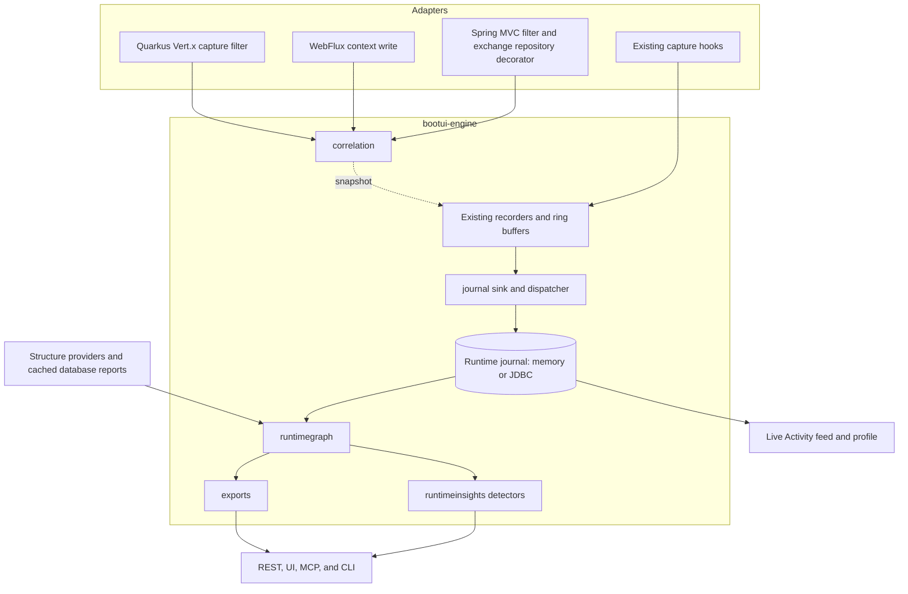

# BootUI v2 Plan: from panels to runtime understanding

This document plans **BootUI 2.0**. The v1 plan, [PLAN.md](PLAN.md), keeps governing the 1.x line on `main`. All v2
work happens on the long-lived `v2` branch (§4). Section numbers are stable identifiers: cite them as
`PLAN-v2.md §5.1`, and never renumber or reuse them.

## 1. Strategy

### 1.1 The problem

BootUI 1.x ships 60 panels. Each panel is precise about its own source: SQL Trace about statements, Traces about
spans, Security about authentication events, Transactions about transactions. The questions developers actually ask
cross those sources:

- Why is this route slow, across all its requests rather than in one trace?
- Which routes can reach this table, and can an anonymous user reach it?
- What does my change touch, and how much real traffic goes through it?
- Did my last change make anything slower?
- Which work ran without a request, and where did its context get lost?

Today a developer answers these by joining panels in their head. Where BootUI joins sources itself (Live Activity
nesting, the request profiler, SQL route attribution), the join is re-derived after the fact from trace ids, serving
threads, and time windows. A proof of concept on the Spring sample app, with PostgreSQL, Redis, Kafka, and Ollama,
measured the result:

| Evidence | Measured on 1.19.0 |
| --- | --- |
| HTTP exchanges carrying a trace id when identical requests overlap | 79 % (608 of 767) |
| Exception occurrences and security events carrying a request link | none: both had a null trace id |
| Kafka sends attributable to the request that produced them | 13 % (4 of 31) |
| SQL statements with no owning request | 90 of 425, on `pool-N-thread-N` |
| Live Activity default window at the scenario's 88 events per second | 200 entries, about 2.3 seconds |
| Live Activity persistence capture | a poller reading that window every 2 seconds, lossy above about 100 events per second |

Once the same events were joined exactly, in a graph, they revealed patterns that no single panel shows (§5.5, §5.7):

- a table read by anonymous routes and by an administrator-only route;
- secured routes spending 94 % of their time in password hashing;
- `select count(*)` taking 5.3 ms in the application and 0.025 ms inside PostgreSQL;
- a transaction holding its connection 96 % idle;
- a search route whose median rises from 4 ms to 25 ms while local LLM chat requests run;
- the 7 beans and 571 requests that a change to one repository would reach.

### 1.2 The v2 thesis

**Record every runtime event once, with exact keys at capture time, keep it in a bounded local journal, and analyze it
as a graph on demand.** BootUI 2.0 delivers three outcomes, in this order:

1. **Exact.** Existing panels stop guessing. Every event carries the request, trace, span, transaction, and run it
   belongs to, stamped when it happened (§5.1).
2. **Remembered.** Evidence outlives the ring buffers and the restart, so a developer can compare runs (§5.2, §5.8).
3. **Explained.** A new **Runtime Insights** panel and matching agent tools turn cross-source joins into observations
   with numbers, sample sizes, and stated limits (§5.5, §5.6, §5.7).

Live Activity is the first beneficiary: it becomes exact, keeps minutes to hours of history instead of seconds, and
its request profile gains a unified timeline (§5.3).

### 1.3 What does not change

The five v1 priorities stay in force: safety and local-only operation, easy installation, useful runtime explanations,
a polished but simple UI, and testable architecture. In addition:

- **No new infrastructure.** No graph database, no external process, no new heavy dependency. The graph is built in
  memory inside `bootui-engine`; graph databases and process-mining tools are export targets (§5.9).
- **A runtime view, not an advisor.** Runtime Insights reports observations with no severity, no score, and no effect
  on Overview, like the PostgreSQL and MySQL panels. Advisors keep owning rules.
- **Nothing on page load.** Opening a panel, a profile, or an MCP read tool never starts an analysis, a scan, or a
  network call. Analysis is an explicit, single-flight, time-bounded action.
- **Nothing leaves the machine.** The journal is local, masked, and bounded. There is no hosted service, no sampling
  service, and no telemetry about BootUI users.
- **Honest across stacks.** Spring MVC stays the reference. Spring WebFlux and Quarkus report each capability they
  cannot provide as unavailable with a reason.

### 1.4 Positioning

| Category | Examples | What they answer | What BootUI v2 adds |
| --- | --- | --- | --- |
| Production APM and observability | Datadog, Dynatrace, New Relic, Elastic | Production behavior, sampled, sent to a remote backend | Development-time, complete within bounds, local, zero setup, and joined with framework structure (mappings, beans, security, transactions) |
| Static software intelligence | CAST Imaging, IDE dependency graphs | What the code could do | What the code **did** in this run, with counts and timings |
| Development consoles | Spring Boot Admin, Quarkus Dev UI, Actuator | One source at a time | Exact cross-source joins and observations |
| Development-time trace analysis | Digma and similar IDE plugins | Issues found in OpenTelemetry traces | Every BootUI source, not only spans, with security and data-access context, available to agents through MCP and the CLI |

The differentiator is the combination: **local, exact, cross-source, and agent-ready**. An AI coding agent can ask
BootUI "what does changing this bean touch?" and get an answer grounded in the application's real traffic.

## 2. Business value and success measures

### 2.1 Jobs to be done

| Job | Today in 1.x | With v2 | Where |
| --- | --- | --- | --- |
| Explain a slow route | Open one trace, then SQL Trace, then Transactions | One observation per route: where its time goes across all its requests, with SQL merged into spans | §5.5 `route-time-breakdown` |
| Review access to data | Read Security filter chains and SQL Trace separately | Tables reached by both anonymous and protected routes, with the evidence | §5.5 `data-exposure` |
| Fix lost context | Unexplained top-level rows in Live Activity | The thread family, its volume, candidate routes, and the executor to wrap | §5.5 `lost-context` |
| Prepare a refactoring | Beans graph without traffic | Beans reached by a change, with the requests that went through them | §5.7 `change-impact` |
| Check a change | Remember numbers, or nothing | Per-route and per-statement deltas against the previous run | §5.8 |
| Give an agent runtime ground truth | `get_live_activity` returns the last few seconds | Cached observations and targeted questions through MCP and the CLI | §5.6 |
| Explore further | Not possible | GraphML, Neo4j CSV, and OCEL 2.0 exports | §5.9 |

### 2.2 How success is measured

BootUI collects no usage telemetry, and v2 does not change that. Success is therefore measured with evidence the
project controls:

| Measure | Target | How it is verified |
| --- | --- | --- |
| Exact correlation coverage | ≥ 99 % of request-thread events carry their request on Spring MVC and Quarkus; WebFlux target set by its spike | Automated concurrency scenario on the sample apps (§5.1), run in CI |
| Journal completeness | Zero drops for the PoC scenario (766 requests in about 22 s) at default settings | Engine and sample-app tests (§5.2) |
| Capture overhead | Publishing an event costs < 2 µs p99; sample-app throughput within 5 % with the journal on versus off | Timed engine test and a sample-app benchmark scenario |
| Detector correctness | Every seeded pattern in the sample apps is found; no counterexample fixture produces an observation | Fixture tests per detector and a browser scenario (§5.5) |
| Time to answer | The five jobs in §2.1 each answerable from one analysis, in at most three clicks or one CLI command | Scripted walkthroughs in the browser suites |
| Adoption | 2.x downloads overtake 1.x within two minor releases; issues and discussions referencing Runtime Insights | Maven Central statistics and GitHub activity |

### 2.3 Stop and continue criteria

Each milestone is useful on its own, and each has an explicit gate:

- **After M1.** If exact correlation stays below 95 % on Spring MVC or Quarkus, stop and fix capture before building
  the journal. Everything later depends on it.
- **After M3.** If the seeded sample-app patterns are not found reliably, or a counterexample produces an observation,
  keep the panel labelled **Preview** and do not start M4 detectors.
- **Before 2.0.0.** If the capture overhead target is missed, the journal ships disabled by default and the release
  notes say so.

## 3. Relationship to the v1 plan

The v1 diagnostics workstream (PLAN.md §3.14 and §3.18–§3.25) shapes evidence BootUI already captures. v2 builds the
exact keys and the journal underneath it. v2 never re-implements a v1 item: it reuses the item once delivered on
`main` and merged into `v2`.

| v1 item | Relationship | How v2 uses it |
| --- | --- | --- |
| §3.14 Correlation-ID filtering | Complementary | §3.14 keeps owning business correlation headers and their exposure policy. v2's `CorrelationContext` carries §3.14's one-way lookup identity, so journal events are filterable by it |
| §3.18 Data access map | Foundation | v2 reuses its table extraction, access classification, and route attribution. `data-exposure` is the data access map joined with request authentication. v2 adds no second SQL table scanner |
| §3.20 Execution-context profiles | Foundation, upgraded | v2 adds an exact `REQUEST_ID` tier above §3.20's `TRACE_ID`, `SERVING_THREAD`, and `TIME_WINDOW` tiers, and reuses its generalized profile assembler |
| §3.21 Log correlation | Foundation | Log lines gain a request id; `LOG` events enter the journal with §3.21's allowlist and exposure rules |
| §3.22 Route performance rankings | Shared helper | v2 reuses its percentile helper and route-template resolution. The profile's route comparison reads the journal window |
| §3.23 Scheduled task run history | Source | Scheduled runs enter the journal and take part in run comparison |
| §3.24 Failure-preserving retention | Shared policy | The in-memory journal reserves a share of its capacity for failed and slow events, with the same reporting |
| §3.25 Agent-ready profiles | Shared workflow | v2's MCP tools follow the same investigation workflow and add the unified timeline to exported profiles |

If v2 needs a v1 item that has not landed yet, the item is delivered on `main` as planned in PLAN.md and then merged
into `v2` (decision D4).

## 4. Roadmap, branch, and releases

### 4.1 Milestones

| Milestone | Delivers | Useful on its own because | Effort (engineer-days, rough) | Status |
| --- | --- | --- | --- | --- |
| **M0 Branch readiness** | CI on `v2`, merge routine, correlation scenario baseline | Every later PR is verified | 2–3 | 📋 Planned |
| **M1 Exact correlation** (§5.1) | One correlation context stamped on every event, on all three stacks | Live Activity nesting, the profiler, and Live Flow become exact | 25–30 | 📋 Planned |
| **M2 Runtime journal** (§5.2) | Push-based, bounded, masked journal in memory, optionally in JDBC | History across restarts, no poller loss | 15–18 | 📋 Planned |
| **M3 Runtime Insights preview** (§5.3–§5.6) | Live Activity on the journal, graph engine, panel, six detectors, MCP tools and CLI | The first cross-source observations, in the product and for agents | 38–45 | 📋 Planned |
| **M4 Runtime Insights** (§5.7–§5.9) | Second-wave detectors, run comparison, exports | Before-and-after checks and deep exploration | 18–22 | 📋 Planned |
| **M5 Optional** (§5.10) | Embedded graph store, recorded CI runs | Large histories and CI budgets | Not estimated | 💤 Deferred |

M1–M4 total about **100–120 engineer-days**, or about three months with two developers working in parallel on the
correlation and journal streams. Durations exclude review latency.

### 4.2 Branch strategy

- `v2` was created from `main` and is a shared, long-lived branch. It is never rebased or force-pushed.
- `main` keeps the 1.x line and the v1 plan. `main` is merged into `v2` at least weekly and after every 1.x release,
  with merge commits, so v1 fixes and v1 plan items reach v2 continuously.
- v2 pull requests target `v2`, stay small, and pass the same gates as `main` pull requests (§9, §11).
- **M0-1:** extend `.github/workflows/build.yml` push and pull-request filters to `v2`, so the full build, conformance
  runners, and browser suites run on every v2 change. No other workflow changes are needed until the release.

### 4.3 Releases

- Nothing is published from `v2` before 2.0.0. The release workflow accepts only `major.minor.patch` versions that
  follow the latest stable tag, so there are no milestone or preview coordinates on Maven Central. Early adopters
  build the branch locally.
- When M4 meets its gates, `v2` is merged into `main` and **2.0.0** is released from `main` by the release workflow.
  A `1.x` maintenance branch is cut from the last 1.x tag only if a 1.x patch is needed afterwards (decision D5).
- A major version is justified only if it is used. The candidate breaking changes, each with a migration note in
  `CHANGELOG.md`, are:
  - Live Activity persistence moves from the `bootui_activity` summary table to the journal tables (§5.3);
  - `TraceIdProvider` is replaced by `CorrelationContextProvider` (§5.1);
  - the `bootui.activity.persistence.*` keys move under `bootui.runtime-journal.persistence.*` (§5.2).
- Java 17, Spring Boot 4, and the newest Quarkus LTS remain the baselines.

## 5. Feature specifications

### 5.1 Exact correlation — Cross-cutting 📋 Planned

Every runtime event should know, when it happens, which request, trace, span, transaction, and run it belongs to.
Today the HTTP exchange's trace id is re-derived by `HttpExchangeTraceRegistry.match` (method and path, ±50 ms, unique
candidate only), so concurrent identical requests lose it; exceptions and security events have no request link; and
Kafka sends are joined by time. This item stamps a framework-neutral correlation context at capture time on every
stack.

Scope:

- Add `CorrelationContext` to the engine: `requestId` (BootUI-generated, unique per inbound request), `traceId`,
  `spanId`, `routeTemplate`, `handler`, `transactionId` (BootUI's, innermost active), `dataSource` (current statement
  only), and §3.14's opaque correlation lookup identity when present.
- Add a `CorrelationContextProvider` SPI that replaces `TraceIdProvider` in 2.0, and a scope-based holder that always
  restores the previous context.
- Stamp the context at the existing capture points of HTTP exchanges, SQL, transactions, exceptions, security events,
  REST client calls, cache accesses, logs (with §3.21), scheduled runs (with §3.20), Kafka, RabbitMQ, JMS, email,
  WebSocket, fault tolerance, and AI calls.
- Propagate the context through messaging metadata: snapshot on send, read the producer offset from the send
  callback, and open a child context from `traceparent` on consume. Metadata only, never payloads.
- Add a `REQUEST_ID` correlation tier above §3.20's tiers and use it first everywhere a child is attached to an anchor.
- Add nullable, additive `requestId` fields (and `spanId`, `transactionId`, `dataSource`, `thread` where missing) to
  the affected DTOs, each with a secondary constructor matching today's canonical one.
- Add `instanceId` and a per-JVM-start `runId` to `/overview` metadata.
- Fix `StackFramePrefixes`, which treats every `io.github.jdubois.bootui.` class as framework code, so the sample apps
  get SQL and REST call sites (M1-0).
- Keep the port in Live Activity REST client summaries, so two local services on different ports stay distinct.

Architecture:

- Spring MVC: `RequestCorrelationFilter` opens the scope before `chain.doFilter`, reopens it on async redispatch from
  a request attribute, and fills route template and handler after routing. A `HttpExchangeRepository` decorator,
  installed by a bean post-processor that composes with application repositories, snapshots the context in `add`:
  Actuator's `HttpExchangesFilter` calls `add` synchronously on the request thread after `doFilter` (verified on Spring
  Boot 4.1.1). The registry match remains the fallback.
- Spring WebFlux: write the context into the Reactor context at filter entry. **Spike first** to confirm where
  `HttpExchangesWebFilter` calls `add`. If the context is not readable there, keep a tighter registry match keyed on
  the exchange start instant, and document the residual gap in `docs/WEBFLUX-SUPPORT.md`.
- Quarkus: `QuarkusHttpExchangeCaptureFilter` owns exchange capture, so it stamps the exchange directly, stores the
  context on the Vert.x `RoutingContext`, and restores it around worker dispatch.
- Transactions: `BootUiTransactionExecutionListener` pushes and pops the transaction id. The JDBC wrapper records the
  datasource bean name when the proxy is created. Quarkus transactions stay unavailable, as today.
- Every adapter keeps optional types (OpenTelemetry, messaging, security) in gated classes.

Out of scope:

- Generating, replacing, or propagating correlation headers on behalf of the application, which §3.14 also excludes.
- `@Async`, `CompletableFuture`, and executor instrumentation. Work on unwrapped executors stays visible as lost
  context (§5.5) instead.

Acceptance criteria:

- The correlation scenario (identical requests in parallel, secured requests, Kafka sends, a raw executor) reaches the
  §2.2 coverage targets on Spring MVC and Quarkus, and WebFlux reports its measured coverage.
- Contexts never leak between requests on reused platform threads, virtual threads, or Vert.x worker hops.
- Every new DTO field is nullable and additive; `BootUiApiContractCatalog` and the three conformance runners pass.
- The request profiler no longer marks request-thread work approximate.

### 5.2 Runtime journal — Diagnostics 📋 Planned

Each panel keeps its own ring buffer, and Live Activity persistence polls a 200-entry merged window every two seconds,
so bursts lose events and the database keeps only an 18-column summary. This item records every runtime event once,
with its full masked payload, in a push-based journal.

Scope:

- A `RuntimeEvent` envelope (sequence, event id, type, time, duration, instance, run, request, trace, span, thread,
  correlation tier) and sealed, already-masked payloads per source. SQL keeps normalized text, statement type, call
  site, connection id, and datasource, and never bind values.
- A `RuntimeEventSink` called right after each recorder's existing ring-buffer write, through a non-blocking `offer`
  into a bounded queue drained by one `bootui-journal-dispatch` daemon thread. On overflow the event is dropped and
  counted; the application thread never blocks.
- An in-memory journal, on by default, bounded by event count (50,000) and approximate bytes (32 MB), reserving a
  bounded share for failed and slow events like §3.24.
- An opt-in JDBC journal with write-behind, portable DDL (`bootui_event` and a typed `bootui_event_attr` table),
  dialect-aware row limits (older MySQL rejects `OFFSET … FETCH`), shared or dedicated datasource modes, and
  per-instance retention (7 days by default).
- Self-exclusion of BootUI's threads, paths, and JDBC (`BootUiJdbcCaptureGuard`), including BootUI's own PostgreSQL,
  MySQL, and Database Advisor reads.
- A journal status block (events, bytes, drops, evictions, persistence state) in Live Activity's persistence
  disclosure, and a confirmation-gated purge action blocked by read-only policy.
- Properties under `bootui.runtime-journal.*`: `enabled`, `max-events`, `max-bytes`, `queue-capacity`, `sources`,
  `capture-mail-recipients` (off), and `persistence.*`.

Architecture:

- The journal is a sibling SPI to `ActivityStore`, reusing its proven pieces: sequencing, write-behind with re-queue
  on failure, the capture guard, instance ids, and the "Use the existing datasource" switch.
- Analysis windows that saw drops or evictions are reported `PARTIAL` with the counts.

Out of scope:

- Sending events off the machine, sampling, and any production mode.
- Payload capture for messages, request bodies, or bind values.

Acceptance criteria:

- The PoC scenario records every event with zero drops at default settings, on all three stacks.
- A burst beyond the queue drops and reports the drops, and a test proves request latency is unaffected by a stalled
  store.
- With JDBC persistence, a restart keeps the previous run, identified by its `runId`, on H2, PostgreSQL, and MySQL.
- BootUI's own traffic and SQL never enter the journal.

### 5.3 Live Activity on the journal — Overview 📋 Planned

Live Activity is where BootUI already connects events, and where the missing links show. This item makes it a
projection of the journal and extends its request profile.

Scope:

- Serve the Live Activity feed and Live Flow from the journal and retire the persistence poller. Persistence becomes
  the journal's JDBC store; the `bootui_activity` table is read once for migration notes and no longer written.
- Nest children by `REQUEST_ID` first, then §3.20's tiers, so request-thread SQL, security, cache, exception, log,
  and Kafka rows sit under their request.
- Add transaction, log, AI call, and WebSocket frame rows (14 event types instead of 10).
- Add filters for route template, run, and request id, and show work with no request as **No request**, with its
  thread and reason.
- Extend the request profile, additively, with:
  - a **unified timeline** of spans, SQL, transactions, cache accesses, and log lines on one axis, with time inside
    the database marked when a cached PostgreSQL or MySQL report has it;
  - a **route comparison**: this request against its route's p50 and p95 in the journal window;
  - **touched resources**: tables, transactions, caches, messages, and log lines;
  - **related observations** from the last analysis, never computed on open.

Architecture:

- The feed assembler reads journal events instead of polling panel buffers. `LiveActivityAssembler` keeps its
  severity and KPI logic.
- Route comparison reuses §3.22's percentile helper.

Out of scope:

- Opening the profile beside the feed rather than in the drawer, which is a separate design decision (D7).

Acceptance criteria:

| Measure | 1.19.0 (measured) | 2.0 target |
| --- | --- | --- |
| Request-thread SQL under its request | 79 % | 100 % |
| Security events under their request | 43–63 % | 100 % of request-scoped events |
| Cache accesses under their request | 67–94 % | 100 % of request-scoped accesses |
| Kafka sends under their request | 0 % | 100 % of sends on a request thread |
| Default history at 88 events per second | about 2.3 seconds | about 9.5 minutes (50,000 events) |
| Loss with persistence on | above about 100 events per second | none below the queue bound; drops counted |

- Existing Live Activity API consumers keep working: DTO changes are additive.

### 5.4 Runtime graph engine — Engine 📋 Planned

Observations need joins across many events and structure snapshots. This item builds a bounded, typed graph on demand
from the journal window and structure providers, with no graph library.

Scope:

- Node types for requests, routes, handlers, beans, repositories, principals, traces, spans, statements, tables,
  transactions, caches, messages, destinations, remote origins, exception groups, AI models, loggers, scheduled tasks,
  and cached database statistics.
- Typed edges (`HANDLED_BY`, `EXECUTED`, `READS`, `WRITES`, `DEPENDS_ON`, `RAISED`, `PRODUCED`, `DELIVERED_TO`,
  `CHILD_OF`, `OVERLAPS`, and others). Every event edge carries its correlation tier, and each detector declares the
  minimum tier it accepts, so approximate joins never produce precise claims.
- Structure from existing providers (mappings, beans, repositories) and from **cached** PostgreSQL and MySQL reports
  only. The graph never triggers a database read.
- Table references from §3.18's extraction, computed at analysis time and cached per normalized statement, never on
  the capture path.
- Bounds: `max-nodes` (200,000), `max-edges` (1,000,000), and an analysis timeout (10 s). Exceeding one yields a
  `PARTIAL` result with the reason.
- Algorithms in the engine, each with property-based tests: breadth-first search, reverse closure, interval sweep,
  span self-time aggregation, set differences, and (M4) Louvain with fixed seeds and a stability check.

Architecture:

- Int-indexed adjacency lists and interned labels in `io.github.jdubois.bootui.engine.runtimegraph`.
- No JGraphT or other graph dependency: it would add a transitive dependency to every consumer for about five
  algorithms.

Acceptance criteria:

- Building and analyzing 100,000 events takes ≤ 2 s on a laptop and ≤ 128 MB transient memory, pinned by a tagged,
  generously margined timed test.
- The PoC evidence, converted into a Java fixture builder, reproduces the PoC's graph counts within the documented
  differences.

### 5.5 Runtime Insights panel — Overview 📋 Planned

A new panel, `runtime-insights`, in the Overview group directly after Live Activity. It reads the journal and structure
snapshots and turns them into observations. It is a runtime view: no severities, no score, and no effect on Overview.

Scope:

- `GET {api}/runtime-insights` returns the cached report only, `NOT_ANALYZED` before the first analysis.
- `POST {api}/runtime-insights/analyze` runs an explicit, single-flight, time-bounded analysis registered as
  `runtime-insights.analyze` in `ActionOperations`, with the shared `409` busy shape. It is allowed under
  `bootui.read-only=true`, like `postgresql.read`, because it mutates nothing (D3).
- `GET {api}/runtime-insights/insights/{id}` returns one observation's bounded, paged evidence.
- The report carries its window (time range, runs, events per type, drops, evictions), a **correlation coverage**
  breakdown per source, the observations, limitations, and a truncation flag.
- Each observation carries a stable id, its kind, a plain sentence with the numbers, metrics, sample size, the
  minimum correlation tier it used, bounded masked evidence rows, deep links to source panels, and its limitations.
- First six detectors:

| Id | Observation | Minimums | Stacks |
| --- | --- | --- | --- |
| `data-exposure` | A table read by routes that succeeded anonymously and by routes that required authentication | ≥ 3 successful requests per route; request-to-SQL at `REQUEST_ID` or `TRACE_ID` | All three, with Spring Security or Quarkus security |
| `route-time-breakdown` | Where a route's time goes: dominant span self-time, with SQL merged as virtual child spans | ≥ 5 traced successful requests; p50 ≥ 20 ms | All three, with tracing |
| `sql-outside-database` | Share of statement time spent outside the database (round trip, driver, pool) | ≥ 5 executions; call counts within 10 % | Where the PostgreSQL or MySQL panel has statement statistics |
| `idle-transactions` | Transactions holding a connection mostly without executing SQL | Transaction ≥ 20 ms; ≥ 3 per method; idle ratio ≥ 0.8 | Spring MVC and WebFlux |
| `lost-context` | Work no request owns, grouped by thread family, with candidate routes and the executor to wrap | ≥ 5 events per family; startup and BootUI threads excluded | All three |
| `runtime-coverage` | Declared routes never exercised, and tables with database activity no observed route explains | None; worded "not seen in N runs" | All three |

- `sql-outside-database` joins application statements to database statistics through one canonical form that maps
  `?` and `$n` placeholders alike, and reports unmatched statements rather than guessing.
- The UI has:
  - a header with the window, the **Analyze** action, the last analysis time, **Export** (M4), and the read-only note;
  - a correlation coverage strip with text labels, so the reliability of everything below is visible first;
  - a search by route, table, bean, or thread, and theme chips (data and access, where time goes, resources,
    context, structure, since last run);
  - a master-detail list: observations on the left, and on the right the summary, one diagram built for the
    observation, what was measured, what to check, the evidence table, limits, source-panel links, and the equivalent
    CLI command;
  - empty states for not analyzed, empty journal, journal disabled, and partial windows.

```text
┌ Runtime Insights ──────────────────── 12 observations · 18,412 events · analyzed 2 min ago  [Analyze again] [Export ▾] ┐
│ A runtime view of this run: observations with sample sizes, not rules or scores.                                       │
│ Linked by  request id ███████████████████░ 96 %  trace id █ 2 %  background (expected) ░ 1 %  no context ░ 1 %          │
├───────────────────────────────┬─────────────────────────────────────────────────────────────────────────────────────────┤
│ Search routes, tables, beans… │ sample_products is read by anonymous and protected routes                               │
│ DATA AND ACCESS               │ 5 anonymous routes (236 requests) and GET /api/secure/products (ROLE_ADMIN) read it.   │
│ ▸ sample_products exposure    │ [ diagram: anonymous routes ─▶ table ◀─ protected route ]                              │
│ WHERE TIME GOES               │ Measured · What to check · Evidence (masked, 50 rows) · Limits                          │
│   Secured routes: 94 % auth   │ Open in: SQL Trace · Security · Mappings      CLI: bootui runtime insight <id>          │
│   count(*) outside PostgreSQL │                                                                                         │
│ CONTEXT                       │                                                                                         │
│   90 SQL on pool-N-thread-N   │                                                                                         │
└───────────────────────────────┴─────────────────────────────────────────────────────────────────────────────────────────┘
```

Architecture:

- Detectors are pure engine classes (`id()`, `minimumTier()`, `availability(snapshot)`, `detect(graph, settings)`).
  Each has fixtures for a justified observation, a plausible counterexample, and insufficient evidence; unknown never
  reads as healthy.
- `RuntimeInsightsService` owns the cached report, single-flight admission, the timeout, and a bounded graph snapshot
  for exports, released on the next analysis.
- Thin adapters: a Spring MVC controller, a WebFlux variant that analyzes on `boundedElastic` if needed, and a Quarkus
  resource registered in `BootUiQuarkusProcessor`. Quarkus registers nothing in `LaunchMode.NORMAL`.
- The panel is available when the journal is enabled, and otherwise unavailable with the property to set.
- Summaries are worded as observations in the window ("while chat requests run"), never as causes or verdicts.

Out of scope:

- Severities, scores, Overview contributions, and rule catalogs.
- Free-form query languages such as Cypher or SQL.

Acceptance criteria:

- Opening the panel performs no analysis, capture, or network call.
- A browser scenario on each stack generates the sample traffic, analyzes, finds the seeded `data-exposure`
  observation for `sample_products`, opens its evidence, and follows a deep link.
- Every detector's unavailable state names its missing capability instead of returning an empty success.
- The panel is labelled **Preview** until M4 while its DTOs are covered by conformance from the first PR.

### 5.6 Runtime Insights for agents — Developer tools 📋 Planned

Agents need the same observations, but the published CLI binds arguments by the fixed `McpToolSchema` names, so a new
schema would break older CLI binaries. This item adds focused tools on existing schemas only.

Scope:

| Tool | Schema | Kind | CLI command | Purpose |
| --- | --- | --- | --- | --- |
| `get_runtime_insights` | `NONE` | read | `bootui runtime insights` | Cached report: coverage and observation summaries |
| `get_runtime_insight` | `ID` | read | `bootui runtime insight <id>` | Evidence for one observation |
| `analyze_runtime_insights` | `NONE` | action | `bootui runtime analyze` | Explicit analysis, same policy as the `POST` |
| `get_runtime_bean_impact` | `ID` | read | `bootui runtime impact <bean>` | Reverse dependency closure with observed request counts (M4) |

- "Who reads this table?" stays §3.18's `get_sql_data_access`; `data-exposure` evidence links to it.
- Read tools answer from the cached analysis and return "not analyzed" rather than starting one.
- `McpGuidance` adds Runtime Insights to `assess_application` and `diagnose_runtime_issue` as evidence to read, with
  analysis requiring approval like other scans.

Acceptance criteria:

- `McpToolCatalog`, `McpToolDescriptions`, the three adapters' MCP tool classes, `CliCommandPaths`, and the
  regenerated `bootui-tools.json` change together, and `ToolManifestGeneratorTests` passes.
- A 1.x CLI binary keeps working against a 2.0 application.
- `docs/AI-AGENTS.md`, `docs/CLI.md`, and both copies of the BootUI skill describe the investigation workflow.

### 5.7 Second-wave detectors — Runtime Insights 📋 Planned

| Id | Observation | Algorithm and minimums | Stacks |
| --- | --- | --- | --- |
| `noisy-neighbours` | A route whose latency rises while another route runs | Interval sweep; 5 s warm-up excluded; ≥ 10 samples each side; ratio ≥ 2; always worded as correlation | All three |
| `runtime-modules` | Routes and resources that form runtime modules, compared with Java packages | Louvain over route–resource co-access; modularity ≥ 0.3; reported only when stable across seeds | All three |
| `change-impact` | Beans reached by a change to a bean, with the traffic that went through them | Reverse closure over dependencies (depth ≤ 5) joined to handlers and requests | Spring; Quarkus through ArC injection edges |
| `journeys` | Strong next-step transitions per client | Directly-follows counts per hashed client key; n ≥ 20 and p ≥ 0.6 | All three; WebFlux and Quarkus by principal or header |
| `messaging-flows` | Request → send → consume → downstream work chains | `TRACE_ID` tier or better only | Spring Kafka, RabbitMQ, JMS; Quarkus Kafka, RabbitMQ |
| `cache-shielding` | Tables each cache protects, and what clearing it would cost | Cache miss → SQL in the same request | Spring only |

Acceptance criteria follow §5.5: justified, counterexample, and insufficient-evidence fixtures per detector, and
availability reasons on every stack that lacks a source.

### 5.8 Run comparison — Runtime Insights 📋 Planned

A developer changes code, restarts, and wants to know what moved. This item compares the current run with a previous
one from the journal.

Scope:

- A run selector in Runtime Insights and a `run-comparison` observation per route and per statement: count, p50, and
  p95 deltas, reported only with ≥ 10 samples on each side.
- Runs are identified by `runId`; history needs JDBC persistence or a long in-memory window, and the panel says which.
- Configuration differences that make runs incomparable (profile, datasource URL shape, cache enabled) are listed as
  limitations, never hidden.

Acceptance criteria:

- Switching the sample app from H2 to PostgreSQL produces the expected product-search median delta in a fixture.
- A comparison with too few samples reads "not enough evidence", never "no change".

### 5.9 Graph and process-mining exports — Runtime Insights 📋 Planned

| Format | Produced by | Use |
| --- | --- | --- |
| GraphML | The engine, with JDK StAX | Gephi, Cytoscape, yEd |
| Neo4j import CSV (zip) | The engine | Neo4j Desktop and Graph Data Science |
| OCEL 2.0 JSON | Core DTOs serialized by the adapters | PM4Py object-centric process mining |

- Exports come from the cached analysis snapshot only, are masked and bounded (`max-export-bytes`, 50 MB), honor
  `bootui.expose-values` with principals hashed under `METADATA_ONLY`, and are served as attachments like the heap
  dump download on all three stacks.
- Conformance asserts media types and headers; Spring AOT hints and Quarkus reflection cover the OCEL DTOs.

### 5.10 Optional extensions 💤 Deferred

| Item | Approach | Condition to start |
| --- | --- | --- |
| Embedded graph store | An optional `bootui-runtime-graph-arcadedb` module implementing the journal SPI, never a starter dependency | Users needing histories beyond about 10⁶ events or multi-day runs |
| Recorded CI runs | `bootui runtime analyze` after integration or browser tests, a JSON report artifact, and optional budgets such as "no new lost-context families" | M3 shipped and demand from CLI users |

## 6. Architecture



New engine packages: `correlation`, `journal`, `runtimegraph`, `runtimeinsights`, and `runtimeinsights.export`, plus
the `CorrelationContextProvider` SPI. The dependency direction `bootui-core <- bootui-engine <- adapters` is unchanged,
and no shared module gains a Spring, Quarkus, or JSON dependency.

## 7. Cross-stack availability

| Capability | Spring MVC | Spring WebFlux | Quarkus |
| --- | --- | --- | --- |
| Correlation context | Filter and scoped holder | Reactor context (spike for exchanges) | Vert.x context |
| Exact exchange → request | Repository decorator | Spike, then tighter fallback | Direct |
| SQL transaction id | ✓ | ✓ through the Reactor context | Unavailable: no transaction capture |
| Journal, memory and JDBC | ✓ | ✓ | ✓ |
| `data-exposure`, `route-time-breakdown`, `lost-context`, `runtime-coverage`, `noisy-neighbours`, `runtime-modules` | ✓ | ✓ | ✓ |
| `sql-outside-database` | With PostgreSQL or MySQL statistics | Same | Same |
| `idle-transactions`, `cache-shielding` | ✓ | ✓ | Unavailable |
| `change-impact` | ✓ | ✓ | ✓ through ArC |
| `journeys` | Session or principal | Principal or header | Principal or header |
| `messaging-flows` | Kafka, RabbitMQ, JMS | Kafka, RabbitMQ, JMS | Kafka, RabbitMQ |

Each unavailable cell is returned as availability with a reason and documented in `docs/QUARKUS-SUPPORT.md` and
`docs/WEBFLUX-SUPPORT.md`.

## 8. Safety, privacy, and performance

| Concern | Rule |
| --- | --- |
| Values | Everything entering the journal has passed through `SecretMasker` and the live exposure policy. SQL is normalized; bind values are never stored, even with parameter capture on |
| Principals and sessions | Session ids are always hashed; principals are hashed under `METADATA_ONLY`; the `journeys` client key defaults to a hash |
| Email | Recipients are not journaled unless `capture-mail-recipients` is set |
| Page load | `GET` never analyzes; the UI never posts on render; MCP read tools never analyze |
| Production | Quarkus registers nothing in `LaunchMode.NORMAL`; Spring activation rules are unchanged |
| Self-exclusion | BootUI's threads, paths, and JDBC never enter the journal or the graph |
| Exports | From the cached snapshot only, bounded, masked, and under the panel's policy |
| Purge | Confirmation-gated, blocked by read-only policy, and clears memory and this instance's JDBC rows |

| Path | Budget |
| --- | --- |
| Publishing an event on an application thread | One allocation and a non-blocking `offer`; < 2 µs p99; never blocks |
| Sample-app throughput, journal on versus off | Within 5 % |
| In-memory journal | ≤ `max-bytes` (32 MB by default), evictions counted |
| Graph build and analysis | ≤ 2 s for 100,000 events; hard timeout 10 s |
| Analysis memory | ≤ 128 MB transient |

## 9. Cross-cutting work

Every v2 item follows PLAN.md §4. For the new panel specifically:

1. `BootUiPanels`: `runtime-insights`, action-capable, appended last.
2. Availability in `PanelsController` (servlet and reactive) and `QuarkusPanelAvailability`.
3. Policy: `bootui.panels.runtime-insights.*`, both Spring access filters, the Quarkus access config and filter, and
   `ActionOperations`.
4. Adapters, Spring runtime hints, and Quarkus reflection registration.
5. Conformance: `BootUiApiContractCatalog`, the three expected-panel manifests, the action catalog, and downloads.
6. MCP and CLI as in §5.6.
7. UI: `routes.js`, the view and its Vitest tests, and `routes.test.js`.
8. Browser: both `app-shell.spec.js` files and a `runtime-insights.spec.js` per project, plus the screenshot script.
9. Documentation: `docs/features/overview.md` (a `## Runtime Insights` heading), `docs/SPECIFICATION.md`,
   `docs/QUARKUS-SUPPORT.md`, `docs/WEBFLUX-SUPPORT.md`, `docs/FRAMEWORK-SUPPORT.md`, `docs/PROPERTIES.md`,
   `docs/AI-AGENTS.md`, `docs/CLI.md`, both skill copies, README counts, and `CHANGELOG.md`.
10. Hard-coded counts in `PanelsControllerTests`, `BootUiAutoConfigurationTests`, `PanelAccessFilterTests`,
    `BootUiPanelsTests`, and `QuarkusPanelAvailabilityTest`.

## 10. Risks

| Risk | Item | Impact | Mitigation |
| --- | --- | --- | --- |
| WebFlux exchanges cannot be correlated exactly | §5.1 | Medium | Spike first, keep the tighter fallback, show the tier in the UI |
| Contexts leak between requests on pooled or virtual threads | §5.1 | High | Scopes that restore the previous context, and tests on reused, virtual, and worker threads |
| Capture overhead on JDBC and logging hot paths | §5.1, §5.2 | High | Non-blocking publish, budgets pinned by tests, a `sources` allowlist, and one switch to disable |
| Observations mislead on small or biased samples | §5.5, §5.7 | High | Minimums, warm-up exclusion, tier floors, observational wording, visible sample sizes, and Preview in M3 |
| Moving Live Activity onto the journal regresses it | §5.3 | Medium | Parity tests against the 1.x feed on the same fixture before retiring the poller |
| `v2` drifts from `main` | §4.2 | Medium | Weekly merges and CI on `v2` from M0 |
| Overlap with v1 items produces two implementations | §3 | Medium | v2 reuses v1 items and never re-implements them |
| Scope creep toward APM | all | Medium | Development-only, no production mode, no hosted service, and no free-form query language |
| Native image or AOT surprises with new DTOs | §5.5, §5.9 | Low | Hints and reflection registration in the same pull requests; native sample checked before 2.0.0 |

## 11. Validation checklist

Run after each v2 item lands on `v2` and before 2.0.0:

- [ ] `./mvnw -B -ntp clean install` passes on Java 17, including the three conformance runners.
- [ ] Spotless and Prettier checks pass for every touched area.
- [ ] The correlation scenario meets the §2.2 coverage targets on every stack, or reports its measured gap.
- [ ] The journal overhead and graph budgets in §8 hold.
- [ ] Runtime Insights and Live Activity handle empty, unavailable, partial, and busy states with clear reasons.
- [ ] Nothing is analyzed, captured, or fetched on page load.
- [ ] Masking and the value-exposure mode hold in the journal, observations, exports, and MCP output.
- [ ] Browser suites pass on Spring MVC, Spring WebFlux, the custom-path app, and Quarkus.
- [ ] Documentation, properties, and CLI and MCP references describe the new surfaces.
- [ ] Spring Boot stays disabled in `prod` and `production` unless enabled, Quarkus stays production-dark, and every
      adapter rejects non-local requests.

## 12. Decisions

| # | Decision | Recommendation |
| --- | --- | --- |
| D1 | Keep the in-memory journal on by default? | Yes, bounded like existing buffers; JDBC stays opt-in |
| D2 | New panel, or a mode of Live Activity? | New panel: it has its own action, exports, tools, and policy |
| D3 | Allow analysis under `bootui.read-only=true`? | Yes, like `postgresql.read`; the purge stays blocked |
| D4 | When v2 needs an undelivered v1 item? | Deliver it on `main` per PLAN.md, then merge into `v2` |
| D5 | Where is 2.0.0 released from? | Merge `v2` into `main` and release from `main`; cut `1.x` only if a patch is needed |
| D6 | Include the Neo4j CSV export? | Yes: it is cheap and opens Graph Data Science |
| D7 | Open the request profile beside the feed? | Prototype in M3 behind the existing drawer; decide with screenshots |
| D8 | Start the embedded graph store? | Not until users ask |

## Appendix A. Proof-of-concept evidence

The proof of concept ran the Spring sample app on JDK 26 twice: with H2 (655 requests), and with PostgreSQL, Redis,
Kafka, and Ollama (767 requests). It read 30 BootUI endpoints, built a graph of 7,589 nodes and 14,093 edges, and found
twelve patterns: data exposure, authentication cost, SQL time outside the database, idle transactions, lost context,
noisy neighbours, runtime modules, journeys, change impact, Kafka flows, runtime coverage, and run differences. Its
weaknesses define M1: joins by time and thread, a trace id recovered from root spans within ±3 ms, and authentication
inferred from span names.
