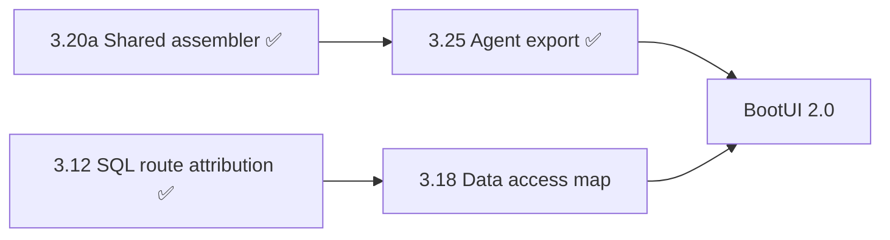

# BootUI Implementation Plan

## 1. Strategy

BootUI adds a safe, local-only developer console to a running application, shipping on **Spring Boot 4 (servlet and
WebFlux starters) and Quarkus (an extension)** from one shared, framework-neutral engine that serves the same Vue UI and
the same `/bootui/api/**` contract on every runtime. The released surface covers 60 panels across runtime introspection,
configuration, databases, services, diagnostics, project health, and developer tooling, and MCP tools and the `bootui`
command-line interface reach the same diagnostics without a browser.

BootUI 1.x is in maintenance. Its last workstream deepened diagnostics rather than widening coverage, and shipped the
shared foundations that later work reuses: the tiered capture buffer, the generalized profile assembler, route
rankings, the log exposure policy, and advisor violation locations (§2). The rest of that roadmap was dropped on
2026-09-30, except two items BootUI 2.0 depends on. §3.25 has shipped, and §3.18 remains; it ships on `main` like any
1.x item and reaches 2.0 when `main` is merged into `v2`. Otherwise 1.x receives bug fixes, security fixes, and dependency
updates only. New capabilities are planned for BootUI 2.0 in `docs/PLAN-v2.md`, on the `v2` branch.

Sampling, quotas, remote ingestion, alerting integrations, and personal-data capture stay out of scope, because BootUI
remains local-only, bounded, and network-free on render. The priorities for every item below remain unchanged:

1. Safety and local-only operation.
2. Easy installation with no extra setup.
3. Useful runtime explanations.
4. A polished but simple UI.
5. Testable architecture.

Every item, and every maintenance change, must:

- be **read-only or read-mostly**, with any mutating control explicitly confirmation-gated like the existing Cache
  clear action;
- **fail closed** when its required classes, beans, Actuator endpoints, or data are unavailable, returning stable empty
  DTOs and a clear unavailable reason;
- route any sensitive property names, headers, addresses, or values through the existing masking and value-exposure model;
- ship with backend and edge-case tests, availability wiring, documentation, and browser coverage in sync (§4).

## 2. Roadmap status and order of work

Section numbers are stable identifiers. Code comments and other documents cite them, so a number is never reused or
renumbered, and delivered or dropped items leave gaps. An item is either 📋 Planned, with its full specification in §3;
✅ Delivered, condensed into the [delivered](#delivered) table with its behavior documented under `docs/features/`; or
dropped, listed with its former number under [Dropped](#dropped). The pull request that ships an item moves it to the
delivered table.

### Order of work

One item remains, and everything it depends on has shipped. It is one pull request.

| Wave | Item                  | Panels    | Depends on | BootUI 2.0 uses it for                                            |
| ---- | --------------------- | --------- | ---------- | ----------------------------------------------------------------- |
| 2    | §3.18 Data access map | SQL Trace | §3.12      | Table references in the runtime model, and `anonymous-data-reach` |

- **Wave 0**, §3.27 Log exposure policy, has shipped ([delivered](#delivered)). It closed the one gap where captured
  application text bypassed the value-exposure policy, ahead of everything else because safety is the first priority.
- **Wave 1** built the shared pieces that later work reuses: the tiered capture buffer, the generalized profile
  assembler, one percentile helper and slowest-request KPI, and the violation location model with its source locator.
  All of them have shipped, as §3.24a, §3.20a, §3.22, and §3.19, and BootUI 2.0 builds on them.
- **Wave 2** keeps only the two items BootUI 2.0 depends on, with their 1.x scope; `docs/PLAN-v2.md` §3 describes how
  2.0 uses them. §3.25 Agent-ready profiles and exception export has shipped ([delivered](#delivered)), and §3.18 is
  next. The rest of wave 2, and waves 3 and 4, were [dropped](#dropped).

A ✅ node has shipped. The BootUI 2.0 milestones that use each item are specified in `docs/PLAN-v2.md`.

### Delivered

| §     | Item                                                                       | Release    | Documentation                                                                        |
| ----- | -------------------------------------------------------------------------- | ---------- | ------------------------------------------------------------------------------------ |
| 3.7   | Fault Tolerance panel                                                      | 1.15.0     | [Fault Tolerance](features/services.md#fault-tolerance)                              |
| 3.10  | WebSockets panel                                                           | 1.15.0     | [WebSockets](features/services.md#websockets)                                        |
| 3.11  | Error-contract catalogue in REST API and Exceptions                        | 1.15.0     | [Declared error contract](features/advisors.md#declared-error-contract)              |
| 3.12  | Slow-SQL ranking and route attribution in SQL Trace                        | 1.15.0     | [SQL Trace rankings](features/database.md#rankings)                                  |
| 3.15  | Meter provenance and explanation in Metrics                                | 1.15.0     | [Metrics](features/runtime.md#metrics)                                               |
| 3.16  | Cache tiering and hit ratios                                               | 1.15.0     | [Tiering and hit ratios](features/services.md#tiering-and-hit-ratios)                |
| —     | Command-line endpoint, `bootui` CLI, and Command Line panel                | 1.16.0     | [Command Line](features/developer-tools.md#command-line), [CLI](CLI.md)              |
| 3.17  | MySQL operational view, tested on Oracle MySQL 8.4 LTS                     | 1.18.0     | [MySQL](features/database.md#mysql)                                                  |
| 3.19  | Structured violation locations in advisor findings                         | Unreleased | [Violation locations](features/advisors.md#violation-locations)                      |
| 3.20a | Shared profile assembler with REST client and cache evidence               | Unreleased | [Per-request profiler](features/overview.md#the-per-request-profiler)                |
| 3.22  | Route performance rankings in HTTP Exchanges                               | Unreleased | [Route rankings](features/diagnostics.md#route-rankings)                             |
| 3.24a | Failure-preserving retention in HTTP Exchanges, SQL Trace, and REST Client | Unreleased | [Failure-preserving retention](features/diagnostics.md#failure-preserving-retention) |
| 3.25  | Agent-ready profiles and exception export in Live Activity and Exceptions  | Unreleased | [Copy profile and Copy for AI](features/overview.md#copy-profile-and-copy-for-ai)    |
| 3.27  | Log exposure policy for Log Tail and Dev Services                          | Unreleased | [Log message exposure](features/diagnostics.md#log-message-exposure)                 |

Earlier deliveries were removed from this plan when they shipped; `CHANGELOG.md` records every release. The MySQL panel
reads MariaDB through MySQL Connector/J on a best-effort basis, labelled unsupported; certified MariaDB support stays
outside this roadmap.

### Dropped

- **MongoDB operational view** (formerly §3.5), dropped on 2026-09-30. BootUI plans no MongoDB client, topology,
  database, collection, or index view. The Spring Data panel still lists MongoDB repositories, and Dev Services still
  shows MongoDB service connections.
- **Spring Batch** (formerly §3.9), dropped on 2026-09-30. BootUI plans no Spring Batch job, execution, or step view.
- **The rest of the 1.x diagnostics roadmap**, dropped on 2026-09-30 when 1.x entered maintenance. New capability work
  is planned for BootUI 2.0 instead, in `docs/PLAN-v2.md` on the `v2` branch. The panels these items would have
  extended keep their current behavior, and code comments that cite one of these numbers describe that behavior.
  - **Declarative HTTP client registry** (formerly §3.6), a new Services panel.
  - **gRPC** (formerly §3.8), a new Services panel.
  - **Correlation-ID filtering** (formerly §3.14).
  - **Scheduled-run and consumed-message profiles** (formerly §3.20b and §3.20c), the remaining slices of §3.20
    Execution-context profiles, whose shared profile assembler shipped as §3.20a. Scheduled runs and consumed messages
    stay top-level in Live Activity, and only an unowned exception nests under its scheduled run. BootUI 2.0's exact
    correlation gives both their own execution identity.
  - **Log correlation** (formerly §3.21).
  - **Scheduled task run history** (formerly §3.23).
  - **Capture ignore rules** (formerly §3.24b), the remaining slice of §3.24, whose failure-preserving retention
    shipped as §3.24a.
  - **Source context for application frames** (formerly §3.26).

## 3. Feature specifications

Planned items only, in section-number order. §2 gives the order of work.

### 3.18 Data access map — SQL Trace 📋 Planned

SQL Trace already attributes retained statements to inbound routes (§3.12), but it answers "which routes spend database
time?" rather than "which routes read or write this table?". This enhancement derives a route-by-table access map from
the same retained evidence, so a developer or agent can ask "who writes `orders`?" or "what does `POST /api/checkout`
touch?" without reading the code. It is the runtime counterpart of a static CRUD matrix: it shows access observed in the
retained window, never a complete inventory of what the code could do.

Scope:

- Add `GET /bootui/api/sql-trace/data-access` to the existing SQL Trace panel on Spring MVC, Spring WebFlux, and
  Quarkus. Keep the existing panel id, route, enablement, read-only policy, capture controls, and retention settings.
- Extract the tables each retained statement references from its normalized, literal-free SQL, and classify every
  reference as a read, insert, update, delete, or merge. `INSERT … SELECT`, `UPDATE … FROM`, `DELETE … USING`,
  `MERGE … USING`, joins, and subqueries report the write target separately from the tables they read. `MERGE` and
  upsert forms (`ON CONFLICT … DO UPDATE`, `ON DUPLICATE KEY UPDATE`) count as merge. `SELECT … FOR UPDATE` and
  `FOR SHARE` stay reads, marked as locking.
- Split `;`-joined batch text into its statements. Exclude `DDL` and `OTHER` statements from the map but count them.
- Report, per table, the routes that read it and the routes that write it, with operation counts, executions, errors,
  summed duration, and a bounded list of distinct application call sites. A statement touching several tables counts
  toward each of them, so per-table totals are labelled as not summing to the window.
- Reuse the §3.12 route attribution unchanged, including the explicit **Unattributed** and **Ambiguous** buckets, so
  background jobs, startup work, and migrations stay visible rather than disappearing from a table's writers.
- Label a table with its mapped JPA entity only when exactly one entity declares that exact name through an explicit
  `@Table`, using the shared metamodel reader the Hibernate and Database advisors already use. Tables mapped through the
  default naming strategy stay unlabelled rather than guessed.
- Mark each statement's extraction as `COMPLETE` when every table reference was resolved, `PARTIAL` when some constructs
  were not understood, or `UNRESOLVED` when no reliable reference could be read: procedure calls, truncated SQL, or
  unsupported vendor syntax. Unresolved statements stay visible in their own bucket with counts and deep links.
- Filter server-side by exact table name, route id, and read or write access, so "who writes `orders`?" is one request.
- Open on a **By table** view with the search field first, and offer a **Matrix** view of routes by tables. Cells pair
  letters (`R`, `C`, `U`, `D`, `M`) with accessible text so meaning never relies on color alone, and deep-link into the
  filtered execution list exactly as the existing rankings do.
- Expose the report through a read-only `get_sql_data_access` MCP tool and generated `bootui sql data-access` command,
  so an agent can check which routes a table change affects. The tool reuses the existing `QUERY_LIMIT` schema, with
  `query` as the exact table name and `limit` bounding the tables returned. Route and access filters stay REST and UI
  only in the first release, because a new `McpToolSchema` needs CLI binding changes and older published `bootui`
  binaries could not pass the new arguments.

Architecture:

- Put table extraction, access classification, aggregation, bounds, and entity labelling in JSON-free, framework-neutral
  engine services beside `SqlTraceInsightsService`. Adapters supply only the request evidence, correlation tiers, and
  route templates they already supply for insights.
- Build a small reference scanner over `SqlStatementNormalizer` output, in the same dependency-free lexical style. Add
  no SQL grammar dependency and no dialect-specific parser, and never fail on unknown syntax.
- Never report a CTE name, derived table, table-valued function, or alias as a table. Quoted identifiers keep their
  case while unquoted ones fold for grouping. A schema-qualified name is never merged with an unqualified one, because
  the connection's default schema is unknown.
- Share one per-execution attribution decision between the insights report and the map by exposing
  `SqlRouteAttribution`'s internal match result inside the engine. Both reports then reconcile exactly, instead of
  re-deriving attribution from the bounded `entryIds`.
- Reach the metamodel reader only through the existing optional Hibernate/JPA gates. Without Hibernate the map works
  identically, just without entity labels, and loads no optional class.
- Bound tables, routes per table, cells, call sites, and unresolved statements before serialization, with visible
  truncation counts. Route templates, masked paths, and call sites follow the existing SQL Trace privacy rules; no SQL
  literal, bound parameter, query string, or path-parameter value reaches the report.
- Map the new tool in the MCP catalog and `CliCommandPaths` under the SQL Trace panel's policy, and regenerate
  `bootui-tools.json`.

Out of scope for the first release:

- Static analysis of repositories, entities, or source code to predict access that did not run in the window.
- Resolving default naming-strategy table names or reading Hibernate-internal persister metadata. The engine keeps to
  the standard JPA metamodel, as the Database advisor does.
- Distinguishing views from tables, and following writes made by triggers, stored procedures, or cascading foreign keys.
- Telling same-named tables in separate datasources apart, because SQL Trace executions do not carry their datasource.
  The report states this whenever more than one datasource is traced.
- R2DBC and any other non-JDBC access, which SQL Trace does not capture.
- Column-level lineage, query plans, index advice, or advisor rules derived from the map.
- Persisting the map beyond the SQL Trace retention window.

Acceptance criteria:

- Opening the map runs no query, opens no connection, adds no JDBC interception or request capture, and reads only the
  retained SQL Trace buffer.
- Equivalent evidence produces the same DTOs on Spring MVC, Spring WebFlux, and Quarkus. WebFlux without request trace
  context still reports tables and call sites, with route rows unavailable and the reason stated, as in §3.12.
- Per-table and per-route counts reconcile with the retained window and with the insights attribution, including the
  unattributed and ambiguous buckets, `DDL` and `OTHER` exclusions, and unresolved statements.
- Extraction fixtures cover Hibernate-generated SQL with aliases, joins, and subqueries; `INSERT … SELECT`,
  `UPDATE … FROM`, `DELETE … USING`, `MERGE`, and upserts; CTEs, including data-modifying CTEs; `FOR UPDATE`; quoted and
  schema-qualified identifiers; batches; truncated statements; procedure calls; and unknown vendor syntax. No fixture
  reports a CTE, alias, or function as a table.
- Entity labels appear only for unique explicit `@Table` matches, and their absence causes no failure when Hibernate is
  not on the classpath.
- High-cardinality applications stay bounded, with deterministic ordering and visible truncation.
- `BootUiApiContractCatalog`, conformance, the MCP catalog and regenerated `bootui-tools.json`,
  `docs/features/database.md`, `docs/CLI.md`, `docs/AI-AGENTS.md`, `docs/SPECIFICATION.md`, `skills/bootui/SKILL.md`,
  frontend unit tests, and the Spring MVC, Spring WebFlux, and Quarkus browser suites cover the new view.

## 4. Cross-cutting work

The remaining item extends an existing panel and adds one MCP tool and CLI command. Consistency tests enforce much
of the lists below, so a missed step fails the build rather than drifting silently.

### Every item

- Put policy, bounds, ordering, and assembly in the framework-neutral engine. Keep the Spring MVC, Spring WebFlux, and
  Quarkus adapters thin, and keep optional framework or driver types in gated adapter classes.
- Keep core DTO changes additive and nullable, so older browsers, MCP clients, and published `bootui` binaries
  keep working. Update the panel's `BootUiApiContractCatalog` entry to its real DTO fields;
  `availablePanelsMatchTheirDtoFamilyContracts` fails when the declared shape drifts.
- Route every displayed value through the live `ExposurePolicy` and `SecretMasker`, and bound every list with a visible
  truncation count.
- Bind new properties on every adapter where the capability exists — Spring's `BootUiProperties` and the Quarkus
  `BootUiEngineProducer` configuration lookups — and document them in `docs/PROPERTIES.md`, including its
  framework-specific table when a stack lacks one. A plain-integer millisecond threshold takes the suffix its namespace
  already uses: `-ms` under `bootui.activity.*`, and `-millis` under `bootui.sql-trace.*`, `bootui.rest-client-trace.*`,
  and `bootui.transactions.*`. A new namespace uses `-millis`, the majority form.
- Move a new or changed MCP tool in lockstep: `McpToolCatalog` and `McpToolDescriptions`, the Spring MVC
  `BootUiMcpTools`, WebFlux `ReactiveBootUiMcpTools`, and Quarkus `QuarkusMcpTools`, a `CliCommandPaths` entry, the
  regenerated `bootui-cli/src/main/resources/bootui-tools.json`, the tool lists in `docs/AI-AGENTS.md`,
  `docs/features/developer-tools.md`, and `docs/SPECIFICATION.md`, plus `docs/CLI.md` and `skills/bootui/SKILL.md`.
  `ToolManifestGeneratorTests` and `mcpToolCatalogIsDocumentedInEveryCanonicalToolList` enforce most of this.
- Reuse an existing `McpToolSchema`: `NONE`, `LIMIT`, `QUERY_LIMIT`, `ID`, or `RULE_VIOLATIONS`. The published CLI binds
  options by schema name, so a new schema needs `ToolManifest` and `CommandTree` changes, and older `bootui` binaries
  cannot pass its arguments. An item that needs one says so in its specification.
- Choose CLI command paths that are unique and never a prefix of another path. `bootui activity`, for example, is
  already a command, so it cannot also be the parent of `bootui activity profile`.
- Update `docs/features/`, the relevant `docs/SPECIFICATION.md` section, `docs/WEBFLUX-SUPPORT.md` and
  `docs/QUARKUS-SUPPORT.md` where stack behavior differs, and the matching `docs/*-CHECKS.md` for any advisor change.
- Cover the change with engine and adapter tests, conformance, frontend unit tests, and the Spring MVC, Spring WebFlux,
  and Quarkus browser suites.

### Adding a panel

No remaining item adds a panel. The checklist stays as the reference for any panel 1.x maintenance adds. In addition:

- Register the panel in `BootUiPanels` — id, title, action capability, and API prefix — and in the conformance manifests
  `expected-panels-spring.json`, `expected-panels-webflux.json`, and `expected-panels-quarkus.json`, in catalog order.
  `BackendPanelCatalogConsistencyTest` fails when they disagree.
- Wire `/bootui/api/panels` availability in Spring's `PanelsController` and Quarkus's `PanelsResource`, plus any
  build-time capability, with an honest unavailable or not-applicable reason on stacks that lack the capability.
- Add the Vue route in `routes.js`, which owns sidebar group and navigation order, with empty and unavailable states and
  server-side paging for large lists.
- Add a `BootUiApiContractCatalog` read contract, action contracts for any action endpoint, and the endpoint rows in
  `docs/SPECIFICATION.md` §6.4.
- Document `bootui.panels.<id>.enabled`, and `.read-only` for an action-capable panel, in the `docs/PROPERTIES.md` panel
  access matrix.
- Add a `# `/`## <title>` heading under `docs/features/`, the title in the `docs/SPECIFICATION.md` navigation group
  list, the panel in the `docs/QUARKUS-SUPPORT.md` counts and classification table, and, when Quarkus lacks it, in
  `docs/FRAMEWORK-SUPPORT.md`. `routes.test.js` and `BackendPanelCatalogConsistencyTest` check these.
- Add a screenshot entry to `capture-docs-screenshots.mjs`, its image under `docs/images/`, and its embed under
  `docs/features/`, at the project's standard size.
- Add the panel to the Spring e2e `allPanelLinks` list and sidebar group counts, and to the Quarkus e2e
  `PANEL_HEADINGS` map.

## 5. Risks

| Risk                                                               | Feature(s) | Impact | Mitigation                                                                                                                                                        |
| ------------------------------------------------------------------ | ---------- | ------ | ----------------------------------------------------------------------------------------------------------------------------------------------------------------- |
| Optional Actuator endpoints, libraries, beans, or servers missing  | all        | Medium | Internal bridges, classpath/bean gating, stable empty DTOs, and clear unavailable reasons per panel.                                                              |
| Scope creep beyond each item's first release                       | all        | High   | Treat each item's out-of-scope list as binding, and move new ideas to a later plan revision.                                                                      |
| Lexical table extraction misreads SQL and invents or misses access | 3.18       | High   | Per-statement extraction status, an explicit unresolved bucket, no CTE/alias/function ever reported as a table, and a fixture corpus of Hibernate and vendor SQL. |
| The data access map is read as a complete CRUD matrix              | 3.18       | Medium | Label every view as observed in the retained window, show the window, evictions, and exclusions inline, and add no static inference.                              |

## 6. Validation checklist

Run after each item lands and before any release that includes it:

- [ ] `./mvnw -B -ntp clean install` passes, including the Maven-driven UI build.
- [ ] `./mvnw -B -ntp spotless:check` and the frontend and e2e `npm run format:check` scripts pass.
- [ ] The Spring MVC, Spring WebFlux, and Quarkus browser suites pass.
- [ ] The new or changed surface loads and handles empty or unavailable data with a clear reason.
- [ ] It masks sensitive values and respects each value-exposure mode, including live changes.
- [ ] `/bootui/api/panels` reports availability honestly on every stack, and the sidebar dims an unavailable panel.
- [ ] Server-side filtering and paging work for every high-cardinality list.
- [ ] Any mutating action is confirmation-gated and disabled by default.
- [ ] The documentation and MCP/CLI surfaces listed in §4 describe the change, with screenshots at the standard size.
- [ ] Spring Boot stays disabled in `prod`/`production` unless explicitly enabled; Quarkus remains production-dark in
      normal launch mode; and every adapter rejects non-local requests.
