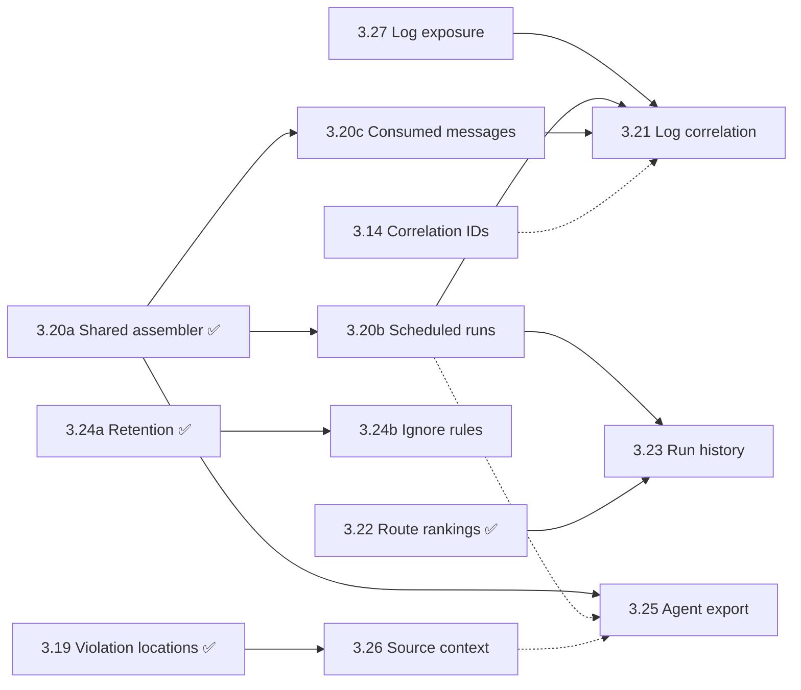

# BootUI Implementation Plan

## 1. Strategy

BootUI adds a safe, local-only developer console to a running application, shipping on **Spring Boot 4 (servlet and
WebFlux starters) and Quarkus (an extension)** from one shared, framework-neutral engine that serves the same Vue UI and
the same `/bootui/api/**` contract on every runtime. The released surface covers 60 panels across runtime introspection,
configuration, databases, services, diagnostics, project health, and developer tooling, and MCP tools and the `bootui`
command-line interface reach the same diagnostics without a browser.

The next workstream deepens diagnostics rather than widening coverage. It shapes evidence BootUI already captures so it
reads the way developers investigate: every entry point anchors a correlated timeline, logs link to the execution that
wrote them, entities read as summary → runs → timeline, and failure evidence outlives routine traffic. Each item builds
on existing capture points and retained evidence, adding only bounded metadata and explicit, on-demand local reads.
Sampling, quotas, remote ingestion, alerting integrations, and personal-data capture stay out of scope, because BootUI
remains local-only, bounded, and network-free on render. Two new service panels follow that workstream (§2).

The priorities for every item below remain unchanged:

1. Safety and local-only operation.
2. Easy installation with no extra setup.
3. Useful runtime explanations.
4. A polished but simple UI.
5. Testable architecture.

Every item, whether a new panel or an enhancement to an existing one, must:

- be **read-only or read-mostly**, with any mutating control explicitly confirmation-gated like the existing Cache
  clear action;
- **fail closed** when its required classes, beans, Actuator endpoints, or data are unavailable, returning stable empty
  DTOs and a clear unavailable reason;
- route any sensitive property names, headers, addresses, or values through the existing masking and value-exposure model;
- ship with backend and edge-case tests, availability wiring, documentation, and browser coverage in sync (§4).

## 2. Roadmap status and order of work

Section numbers are stable identifiers. Code comments and other documents cite them, so a number is never reused or
renumbered, and delivered or dropped items leave gaps. An item is either 📋 Planned, with its full specification in §3,
or ✅ Delivered, condensed into the [delivered](#delivered) table with its behavior documented under `docs/features/`.
The pull request that ships an item moves it to that table.

### Order of work

Work proceeds in waves. Items in one wave are independent of each other, and a wave starts once the items it depends on
have shipped. Each row is one pull request.

| Wave | Item                                            | Panels                                                | Depends on            |
| ---- | ----------------------------------------------- | ----------------------------------------------------- | --------------------- |
| 0    | §3.27 Log exposure policy                       | Log Tail, Dev Services                                | —                     |
| 2    | §3.20b Scheduled-run profiles                   | Live Activity                                         | §3.20a                |
| 2    | §3.20c Consumed-message profiles                | Live Activity                                         | §3.20a                |
| 2    | §3.24b Capture ignore rules                     | HTTP Exchanges, Live Activity, SQL Trace, REST Client | §3.24a                |
| 2    | §3.26 Source context for application frames     | Exceptions                                            | §3.19                 |
| 2    | §3.25 Agent-ready profiles and exception export | Live Activity, Exceptions                             | §3.20a                |
| 2    | §3.14 Correlation-ID filtering                  | Live Activity, HTTP Exchanges                         | —                     |
| 2    | §3.18 Data access map                           | SQL Trace                                             | —                     |
| 3    | §3.23 Scheduled task run history                | Scheduled Tasks                                       | §3.20b, §3.22         |
| 3    | §3.21 Log correlation                           | Log Tail, Live Activity                               | §3.27, §3.20b, §3.20c |
| 4    | §3.6 Declarative HTTP client registry           | New panel (Services)                                  | —                     |
| 4    | §3.8 gRPC                                       | New panel (Services)                                  | —                     |

- **Wave 0** closes a safety gap: log text is the one captured application text that bypasses the value-exposure
  policy. Safety is the first priority, so it ships before anything else.
- **Wave 1** builds the shared pieces that later items reuse: the tiered capture buffer, the generalized profile
  assembler, one percentile helper and slowest-request KPI, and the violation location model with its source locator.
  All of them have shipped, as §3.24a, §3.20a, §3.22, and §3.19, so wave 2 can start.
- **Wave 2** builds directly on wave 1 or improves existing evidence independently. §3.14 lands before §3.21 so log
  correlation can match configured correlation identifiers from the start. §3.25's `get_execution_profile` tool
  follows §3.20b, and its source excerpts follow §3.26, as small follow-up pull requests.
- **Wave 3** joins several earlier items.
- **Wave 4** adds new service panels. Each brings a new optional integration with its own gating and sample coverage,
  so they follow the diagnostics work, which builds on evidence BootUI already captures. They depend neither on earlier
  items nor on each other.

Dashed edges are optional: the later item ships without the earlier one and gains a capability once it lands. A ✅
node has shipped and stays in the graph while items that depend on it remain planned.

### Delivered

| §     | Item                                                                       | Release    | Documentation                                                                        |
| ----- | -------------------------------------------------------------------------- | ---------- | ------------------------------------------------------------------------------------ |
| 3.7   | Fault Tolerance panel                                                      | 1.15.0     | [Fault Tolerance](features/services.md#fault-tolerance)                              |
| 3.10  | WebSockets panel                                                           | 1.15.0     | [WebSockets](features/services.md#websockets)                                        |
| 3.11  | Error-contract catalogue in REST API and Exceptions                        | 1.15.0     | [Declared error contract](features/advisors.md#declared-error-contract)              |
| 3.12  | Slow-SQL ranking and route attribution in SQL Trace                        | 1.15.0     | [SQL Trace rankings](features/database.md#rankings)                                  |
| 3.15  | Meter provenance and explanation in Metrics                                | 1.15.0     | [Metrics](features/runtime.md#metrics)                                               |
| 3.16  | Cache tiering and hit ratios                                               | 1.15.0     | [Tiering and hit ratios](features/services.md#tiering-and-hit-ratios)                |
| —     | Command-line endpoint, `bootui` CLI, and Command Line panel                | 1.16.0     | [Command Line](features/developer-tools.md#command-line), [CLI](CLI.md)              |
| 3.17  | MySQL operational view, tested on Oracle MySQL 8.4 LTS                     | 1.18.0     | [MySQL](features/database.md#mysql)                                                  |
| 3.19  | Structured violation locations in advisor findings                         | Unreleased | [Violation locations](features/advisors.md#violation-locations)                      |
| 3.20a | Shared profile assembler with REST client and cache evidence               | Unreleased | [Per-request profiler](features/overview.md#the-per-request-profiler)                |
| 3.22  | Route performance rankings in HTTP Exchanges                               | Unreleased | [Route rankings](features/diagnostics.md#route-rankings)                             |
| 3.24a | Failure-preserving retention in HTTP Exchanges, SQL Trace, and REST Client | Unreleased | [Failure-preserving retention](features/diagnostics.md#failure-preserving-retention) |

Earlier deliveries were removed from this plan when they shipped; `CHANGELOG.md` records every release. MariaDB support
in the MySQL panel remains an unsupported follow-up outside this roadmap.

### Dropped

- **MongoDB operational view** (formerly §3.5), dropped on 2026-09-30. BootUI plans no MongoDB client, topology,
  database, collection, or index view. The Spring Data panel still lists MongoDB repositories, and Dev Services still
  shows MongoDB service connections.
- **Spring Batch** (formerly §3.9), dropped on 2026-09-30. BootUI plans no Spring Batch job, execution, or step view.

## 3. Feature specifications

Planned items only, in section-number order. §2 gives the order of work, and items with delivery slices ship as
several pull requests.

### 3.6 Declarative HTTP client registry — Services 📋 Planned

BootUI's REST Client panel shows calls that have already happened, but it does not show which HTTP clients the application
declares, how each client resolves its target, or which effective transport policies apply before the first request. This
new panel provides that static and runtime configuration view without making network calls or replacing REST Client trace.

Scope:

- Add one shared HTTP client registry panel and stable `/bootui/api/http-clients/**` contract for Spring servlet, Spring
  WebFlux, and Quarkus.
- Discover Spring `@HttpExchange` interfaces, OpenFeign clients, `RestClient.Builder` beans, and `WebClient.Builder` beans,
  plus Quarkus/MicroProfile `@RegisterRestClient` interfaces and framework-managed client builders.
- Report each client's framework/type, bean or registration name, declared interface where applicable, configured base
  URL, safely resolved base URL after property interpolation, and effective timeout, connection-pool, retry, redirect,
  proxy, and TLS settings when the framework exposes them.
- Show provenance for every effective value so users can distinguish a client-specific override from builder, framework,
  or application defaults. Unknown or inaccessible values must remain explicitly unavailable rather than inferred.
- Cross-link a client to matching retained calls in REST Client trace only when BootUI can attribute them safely. Ambiguous
  builder-derived clients remain unlinked rather than being matched by a guessed host or bean name.
- Support multiple named clients and multiple builders while returning the same stable DTOs and UI on every adapter.

Architecture:

- Put normalization, ordering, provenance, safe URL handling, and report assembly in a JSON-free, framework-neutral engine
  service behind a neutral HTTP client metadata provider SPI.
- Keep Spring HTTP Interface, OpenFeign, MicroProfile REST Client, and Quarkus types in optional, adapter-specific
  providers. Gate each provider on its dependency and native framework capability so applications without that client
  technology do not load its classes.
- Inspect existing registrations, bean definitions, customizers, and framework metadata without instantiating lazy clients,
  replacing application-owned builders, or adding interceptors. Reuse REST Client trace's existing capture path for
  observed-call links.
- Treat client configuration as live policy input where supported. Route displayable URLs and settings through the
  exposure policy, always remove user-info and secret query values, and never serialize credentials, private keys, trust
  material, proxy passwords, or arbitrary customizer state.

Out of scope for the first release:

- Sending test requests, probing target availability, resolving DNS, or validating credentials.
- Capturing request or response bodies, adding a new HTTP interception path, or changing REST Client trace retention.
- Editing client configuration, retry policies, TLS settings, or proxy settings.
- Reconstructing clients created manually outside framework-managed interfaces and builders.
- Guessing effective settings that the framework or underlying client library does not expose safely.

Acceptance criteria:

- Opening the panel performs no network call and does not instantiate a lazy client or mutate an application-owned builder.
- Equivalent Spring servlet, Spring WebFlux, and Quarkus clients produce the same core response shape, with
  adapter-specific unavailable fields represented explicitly.
- Applications without a supported HTTP client technology load normally and show a framework-correct unavailable or empty
  state without optional classloading failures.
- Named clients and builder beans retain distinct identities, and value provenance correctly distinguishes defaults from
  client-specific overrides.
- Base URLs never expose user-info, credentials, secret query values, or TLS/proxy secrets under any exposure mode.
- REST Client trace links appear only for safely attributable calls; ambiguous and unmatched calls do not create false
  relationships.
- Sample applications and fixtures cover absent clients, multiple named clients, unresolved placeholders, masked URLs,
  inherited defaults, client-specific overrides, and ambiguous builder-derived clients without requiring external
  services.

### 3.8 gRPC — Services 📋 Planned

BootUI's Mappings and REST Client panels explain HTTP endpoints and calls, but gRPC services, methods, client channels,
transport security, and call outcomes remain invisible. This panel provides a read-only local registry and aggregate
runtime view for Spring gRPC and Quarkus gRPC without enabling reflection or recording individual calls.

Scope:

- Add one shared `grpc` panel and stable `/bootui/api/grpc/**` contract for Spring servlet, Spring WebFlux, and Quarkus
  when their supported gRPC integration is present.
- Discover registered server services and methods, including full service/method names, method type
  (`UNARY`, `CLIENT_STREAMING`, `SERVER_STREAMING`, or `BIDI_STREAMING`), implementation class, and interceptor chain
  where exposed safely.
- Report server transport configuration including listening address/port, plaintext or TLS state, reflection enablement,
  maximum message limits, keepalive settings, and other bounded framework-exposed values.
- Discover framework-managed outbound client channels and stubs, including registration name, target authority after safe
  normalization, load-balancing policy, plaintext or TLS state, retry enablement, message limits, and interceptors where
  the framework exposes them.
- Show aggregate per-service and per-method call counts, in-progress calls, latency, and gRPC status-code counts from
  existing native observations or metrics. Missing metric families remain explicitly unavailable rather than triggering a
  second instrumentation path.
- Support multiple servers and named client channels while returning the same stable DTOs and UI on every adapter.

Architecture:

- Put DTO assembly, method-type and status normalization, ordering, bounds, identity handling, and aggregate metric joins
  in a JSON-free, framework-neutral engine service behind neutral gRPC metadata and metrics provider SPIs.
- Keep Spring gRPC, `io.grpc`, Micrometer, Quarkus gRPC, and adapter metric types in optional providers. Gate providers on
  their dependencies, beans, and Quarkus capabilities so applications without gRPC cannot load optional classes.
- Read existing local registries, server definitions, managed-channel configuration, observations, and metrics. Do not
  enable server reflection, create channels or stubs, resolve DNS, register a second tracing interceptor, or record
  individual calls.
- Route targets, authorities, interceptor names, and transport settings through the exposure policy. Remove user-info and
  secret parameters, never serialize credentials or TLS key/trust material, and bound method, channel, interceptor, and
  metric cardinality before assembly.

Out of scope for the first release:

- Invoking RPCs, browsing remote reflection data, health-checking services, or testing client connectivity.
- Capturing request/response messages, protobuf payloads, metadata values, individual call histories, or Live Activity
  events.
- Editing channel, server, retry, load-balancing, keepalive, TLS, or reflection configuration.
- Generating clients, rendering arbitrary protobuf message editors, or acting as a gRPC debugging proxy.
- Adding custom call interception solely to synthesize metrics absent from the application's native instrumentation.

Acceptance criteria:

- Opening the panel creates no channel or stub, performs no DNS lookup or RPC, and does not enable reflection or add an
  interceptor.
- Equivalent Spring and Quarkus services, methods, and channels produce the same core response shape, with
  framework-specific unavailable fields represented explicitly.
- Applications without supported gRPC integration load normally and show a framework-correct unavailable state without
  optional classloading failures.
- Unary and all streaming method types are classified correctly, and multiple servers/channels retain distinct stable
  identities.
- Aggregate calls, latency, in-progress work, and status-code counts are joined only from existing native metrics; absent
  or ambiguous series do not create invented values.
- No protobuf payload, metadata value, credential, raw target secret, or TLS key/trust material reaches the response.
- Sample applications and fixtures cover absent gRPC support, unary and streaming services, multiple named channels,
  plaintext and TLS metadata, reflection on/off, metric presence/absence, status-code aggregates, malformed targets, and
  high-cardinality bounds without external services.

### 3.14 Correlation-ID filtering — Live Activity 📋 Planned

Live Activity correlates retained evidence through trace ids, serving threads, and time windows, but many applications also
use business or gateway correlation headers that developers recognize directly. This enhancement captures a bounded,
explicit set of correlation identifiers, makes them filterable across related activity, and permits copying only when
BootUI's value-exposure policy allows it.

Scope:

- Recognize `X-Correlation-ID`, `X-Request-ID`, and `X-Flow-ID` case-insensitively on inbound requests across Spring
  servlet, Spring WebFlux, and Quarkus.
- Allow additional header names through a bounded configuration property. Reject reserved sensitive names such as
  authorization, cookies, proxy credentials, and API-key headers even when configured.
- Capture at most a small fixed number of normalized, length-bounded identifiers per request and propagate their opaque
  lookup identities to child Live Activity entries already correlated with that request.
- Show identifier names and masked values in request details by default. Reveal and enable copy actions only when the live
  value-exposure policy permits the specific value.
- Add exact filter-by-ID input and per-identifier filter actions. Matching must work while values remain masked in the
  response, and must include the owning request plus its correlated child events without broad substring matching.
- Cross-link matching retained entries in Live Activity, HTTP Exchanges, and other panels that already preserve the same
  request/trace relationship; do not add new correlation guesses for unrelated events.

Architecture:

- Put header-name validation, normalization, bounds, opaque lookup identity generation, filtering, and child propagation
  in JSON-free, framework-neutral engine helpers shared by all adapters.
- Extract configured correlation headers at the existing inbound request capture points. Do not add another servlet
  filter, WebFlux filter, Quarkus route filter, or request-body read.
- Keep the bounded raw identifier only where required for exposure-controlled rendering and clipboard use; use a
  one-way-derived lookup identity for matching and child propagation so filtering does not require broadcasting raw values
  in every activity DTO. Derive it with a keyed hash under a per-process random key, so short or sequential identifiers
  cannot be recovered by hashing likely candidates.
- Apply the live exposure and masking policy at response assembly time. Never log identifiers, include them in error
  messages, use them as metric labels, or place them in URLs/query strings generated by BootUI.

Out of scope for the first release:

- Generating, replacing, or propagating correlation headers on behalf of the application.
- Reading identifiers from request/response bodies, cookies, authentication tokens, messaging payloads, or arbitrary
  unconfigured headers.
- Fuzzy, prefix, regular-expression, or case-insensitive value matching.
- Correlating background or messaging activity that does not already share retained request/trace evidence.
- Persisting identifiers beyond existing in-memory retention or exporting them to telemetry systems.

Acceptance criteria:

- The three built-in header names and valid configured names behave identically across Spring servlet, Spring WebFlux, and
  Quarkus, including case-insensitive header-name matching.
- Reserved sensitive header names, invalid names, overlong names/values, and values beyond the per-request cap are rejected
  or visibly truncated according to one canonical policy.
- Values are masked by default; reveal and copy remain unavailable until value exposure permits them, and policy changes
  take effect without restarting capture.
- Exact filtering works from a user-supplied raw value without exposing that value in unrelated response entries, logs,
  metric labels, or BootUI-generated URLs.
- A match returns the owning request and existing correlated children, while unrelated entries with similar or partial
  values remain excluded.
- Capture adds no request-body access, duplicate request filter, propagation behavior, or unbounded identifier
  cardinality.
- Tests cover built-in/custom names, mixed casing, multiple IDs, duplicate headers, reserved/invalid names, empty and
  overlong values, masking and live exposure changes, copy denial/success, exact/non-match filtering, child propagation,
  eviction, and equivalent behavior on all three adapters.

### 3.18 Data access map — SQL Trace 📋 Planned

SQL Trace already attributes retained statements to inbound routes (§3.12), but it answers "which routes spend database
time?" rather than "which routes read or write this table?". This enhancement derives a route-by-table access map from
the same retained evidence, so a developer or agent can ask "who writes `orders`?" or "what does `POST /api/checkout`
touch?" without reading the code. It is the runtime counterpart of a static CRUD matrix: it shows access observed in the
retained window, never a complete inventory of what the code could do.

Scope:

- Add `GET /bootui/api/sql-trace/data-access` to the existing SQL Trace panel on Spring MVC, Spring WebFlux, and
  Quarkus. Keep the existing panel id, route, enablement, read-only policy, capture controls, and retention settings.
- Extract the tables each retained statement references from its normalized, literal-free SQL, and classify every
  reference as a read, insert, update, delete, or merge. `INSERT … SELECT`, `UPDATE … FROM`, `DELETE … USING`,
  `MERGE … USING`, joins, and subqueries report the write target separately from the tables they read. `MERGE` and
  upsert forms (`ON CONFLICT … DO UPDATE`, `ON DUPLICATE KEY UPDATE`) count as merge. `SELECT … FOR UPDATE` and
  `FOR SHARE` stay reads, marked as locking.
- Split `;`-joined batch text into its statements. Exclude `DDL` and `OTHER` statements from the map but count them.
- Report, per table, the routes that read it and the routes that write it, with operation counts, executions, errors,
  summed duration, and a bounded list of distinct application call sites. A statement touching several tables counts
  toward each of them, so per-table totals are labelled as not summing to the window.
- Reuse the §3.12 route attribution unchanged, including the explicit **Unattributed** and **Ambiguous** buckets, so
  background jobs, startup work, and migrations stay visible rather than disappearing from a table's writers.
- Label a table with its mapped JPA entity only when exactly one entity declares that exact name through an explicit
  `@Table`, using the shared metamodel reader the Hibernate and Database advisors already use. Tables mapped through the
  default naming strategy stay unlabelled rather than guessed.
- Mark each statement's extraction as `COMPLETE` when every table reference was resolved, `PARTIAL` when some constructs
  were not understood, or `UNRESOLVED` when no reliable reference could be read: procedure calls, truncated SQL, or
  unsupported vendor syntax. Unresolved statements stay visible in their own bucket with counts and deep links.
- Filter server-side by exact table name, route id, and read or write access, so "who writes `orders`?" is one request.
- Open on a **By table** view with the search field first, and offer a **Matrix** view of routes by tables. Cells pair
  letters (`R`, `C`, `U`, `D`, `M`) with accessible text so meaning never relies on color alone, and deep-link into the
  filtered execution list exactly as the existing rankings do.
- Expose the report through a read-only `get_sql_data_access` MCP tool and generated `bootui sql data-access` command,
  so an agent can check which routes a table change affects. The tool reuses the existing `QUERY_LIMIT` schema, with
  `query` as the exact table name and `limit` bounding the tables returned. Route and access filters stay REST and UI
  only in the first release, because a new `McpToolSchema` needs CLI binding changes and older published `bootui`
  binaries could not pass the new arguments.

Architecture:

- Put table extraction, access classification, aggregation, bounds, and entity labelling in JSON-free, framework-neutral
  engine services beside `SqlTraceInsightsService`. Adapters supply only the request evidence, correlation tiers, and
  route templates they already supply for insights.
- Build a small reference scanner over `SqlStatementNormalizer` output, in the same dependency-free lexical style. Add
  no SQL grammar dependency and no dialect-specific parser, and never fail on unknown syntax.
- Never report a CTE name, derived table, table-valued function, or alias as a table. Quoted identifiers keep their
  case while unquoted ones fold for grouping. A schema-qualified name is never merged with an unqualified one, because
  the connection's default schema is unknown.
- Share one per-execution attribution decision between the insights report and the map by exposing
  `SqlRouteAttribution`'s internal match result inside the engine. Both reports then reconcile exactly, instead of
  re-deriving attribution from the bounded `entryIds`.
- Reach the metamodel reader only through the existing optional Hibernate/JPA gates. Without Hibernate the map works
  identically, just without entity labels, and loads no optional class.
- Bound tables, routes per table, cells, call sites, and unresolved statements before serialization, with visible
  truncation counts. Route templates, masked paths, and call sites follow the existing SQL Trace privacy rules; no SQL
  literal, bound parameter, query string, or path-parameter value reaches the report.
- Map the new tool in the MCP catalog and `CliCommandPaths` under the SQL Trace panel's policy, and regenerate
  `bootui-tools.json`.

Out of scope for the first release:

- Static analysis of repositories, entities, or source code to predict access that did not run in the window.
- Resolving default naming-strategy table names or reading Hibernate-internal persister metadata. The engine keeps to
  the standard JPA metamodel, as the Database advisor does.
- Distinguishing views from tables, and following writes made by triggers, stored procedures, or cascading foreign keys.
- Telling same-named tables in separate datasources apart, because SQL Trace executions do not carry their datasource.
  The report states this whenever more than one datasource is traced.
- R2DBC and any other non-JDBC access, which SQL Trace does not capture.
- Column-level lineage, query plans, index advice, or advisor rules derived from the map.
- Persisting the map beyond the SQL Trace retention window.

Acceptance criteria:

- Opening the map runs no query, opens no connection, adds no JDBC interception or request capture, and reads only the
  retained SQL Trace buffer.
- Equivalent evidence produces the same DTOs on Spring MVC, Spring WebFlux, and Quarkus. WebFlux without request trace
  context still reports tables and call sites, with route rows unavailable and the reason stated, as in §3.12.
- Per-table and per-route counts reconcile with the retained window and with the insights attribution, including the
  unattributed and ambiguous buckets, `DDL` and `OTHER` exclusions, and unresolved statements.
- Extraction fixtures cover Hibernate-generated SQL with aliases, joins, and subqueries; `INSERT … SELECT`,
  `UPDATE … FROM`, `DELETE … USING`, `MERGE`, and upserts; CTEs, including data-modifying CTEs; `FOR UPDATE`; quoted and
  schema-qualified identifiers; batches; truncated statements; procedure calls; and unknown vendor syntax. No fixture
  reports a CTE, alias, or function as a table.
- Entity labels appear only for unique explicit `@Table` matches, and their absence causes no failure when Hibernate is
  not on the classpath.
- High-cardinality applications stay bounded, with deterministic ordering and visible truncation.
- `BootUiApiContractCatalog`, conformance, the MCP catalog and regenerated `bootui-tools.json`,
  `docs/features/database.md`, `docs/CLI.md`, `docs/AI-AGENTS.md`, `docs/SPECIFICATION.md`, `skills/bootui/SKILL.md`,
  frontend unit tests, and the Spring MVC, Spring WebFlux, and Quarkus browser suites cover the new view.

### 3.20 Execution-context profiles — Live Activity 📋 Planned

The per-request profiler (`GET /bootui/api/activity/request/{id}`, `RequestProfileDto`) explains what one HTTP request
did, but work that starts anywhere else has no equivalent. A `SCHEDULED` entry is top-level, and only an unowned
exception nests under it, through a serving-thread and time-window join. Consumed Kafka, RabbitMQ, and JMS entries are
always top-level. The profiler itself still omits scheduled runs; REST client calls and cache accesses joined it in
§3.20a.
`ScheduledTaskRunStore` retains the executing thread but no trace id, and consumed-message records retain neither a
thread, a start time, nor a trace id. This enhancement treats a scheduled execution and a consumed-message listener
invocation as execution contexts in their own right, with the same drill-down as a request and the same honesty about
how each link was established.

Scope:

- Treat `SCHEDULED` executions and consumed `MESSAGING` deliveries (Kafka and RabbitMQ on every adapter, JMS on Spring)
  as profileable anchors beside `REQUEST` entries, and set `profileable` on them.
- Add `GET /bootui/api/activity/execution/{id}` beside the request profiler. It returns the anchor summary plus
  correlated SQL, SQL groups with N+1 flags and call sites, exceptions, REST client calls, cache accesses, message
  sends, the distributed trace when one matched, a timing breakdown, and notes.
- Add nested scheduled-run evidence to the request profile and to **Copy profile**, beside the REST client and cache
  evidence §3.20a added.
- Nest correlated children under a `SCHEDULED` or consumed `MESSAGING` anchor through the existing `parentId`. Work that
  cannot be placed precisely stays top-level.
- Record, at the existing capture points only, the trace id active during a scheduled execution, and the start time,
  executing thread, and active trace id of a consumed-message listener invocation, whenever the framework exposes them.
- Label every correlation with its tier (`TRACE_ID`, `SERVING_THREAD`, or `TIME_WINDOW`), and mark a profile approximate
  whenever a weaker tier was used.

Architecture:

- Put anchor selection, tiered correlation, child ordering, timing, N+1 reuse, and notes in one framework-neutral engine
  assembler instead of growing Spring's `LiveActivityCorrelator` separately. §3.20a shipped it as
  `ExecutionProfileAssembler`, which every adapter now uses for request profiles: a later anchor type adds a
  `ProfileAnchor.Type`, its window, and a DTO projection, and reuses the tiers, bounds, and notes. HTTP anchors keep
  today's tiers and keys, including Spring MVC's method, path, and window gate for exceptions; the at-most-one rule now
  applies to them too, so a signal two captured requests could equally claim is counted in the notes instead of
  appearing in both profiles.
- Correlate by trace id first on every adapter. A trace id attaches a child only when exactly one anchor of any type
  carries that trace and its window contains the child, extending `TraceCorrelationIndex`'s uniqueness guard across
  anchor types, because a request and the message or execution it triggers can share one trace. §3.20a shipped this
  guard; an HTTP request's trace window stays open, as it always was, so a request still claims traced work it caused
  after its response completed, while `SCHEDULED` and `MESSAGING` anchors bound it to their recorded window. For
  blocking scheduled methods and listener invocations that run to completion on one thread, allow serving-thread
  correlation within the recorded window, under the unique-candidate rule SQL route attribution already uses. Allow
  time-window correlation only as a labelled last resort.
- Extend `ScheduledTaskRunStore.Run` and the Kafka, RabbitMQ, and JMS consumed-record shapes with nullable trace-id,
  thread, and start fields, supplied by `ScheduledTaskRunObservationHandler`, `QuarkusScheduledTaskRunRecorder`, and the
  existing consumer capture hooks. Add no interceptor, proxy, or executor wrapper.
- On Quarkus, a scheduled run is recorded from `SuccessfulExecution` and `FailedExecution` events with the trigger's
  fire time as its start, so its window is approximate. SmallRye Reactive Messaging interceptors are asynchronous, so
  consumed messages correlate by trace id only. Use thread and window tiers on Quarkus only where the recorder can prove
  them.
- A message send nests under its request or execution only when it was recorded with that anchor's trace id.
- Keep `GET /bootui/api/activity/request/{id}` and `RequestProfileDto` backward compatible: new request-profile sections
  are additive and nullable.
- Route every child through its source panel's masking, exposure, and self-filtering, and bound each child list with a
  visible truncation count.

Out of scope for the first release:

- `@Async`, `TaskExecutor`, `CompletableFuture`, `ApplicationRunner`, and `CommandLineRunner` capture. It needs executor
  instrumentation that composes with the application's own `TaskDecorator`, and is a candidate follow-up.
- Treating message sends, cache accesses, or REST client calls as anchors.
- Linking a consumed message to the request that produced it in another process, beyond an existing shared trace id.
- Capturing message payloads, message headers, or task arguments.
- Retaining profiles beyond existing buffer and optional activity-persistence retention.

Acceptance criteria:

- Opening an execution profile performs no capture, network call, or mutation.
- Equivalent evidence produces the same execution-profile DTO on Spring MVC, Spring WebFlux, and Quarkus, and a tier an
  adapter cannot provide is reported as unavailable rather than inferred.
- A child attaches to at most one anchor. Ambiguous trace, thread, or window matches stay top-level and are counted in
  the notes.
- A failed scheduled run still nests its exception exactly as it does today, now alongside the rest of its evidence.
- REST client, cache, and scheduled evidence appear, already masked, in request profiles, execution profiles, and
  **Copy profile**.
- Records without the new fields, and runs whose framework exposes no thread or trace id, degrade to top-level entries
  with a clear note.
- Fixtures cover scheduled runs with and without trace ids, overlapping runs of one task, concurrent listener
  invocations, a request and a consumed message sharing one trace, consumed and sent messages, Quarkus fire-time
  windows, masked children, truncation, and all three adapters.

Delivery slices, each one pull request with its own tests and documentation:

- ✅ **§3.20a Shared profile assembler.** Delivered: `ExecutionProfileAssembler` replaced `RequestProfileAssembler`
  and the tiering inside Spring MVC's `LiveActivityCorrelator`, with the cross-anchor trace-uniqueness guard, per-section
  tier labels, bounds, and ambiguity counts, and REST client and cache evidence in request profiles and **Copy
  profile**. It added no anchor. See [the per-request profiler](features/overview.md#the-per-request-profiler).
- **§3.20b Scheduled-run profiles.** Add the trace-id field to `ScheduledTaskRunStore.Run`, serve
  `GET /bootui/api/activity/execution/{id}` for `SCHEDULED` anchors, nest their children, add nested scheduled-run
  evidence to request profiles, and report Quarkus fire-time windows as approximate.
- **§3.20c Consumed-message profiles.** Add the start, thread, and trace-id fields to the Kafka, RabbitMQ, and JMS
  consumed records, extend the execution endpoint to consumed `MESSAGING` anchors, and nest message sends by trace id.

### 3.21 Log correlation — Log Tail and Live Activity 📋 Planned

Log Tail captures log lines through `BootUiLogAppender`, a Logback appender, on Spring and through
`QuarkusLogTailHandler`, a root `java.util.logging` handler, on Quarkus, both into the shared `LogTailBuffer`. Each
`LogLineDto` carries only a timestamp, level, logger, message, and thread. A log line therefore cannot be tied to the
request or execution that wrote it, and a warning never appears in Live Activity next to the SQL and exceptions it
explains. This enhancement stamps log lines with correlation evidence at capture time and surfaces warnings and errors
as a Live Activity signal. It builds on §3.27, which applies the exposure policy to log messages, and on §3.20's
execution anchors.

Scope:

- Add a nullable `traceId` and a bounded `context` map to `LogLineDto`. On Spring the values come from the Logback
  event's MDC. On Quarkus they come from the active OpenTelemetry context and the log record's MDC when the log manager
  provides one.
- Copy context only for the trace and span ids and for MDC keys explicitly configured through
  `bootui.log-tail.context-keys`. Cap the key count and key and value lengths, and reject secret-looking key names even
  when configured.
- Never copy §3.14 correlation identifiers automatically. When §3.14 lands, a configured key that holds one is matched
  through §3.14's one-way lookup identity, and its raw value is shown only where §3.14's exposure rules allow it.
- Add server-side filters to `GET /bootui/api/log-tail/recent` for minimum level, logger prefix, trace id, and text. The
  SSE stream only gains the new fields. `get_log_tail` keeps its `NONE` schema, so the filters are REST and UI only.
- Add a `LOG` signal to Live Activity for `WARN` and above, with the threshold set by `bootui.activity.log-level`,
  bound on every adapter. Nest it under its request or execution by trace id, then by serving thread within the request
  window on Spring MVC.
- Include correlated log lines in request and execution profiles (§3.20), and link each Log Tail row that has a trace id
  to its profile and Traces entry.
- Apply §3.27's exposure rule to context values, and to log messages wherever they newly appear: Live Activity, request
  and execution profiles, and **Copy profile**. `METADATA_ONLY` omits context values as well as messages.

Architecture:

- Keep the capture adapters thin. `BootUiLogAppender` and `QuarkusLogTailHandler` copy only allowlisted keys and a trace
  id into a neutral record, and the engine owns bounds, filtering, and activity mapping, reusing §3.27's read path for
  masking.
- Link a log line that carries a throwable to the exception it produced through a per-event identity shared at capture
  time by the Log Tail and exception log handlers (`BootUiLogAppender` and `BootUiExceptionLogAppender` on Spring,
  `QuarkusLogTailHandler` and `QuarkusExceptionLogHandler` on Quarkus). The log record keeps the exception-group id the
  exception store assigned, so Live Activity shows the event once, as `EXCEPTION`, with the log line attached. Never
  de-duplicate by trace, thread, or time. With the Exceptions panel disabled, the line stays a `LOG` entry.
- Keep excluding BootUI's own loggers, and keep capture fail-open: a failure reading the MDC or trace context records
  the line without correlation.

Out of scope for the first release:

- Capturing arbitrary MDC keys, structured-logging arguments, or marker payloads.
- Reading log files, other appenders, or remote log stores.
- Log grouping, pattern mining, or alerting.
- Extracting correlation identifiers from requests, which §3.14 owns. This item only reads what the application already
  placed in the MDC.
- Log4j2 capture on Spring.

Acceptance criteria:

- A line logged on a request's thread carries that request's trace id and nests under it wherever tracing is active. On
  Spring MVC the serving-thread tier works without tracing.
- Keys outside the allowlist never reach the buffer, secret-looking key names are rejected even when configured, and no
  correlation identifier is copied without explicit configuration.
- Context values, and messages in Live Activity and profiles, honor `MASKED`, `METADATA_ONLY`, and `FULL` exactly as
  Log Tail does under §3.27, and a live exposure change applies without a restart.
- `LOG` entries respect the configured threshold and the Live Activity cap, and disabling Log Tail removes the signal.
- An error logged with a throwable does not produce duplicate activity entries.
- Existing Log Tail clients keep working, because the new DTO fields are additive and nullable.
- Fixtures cover present and absent MDC, WebFlux context hops, Quarkus OpenTelemetry, every exposure mode, oversized
  values, allowlist rejection, de-duplication, filters, and all three adapters.

### 3.23 Scheduled task run history — Scheduled Tasks 📋 Planned

The Scheduled Tasks panel lists task definitions only (`ScheduledTaskDto`: runnable, trigger type, expression, initial
delay, and time unit). Every completed `@Scheduled` method execution is already retained in `ScheduledTaskRunStore` to
feed Live Activity, but the panel never shows that evidence, so "is this task failing, and how slow is it?" means
scanning the activity feed. This enhancement joins retained runs to their definitions.

Scope:

- Per task: retained run count, failure count, average, p95, and maximum duration, last run time and outcome, and the
  last failure's exception class and exposure-governed message.
- The next scheduled execution when the framework exposes it, and an explicit unavailable state when it does not.
- A per-task drill-down of recent runs, newest first, each linking to its execution profile (§3.20b) or Live Activity
  entry.
- An explicit **Unmatched runs** group for runs whose identifier matches no listed definition, instead of dropping them.
- Filters for task name, outcome, and slow runs. The slow threshold is a new
  `bootui.activity.scheduled-task-slow-threshold-ms`, bound on every adapter beside
  `bootui.activity.max-scheduled-task-runs`. It also drives the `SLOW` severity of `SCHEDULED` entries, which today use
  the request threshold `bootui.activity.request-slow-threshold-ms` (1,000 ms by default) on every adapter. A dedicated,
  documented default replaces it for scheduled runs.
- The evidence window: retained runs, `bootui.activity.max-scheduled-task-runs`, and evictions.
- Extend `get_scheduled_tasks` and `bootui scheduled` with the run summary.

Architecture:

- Join in a framework-neutral engine service over `ScheduledTasksService` definitions and `ScheduledTaskRunStore` runs,
  keyed by the runnable identifier both already share. Reuse the shared percentile helper from §3.22.
- Keep the DTO change additive: each definition gains a nullable run summary, and the report gains the window and
  unmatched runs.
- Apply the shared exposure helper from §3.27, the same rule Exceptions uses, to failure messages.

Out of scope for the first release:

- Triggering, pausing, or rescheduling tasks.
- Retaining runs beyond the existing buffer and optional activity persistence.
- Observing manually registered `Runnable` or `Trigger` tasks that no hook captures today.
- Detecting missed or overlapping runs.

Acceptance criteria:

- Opening the panel never invokes a task, and summaries reconcile with the retained runs.
- Spring MVC, Spring WebFlux, and Quarkus return the same shapes for equivalent runs, with next execution null and a
  reason where the framework does not expose it, and classify slow runs with the same threshold.
- Failure messages honor the exposure policy.
- A task with no retained run reads **No runs in window** rather than showing zero-duration statistics.
- Fixtures cover successes, failures, slow runs, eviction, unmatched runs, overlapping runs, missing next-execution
  support, and all three adapters.

### 3.24 Failure-preserving retention and ignore rules — Diagnostics 📋 Planned

Slice §3.24a shipped failure-preserving retention (see [Delivered](#delivered) and
[Failure-preserving retention](features/diagnostics.md#failure-preserving-retention)). Every BootUI-owned HTTP
exchange, SQL Trace, and REST Client buffer now runs on the engine's `TieredCaptureBuffer`, which reserves a share of
its capacity for failed and slow records. On Spring, BootUI's own `BootUiHttpExchangeRepository` replaces the
in-memory fallback, BootUI's recording filter keeps BootUI's own requests out of it while
`bootui.monitoring.exclude-self` is on, as Quarkus already did, and retention reads as application-managed when the
application provides its own repository or recording filter. BootUI's own requests are dropped in its recording filter
rather than on `add`, because only the request, not the recorded absolute URL, knows the path below the context
path. Each report carries a
`retention` object with the retained, reserved, and evicted counts, and `bootui.activity.request-slow-threshold-ms`
classifies slow exchanges on every adapter.

No setting yet excludes routine application traffic such as health probes or polling endpoints, which still takes
routine slots from the rest of the application's requests. The remaining slice, §3.24b, lets developers drop that
noise at capture time.

Scope:

- Add `bootui.monitoring.ignore-paths`, a list of path patterns whose requests are not captured as exchanges, Live
  Activity requests, route rankings, or route attribution. It is empty by default. A 5xx on an ignored path is still
  captured, and Exceptions capture is never affected.
- Define one pattern grammar for every adapter: path-only patterns anchored at `/`, matched case-sensitively against
  the decoded, normalized request path below the context path, never the query string, where `*` matches within one
  segment and `**` matches any number of segments. An invalid pattern is reported in the panel and matches nothing.
- Keep SQL and REST client work done while serving an ignored request out of **Unattributed**. For each ignored
  request, retain only its correlation evidence — trace id, serving thread, time window, and matched pattern, never the
  exchange — in a bounded buffer, so route attribution reports that work in an explicit **Ignored routes** bucket.
- Apply ignore rules at capture time only where BootUI owns recording: Quarkus exchanges and Spring exchanges recorded
  by BootUI's repository and filter. When the application provides its own `HttpExchangeRepository` or
  `HttpExchangesFilter`, BootUI keeps its current back-off and applies ignore rules at read time only.

Architecture:

- Own the pattern matcher in the engine beside the self-path check, and consult it at the existing capture points:
  BootUI's recording filters on Spring (`BootUiHttpExchangesFilter` and `BootUiHttpExchangesWebFilter`), which already
  drop self paths below the context path, and the Vert.x capture filter on Quarkus.
- Record the correlation evidence of ignored requests in a bounded engine buffer that SQL Trace route attribution
  reads beside the retained exchanges.

Out of scope for the first release:

- Sampling or other probabilistic capture. BootUI stays deterministic.
- Changing the retention of an application-provided `HttpExchangeRepository` or replacing its `HttpExchangesFilter`.
- Raising default memory budgets.
- Ignore rules for SQL statements or outbound hosts.

Acceptance criteria:

- Ignored paths produce no exchange, Live Activity request, or route-ranking entry, while a 5xx on an ignored path is
  still captured. The same pattern matches the same paths on every adapter, and an invalid pattern matches nothing.
- SQL and REST client work done while serving an ignored request appears under **Ignored routes**, never under
  **Unattributed** or another route.
- An application-provided repository or filter is never replaced, and ignore rules apply to it at read time.
- Ignored requests take no slot in the failure-preserving buffers, and the retained, reserved, and evicted counts still
  reconcile with the buffer contents.
- Tests cover valid and invalid patterns, ignored-route attribution, the interaction with the self filter and the
  reserved share, application-provided repositories and filters, and all three adapters.

Delivery slices, each one pull request with its own tests and documentation:

- ✅ **§3.24a Failure-preserving retention.** Delivered: the tiered engine buffer, the BootUI-owned Spring
  `HttpExchangeRepository` that keeps BootUI's own requests out of application slots, the request slow threshold on
  every adapter, and the retained, reserved, and evicted counts.
- **§3.24b Capture ignore rules.** `bootui.monitoring.ignore-paths`, the shared pattern grammar and matcher, capture-time
  dropping where BootUI owns recording, read-time filtering for application-provided repositories, and the
  **Ignored routes** attribution bucket.

### 3.25 Agent-ready profiles and exception export — Developer tools 📋 Planned

The MCP server and CLI expose `get_live_activity`, `get_exceptions`, and `get_exception_detail`, but no tool returns a
request profile. An agent can see that a request was slow, but not its SQL, N+1 groups, or call sites. In the browser,
**Copy profile** exports a plain-text timeline, while the Exceptions panel has no copy action. This enhancement adds the
missing tools and one consistent, already-masked Markdown export that a developer can paste into an agent.

Scope:

- Add a read-only `get_request_profile` MCP tool that takes an activity entry id and returns the same
  `RequestProfileDto` as `GET /bootui/api/activity/request/{id}`, exposed as `bootui request-profile <id>`.
- Once §3.20b lands, add `get_execution_profile`, exposed as `bootui execution-profile <id>`.
- Keep both commands at the top level: `bootui activity` is already the `get_live_activity` command, and a CLI path may
  not be both a command and the parent of another.
- Add an additive `exceptionGroupId` to `RequestProfileExceptionDto`, so a profile can reach each exception's detail.
- Add **Copy for AI** to the Exceptions detail and the profiler drawer. It produces one Markdown document with the
  summary, exception type and exposure-governed message, the cause chain with application frames marked, recent
  occurrences with request context, correlated normalized SQL with N+1 call sites, and, once §3.26 lands, source
  excerpts.
- Render **Copy profile** through the same Markdown helper.
- Show the full document before copying, as **Copy as cURL** does, and list what was omitted, such as masked values or
  truncated sections. Preparing the preview loads the referenced exception details, and later source excerpts, through
  existing read endpoints. The copy itself sends nothing.

Architecture:

- Register the tools in `McpToolCatalog` under the `ACTIVITY` panel with `McpToolSchema.ID`, as read tools on every
  stack. Describe them in `McpToolDescriptions`, and regenerate `bootui-cli/src/main/resources/bootui-tools.json`. An
  unknown or evicted id returns the same unavailable profile, with its reason, that the REST endpoint returns.
- Build the Markdown in one shared frontend helper from DTOs the browser already holds or loads through existing read
  endpoints, so the export never contains anything the panels do not show, and identical DTOs produce identical text on
  every adapter. Fence code and SQL, and escape Markdown in captured strings.
- Document the investigation workflow — list activity, pick a profileable id, fetch its profile — in
  `docs/AI-AGENTS.md`, `docs/CLI.md`, and `skills/bootui/SKILL.md`.

Out of scope for the first release:

- Sending anything to an AI provider or other external service. Export is clipboard-only, and the tools are read-only.
- Issue assignment or comments beyond the existing exception triage status.
- AI-generated summaries inside BootUI.
- Markdown rendering in the CLI or on the server.

Acceptance criteria:

- `get_request_profile` returns the same masked DTO as the REST endpoint on all three adapters, including the
  unavailable profile for an unknown or evicted id, and is unavailable when Live Activity is disabled.
- The regenerated CLI manifest includes the new commands and passes `ToolManifestGeneratorTests`.
- Preparing a preview uses only existing read endpoints, and the copy itself sends no request and changes no state. The
  preview matches the clipboard exactly, and the text stays selectable when clipboard access is denied.
- The export never contains a value the panel masked, and honors `METADATA_ONLY`.
- Markdown in captured messages, paths, or SQL cannot break the document structure.
- Tests cover profiles with and without SQL, N+1 groups, truncated sections, unknown ids, masked values, cause chains,
  and identical output across adapters.

### 3.26 Source context for application frames — Exceptions 📋 Planned

Exception frames carry a class, method, file, and line, and `ExceptionStore` marks application frames using the detected
application packages. The developer still has to find each file by hand. BootUI runs beside the source it diagnoses, so
it can show a few lines around each application frame and open the file in the IDE. This enhancement adds both,
fail-closed, and applies to exception frames the location model and **Open in** preference that §3.19 introduces for
advisor findings.

Scope:

- For application frames only, show a short excerpt around the failing line, read from the local source tree, in the
  Exceptions detail, the profilers, and **Copy for AI**.
- Link each application frame through the per-browser **Open in** preference from §3.19. It is off by default, offers
  only the VS Code and IntelliJ IDEA presets with their fixed URL schemes, and accepts no custom template or web URL.
  **Copy location** works without it.
- Resolve a frame to exactly one file through §3.19's lookup. Never search the disk.
- Allow the feature to be turned off with `bootui.exceptions.source-context.enabled`.

Architecture:

- Reuse the Architecture advisor's bounded module and source-set lookup that §3.19 reuses. It maps a class compiled
  into a local Maven or Gradle output directory to its module's sources, which covers multi-module projects launched
  from the reactor root. Share one engine locator between the two features rather than adding a second one: §3.19
  shipped it as `SourceLocator` in the engine's `source` package, together with `LocalSourceModule`.
- Run the lookup only when the user opens an exception group or prepares an export. Classes read from archives,
  ambiguous matches, exhausted lookup budgets, native images, and Quarkus `lib` layouts keep no path and report the
  reason.
- Read only the one resolved regular `.java` or `.kt` file, refuse symlinks, cap the file size, and cache bounded
  excerpts.
- Serve excerpts from a separate read endpoint for one exception group, called only when the user opens that group or
  prepares an export, so rendering the list reads no files.
- Apply the exposure policy to excerpts. Pattern-based secret detection cannot recognize every credential in source, so
  `MASKED` lexes the whole file and replaces the contents of every string, character, and text-block literal and every
  comment with a placeholder, omitting the excerpt when the file cannot be lexed. `METADATA_ONLY` omits excerpts, and
  only `FULL` shows source verbatim. As in §3.19, the source path and location themselves are application metadata, not
  exposure-gated values, so the **Open in** link stays available in every mode.

Out of scope for the first release:

- Editing source, applying fixes, or writing files.
- Excerpts for dependency or JDK frames, decompiled classes, or source jars.
- Git blame, history, or ownership.
- Mapping sources for remote or containerized applications.

Acceptance criteria:

- No file is read to render the exception list.
- Symlinks, ambiguous or missing files, non-source files, and oversized files are refused with a per-frame reason.
- A packaged jar, native image, or unresolved class location disables the excerpt with a reason while the frame stays
  readable.
- Under `MASKED`, no literal or comment content reaches the browser; excerpts are omitted under `METADATA_ONLY`; and a
  live exposure change applies without a restart.
- Out-of-range line numbers and generated, lambda, or synthetic frames produce no excerpt rather than a wrong one.
- The **Open in** links match §3.19's behavior exactly, and open the correct file and line.
- Tests cover Maven and Gradle layouts, Kotlin sources, multi-module projects launched from the reactor root, archive
  classes, and availability on all three adapters. Masking fixtures cover Java text blocks and unicode escapes, and
  Kotlin raw strings, string templates, and nested block comments.

### 3.27 Log exposure policy — Log Tail and Dev Services 📋 Planned

Log text is the one captured application text that bypasses BootUI's value-exposure policy. The Exceptions panel scrubs
secret-like `key=value` assignments from exception messages under the default `MASKED` mode, omits them under
`METADATA_ONLY`, and shows them verbatim only under `FULL`. Log Tail returns `LogLineDto.message` exactly as captured on
every surface — `GET /bootui/api/log-tail/recent`, the SSE stream, `get_log_tail`, and `bootui logs tail` — so a line
that logs a password assignment is shown in full under the default mode. Spring's Dev Services container logs
(`GET /bootui/api/dev-services/{id}/logs`) are returned the same way. This item closes the gap on its own, ahead of the
rest of the plan, and §3.21 builds on it.

Scope:

- Apply the exception-message exposure rule to Log Tail messages on every surface: the recent snapshot, the SSE stream
  including its replayed backlog, `get_log_tail`, and the CLI. `MASKED` scrubs secret-like assignments, `METADATA_ONLY`
  omits the message while keeping timestamp, level, logger, and thread, and `FULL` shows it verbatim.
- Apply the same rule to Dev Services container log text on Spring MVC and Spring WebFlux. Quarkus serves no container
  logs and keeps its current `409` response.
- Evaluate the policy at read time, so a live exposure change applies to retained lines and open streams without a
  restart, and capture cost stays unchanged.
- Show in the Log Tail panel when messages are omitted by policy, so an omitted message never reads as an empty line.

Architecture:

- Move the secret-assignment pattern out of `ExceptionsService` into one engine helper shared by Exceptions, Log Tail,
  and Dev Services, so the three surfaces mask identically and a pattern fix reaches all of them.
- Keep `LogTailBuffer` as raw bounded storage. Map each line through the helper in one engine read path that Spring
  MVC's `LogTailController`, WebFlux's `ReactiveLogTailController`, and Quarkus's `LogTailResource` call for snapshots
  and streamed lines alike. The MCP tools and the CLI already read through those adapters, so they inherit the rule.
- `LogLineDto.message` becomes nullable, as exception messages already are. The Vue panel's rendering and severity
  filter handle a missing message.

Out of scope for the first release:

- Detecting secrets beyond the shared assignment pattern, such as bare tokens or credentials embedded in connection
  strings. Improvements belong in the shared helper and reach every surface at once.
- Masking at capture time, or changing what the Logback appender and the Quarkus log handler capture.
- MDC values, structured arguments, and correlation, which §3.21 owns.

Acceptance criteria:

- Under `MASKED`, no password, token, or API-key assignment in a logged message reaches any Log Tail or Dev Services
  response on Spring MVC, Spring WebFlux, or Quarkus, including the SSE backlog, `get_log_tail`, and `bootui logs tail`.
- Under `METADATA_ONLY`, no message text is returned and the panel says why. Under `FULL`, messages are verbatim.
- Changing `bootui.expose-values` at runtime changes the next snapshot and the next streamed line without a restart.
- Exceptions output is unchanged after the pattern moves into the shared helper.
- Tests cover every exposure mode, `bootui.mask-secrets=false`, null and multi-line messages, the SSE backlog and live
  lines, MCP and CLI output, and all three adapters.

## 4. Cross-cutting work

Most planned items extend existing panels; only §3.6 and §3.8 add panels. Consistency tests enforce much of the
lists below, so a missed step fails the build rather than drifting silently.

### Every item

- Put policy, bounds, ordering, and assembly in the framework-neutral engine. Keep the Spring MVC, Spring WebFlux, and
  Quarkus adapters thin, and keep optional framework or driver types in gated adapter classes.
- Keep `bootui-core` DTO changes additive and nullable, so older browsers, MCP clients, and published `bootui` binaries
  keep working. Update the panel's `BootUiApiContractCatalog` entry to its real DTO fields;
  `availablePanelsMatchTheirDtoFamilyContracts` fails when the declared shape drifts.
- Route every displayed value through the live `ExposurePolicy` and `SecretMasker`, and bound every list with a visible
  truncation count.
- Bind new properties on every adapter where the capability exists — Spring's `BootUiProperties` and the Quarkus
  `BootUiEngineProducer` configuration lookups — and document them in `docs/PROPERTIES.md`, including its
  framework-specific table when a stack lacks one. A plain-integer millisecond threshold takes the suffix its namespace
  already uses: `-ms` under `bootui.activity.*`, and `-millis` under `bootui.sql-trace.*`, `bootui.rest-client-trace.*`,
  and `bootui.transactions.*`. A new namespace uses `-millis`, the majority form.
- Move a new or changed MCP tool in lockstep: `McpToolCatalog` and `McpToolDescriptions`, the Spring MVC
  `BootUiMcpTools`, WebFlux `ReactiveBootUiMcpTools`, and Quarkus `QuarkusMcpTools`, a `CliCommandPaths` entry, the
  regenerated `bootui-cli/src/main/resources/bootui-tools.json`, the tool lists in `docs/AI-AGENTS.md`,
  `docs/features/developer-tools.md`, and `docs/SPECIFICATION.md`, plus `docs/CLI.md` and `skills/bootui/SKILL.md`.
  `ToolManifestGeneratorTests` and `mcpToolCatalogIsDocumentedInEveryCanonicalToolList` enforce most of this.
- Reuse an existing `McpToolSchema`: `NONE`, `LIMIT`, `QUERY_LIMIT`, `ID`, or `RULE_VIOLATIONS`. The published CLI binds
  options by schema name, so a new schema needs `ToolManifest` and `CommandTree` changes, and older `bootui` binaries
  cannot pass its arguments. An item that needs one says so in its specification.
- Choose CLI command paths that are unique and never a prefix of another path. `bootui activity`, for example, is
  already a command, so it cannot also be the parent of `bootui activity profile`.
- Update `docs/features/`, the relevant `docs/SPECIFICATION.md` section, `docs/WEBFLUX-SUPPORT.md` and
  `docs/QUARKUS-SUPPORT.md` where stack behavior differs, and the matching `docs/*-CHECKS.md` for any advisor change.
- Cover the change with engine and adapter tests, conformance, frontend unit tests, and the Spring MVC, Spring WebFlux,
  and Quarkus browser suites.

### Adding a panel

In addition:

- Register the panel in `BootUiPanels` — id, title, action capability, and API prefix — and in the conformance manifests
  `expected-panels-spring.json`, `expected-panels-webflux.json`, and `expected-panels-quarkus.json`, in catalog order.
  `BackendPanelCatalogConsistencyTest` fails when they disagree.
- Wire `/bootui/api/panels` availability in Spring's `PanelsController` and Quarkus's `PanelsResource`, plus any
  build-time capability, with an honest unavailable or not-applicable reason on stacks that lack the capability.
- Add the Vue route in `routes.js`, which owns sidebar group and navigation order, with empty and unavailable states and
  server-side paging for large lists.
- Add a `BootUiApiContractCatalog` read contract, action contracts for any action endpoint, and the endpoint rows in
  `docs/SPECIFICATION.md` §6.4.
- Document `bootui.panels.<id>.enabled`, and `.read-only` for an action-capable panel, in the `docs/PROPERTIES.md` panel
  access matrix.
- Add a `# `/`## <title>` heading under `docs/features/`, the title in the `docs/SPECIFICATION.md` navigation group
  list, the panel in the `docs/QUARKUS-SUPPORT.md` counts and classification table, and, when Quarkus lacks it, in
  `docs/FRAMEWORK-SUPPORT.md`. `routes.test.js` and `BackendPanelCatalogConsistencyTest` check these.
- Add a screenshot entry to `capture-docs-screenshots.mjs`, its image under `docs/images/`, and its embed under
  `docs/features/`, at the project's standard size.
- Add the panel to the Spring e2e `allPanelLinks` list and sidebar group counts, and to the Quarkus e2e
  `PANEL_HEADINGS` map.

## 5. Risks

| Risk                                                                                   | Feature(s)       | Impact | Mitigation                                                                                                                                                                                |
| -------------------------------------------------------------------------------------- | ---------------- | ------ | ----------------------------------------------------------------------------------------------------------------------------------------------------------------------------------------- |
| Optional Actuator endpoints, libraries, beans, or servers missing                      | all              | Medium | Internal bridges, classpath/bean gating, stable empty DTOs, and clear unavailable reasons per panel.                                                                                      |
| Scope creep beyond each item's first release                                           | all              | High   | Treat each item's out-of-scope list as binding, and move new ideas to a later plan revision.                                                                                              |
| Log Tail or container logs show secrets under the default `MASKED` mode                | 3.27             | High   | One read-time rule shared with Exceptions, message omission under `METADATA_ONLY`, and tests on every surface and adapter.                                                                |
| Client discovery instantiates lazy clients, mutates builders, or resolves hosts        | 3.6              | High   | Read registrations and bean definitions only, never request a lazy bean, add no interceptor, and perform no DNS lookup.                                                                   |
| Base URLs or proxy settings leak credentials                                           | 3.6              | High   | Always strip user-info and secret query values, and never serialize TLS or proxy secrets, in every exposure mode.                                                                         |
| gRPC discovery creates channels, enables reflection, or loads absent `io.grpc` classes | 3.8              | High   | Read existing registries and metrics only, and gate providers on classpath, beans, and Quarkus capabilities.                                                                              |
| Correlation-ID lookup identities are reversed for short or sequential identifiers      | 3.14             | Medium | Derive lookup identities with a keyed hash under a per-process random key, never a plain hash.                                                                                            |
| Lexical table extraction misreads SQL and invents or misses access                     | 3.18             | High   | Per-statement extraction status, an explicit unresolved bucket, no CTE/alias/function ever reported as a table, and a fixture corpus of Hibernate and vendor SQL.                         |
| The data access map is read as a complete CRUD matrix                                  | 3.18             | Medium | Label every view as observed in the retained window, show the window, evictions, and exclusions inline, and add no static inference.                                                      |
| IDE links send local paths somewhere unexpected                                        | 3.26             | Low    | Off by default, fixed IDE URL-scheme presets only, and no custom or web templates.                                                                                                        |
| Correlation over-claims which request or execution caused a record                     | 3.20, 3.21       | Medium | Tiered, labelled correlation with a unique-candidate rule; ambiguous work stays top-level.                                                                                                |
| MDC values, exports, or source excerpts leak secrets                                   | 3.21, 3.25, 3.26 | High   | Explicitly configured MDC keys, §3.27's read-time rule, omission under `METADATA_ONLY`, literal and comment stripping for source under `MASKED`, and exports built only from masked DTOs. |
| New capture fields slow application hot paths                                          | 3.20, 3.21, 3.24 | Medium | Copy only data already at hand at existing hooks, with bounded copies and fail-open capture.                                                                                              |
| Runs whose identifier differs from their definition's are dropped or misattributed     | 3.23             | Medium | An explicit **Unmatched runs** group, and identifier fixtures on every adapter.                                                                                                           |
| Unified slow thresholds change existing `SLOW` severities                              | 3.23, 3.24       | Low    | One documented default per threshold, recorded in `CHANGELOG.md` as a behavior change.                                                                                                    |
| Reserved retention hides recent routine traffic                                        | 3.24             | Low    | Reserve a bounded share of existing capacity and report retained, reserved, and evicted counts.                                                                                           |
| Ignore rules hide needed evidence or misfile work from ignored requests                | 3.24             | Medium | Empty by default, 5xx always captured, invalid patterns reported, and an explicit **Ignored routes** attribution bucket.                                                                  |
| `MASKED` source excerpts leak a literal because the lexer mis-tokenizes Java or Kotlin | 3.26             | High   | Omit the excerpt whenever lexing is incomplete, and test Java text blocks and unicode escapes and Kotlin raw strings, string templates, and nested comments.                              |
| Source reads escape the project tree                                                   | 3.26             | High   | Reuse §3.19's bounded module and source-set lookup, refuse symlinks and archives, and read only one resolved file on open or export.                                                      |

## 6. Validation checklist

Run after each item lands and before any release that includes it:

- [ ] `./mvnw -B -ntp clean install` passes, including the Maven-driven UI build.
- [ ] `./mvnw -B -ntp spotless:check` and the frontend and e2e `npm run format:check` scripts pass.
- [ ] The Spring MVC, Spring WebFlux, and Quarkus browser suites pass.
- [ ] The new or changed surface loads and handles empty or unavailable data with a clear reason.
- [ ] It masks sensitive values and respects each value-exposure mode, including live changes.
- [ ] `/bootui/api/panels` reports availability honestly on every stack, and the sidebar dims an unavailable panel.
- [ ] Server-side filtering and paging work for every high-cardinality list.
- [ ] Any mutating action is confirmation-gated and disabled by default.
- [ ] The documentation and MCP/CLI surfaces listed in §4 describe the change, with screenshots at the standard size.
- [ ] Spring Boot stays disabled in `prod`/`production` unless explicitly enabled; Quarkus remains production-dark in
      normal launch mode; and every adapter rejects non-local requests.
