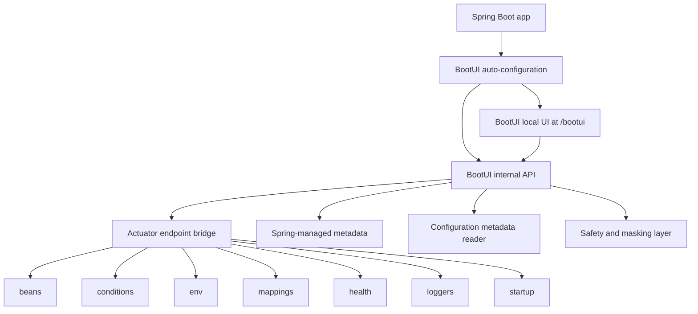

# BootUI Specification

## 1. Overview

BootUI is a **Spring Boot 4 Starter** that adds an embedded, local-only developer console to Spring Boot 4 applications.
It is inspired by Quarkus Dev UI, .NET Aspire Dashboard, Laravel Telescope, Micronaut Control Panel, and Spring Boot
Admin, but is focused specifically on the inner development loop of a single Spring Boot 4 application.

BootUI is not a standalone application, production monitoring tool, APM product, cloud service, IDE plugin, or
replacement for Actuator. It is a Spring-native visualization and explanation layer loaded into the user's running
Spring Boot 4 application through a starter dependency.

## 1.1 Target platform

BootUI v0.1 targets:

- Spring Boot 4.x.
- Java 25.
- Maven-based applications first.
- Servlet web applications first.

Out of scope for v0.1:

- Spring Boot 3.x compatibility.
- Spring Framework 6 / Boot 3 compatibility shims.
- Gradle plugin support.
- WebFlux-specific UX beyond what Actuator mappings expose by default.

## 2. Product goals

### 2.1 Primary goal

Make a running Spring Boot application understandable in minutes.

### 2.2 Secondary goals

- Reduce time spent debugging auto-configuration and configuration issues.
- Help new developers onboard onto unfamiliar Spring Boot services.
- Provide an IDE-agnostic UI for runtime Spring Boot insight.
- Make Actuator data readable and actionable during local development.
- Create an extensible platform where Spring ecosystem libraries can add BootUI panels.

### 2.3 Non-goals for MVP

- Production monitoring.
- Multi-application _runtime_ orchestration. BootUI captures host-application traces locally and accepts OTLP traces from
  cooperating local services as a dev-time sink, but it does not run, schedule, restart, or supervise other processes the
  way .NET Aspire's AppHost does.
- Kubernetes workflow management.
- Hosted dashboards.
- Authentication and user management.
- Full APM/tracing replacement. BootUI's telemetry capture is dev-only, bounded in memory, and never forwards data
  anywhere.
- Upgrade automation.
- Code editing.
- Replacing Spring Boot Admin.

## 3. Target users

| Persona                      | Needs                                                                   | BootUI value                                                                 |
| ---------------------------- | ----------------------------------------------------------------------- | ---------------------------------------------------------------------------- |
| Solo/backend developer       | Understand a project quickly, configure it correctly, inspect endpoints | One local URL with beans, config, mappings, health, and logs                 |
| Enterprise service onboarder | Understand inherited profiles, conditional beans, and dependencies      | Explains effective runtime state without reading the whole codebase first    |
| Platform engineer            | Standardize inspection across many Spring Boot services                 | Common diagnostic surface for all teams                                      |
| Microservices developer      | Debug local service wiring and environment issues                       | Shows local service health, connection details, mappings, and config sources |

## 4. User experience

### 4.1 Activation

BootUI activates only in development contexts.

Default activation rules:

- Enabled when the `bootui-spring-boot-starter` dependency is present in a Spring Boot 4 application and at least one of
  these is true:
  - `spring-boot-devtools` is present.
  - Active profile is `dev` or `local`.
  - `bootui.enabled=ON`.
- Disabled when:
  - `bootui.enabled=OFF`.
  - Active profile is `prod` or `production`, unless `bootui.enabled=ON` is set.

`bootui.enabled=AUTO` is the default. BootUI must fail closed: if no enabled profile is active and DevTools is not on
the classpath, it should not expose the UI.

When BootUI is active, the starter should contribute low-precedence Actuator defaults for the local panels, including
`beans`, `conditions`, `configprops`, `env`, `loggers`, `mappings`, `metrics`, `startup`, and `scheduledtasks`. Host
applications can override those `management.*` settings explicitly.

### 4.2 URL

Default UI URL inside the host Spring Boot 4 application:

```text
http://localhost:${server.port}/bootui
```

The current implementation serves the UI at `/bootui/` and APIs at `/bootui/api/**`. Configuration properties for the
UI/API paths exist, but v0.1 should treat `/bootui` as the supported route until path customization is wired through
every controller and packaged asset:

```properties
bootui.path=/bootui
```

### 4.3 Startup banner integration

When BootUI is enabled, the application startup output should include:

```text
BootUI is available at http://localhost:8080/bootui
```

This should integrate with the project's startup banner convention.

### 4.4 First-run experience

The first screen should show:

- Application name.
- Spring Boot version.
- Java version.
- Active profiles.
- Server port and management port.
- BootUI safety status: local-only, dev mode, enabled reason.
- Quick links to the main panels.
- Warnings for missing recommended data sources, such as Actuator endpoints not available.

## 5. Functional specification

### 5.1 Overview panel

Purpose: give a fast summary of the running application.

Data:

- Application name.
- Spring Boot version.
- Java version.
- JVM vendor and runtime.
- Active profiles.
- Web application type.
- Server port.
- Management port.
- Context path.
- Startup duration if available.
- BootUI activation reason.

Acceptance criteria:

- Shows a useful overview without requiring any configuration beyond adding the starter.
- Clearly marks missing optional data as unavailable, not as an error.
- Does not expose environment secrets.

### 5.2 Beans Explorer

Purpose: answer "Which beans exist, and where did they come from?"

Data sources:

- Actuator `beans` endpoint.
- Spring application context.
- Optional internal BootUI metadata for auto-configured vs user-defined beans.

Features:

- Search by bean name, class name, package, scope, and resource.
- Hide BootUI's own beans by default so the report focuses on the host application; `bootui.monitoring.exclude-self=false`
  includes them when debugging BootUI itself.
- Filter by current classification:
  - application beans.
  - BootUI beans, when self-data filtering is disabled.
  - Spring framework beans.
  - Java/Jakarta platform beans.
  - other beans.
- Show bean name, type, scope, resource/declaring class when available, dependencies, aliases, and classification.

Acceptance criteria:

- A developer can find a bean by name or type.
- A developer can inspect why a bean matters by seeing dependencies.
- Large applications remain usable through search and lazy loading.

### 5.3 Conditions Explorer

Purpose: answer "Why was this auto-configuration applied or skipped?"

Data sources:

- Actuator `conditions` endpoint.
- Spring Boot condition evaluation report.

Features:

- Group by auto-configuration class.
- Show positive matches.
- Show negative matches.
- Show unconditional classes.
- Search by class, condition type, missing class, missing bean, missing property.

Acceptance criteria:

- Raw condition messages are preserved.
- BootUI presents Spring Boot condition messages without binding the browser to raw Actuator JSON.
- Negative matches are easy to discover.

### 5.4 Configuration Properties Explorer

Purpose: answer "Which Spring Boot configuration properties exist, which values are active, where did they come from,
and can I modify them safely during local development?"

Data sources:

- Actuator `env` endpoint.
- Spring Boot configuration metadata.
- Environment property sources.

Features:

- List and search all Spring Boot configuration properties visible to the application.
- Show effective value.
- Show source property source.
- Show active profiles.
- Show known default where metadata is available.
- Show description from configuration metadata where available.
- Suggest known Spring Boot configuration keys when creating an override.
- Detect and mask likely secrets:
  - password
  - secret
  - token
  - key
  - credential
  - private
- Modify configuration properties through local runtime overrides.
- Add a runtime-only override for an existing property.
- Add a runtime-only override for a new property key.
- Edit a runtime override.
- Remove a runtime override.
- Show whether a displayed value comes from a BootUI runtime override.
- Clearly label modified values as local, runtime-only, and not persisted to `application.properties`, environment
  variables, or config server.
- Persist overrides to BootUI's override file by default so they can be reapplied on restart.
- Explain when a modified property may not affect already-created beans or already-bound `@ConfigurationProperties`
  without restart or explicit rebind support.

Acceptance criteria:

- Secret-like values are masked by default.
- The UI explains where an effective value came from.
- Unknown properties are still searchable.
- Custom `@ConfigurationProperties` metadata is displayed when available.
- Developers can create, update, and remove local runtime overrides for Spring Boot configuration properties.
- BootUI never writes secrets or modified values back to source files by default.
- Every property mutation is local-development-only and is persisted only to BootUI's override file,
  `.bootui/application-bootui.properties` by default.
- Mutating a property returns a clear result that states whether the new value is visible in the Spring `Environment`
  and whether restart/rebind may be required.

### 5.5 Mappings Browser

Purpose: answer "Which HTTP endpoints does this app expose?"

Data sources:

- Actuator `mappings` endpoint.

Features:

- List HTTP mappings by method and path.
- Show handler class and method.
- Show consumes/produces metadata.
- Search paths and handler names.

Acceptance criteria:

- All Spring MVC or WebFlux routes appear when available.
- The UI handles apps with no web layer gracefully.
- Unsafe methods are not automatically called.

### 5.6 Health Dashboard

Purpose: answer "What dependency or component is unhealthy?"

Data sources:

- Actuator `health` endpoint.

Features:

- Render health tree.
- Show status at each level.
- Highlight failing contributors.
- Show details when available.
- Explain when details are hidden by Actuator configuration.

Acceptance criteria:

- Overall status is visible immediately.
- Failing health contributors are easy to identify.
- The UI does not require production-style health exposure.

### 5.7 Logger Controls

Purpose: answer "Can I inspect and change log levels without restart?"

Data sources:

- Actuator `loggers` endpoint.

Features:

- Search loggers.
- Show configured level and effective level.
- Set level at runtime.
- Clear configured level.
- Preset common packages:
  - application base package.
  - `org.springframework`.
  - `org.springframework.web`.
  - `org.springframework.security`.
  - `org.hibernate.SQL`.

Acceptance criteria:

- Runtime level changes work when Actuator supports them.
- UI clearly states changes are runtime-only and not persisted.

### 5.7.1 DevTools Controls

Purpose: answer "Can I trigger local LiveReload or restart this app from the console?"

Data sources:

- Spring Boot DevTools restart APIs when present and initialized.
- Spring Boot DevTools LiveReload server when present.

Features:

- Show whether DevTools restart is available.
- Show whether LiveReload is available and which port it uses when reported.
- Trigger a LiveReload notification for connected browsers.
- Restart the local application through DevTools after explicit confirmation.
- Poll for the application to return after a restart is scheduled.
- Explain unavailable states instead of hiding the panel.

Acceptance criteria:

- DevTools is optional; BootUI must still start when DevTools is absent.
- Restart actions require explicit confirmation and are intended for local development only.
- Restart scheduling returns an API response before DevTools tears down the running context.
- LiveReload is clearly described as a notification to connected browser tooling, not a forced BootUI page reload.

### 5.8 Startup Timeline

Purpose: answer "What made startup slow?"

Data sources:

- Actuator `startup` endpoint when configured.
- Spring `ApplicationStartup`.

Features:

- Show startup steps sorted by duration.
- Show timeline view.
- Filter by tag.
- Highlight slowest steps.
- Explain when startup data is unavailable and how to enable it.

Acceptance criteria:

- Missing startup data does not break the UI.
- The UI gives a clear unavailable state when startup data is absent.

### 5.9 Metrics Panel

Purpose: answer "Which Micrometer meters exist, how are they tagged, and what are their live values?"

Data sources:

- Micrometer `MeterRegistry`.
- Spring Boot Actuator metrics auto-configuration when present.

Features:

- List meters by name, description, base unit, and Micrometer type.
- Search meters by name or description.
- Filter meters by type.
- Inspect a meter's current measurements.
- Show available tag keys and values for each meter.
- Filter live values by tag key/value.
- Render a lightweight live graph for the selected statistic.
- Poll locally with bounded browser-side history; no external monitoring service is required.

Acceptance criteria:

- Missing Micrometer infrastructure produces a clear empty state.
- Browser responses use BootUI DTOs, not raw registry internals.
- Tag values remain browser-bounded so high-cardinality meters do not freeze the UI.
- Polling does not overlap slow requests.
- Switching meter, tag filters, or statistic resets the live graph history.

### 5.10 JVM Memory Panel

Purpose: answer "How much heap/non-heap memory is this app using, and what JVM options would be reasonable locally?"

Data sources:

- Java management beans (`MemoryMXBean`, `MemoryPoolMXBean`, `ClassLoadingMXBean`, `ThreadMXBean`, runtime input
  arguments).

Features:

- Show heap and non-heap usage summaries.
- Show memory pool usage.
- Show JVM input arguments.
- A Paketo `libjvm`-style memory calculator that partitions a user-chosen
  target container memory into JVM regions
  (`heap = total − headRoom − directMemory − metaspace − codeCache − stack×threads`),
  using the live loaded-class count from `ClassLoadingMXBean` (with a 1.25× safety
  factor) and a live-or-floored thread count, so the recommendation is independent
  of the host machine's RAM rather than inheriting the JVM's `~25% of host RAM` heap-max default.
- Suggest JVM options derived from the calculator output, including `-Xms`/`-Xmx`
  (equal for predictable startup), `-XX:MaxMetaspaceSize`, `-XX:ReservedCodeCacheSize`,
  `-XX:MaxDirectMemorySize`, `-Xss`, GC selection (G1 below 4 GB, ZGC above), and
  out-of-memory safeguards.

Acceptance criteria:

- Memory values serialize through stable BootUI DTOs.
- Suggested options are clearly presented as recommendations, not automatic changes.
- JVM argument disclosure is reviewed as part of release hardening.

### 5.11 Vulnerabilities Panel

Purpose: answer "Which runtime JAR dependencies are present, and do any have known vulnerabilities?"

Data sources:

- Maven metadata (`META-INF/maven/*/*/pom.properties`) discovered from the running application's classpath.
- OSV.dev Maven vulnerability data for explicit on-demand scans.

Features:

- List runtime Maven dependencies by group, artifact, and version.
- Keep the initial inventory local-only; no external vulnerability lookup runs on page load.
- Provide an explicit "Scan with OSV.dev" action that sends Maven package names and versions to OSV.dev.
- Show scan status, vulnerable dependency count, advisory count, severity breakdown, advisory links, aliases, and fixed
  versions when available.
- Support disabling OSV scans with `bootui.dependencies.osv-enabled=false`.

Acceptance criteria:

- Dependency and advisory data serialize through stable BootUI DTOs.
- External scanning is user-initiated and clearly labeled in the UI.
- OSV failures return a clear error status while preserving the local dependency inventory.
- Scan size is bounded by configuration so large classpaths remain responsive.

### 5.12 Scheduled Tasks Inspector

Purpose: answer "Which scheduled tasks are registered?"

Data sources:

- Spring `ScheduledTaskHolder`.

Features:

- List registered scheduled tasks.
- Show runnable description, trigger type, interval/cron expression, initial delay, and display units.
- Show an empty state when scheduling infrastructure is absent or no tasks are registered.

Acceptance criteria:

- Opening the panel never invokes scheduled tasks.
- Spring wrapper runnables are displayed with the most useful available task description.

### 5.13 HTTP Probe Panel

Purpose: issue safe local HTTP requests to the running app from the developer console.

Data sources:

- BootUI internal `/bootui/api/probe` endpoint using a local `HttpClient`.

Features:

- Send requests to paths relative to the application root.
- Normalize method and path.
- Restrict targets to localhost.
- Support request bodies only for methods that can carry a body.
- Display status, selected response headers, body, timing, and errors.

Acceptance criteria:

- BootUI never proxies arbitrary external URLs.
- Unsafe-body behavior is explicit and predictable.
- Response headers are filtered to a small allow-list.

### 5.14 Log Tail Panel

Purpose: stream recent local application log lines in the browser.

Data sources:

- BootUI Logback appender installed when Logback is on the classpath.

Features:

- Show recent buffered log lines.
- Stream new log events with Server-Sent Events.
- Pause, resume, clear, and filter by severity in the browser.

Acceptance criteria:

- The panel is classpath-gated and unavailable when Logback is absent.
- Log events are shaped into stable DTOs before reaching the browser.

### 5.15 Profile Diff Panel

Purpose: show which properties are contributed by active profile-specific property sources.

Data sources:

- Spring `ConfigurableEnvironment` property sources.

Features:

- List active profiles.
- Group enumerable profile-specific property sources by profile.
- Mask secret-like property values.
- Filter profile properties.

Acceptance criteria:

- Secret-like keys remain masked by default.
- Metadata-only exposure hides values.
- Source attribution remains visible.

### 5.16 Spring Security Panel

Purpose: answer "Which security filter chains and authorization rules apply?"

Data sources:

- Spring Security `FilterChainProxy`.
- Authentication provider and user-details-service beans.
- Spring MVC request mappings when available.

Features:

- List filter chains, matchers, filter pipeline, CSRF/CORS/session indicators.
- Summarize authentication provider and user-details-service types without credentials.
- Best-effort explain for a method/path.
- Best-effort per-endpoint authorization rule listing.

Acceptance criteria:

- The panel is classpath-gated and unavailable when Spring Security Web is absent.
- Credentials, password hashes, signing keys, session IDs, and tokens are never displayed.
- Matching caveats are clearly marked as best-effort.
- BootUI's own security chains and endpoint rules are hidden by default.

### 5.17 Spring Data Explorer

Purpose: answer "Which Spring Data repositories does this app declare, against which store, and what queries do they
expose?"

Data sources:

- Spring Data `RepositoryFactoryInformation` beans discovered in the application context.
- Each repository's `RepositoryInformation` (domain type, ID type, repository interface, custom implementation class,
  query methods, fragment methods).

Features:

- List detected Spring Data repositories, grouped by store module (JPA, JDBC, MongoDB, Redis, R2DBC, Cassandra, Neo4j,
  generic).
- For each repository, show:
  - Repository interface name and package.
  - Domain type and ID type.
  - Custom implementation class, if any.
  - Method list with origin badge (CRUD, derived-query, `@Query`, fragment, default-method).
  - For `@Query`-annotated methods: the declared query string, native flag, and named-query reference if any.
- Filter by repository interface, bean name, domain type, method, or query content.

Out of scope for v0.1:

- Executing repository methods or arbitrary queries from the UI.
- Schema migration controls.
- Editing or generating repository code.

Acceptance criteria:

- When Spring Data is not on the classpath, the API endpoint is not registered.
- When Spring Data is present but no repositories are detected, the panel shows a clear empty state.
- Query strings declared via `@Query` are displayed verbatim; BootUI never rewrites or executes them.
- No repository method is invoked as a side effect of opening the panel.

### 5.18 Spring Cache Panel

Purpose: answer "Which Spring Cache managers and caches exist, how are they used, and can I clear them during local
development?"

Data sources:

- Spring `CacheManager` beans discovered in the application context.
- Spring Cache `CacheOperationSource` metadata for `@Cacheable`, `@CachePut`, `@CacheEvict`, and composed `@Caching`
  operations.
- Micrometer cache meters when the host application has cache metrics registered.

Features:

- List detected cache managers, their implementation types, and currently known cache names.
- For each cache, show the native implementation type, safe local size when it can be read without remote enumeration,
  and Micrometer metrics such as hits, misses, hit ratio, puts, evictions, removals, and size.
- List discovered cache annotation operations by bean, target type, method signature, operation type, cache names,
  key/condition/unless expressions, and eviction flags.
- Clear one known cache or every known cache when `bootui.cache.clear-enabled=true` and the browser sends an explicit
  confirmation.

Acceptance criteria:

- When no `CacheManager` beans are present, the panel shows a clear empty state.
- Cache size inspection must avoid enumerating remote or distributed cache stores.
- Cache clear actions are enabled by default for local development, still require explicit confirmation, and return a
  clear disabled response when `bootui.cache.clear-enabled=false`.
- Clearing unknown cache names must not create dynamic caches as a side effect.
- Annotation discovery must not eagerly initialize lazy application beans.
- BootUI's own cache managers, cache operations, and cache metrics are hidden by default.

### 5.19 Dev Services Panel

Purpose: answer "Which local backing services are connected?"

Data sources:

- Spring Boot service connection metadata when available.
- Spring Boot Docker Compose startup service snapshot when available.
- Testcontainers beans that are present in the application context.

Features:

- Show detected service connections:
  - PostgreSQL.
  - MySQL.
  - MariaDB.
  - Redis.
  - MongoDB.
  - RabbitMQ.
  - Kafka.
  - Elasticsearch.
  - Neo4j.
- Show source:
  - Docker Compose.
  - Testcontainers.
  - connection details.
- Show sanitized connection details.
- Show bounded logs when a bean-backed Testcontainers service exposes them.
- Show a restart action for bean-backed services only when explicitly enabled with
  `bootui.dev-services.restart-enabled=true`.
- Skip lazy, prototype, abstract, or otherwise uninitialized service beans instead of creating them from a read-only
  panel request, and show a warning that explains why they were skipped.

Status: implemented and supported for `0.1.0` as part of the harden-all-visible-panels release scope.

Acceptance criteria:

- Secrets are never displayed.
- `bootui.expose-values=FULL` is the only mode that may reveal secret-like service connection values, and should be used
  only in trusted local sessions.
- Unknown services are represented generically.
- Works even when Docker is not installed.
- Docker Compose services are clearly identified as startup snapshots because
  Spring Boot does not expose live per-service lifecycle state.
- Docker Compose snapshots preserve duplicate or unnamed service entries by assigning stable synthetic IDs and warning
  when BootUI had to adjust an entry for display.
- Restart controls are disabled by default and warn that already-created client
  beans may not reconnect after container ports change.

## 6. Technical architecture

### 6.1 Proposed repository layout

```text
BootUI/
├── README.md
├── docs/
│   ├── SPECIFICATION.md
│   └── PLAN.md
├── pom.xml
├── bootui-core/
├── bootui-autoconfigure/
├── bootui-spring-boot-starter/
├── bootui-ui/
└── bootui-sample-app/
```

### 6.2 Modules

#### `bootui-core`

Shared Java model and utilities.

Responsibilities:

- DTOs returned by BootUI internal API.
- Secret masking helpers.
- Version metadata.
- Safe value rendering.
- Common error model.

#### `bootui-autoconfigure`

Spring Boot 4 auto-configuration module.

Responsibilities:

- Auto-configure BootUI when activation rules match.
- Register internal BootUI API endpoints.
- Serve static UI assets.
- Bridge to Actuator endpoints or endpoint invokers.
- Enforce local/dev safety checks.

#### `bootui-spring-boot-starter`

Spring Boot 4 starter dependency for users.

Responsibilities:

- Pull `bootui-autoconfigure`.
- Pull `bootui-ui`, `spring-boot-starter-web`, and `spring-boot-starter-actuator`.
- Avoid bringing production-heavy dependencies.

#### `bootui-ui`

Vue.js frontend application.

Required stack:

- Vue 3.
- Plain JavaScript with Vue Composition API.
- Vite.
- Bootstrap 5.3.

Responsibilities:

- Build static assets automatically during the Maven build.
- Provide browser UI.
- Consume BootUI internal API.
- Avoid needing Node.js at runtime.
- Package the compiled assets into the BootUI Java artifact so applications using the starter do not need a separate
  frontend build or dev server.

Build requirements:

- The Maven build must install/use the configured Node.js and npm versions for reproducible frontend builds.
- The frontend build must run before Java resources are packaged.
- The generated Vue assets must be copied into a classpath location served by `bootui-autoconfigure`, such as
  `META-INF/resources/bootui/`.
- `./mvnw clean package` from the repository root must produce BootUI artifacts that already contain the compiled Vue
  UI.
- Consumer Spring Boot 4 applications should only need the `bootui-spring-boot-starter` dependency; they must not run
  `npm install` or `npm run build` themselves.

#### `bootui-sample-app`

Sample Spring Boot app used for demos and integration tests.

Responsibilities:

- Demonstrate common Spring Boot features.
- Include Actuator, DevTools, web, JPA/PostgreSQL through Docker Compose, Redis-backed Spring Cache, scheduling, and
  Spring Security.
- Provide enough beans, mappings, config, health, repositories, scheduled tasks, security chains, and logs to test
  BootUI.
- Host Playwright end-to-end tests for every visible BootUI route and the sample REST API.

### 6.3 Runtime architecture



### 6.4 API design

BootUI should expose its own development-only API under:

```text
/bootui/api/**
```

The browser UI should not depend directly on raw Actuator response shapes. BootUI should normalize them into stable
DTOs. High-cardinality list endpoints should support bounded server-side `q` / filter / `offset` / `limit` access and
return page metadata so the SPA can avoid fetching every row before filtering.

Initial endpoints:

| Endpoint                                | Method | Purpose                                                                   |
| --------------------------------------- | ------ | ------------------------------------------------------------------------- |
| `/bootui/api/overview`                  | GET    | App, runtime, Spring Boot, profile, and BootUI status                     |
| `/bootui/api/beans`                     | GET    | Searchable bean summary                                                   |
| `/bootui/api/conditions`                | GET    | Auto-configuration conditions                                             |
| `/bootui/api/config`                    | GET    | Effective configuration values                                            |
| `/bootui/api/config/overrides`          | POST   | Create or update a local runtime configuration property override          |
| `/bootui/api/config/overrides/{name}`   | DELETE | Remove a local runtime configuration property override                    |
| `/bootui/api/mappings`                  | GET    | HTTP mappings                                                             |
| `/bootui/api/mappings/flat`             | GET    | Stable, paged HTTP mapping summaries                                      |
| `/bootui/api/health`                    | GET    | Health tree                                                               |
| `/bootui/api/loggers`                   | GET    | Logger levels                                                             |
| `/bootui/api/loggers/{name}`            | POST   | Change logger level                                                       |
| `/bootui/api/startup`                   | GET    | Startup timeline                                                          |
| `/bootui/api/metrics`                   | GET    | Browseable Micrometer meter list                                          |
| `/bootui/api/metrics/detail`            | GET    | Micrometer meter detail and live measurements                             |
| `/bootui/api/dependencies`              | GET    | Runtime Maven dependency inventory without external scanning              |
| `/bootui/api/dependencies/scan`         | POST   | Explicit on-demand OSV.dev vulnerability scan                             |
| `/bootui/api/devtools`                  | GET    | Spring Boot DevTools status                                               |
| `/bootui/api/devtools/livereload`       | POST   | Trigger a DevTools LiveReload notification when available                 |
| `/bootui/api/devtools/restart`          | POST   | Schedule a DevTools restart after explicit confirmation                   |
| `/bootui/api/memory`                    | GET    | JVM memory report                                                         |
| `/bootui/api/scheduled`                 | GET    | Scheduled tasks                                                           |
| `/bootui/api/probe`                     | POST   | Local HTTP probe                                                          |
| `/bootui/api/logs/recent`               | GET    | Recent log lines                                                          |
| `/bootui/api/logs/stream`               | GET    | Log stream over Server-Sent Events                                        |
| `/bootui/api/profiles`                  | GET    | Profile-specific property sources                                         |
| `/bootui/api/dev-services`              | GET    | Docker Compose, Testcontainers, and service connection entries            |
| `/bootui/api/dev-services/{id}/logs`    | GET    | Bounded log tail for a bean-backed service when available                 |
| `/bootui/api/dev-services/{id}/restart` | POST   | Restart a bean-backed service only when explicitly enabled                |
| `/bootui/api/data/repositories`         | GET    | Detected Spring Data repositories (summary)                               |
| `/bootui/api/data/repositories/{name}`  | GET    | Spring Data repository detail with query methods                          |
| `/bootui/api/cache`                     | GET    | Spring Cache managers, caches, metrics, and annotation operations         |
| `/bootui/api/cache/clear`               | POST   | Clear one or all known caches only when explicitly enabled and confirmed  |
| `/bootui/api/security`                  | GET    | Spring Security filter chain report                                       |
| `/bootui/api/security/explain`          | GET    | Best-effort chain match for a method/path                                 |
| `/bootui/api/security/endpoints`        | GET    | Best-effort per-endpoint authorization report                             |
| `/bootui/api/copilot/**`                | GET    | Sanitized GitHub Copilot CLI session dashboard, explorer, raw reveal, SSE |
| `/bootui/api/claude-code/**`            | GET    | Sanitized Claude Code project-log dashboard, explorer, raw reveal, SSE    |

### 6.5 Configuration properties

Prefix:

```properties
bootui.*
```

Initial properties:

| Property                                     | Default                                 | Description                                                                                       |
| -------------------------------------------- | --------------------------------------- | ------------------------------------------------------------------------------------------------- |
| `bootui.enabled`                             | `AUTO`                                  | Enables BootUI. Values: `AUTO`, `ON`, `OFF`.                                                      |
| `bootui.path`                                | `/bootui`                               | UI base path used by the banner and safety filter; `/bootui` is the supported v0.1 route.         |
| `bootui.api-path`                            | `/bootui/api`                           | Internal API base path used by the safety filter; controllers currently serve `/bootui/api/**`.   |
| `bootui.allow-non-localhost`                 | `false`                                 | Explicitly allow non-loopback requests.                                                           |
| `bootui.mask-secrets`                        | `true`                                  | Mask secret-like config values.                                                                   |
| `bootui.expose-values`                       | `MASKED`                                | One of `MASKED`, `METADATA_ONLY`, `FULL`.                                                         |
| `bootui.read-only`                           | `false`                                 | Disable all browser-triggered actions while keeping read-only panel data visible.                  |
| `bootui.show-banner`                         | `true`                                  | Print BootUI URL on startup.                                                                      |
| `bootui.enabled-profiles`                    | `dev,local`                             | Profiles that activate BootUI.                                                                    |
| `bootui.disabled-profiles`                   | `prod,production`                       | Profiles that disable BootUI unless `bootui.enabled=ON`.                                          |
| `bootui.overrides-file`                      | `.bootui/application-bootui.properties` | File used to persist local runtime configuration overrides.                                       |
| `bootui.monitoring.exclude-self`             | `true`                                  | Hide BootUI's own runtime data from monitoring panels.                                            |
| `bootui.cache.clear-enabled`                 | `true`                                  | Enable Spring Cache clear actions after explicit browser confirmation.                            |
| `bootui.dependencies.osv-enabled`            | `true`                                  | Allow the user-initiated OSV.dev vulnerability scan action.                                       |
| `bootui.dependencies.request-timeout`        | `10s`                                   | Timeout applied to each OSV request.                                                              |
| `bootui.dependencies.max-packages`           | `250`                                   | Maximum packages sent in one OSV batch query.                                                     |
| `bootui.dependencies.max-advisories`         | `200`                                   | Maximum advisory detail documents fetched after a query.                                          |
| `bootui.dev-services.restart-enabled`        | `false`                                 | Enables restart controls for bean-backed Testcontainers services.                                 |
| `bootui.dev-services.log-tail-bytes`         | `65536`                                 | Maximum bytes returned by one Dev Services log request.                                           |
| `bootui.telemetry.enabled`                   | `true`                                  | Enables local trace capture and the OTLP/HTTP receiver used by the Traces and AI Usage panels.    |
| `bootui.telemetry.max-traces`                | `500`                                   | Maximum distinct traces retained in memory; internally capped for UI safety.                      |
| `bootui.telemetry.max-spans-per-trace`       | `500`                                   | Maximum spans retained for one trace; internally capped for UI safety.                            |
| `bootui.telemetry.max-attribute-value-bytes` | `4096`                                  | Maximum attribute string length before truncation; internally capped for UI safety.               |
| `bootui.telemetry.exclude-self-spans`        | `true`                                  | Drops ingested spans for BootUI's own API routes before they enter the local trace store.         |
| `bootui.telemetry.max-request-bytes`         | `8388608`                               | Maximum OTLP payload size accepted by the local receiver.                                         |
| `bootui.ai.token-series-minutes`             | `60`                                    | Default token-usage chart window for the AI Usage panel, capped by the API.                       |
| `bootui.ai.max-recent-chats`                 | `100`                                   | Maximum recent chat rows surfaced by the AI Usage panel, capped by the API.                       |
| `bootui.ai.show-content-capture-banner`      | `true`                                  | Shows guidance when Spring AI prompt/completion content is not captured in spans.                 |
| `bootui.copilot.enabled`                     | `AUTO`                                  | Enable the Copilot panel when local Copilot CLI session state exists.                             |
| `bootui.copilot.session-state-dir`           | `~/.copilot/session-state`              | Directory scanned for Copilot CLI session directories and `events.jsonl` files.                   |
| `bootui.copilot.max-events-per-session`      | `2000`                                  | Maximum Copilot events retained per parsed session.                                               |
| `bootui.copilot.max-sessions`                | `100`                                   | Maximum recent sessions returned by the Copilot session explorer.                                 |
| `bootui.copilot.max-parsed-sessions`         | `100`                                   | Maximum recent Copilot session files parsed and retained in memory.                               |
| `bootui.copilot.stream-debounce`             | `400ms`                                 | Debounce window before refreshing parsed Copilot sessions and notifying stream subscribers.       |
| `bootui.copilot.allow-raw-reveal`            | `true`                                  | Allows opt-in raw Copilot event JSON reveal on loopback.                                          |
| `bootui.claude-code.enabled`                 | `AUTO`                                  | Enable the Claude Code panel when local Claude Code project logs exist.                           |
| `bootui.claude-code.session-state-dir`       | `~/.claude/projects`                    | Directory scanned for Claude Code project JSONL logs.                                             |
| `bootui.claude-code.max-events-per-session`  | `2000`                                  | Maximum Claude Code events retained per parsed session.                                           |
| `bootui.claude-code.max-sessions`            | `100`                                   | Maximum recent sessions returned by the Claude Code session explorer.                             |
| `bootui.claude-code.max-parsed-sessions`     | `100`                                   | Maximum recent Claude Code JSONL files parsed and retained in memory.                             |
| `bootui.claude-code.stream-debounce`         | `400ms`                                 | Debounce window before refreshing parsed Claude Code sessions and notifying stream subscribers.   |
| `bootui.claude-code.allow-raw-reveal`        | `false`                                 | Allows opt-in raw Claude Code JSONL reveal; disabled by default because logs can include content. |

Every visible panel must support `bootui.panels.<panel-id>.enabled`; panels with mutating browser actions must also
support `bootui.panels.<panel-id>.read-only`. These properties are specified panel-by-panel in
[PROPERTIES.md](PROPERTIES.md).

### 6.6 Security model

BootUI must be secure by default.

Rules:

- Bind to local development only.
- Reject non-loopback requests by default.
- If Spring Security is present while BootUI is active, contribute a highest-precedence `/bootui/**` permit-all security
  chain and log a warning so the developer console stays directly reachable. This must not weaken the localhost-only
  servlet filter unless `bootui.allow-non-localhost=true` is explicitly set.
- Disable in production profile by default.
- Mask secret-like values by default.
- Never display `.env` contents.
- Never write configuration values back to application source files.
- Persist runtime overrides only to BootUI's configured override file.
- Never forward telemetry off-process by default.
- Never proxy arbitrary external URLs.
- Never perform dependency vulnerability lookups until the developer explicitly starts an OSV scan.

Production safety:

- If BootUI detects a likely production environment, it should disable itself and log a clear message.
- Explicit override should be intentionally named, for example:

```properties
bootui.enabled=ON
bootui.allow-non-localhost=true
```

The second property should be required to expose BootUI beyond localhost.

## 7. UX specification

### 7.1 Navigation

Top-level navigation:

- Overview.
- Runtime:
  - Health.
  - Metrics.
  - Memory.
  - Startup Timeline.
- Configuration:
  - Configuration.
  - Profile Diff.
  - Loggers.
  - Beans.
  - Conditions.
  - Mappings.
- Services:
  - Scheduled Tasks.
  - Data.
  - Cache.
  - Security.
  - AI Usage.
- Diagnostics:
  - Traces.
  - Log Tail.
  - HTTP Probe.
  - Vulnerabilities.
- Developer tools:
  - DevTools.
  - Dev Services.
  - Copilot.
  - Claude Code.
- Disabled / unavailable:
  - Non-overview panels whose backing infrastructure is unavailable.

### 7.2 UI principles

- Search first.
- Explain before dumping raw JSON.
- Always provide the original raw detail behind a disclosure panel.
- Show "why unavailable" messages with actionable fixes.
- Use badges for status:
  - Healthy.
  - Warning.
  - Error.
  - Unavailable.
  - Disabled.
- Never surprise users with network calls or mutations.

### 7.3 Empty states

Examples:

- No Actuator health details:
  - "Health details are hidden. In local development, set `management.endpoint.health.show-details=always`."
- No startup timeline:
  - "Startup data is unavailable. Configure `BufferingApplicationStartup` to collect startup steps."
- No mappings:
  - "No web mappings found. This may be a non-web application."

## 8. Compatibility

Initial target:

- Java 25.
- Spring Boot 4.x.
- Maven first.
- Servlet web applications first.
- macOS/Linux/Windows compatible.

Future compatibility:

- Spring Boot 3.5 if demand requires it.
- Gradle examples.
- WebFlux-specific mapping improvements.

## 9. Testing strategy

### 9.1 Unit tests

- Secret masking.
- Activation rules.
- Configuration properties binding.
- DTO mapping.
- Condition message normalization.
- Endpoint availability handling.

### 9.2 Slice tests

- MVC endpoints for BootUI API.
- Error responses.
- Logger update endpoint.
- Localhost request filtering.

### 9.3 Integration tests

- Sample app starts with BootUI enabled.
- BootUI UI assets are served.
- BootUI API returns overview.
- Beans, conditions, env, mappings, health, loggers work against real Spring Boot context.
- Newer panels work against the sample app or degrade cleanly when optional infrastructure is absent.
- Production profile disables BootUI.

### 9.4 Browser/UI tests

- Playwright smoke tests for all visible panels in `bootui-sample-app/e2e`.
- Search and filter behavior.
- Masked values stay masked.
- Empty states are readable.

## 10. Acceptance criteria for v0.1

BootUI v0.1 is complete when:

- A sample Spring Boot app can add the starter and open `/bootui`.
- The UI shows Overview, Runtime, Configuration, Services, Diagnostics, Developer tools, and Disabled / unavailable
  navigation groups covering Health, Metrics, Memory, Startup Timeline, Scheduled Tasks, Configuration, Profile Diff,
  Loggers, Beans, Conditions, Mappings, Data, Cache, Security, AI Usage, Traces, Log Tail, HTTP Probe, Vulnerabilities,
  DevTools, Dev Services, Copilot, and Claude Code.
- Secret-like values are masked.
- BootUI is disabled by default outside local/dev contexts.
- Tests verify activation and safety behavior.
- Documentation explains installation, activation, safety model, and limitations.

## 11. Release decisions

Resolved for `0.1.0`:

1. Harden every visible panel and ship the full current route set as supported local-development functionality.
2. Publish the final `0.1.0` artifacts to Maven Central.
3. Keep optional panels visible and show clear unavailable/empty states when their classpath or data source is absent.
4. Continue using in-process Actuator endpoint beans and Spring-managed metadata for v0.1; revisit broader metadata
   abstractions after `0.1.x`.
