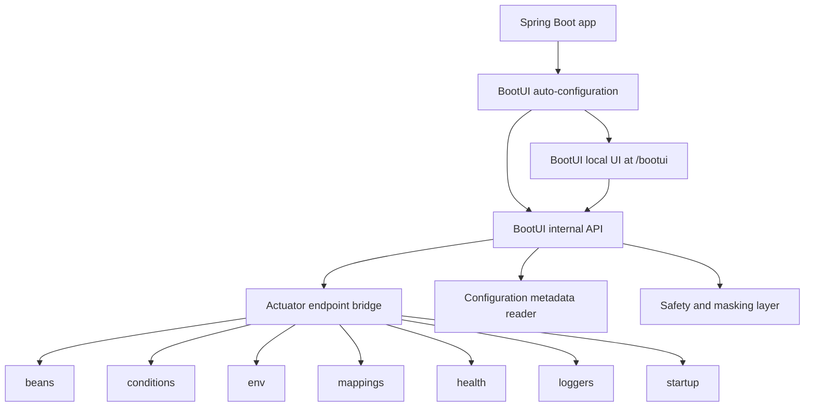

# BootUI Specification

## 1. Overview

BootUI is a **Spring Boot 4 Starter** that adds an embedded, local-only developer console to Spring Boot 4 applications. It is inspired by Quarkus Dev UI, .NET Aspire Dashboard, Laravel Telescope, Micronaut Control Panel, and Spring Boot Admin, but is focused specifically on the inner development loop of a single Spring Boot 4 application.

BootUI is not a standalone application, production monitoring tool, APM product, cloud service, IDE plugin, or replacement for Actuator. It is a Spring-native visualization and explanation layer loaded into the user's running Spring Boot 4 application through a starter dependency.

## 1.1 Target platform

BootUI v0.1 targets:

- Spring Boot 4.x.
- Java 25.
- Maven-based applications first.
- Servlet web applications first.

Out of scope for v0.1:

- Spring Boot 3.x compatibility.
- Spring Framework 6 / Boot 3 compatibility shims.
- Gradle plugin support.
- WebFlux-specific UX beyond what Actuator mappings expose by default.

## 2. Product goals

### 2.1 Primary goal

Make a running Spring Boot application understandable in minutes.

### 2.2 Secondary goals

- Reduce time spent debugging auto-configuration and configuration issues.
- Help new developers onboard onto unfamiliar Spring Boot services.
- Provide an IDE-agnostic UI for runtime Spring Boot insight.
- Make Actuator data readable and actionable during local development.
- Create an extensible platform where Spring ecosystem libraries can add BootUI panels.

### 2.3 Non-goals for MVP

- Production monitoring.
- Multi-application orchestration.
- Kubernetes workflow management.
- Hosted dashboards.
- Authentication and user management.
- Full APM/tracing replacement.
- Upgrade automation.
- Code editing.
- Replacing Spring Boot Admin.

## 3. Target users

| Persona | Needs | BootUI value |
|---|---|---|
| Solo/backend developer | Understand a project quickly, configure it correctly, inspect endpoints | One local URL with beans, config, mappings, health, and logs |
| Enterprise service onboarder | Understand inherited profiles, conditional beans, and dependencies | Explains effective runtime state without reading the whole codebase first |
| Platform engineer | Standardize inspection across many Spring Boot services | Common diagnostic surface for all teams |
| Microservices developer | Debug local service wiring and environment issues | Shows local service health, connection details, mappings, and config sources |

## 4. User experience

### 4.1 Activation

BootUI activates only in development contexts.

Default activation rules:

- Enabled when the `bootui-spring-boot-starter` dependency is present in a Spring Boot 4 application and at least one of these is true:
  - `spring-boot-devtools` is present.
  - Active profile is `dev` or `local`.
  - `bootui.enabled=true`.
- Disabled when:
  - `bootui.enabled=false`.
  - Cloud platform or production profile is detected, unless explicit override is set.

BootUI must fail closed. If the activation state is ambiguous, it should not expose the UI.

### 4.2 URL

Default UI URL inside the host Spring Boot 4 application:

```text
http://localhost:${server.port}/bootui
```

If a management port is configured and different from the application port, BootUI should prefer:

```text
http://localhost:${management.server.port}/bootui
```

The exact path is configurable:

```properties
bootui.path=/bootui
```

### 4.3 Startup banner integration

When BootUI is enabled, the application startup output should include:

```text
BootUI: http://localhost:8080/bootui
```

This should integrate with the project's startup banner convention.

### 4.4 First-run experience

The first screen should show:

- Application name.
- Spring Boot version.
- Java version.
- Active profiles.
- Server port and management port.
- BootUI safety status: local-only, dev mode, enabled reason.
- Quick links to the main panels.
- Warnings for missing recommended data sources, such as Actuator endpoints not available.

## 5. Functional specification

### 5.1 Overview panel

Purpose: give a fast summary of the running application.

Data:

- Application name.
- Spring Boot version.
- Java version.
- JVM vendor and runtime.
- Active profiles.
- Web application type.
- Server port.
- Management port.
- Context path.
- Startup duration if available.
- BootUI activation reason.

Acceptance criteria:

- Shows a useful overview without requiring any configuration beyond adding the starter.
- Clearly marks missing optional data as unavailable, not as an error.
- Does not expose environment secrets.

### 5.2 Beans Explorer

Purpose: answer "Which beans exist, and where did they come from?"

Data sources:

- Actuator `beans` endpoint.
- Spring application context.
- Optional internal BootUI metadata for auto-configured vs user-defined beans.

Features:

- Search by bean name, class name, package, scope, and resource.
- Filter by:
  - User beans.
  - Auto-configured beans.
  - Infrastructure beans.
  - Controllers.
  - Repositories.
  - Services.
  - Configuration properties beans.
- Bean detail view:
  - Bean name.
  - Type.
  - Scope.
  - Resource/declaring class when available.
  - Dependencies.
  - Depended-on beans.
  - Aliases.
- Dependency graph for one bean.

Acceptance criteria:

- A developer can find a bean by name or type.
- A developer can inspect why a bean matters by seeing dependencies.
- Large applications remain usable through search and lazy loading.

### 5.3 Conditions Explorer

Purpose: answer "Why was this auto-configuration applied or skipped?"

Data sources:

- Actuator `conditions` endpoint.
- Spring Boot condition evaluation report.

Features:

- Group by auto-configuration class.
- Show positive matches.
- Show negative matches.
- Show unconditional classes.
- Search by class, condition type, missing class, missing bean, missing property.
- Human-readable explanations for common conditions:
  - `@ConditionalOnClass`
  - `@ConditionalOnMissingClass`
  - `@ConditionalOnBean`
  - `@ConditionalOnMissingBean`
  - `@ConditionalOnProperty`
  - `@ConditionalOnWebApplication`
  - `@ConditionalOnResource`
- Quick diagnostics:
  - "Why is no DataSource configured?"
  - "Why is Spring Security active?"
  - "Why is a web server running?"
  - "Why is this auto-configuration skipped?"

Acceptance criteria:

- Raw condition messages are preserved.
- BootUI adds readable summaries without hiding exact Spring Boot output.
- Negative matches are easy to discover.

### 5.4 Configuration Properties Explorer

Purpose: answer "Which Spring Boot configuration properties exist, which values are active, where did they come from, and can I modify them safely during local development?"

Data sources:

- Actuator `env` endpoint.
- Spring Boot configuration metadata.
- Environment property sources.

Features:

- List and search all Spring Boot configuration properties visible to the application.
- Show effective value.
- Show source property source.
- Show active profiles.
- Show known default where metadata is available.
- Show description from configuration metadata where available.
- Group by prefix:
  - `spring.*`
  - `server.*`
  - `management.*`
  - `logging.*`
  - custom application prefixes.
- Detect and mask likely secrets:
  - password
  - secret
  - token
  - key
  - credential
  - private
- Show override chain when possible.
- Modify configuration properties through local runtime overrides.
- Add a runtime-only override for an existing property.
- Add a runtime-only override for a new property key.
- Edit a runtime override.
- Remove a runtime override.
- Show whether a displayed value comes from a BootUI runtime override.
- Clearly label modified values as local, runtime-only, and not persisted to `application.properties`, environment variables, or config server.
- Explain when a modified property may not affect already-created beans or already-bound `@ConfigurationProperties` without restart or explicit rebind support.

Acceptance criteria:

- Secret-like values are masked by default.
- The UI explains where an effective value came from.
- Unknown properties are still searchable.
- Custom `@ConfigurationProperties` metadata is displayed when available.
- Developers can create, update, and remove local runtime overrides for Spring Boot configuration properties.
- BootUI never writes secrets or modified values back to source files by default.
- Every property mutation is local-development-only and disappears on application restart unless a later explicit persistence feature is designed.
- Mutating a property returns a clear result that states whether the new value is visible in the Spring `Environment` and whether restart/rebind may be required.

### 5.5 Mappings Browser

Purpose: answer "Which HTTP endpoints does this app expose?"

Data sources:

- Actuator `mappings` endpoint.

Features:

- List HTTP mappings by method and path.
- Show handler class and method.
- Show consumes/produces metadata.
- Filter by HTTP method.
- Search paths and handler names.
- Copy route path.
- Optional built-in probe for safe GET requests.

Acceptance criteria:

- All Spring MVC or WebFlux routes appear when available.
- The UI handles apps with no web layer gracefully.
- Unsafe methods are not automatically called.

### 5.6 Health Dashboard

Purpose: answer "What dependency or component is unhealthy?"

Data sources:

- Actuator `health` endpoint.

Features:

- Render health tree.
- Show status at each level.
- Highlight failing contributors.
- Show details when available.
- Explain when details are hidden by Actuator configuration.

Acceptance criteria:

- Overall status is visible immediately.
- Failing health contributors are easy to identify.
- The UI does not require production-style health exposure.

### 5.7 Logger Controls

Purpose: answer "Can I inspect and change log levels without restart?"

Data sources:

- Actuator `loggers` endpoint.

Features:

- Search loggers.
- Show configured level and effective level.
- Set level at runtime.
- Clear configured level.
- Preset common packages:
  - application base package.
  - `org.springframework`.
  - `org.springframework.web`.
  - `org.springframework.security`.
  - `org.hibernate.SQL`.

Acceptance criteria:

- Runtime level changes work when Actuator supports them.
- UI clearly states changes are runtime-only and not persisted.

### 5.8 Startup Timeline

Purpose: answer "What made startup slow?"

Data sources:

- Actuator `startup` endpoint when configured.
- Spring `ApplicationStartup`.

Features:

- Show startup steps sorted by duration.
- Show timeline view.
- Filter by tag.
- Highlight slowest steps.
- Explain when startup data is unavailable and how to enable it.

Acceptance criteria:

- Missing startup data does not break the UI.
- The UI gives exact property/code instructions to enable startup data.

### 5.9 Local Services Panel

Purpose: answer "Which local backing services are connected?"

Data sources:

- Spring Boot service connection metadata when available.
- Docker Compose integration state when available.
- Health indicators.

Features:

- Show detected service connections:
  - PostgreSQL.
  - MySQL.
  - MariaDB.
  - Redis.
  - MongoDB.
  - RabbitMQ.
  - Kafka.
  - Elasticsearch.
  - Neo4j.
- Show source:
  - Docker Compose.
  - Testcontainers.
  - manual configuration.
- Link to related health contributor.
- Show sanitized connection details.

Acceptance criteria:

- Secrets are never displayed.
- Unknown services are represented generically.
- Works even when Docker is not installed.

## 6. Technical architecture

### 6.1 Proposed repository layout

```text
BootUI/
├── README.md
├── docs/
│   ├── SPECIFICATION.md
│   └── PLAN.md
├── pom.xml
├── bootui-bom/
├── bootui-core/
├── bootui-autoconfigure/
├── bootui-spring-boot-starter/
├── bootui-ui/
└── bootui-sample-app/
```

### 6.2 Modules

#### `bootui-core`

Shared Java model and utilities.

Responsibilities:

- DTOs returned by BootUI internal API.
- Secret masking helpers.
- Version metadata.
- Safe value rendering.
- Common error model.

#### `bootui-autoconfigure`

Spring Boot 4 auto-configuration module.

Responsibilities:

- Auto-configure BootUI when activation rules match.
- Register internal BootUI API endpoints.
- Serve static UI assets.
- Bridge to Actuator endpoints or endpoint invokers.
- Enforce local/dev safety checks.

#### `bootui-spring-boot-starter`

Spring Boot 4 starter dependency for users.

Responsibilities:

- Pull `bootui-autoconfigure`.
- Pull required Actuator dependencies if appropriate.
- Avoid bringing production-heavy dependencies.

#### `bootui-ui`

Vue.js frontend application.

Required stack:

- Vue 3.
- TypeScript.
- Vite.
- Bootstrap 5.3.
- Vitest.

Responsibilities:

- Build static assets automatically during the Maven build.
- Provide browser UI.
- Consume BootUI internal API.
- Avoid needing Node.js at runtime.
- Package the compiled assets into the BootUI Java artifact so applications using the starter do not need a separate frontend build or dev server.

Build requirements:

- The Maven build must install/use the configured Node.js and npm versions for reproducible frontend builds.
- The frontend build must run before Java resources are packaged.
- The generated Vue assets must be copied into a classpath location served by `bootui-autoconfigure`, such as `META-INF/resources/bootui/`.
- `./mvnw clean package` from the repository root must produce BootUI artifacts that already contain the compiled Vue UI.
- Consumer Spring Boot 4 applications should only need the `bootui-spring-boot-starter` dependency; they must not run `npm install` or `npm run build` themselves.

#### `bootui-sample-app`

Sample Spring Boot app used for demos and integration tests.

Responsibilities:

- Demonstrate common Spring Boot features.
- Include Actuator, DevTools, web, validation, JPA, PostgreSQL, Docker Compose support, and Testcontainers.
- Provide enough beans, mappings, config, health, and service connections to test BootUI.

### 6.3 Runtime architecture



### 6.4 API design

BootUI should expose its own development-only API under:

```text
/bootui/api/**
```

The browser UI should not depend directly on raw Actuator response shapes. BootUI should normalize them into stable DTOs.

Initial endpoints:

| Endpoint | Method | Purpose |
|---|---|---|
| `/bootui/api/overview` | GET | App, runtime, Spring Boot, profile, and BootUI status |
| `/bootui/api/beans` | GET | Searchable bean summary |
| `/bootui/api/beans/{name}` | GET | Bean detail |
| `/bootui/api/conditions` | GET | Auto-configuration conditions |
| `/bootui/api/config` | GET | Effective configuration values |
| `/bootui/api/config/overrides` | POST | Create or update a local runtime configuration property override |
| `/bootui/api/config/overrides/{name}` | DELETE | Remove a local runtime configuration property override |
| `/bootui/api/mappings` | GET | HTTP mappings |
| `/bootui/api/health` | GET | Health tree |
| `/bootui/api/loggers` | GET | Logger levels |
| `/bootui/api/loggers/{name}` | POST | Change logger level |
| `/bootui/api/startup` | GET | Startup timeline |
| `/bootui/api/services` | GET | Local service connections |

### 6.5 Configuration properties

Prefix:

```properties
bootui.*
```

Initial properties:

| Property | Default | Description |
|---|---|---|
| `bootui.enabled` | auto | Enables BootUI. Auto means dev-only detection. |
| `bootui.path` | `/bootui` | UI base path. |
| `bootui.api-path` | `/bootui/api` | Internal API base path. |
| `bootui.localhost-only` | `true` | Reject non-local requests. |
| `bootui.mask-secrets` | `true` | Mask secret-like config values. |
| `bootui.expose-values` | `masked` | One of `masked`, `metadata-only`, `full`. |
| `bootui.show-banner` | `true` | Print BootUI URL on startup. |
| `bootui.enabled-profiles` | `dev,local` | Profiles that activate BootUI. |

### 6.6 Security model

BootUI must be secure by default.

Rules:

- Bind to local development only.
- Reject non-loopback requests by default.
- Disable in production profile by default.
- Mask secret-like values by default.
- Never display `.env` contents.
- Never persist configuration values.
- Never send telemetry by default.
- Never proxy arbitrary external URLs.

Production safety:

- If BootUI detects a likely production environment, it should disable itself and log a clear message.
- Explicit override should be intentionally named, for example:

```properties
bootui.enabled=true
bootui.allow-non-localhost=true
```

The second property should be required to expose BootUI beyond localhost.

## 7. UX specification

### 7.1 Navigation

Top-level tabs:

- Overview.
- Beans.
- Conditions.
- Config.
- Mappings.
- Health.
- Loggers.
- Startup.
- Services.

### 7.2 UI principles

- Search first.
- Explain before dumping raw JSON.
- Always provide the original raw detail behind a disclosure panel.
- Show "why unavailable" messages with actionable fixes.
- Use badges for status:
  - Healthy.
  - Warning.
  - Error.
  - Unavailable.
  - Disabled.
- Never surprise users with network calls or mutations.

### 7.3 Empty states

Examples:

- No Actuator health details:
  - "Health details are hidden. In local development, set `management.endpoint.health.show-details=always`."
- No startup timeline:
  - "Startup data is unavailable. Configure `BufferingApplicationStartup` to collect startup steps."
- No mappings:
  - "No web mappings found. This may be a non-web application."

## 8. Compatibility

Initial target:

- Java 25.
- Spring Boot 4.x.
- Maven first.
- Servlet web applications first.
- macOS/Linux/Windows compatible.

Future compatibility:

- Spring Boot 3.5 if demand requires it.
- Gradle examples.
- WebFlux-specific mapping improvements.

## 9. Testing strategy

### 9.1 Unit tests

- Secret masking.
- Activation rules.
- Configuration properties binding.
- DTO mapping.
- Condition message normalization.
- Endpoint availability handling.

### 9.2 Slice tests

- MVC endpoints for BootUI API.
- Error responses.
- Logger update endpoint.
- Localhost request filtering.

### 9.3 Integration tests

- Sample app starts with BootUI enabled.
- BootUI UI assets are served.
- BootUI API returns overview.
- Beans, conditions, env, mappings, health, loggers work against real Spring Boot context.
- Production profile disables BootUI.

### 9.4 Browser/UI tests

- Smoke test all panels.
- Search and filter behavior.
- Masked values stay masked.
- Empty states are readable.

## 10. Acceptance criteria for v0.1

BootUI v0.1 is complete when:

- A sample Spring Boot app can add the starter and open `/bootui`.
- The UI shows Overview, Beans, Conditions, Config, Mappings, Health, and Loggers.
- Secret-like values are masked.
- BootUI is disabled by default outside local/dev contexts.
- Tests verify activation and safety behavior.
- Documentation explains installation, activation, safety model, and limitations.

## 11. Open questions

1. Should BootUI use `/bootui` or `/actuator/bootui` as the default path?
2. Should BootUI require Actuator as a dependency, or provide a reduced mode without it?
3. Should BootUI support Spring Boot 3.5 from day one, or start with Spring Boot 4 only?
4. Should the starter automatically expose required Actuator endpoints locally, or only explain how to enable them?
5. Should endpoint data be read through Actuator web endpoints or internal endpoint invokers?
