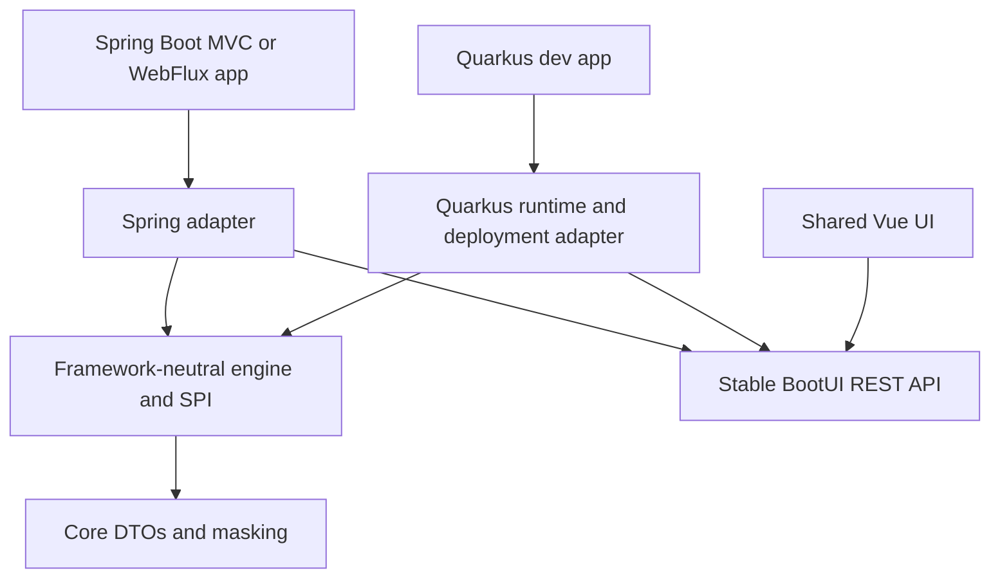

# BootUI Specification

## 1. Overview

BootUI is a **local-only developer console** that adds an embedded, safe introspection and explanation layer to a
running application. It runs on **Spring Boot 4 (servlet or WebFlux) and Quarkus** from a single codebase: each stack
ships a thin adapter — a Spring Boot starter (`bootui-spring-boot-starter` for servlet, `bootui-spring-boot-starter-reactive`
for WebFlux) or a Quarkus extension — over a shared, framework-neutral engine, so all three serve the
**same Vue UI** and the **same `/bootui/api/**` REST contract**. It is inspired by Quarkus Dev UI, .NET Aspire Dashboard,
Laravel Telescope, Micronaut Control Panel, and Spring Boot Admin, but is focused specifically on the inner development
loop of a single application.

BootUI is not a standalone application, production monitoring tool, APM product, cloud service, IDE plugin, or
replacement for Actuator. It is a framework-native visualization and explanation layer loaded into the user's running
application through a starter (Spring Boot) or extension (Quarkus) dependency.

## 1.1 Target platform

BootUI currently targets:

- Spring Boot 4.x and Quarkus 3.x, from one shared, framework-neutral codebase.
- Java 17 or later.
- Maven-based applications first.
- Spring Boot servlet web applications, Spring Boot WebFlux (reactive) applications, and Quarkus (Vert.x / RESTEasy
  Reactive) applications.

Maturity is stated honestly: the **Spring Boot servlet adapter is complete** (all panels). The **Spring Boot WebFlux
adapter** reuses the same engine and serves the large majority of panels unmodified or over a rebuilt reactive capture
layer, including **Live Activity** (all nine signal types merge identically to the servlet adapter — see
`docs/WEBFLUX-SUPPORT.md` §6.4), plus the raw Spring Security panel and the WebFlux-native 25-rule Security advisor; the
raw Spring Security panel, the WebFlux-native 25-rule Security advisor, and REST Client capture over instrumented
`WebClient` instances; HTTP Sessions is not applicable to a reactive,
container-session-free stack — see `docs/WEBFLUX-SUPPORT.md` for the current per-panel status. The **Quarkus adapter
is being built out**, with panels lighting up as the shared engine grows; see `docs/QUARKUS-SUPPORT.md` for the
current per-platform status.

Out of scope for the current 1.x line:

- Spring Boot 3.x compatibility.
- Spring Framework 6 / Boot 3 compatibility shims.
- A dedicated BootUI Gradle plugin (the Spring starters and Quarkus extension are consumable from Maven or Gradle as
  ordinary dependencies).

## 2. Product goals

### 2.1 Primary goal

Make a running Spring Boot or Quarkus application understandable in minutes.

### 2.2 Secondary goals

- Reduce time spent debugging auto-configuration and configuration issues.
- Help new developers onboard onto unfamiliar Spring Boot services.
- Provide an IDE-agnostic UI for runtime Spring Boot insight.
- Make Actuator data readable and actionable during local development.
- Create an extensible platform where Spring ecosystem libraries can add BootUI panels.

### 2.3 Non-goals for MVP

- Production monitoring.
- Multi-application _runtime_ orchestration. BootUI captures host-application traces locally and accepts OTLP traces from
  cooperating local services as a dev-time sink, but it does not run, schedule, restart, or supervise other processes the
  way .NET Aspire's AppHost does.
- Kubernetes workflow management.
- Hosted dashboards.
- User accounts, roles, and identity-provider integration. BootUI uses one lightweight bearer token
  for non-loopback API access; it is not an application user-management system.
- Full APM/tracing replacement. BootUI's telemetry capture is dev-only, bounded in memory, and never forwards data
  anywhere.
- Upgrade automation.
- Code editing.
- Replacing Spring Boot Admin.

## 3. Target users

| Persona                      | Needs                                                                   | BootUI value                                                                 |
| ---------------------------- | ----------------------------------------------------------------------- | ---------------------------------------------------------------------------- |
| Solo/backend developer       | Understand a project quickly, configure it correctly, inspect endpoints | One local URL with beans, config, mappings, health, and logs                 |
| Enterprise service onboarder | Understand inherited profiles, conditional beans, and dependencies      | Explains effective runtime state without reading the whole codebase first    |
| Platform engineer            | Standardize inspection across many Spring Boot services                 | Common diagnostic surface for all teams                                      |
| Microservices developer      | Debug local service wiring and environment issues                       | Shows local service health, connection details, mappings, and config sources |

## 4. User experience

### 4.1 Activation

BootUI activates only in development contexts.

Default activation rules:

- Enabled when the `bootui-spring-boot-starter` dependency is present in a Spring Boot 4 application and at least one of
  these is true:
  - `spring-boot-devtools` is present.
  - Active profile is `dev` or `local`.
  - `bootui.enabled=ON`.
- Disabled when:
  - `bootui.enabled=OFF`.
  - Active profile is `prod` or `production`, unless `bootui.enabled=ON` is set.

`bootui.enabled=AUTO` is the default. BootUI must fail closed: if no enabled profile is active and DevTools is not on
the classpath, it should not expose the UI.

When BootUI is active, the starter should contribute low-precedence Actuator defaults for the local panels, including
`beans`, `conditions`, `configprops`, `env`, `loggers`, `mappings`, `metrics`, `startup`, and `scheduledtasks`. Host
applications can override those `management.*` settings explicitly.

BootUI's panels are served by Spring MVC and require a servlet web application. Because the starter ships Spring MVC and
an embedded servlet container, BootUI also supports non-web (command-line) applications: when BootUI is active and the
host is configured as non-web (`spring.main.web-application-type=none`), the starter forces a servlet web application so
the console can be served. This only happens while BootUI is active (development contexts by default), never overrides an
explicitly reactive application, never runs without an embedded servlet container on the classpath, and never touches
Spring Cloud's transient non-web bootstrap context (detected via its `"bootstrap"` marker property source) so Spring
Cloud Config apps still start. It can be disabled with `bootui.force-web=false`.

### 4.2 URL

Default UI URL inside the host Spring Boot 4 application:

```text
http://localhost:${server.port}/bootui
```

`/bootui` is the backward-compatible default, not a fixed mount. Set `bootui.path` to move the shell, assets, APIs,
filters, streams, downloads, action routes, MCP bridge, startup banner, and SPA runtime base together:

```properties
bootui.path=/dev-console
```

The API then defaults to `/dev-console/api`. `bootui.api-path` may move it independently when a host needs separate
UI and API mounts:

```properties
bootui.path=/dev-console
bootui.api-path=/internal/bootui-api
```

Both values are application-relative. Spring's `server.servlet.context-path` or `spring.webflux.base-path`, and Quarkus'
`quarkus.http.root-path`, are prepended exactly once. For example, `bootui.path=/dev-console` with an application root of
`/host` is served at `/host/dev-console`; the generated shell injects that browser-visible base and API path for the
shared Vue application.

The generated shell also injects the normalized, same-origin host-application path used by the Overview panel's
**Application homepage** link. It is `/` at the default application root and includes exactly one trailing slash for a
custom root (for example, `/host/`). The link therefore returns to `/` from `/bootui/` and to `/host/` from
`/host/dev-console/`, independently of `bootui.path` depth and `bootui.api-path`, without carrying BootUI query or hash
state.

Path configuration is normalized once and then used by every adapter:

- leading/trailing whitespace and one or more trailing slashes are removed;
- the value must be an absolute, non-root path made only of RFC 3986 unreserved segment characters
  (`A-Z`, `a-z`, `0-9`, `.`, `_`, `~`, `-`);
- empty segments, `.` / `..` segments, query or fragment content, percent encoding, backslashes, route-pattern
  characters, and other ambiguous values are rejected with a startup configuration error;
- `/bootui/**` is reserved as the Quarkus adapter's internal classpath mount, so a custom UI path cannot be nested under
  it (the exact default `/bootui` remains valid). `bootui.api-path` may use `/bootui/api`, its backward-compatible
  default.

When a custom UI path is active, the packaged internal `/bootui` shell/assets/API mount is not publicly exposed. Quarkus
reroutes the configured public paths internally without redirecting the browser, preserves query strings, and uses a
per-request loop marker so rerouting cannot recurse. All adapters serve both the bare and trailing-slash shell URL
directly, without a redirect loop.

### 4.2.1 Browser response-header policy

Every active adapter applies the same framework-neutral baseline to the configured UI and API surfaces (the defaults are
`/bootui`, `/bootui/**`, and `/bootui/api/**`), including shell and asset responses, API errors,
localhost/panel-policy rejections, SSE streams, and downloads:

| Header | BootUI baseline |
| --- | --- |
| `Content-Security-Policy` | `default-src 'self'; script-src 'self'; style-src 'self' 'unsafe-inline'; img-src 'self' data:; font-src 'self' data:; connect-src 'self'; object-src 'none'; base-uri 'self'; form-action 'self'; frame-ancestors 'none'` |
| `X-Content-Type-Options` | `nosniff` |
| `X-Frame-Options` | `DENY` |
| `Referrer-Policy` | `strict-origin-when-cross-origin` |
| `Permissions-Policy` | Disables accelerometer, camera, geolocation, gyroscope, magnetometer, microphone, payment, and USB access. |

The CSP deliberately excludes `unsafe-eval`. `style-src 'unsafe-inline'` is currently required by Bootstrap/Vue style
attributes, while `data:` is limited to images and fonts for the generated icon assets. `base-uri 'self'` permits only
the same-origin `<base>` tag BootUI injects when a host application has a servlet context path or Quarkus root path.

BootUI treats cache semantics separately by response class:

- the configured API path and its descendants, including JSON, errors, SSE, and downloads: `Cache-Control: no-store,
  must-revalidate` plus `Pragma: no-cache`.
- successfully served content-hashed files under the configured UI path's `assets/` directory: `Cache-Control: public, max-age=31536000,
  immutable`, with no
  conflicting `Pragma`.
- The SPA shell, favicon, unhashed/missing assets, and other BootUI responses: `Cache-Control: no-cache` plus
  `Pragma: no-cache`.

Cache directives are owned by BootUI because they are part of each response class's safety contract. The other headers
are baseline defaults: an existing host-provided value is preserved, and a host filter that runs later may replace the
baseline with its own stronger policy. Headers are set rather than appended, so the clean adapter path emits one value
per policy header.

Quarkus' production-dark 404 responses carry the same baseline and path-appropriate cache directive without exposing
the shell or API. The Vite development server remains compatible because it serves the development document and HMR
client itself; only proxied backend API responses carry these headers, and response CSP headers do not set
the policy of the Vite document.

### 4.3 Startup banner integration

When BootUI is enabled, the application startup output should include:

```text
BootUI is available at http://localhost:8080/bootui
```

On Spring the scheme follows `server.ssl.enabled`: when TLS is enabled the banner uses
`https://` instead of `http://`. The port and context path are resolved from
`local.server.port` (falling back to `server.port`, then `8080`) and
`server.servlet.context-path`.

The Quarkus adapter logs the same line at startup, gated by the same `bootui.show-banner`
key. Because the console is a local developer tool there, the Quarkus banner always uses
`http://`; the port is the live bound HTTP port (`quarkus.http.test-port` under tests,
otherwise `quarkus.http.port`) and the path is `quarkus.http.root-path` plus the normalized
`bootui.path`.

This should integrate with the project's startup banner convention.

### 4.4 First-run experience

The first screen should show:

- Application name.
- Spring Boot version.
- Java version.
- Active profiles.
- Server port and management port.
- BootUI safety status: local-only, dev mode, enabled reason.
- Quick links to the main panels.
- Warnings for missing recommended data sources, such as Actuator endpoints not available.

### 4.5 Expensive action admission

Explicit expensive scans use one framework-neutral single-flight admission per scanner/service instance. Architecture,
REST API, Spring/Quarkus application, Hibernate, Memory, Security, Pentesting, GraalVM, CRaC, and Vulnerabilities/OSV
scans are protected independently; unrelated scanners can still run concurrently. Heap Dump capture, analysis, and
delete share one admission because they operate on the same files, histogram, and status.

A duplicate request never waits or repeats the work. MVC, WebFlux, and Quarkus return `409 Conflict` with the same JSON
shape:

```json
{
  "error": "BootUI action already in progress",
  "operation": "architecture.scan",
  "activeOperation": "architecture.scan",
  "message": "Operation 'architecture.scan' cannot start while 'architecture.scan' is in progress."
}
```

Operation ids are stable `<panel>.<action>` values. Passive `GET` requests continue returning the last completed report
while an action runs; a rejected duplicate does not mutate cached reports, timestamps, Heap Dump state, GraalVM progress,
or Memory trend samples. Activation, localhost/Host/cross-site-write safety, panel enabled/read-only policy, validation,
confirmation, and feature configuration are evaluated before single-flight admission. In particular,
`bootui.vulnerabilities.osv-enabled=false` still returns its existing `DISABLED` report without claiming admission or
performing network work. The shared UI treats this conflict as a warning, retains the visible report/Overview score, and
stops only the duplicate caller's spinner.

## 5. Functional specification

### 5.1 Overview panel

Purpose: give a fast summary of the running application.

Data:

- Application name.
- Spring Boot version.
- Java version.
- JVM vendor and runtime.
- Active profiles.
- Web application type.
- Server port.
- Management port.
- Context path.
- Startup duration if available.
- BootUI activation reason.

Acceptance criteria:

- Shows a useful overview without requiring any configuration beyond adding the starter.
- Clearly marks missing optional data as unavailable, not as an error.
- Does not expose environment secrets.

### 5.1.1 GitHub

Purpose: summarize the current repository's GitHub project state from the local git origin, directly under the Overview
panel.

Data sources:

- Local `.git` metadata for repository detection and branch/upstream information.
- GitHub REST API during the panel's one-minute auto-refresh/manual refresh cycle.
- Local credentials from `GITHUB_TOKEN`, `GH_TOKEN`, or `gh auth token`, never persisted or returned to the browser.

Features:

- Show repository identity, visibility, default branch, local branch, stars, forks, watchers, and recent push time.
- Show bounded open pull requests, issue buckets and the bounded open issue list, latest GitHub Actions executions,
  configured workflow links, and permission-aware security signals.
- Render every resource returned by `/rate_limit` dynamically, plus best-effort repository/owner quota cards when
  authorized.
- Skip optional sections when remaining core API quota is at or below the safety threshold.

Acceptance criteria:

- Initial page load and `/bootui/api/panels` do not spawn subprocesses or call GitHub.
- Outbound GitHub calls happen only through `POST /bootui/api/github/refresh` and are blocked by read-only settings.
- The quotas/rate-limits drawer is hidden by default and highlights resources at quota or with 10% or less remaining.
- Private repositories, missing credentials, rate limits, denied quota endpoints, and unsupported GitHub Enterprise
  endpoints produce stable unavailable states instead of raw errors.
- Tokens, authorization headers, response bodies, and subprocess stderr are never exposed to the browser.

### 5.2 Beans Explorer

Purpose: answer "Which beans exist, and where did they come from?" and "How is a given bean wired into the application?"

Data sources:

- Actuator `beans` endpoint (Spring Boot); Arc/CDI `BeanManager` (Quarkus).
- Actuator `conditions` endpoint for exact positive auto-configuration evidence when a Spring bean resource identifies
  its configuration class.
- Spring application context.
- Optional internal BootUI metadata for auto-configured vs user-defined beans.

Features:

- Search by bean name, class name, package, scope, and resource.
- Provide a clearly labeled Graph/List segmented control, with Graph selected by default.
- On first open, select the Application bean with the most direct dependencies and dependents, break ties alphabetically,
  and center its graph node in the bounded scroll viewport. Leave isolated inventories unfocused.
- Hide BootUI's own beans by default so the report focuses on the host application; `bootui.monitoring.exclude-self=false`
  includes them when debugging BootUI itself. Omit the BootUI classification option when the loaded inventory contains no
  BootUI beans.
- Filter by current classification:
  - application beans.
  - BootUI beans, when self-data filtering is disabled.
  - Spring framework beans.
  - Java/Jakarta platform beans.
  - other beans.
- Show bean name, type, scope, resource/declaring class when available, dependencies, aliases, and classification.
- **Dependency graph mode** (toggle in the panel header):
  - Is the panel's default view; the server-paged list remains available from the header toggle and loads only when selected.
  - Each bean name in the list is a keyboard-accessible action that opens its focused graph and selects the bean's
    classification.
  - Loads beans in bounded 1 000-row pages, up to a 2 000-bean client-side inventory. When
    more beans exist, the UI reports the loaded and total counts instead of implying that the graph is complete.
  - A search field selects the focus bean by name, alias, or a unique type match. Application beans are the default
    classification; the operator can select another classification or all beans. The classification applies to focus
    choices and rendered neighbours, so the Application graph contains only host-application beans.
  - Renders a concentric-ring SVG neighbourhood centred on the focus bean: direct
    dependencies (focus → node), direct dependents (node → focus), mutual/cycle nodes, and
    deeper-hop nodes up to depth 3 and 60 nodes total.
  - Provides keyboard-accessible zoom-out, reset, and zoom-in controls from 60% to 200%; the bounded graph region scrolls
    when the scaled SVG exceeds its viewport.
  - Nodes are colour-coded by role (focus, dependency, dependent, mutual, deep) in both
    light and dark themes at WCAG 2.1 AA contrast.
  - Clicking any node navigates the graph to that bean's neighbourhood.
  - When the 60-node or depth-3 limit is reached, a notice identifies which bound was reached.
  - Cycle-safe: a visited-set prevents infinite BFS traversal on any dependency cycle.
  - Duplicate bean names are represented by one deterministic node with the definitions' dependencies merged; focusing
    that node explains the ambiguity rather than silently discarding a definition.
  - The focused-bean details area shows type, scope, resource, aliases, definition count, and direct relationship counts.
    For an exact classpath-resource match, it queries the existing bounded positive Conditions endpoint and shows only
    evidence whose source is that configuration class or one of its methods. Missing resources, no exact match, disabled
    Conditions, and request failures remain explicit non-evidence states; provenance is never inferred.
  - Graph and list data paths remain independent: the default graph does not fetch the server-paged list, and the list
    loads only when selected.
  - Keyboard-navigable: one graph tab stop, arrow/Home/End movement between SVG nodes, Enter/Space to focus, visible
    focus rings, and an `aria-label` with the full bean name.
  - Reduced-motion safe: the graph uses a deterministic static layout with no motion or transition.
  - **Quarkus capture:** capture Arc's resolved injection edges during augmentation and overlay them on the live CDI
    inventory through the same `BeanSummary.dependencies` contract. Defining resources and Spring Boot Conditions
    evidence remain explicitly unavailable.

Acceptance criteria:

- A developer can find a bean by name or type.
- A developer can inspect why a bean matters by seeing dependencies.
- Large applications remain usable through search and lazy loading.
- A developer can focus any bean and explore its dependency neighbourhood by clicking through nodes.
- Cycles, isolated beans, depth limits, node limits, and missing dependency data each produce
  a deterministic, explained result rather than an error or blank state.
- The existing list/filter/paging behaviour remains available after switching from the default graph view.

### 5.3 Conditions Explorer

Purpose: answer "Why was this auto-configuration applied or skipped?"

Data sources:

- Actuator `conditions` endpoint.
- Spring Boot condition evaluation report.

Features:

- Group by auto-configuration class.
- Show positive matches.
- Show negative matches.
- Show unconditional classes.
- Search by class, condition type, missing class, missing bean, missing property.

Acceptance criteria:

- Raw condition messages are preserved.
- BootUI presents Spring Boot condition messages without binding the browser to raw Actuator JSON.
- Negative matches are easy to discover.

### 5.4 Configuration Properties Explorer

Purpose: answer "Which Spring Boot configuration properties exist, which values are active, where did they come from,
and can I modify them safely during local development?"

Data sources:

- Actuator `env` endpoint.
- Spring Boot configuration metadata.
- Environment property sources.

Features:

- List and search all Spring Boot configuration properties visible to the application.
- Show effective value.
- Show source property source.
- Show active profiles.
- Show known default where metadata is available.
- Show description from configuration metadata where available.
- Suggest known Spring Boot configuration keys when creating an override.
- Detect and mask likely secrets:
  - password
  - secret
  - token
  - key
  - credential
  - private
- Modify configuration properties through local runtime overrides.
- Add a runtime-only override for an existing property.
- Add a runtime-only override for a new property key.
- Edit a runtime override.
- Remove a runtime override.
- Require explicit confirmation before creating, updating, or removing an override file entry.
- Show whether a displayed value comes from a BootUI runtime override.
- Clearly label modified values as local, runtime-only, and not persisted to `application.properties`, environment
  variables, or config server.
- Persist overrides to BootUI's override file by default so they can be reapplied on restart.
- Explain when a modified property may not affect already-created beans or already-bound `@ConfigurationProperties`
  without restart or explicit rebind support.

Acceptance criteria:

- Secret-like values are masked by default.
- The UI explains where an effective value came from.
- Unknown properties are still searchable.
- Custom `@ConfigurationProperties` metadata is displayed when available.
- Developers can create, update, and remove local runtime overrides for Spring Boot configuration properties.
- BootUI never writes secrets or modified values back to source files by default.
- Every property mutation is local-development-only and is persisted only to BootUI's override file,
  `.bootui/application-bootui.properties` by default.
- The UI does not write the override file until the developer explicitly confirms the pending create, update, or remove
  action.
- Mutating a property returns a clear result that states whether the new value is visible in the Spring `Environment`
  and whether restart/rebind may be required.

### 5.5 Mappings Browser

Purpose: answer "Which HTTP endpoints does this app expose?"

Data sources:

- Actuator `mappings` endpoint.

Features:

- List HTTP mappings by method and path.
- Show handler class and method.
- Show consumes/produces metadata.
- Search paths and handler names.

Acceptance criteria:

- All Spring MVC or WebFlux routes appear when available.
- The UI handles apps with no web layer gracefully.
- Unsafe methods are not automatically called.

### 5.6 Health Dashboard

Purpose: answer "What dependency or component is unhealthy?"

Data sources:

- Actuator `health` endpoint.

Features:

- Render health tree.
- Show status at each level.
- Highlight failing contributors.
- Show details when available.
- Explain when details are hidden by Actuator configuration.
- Show a disabled state with setup guidance when the Actuator health endpoint is not available.
- Show guidance, without changing reported statuses, when a tree is made only of Spring Boot default health indicators.

Acceptance criteria:

- Overall status is visible immediately.
- Failing health contributors are easy to identify.
- The UI does not require production-style health exposure.

### 5.6.1 HTTP Sessions Panel

Purpose: inspect and act on local servlet HTTP sessions without exposing bearer session identifiers by default.

Data sources:

- Embedded Tomcat `Manager` instances discovered from the live `TomcatWebServer`.

Features:

- List at most `bootui.http-sessions.max-sessions` sessions, defaulting to 50, with creation time, last access time,
  idle duration, validity, current-session marker, and attribute count.
- Use an opaque server-derived session key for actions and a masked display id unless `bootui.expose-values=FULL`.
- Show attribute names, types, and masked values by default; `METADATA_ONLY` hides values, and `FULL` reveals stringified
  local values with bounded length.
- Clear all attributes from a selected session after explicit confirmation.
- Destroy a selected session after explicit confirmation.
- Report a stable unavailable state when the app is not running on embedded Tomcat or no live session manager exists.

Acceptance criteria:

- Session ids are not returned to the browser unless full value exposure is explicitly enabled.
- Actions are blocked by global read-only mode and `bootui.panels.http-sessions.read-only`.
- The session list is bounded by default and reports when more sessions exist than are returned.

### 5.7 Logger Controls

Purpose: answer "Can I inspect and change log levels without restart?"

Data sources:

- Actuator `loggers` endpoint.

Features:

- Search loggers.
- Show configured level and effective level.
- Set level at runtime.
- Clear configured level.
- Preset common packages:
  - application base package.
  - `org.springframework`.
  - `org.springframework.web`.
  - `org.springframework.security`.
  - `org.hibernate.SQL`.

Acceptance criteria:

- Runtime level changes work when Actuator supports them.
- UI clearly states changes are runtime-only and not persisted.

### 5.7.1 DevTools Controls

Purpose: answer "Can I trigger local LiveReload or restart this app from the console?"

Data sources:

- Spring Boot DevTools restart APIs when present and initialized.
- Spring Boot DevTools LiveReload server when present.

Features:

- Show whether DevTools restart is available.
- Show whether LiveReload is available and which port it uses when reported.
- Trigger a LiveReload notification for connected browsers.
- Restart the local application through DevTools after explicit confirmation.
- Poll for the application to return after a restart is scheduled.
- Explain unavailable states instead of hiding the panel.

Acceptance criteria:

- DevTools is optional; BootUI must still start when DevTools is absent.
- Restart actions require explicit confirmation and are intended for local development only.
- Restart scheduling returns an API response before DevTools tears down the running context.
- LiveReload is clearly described as a notification to connected browser tooling, not a forced BootUI page reload.

### 5.8 Startup Timeline

Purpose: answer "What made startup slow?"

Data sources:

- Actuator `startup` endpoint when configured.
- Spring `ApplicationStartup`; BootUI installs a `BufferingApplicationStartup` automatically while active unless
  `bootui.startup.enabled=false` or `bootui.startup.capacity<=0`.

Features:

- Show startup steps sorted by duration.
- Show timeline view.
- Filter by tag.
- Highlight slowest steps.
- Explain when startup data is unavailable and how to re-enable or provide startup buffering.

Acceptance criteria:

- Missing startup data does not break the UI.
- The UI gives a clear unavailable state when startup data is absent.

### 5.9 Metrics Panel

Purpose: answer "Which Micrometer meters exist, how are they tagged, and what are their live values?"

Data sources:

- Micrometer `MeterRegistry`.
- Spring Boot Actuator metrics auto-configuration when present.

Features:

- List meters by name, description, base unit, and Micrometer type.
- Search meters by name or description.
- Filter meters by type.
- Inspect a meter's current measurements.
- Show available tag keys and values for each meter.
- Filter live values by tag key/value.
- Render a lightweight live graph for the selected statistic.
- Poll locally with bounded browser-side history; no external monitoring service is required.

Acceptance criteria:

- Missing Micrometer infrastructure produces a clear empty state.
- Browser responses use BootUI DTOs, not raw registry internals.
- Tag values remain browser-bounded so high-cardinality meters do not freeze the UI.
- Polling does not overlap slow requests.
- Switching meter, tag filters, or statistic resets the live graph history.

### 5.10 Live Memory and JVM Tuning Panels

Purpose: answer "How much heap/non-heap memory is this app using, and what JVM/container options would be reasonable
locally?"

Data sources:

- Java management beans (`MemoryMXBean`, `MemoryPoolMXBean`, `ClassLoadingMXBean`, `ThreadMXBean`, runtime input
  arguments).

Features:

- The Live Memory panel shows live heap and non-heap usage summaries.
- The Live Memory panel shows memory pool usage.
- The JVM Tuning panel shows JVM input arguments.
- The JVM Tuning panel explains `spring.threads.virtual.enabled=true`, detects whether Spring virtual threads are
  enabled in the current application, and shows an information or warning bubble. The detected state feeds the sizing
  calculations, but generated JVM or Kubernetes snippets do not set the Spring property.
- The JVM Tuning panel provides a bare-metal JVM memory calculator that partitions a user-chosen
  target JVM process memory into JVM regions
  (`heap = total − headRoom − directMemory − metaspace − codeCache − stack×threads`),
  using the live loaded-class count from `ClassLoadingMXBean` (with a 1.25× safety
  factor) and a live-or-floored platform-thread count. When virtual threads are enabled, the calculator uses a smaller
  platform-thread floor and stack size because request concurrency no longer reserves one native stack per request.
- The JVM Tuning panel suggests bare-metal JVM options derived from the calculator output, including `-Xms`/`-Xmx`
  (equal for predictable startup), `-XX:MaxMetaspaceSize`, `-XX:ReservedCodeCacheSize`,
  `-XX:MaxDirectMemorySize`, `-Xss`, GC selection (G1 below 4 GB, ZGC above), and
  out-of-memory safeguards.
- The JVM Tuning panel suggests Kubernetes resources and `JAVA_TOOL_OPTIONS` with `requests.memory == limits.memory`
  for Guaranteed QoS and percentage-based heap sizing (`-XX:MaxRAMPercentage` / `-XX:InitialRAMPercentage`) instead of
  fixed `-Xmx` / `-Xms`, while keeping fixed non-heap caps and warnings visible.
- The JVM Tuning panel lets the user opt into a Burstable Kubernetes request based on the current memory snapshot,
  and lets the user include or omit Kubernetes startup/readiness/liveness health probes. The toggle
  initializes from the current application health-probe configuration and is recommended for Kubernetes deployments.

Acceptance criteria:

- Memory values serialize through stable BootUI DTOs.
- Suggested options are clearly presented as recommendations, not automatic changes.
- JVM argument disclosure is reviewed as part of release hardening.

### 5.11 Vulnerabilities Panel

Purpose: answer "Which runtime JAR dependencies are present, and do any have known vulnerabilities?"

Data sources:

- Maven metadata (`META-INF/maven/*/*/pom.properties`) discovered from the running application's classpath.
- OSV.dev Maven vulnerability data for explicit on-demand scans.

Features:

- List runtime Maven dependencies by group, artifact, and version.
- Keep the initial inventory local-only; no external vulnerability lookup runs on page load.
- Provide an explicit "Scan with OSV.dev" action that sends Maven package names and versions to OSV.dev.
- Show scan status, vulnerable dependency count, advisory count, severity breakdown, advisory links, aliases, and fixed
  versions when available.
- Derive severity only from OSV entries explicitly typed `CVSS_V3` and carrying a valid CVSS v3.0/v3.1 vector (per the
  FIRST.org specification), choosing the highest valid v3 Base Score when multiple entries exist. Prefer a
  package-level `affected[].severity` entry matching the scanned dependency over the advisory's top-level
  `severity[]` (the OSV schema states the two are mutually exclusive), falling back to the advisory's
  `database_specific` severity label when no supported vector is present; render CVSS `0.0` as `NONE` and `UNKNOWN`
  only when no supported score/label is available. Never reinterpret bare numbers, CVSS v2/v4, or provider-specific
  scales as CVSS v3, and never silently drop the finding.
- Exclude advisories marked `withdrawn` by OSV from results and counts.
- Follow OSV `/v1/querybatch` pagination (`next_page_token`) until every query is exhausted or a bounded page-count
  safety limit is hit, and partition the outgoing package list into batches of at most 1,000 queries (the OSV server
  implementation's hard limit), merging every page/batch back into one result set. Validate that every response
  contains exactly one structurally valid result per submitted query; never reinterpret a missing/short/malformed
  response as an empty result. Require every returned vulnerability reference to be an object with a non-blank id.
  Preserve completed chunks as `PARTIAL` if a later chunk fails and report only completed package queries in
  `packagesScanned`.
- Fetch distinct advisory details (`GET /v1/vulns/{id}`) with a small bounded concurrency (up to 10 at a time) instead of
  one at a time, so scans against a dependency tree with many distinct advisories stay responsive. De-duplicate repeated
  ids per dependency and require each detail response id to match the requested id; mismatch/missing-id responses count
  as failed fetches. Keep the detail-stage withdrawn check because POST queries omit withdrawn records while
  `GET /v1/vulns/{id}` can return them.
- Enrich each advisory linked to a canonical CVE through either its own id or an alias with FIRST.org
  [EPSS](https://www.first.org/epss/) exploit-probability data (probability + percentile) in one or more batched requests
  per scan, each respecting FIRST's 2,000-character maximum for the comma-separated `cve` parameter, alongside the OSV calls; EPSS is a likelihood-of-
  exploitation signal that deliberately complements, rather than replaces, the CVSS severity-if-exploited score. EPSS
  responses may enrich only CVEs requested in that chunk and must contain finite probability/percentile values from
  0 to 1. Lookups can be disabled independently of OSV scanning, and a failed/unreachable EPSS request never fails the
  scan or discards the underlying OSV results — it just omits the EPSS figures.
- Derive an explicit `fixAvailable` signal per advisory by comparing the dependency's currently-resolved version
  against the advisory's non-`GIT` `fixedVersions` using Maven `ComparableVersion` qualifier semantics; de-duplicate and
  order candidates using those same semantics. A false signal means only that OSV reported no candidate newer than the
  installed version, not that the installed dependency is unaffected. An empty list means only
  that OSV reported no `fixed` event: a range may instead end with `last_affected`, which names the final vulnerable
  version but does not identify the first non-vulnerable upgrade target. The UI must not conflate that state with proof
  that no fix exists.
- Support disabling OSV scans with `bootui.vulnerabilities.osv-enabled=false`.
- Allow dismissing/restoring an individual vulnerability finding for a specific dependency, excluding it from the
  vulnerable count and severity rollups until restored, consistent with the dismiss/restore workflow shared by every
  other advisor. Recompute dependency ordering from active severity after every dismissal change, and disable the
  Vulnerabilities panel's dismissal controls under panel read-only policy.

Acceptance criteria:

- Dependency and advisory data serialize through stable BootUI DTOs.
- External scanning is user-initiated and clearly labeled in the UI.
- A failure fetching the initial OSV batch query returns a clear error status while preserving the local dependency
  inventory; a failure fetching one advisory's details does not discard advisories that were already fetched
  successfully, degrading the scan to a partial-success status instead of an outright error.
- Scan size is bounded by configuration so large classpaths remain responsive.
- Initial/error/partial UI states must not label an empty advisory list as a clean "None found" result.
- An unreadable Spring `pom.properties` resource is logged and skipped without discarding readable inventory entries;
  Quarkus continues to use its build-time resolved runtime dependency model and fails soft on malformed entries.

Known limitation: the dependency inventory on both adapters is coordinate-based (one resolved JAR = one artifact
coordinate). A vulnerable library relocated/repackaged inside a shaded or uber JAR has no `pom.properties`/build-time
coordinate of its own, so it is invisible to the inventory and cannot be flagged — the same reduced-fidelity honesty
precedent already documented for other panels (for example Cache, Beans). Direct-vs-transitive dependency provenance
("introduced through") is not yet tracked on either adapter; Quarkus could source it from its build-time application
dependency graph, but Spring's classpath-based inventory has no equivalent graph today, so this is deferred rather than
shipped asymmetrically.

### 5.12 Scheduled Tasks Inspector

Purpose: answer "Which scheduled tasks are registered?"

Data sources:

- Spring `ScheduledTaskHolder`.

Features:

- List registered scheduled tasks.
- Show runnable description, trigger type, interval/cron expression, initial delay, and display units.
- Show an empty state when scheduling infrastructure is absent or no tasks are registered.

Acceptance criteria:

- Opening the panel never invokes scheduled tasks.
- Spring wrapper runnables are displayed with the most useful available task description.

### 5.13 HTTP Probe Panel

Purpose: issue safe local HTTP requests to the running app from the developer console.

Data sources:

- BootUI internal `/bootui/api/http-probe` endpoint using a local `HttpClient`.

Features:

- Send requests to paths relative to the application root.
- Normalize method and path.
- Restrict targets to localhost.
- Support request bodies only for methods that can carry a body.
- Require explicit confirmation before sending any method other than `GET` or `HEAD`.
- Display status, selected response headers, body, timing, and errors.

Acceptance criteria:

- BootUI never proxies arbitrary external URLs.
- `GET` and `HEAD` probes run directly; unsafe probes do not reach the backend until the developer confirms them.
- Unsafe-body behavior is explicit and predictable.
- Response headers are filtered to a small allow-list.

### 5.13.1 Pentesting Panel

Purpose: run local OWASP-oriented hygiene checks without turning BootUI into an invasive scanner.

Data sources:

- Passive Spring application context metadata.
- Spring MVC request mapping metadata when available.
- Explicit synthetic localhost requests to a host-application missing-resource path under the application context path,
  never under BootUI's `/bootui` or `/bootui/api` paths.

Features:

- Show a not-scanned report until the user runs the scan.
- Run bounded local checks for common security headers, CORS behavior, cookie flags, verbose error exposure, Spring
  Security wiring, and actuator exposure against the host application rather than BootUI itself.
- Cross-reference findings with OWASP Top 10 categories such as A01, A02, A04, A07, and A10.
- Hand off dependency vulnerability coverage to the Vulnerabilities panel.
- Clearly mark injection payloads and endpoint access-control probing as skipped.

Acceptance criteria:

- The scan action is explicit and local-only.
- BootUI UI/API paths are excluded from passive mapping inventory and active synthetic requests.
- BootUI does not sweep discovered application endpoints or send exploit payloads.
- Individual checks have stable identifiers so additional checks can be registered without expanding the active HTTP
  probe surface.
- Reports serialize through stable BootUI DTOs and do not include raw response bodies.
- Findings are presented as heuristic review prompts, not definitive exploit claims.

### 5.14 Log Tail Panel

Purpose: stream recent local application log lines in the browser.

Data sources:

- BootUI Logback appender installed when Logback is on the classpath.

Features:

- Show recent buffered log lines.
- Stream new log events with Server-Sent Events.
- Pause, resume, clear, and filter by severity in the browser.

Acceptance criteria:

- The panel is classpath-gated and unavailable when Logback is absent.
- Log events are shaped into stable DTOs before reaching the browser.

### 5.14.1 HTTP Exchanges Panel

Purpose: inspect recent inbound HTTP requests handled by the running application.

Data sources:

- Spring Boot Actuator `HttpExchangeRepository`, with a BootUI-provided bounded `InMemoryHttpExchangeRepository` when no
  application repository exists.

Features:

- Show recent exchanges with timestamp, method, path, status, duration, response size when available, and trace id when a
  common propagation header or the server's active tracing context supplies one.
- Show request and response headers in row details.
- Provide server-side filtering by path/URL/trace id, method, and status class with bounded paging.
- Hide BootUI self-requests by default through `bootui.monitoring.exclude-self`.

Acceptance criteria:

- The recorder is bounded by `bootui.http-exchanges.max-exchanges`, defaulting to 200.
- Secret-like headers and query parameters are masked unless value exposure is explicitly set to `FULL`.
- The panel is read-only and returns a stable unavailable DTO when no `HttpExchangeRepository` is available.

### 5.14.2 Live Activity Panel

Purpose: provide one diagnostics "home base" that merges BootUI's already-captured signals into a single
reverse-chronological activity stream, plus a Symfony-style per-request profiler for drilling into a single request.

Data sources:

- Reuses the existing HTTP Exchanges, SQL Trace, REST Client, Exceptions, Security Logs, Email, and Health controllers/DTOs. The panel adds
  no new instrumentation and reads no raw buffers directly, so masking, `bootui.monitoring.exclude-self`, and buffer
  bounds are inherited unchanged from each source panel.
- Scheduled-task-run capture (both adapters): a bounded, framework-neutral `ScheduledTaskRunStore` in `bootui-engine`.
  On Spring, a Spring-specific `ObservationHandler`/`SchedulingConfigurer` pair taps Spring Framework's own
  `ScheduledTaskObservationContext` instrumentation (present since Spring Framework 6.1) — no AOP proxying or bean
  wrapping. On Quarkus, `QuarkusScheduledTaskRunRecorder` observes the ordinary CDI `SuccessfulExecution`/
  `FailedExecution` events the scheduler always fires after every execution (the single-instance `JobInstrumenter` SPI
  is unusable since `quarkus-opentelemetry` already claims it); the trigger's `getFireTime()` stands in for a start
  timestamp since these events only fire on completion. Only `@Scheduled` *method* tasks are observed this way, so a
  manually registered `Runnable`/`Trigger` task does not produce a `SCHEDULED` entry, consistent with how the
  static Scheduled Tasks panel lists it with only a generic runnable name. Capped by
  `bootui.activity.max-scheduled-task-runs` (default 200, shared config key on both adapters), and self-filtered the
  same way the static task list is; on Quarkus the observer is additionally gated on the `SCHEDULER` capability (see
  Design constraints below).
- On the Spring servlet and WebFlux adapters, a `CacheActivityRecorder` (framework-neutral, `bootui-engine`) is fed by
  `CacheActivityCacheManagerBeanPostProcessor`, which decorates every `CacheManager` bean so both annotation-driven
  (`@Cacheable`/`@CachePut`/`@CacheEvict`) and direct programmatic cache access are captured transparently, pass-through
  by default and fail-open. Both beans are wired once in the shared `BootUiEngineConfiguration` so servlet and WebFlux
  behave identically. Gated by `bootui.cache.activity-capture-enabled` (default `true`) and the Cache panel's own
  `bootui.panels.cache.enabled`; bounded by `bootui.cache.activity-max-events` (default 500). Cache keys are never
  captured raw — only a short SHA-256 hash (`CacheActivityRecorder.hashKey`) — so no application data leaves the process
  even under full value exposure. Correlation to the owning request is trace-id-based on both adapters; the servlet
  adapter additionally falls back to serving-thread tiering (like `SQL`), while WebFlux relies solely on the
  OpenTelemetry-backed trace id provider already used for its other capture points. Quarkus does not capture cache
  accesses (`quarkus-cache`'s built-in interceptors cast the resolved cache to an internal, non-public `AbstractCache`
  type, leaving no comparable runtime interception seam for a Spring-style decorator), so the `CACHE` event type and the
  `cacheHitRatioPercent` KPI are Spring-only for now; see `docs/QUARKUS-SUPPORT.md`.

Features:

- Merged stream of `REQUEST`, `SQL`, `EXCEPTION`, `SECURITY`, `SCHEDULED`, `MESSAGING`, `MAIL`, and (Spring
  servlet/WebFlux only) `CACHE` and `REST_CLIENT` entries normalized to a common shape (timestamp, type, severity,
  one-line summary, optional duration and correlation id), sorted newest-first and capped by
  `bootui.activity.max-entries`. The `since` cursor allows incremental polling. Each entry also carries an optional
  `parentId` referencing the `REQUEST` entry it was precisely correlated to (by trace id, serving thread, or request
  method/path), so the client can nest correlated SQL, REST, exceptions, security events, cache accesses, and captured
  email chronologically under the request that produced them; the server list stays flat (KPIs, filters, and the
  sparkline are unaffected) and entries without a precise request correlation have a null `parentId` — a
  `SCHEDULED` or `MESSAGING` entry always has a null `parentId` since neither has a single owning request (a
  background-thread execution and an unattributed message flow, respectively). The one exception to "`parentId` always
  points at a `REQUEST`": an `EXCEPTION` entry with no owning HTTP request falls back to a serving-thread + time-window
  join against captured `@Scheduled` executions, so a scheduled task's failure nests under its `SCHEDULED` entry
  instead. A `CACHE` entry's summary is
  `"<HIT|MISS|PUT|EVICT|CLEAR> <cacheName>"`, its detail is `"key <hash>"` when a key was involved (omitted for
  whole-cache `CLEAR`), and a `MISS` is flagged `WARN` severity (all other operations `OK`). A `REQUEST` entry that was
  correlated to a Spring Security audit
  event also carries a `securedPrincipal` (the caller's principal; null when the request had no
  correlated security event naming a principal), so the client can flag it as authenticated with a
  lock icon and a principal tag without opening the profiler. It also carries a `sqlNPlusOneSuspected` boolean, computed
  with the identical threshold/logic the per-request profiler uses below, so a request whose correlated SQL looks like
  an N+1 access pattern can be badged directly in the list without opening its profiler. The client also tints `REQUEST` rows on a graduated yellow-to-red latency heat scale (crossing
  100, 200, 500, and 1000 ms) so slower requests stand out by how slow they are. A `SCHEDULED` entry is severity
  `ERROR` on a thrown exception (with the exception class name and message surfaced as `detail`), `SLOW` when its
  duration meets the same slow-request threshold, otherwise `OK`, and clicking it deep-links into the Scheduled Tasks
  panel prefilled with its runnable name.
- Kafka producer/consumer capture: framework-specific capture hooks feed a shared, framework-neutral
  `KafkaActivityRecorder` (bounded ring buffer in `bootui-engine`), and Live Activity renders those records as
  `MESSAGING` entries. On Spring, `KafkaProducerCaptureBeanPostProcessor` and
  `KafkaConsumerCaptureBeanPostProcessor` wrap application-owned `KafkaTemplate` and `@KafkaListener` container factory
  beans — composing with, never replacing, any `ProducerListener`/`RecordInterceptor` the application already
  configured, mirroring the HTTP Exchanges repository-wrapper precedent. On Quarkus, SmallRye Reactive Messaging Kafka
  interceptors capture the same metadata their callback exposes. Each entry carries topic, partition, offset (consume
  only), a hash of the key, direction, success/failure, and — for consumed records — listener id and processing
  duration. Spring also captures the consumer group id; Quarkus leaves group id and producer duration unavailable.
  Quarkus incoming deliveries carry connector metadata automatically, while an outgoing message is recorded only when
  `OutgoingKafkaRecordMetadata` is attached before the interceptor; payload-only emissions that rely solely on channel
  configuration are not captured.
  Only metadata is captured; the message value/payload is never captured or masked, since it is an arbitrary
  application payload with no generic masking strategy. Raw exception messages are never retained; failed operations
  use generic failure text. Kafka entries are always top-level by design — no request-parent correlation is attempted,
  since a message has no single owning request.
  The listener-id field is intentionally honest about framework limits: on Spring it currently carries the listener
  container factory bean name (the resolved per-`@KafkaListener` id is not exposed at the factory-wide interception
  point), while on Quarkus it carries the channel name. Controlled by `bootui.kafka.enabled`,
  `bootui.kafka.capture-key`, `bootui.kafka.max-entries`, and `bootui.kafka.max-key-length`.
- RabbitMQ producer/consumer capture: on Spring, post-processors compose with every application-owned `RabbitTemplate`
  before-publish processor and listener-container-factory advice chain; on Quarkus, SmallRye Reactive Messaging
  `OutgoingInterceptor`/`IncomingInterceptor` implementations are class-presence-gated on
  `quarkus-messaging-rabbitmq`. Both feed the shared, framework-neutral `RabbitActivityRecorder`. Captured metadata is
  bounded and payload-free: direction, routing metadata, outcome, consumer duration, and—when explicitly enabled—a
  truncated SHA-256 correlation-ID hash. Quarkus leaves producer exchange, consumer queue, and producer duration
  unavailable because its callbacks do not expose them, and records an outgoing message only when
  `OutgoingRabbitMQMetadata` is already attached. Message bodies, arbitrary headers, raw correlation IDs, and exception
  messages are never retained; failures use generic text. RabbitMQ entries are always top-level, like Kafka.
  Controlled by `bootui.rabbitmq.enabled`, `bootui.rabbitmq.capture-correlation-id`,
  `bootui.rabbitmq.max-entries`, and `bootui.rabbitmq.max-correlation-id-length`.
- JMS producer/consumer capture: on Spring MVC and WebFlux only, classpath-gated post-processors wrap application-owned
  `JmsTemplate` and `AbstractJmsListenerContainerFactory` beans without replacing converters, callbacks, listeners, or
  error handlers. The producer proxy records each public send operation once even when `convertAndSend` delegates
  internally; listener adapters preserve the original plain-vs-session-aware dispatch interface and propagate the same
  failure exactly once. Direct `JMSContext`/`MessageProducer`/`MessageConsumer` calls are outside this Spring-integration
  capture seam, consistent with the Kafka and RabbitMQ capture scope. A dedicated framework-neutral
  `JmsActivityRecorder` and bounded buffer keep JMS retention,
  counters, and configuration independent from the Kafka and RabbitMQ recorders. Destinations are sanitized and bounded
  before storage; unknown provider destination `toString()` values, payloads, arbitrary headers/properties, raw message
  IDs, and exception messages are never retained. Provider-assigned message IDs exposed through a
  `MessageCreator`/`MessagePostProcessor` are stored only as hashes. Controlled by `bootui.jms.enabled`,
  `bootui.jms.capture-message-id`, `bootui.jms.max-entries`, and `bootui.jms.max-message-id-length`; Quarkus reports no
  JMS integration. A dedicated `GET /bootui/api/jms` panel report exposes the same retained metadata newest-first, and
  confirmation-gated `DELETE /bootui/api/jms` clears that shared buffer. The panel supports destination, message-ID,
  subscription, listener, failure-type, and direction filtering; it is available on Spring when a `JmsTemplate` bean is
  present and reports not yet available on Quarkus. It reports unavailable in a Spring GraalVM native image because its
  `JmsTemplate` and listener-factory interception requires runtime class proxies.
- A KPI strip computed from the same buffers: requests/min, error rate, p50/p95 latency, slowest endpoint, active
  exception count, SQL/min, slowest query, outbound-call error
  rate/p95 latency deep-linked to the REST Client panel, health status, heap usage, (Spring only, `null` on
  Quarkus) cache hit
  ratio — the percentage of captured cache reads (`HIT`/`MISS`) that were hits, deep-linked to the Cache panel — and a
  scheduled-task failure count linking into the Scheduled Tasks panel.
- Client-side filter chips by type and severity, collapsing of adjacent identical entries with an occurrence count,
  nesting of correlated children under their request (expanded by default; any active filter or free-text search
  flattens the feed so the query spans every signal), and a
  pause/resume control over a live feed pushed by **Server-Sent Events** (`GET /bootui/api/activity/stream`): the server
  emits a tiny coalesced tick whenever any source changes and the browser re-fetches, rather than polling on a timer.
- A per-request profiler (`GET /bootui/api/activity/request/{id}`) that correlates one request's signals with a tiered
  join: trace id (distributed trace), HTTP anchor (exceptions by method/path/time window, further disambiguated by the
  request's serving thread when it is uniquely known), serving thread within the
  request window (SQL, which carries no trace id but runs on the request's worker thread), and time window plus principal
  (Spring Security audit events, further pinned to the request's serving thread when BootUI captured the audit event on
  it, so a concurrent request sharing the principal cannot trade events). SQL is matched exactly by trace id when
  present, otherwise exactly by the request's
  serving thread; it falls back to an approximate time-window match only when the serving thread cannot be uniquely
  identified (concurrent identical requests or async execution). Repeated identical `SELECT`s above
  `bootui.activity.n-plus-one-threshold` are surfaced as a potential N+1, together with the distinct application call
  site(s) that issued them (from SQL Trace's call-site capture, `bootui.sql-trace.capture-call-site`, on by default) so a
  flagged group names exactly where in the code to look.
- Optional durable persistence (`bootui.activity.persistence.enabled`, off by default, available on both adapters): in
  addition to today's in-memory-only default, captured entries can also be written to a SQL database over direct JDBC so
  history survives a restart and the dashboard can page back further than fits in memory. The design is a pluggable
  `ActivityStore` abstraction with two implementations:
  - `InMemoryActivityStore` — formalizes today's behavior (a bounded ring buffer) and remains the default; enabling
    persistence never removes or changes this default, it only adds a second store behind the same interface.
  - `JdbcActivityStore` — plain JDBC (no ORM), reusable against either the host application's own `DataSource` (the
    same one the SQL Trace panel may already be tracing) or a small dedicated, non-pooled connection configured
    through `bootui.activity.persistence.dedicated-*`. The backing table (`bootui.activity.persistence.table-name`,
    default `bootui_activity`) is created automatically on first use with a probe-then-create check that is safe when
    several instances start concurrently against the same schema.
  A `BufferedActivityStore` decorator wraps the JDBC store and provides, uniformly for any future `ActivityStore`
  implementation:
  - Write-behind buffering with a scheduled flush every `bootui.activity.persistence.flush-interval` (default 5s).
  - Merge-for-reads: a query is served from the in-memory buffer merged with the durable store, so recently captured
    entries are visible in the dashboard immediately, even before their next scheduled flush.
  - Re-queue on failure: entries from a failed flush are put back at the front of the buffer instead of being lost, and
    are retried on the next flush.
  - A flush guard (`BootUiJdbcCaptureGuard`) suppresses BootUI's own JDBC calls (create/probe/insert/select) from being
    recorded by the SQL Trace panel, preventing the store's own writes and reads from feeding back into the very
    activity feed being captured.
  Persisted rows are namespaced by an `instanceId` (`bootui.activity.persistence.instance-id`, defaulting to the
  `HOSTNAME` environment variable or a generated `<app-name>-<random>` id), so several BootUI instances — for example
  several replicas of the same application — can share one database table without seeing or pruning each other's rows
  (multi-tenant by partition key, not by separate tables). Rows older than `bootui.activity.persistence.retention`
  (default 7 days) are pruned periodically, scoped to the pruning instance's own rows only. When persistence is
  enabled, `GET /bootui/api/activity` additionally accepts `q` (free-text), `until`, `cursor`, and `pageSize` and
  serves pagination/filter/search from the durable store (a keyset cursor over `(occurred_at, seq)`, stable under
  concurrent writes); the response's `pageInfo.persistent` flag tells the dashboard to page further back with
  `pageInfo.nextCursor`. KPIs, type counts, sources, and warnings are always computed from the live in-memory merge
  regardless of persistence — they summarize "right now", not whichever historical page happens to be browsed.
  Entries are masked before they are ever buffered or written, so persisted rows are immutable with respect to later
  masking-policy changes.

  On Quarkus, a dedicated `QuarkusActivityCapture` CDI bean (`@Observes StartupEvent`/`ShutdownEvent`) owns the
  capture-poller lifecycle that the Spring adapter instead wires inline in its controller constructor/`shutdown()`; the
  `ActivityStore`/`BufferedActivityStore`/`JdbcActivityStore`/`ActivityStoreFactory` engine machinery, every
  `bootui.activity.persistence.*` key, and the wire contract are identical on both adapters, and the `ActivityStore` and
  `ActivityPersistenceSettings` beans are always produced (persistence disabled is just `enabled() == false`, matching
  the Spring `@ConditionalOnProperty` default). One narrower, pre-existing divergence carries over: Quarkus's baseline
  (persistence-disabled) feed has no server-side `type`/`severity`/`since` filtering — unlike Spring's separate
  `LiveActivityService`, the shared engine `LiveActivityAssembler` Quarkus's resource calls has none — so on Quarkus
  those filters take effect only once persistence is enabled and the query is served from the `ActivityStore`; the KPI
  strip stays computed from the full, unfiltered live merge either way on both adapters.
- Runtime switch to a database, with no restart required: every `GET /bootui/api/activity` response carries a
  `persistenceOption` (whether persistence is currently active, whether a `DataSource` bean is present, and the
  configured table name), driving a "Currently saving N events in memory" tip and a "Use a database" disclosure next to
  the panel title whenever persistence is not yet active. If a `DataSource` is available, the disclosure offers a
  confirmation-gated "Use the existing datasource" action (`POST /bootui/api/activity/use-existing-datasource`,
  mirroring the confirmation UX of other state-changing actions such as Flyway migrate/clean or Cache clear) that
  atomically swaps the running instance's `ActivityStore` — behind a `SwitchableActivityStore` indirection — from
  `InMemoryActivityStore` to a `BufferedActivityStore`/`JdbcActivityStore` pair: it verifies/creates the backing table
  against the current `DataSource` and starts the same capture-poller/flush cycle a startup-enabled instance would have,
  with no restart and no dropped entries. If no `DataSource` is present, the disclosure instead links to setup
  documentation for configuring one (or a dedicated one) and enabling persistence at startup. The switch is
  **runtime-only**: it does not write configuration, so a later restart reverts to the in-memory default unless
  persistence is also turned on via `bootui.activity.persistence.enabled=true`. Identical on both adapters (Spring's
  `LiveActivityController` and Quarkus's `LiveActivityResource` share the same engine-level `ActivitySwitchService`).

Acceptance criteria:

- The panel's reads inherit the loopback filter, Host allow-list, cross-site write defenses, and value masking from the
  underlying sources; the "Use the existing datasource" switch is a state-changing action allowed only when neither the
  app nor the Live Activity panel is read-only, gated by the same explicit confirmation used by other destructive
  actions (Flyway migrate/clean, Liquibase update, Cache clear).
- Sources that are absent or disabled (through their own `bootui.panels.*` toggles) simply drop out of the stream; when
  no source is available the panel returns a stable unavailable report.
- SQL↔request correlation is presented as approximate and never fabricates trace-id links that do not exist.
- With `bootui.activity.persistence.enabled=false` (the default), behavior, response shape, and the merged in-memory
  feed are unchanged from before persistence existed; no additional bean, thread, or connection is created.
- With persistence enabled, the backing table is created automatically if absent, entries survive a restart, a failed
  flush never loses entries, and BootUI's own persistence-related JDBC traffic never appears in the SQL Trace panel or
  feeds back into the Live Activity stream.
- The "Use the existing datasource" switch takes effect immediately (no restart), returns a clear error when no
  `DataSource` is present or the request is unconfirmed, and is a no-op (not an error) when persistence is already
  active; it never blocks on a hung schema check indefinitely (the same bounded JDBC timeouts the startup path uses).
- `SCHEDULED` capture is implemented on both adapters. Quarkus's scheduler
  (`io.quarkus.scheduler.Scheduler`) has no per-execution observability hook analogous to Spring's
  `ScheduledTaskObservationContext`; instead `QuarkusScheduledTaskRunRecorder` observes the CDI
  `SuccessfulExecution`/`FailedExecution` events the scheduler always fires, gated on the `SCHEDULER` capability
  (`quarkus-scheduler` is a `provided`-scope, R2-excluded dependency, mirroring `QuarkusSecurityEventCapture`).

#### 5.14.2.1 Live Flow service map (Live Activity mode)

Purpose: answer "what external systems does this running application depend on, and what evidence has BootUI recently
observed for each relationship?" without introducing distributed tracing infrastructure, network discovery, or active
health probes. Delivered as a second mode of the Live Activity panel, not as a separate panel, because it is a second
reading of the same already-captured evidence.

Contract: `GET {api}/activity/service-map` on Spring MVC, Spring WebFlux, and Quarkus, returning `ServiceMapReport`
(`available`, `unavailableReason`, `generatedAt`, `application`, `nodes`, `edges`, `truncation`, `sources`, `warnings`).
Because it lives under `/activity`, the Live Activity panel's own enable/read-only policy and the shared
localhost/Host/cross-site-write guard already cover it with no extra registration.

Data sources — reused only, never newly instrumented:

- Completed inbound requests from the HTTP Exchanges buffer, folded into one generic `INBOUND` lane. Per-caller nodes
  are deliberately not derived: a remote address is neither a stable identity nor safe to display here.
- Outbound HTTP calls from the REST Client recorder, grouped to a `scheme://host[:port]` origin.
- Configured JDBC pools from the Connection Pools service. The map independently strips JDBC authority
  user-info, Oracle driver-style credentials, and driver parameter tails even when full value exposure is enabled.
- Retained JDBC statements from the SQL Trace recorder, reduced to their coarse category.
- Kafka **producer** records grouped by topic and RabbitMQ **publisher** records grouped by exchange/routing
  destination. Consumed records and messages are inbound work and are never modelled as outbound dependencies.
- Cache accesses (`HIT`/`MISS`/`PUT`/`EVICT`/`CLEAR`) from the same `CacheActivityRecorder` the Cache panel and Live
  Activity's `CACHE` entries already read, grouped by the safe cache-manager/cache-name identity — never the accessed
  key or value. Gathered only when the Cache panel is enabled, the recorder is itself capturing, and at least one
  `CacheManager` was successfully instrumented, on Spring MVC and Spring WebFlux; Quarkus has no comparable interception
  seam (see `docs/QUARKUS-SUPPORT.md`) and always reports `cacheAvailable: false` here, exactly as it does for the Live
  Activity feed.

Assembly is framework- and JSON-free (`ServiceMapAssembler` in `bootui-engine`); each adapter only gathers evidence from
beans it already owns and passes a neutral `ServiceMapSources` record, so all three runtimes serve a byte-identical
contract.

Interpretation rules:

- `configured` and `observed` are reported separately on every node and are never collapsed, so absence of traffic is
  never presented as absence of a dependency. Cache dependencies are always `configured: false` in this contract: only
  observed capture evidence feeds them today, the same honesty rule Kafka and RabbitMQ dependencies already follow.
- `outcome` is one of `NO_EVIDENCE`, `OBSERVED_OK`, or `RETAINED_FAILURES`, and describes retained evidence only. It is
  never a health check of the remote system. A cache `MISS` is never counted as a failure — it is a normal, expected
  outcome — so a cache dependency's `outcome` can only ever be `NO_EVIDENCE` or `OBSERVED_OK`.
- Statement evidence is attributed to a pool only when exactly one pool is configured and exactly one traced datasource
  has a matching name. Otherwise statements are summarized on a separate aggregate node, the pools stay
  configured-only, and the reason is surfaced as a warning. A statement-to-pool relationship is never fabricated.
- `distinctOperations` is `null` where the source cannot report one honestly rather than defaulting to a meaningless
  count.
- Evidence whose identity cannot be reduced safely is omitted with a warning, never shown under a guessed identity.

Flow correlation:

- `ServiceMapInteractionDto.flowId` is a nullable, opaque, one-way SHA-256-derived identifier
  (`ServiceMapIdentities.flowId`) computed from whatever distributed-trace id was active when an inbound HTTP request,
  a SQL statement, an outbound REST call, or a cache access completed. Interactions sharing the same trace id — the
  same request's actual path through the application — share the same `flowId`, so the client can recognize and
  sequence them as one causal flow; the raw trace id itself never reaches this contract, and a blank/absent trace id
  yields `flowId: null` rather than a synthetic one. Kafka and RabbitMQ interactions carry no trace id at capture time
  and are therefore never correlated into a flow — they remain exactly as uncorrelated here as everywhere else in
  BootUI's Live Activity model.

Bounds and motion:

- Dependencies are capped at 28 and each edge carries at most 6 retained interactions. Configured dependencies rank
  ahead of purely observed ones so a burst of one-off origins cannot push a declared database off the map. Any omission
  is reported through `truncation` and a warning.
- The client lays the map out as a bounded hybrid left-to-right topology: inbound HTTP lane, central application hub,
  then an airy right-facing fan through six dependencies or a two-column rack above that threshold. The fan uses a fixed
  288-pixel radius and 72-pixel vertical pitch, producing an 800–844-pixel-wide typical map with readable connector
  travel. The dense rack increases the application gap to 72 pixels, column gap to 32 pixels, and row pitch to 72 pixels;
  it is bounded at 1,040 logical SVG pixels wide and 1,046 pixels tall at the 28-dependency cap inside the stage's
  scroll area. Fan connectors use smooth cubic paths; dense routes use deterministic shortest clear paths around node
  rectangles. Every pulse and slow trail uses CSS Motion Path with the visible connector's exact path.
- `ServiceMapInteractionDto.id` is derived from the originating buffer's monotonic sequence, so it is stable across
  refreshes. The client animates a short particle only when a **stable** edge (present in both the previous and the next
  snapshot) carries an interaction id the previous snapshot did not. A first load, a newly appearing dependency, and an
  idle application therefore produce no motion at all. Bursts are coalesced to a small per-edge count and a hard
  concurrent cap rather than queued.
- When freshly animated interactions share a non-null `flowId`, the client sequences their motion into a causal story
  rather than animating unrelated-looking simultaneous blips: an inbound-HTTP pulse always starts first, and downstream
  pulses start only once that inbound pulse would have finished arriving at the application. Downstream evidence then
  replays in ascending retained completion-time order; cache precedes JDBC/outbound HTTP only as a deterministic
  same-millisecond tie-break, so the UI never invents an order the completed evidence does not support. Further
  same-flow downstream pulses are staggered by a small, bounded step so a fan-out still reads as distinguishable beats
  rather than one instant flash. A downstream pulse whose batch carries no retained inbound
  pulse for its flow — the common case once the inbound leg has already scrolled out of the retained tail — fires
  immediately rather than waiting for an inbound arrival that batch will never carry, and a pulse with no `flowId` is
  never delayed at all. Sequencing only ever paces *when* already-completed evidence is shown; it never delays a
  pulse's underlying evidence from appearing at all, and the animation queue's existing concurrency cap and per-edge
  cap apply identically whether or not a pulse happens to be sequenced.
- Slow interactions pulse a calm, unmistakable amber with a restrained trailing halo — 1200–1500ms, longer than a
  normal completion (650–850ms) or a failure (900–1100ms) — so timing itself, not color alone, carries the "slow"
  meaning. During exactly the same delayed animation window, its causal target carries a temporary amber ring and a
  `SLOW · <duration>` chip; failure uses a temporary red ring and `ERROR` chip. Inbound evidence targets the application,
  while outbound evidence targets the remote dependency; overlapping failure takes visual precedence over slow without
  clearing the slow window early. Retained failures never permanently color topology nodes or edges — they remain in
  counts, details, recent rows, accessible text, and source links. No pulse flashes, bounces, loops, or drifts: each plays
  exactly once, linearly, and a sequenced pulse and its target signal stay hidden for their entire causal delay. Motion
  uses CSS `offset-path`/`offset-distance`, whose delay starts when the dynamic pulse mounts in the supported Chromium
  browser, rather than SMIL `begin` timestamps tied to the document timeline.

Acceptance criteria:

- Rendering the map performs no network call, probe, DNS lookup, connection attempt, scan, or new interception, and adds
  no instrumentation.
- No secret, remote HTTP path/query value/user-info/fragment, message payload, message key, cache key/value, SQL text,
  bound parameter, unmasked JDBC credential, or raw distributed-trace id reaches the response.
- Dependencies are grouped by their complete sanitized identity. Public node ids are stable SHA-256-derived opaque
  values, while only display labels are truncated, so long identities with a shared prefix remain separate.
- Evidence from a source panel that is disabled or unavailable on the running adapter never reaches the map, and when no
  source is available the report is `available: false` with a clear reason rather than an empty graph.
- The rendered graph is bounded before serialization and every omission is visible.
- The map is usable by keyboard and screen reader (focusable nodes, arrow-key traversal, an accessible detail view, and
  a hidden textual list of every node and relationship) and honors `prefers-reduced-motion` by replacing motion with a
  brief, immediate static target/edge highlight (never delayed or sequenced) plus a polite live-region update that
  narrates slow/failure duration and a sequenced flow's complete causal story in one sentence.
- Pausing cancels every pulse, target state, reduced-motion highlight, announcement, and associated timer. A response
  already in flight may refresh the retained report while paused, but becomes the new comparison baseline without
  scheduling or replaying its evidence after resume.
- Spring MVC, Spring WebFlux, and Quarkus serve the same shape, verified by the shared conformance suite.

### 5.14.3 Traces Panel

Purpose: show distributed-trace waterfalls captured locally, so a request that fans out across cooperating local
services can be read as a single trace during development.

Data sources:

- The local, bounded, in-memory trace store fed by BootUI's OTLP receiver and its own in-process capture. On Spring Boot,
  BootUI runs an embedded OTLP/HTTP receiver at `POST /bootui/api/otlp/v1/traces`; on Quarkus, spans are captured
  in-process via `quarkus-opentelemetry` (no receiver). Retention, per-trace span caps, and self-span exclusion are
  governed by `bootui.telemetry.*`.

Aggregator topology:

- BootUI supports a dev-time "one aggregator" pattern for cross-service traces: each cooperating local service exports its
  OpenTelemetry spans (OTLP/HTTP) to a single BootUI instance's `/bootui/api/otlp/v1/traces` endpoint, which becomes the
  aggregator. Because every service propagates W3C trace context, spans sharing a trace id are stitched into one
  cross-service waterfall in that aggregator's Traces panel. This is a dev-only sink, bounded in memory, and never
  forwards data off-process (see §2.3 non-goals).

BootUI span enrichment:

- When `bootui.telemetry.enrich` is on (default, effective only while `bootui.telemetry.enabled` is on), each service's
  BootUI stamps a stable `bootui.*` attribute vocabulary onto its own spans, so the aggregated cross-service waterfall
  carries genuine BootUI depth per service:
  - Identity attributes are stamped on span start by an OpenTelemetry `SpanProcessor`: `bootui.enriched=true`, plus the
    service name and instance id, so every enriched span is attributable to the BootUI that produced it.
  - Depth attributes are stamped at BootUI's existing capture points on the currently-active span (an OTel
    `SpanProcessor` cannot mutate a span in `onEnd`, which is read-only): the SQL Trace recorder increments
    `bootui.sql.queries` per statement and sets `bootui.sql.n_plus_one` when the same grouping/threshold logic the Live
    Activity profiler uses flags a suspected N+1; the exception store stamps `bootui.exception.type` and increments
    `bootui.exceptions` when it captures an exception. These reuse the same active-span/trace-id plumbing Live Activity
    already relies on, so no new correlation model is introduced.
- The enrichment contract is framework-neutral: a `SpanEnricher` seam in `bootui-engine` (with a no-op default) is
  implemented once by the OTel-touching adapter code, kept concentrated behind the engine's ArchUnit boundary rule. The
  DTO shape is unchanged — `bootui.*` attributes flow through the generic span attribute list — and the Traces panel
  surfaces a "BootUI-enriched" indicator plus the `bootui.sql.*` / `bootui.exception.*` / service attributes in the trace
  drawer.

Acceptance criteria:

- The panel's reads inherit the loopback filter, Host allow-list, cross-site write defenses, and value masking from the
  telemetry store; clearing retained traces is gated by `bootui.panels.traces.read-only`.
- With `bootui.telemetry.enrich=false`, no `bootui.*` attributes are stamped and the enrichment indicator does not appear;
  trace capture and the waterfall are otherwise unchanged.
- Enrichment never forwards data off-process and adds no unbounded state: per-span running counters are held in a bounded
  structure and the no-op enricher path (telemetry or enrichment disabled) pays nothing.

### 5.14.4 Email Panel

Purpose: capture outgoing application email for local inspection — a high-value dev-loop aid with no built-in Spring
equivalent.

Data sources:

- A `BeanPostProcessor` wraps every `JavaMailSender` bean with a decorator that parses each `send(...)` call (recipients,
  subject, text/HTML bodies, attachment metadata) into the framework-neutral `EmailCaptureService`/`EmailStore` before
  delegating to the real sender — pass-through by default, so application behaviour is unchanged.
- An optional, explicitly opt-in `bootui.email.dev-trap=true` mode records messages without ever handing them to the
  real sender (a MailDev/GreenMail-style trap), off by default so BootUI never silently swallows application mail.

Acceptance criteria:

- Available only when a `JavaMailSender` bean is present (e.g. `spring-boot-starter-mail`); otherwise the panel reports
  a clear unavailable reason instead of an empty list.
- Recipients, subject, and body text are masked by default and only revealed under `bootui.expose-values=FULL`,
  exactly like every other BootUI panel; attachment metadata (name/type/size, never contents) is never masked since it
  carries no message content.
- Messages are listed newest-first from a bounded ring buffer sized by `bootui.email.max-entries` (default 100, oldest
  evicted first); a message's HTML body renders in a sandboxed iframe (no script execution, no same-origin access) and
  each message can be downloaded as a `.eml` file.
- Clearing the buffer is gated by `bootui.panels.email.read-only`, consistent with every other clearable capture panel.

### 5.14.5 REST Client Panel

Purpose: show outbound HTTP calls the application makes through its own REST clients, so a slow or failing downstream
dependency is visible without a third-party HTTP proxy library.

Data sources:

- A shared `ClientHttpRequestInterceptor` customizes every auto-configured `RestClient` and `RestTemplate`; a shared
  `ExchangeFilterFunction` customizes every auto-configured `WebClient`. Each call is recorded with its method, host,
  path, query string, response status, wall-clock duration, success/failure, client type, trace id (when active),
  executing thread, and call site when the interception stack still exposes it.
- On Quarkus, the supported MicroProfile `RestClientListener` SPI conditionally registers a metadata-only JAX-RS client
  request/response filter on every REST Client Reactive proxy when `Capability.REST_CLIENT_REACTIVE` is present. The
  optional listener is excluded and its service-provider entry omitted when the capability is absent.

Acceptance criteria:

- A capture failure never disrupts the outbound call itself: every adapter instrumentation point always lets the request
  through and only best-effort record around it.
- Spring masks retained query/header values **by name** and captures request headers only when
  `bootui.rest-client-trace.capture-headers=true`. Quarkus is always metadata-only: it never reads or retains bodies,
  arbitrary headers, credentials, cookies, or tokens, and removes URI user-info/fragments plus sensitive path/query
  values before storage.
- Calls are grouped by method, host, and normalized path (numeric/UUID segments collapsed to `{id}`) and a group at or
  above `bootui.rest-client-trace.chatty-call-threshold` is flagged as a **chatty** (repeated-call) pattern, for calls
  of any HTTP method.
- Pause/Resume and Clear are gated by `bootui.panels.rest-client-trace.read-only`; recording state, buffer size, and
  the slow/chatty thresholds are configurable under `bootui.rest-client-trace.*`.
- Recent calls surface in Live Activity as `REST_CLIENT` entries. Spring MVC uses trace-id-first/serving-thread-second
  correlation; Quarkus and WebFlux use trace id only because neither reactive runtime has a thread-per-request model.
- The dedicated panel is available on Spring MVC and Quarkus. Quarkus keeps it visible whenever the optional capability
  is present (proxies are initialized lazily), renders a no-proxy message until instrumentation occurs, and refreshes via
  its JAX-RS SSE stream. WebFlux captures calls for Live Activity but still has no dedicated panel.
- On the servlet adapter, `/bootui/api/panels` additionally requires that at least one `RestClient`, `RestTemplate`,
  or `WebClient` has actually been instrumented (mirroring how Kafka/Email/Cache report against their own beans): an
  application that never builds one of the three reports the panel unavailable rather than available-with-an-empty-
  buffer, since the recorder bean backing the panel is registered unconditionally and so is never itself a useful
  signal.
  On Quarkus, real `4xx`/`5xx` responses are recorded as transport-successful error responses; a pre-response transport
  failure is reported to the filter with status `0` and stored as a failed call with no invented HTTP status.

### 5.14.6 Kafka Panel

Purpose: show producer/consumer activity over `KafkaTemplate`/`@KafkaListener` (Spring) or SmallRye Reactive
Messaging Kafka channels (Quarkus) as its own dedicated, filterable view, over the same capture that already feeds
Live Activity's `MESSAGING` entries.

Data sources:

- On Spring, `KafkaProducerCaptureBeanPostProcessor` and `KafkaConsumerCaptureBeanPostProcessor` wrap every
  application-owned `KafkaTemplate` bean and `@KafkaListener` container factory, pass-through by default. On
  Quarkus, `QuarkusKafkaProducerCapture`/`QuarkusKafkaConsumerCapture` implement SmallRye Reactive Messaging's
  `OutgoingInterceptor`/`IncomingInterceptor` SPI. Both feed the same framework-neutral `KafkaActivityRecorder`
  (bounded ring buffer in `bootui-engine`) that already backs Live Activity's `MESSAGING` entries — there is only
  ever one buffer, so the dedicated panel and Live Activity are always in sync and clearing one clears both.

Acceptance criteria:

- Available whenever a `KafkaTemplate` bean is present on Spring, or the Quarkus `KAFKA` capability is present in a
  non-production launch; configured channels determine whether Quarkus records activity but do not gate panel
  availability. Otherwise the panel reports a clear unavailable reason instead of an empty list.
- Only metadata is ever captured — direction (`PRODUCE`/`CONSUME`), topic, partition, offset, duration,
  success/failure, consumer group id when the adapter exposes it (Spring), and listener/channel id. The message
  value/payload is never captured at all, regardless of configuration, since it is an arbitrary, potentially large
  application payload with no generic masking strategy (unlike a SQL statement or a config value). Raw exception
  messages are never retained; failure text
  is generic.
- The message key is never retained verbatim: when `bootui.kafka.capture-key=true` (the default), a SHA-256 hash of
  the key is captured and truncated to `bootui.kafka.max-key-length` hex characters; when disabled, the key is
  `null`.
- Messages are listed newest-first from a bounded ring buffer sized by `bootui.kafka.max-entries` (default 200,
  oldest evicted first).
- Clearing the buffer is gated by `bootui.panels.kafka.read-only`, consistent with every other clearable capture
  panel; disabling capture entirely (`bootui.kafka.enabled=false`) stops both the panel and Live Activity's
  `MESSAGING` entries, not just the dedicated view. Disabling the Kafka panel also stops its underlying capture.
- Ships on both Spring (servlet and WebFlux — the controller has no reactive-specific code) and Quarkus.

### 5.14.7 RabbitMQ Panel

Purpose: show payload-free RabbitMQ publish/consume activity over Spring AMQP or SmallRye Reactive Messaging, using the
same bounded capture that feeds Live Activity's `MESSAGING` entries.

Acceptance criteria:

- Spring capture composes with existing `RabbitTemplate` before-publish processors and listener-factory advice; Quarkus
  capture is registered only when `quarkus-messaging-rabbitmq` is present and excluded otherwise.
- The message body and arbitrary headers are never captured. Exchange, routing key, and queue metadata are length-bounded;
  raw exception messages are not retained.
- Correlation IDs are omitted by default. With `bootui.rabbitmq.capture-correlation-id=true`, only a truncated SHA-256
  hash is stored.
- The in-memory buffer is capped by `bootui.rabbitmq.max-entries`, oldest-first eviction, and clear is gated by
  `bootui.panels.rabbitmq.read-only`. Disabling the RabbitMQ panel also stops its underlying capture.
- Spring panel availability requires a `RabbitTemplate` bean. Quarkus availability requires the RabbitMQ messaging
  extension in a non-production launch. Dependency absence must not link optional RabbitMQ classes or advertise capture.
- Quarkus preserves the shared wire contract but leaves producer exchange, consumer queue, and producer duration
  unavailable because the SmallRye callbacks do not expose them.

### 5.14.8 JMS Panel

Purpose: show payload-free Spring JMS producer/consumer activity over the same independent bounded capture that feeds
Live Activity's `MESSAGING` entries.

Acceptance criteria:

- Spring MVC and WebFlux wrap application-owned `JmsTemplate` and `AbstractJmsListenerContainerFactory` beans while
  preserving converters, callbacks, listener dispatch interfaces, and error handlers. Direct lower-level
  `JMSContext`/`MessageProducer`/`MessageConsumer` calls remain outside this Spring integration seam.
- Only bounded metadata is captured: direction, sanitized destination, duration, success/failure type, subscription,
  listener id, and—by default—a truncated hash of the provider-assigned message id (opt out with
  `bootui.jms.capture-message-id=false`). Payloads, arbitrary headers/properties, raw message ids, provider-specific
  destination strings, and exception messages are never retained.
- The independent buffer is capped by `bootui.jms.max-entries`; disabling `bootui.jms.enabled` or the JMS panel stops
  capture without affecting Kafka or RabbitMQ retention.
- `GET /bootui/api/jms` lists entries newest-first and supports destination, message-id, subscription, listener,
  failure-type, and direction filtering. Confirmation-gated `DELETE /bootui/api/jms` clears the shared panel/Live
  Activity buffer and is blocked by `bootui.panels.jms.read-only`.
- Spring availability requires a `JmsTemplate` bean and reports unavailable in a GraalVM native image because runtime
  class proxies cannot be generated. Quarkus reports the panel not yet available and directs users to Kafka or RabbitMQ.

### 5.15 Profile Diff Panel

Purpose: show which properties are contributed by active profile-specific property sources.

Data sources:

- Spring `ConfigurableEnvironment` property sources.

Features:

- List active profiles.
- Group enumerable profile-specific property sources by profile.
- Mask secret-like property values.
- Filter profile properties.

Acceptance criteria:

- Secret-like keys remain masked by default.
- Metadata-only exposure hides values.
- Source attribution remains visible.

### 5.16 Spring Security Panel

Purpose: answer "Which security filter chains and authorization rules apply?"

Data sources:

- Spring Security `FilterChainProxy`.
- Authentication provider and user-details-service beans.
- Spring MVC request mappings when available.

Features:

- List filter chains, matchers, filter pipeline, CSRF/CORS/session indicators.
- Summarize authentication provider and user-details-service types without credentials.
- Best-effort explain for a method/path.
- Best-effort per-endpoint authorization rule listing.

Acceptance criteria:

- The panel is classpath-gated and unavailable when Spring Security Web is absent.
- Credentials, password hashes, signing keys, session IDs, and tokens are never displayed.
- Matching caveats are clearly marked as best-effort.
- BootUI's own security chains and endpoint rules are hidden by default.

### 5.17 Spring Data Explorer

Purpose: answer "Which Spring Data repositories does this app declare, against which store, and what queries do they
expose?"

Data sources:

- Spring Data `RepositoryFactoryInformation` beans discovered in the application context.
- Each repository's `RepositoryInformation` (domain type, ID type, repository interface, custom implementation class,
  query methods, fragment methods).

Features:

- List detected Spring Data repositories, grouped by store module (JPA, JDBC, MongoDB, Redis, R2DBC, Cassandra, Neo4j,
  generic).
- For each repository, show:
  - Repository interface name and package.
  - Domain type and ID type.
  - Custom implementation class, if any.
  - Method list with origin badge (CRUD, derived-query, `@Query`, fragment, default-method).
  - For `@Query`-annotated methods: the declared query string, native flag, and named-query reference if any.
- Filter by repository interface, bean name, domain type, method, or query content.

Out of scope for the current release surface:

- Executing repository methods or arbitrary queries from the UI.
- Schema migration controls.
- Editing or generating repository code.

Acceptance criteria:

- When Spring Data is not on the classpath, the API endpoint is not registered.
- When Spring Data is present but no repositories are detected, the panel shows a clear empty state.
- Query strings declared via `@Query` are displayed verbatim; BootUI never rewrites or executes them.
- No repository method is invoked as a side effect of opening the panel.

### 5.17.1 Hibernate Panel

Purpose: answer "Which Hibernate/JPA mapping and configuration risks should I review before they become production
performance issues?"

Data sources:

- JPA `EntityManagerFactory` metamodel when Hibernate ORM is present.
- Spring Data repository metadata for query and paging heuristics.
- Selected Spring Boot and Hibernate configuration properties.

Features:

- Run explicit, read-only Hibernate/JPA checks against the host application's mapped entities.
- Report findings by severity and category, including fetching, identifier, configuration, repository-query, cascade, and
  cache risks.
- Show scanned entity packages, rule counts, mapped-entity counts, sample evidence, and remediation guidance.
- Cache the latest report until the next explicit scan.

Out of scope for the current release surface:

- Executing SQL, invoking repositories, changing mappings, or rewriting queries from the UI.
- Replacing project-specific performance tests, query plans, or code reviews.

Acceptance criteria:

- When Hibernate/JPA infrastructure is unavailable, the panel shows a clear unavailable state.
- Opening the panel never executes application queries or mutates persistence metadata.
- The scan action is blocked by global read-only mode and `bootui.panels.hibernate.read-only`.
- Findings are presented as heuristic review prompts, not definitive performance verdicts.

### 5.17.2 Flyway Panel

Purpose: answer "Which Flyway-managed databases exist, what schema version is applied, which migrations are applied or
pending, and can I explicitly run safe local Flyway actions?"

Data sources:

- `Flyway` beans discovered in the application context.
- Each bean's `Flyway.info().all()` migration metadata (version, description, type, script, state, installed-by,
  installed-on, installed-rank, execution time, checksum).
- Spring Modulith module identifiers and module-aware Flyway strategy presence, when available, to read the root and
  module-specific history tables that Spring Modulith derives from a registered `Flyway` bean.

Features:

- List each `Flyway` bean as a database, with its current applied version plus applied and pending counts.
- When Spring Modulith module-aware Flyway migrations are active, list the root and module-specific Flyway history tables
  as read-only entries instead of only the registered base Flyway bean.
- For each migration, show version, description, type, script, state, installed-by, installed-on, execution time, and
  checksum.
- Allow a confirmed `migrate` action unless the app or Flyway panel is read-only.
- Allow a confirmed `clean` action unless the app or Flyway panel is read-only, and only when Flyway's own
  `clean-disabled=false`.

Out of scope for the current release surface:

- Running `repair`, `baseline`, `validate`, rollback, or migration-file generation from the UI.

Acceptance criteria:

- When Flyway is not on the classpath, the API endpoint is not registered.
- When Flyway is present but no `Flyway` beans exist, the panel shows a clear empty state.
- Opening the panel only reads already-computed migration metadata; no Flyway command is executed as a side effect.
- Mutating Flyway actions require browser confirmation and a non-read-only app and panel.
- Mutating Flyway actions are blocked while Spring Modulith module-aware Flyway is active so BootUI does not bypass
  Spring Modulith's migration strategy or target the wrong module-specific history table.

### 5.17.3 Liquibase Panel

Purpose: answer "Which Liquibase-managed databases exist, which change sets have been applied or are pending, and can I
explicitly apply pending change sets?"

Data sources:

- `SpringLiquibase` beans discovered in the application context.
- Each bean's configured Liquibase changelog and recorded change-log history (id, author, change-log, description,
  comments, execution type, date executed, order executed, checksum, tag, deployment id, contexts, labels).

Features:

- List each `SpringLiquibase` bean as a database, with applied and pending change-set counts.
- For each change set, show id, author, change-log, description, comments, execution type, date executed, order executed,
  checksum, tag, deployment id, contexts, and labels.
- Allow a confirmed `update` action unless the app or Liquibase panel is read-only.

Out of scope for the current release surface:

- Running `rollback`, `dropAll`, changelog generation, or any other Liquibase mutating command beyond confirmed `update`.

Acceptance criteria:

- When Liquibase is not on the classpath, the API endpoint is not registered.
- When Liquibase is present but no `SpringLiquibase` beans exist, the panel shows a clear empty state.
- Opening the panel only reads changelog and history metadata; no Liquibase update command is executed as a side effect.
- Mutating Liquibase actions require browser confirmation and a non-read-only app and panel.

### 5.18 Cache Panel

Purpose: answer "Which cache managers and caches exist, how are they used, and can I clear them during local
development?"

Data sources:

- Spring `CacheManager` beans discovered in the application context.
- `CacheOperationSource` metadata for `@Cacheable`, `@CachePut`, `@CacheEvict`, and composed `@Caching`
  operations.
- Micrometer cache meters when the host application has cache metrics registered.

Features:

- List detected cache managers, their implementation types, and currently known cache names.
- For each cache, show the native implementation type, safe local size when it can be read without remote enumeration,
  and Micrometer metrics such as hits, misses, hit ratio, puts, evictions, removals, and size.
- List discovered cache annotation operations by bean, target type, method signature, operation type, cache names,
  key/condition/unless expressions, and eviction flags.
- Clear one known cache or every known cache when `bootui.cache.clear-enabled=true` and the browser sends an explicit
  confirmation.

Acceptance criteria:

- When no `CacheManager` beans are present, the panel shows a clear empty state.
- Cache size inspection must avoid enumerating remote or distributed cache stores.
- Cache clear actions are enabled by default for local development, still require explicit confirmation, and return a
  clear disabled response when `bootui.cache.clear-enabled=false`.
- Clearing unknown cache names must not create dynamic caches as a side effect.
- Annotation discovery must not eagerly initialize lazy application beans.
- BootUI's own cache managers, cache operations, and cache metrics are hidden by default.

### 5.19 Dev Services Panel

Purpose: answer "Which local backing services are connected?"

Data sources:

- Spring Boot service connection metadata when available.
- Spring Boot Docker Compose startup service snapshot when available.
- Testcontainers beans that are present in the application context.

Features:

- Show detected service connections:
  - PostgreSQL.
  - MySQL.
  - MariaDB.
  - Redis.
  - MongoDB.
  - RabbitMQ.
  - Kafka.
  - Elasticsearch.
  - Neo4j.
- Show source:
  - Docker Compose.
  - Testcontainers.
  - connection details.
- Show sanitized connection details.
- Show bounded logs when a bean-backed Testcontainers service exposes them.
- Show a restart action for bean-backed services only when explicitly enabled with
  `bootui.dev-services.restart-enabled=true`.
- Skip lazy, prototype, abstract, or otherwise uninitialized service beans instead of creating them from a read-only
  panel request, and show a warning that explains why they were skipped.

Status: implemented and supported for the 1.0 release surface.

Acceptance criteria:

- Secrets are never displayed.
- `bootui.expose-values=FULL` is the only mode that may reveal secret-like service connection values, and should be used
  only in trusted local sessions.
- Unknown services are represented generically.
- Works even when Docker is not installed.
- Docker Compose services are clearly identified as startup snapshots because
  Spring Boot does not expose live per-service lifecycle state.
- Docker Compose snapshots preserve duplicate or unnamed service entries by assigning stable synthetic IDs and warning
  when BootUI had to adjust an entry for display.
- Restart controls are disabled by default and warn that already-created client
  beans may not reconnect after container ports change.

### 5.20 Threads Panel

Purpose: answer "What are the application's threads doing right now?"

Data sources:

- In-process `java.lang.management.ThreadMXBean` snapshot (`dumpAllThreads`, `findDeadlockedThreads` /
  `findMonitorDeadlockedThreads`, and CPU/user time where supported), read directly rather than requiring the host app
  to expose the Actuator `threaddump` endpoint over HTTP.

Features:

- Show a single bounded thread snapshot per request with a per-state count summary.
- Detect and flag deadlocked threads.
- Report virtual-thread context when running on a JDK that supports it.
- Filter threads by name and by state, with stable server-side paging.
- Expand a thread to view its stack trace.
- Offer a confirmation-gated raw text thread dump download as a mutating `POST` that is blocked when the panel is
  read-only.

Status: implemented and supported for the 1.0 release surface.

Acceptance criteria:

- Thread names and stack frames are routed through the existing masking and value-exposure model; stack traces are
  omitted under metadata-only exposure and secret-like names are masked unless `bootui.expose-values=FULL`.
- The panel fails closed, returning a stable empty report with an explained unavailable reason when thread information
  cannot be read.
- The raw dump download is a `POST` and is blocked when the panel is read-only.
- The UI does not issue the download `POST` until the developer explicitly confirms the capture.

## 6. Technical architecture

### 6.1 Current repository layout

```text
BootUI/
├── pom.xml
├── bootui-core/
├── bootui-engine/
├── bootui-conformance/
├── bootui-ui/
├── bootui-spring-autoconfigure/
├── bootui-spring-boot-starter/
├── bootui-spring-boot-starter-reactive/
├── bootui-spring-sample-app/
├── bootui-spring-webflux-sample-app/
├── bootui-quarkus-parent/
├── bootui-quarkus/
├── bootui-quarkus-deployment/
├── bootui-quarkus-integration-tests/
└── bootui-quarkus-sample-app/
```

### 6.2 Modules

Shared modules:

- `bootui-core`: immutable DTO records, secret masking, version metadata, and safe value rendering.
- `bootui-engine`: framework-neutral services and advisor engines plus the neutral
  `io.github.jdubois.bootui.spi` ports.
- `bootui-conformance`: the shared HTTP contract suite and golden panel manifests run against every adapter.
- `bootui-ui`: the Vue 3 / Composition API / Vite / Bootstrap 5.3 SPA, built once into
  `META-INF/resources/bootui/` and served unchanged by every adapter.

Spring Boot modules:

- `bootui-spring-autoconfigure`: shared Spring MVC/WebFlux auto-configuration, thin endpoint bindings, Spring SPI
  implementations, safety filters, and Spring bootstrap integrations.
- `bootui-spring-boot-starter`: drop-in Spring MVC/servlet starter.
- `bootui-spring-boot-starter-reactive`: drop-in Spring WebFlux/reactive starter.
- `bootui-spring-sample-app`: Spring MVC reference app and Playwright end-to-end suite.
- `bootui-spring-webflux-sample-app`: Spring WebFlux reference app and conformance target.

Quarkus modules:

- `bootui-quarkus-parent`: shared Quarkus LTS BOM and plugin management.
- `bootui-quarkus`: runtime JAX-RS/Vert.x resources, Quarkus SPI implementations, producers, and safety filters.
- `bootui-quarkus-deployment`: build-time wiring, capability gates, bean registration, and production-dark activation.
- `bootui-quarkus-integration-tests`: Docker-free `@QuarkusTest` conformance and smoke tests.
- `bootui-quarkus-sample-app`: Quarkus reference app.

Dependency direction is one-way: `bootui-engine` depends on `bootui-core`, and each framework adapter depends on both.
The shared `core`, `engine`, `conformance`, and UI modules never depend on Spring or Quarkus. JSON parsing and
serialization stay in the adapters because Spring Boot and Quarkus use incompatible Jackson major versions.

The Maven build installs the configured Node.js and npm versions, builds the frontend before Java resources are
packaged, and produces adapter artifacts that already contain the compiled UI. Consumers only add the matching Spring
starter or Quarkus extension; they do not run a frontend build.

### 6.3 Runtime architecture


```mermaid
flowchart TD
    S[Spring Boot MVC or WebFlux app] --> SA[Spring adapter]
    Q[Quarkus dev app] --> QA[Quarkus runtime and deployment adapter]
    SA --> E[Framework-neutral engine and SPI]
    QA --> E
    E --> C[Core DTOs and masking]
    SA --> API[Stable BootUI REST API]
    QA --> API
    UI[Shared Vue UI] --> API
```

### 6.4 API design

BootUI should expose its own development-only API under:

```text
/bootui/api/**
```

The browser UI should not depend directly on raw Actuator response shapes. BootUI should normalize them into stable
DTOs. High-cardinality list endpoints should support bounded server-side `q` / filter / `offset` / `limit` access and
return page metadata so the SPA can avoid fetching every row before filtering.

Initial endpoints:

| Endpoint                                     | Method | Purpose                                                                                |
| -------------------------------------------- | ------ | -------------------------------------------------------------------------------------- |
| `/bootui/api/overview`                       | GET    | App, runtime, Spring Boot, profile, and BootUI status                                  |
| `/bootui/api/panels`                         | GET    | Panel availability, enabled state, and read-only state                                 |
| `/bootui/api/github`                         | GET    | Local GitHub origin metadata and the latest cached dashboard snapshot                  |
| `/bootui/api/github/refresh`                 | POST   | Explicit bounded GitHub API refresh for project metrics and quotas                     |
| `/bootui/api/beans`                          | GET    | Searchable bean summary                                                                |
| `/bootui/api/conditions`                     | GET    | Auto-configuration conditions                                                          |
| `/bootui/api/config`                         | GET    | Effective configuration values                                                         |
| `/bootui/api/config/overrides`               | POST   | Create or update a local runtime configuration property override                       |
| `/bootui/api/config/overrides/{name}`        | DELETE | Remove a local runtime configuration property override                                 |
| `/bootui/api/mappings`                       | GET    | HTTP mappings                                                                          |
| `/bootui/api/mappings/flat`                  | GET    | Stable, paged HTTP mapping summaries                                                   |
| `/bootui/api/health`                         | GET    | Health tree                                                                            |
| `/bootui/api/http-sessions`                  | GET    | Bounded local embedded-Tomcat HTTP session report                                      |
| `/bootui/api/http-sessions/{key}/clear`      | POST   | Clear attributes from a selected HTTP session after explicit confirmation              |
| `/bootui/api/http-sessions/{key}/invalidate` | POST   | Invalidate a selected HTTP session after explicit confirmation                         |
| `/bootui/api/loggers`                        | GET    | Logger levels                                                                          |
| `/bootui/api/loggers/{name}`                 | POST   | Change logger level                                                                    |
| `/bootui/api/startup`                        | GET    | Startup timeline                                                                       |
| `/bootui/api/threads`                        | GET    | Stable, paged live thread snapshot with state counts and deadlock info                 |
| `/bootui/api/threads/download`               | POST   | Confirmation-gated raw text thread dump download                                       |
| `/bootui/api/metrics`                        | GET    | Searchable/type-filtered Micrometer meter list, paged at 200 by default (1,000 maximum) |
| `/bootui/api/metrics/detail`                 | GET    | Meter detail with tag filters and samples paged at 100 by default (1,000 maximum)       |
| `/bootui/api/database-connection-pools/pools` | GET    | JDBC connection pool metadata                                                          |
| `/bootui/api/database-connection-pools/pools/{name}/snapshot` | GET | Live connection pool utilization snapshot                                   |
| `/bootui/api/vulnerabilities`                   | GET    | Runtime Maven dependency inventory without external scanning                           |
| `/bootui/api/vulnerabilities/scan`              | POST   | Explicit on-demand OSV.dev vulnerability scan                                          |
| `/bootui/api/devtools`                       | GET    | Spring Boot DevTools status                                                            |
| `/bootui/api/devtools/livereload`            | POST   | Trigger a DevTools LiveReload notification when available                              |
| `/bootui/api/devtools/restart`               | POST   | Schedule a DevTools restart after explicit confirmation                                |
| `/bootui/api/live-memory`                         | GET    | JVM memory report                                                                      |
| `/bootui/api/jvm-tuning`                 | GET    | JVM tuning advisor report                                                              |
| `/bootui/api/heap-dump`                      | GET    | Heap dump capture inventory and latest value-free histogram report                     |
| `/bootui/api/heap-dump/capture`              | POST   | Capture a local heap dump after explicit confirmation                                  |
| `/bootui/api/heap-dump/analyze`              | POST   | Analyze the latest heap dump class histogram                                           |
| `/bootui/api/heap-dump/delete`               | POST   | Delete a retained heap dump                                                            |
| `/bootui/api/heap-dump/download`             | GET    | Download a raw heap dump only when explicitly enabled                                  |
| `/bootui/api/scheduled`                      | GET    | Scheduled tasks                                                                        |
| `/bootui/api/http-probe`                          | POST   | Local HTTP probe                                                                       |
| `/bootui/api/log-tail/recent`                    | GET    | Recent log lines                                                                       |
| `/bootui/api/log-tail/stream`                    | GET    | Log stream over Server-Sent Events                                                     |
| `/bootui/api/traces`                         | GET    | Recent local trace summaries                                                           |
| `/bootui/api/traces/{traceId}`               | GET    | Trace waterfall detail                                                                 |
| `/bootui/api/traces`                         | DELETE | Clear retained local traces when not read-only                                         |
| `/bootui/api/otlp/v1/traces`                 | POST   | Embedded local OTLP/HTTP trace receiver                                                |
| `/bootui/api/ai/overview`                    | GET    | AI telemetry summary from local spans                                                  |
| `/bootui/api/ai/chats`                       | GET    | Recent AI chat span groups                                                             |
| `/bootui/api/ai/chats/{spanId}`              | GET    | AI chat span detail                                                                    |
| `/bootui/api/ai/tokens`                      | GET    | AI token usage time series                                                             |
| `/bootui/api/profile-diff`                       | GET    | Profile-specific property sources                                                      |
| `/bootui/api/dev-services`                   | GET    | Docker Compose, Testcontainers, and service connection entries                         |
| `/bootui/api/dev-services/{id}/logs`         | GET    | Bounded log tail for a bean-backed service when available                              |
| `/bootui/api/dev-services/{id}/restart`      | POST   | Restart a bean-backed service only when explicitly enabled                             |
| `/bootui/api/data/repositories`              | GET    | Detected Spring Data repositories (summary)                                            |
| `/bootui/api/data/repositories/{name}`       | GET    | Spring Data repository detail with query methods                                       |
| `/bootui/api/hibernate`              | GET    | Latest Hibernate/JPA advisor report                                                    |
| `/bootui/api/hibernate/scan`         | POST   | Run explicit read-only Hibernate/JPA advisor checks                                    |
| `/bootui/api/architecture`                   | GET    | Latest Architecture scan report                                                        |
| `/bootui/api/architecture/scan`              | POST   | Run explicit ArchUnit hygiene checks                                                   |
| `/bootui/api/rest-api`                   | GET    | Latest REST API Advisor scan report                                                    |
| `/bootui/api/rest-api/scan`              | POST   | Run explicit read-only REST API best-practice checks                                   |
| `/bootui/api/spring`                     | GET    | Latest Spring Advisor scan report                                                      |
| `/bootui/api/spring/scan`                | POST   | Run explicit read-only Spring context and configuration checks                         |
| `/bootui/api/memory`                     | GET    | Latest Memory Advisor scan report                                                      |
| `/bootui/api/memory/scan`                | POST   | Run explicit read-only JVM memory, GC, and thread health checks                        |
| `/bootui/api/graalvm`                        | GET    | Latest GraalVM native-image readiness report                                           |
| `/bootui/api/graalvm/scan`                   | POST   | Run explicit native-image readiness checks                                             |
| `/bootui/api/graalvm/metadata`               | GET    | Download generated reachability metadata scaffold                                      |
| `/bootui/api/flyway/migrations`              | GET    | Flyway migration state and action availability per database                            |
| `/bootui/api/flyway/migrate`                 | POST   | Run pending Flyway migrations only when confirmed, not read-only, and not Modulith-managed |
| `/bootui/api/flyway/clean`                   | POST   | Clean Flyway-managed schemas only when confirmed, allowed by Flyway, not read-only, and not Modulith-managed |
| `/bootui/api/liquibase/changesets`           | GET    | Applied/pending Liquibase change sets and action availability per database             |
| `/bootui/api/liquibase/update`               | POST   | Apply pending Liquibase change sets only when confirmed and not read-only              |
| `/bootui/api/cache`                          | GET    | Cache managers, caches, metrics, and annotation operations                      |
| `/bootui/api/cache/clear`                    | POST   | Clear one or all known caches only when explicitly enabled and confirmed               |
| `/bootui/api/spring-security`                | GET    | Spring Security filter chain report                                                    |
| `/bootui/api/spring-security/explain`        | GET    | Best-effort chain match for a method/path                                              |
| `/bootui/api/spring-security/endpoints`      | GET    | Best-effort per-endpoint authorization report                                          |
| `/bootui/api/security-logs`                  | GET    | Recent Spring Boot audit/security events                                               |
| `/bootui/api/security`               | GET    | Latest Spring Security Advisor report                                                  |
| `/bootui/api/security/scan`          | POST   | Run explicit Spring Security hardening checks                                          |
| `/bootui/api/pentesting`                        | GET    | Latest local OWASP hygiene report                                                      |
| `/bootui/api/pentesting/scan`                   | POST   | Run explicit bounded localhost OWASP hygiene checks                                    |
| `/bootui/api/copilot/**`                     | GET    | Sanitized GitHub Copilot CLI session dashboard, token usage, explorer, raw reveal, SSE |
| `/bootui/api/claude-code/**`                 | GET    | Sanitized Claude Code project-log dashboard, token usage, explorer, raw reveal, SSE    |
| `/bootui/api/mcp-server`                     | GET    | MCP Server panel status (enabled state, configured mode, transport, advertised tools)  |
| `/bootui/api/mcp-server/toggle`              | POST   | Enable/disable the MCP server at runtime, overriding `bootui.mcp.enabled`               |
| `/bootui/api/mcp`                            | GET/POST | Local-only MCP JSON-RPC 2.0 endpoint and status (served only while the server is enabled) |
| `/bootui/api/rest-client-trace`              | GET    | Latest REST Client report and retained outbound HTTP calls                              |
| `/bootui/api/rest-client-trace/clear`        | POST   | Clear the retained REST client call buffer                                              |
| `/bootui/api/rest-client-trace/recording`    | POST   | Pause/resume REST client call capture at runtime                                        |
| `/bootui/api/rest-client-trace/stream`       | GET    | REST Client change notifications over Server-Sent Events (re-fetch trigger)             |
| `/bootui/api/activity`                       | GET    | Merged Live Activity stream and KPI summary (params: `type`, `severity`, `since`, `limit`, plus `q`, `until`, `cursor`, `pageSize` when persistence is enabled) |
| `/bootui/api/activity/stream`                | GET    | Live Activity change notifications over Server-Sent Events (re-fetch trigger)           |
| `/bootui/api/activity/request/{id}`          | GET    | Per-request profile correlating SQL, exceptions, trace, and auth for one HTTP exchange   |
| `/bootui/api/activity/use-existing-datasource` | POST | Hot-switch Live Activity from in-memory to the existing `DataSource` (confirmation-gated) |

### 6.5 Configuration properties

Prefix:

```properties
bootui.*
```

Initial properties:

| Property                                     | Default                                 | Description                                                                                       |
| -------------------------------------------- | --------------------------------------- | ------------------------------------------------------------------------------------------------- |
| `bootui.enabled`                             | `AUTO`                                  | Enables BootUI. Values: `AUTO`, `ON`, `OFF` (YAML parses `ON`/`OFF` as booleans, so `true`/`yes` and `false`/`no` are accepted too). |
| `bootui.path`                                | `/bootui`                               | Normalized application-relative UI base path used by shell/assets, filters, and the banner. See §4.2 for validation rules. |
| `bootui.api-path`                            | `<bootui.path>/api`                     | Optional normalized application-relative API base path used by controllers, filters, MCP, OTLP, streams, and downloads. |
| `bootui.allow-non-localhost`                 | `false`                                 | Explicitly allow non-loopback requests.                                                           |
| `bootui.allowed-hosts`                       | _(empty)_                               | Extra `Host` header values accepted by the loopback filter (DNS-rebinding allow-list).            |
| `bootui.authentication.token`                | _(generated)_                           | Access token required by non-loopback API callers. A generated token is logged once at startup when remote access is configured; configured tokens are never logged. |
| `bootui.mask-secrets`                        | `true`                                  | Mask secret-like config values.                                                                   |
| `bootui.expose-values`                       | `MASKED`                                | One of `MASKED`, `METADATA_ONLY`, `FULL`.                                                         |
| `bootui.read-only`                           | `false`                                 | Disable all browser-triggered actions while keeping read-only panel data visible.                 |
| `bootui.show-banner`                         | `true`                                  | Print BootUI URL on startup.                                                                      |
| `bootui.startup.enabled`                     | `true`                                  | Install a `BufferingApplicationStartup` automatically while BootUI is active.                     |
| `bootui.startup.capacity`                    | `4096`                                  | Maximum startup steps retained by BootUI's auto-installed startup buffer.                         |
| `bootui.enabled-profiles`                    | `dev,local`                             | Profiles that activate BootUI.                                                                    |
| `bootui.disabled-profiles`                   | `prod,production`                       | Profiles that disable BootUI unless `bootui.enabled=ON`.                                          |
| `bootui.overrides-file`                      | `.bootui/application-bootui.properties` | File used to persist local runtime configuration overrides.                                       |
| `bootui.monitoring.exclude-self`             | `true`                                  | Hide BootUI's own runtime data from monitoring panels.                                            |
| `bootui.cache.clear-enabled`                 | `true`                                  | Enable Cache clear actions after explicit browser confirmation.                            |
| `bootui.http-sessions.max-sessions`          | `50`                                    | Maximum local embedded Tomcat HTTP sessions listed by the HTTP Sessions panel.                    |
| `bootui.http-exchanges.max-exchanges`        | `200`                                   | Maximum recent HTTP exchanges retained in memory for the HTTP Exchanges panel.                    |
| `bootui.email.max-entries`                   | `100`                                   | Maximum outgoing emails retained in memory for the Email panel; oldest evicted first.              |
| `bootui.email.dev-trap`                      | `false`                                 | Capture outgoing email without handing it to the real mail transport (MailDev/GreenMail-style trap). |
| `bootui.vulnerabilities.osv-enabled`            | `true`                                  | Allow the user-initiated OSV.dev vulnerability scan action.                                       |
| `bootui.vulnerabilities.request-timeout`        | `10s`                                   | Timeout applied to each OSV request.                                                              |
| `bootui.vulnerabilities.max-packages`           | `250`                                   | Maximum packages sent in one OSV batch query.                                                     |
| `bootui.vulnerabilities.max-advisories`         | `200`                                   | Maximum advisory detail documents fetched after a query.                                          |
| `bootui.vulnerabilities.epss-enabled`           | `true`                                  | Allow the batched FIRST.org EPSS exploit-probability lookup during a scan.                        |
| `bootui.vulnerabilities.epss-base-uri`          | `https://api.first.org`                | Base URI of the FIRST.org EPSS API queried during a scan.                                         |
| `bootui.github.api-enabled`                  | `true`                                  | Allow GitHub panel refresh calls to GitHub APIs.                                                  |
| `bootui.github.request-timeout`              | `5s`                                    | Timeout for each GitHub API request and local `gh auth token` lookup.                             |
| `bootui.github.max-pull-requests`            | `10`                                    | Maximum open pull requests returned in one GitHub refresh.                                        |
| `bootui.github.max-issues`                   | `25`                                    | Maximum open issues fetched for the issue buckets and open issue list.                            |
| `bootui.github.max-security-alerts`          | `50`                                    | Maximum Dependabot alert details listed per refresh; count stays exact, metadata only.            |
| `bootui.github.max-workflow-runs`            | `20`                                    | Maximum recent workflow runs returned in one GitHub refresh.                                      |
| `bootui.github.quota-safety-threshold`       | `10`                                    | Skip optional GitHub calls when remaining core quota is at or below this value.                   |
| `bootui.github.max-api-calls`                | `17`                                    | Maximum GitHub API calls issued by one refresh.                                                   |
| `bootui.github.allowed-api-hosts`            | `api.github.com`                        | Allowed GitHub API hosts; add a GitHub Enterprise host to enable enterprise remotes.              |
| `bootui.dev-services.restart-enabled`        | `false`                                 | Enables restart controls for bean-backed Testcontainers services.                                 |
| `bootui.dev-services.log-tail-bytes`         | `65536`                                 | Maximum bytes returned by one Dev Services log request.                                           |
| `bootui.telemetry.enabled`                   | `true`                                  | Enables local trace capture and the OTLP/HTTP receiver used by the Traces and AI Framework panels. |
| `bootui.telemetry.max-traces`                | `500`                                   | Maximum distinct traces retained in memory; internally capped for UI safety.                      |
| `bootui.telemetry.max-spans-per-trace`       | `500`                                   | Maximum spans retained for one trace; internally capped for UI safety.                            |
| `bootui.telemetry.max-attribute-value-bytes` | `4096`                                  | Maximum attribute string length before truncation; internally capped for UI safety.               |
| `bootui.telemetry.exclude-self-spans`        | `true`                                  | Drops ingested spans for BootUI's own API routes before they enter the local trace store.         |
| `bootui.telemetry.enrich`                    | `true`                                  | Stamp BootUI `bootui.*` attributes (service identity, SQL query count / suspected N+1, exceptions) on the active span at BootUI's capture points; effective only while `bootui.telemetry.enabled` is on. |
| `bootui.telemetry.max-request-bytes`         | `8388608`                               | Maximum OTLP payload size accepted by the local receiver.                                         |
| `bootui.ai.token-series-minutes`             | `60`                                    | Default token-usage chart window for the AI Framework panel, capped by the API.                   |
| `bootui.ai.max-recent-chats`                 | `100`                                   | Maximum recent chat rows surfaced by the AI Framework panel, capped by the API.                   |
| `bootui.ai.show-content-capture-banner`      | `true`                                  | Shows guidance when Spring AI or LangChain4j prompt/completion content is not captured in spans.  |
| `bootui.copilot.enabled`                     | `AUTO`                                  | Enable the Copilot panel when local Copilot CLI session state exists.                             |
| `bootui.copilot.session-state-dir`           | `~/.copilot/session-state`              | Directory scanned for Copilot CLI session directories and `events.jsonl` files.                   |
| `bootui.copilot.max-events-per-session`      | `2000`                                  | Maximum Copilot events retained per parsed session.                                               |
| `bootui.copilot.max-sessions`                | `100`                                   | Maximum recent sessions returned by the Copilot session explorer.                                 |
| `bootui.copilot.max-parsed-sessions`         | `100`                                   | Maximum recent Copilot session files parsed and retained in memory.                               |
| `bootui.copilot.stream-debounce`             | `400ms`                                 | Debounce window before refreshing parsed Copilot sessions and notifying stream subscribers.       |
| `bootui.copilot.allow-raw-reveal`            | `true`                                  | Allows opt-in raw Copilot event JSON reveal on loopback.                                          |
| `bootui.claude-code.enabled`                 | `AUTO`                                  | Enable the Claude Code panel when local Claude Code project logs exist.                           |
| `bootui.claude-code.session-state-dir`       | `~/.claude/projects`                    | Directory scanned for Claude Code project JSONL logs.                                             |
| `bootui.claude-code.max-events-per-session`  | `2000`                                  | Maximum Claude Code events retained per parsed session.                                           |
| `bootui.claude-code.max-sessions`            | `100`                                   | Maximum recent sessions returned by the Claude Code session explorer.                             |
| `bootui.claude-code.max-parsed-sessions`     | `100`                                   | Maximum recent Claude Code JSONL files parsed and retained in memory.                             |
| `bootui.claude-code.stream-debounce`         | `400ms`                                 | Debounce window before refreshing parsed Claude Code sessions and notifying stream subscribers.   |
| `bootui.claude-code.allow-raw-reveal`        | `false`                                 | Allows opt-in raw Claude Code JSONL reveal; disabled by default because logs can include content. |
| `bootui.mcp.enabled`                         | `OFF`                                   | Initial state of the local-only MCP server for AI agents. `OFF`/`AUTO` start it disabled; `ON` starts it enabled. The MCP Server panel can toggle it at runtime, overriding this value. |
| `bootui.mcp.max-results`                     | `200`                                   | Maximum items returned by paginated MCP read tools (config, beans, mappings, logs, traces, etc.). |

Every visible panel must support `bootui.panels.<panel-id>.enabled`; panels with mutating browser actions must also
support `bootui.panels.<panel-id>.read-only`. These properties are specified panel-by-panel in
[PROPERTIES.md](PROPERTIES.md).

### 6.6 Security model

BootUI must be secure by default.

Rules:

- Bind to local development only.
- Reject non-loopback requests by default.
- When non-loopback access is explicitly enabled, leave the static SPA shell public but require a
  bearer token for every `/bootui/api/**` request. Local loopback API requests require no token. The
  SPA exchanges the startup token for an HTTP-only, same-site session cookie so SSE and downloads work;
  programmatic clients use the standard HTTP bearer authorization scheme.
- Validate the `Host` header against the built-in loopback names plus `bootui.allowed-hosts` to defend against
  DNS-rebinding attacks, and reject cross-site state-changing requests (via `Origin`/`Sec-Fetch-Site`) so mutating
  endpoints stay protected even when Spring Security is absent.
- If Spring Security is present while BootUI is active, contribute a highest-precedence `/bootui/**` permit-all security
  chain and log a warning so the developer console stays directly reachable. This must not weaken the localhost-only
  servlet filter unless `bootui.allow-non-localhost=true` is explicitly set.
- Disable in production profile by default.
- Mask secret-like values by default.
- Never display `.env` contents.
- Never write configuration values back to application source files.
- Persist runtime overrides only to BootUI's configured override file.
- Never forward telemetry off-process by default.
- Never proxy arbitrary external URLs.
- Never perform dependency vulnerability lookups until the developer explicitly starts an OSV scan.

Production safety:

- If BootUI detects a likely production environment, it should disable itself and log a clear message.
- Explicit override should be intentionally named, for example:

```properties
bootui.enabled=ON
bootui.allow-non-localhost=true
```

The second property should be required to expose BootUI beyond localhost.

### 6.7 MCP server for AI agents

BootUI optionally exposes its advisors and read-only diagnostics to local AI coding agents (GitHub Copilot, Claude Code)
through a [Model Context Protocol](https://modelcontextprotocol.io) server, enabling an agent to consult the advisors
before proposing a fix and to pull runtime diagnostics (exceptions, security logs, SQL traces, HTTP exchanges, traces)
while diagnosing an issue. The headless JSON-RPC integration is paired with an **MCP Server** panel (top of the Developer
Tools group) that documents what the server exposes and provides a runtime on/off toggle.

Design rules:

- **Opt-in and fail-closed.** Disabled by default. `bootui.mcp.enabled=ON` starts it enabled; `OFF` (default) and `AUTO`
  start it disabled. BootUI's own activation condition keeps it confined to dev contexts, so it is never reachable in
  production.
- **Runtime toggle that overrides configuration.** The MCP server beans are always registered while BootUI is active,
  but the transport only serves requests while the server is enabled. The live state is initialized from
  `bootui.mcp.enabled` and can be flipped at runtime from the MCP Server panel (`POST /bootui/api/mcp-server/toggle`),
  overriding the configured property for the lifetime of the running application. While disabled, JSON-RPC requests are
  refused in-band with a `server disabled` error.
- **In-process and dependency-light.** Implemented as a hand-rolled JSON-RPC 2.0 server (`initialize`, `ping`,
  `tools/list`, `tools/call`, `prompts/list`, `prompts/get`) served over the existing HTTP stack at
  `POST /bootui/api/mcp`, with a
  `GET /bootui/api/mcp-server` status response for human inspection. The transport endpoint itself returns 405 to `GET`
  because BootUI does not offer a server-to-client SSE stream. No new runtime dependencies beyond what BootUI already ships.
  The Spring AI MCP server starter is intentionally not used because it targets Spring Boot 3.x.
- **Detail-free internal errors.** Unexpected dispatch, tool, policy, or result-serialization failures return the standard
  JSON-RPC internal error (`-32603`, message `Internal error`) without exception text or debug fields. The original
  throwable and stack trace are logged once on the server; expected validation, disabled-server, panel-policy, and
  unknown-method/tool errors retain their specific safe messages.
- **Reuse, don't reimplement.** Each tool delegates to the same controller/service the REST API and panels use and
  returns the existing DTO records, so contracts stay stable and masked.
- **Single-flight parity.** Advisor action tools share the same per-scanner admission as REST. A duplicate
  `tools/call` remains an HTTP `200` MCP response but returns an in-band tool error (`isError: true`) with the canonical
  busy message. Panel disabled/read-only policy is checked first, and the aggregate MCP concurrent-call cap remains a
  separate capacity limit.
- **Tool surface.** Advisor scans as action tools (`architecture_scan`, `spring_scan`, `hibernate_scan`, `memory_scan`,
  `security_scan`, `pentest_scan`, `rest_api_scan`, `graalvm_scan`, `crac_scan`); diagnostics reads (`get_live_activity`,
  `get_exceptions`, `get_exception_detail`, `get_security_logs`, `get_sql_traces`, `get_traces`, `get_log_tail`,
  `get_http_exchanges`); and core context reads (`get_overview`, `get_health`, `get_config`, `get_beans`,
  `get_mappings`). `get_live_activity` returns the same correlated feed as the Live Activity panel; `get_exception_detail`
  takes a required `id` argument and returns one exception group's full stack trace, causes, and occurrences. Tools whose
  backing controller is absent (conditional on classpath, e.g. Hibernate or Spring Security) are not advertised.
- **Agent guidance.** Initialization instructions direct agents to establish overview/health context, prefer the smallest
  relevant read, correlate exception and trace identifiers, verify advisor findings before changing code, and account for
  active scan costs (`memory_scan` may trigger a full GC; `pentest_scan` sends bounded loopback probes). Tool descriptions
  state intended use, ordering, bounded/snapshot semantics, and sensitive-data caveats. Output schemas identify the
  corresponding structured BootUI result; the existing panel DTO remains the authoritative shape.
- **Prompt surface.** `prompts/list` advertises two argument-free workflows: `diagnose_runtime_issue` for evidence-led
  runtime diagnosis and `review_application` for a focused advisor review. `prompts/get` returns the selected workflow as
  a user message. Both prompts require agents to distinguish evidence from hypotheses, avoid blind fixes, minimize active
  scans, and include verification steps.
- **Same safety model as the panels.** The endpoint sits behind `LocalhostOnlyFilter` (loopback source, `Host`
  allow-list, cross-site write protection). The dispatcher enforces per-panel access: read tools require the backing
  panel to be enabled, action tools are additionally refused when the panel is read-only or `bootui.read-only=true`.
  Configuration values flow through the same secret masking and `bootui.expose-values` mode, and paginated reads are
  bounded by `bootui.mcp.max-results`. Application-controlled logs, SQL, traces, and exception messages cannot be
  generically guaranteed secret-free, so initialization and tool guidance explicitly keep that data in the local
  diagnostic context.

## 7. UX specification

### 7.1 Navigation

Top-level navigation:

- Overview:
  - Overview.
  - Live Activity.
  - GitHub.
- Advisors:
  - Architecture.
  - REST API.
  - Spring.
  - Hibernate.
  - Memory.
  - Security.
  - Pentesting.
  - Vulnerabilities.
- Runtime:
  - Health.
  - HTTP Sessions.
  - Metrics.
  - Live Memory.
  - JVM Tuning.
  - Heap Dump.
  - Threads.
  - Startup Timeline.
  - GraalVM.
  - CRaC.
- Configuration:
  - Configuration.
  - Profile Diff.
  - Loggers.
  - Beans.
  - Conditions.
  - Mappings.
- Database:
  - Database Connection Pools.
  - SQL Trace.
  - Spring Data.
  - Flyway.
  - Liquibase.
- Security:
  - Spring Security.
  - Security Logs.
- Services:
  - Scheduled Tasks.
  - REST Client.
  - AI Framework.
  - Cache.
  - Email.
  - Kafka.
  - RabbitMQ.
  - JMS.
- Diagnostics:
  - Traces.
  - Log Tail.
  - Exceptions.
  - HTTP Exchanges.
  - HTTP Probe.
- Developer tools:
  - MCP Server.
  - DevTools.
  - Dev Services.
  - Copilot.
  - Claude Code.
- Disabled / unavailable:
  - Non-overview panels whose backing infrastructure is unavailable.

### 7.2 UI principles

- Search first.
- Explain before dumping raw JSON.
- Always provide the original raw detail behind a disclosure panel.
- Show "why unavailable" messages with actionable fixes.
- Use badges for status:
  - Healthy.
  - Warning.
  - Error.
  - Unavailable.
  - Disabled.
- Never surprise users with network calls or mutations.

### 7.3 Empty states

Examples:

- No Actuator health details:
  - "Health details are hidden. In local development, set `management.endpoint.health.show-details=always`."
- No Actuator health endpoint:
  - "The Health panel is disabled until a Spring Boot Actuator `HealthEndpoint` is available."
- Only default health contributors:
  - "Only Spring Boot default health indicators are available. Add application or dependency health contributors."
- No startup timeline:
  - "Startup data is unavailable. Leave `bootui.startup.enabled=true` and `bootui.startup.capacity` greater than zero,
    or provide your own `BufferingApplicationStartup`."
- No mappings:
  - "No web mappings found. This may be a non-web application."

## 8. Compatibility

Current compatibility:

- Java 17 or later.
- Spring Boot 4.x.
- Quarkus 3.x.
- Maven first.
- Spring MVC, Spring WebFlux, and Quarkus web applications.
- macOS/Linux/Windows compatible.

## 9. Testing strategy

### 9.1 Unit tests

- Secret masking.
- Activation rules.
- Configuration properties binding.
- DTO mapping.
- Condition message normalization.
- Endpoint availability handling.

### 9.2 Slice tests

- MVC endpoints for BootUI API.
- Error responses.
- Logger update endpoint.
- Localhost request filtering.

### 9.3 Integration tests

- Sample app starts with BootUI enabled.
- BootUI UI assets are served.
- BootUI API returns overview.
- Beans, conditions, env, mappings, health, loggers work against real Spring Boot context.
- Newer panels work against the sample app or degrade cleanly when optional infrastructure is absent.
- Production profile disables BootUI.

### 9.4 Cross-runtime API conformance

- `bootui-conformance` runs one black-box HTTP contract against Spring MVC, Spring WebFlux, and Quarkus.
- Golden panel fixtures continue to pin panel ids, titles, ordering, and action-capable metadata.
- Available data panels are checked through a central DTO-family catalog. The contract asserts stable field types,
  null/empty and availability semantics, pagination containers, scan-status fields, and observable secret masking while
  allowing runtime counts, timestamps, framework versions, and captured data to vary.
- A central mutation catalog lists every panel action plus the MCP, dismissed-rules, and OTLP infrastructure writes.
  It classifies non-panel writes by global read-only applicability: dismissed-rule persistence is blocked, the MCP bridge
  delegates authorization to its per-tool panel policy, and OTLP ingestion remains an observability transport. Adapter
  access-filter tests consume that catalog so a browser mutation cannot silently bypass global read-only policy. The live
  contract covers confirmation gates, canonical panel denial, missing targets, single-flight `409` responses, and only
  deterministic repeatable successes; it never calls external services or invokes destructive, heap-capture, or
  GC-heavy actions.
- The same suite runs at the default mount and at independent custom UI/API mounts (including each runtime's host root
  path), so shell, assets, reads, streams, downloads, errors, and safe writes share one path contract.

### 9.5 Browser/UI tests

- Playwright smoke tests for all visible panels in `bootui-spring-sample-app/e2e`.
- Search and filter behavior.
- Masked values stay masked.
- Empty states are readable.

## 10. Acceptance criteria for the 1.0 release surface

BootUI's 1.0 release surface is complete when:

- A sample Spring Boot app can add the starter and open `/bootui`.
- The UI shows the complete grouped panel inventory defined in §7.1, plus the Disabled / unavailable navigation group for
  panels whose backing infrastructure is unavailable.
- Secret-like values are masked.
- BootUI is disabled by default outside local/dev contexts.
- Tests verify activation and safety behavior.
- Documentation explains installation, activation, safety model, and limitations.

## 11. Release decisions

Resolved for `1.0.0`:

1. Harden every visible panel and ship the full current route set as supported stable local-development functionality.
2. Publish release artifacts to Maven Central through the Release workflow so module versions, the README install
   snippet, tags, release notes, and Central publishing stay synchronized.
3. Keep optional panels visible and show clear unavailable/empty states when their classpath or data source is absent.
4. Continue using in-process Actuator endpoint beans and Spring-managed metadata for the 1.x line; revisit broader
   metadata abstractions after the stable starter surface settles.
