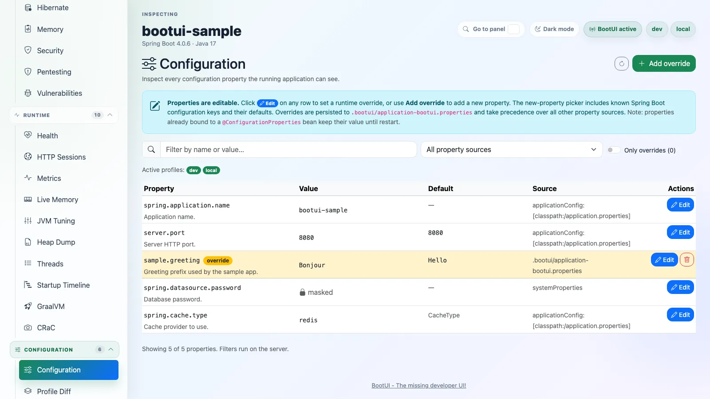
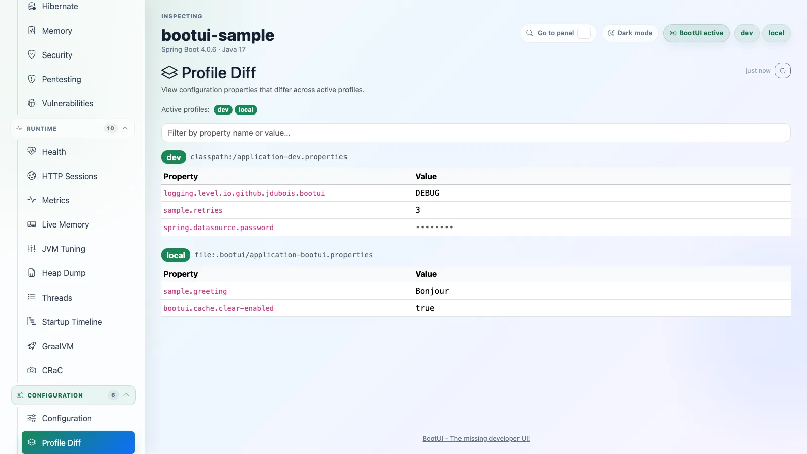
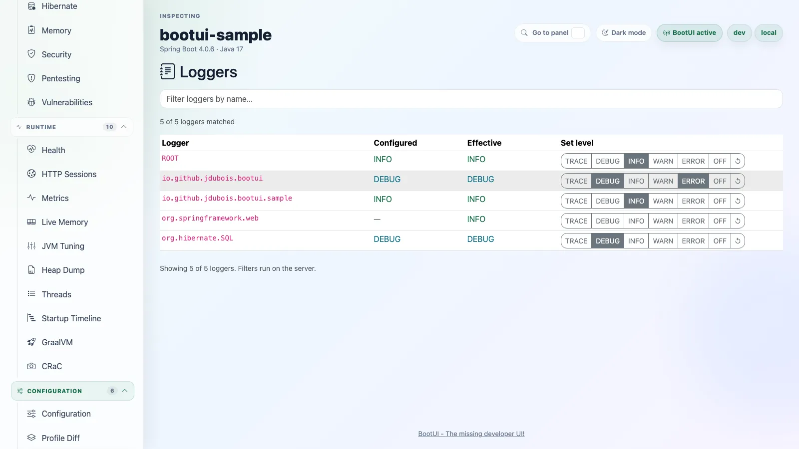
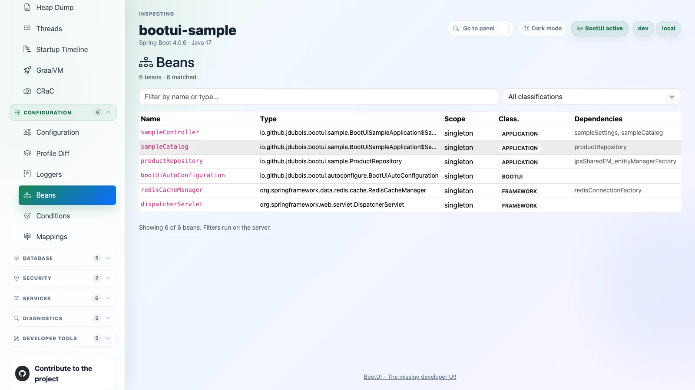
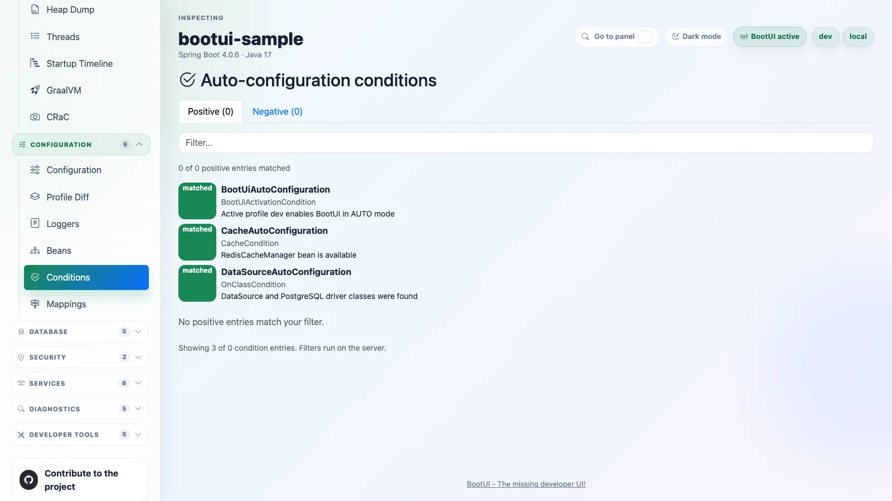
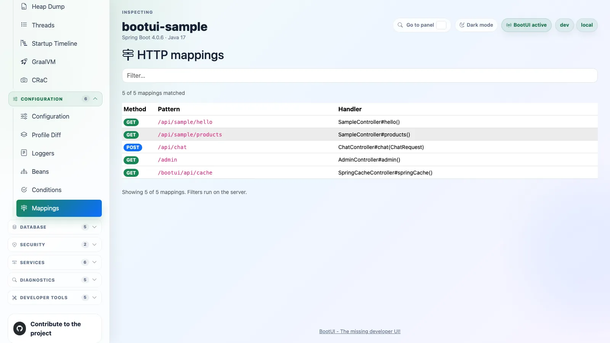

# Configuration

## Configuration

The Configuration panel shows effective configuration properties, sources, metadata descriptions, defaults when known,
active profiles, and masked values. It can create, update, and delete local runtime overrides persisted to
`.bootui/application-bootui.properties`, with restart and rebinding caveats shown for every mutation. Large property
tables load in bounded server-side pages for search, source, and override-only filters. The override property-name
picker limits its datalist suggestions while narrowing against the full metadata catalog as you type.

## Profile Diff

The Profile Diff panel compares profile-specific property sources and values. It is useful for understanding what
changes between local development profiles while still routing browser-visible names and values through BootUI's secret
masking rules.

## Loggers

The Loggers panel lists runtime logger configuration. On Spring Boot it reads from Actuator's loggers endpoint. It shows
configured and effective levels, supports server-side search, and can update or clear logger levels without restarting
the application. Large logger lists load in bounded pages while filtering still searches the full logger set.

On Quarkus the panel is identical, served over the JBoss LogManager that Quarkus uses at runtime: it enumerates the live
loggers, maps their levels onto the same canonical vocabulary (`OFF`, `FATAL`, `ERROR`, `WARN`, `INFO`, `DEBUG`,
`TRACE`), and applies level changes to the running JVM. BootUI refuses to change the level of its own loggers on either
platform.

## Beans

The Beans panel helps answer which application-managed beans exist, how they are connected, and where they came from. A
labeled Graph/List segmented control switches between the dependency visualization and the server-paged bean inventory,
both of which support server-side search across bean names and types plus classifications (application, Spring framework,
Java/Jakarta, and other beans). BootUI's own beans are hidden by default, and the empty BootUI classification option is
omitted; when self-data filtering is disabled they are classified separately as BootUI beans and the option appears.
Large bean lists load in bounded pages so the initial payload stays small while filters still apply to the full bean set.

### Dependency graph mode

The panel opens on the dependency neighbourhood graph; a header toggle switches to the server-paged list when needed. On
first open the graph selects the connected application bean with the most direct dependencies and dependents (breaking
ties alphabetically) and centers its node. A search field accepts a bean name, alias, or unique type match, and a
classification control switches the graph between Application, Framework, BootUI, Platform, Other, or all beans. Clicking
any node re-focuses the graph on that bean, so you can navigate the neighbourhood iteratively.

::: details Graph rendering, limits, and accessibility

Graph mode fetches beans in bounded 1 000-row pages, up to a 2 000-bean client-side inventory; if the inventory is
larger, the panel reports both the loaded and total counts. Focus search starts with Application beans selected; the
selected classification applies to both focus choices and rendered neighbours, so the Application graph contains only
host-application beans.

The graph renders a concentric-ring SVG showing the focused bean at the centre, its direct dependencies (beans it depends
on, coloured blue), its direct dependents (beans that depend on it, coloured green), mutual/cycle nodes (amber), and
deeper-hop nodes (grey) up to three hops away and sixty nodes in total. Zoom-out, reset, and zoom-in controls scale the
graph from 60% to 200% while its scroll region keeps large layouts bounded. When the sixty-node or three-hop limit is
hit, a notice identifies the bound and invites you to re-focus. Duplicate bean names are combined deterministically and
explained instead of silently dropping one definition.

A focused-bean details area shows type, scope, resource, aliases, definition count, and direct relationship counts. When
a Spring bean's recorded classpath resource establishes an exact configuration class, the panel queries the existing
positive Conditions endpoint and shows only matching class or method-level evidence under "Why this bean exists"; missing,
disabled, failed, or unmatched Conditions data is reported honestly instead of inferred.

Graph and list implementations are split into separate loading paths: opening the default graph does not fetch the
server-paged list, and switching to the list loads it only once. Each bean name in the list is a keyboard-accessible link
back to its focused graph and automatically selects that bean's classification. Keyboard navigation uses one graph tab
stop, arrow/Home/End movement between nodes, and Enter or Space to re-focus; all nodes carry visible focus rings and
`aria-label` attributes with the full bean name. The static layout introduces no motion, and its role colours meet
contrast requirements in both light and dark themes.

:::

::: details Quarkus dependency capture

Arc resolves injection points during augmentation rather than exposing its wiring model at runtime, so the Quarkus
deployment adapter captures the retained beans' resolved injection edges after Arc validation and emits them as a
generated classpath resource. The runtime adapter overlays those edges on the live CDI inventory, giving graph mode the
same `BeanSummary.dependencies` contract as Spring. The details area still explains that Spring Boot Conditions evidence
and defining resources are unavailable on Quarkus.

:::

On Quarkus the panel is identical from the UI's point of view. The adapter enumerates beans from the live Arc/CDI
container (in place of the Spring adapter's Actuator beans endpoint), filters out BootUI's own beans, and classifies them
with Quarkus-aware framework prefixes (`io.quarkus.`, `io.vertx.`, `org.jboss.`, …). A few fields have reduced fidelity
because Arc does not expose them at runtime the way Actuator does. The defining `resource` is empty, the `scope` uses the
CDI vocabulary (`ApplicationScoped`, `Singleton`, …) rather than Spring's `singleton`/`prototype`, and unnamed beans get
a synthetic decapitalized class name. The inventory also reflects only the beans Arc retains, since Arc removes unused
beans at build time.

## Conditions

The Conditions panel explains Spring Boot auto-configuration decisions. It groups positive matches, negative matches,
and unconditional classes so you can see why an auto-configuration applied or why it was skipped. Large condition reports
load in bounded pages, and filtering runs on the server so the browser does not need the full report before narrowing
results.

## Mappings

The Mappings panel lists HTTP routes from the running application's route table (Actuator mappings data on Spring Boot,
the JAX-RS resource table on Quarkus). It shows request methods, path patterns, handlers, and
produces/consumes metadata so the running application's web surface is visible without reading controllers manually.
Large mapping lists load through a stable, paged BootUI DTO, and the filter continues to search every discovered route
on the server.

On Quarkus the same panel is served by scanning the application's JAX-RS resources from the build-time Jandex index
(Vert.x exposes no clean runtime route-enumeration API carrying the per-route method and produces/consumes the panel
renders), then mapping each JAX-RS resource method one-to-one onto the same paged, filterable DTO the Spring adapter
serves from Actuator. `quarkus-rest` is a hard dependency of the BootUI extension, so the panel is available on both
frameworks; BootUI's own `/bootui` routes are filtered out on each.
