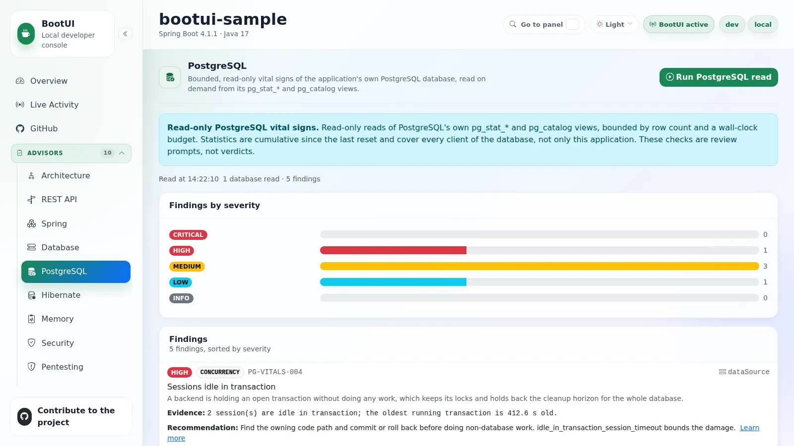
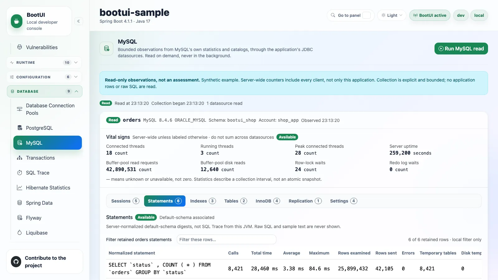

# Database

These panels read the database your application is already connected to. The rule-based scans live in the
[Database and Hibernate advisors](advisors.md).

## Database Connection Pools


The Database Connection Pools panel inspects supported JDBC pool beans. It is read-only: it never executes SQL,
borrows a connection, or resizes a pool, and it fails closed when no supported pool implementation or pool bean is
present.

For each pool it shows the pool identity, the masked JDBC URL and username, the driver, the minimum and maximum
sizing, and the timeout and lifetime settings. Closed and uninitialized pools carry a clear unavailable reason. A live
chart polls bounded snapshots of active, idle, total, and pending connections every two seconds, so you can watch
saturation trends without leaving the console.

::: details On Quarkus: served over Agroal

The panel is served over **Agroal** (Quarkus' pool library) instead of HikariCP. A Quarkus provider maps the live Agroal
pool configuration and `AgroalDataSourceMetrics` (active/available/awaiting counts) into the same DTO shape, so the panel
looks and behaves identically. Pool metrics require `quarkus.datasource.jdbc.metrics.enabled=true`; with metrics disabled
the pool configuration still renders but the live snapshot is marked unavailable. A few Hikari-specific fields have no
faithful Agroal equivalent and are reported as neutral defaults (per-call validation timeout, keepalive interval, and
read-only flag).

:::

## PostgreSQL



The PostgreSQL panel is a runtime view of the application's own PostgreSQL database. It answers "what does PostgreSQL
report about this database right now?" and shows the answer as tables you read yourself. Each datasource is one card:
its vital signs stay in view and the other sections are tabs, so reading a section never means scrolling past the ones
before it. Each tab carries its row count, or a skipped/failed marker with the reason when a section could not be read,
so the state of the sections you are not looking at is still visible, and a missing extension never looks like an
empty table.

Reads are explicit: opening the panel shows the last report, and PostgreSQL is queried when you click
**Run PostgreSQL read**. A second read adds a short "what changed since the previous read" list, kept in memory only.
The panel reports the server's own numbers and leaves the judgement to you: there is no rule catalogue, no severity,
and no score.

| Section | What it shows |
| --- | --- |
| Vital signs | Cache hit ratio, rollbacks, connections, transaction-id age, database size, and deadlocks, always visible on the datasource card. |
| Sessions | A live snapshot of `pg_stat_activity` at the instant of the read: each backend's state, wait event, blocking pids, transaction age, and statement. It lists the client backends of the database this datasource connects to, and ages are measured against the server's statement clock, so they stay true however long the read itself takes. |
| Statement ranking | The top normalized statements from `pg_stat_statements`, ranked by total execution time. |
| Index usage | Index usage per relation, so you can see which indexes the server actually reads. |
| Largest relations | Relation size and access shape, including sequential and index access. |
| Autovacuum health | Dead tuples, last (auto)vacuum and analyze, and a "due" estimate computed from the settings the server would apply to each relation. |
| Replication, checkpoints and WAL | Connected replicas with their state and lag, plus checkpoint and WAL activity. |
| Notable settings | A curated allow-list of operational settings. |

Apart from Sessions, every section is cumulative since the last statistics reset.

::: details How it relates to the Database advisor and SQL Trace

Three panels look at the database from three angles, and they complement each other:

- **Database advisor** checks physical schema structure — keys, indexes, constraints, sequences, and Hibernate mapping
  cross-references — from metadata and vendor catalogs.
- **SQL Trace** shows statements this JVM recently issued through BootUI's local JDBC instrumentation.
- **PostgreSQL** reads PostgreSQL's own cumulative `pg_stat_*` and `pg_catalog` views, which include work from every
  client of the database and statistics since the last reset.

:::

::: details Safety and bounds

The panel runs one read-only transaction per datasource and pins `statement_timeout` to 5 seconds, `lock_timeout` to
2 seconds, and the read budget to 15 seconds. By default, list sections are capped at 100 sessions, 100 statements,
500 indexes, 200 tables, 200 autovacuum rows, 10 replicas, and 40 settings per datasource. `truncated` means a row cap was reached; exhausting the
time budget instead produces an explicit section reason and preserves rows already read. A budget-limited section
with no retained rows is failed rather than shown as an empty successful read. Every statistics query runs inside its
own savepoint, because one error would otherwise abort the shared read-only transaction and make every later section
report "current transaction is aborted" instead of its own content.
When only the **Statement ranking** reaches its cap, the panel shows one informational note inside that section:
it shows the top 100 statements by total execution time, with additional statements omitted. An expected top-N
ranking does not produce page-wide warnings, a duplicate limitations disclosure, or warning badges. Other row caps
still produce **Limited results**, naming each affected datasource and section with its retained row count.
These caps limit the statistics returned, not application data. The API, MCP, and CLI retain `PARTIAL` and `truncated=true` and report
each capped section in `limitations`. Permission failures, timeouts, and other read problems remain explicit,
including when a statement cap is also reached; in that case the page-wide warnings and limitations remain visible.

Configure the row caps in the host application's `application.properties`. These keys and defaults are the same on
Spring MVC, Spring WebFlux, and Quarkus:

```properties
bootui.postgresql.max-sessions=100
bootui.postgresql.max-statements=100
bootui.postgresql.max-indexes=500
bootui.postgresql.max-tables=200
bootui.postgresql.max-vacuum-tables=200
bootui.postgresql.max-replicas=10
bootui.postgresql.max-settings=40
```

Every value must be a positive integer below `2147483647`; zero does not mean unlimited. Invalid values are rejected,
not silently clamped. Restart the application after changing a limit. Limits apply independently to every datasource
and to the same reads reached through the browser, API, MCP, and CLI. BootUI reads at most one extra row to detect
truncation; it does not issue an extra count query or claim a total for the omitted rows. Raising these limits does
not change the time budgets or the settings allow-list, and larger reads may still run out of time.
See the [property reference](../PROPERTIES.md#postgresql) for each limit's scope.

No baseline is written to disk; only the last value seen for each metric is kept in memory so the panel can show simple
deltas. That baseline is merged rather than replaced, so a read that could not reach a section keeps the earlier value
of that section instead of erasing it and reporting "no change" next time.

The **Notable settings** list excludes `statement_timeout`, `lock_timeout`, and
`idle_in_transaction_session_timeout`: BootUI overrides these for its own read, so showing their current session
values would misrepresent the application's settings. These safety pins remain in effect.

BootUI refuses a connection already in manual-commit mode before reading metadata or issuing SQL, and does not commit
or roll back that connection. This includes pools configured to return connections with auto-commit disabled, such as
`spring.datasource.hikari.auto-commit=false`, even when the borrowed connection has no active transaction. The read
reports an error explaining this restriction; BootUI cannot safely distinguish a pool default from an
application-owned transaction and does not change the application's transaction configuration.

The autovacuum section's "due" column is computed from the settings the server would actually use for each relation:
the cluster's `autovacuum_vacuum_threshold`, `autovacuum_vacuum_scale_factor` and — on PostgreSQL 18 and later —
`autovacuum_vacuum_max_threshold`, each overridden by that table's own `reloptions`, and suppressed where the table sets
`autovacuum_enabled = false`. Two approximations are stated in the
section rather than hidden: the estimate comes from `pg_stat_user_tables`, whereas autovacuum itself uses
`pg_class.reltuples`, and only the dead-tuple trigger is modelled, so an insert-only table that PostgreSQL 13 and later
would vacuum via `autovacuum_vacuum_insert_threshold` reads as "not due for dead tuples".

Values are gated by the global exposure policy. Session statement text is the verbatim text the client sent, so it is
redacted, masked and truncated exactly like the normalized text from `pg_stat_statements`. Under `MASKED` or
`METADATA_ONLY`, statement text has string literals
and dollar-quoted bodies (`$$ ... $$`, `$tag$ ... $tag$`, which is how `CREATE FUNCTION` and `DO` blocks reach
`pg_stat_statements`) replaced before it leaves the engine, and both session and replica client addresses are masked under
`METADATA_ONLY`. Error messages from failed statistics reads are redacted the same way before becoming a diagnostic.

:::

::: details Availability and permissions

The panel is available on Spring MVC, Spring WebFlux, and Quarkus only when a PostgreSQL datasource is configured. That
decision is taken from declared configuration alone — the JDBC URL each datasource exposes (including through a wrapping
driver such as `jdbc:aws-wrapper:postgresql://...`), or the Quarkus `db-kind` — so rendering the sidebar still contacts no
database. A datasource that declares no readable URL cannot be ruled out, so the panel stays available when the
PostgreSQL driver is on the classpath, and a non-PostgreSQL datasource reached by the read is skipped with a clear
diagnostic. Use a read-only database role that is a member of `pg_monitor` when possible. Without it PostgreSQL
restricts its statistics views in two different and individually invisible ways: `pg_stat_activity` **removes** the rows
of backends the role does not own, so the session list silently shrinks to BootUI's own connections, while
`pg_stat_statements` **keeps** every row and replaces the statement text with `<insufficient privilege>`. Neither leaves
anything in the result set to notice, so BootUI asks the server instead — it probes `pg_read_all_stats` membership
before reading — and marks both sections partially read when the privilege is missing. The statement ranking is also
degraded whenever the placeholder actually appears, so a managed or forked PostgreSQL that answers the probe
differently from the way it restricts the view is still reported honestly. `pg_stat_replication` restricts a third way
again: every connected replica is still listed, so the replica count is trustworthy, but each one's state, sync state
and lag come back empty, and that degrades the replication section too. The connection total is taken
from `pg_stat_database`, which every role reads in full, so it stays correct either way. The statement ranking section
additionally requires `pg_stat_statements`.

On a standby the replica list and primary-relative lag are not read; cascading replicas may still be connected.
The report sets `replication.replicasAvailable=false` for this case and for a failed replica-list query.
An empty list means no connected replicas only when `replicasAvailable=true`; failures in checkpoint or slot reads
do not invalidate a successfully read replica list.

:::

## MySQL



The MySQL panel is the operational sibling of the PostgreSQL panel: it answers "what does the connected server report,
and which observations can be associated with this datasource's schema?". Each datasource is one card: its vital signs
stay in view and the other sections are tabs. Counts and local filters describe the retained rows, and a section that
could not be read names its reason, so incomplete evidence never reads as an idle server.

Reads are explicit: opening the panel shows the last in-memory report, and MySQL is queried when you click
**Run MySQL read**. The panel reports the server's own evidence and leaves the judgement to you: there are no grades,
severities, advisor recommendations, or contributions to Overview scores. It reads MySQL's own Performance Schema and
Information Schema evidence, which complements the Database advisor's schema-structure checks and SQL Trace's view of
the statements this JVM issued.

| Section | What it shows |
| --- | --- |
| Vital signs | Server-wide uptime, connections, buffer-pool and lock/log counters, always visible on the datasource card. |
| Sessions and blocking | Default-schema-associated sessions with state age and optional transaction age, plus bounded row-lock relationships and separately identified metadata waits. |
| Statement ranking | Normalized digests ranked by total execution time, with calls, durations, rows examined and sent, errors, and temporary-table evidence where collected. |
| Index handler operations | Selected-schema handler-operation statistics, showing which indexes the server actually uses. |
| Table estimates | Selected-schema engine, estimated rows and storage, and available table I/O. |
| InnoDB | Allow-listed buffer and dirty-page, log-wait, lock and deadlock, and history-list evidence where available and enabled. |
| Replication | The connected server's receiver and applier channel state, coordinator errors, and bounded worker and error summaries. |
| Settings | A fixed safe allow-list of global settings. |

Every value carries its scope — server-wide, selected schema, or default-schema-associated — and unknown values stay
unknown instead of being shown as zero.

::: tip Tested compatibility
**Oracle MySQL 8.4 LTS** is the tested server line, using `mysql:8.4.6` on Java 17:

| Stack | JDBC driver | Pool |
| --- | --- | --- |
| Spring MVC and WebFlux | Connector/J 9.7.0 | HikariCP 7.0.2 |
| Quarkus | Connector/J 9.6.0 | Agroal 3.0.1 |

MariaDB is a separate, unsupported follow-up. MySQL 5.7, other MySQL lines, compatible/managed flavors, and other
driver/pool combinations are not certified by this matrix. JDBC support does not imply R2DBC or reactive-client support.
:::

::: details Try it with the sample application

The Spring MVC sample has a
[`docker-mysql` profile](https://github.com/jdubois/boot-ui/tree/main/bootui-spring-sample-app#run-it-with-docker-and-mysql).
It replaces PostgreSQL with MySQL 8.4.6 for JPA and both migration tools, enables statement instrumentation, and
provisions the sample account's diagnostic grants. Run `bootui-spring-sample-app/run-local-mysql.sh` for the
lightweight MySQL-and-Redis stack; Kafka and Ollama are disabled, with no AI model downloads.
No separate Maven profile is required.

:::

::: details What each section does and does not establish

| Section | Precision and caveats |
| --- | --- |
| Vital signs | Server-wide counters, not this JVM's pool metrics; table storage estimates live in Table estimates, not in a schema-size vital sign. |
| Sessions and blocking | A sleeping session can still hold a transaction; state age is not transaction age. |
| Statement ranking | Normalized digests only — no raw or sampled SQL. |
| Index handler operations | Handler-operation statistics, not query counts or physical disk reads. The null-index bucket includes inserts, so no recorded reads is not advice to drop an index. |
| Table estimates | InnoDB estimates can be cached; BootUI does not run `COUNT(*)`, refresh statistics, or sum shared tablespace free space as reclaimable bytes. |
| InnoDB | Allow-listed metrics where available and enabled. This is not PostgreSQL autovacuum. |
| Replication | Basic channel evidence: no precise end-to-end lag, downstream topology discovery, or Group Replication administration. |
| Settings | An allow-list, not a variable dump. Values changed for BootUI's inspection session are not presented as application defaults. |

:::

::: details Read and report contract

These paths use the default API mount; custom `bootui.api-path` and application base paths apply normally.

| Surface | Cached evidence — no connection or SQL | Explicit collection |
| --- | --- | --- |
| REST | `GET /bootui/api/mysql` | `POST /bootui/api/mysql/read` |
| MCP | `get_mysql_report` | `mysql_read` |
| CLI | `bootui db mysql report` | `bootui db mysql read` |

Neither operation accepts SQL, a schema selector, or a server address. Collection uses the application's existing
datasources and credentials. Global `bootui.read-only` or `bootui.panels.mysql.read-only` blocks the action even though
it does not modify application data: it initiates external work. Cached reads remain allowed. Disabling
`bootui.panels.mysql.enabled` blocks both. The existing localhost, Host, authentication, and cross-site-write guards
apply; an overlapping read is refused, not queued or automatically retried.

Reports distinguish `NOT_READ`, `READ`, `PARTIAL`, `ERROR`, and `DISABLED`. `READ` means applicable sections completed
within their declared scope, not that the database is healthy. A section is `AVAILABLE`, `SKIPPED`, or `FAILED`, with
a reason when evidence is incomplete. Independent usable rows survive a failed section; no usable datasource evidence
from a supported target means `ERROR`. No supported datasource means `DISABLED`. A successfully read empty replication
list is different from unknown replication after a failed read.

The cache contains sanitized data, not raw values saved for later masking. An exposure-policy change invalidates it
and returns an explained `NOT_READ` state without SQL. A new explicit read is required, including after relaxing
exposure. Collection is an interval, not an atomic cross-table snapshot, and the report can become stale.

:::

::: details Scope, precision, and comparisons

- **Server** evidence can include other applications. Do not add repeated server counters from multiple pools pointing
  at one instance.
- **Selected schema** describes table/index metadata visible to the connected account. With no selected schema,
  schema-specific sections are skipped; BootUI does not enumerate every database.
- **Default-schema-associated** sessions and digests are not an inventory of every statement touching that schema:
  fully qualified cross-schema SQL may be associated elsewhere.
- Unknown values are `null`, not zero. Large/unsigned counters, byte sizes, and numeric identifiers are
  **exact decimal strings in JSON**. Bounded row counts and typed duration fields are numbers; generic metrics carry
  a nullable string `value` alongside their unit, scope, and source. Preserve exact strings when parsing or sorting;
  do not coerce them through an unsafe JavaScript `Number`. Timer fields carry explicit millisecond/second units.
- The first read has no invented rates. Later comparisons need compatible datasource, server identity, scope, and
  counter provenance, with their own observation interval. Restart/reset or server-change evidence invalidates a
  baseline; a partial read does not turn an older valid observation into a fresh one. Nothing is persisted to disk.
  Counter comparisons use the status query's own observation window, not the later completion of all collectors.
  Restart detection accounts for that window and integer-second uptime, so a slow subsequent section does not
  masquerade as a restarted database.

:::

::: details Safety and bounds

The execution bounds are a **15-second cooperative total read budget**,
a **5-second server SELECT limit**, a **2-second metadata-lock wait limit**, and **400 characters of displayed
normalized statement text**. SELECTs use MySQL `MAX_EXECUTION_TIME` hints capped by the remaining budget.
The borrowed connection also gets a JDBC network guard of **at most 7 seconds**, retaining a tighter existing
positive timeout, to bound control/SHOW I/O that SELECT limits do not cover.

When `performance_schema.global_status` is denied or otherwise unreadable, the fallback is `SHOW GLOBAL STATUS`
with a `WHERE Variable_name IN (...)` filter containing **17 fixed safe names**. That allow-list bounds output;
**SHOW does not share SELECT's `MAX_EXECUTION_TIME` guarantee**. Its I/O is guarded by
`Connection.setNetworkTimeout` at the smaller of an existing positive timeout and 7,000 ms, or 7,000 ms when none
is set. The original network timeout is restored afterward.

These are not a hard end-to-end deadline or a fresh 15 seconds per datasource. The application pool controls
connection-acquisition waiting, which can exceed the cooperative budget; application connection/socket configuration
remains separate. Raising a CLI timeout does not extend the collector's budget or change the pool. BootUI deliberately
uses neither `Statement.setQueryTimeout` nor `Statement.cancel`, avoiding Connector/J's auxiliary `KILL QUERY`
connections. The server and network guards do not depend on Connector/J's `enableQueryTimeouts` option being enabled.

The seven startup row caps, identical across the three JDBC adapters, are:

```properties
bootui.mysql.max-sessions=100
bootui.mysql.max-statements=100
bootui.mysql.max-indexes=500
bootui.mysql.max-tables=200
bootui.mysql.max-lock-waits=100
bootui.mysql.max-replication-channels=10
bootui.mysql.max-settings=40
```

Each applies per datasource. Values must be positive integers below `2147483647`; invalid values fail startup, and
zero is not unlimited. **Restart after changing a cap.** SQL-side bounds and an extra-row check distinguish exactly
the cap from omitted rows, without counting the omitted inventory. Lock relationships and replication worker detail
are bounded too; index limits must not silently cut a composite definition. Settings and InnoDB remain allow-listed.
See the [property reference](../PROPERTIES.md#mysql).

`truncated=true` means a BootUI row cap omitted results, not a failed query or timeout. MySQL digest overflow, disabled
instrumentation, denied sources, and time exhaustion have separate explanations. Local filters cannot retrieve
omitted rows, and there is no pagination/details API in this first scope. A cap-only `PARTIAL` report identifies the
retained window without suggesting that a source failed or needs additional permissions. The MySQL UI treats these
normal bounds as neutral **Limited** labels and section-local row-count notes, not a warning banner or amber
partial-read badges. Actual permission problems, timeouts, unavailable instrumentation, and other read failures
remain warnings or errors, including when a row cap is also reached. REST, MCP, and CLI still retain the honest
`PARTIAL`/`truncated` coverage contract.

Collection snapshots actual session settings, sets `transaction_read_only=1`, starts `START TRANSACTION READ ONLY`,
and verifies the server read-only setting. It deliberately avoids `Connection.setReadOnly`: that hint can reroute a
driver connection and need not propagate to the server. Manual-commit connections are refused before metadata or SQL,
without commit or rollback; BootUI cannot distinguish a pool default from an application-owned transaction.

After collection, BootUI rolls back only its own transaction and restores the original auto-commit, session settings,
and network timeout before returning the connection. A restoration failure triggers JDBC abort before closing the
pool handle. If abort also fails, one handle is quarantined rather than returned to the pool, and further collection
is disabled until the pool and BootUI are restarted. Live tests verify cleanup and physical connection eviction
with the driver/pool combinations listed above.
Monitoring itself consumes resources even when no application data is changed.

No application rows, `LOCK_DATA` key values, `QUERY_SAMPLE_TEXT`, `PROCESSLIST_INFO`, or `TRX_QUERY` are selected.
Only normalized digest text may be exposed, after masking, credential redaction, exposure policy, and length bounds.
Metadata-only mode withholds statement text and sensitive addresses. Raw JDBC URLs, arbitrary server errors,
replication secrets, and variable dumps are excluded in every mode. There are no session-kill controls, SQL console,
query plans, DDL, maintenance commands, or controls to change server/application configuration or instrumentation.

:::

::: details Availability and permissions

The panel supports the same JDBC capability on **Spring MVC, Spring WebFlux, and Quarkus**, including default and named
datasources. WebFlux does not require a servlet stack, but **R2DBC-only applications are unavailable**. On Quarkus,
use the MySQL JDBC extension (`quarkus-jdbc-mysql`) and a configured JDBC datasource; a reactive MySQL client alone
does not qualify. BootUI stays absent in Quarkus production builds.

Sidebar/tool discovery reads local declarations only, never a database. A candidate with unresolved vendor metadata
is not proof of MySQL support: the explicit action verifies the connected server and reports unsupported targets.
Wrapped/routing datasources must still lead to supported JDBC targets. Routing can select a replica; evidence
describes the actual connected server, not a presumed primary. Quarkus requires an active JDBC MySQL declaration
and Connector/J presence; unknown and reactive-only declarations are unavailable.

Use the application's existing account and grant only the visibility the operator approves. There is no MySQL
equivalent of a single `pg_monitor` capability flag. Table readability, active-role privileges, collection enabled
state, and timing availability are separate evidence.

| Optional visibility | What to authorize and what it unlocks |
| --- | --- |
| Status and settings | Probe readability of `performance_schema.global_status` before requesting additional permissions. An explicit table grant is not universally required for it: the restricted MySQL 8.4.6 fixture reads it without one. An unreadable status source can fall back to fixed-name `SHOW GLOBAL STATUS`. Settings use fixed `@@global` expressions, not a `global_variables` table read. |
| Session state | `SELECT` on `performance_schema.threads`. Reading `threads` exposes other users' thread rows **without `PROCESS`**; this is a meaningful permission decision. Current statement text is not selected, and `events_statements_current` is not required. |
| Blocking | `SELECT` on `performance_schema.data_lock_waits`, `data_locks`, and `metadata_locks` for the corresponding wait evidence. |
| Statement ranking | `SELECT` on `performance_schema.events_statements_summary_by_digest`, with the relevant collection and timing enabled. Global digest collection depends on `global_instrumentation` and `statements_digest`, not `thread_instrumentation`. |
| Table/index activity | `SELECT` on `performance_schema.table_io_waits_summary_by_table` and `table_io_waits_summary_by_index_usage`, with enabled global, handler, and matching object instrumentation. Information Schema object visibility still follows application-object permissions. |
| Instrumentation explanation | `SELECT` on `performance_schema.setup_consumers`, `setup_instruments`, and `setup_objects`. Denied probes leave collection state unknown, not enabled. |
| Replication | Table-specific `SELECT` on the receiver/applier status tables actually read: `replication_connection_status`, `replication_applier_status`, `replication_applier_status_by_coordinator`, and `replication_applier_status_by_worker` in `performance_schema`. No replication administration is needed. |
| Additional InnoDB detail | Optional global `PROCESS` for `information_schema.innodb_trx` and `innodb_metrics`. Other readable sections remain useful without it. |

This is a capability map, not a blanket minimum-grant script: inspect the reported source and the role active on the
application connection before changing permissions. Do not grant `SUPER`, use an administrative account, or grant all of
`performance_schema.*` merely to make the panel complete. BootUI never enables consumers, instruments, or InnoDB
metrics and never resets statistics.

Table/index activity respects MySQL's effective object configuration: exact table, schema wildcard, then global
wildcard. Object matching uses MySQL's identifier normalization; `%` is a whole-name wildcard, not a SQL `LIKE`
pattern. At most 1,024 relevant table rules are inspected. Missing or bounded configuration evidence remains
unknown rather than falling back to an assumed enabled rule. Uninstrumented/unknown objects retain readable
catalog metadata, but affected activity counters are withheld; untimed objects retain counts but not durations.
These limitations are explained per section rather than displayed as zero activity or `0 ms`.

Metadata-lock evidence separately checks `wait/lock/metadata/sql/mdl`; an empty list with disabled or unknown
instrumentation cannot establish absence. Like table I/O, metadata-lock collection needs global instrumentation,
not the per-thread consumer. Sessions and independently read row-lock waits remain visible.

Replication state/error tables remain readable when Performance Schema is disabled; BootUI does not use the
transaction-timing columns that disappear in that mode. Coordinator-only errors are included, and an unread
error source produces partial coverage rather than certifying zero errors.

:::

::: details When evidence is missing

| Situation | Interpretation and next step |
| --- | --- |
| No supported JDBC datasource / wrong vendor | Check the application's driver and datasource declarations. MariaDB and reactive-only clients are outside this panel's first scope. Do not create another monitoring pool automatically. |
| Permission denied / inactive role | Keep readable sections. Review the named source with the operator; table access and the role active on this connection matter, not just a grant recorded elsewhere. |
| Performance Schema, digests, or timing disabled | Missing evidence is not an idle workload or zero latency. Some status/replication evidence can remain readable with Performance Schema disabled. BootUI does not enable anything automatically. |
| Manual-commit pool default | Collection is refused to protect application transactions. Review the pool contract; do not change application transaction settings just to silence the diagnostic. |
| Restoration and abort both fail | The unsafe handle is quarantined and further collection is disabled. Restart the affected pool and BootUI before retrying; do not bypass the safeguard. |
| Timeout / acquisition wait | Check section reasons and the pool/network timeout configuration separately. Completed evidence remains usable; a timeout is not truncation or a healthy empty section. |
| Row cap only | Read the retained top-N window and named limitations. Raising a startup cap needs a restart and another authorized read; it cannot recover the old omitted rows or fix server digest overflow. |
| No default schema / replication read unavailable | Schema-specific sections or channel state are unknown/skipped as explained. Do not infer an empty database or no replication from missing evidence. |

:::

::: details MySQL reference documentation

Primary MySQL documentation: [thread scope and visibility](https://docs.oracle.com/cd/E17952_01/mysql-8.4-en/performance-schema-threads-table.html),
[table privileges](https://docs.oracle.com/cd/E17952_01/mysql-8.4-en/performance-schema-table-characteristics.html),
[lock data sensitivity](https://docs.oracle.com/cd/E17952_01/mysql-8.4-en/performance-schema-data-locks-table.html),
[statement summaries and digest overflow](https://docs.oracle.com/cd/E17952_01/mysql-8.4-en/performance-schema-statement-summary-tables.html),
[table estimates](https://docs.oracle.com/cd/E17952_01/mysql-8.4-en/information-schema-tables-table.html),
[InnoDB metrics](https://docs.oracle.com/cd/E17952_01/mysql-8.4-en/information-schema-innodb-metrics-table.html),
[replication evidence](https://docs.oracle.com/cd/E17952_01/mysql-8.4-en/performance-schema-replication-tables.html),
and [Connector/J buffering and why its auxiliary cancellation path is avoided](https://docs.oracle.com/cd/E17952_01/connector-j-en/connector-j-reference-implementation-notes.html).

:::

## SQL Trace


The SQL Trace panel shows the SQL statements your application recently executed. Capture uses a hand-written JDBC tracing
proxy on the JDK's own dynamic-proxy support — BootUI bundles **no** third-party database-proxy library. Each recorded
execution row expands to reveal the full statement, bound parameters, statement type, connection id, executing thread,
call site, and error.

Executions are retained in a bounded in-memory ring buffer (most recent first) with aggregate stats: total/average/max
time, slow-query and failure counts, per-category counters, and evictions. A configurable slow-query threshold highlights
expensive statements, and local-only **Pause/Resume** and **Clear** actions stop recording or empty the buffer without
unwrapping the data source. Repeated `SELECT`s that look like an **N+1 access pattern** are flagged (repeat count set by
`bootui.sql-trace.n-plus-one-threshold`); a flagged group lists the distinct call site(s) — class, method, line —
most-recently-seen first and bounded to a handful, so you can jump straight to the repository or service method causing
the repetition.

::: details How capture works

BootUI transparently wraps each `DataSource` bean and intercepts statement execution on the resulting
`Connection`/`Statement`/`PreparedStatement`/`CallableStatement` objects, recording the SQL text, statement type, SQL
category (`SELECT`/`INSERT`/`UPDATE`/`DELETE`/`DDL`/`OTHER`), wall-clock duration, affected-row counts, batch size,
originating connection, executing thread, the call site that triggered it (when call-site capture is enabled), and any
failure. A Spring `DataSource` wrapper is never replaced, because its concrete type is part of your application's
contract: instead, when it owns the only reference to a pool — as `spring.datasource.connection-fetch=lazy` does with
`LazyConnectionDataSourceProxy` — the pool inside it is traced in place, and when its target is a bean that was traced
on its own it is left alone so executions are not double-counted. Wrapping
**fails open**: if a `DataSource` cannot be proxied it is left untouched so application database access is never
compromised.

:::

### Rankings

Above the execution list the panel ranks the retained window twice. Both tables deep-link into the filtered execution
list below, so a slow ranking row is one click away from the individual executions behind it.

**Statement rankings** aggregate executions by a normalized statement — literals and existing bind markers are collapsed
to `?` and `IN (…)` lists folded, so equivalent parameterized executions group together without ever exposing a bound
value. They rank by cumulative duration, slowest single execution, execution count, average duration, error count, p95,
or p99, alongside p50/p95/p99 durations and each group's share of retained database time. A statement that scores zero on
the selected criterion is not ranked for it, so "top by errors" never lists statements that never failed. This is a
*different* grouping from the **Most frequent statements** table (a fallback shown when statement rankings are
unavailable), which keeps literal values so you can see the exact statements that repeated.

**Database time by request route** attributes those executions back to the inbound requests that issued them. Each route
row shows its requests, executions, distinct statements, error count, and share of retained database time, and expands to
that route's own top statements.

::: details How route grouping resolves a template

Grouping uses the framework's own route template (`GET /api/sample/orders/{id}`) when the adapter can supply one,
otherwise matches the captured path against the application's own declared route mappings, and falls back to a masked
path — identifier-looking segments replaced with `{value}`, query string discarded — only when neither is available.
Matching a declaration is deliberately strict: it must agree segment for segment and be the single most literal match,
and two equally plausible declarations produce no template at all. That strictness is a privacy property as much as a
grouping one, because masking alone cannot tell a word-shaped path parameter such as `/api/users/alice` from a fixed
route segment.

:::

### Attribution is evidence, not lifetime metrics

These rankings are **diagnostic evidence over the bounded capture window**: they describe only the statements still
retained in the ring buffer, and the panel states that window — retained statements, buffer size, evictions, and the age
of the oldest retained execution — inline. Attribution is deliberately conservative and correlates a statement to a
request in tiers, each requiring a single unambiguous candidate:

| Tier         | When used                                     |
| ------------ | --------------------------------------------- |
| Trace id     | Always tried first                            |
| Serving thread | JVM only, where thread affinity is reliable |
| Time window  | Last resort                                   |

Executions it cannot place, and executions more than one request matched equally well, are kept in explicit
**Unattributed** and **Ambiguous** buckets rather than being dropped or guessed. A statement carrying a trace id no
retained request carries is left unattributed rather than handed to a weaker tier, and a statement already running when a
request began is never absorbed into it.

On Spring WebFlux and Quarkus a request is not pinned to one thread, so only trace-id and time-window correlation are
used and the panel says so. On WebFlux the request evidence arrives with the OpenTelemetry integration; without it the
panel reports route attribution as unavailable and names the requirement, while rankings still work. Quarkus has no
per-request route template, so it resolves declared JAX-RS mappings after the fact and falls back to a masked path.

### Privacy and configuration

The panel is read-mostly and privacy-conscious. Parameter bindings are **not** captured by default; even when capture is
enabled they are suppressed under metadata-only value exposure and routed through BootUI's masking rules, with an inline
warning when captured parameters are shown in clear text. Call-site capture is separate: a call site is metadata about
your own code (class, method, line), never a bound value, so it is **not** privacy-gated. `bootui.sql-trace.capture-call-site`
defaults to `true` and only trades a small, defensively-bounded stack walk per statement for the ability to see where a
query came from; set it to `false` to skip that walk. The panel fails closed when no `DataSource` bean is wrapped. Tracing, the initial recording state, parameter capture, call-site capture, buffer
size, the slow-query and N+1 thresholds, and SQL/parameter truncation limits are all configurable under
`bootui.sql-trace.*`.

The panel refreshes over **Server-Sent Events** instead of fixed-interval polling: the browser subscribes to
`/bootui/api/sql-trace/stream` and the server pushes a small coalesced notification the moment a statement is captured,
the buffer is cleared, or recording is paused/resumed, prompting a re-fetch. The push carries no data — masking,
truncation, and value-exposure rules still apply through the regular endpoint — and bursts of statements fold into a
single refresh. When the auto-refresh toggle is off or the tab is hidden the stream is closed, and the panel falls back
to its initial load when Server-Sent Events are unavailable.

> **GraalVM native images are supported.** The tracing proxies are created over a fixed set of standard JDBC API
> interfaces, and those JDK proxies are registered as native-image proxy metadata by BootUI, so SQL Trace works in a
> native executable. If a proxy ever cannot be created (for example an interface set that was not registered), wrapping
> still fails open and the `DataSource` is left untraced rather than breaking application startup.

::: details Vendor-interface preservation on the JVM

On the JVM (Spring MVC and WebFlux), the traced proxy also advertises every interface the original `DataSource` bean's
concrete class implements, so a vendor-specific contract — such as Oracle UCP's `PoolDataSource` — survives wrapping and
by-type/by-interface injection of that vendor interface keeps resolving to the traced proxy. This extra interface set is
not used in a GraalVM native image, where the interface set must be known and registered at build time; native images
keep using the fixed, pre-registered set above.

:::

::: details On Quarkus: two feeders reach Spring parity

The panel is identical, running over the same engine recorder (buffer, grouping, stats, N+1 detection, and call-site
capture are byte-identical to Spring). Capture comes from two complementary feeders:

- an `@Alternative` Agroal `DataSource` that wraps the default pool with the same JDK-proxy tracer. It handles manual
  JDBC access and is gated on a datasource being present.
- a `@PersistenceUnitExtension` Hibernate `StatementInspector` that records ORM-issued SQL for the default persistence
  unit (gated on `quarkus-hibernate-orm`; SQL from a named persistence unit is not traced). This is needed because
  Hibernate ORM resolves its pool from Agroal's own registry and so bypasses the CDI `DataSource`.

Between them the panel reaches parity with Spring whether SQL originates from raw JDBC or the ORM. Statement text, type,
category, execution count, and N+1 detection are full-fidelity; for ORM SQL the per-statement duration, affected-row
count, and bound parameters are not available (the `StatementInspector` SPI exposes only the SQL text at prepare time,
with no execution-end hook), so those degrade cleanly while never leaking ORM parameter values. Both feeders are wired in
dev/test only and never in production.

:::

## Hibernate Statistics


The Hibernate Statistics panel exposes a live, read-only snapshot of Hibernate's own `org.hibernate.stat.Statistics` for
the application's `SessionFactory`. It is a continuously-refreshing runtime monitor — closer in spirit to Database
Connection Pools or SQL Trace than to an advisor — and is deliberately separate from the Hibernate Advisor panel, which
runs static on-demand checks and reports findings.

The snapshot covers session/transaction counts (opened/closed sessions, flushes, connections, transactions, successful
transactions), entity and collection load/fetch/insert/update/delete/recreate/remove counts, query execution counts (and
the slowest recorded query), and — when enabled — query-cache and second-level-cache hit/miss/put counters, including
per-region second-level cache breakdowns.

- **Availability gating**: the panel requires a resolvable Hibernate `SessionFactory` (via
  `EntityManagerFactory#unwrap(SessionFactory.class)`). When statistics collection is disabled, the panel offers an
  explicit **Enable for this runtime** action. It calls `Statistics#setStatisticsEnabled(true)`, starts collecting from
  that moment, and does not rewrite application configuration. The persistent startup alternatives remain
  `hibernate.generate_statistics=true` and `quarkus.hibernate-orm.statistics=true`; this is the same HIB-CONFIG-007
  recommendation the static advisor makes (see [HIBERNATE-CHECKS.md](../HIBERNATE-CHECKS.md)).
- **Read-mostly**: the only mutation enables future collection for the current runtime and is covered by BootUI's
  localhost, cross-site-write, and panel read-only policy. There is no reset/clear action, so BootUI never discards
  Hibernate's counters.
- **Out of scope for this iteration**: no per-entity or per-query drill-down beyond what `Statistics` itself
  exposes (e.g. no per-entity-class breakdown, no query-by-query cache stats); only the **first** resolved
  `EntityManagerFactory`/`SessionFactory` is inspected, so multi-persistence-unit applications only see statistics
  for one persistence unit — a known limitation for a future iteration.
- **Not filtered by `bootui.monitoring.exclude-self`**: Hibernate statistics are process-global counters on the
  `SessionFactory`, not per-request/per-caller data, so there is nothing to attribute to "self" the way HTTP
  exchange or SQL-trace filtering does. BootUI's own entity-metamodel introspection for the advisor scan does not
  open sessions or transactions, so it does not inflate these counters in practice, but this is a documented
  limitation rather than an enforced filter.

The panel is identical on Quarkus, gated on the same Hibernate ORM capability as the Hibernate advisor panel.

## Transactions


The Transactions panel shows the `@Transactional` boundaries your application recently ran — begin, commit, and rollback
events — captured by BootUI's own listener wiring, **not** a third-party transaction-observability library. On Spring MVC
and WebFlux, BootUI contributes a `TransactionExecutionListener` (Spring Framework 6.1+) through Spring Boot's standard
transaction-manager customization, completing registration for user-defined `ConfigurableTransactionManager` beans after
singleton initialization. It composes with (never replaces) the application's own transaction management and listeners.
Managers that do not implement the configurable listener SPI remain unobserved.

Transactions are retained in a bounded in-memory ring buffer (most recently completed first) with aggregate stats
(total/average/max duration, slow- and connection-held counts, commit/rollback/unknown outcome counts, and nested-
transaction count). The panel renders a parent/child tree so a root transaction's nested calls are visible directly
underneath it, and each row expands to reveal its thread, trace id, read-only flag, and any error. Configurable
slow-transaction and connection-hold-time thresholds flag transactions worth a closer look, and local-only
**Pause/Resume** and **Clear** actions stop recording or empty the buffer without deregistering the listener.

::: details What each captured transaction records

Each captured transaction records:

- the declared boundary name, typically `ClassName.methodName`.
- a best-effort `propagation` classification. `NEW` means the manager actually started a transaction; `PARTICIPATING`
  means it joined one already active on the same thread. Spring's listener SPI does not expose the declared `Propagation`
  enum value itself.
- the JDBC isolation level active at begin time.
- the outcome — `COMMITTED`, `ROLLED_BACK`, or `UNKNOWN` when a begin/commit/rollback threw.
- start/end timestamps and wall-clock duration.
- the enclosing transaction's id, so nested transactions form a call tree.
- the executing thread and, when present, the active Micrometer/W3C trace id.

Each entry is also correlated, by thread and time window, to the executions already captured by the SQL Trace panel,
surfacing the number of SQL statements and distinct JDBC connections a transaction touched without instrumenting anything
twice.

:::

The panel is read-mostly: transaction metadata (method names, propagation, isolation, thread names, trace ids) is not
sensitive application data the way bound SQL parameters are, so none of it is masked or gated behind value-exposure
settings. It fails closed — reporting unavailable with a clear reason — when no `PlatformTransactionManager` bean exists,
or when a WebFlux application uses only a `ReactiveTransactionManager` (R2DBC), since Spring's transaction-execution
listener hook exists solely on the blocking `PlatformTransactionManager` SPI. Capture, the initial recording state,
buffer size, and the slow-transaction and connection-hold thresholds are all configurable under `bootui.transactions.*`.

The panel refreshes over **Server-Sent Events**: the browser subscribes to `/bootui/api/transactions/stream` and the
server pushes a small coalesced notification whenever a transaction completes, the buffer is cleared, or recording is
paused/resumed. When the auto-refresh toggle is off or the tab is hidden the stream is closed, and the panel falls back
to its initial load when Server-Sent Events are unavailable.

::: details Sample app scenarios and MCP exposure

The Spring sample's product list and uncached product-search operations use explicit read-only service transactions, so
loading or checking products produces representative entries here as well as in SQL Trace. Its sample action lab has a
one-click transaction scenario set that generates committed, slow, rolled-back, and nested boundaries, plus a Hibernate
second-level cache action that loads one entity through two persistence contexts to produce visible miss, put, and hit
counters in Hibernate Statistics. When the opt-in MCP Server is enabled on Spring MVC or WebFlux, `get_transactions`
exposes the same bounded, local-only report to an agent; it is not advertised on Quarkus because transaction capture is
not available there.

:::

> **Quarkus is not applicable.** Quarkus' transaction management goes through Narayana's JTA `TransactionManager`/
> `Synchronization` or the CDI `@Transactional` interceptor, neither of which exposes a comparable per-boundary listener
> hook without much more invasive instrumentation than Spring's opt-in listener registration. Rather than force false
> parity, the Quarkus endpoint always reports unavailable with a clear reason explaining the gap.

## Spring Data


The Spring Data panel inspects Spring Data repositories. It shows repository interfaces, domain types, ID types, and query
methods, and degrades to a clear empty state when Spring Data is not present or no repositories are registered.

## Flyway


The Flyway panel shows schema migrations for each `Flyway` bean in the context and lists, per database, the current schema
version together with applied and pending migrations (version, description, type, script, state, installed-by,
installed-on, execution time, and checksum). Multiple or named datasources appear independently. When Spring Modulith
module-aware Flyway migrations are active, the panel shows the root and module-specific history tables separately so
module-local migrations are visible even though Spring Modulith creates those Flyway views only during migration.

The panel also exposes confirmation-gated `migrate` and `clean` actions. They are available by default for trusted local
sessions and are blocked by `bootui.read-only=true` or `bootui.panels.flyway.read-only=true`; `clean` also requires
Flyway's own `clean-disabled=false` setting. Spring Modulith module-aware entries are read-only in BootUI because their
module-specific history tables are managed by Spring Modulith's migration strategy. The panel degrades to a clear empty
state when Flyway is not on the classpath or no `Flyway` beans are present.

On Quarkus the panel is identical, because both frameworks use the same `org.flywaydb.core.Flyway` library. The Quarkus
adapter reads the active `io.quarkus.flyway.runtime.FlywayContainer` beans (one per datasource, default or
`@FlywayDataSource`-named) and exposes the same confirmation-gated `migrate`/`clean` actions, with `clean` likewise
honoring Flyway's disabled-by-default setting (`quarkus.flyway.clean-disabled`). The optional `quarkus-flyway` extension
is capability-gated, so when it is absent the panel reports an honest "add the quarkus-flyway extension" reason rather
than failing. The Spring Modulith module-aware history block is Spring-specific and is not reported on Quarkus.

## Liquibase


The Liquibase panel shows change sets for each discovered Liquibase database (on Spring Boot, each `SpringLiquibase`
bean; on Quarkus, each active `LiquibaseFactory` — including `@LiquibaseDataSource`-named datasources). It reads the
change-log history and configured changelog, then lists applied and pending change sets per database (id, author,
change-log, description, comments, execution type, date executed, order executed, checksum, tag, deployment id,
contexts, and labels). Multiple or named datasources appear independently.

The panel also exposes a confirmation-gated `update` action that applies pending change sets. It is available by default
for trusted local sessions and is blocked by `bootui.read-only=true` or `bootui.panels.liquibase.read-only=true`
(enforced identically on Spring and Quarkus). The panel fails closed per database when its history cannot be read
and degrades to a clear empty state when Liquibase is not on the classpath or no Liquibase databases are present.
