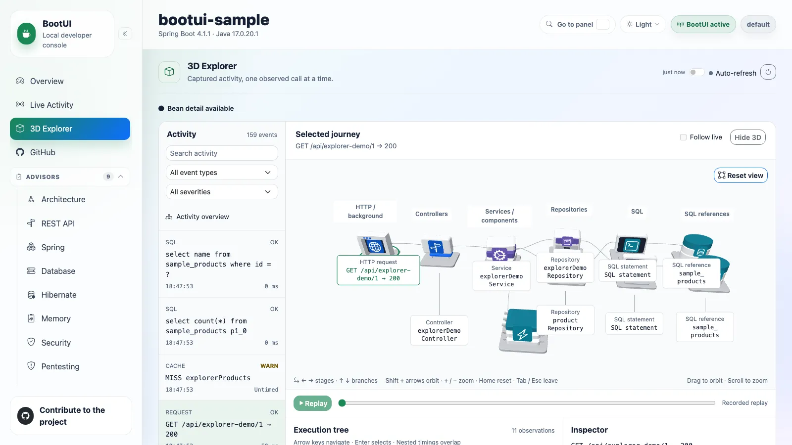

# Diagnostics

## 3D Explorer



**3D Explorer** lives in **Overview**, immediately after **Live Activity** (`/explorer`). It presents the same
canonical activity feed in a Three.js scene with a readable execution tree, not a new monitor or simulated topology.
Spring MVC on the JVM is supported; WebFlux, Quarkus, native images, and Spring AOT mode explicitly report unsupported
in v1 and install no Explorer interception. Live Activity and its Live Flow mode remain unchanged.

All ten canonical types are retained: `REQUEST`, `SQL`, `EXCEPTION`, `SECURITY`, `CACHE`, `SCHEDULED`, `MESSAGING`,
`MAIL`, `REST_CLIENT`, and `FAULT_TOLERANCE`. Future types retain a generic readable event representation. A trace id
is not required to select an event: scheduled work, consumed messages, and other uncorrelated activity remain
independent entries rather than being forced beneath an HTTP request.

### Setup and access

Viewing existing activity requires no new capture setting. Bean detail is enabled by default on supported instances.
To disable the additional bean advice while retaining the activity view, set:

```properties
bootui.explorer.enabled=false
```

The default is `true`; changing it requires an **application restart** to install or remove advice. Capture additionally
requires active BootUI, enabled Explorer, Live Activity, Beans and Traces panels, and existing telemetry. Eligible
synchronous HTTP requests must already have valid sampled tracing context. Explorer never enables tracing, SQL
recording, parameter capture, or host sampling itself. With capture off or telemetry unavailable, the activity view
still works and explains why bean detail is unavailable.

`bootui.panels.explorer.enabled=false` rejects Explorer's API. Disabling Live Activity also blocks this alternative read
path, including MCP/CLI. Live source-panel enable/capture/exposure policy and secret masking apply to historical data
as well as fresh events. Disabling Beans removes bean detail; disabling a source never exposes its retained details
through Explorer. SQL layers require the existing SQL Trace capability and evidence. There are no new start, stop,
clear, database, or cache actions. Pause freezes browser refresh/playback, not server recording.

### What the journey proves

Selecting a traced request can show its observed controller, service, repository, other application-bean invocations,
SQL executions, and SQL-derived references. These are **proxy invocations**: a cache hit can skip the method body,
and repeated calls to one bean remain distinct invocations. Only capture-time evidence establishes an exact
event-to-invocation link. Existing Live Activity request parentage remains separate, with its original confidence;
timestamps, shared trace ids, or likely architectural layers never manufacture additional call edges.

Bean spans are stored locally in the existing bounded trace store, **not emitted through the host application's
outbound exporter**. There is no second trace store, HTTP recorder, SQL/cache wrapper, source listener, or persistence
poller. Capture never records method arguments, return values, or exception messages. The thread-local scope is released
on success and failure without changing host tracing context or propagation.

| Evidence | Interpretation and limits |
| --- | --- |
| SQL references | Bounded lexical extraction from already captured SQL, not schema discovery, physical-table identity, or table health. Common SELECT/FROM/JOIN, INSERT, UPDATE, DELETE, and quoted/qualified identifiers are recognized conservatively. CTEs, subqueries, table-valued functions, unsupported syntax, truncated SQL, and batch previews remain partial/unavailable evidence. Datasource/catalog/schema can be unknown; same-named references are not assumed to be one physical table. Statement duration belongs to SQL, not to every referenced table. |
| Cache operations | Manager + cache identity and observed HIT/MISS/PUT/EVICT/CLEAR metadata only; no keys, key hashes, values, or invented durations in the enrichment. MISS is not an error. A loader-based lookup records its result after the loader and does not prove an earlier miss or an implicit PUT. Uncaptured accessors (`retrieve`, `putIfAbsent`, `evictIfPresent`, `invalidate`) remain outside coverage. |
| Exceptions | Failed invocations show where a failure escaped; they are not additional exception occurrences. Propagation follows only recorded failed parent-child edges and stops at a successful caller. Existing Exceptions grouping/occurrences stay authoritative. A handled exception does not imply HTTP 500, and a caught, unlogged internal failure can be invisible. |
| Security | Preserve canonical grant/deny/audit meaning and source severity; a denial is not automatically an exception. |
| Scheduled and messaging | Preserve background roots and recorded producer/consumer direction. A publish is not delivery confirmation; matching topics, timestamps, or trace ids do not invent end-to-end message causality. |
| Mail and outbound HTTP | Captured mail is not proof of delivery. Outbound requests retain known status/timing, not inferred remote internals; the scene adds no mail payload or recipient data. |
| Fault tolerance | Show only captured retries, rejections, timeouts, short circuits, or breaker transitions, without inventing attempts or paths. |

Canonical event severity is copied unchanged. Spring's `bootui.activity.request-slow-threshold-ms` defaults to
**1,000 ms**, and also labels measured bean invocations as slow. This is distinct from Live Flow's **500 ms** visual
interaction threshold. SQL and REST Client keep their source slow flags; untimed events acquire no fabricated duration.
Failed and slow remain separate facts, with failure taking animation precedence. Nested durations overlap and must
not be added as request latency.

### Bounds, history, and limitations

The root GET reuses Live Activity's query selection, filters, source policy, and paging. Optional durable activity history
can outlive in-memory bean, trace, and SQL evidence: the canonical event remains selectable with an expired/partial-detail
explanation. There is no new persistence of bean detail. Missing parents, sampling, late-arriving roots, eviction,
clear/restart races, and truncation never become a complete-looking successful trace.

Bean capture is capped before storage at **100 invocations per request** and **32 nested levels**, additionally bounded
by `bootui.telemetry.max-spans-per-trace`, with omitted counts reported. SQL-reference enrichment is bounded to
64 references per selection. Related activity inherits existing query/source caps. Proxy self-invocation, methods that
cannot be advised, unsupported async handoffs, and background bean advice are outside v1 coverage; their existing
activity events still appear. Deferred ORM flush belongs to the scope in which SQL actually executed, not a guessed
repository method.

Advice is limited to singleton/static-target application proxies. New class proxies are not introduced for final
classes, classes with callable final methods, or factory-created classes with only private constructors, because
doing so could change application behavior or prevent startup. Existing
compatible Spring Data and transaction/cache proxies retain their original semantics. Explorer does not change the
application's proxy mode. In JDK-proxy mode, previously unproxied interface-backed beans are skipped when a new proxy
would lose concrete-type assignability; existing compatible proxies can still be captured.

Replay walks the execution tree one step at a time: each parent-to-child pulse completes before the next starts.
Failed invocations first show the call entering, then show the observed failure while unwinding after their children;
propagation still stops at successful callers. Repeated calls on a shared edge remain separate steps. Follow live uses
the same sequential pacing for its bounded fresh-event batch, without building a backlog.

Animation pacing is for readability, not recorded latency. Long sequences use compact pacing within the existing
12-second presentation budget; actual durations and timestamps remain unchanged in the tree and inspector.
Replay means playback of retained evidence, not live application execution. Initial load remains still; the DOM tree
and inspector remain usable with reduced motion, on narrow screens, or when WebGL initialization fails. No sample
traffic or external work runs on page load.

### Browsing the 3D scene

Focus the scene with **Tab** (or click a model), then use **← / →** to move between architectural stages and
**↑ / ↓** to browse branches within a stage. Selection updates the execution tree and inspector; its full name is
announced and the selected model has a focus ring. Grouped observations can be expanded with **Enter**.
Use **Shift + arrows** to orbit, **+ / −** to zoom and **Home** to reset the camera without losing the selected journey.
**Tab** continues to the next control; **Escape** leaves the scene. These shortcuts do not capture keys in the search
field, execution tree or elsewhere on the page. Pointer drag and scroll still orbit and zoom.

Use **Full screen** beside **Reset view** to give the scene the whole display. Arrow navigation, camera controls and
selection remain available. **Exit full screen** or **Escape** returns to the panel and restores focus to the button.
Fullscreen failures are reported without discarding the journey.

Dense stages wrap into spaced rows and columns; cache/external observations and runtime signals sit separately from
the architectural call path. Repeated identical fault-tolerance signals under the same captured parent share a model
with an observation count, while every event and its timing remain in the tree and replay. Labels avoid both models
and other labels, and camera framing includes the nearest as well as the furthest row.

Models use locally bundled Bootstrap icon emblems and distinct silhouettes: HTTP gateways, controller signs, layered
services, repository drawers, SQL terminals, database references and cache chips. Mail, messaging, security, scheduled
work, fault tolerance and exceptions each have a corresponding model; unknown event types remain browsable as generic
activity. Category accents are not health signals. Only recorded failure or slow evidence earns error or warning effects,
and a database-shaped SQL reference still makes no claim about a physical table's health. Labels prioritize the selected
node without overlapping neighboring labels; the complete evidence remains available in the tree and inspector.

### Read-only API and agent access

`GET /bootui/api/explorer` returns `ExplorerReport` (`available`, the unchanged `activity` report, and `setup`).
It accepts Live Activity's `type`, `severity`, `since`, `limit`, and applicable history parameters `q`, `until`,
`cursor`, `pageSize`. `GET /bootui/api/explorer/events/{id}` returns `ExplorerEventDto`: the selected canonical event,
related entries, optional invocations and exact links, SQL references, cache operations, warnings, partial status,
and omitted-invocation count. The id is a canonical **event id**, not a trace id.
An optional `timestamp` query parameter pins the exact displayed evidence when source IDs restart or an aggregated
event changes. The browser sends it automatically. Without it, detail reads the newest matching event in the current
live/persistent query mode; expired versions never substitute a new event sharing the same id.

On supported instances, `get_explorer` (`limit`) and `get_explorer_event` (required `id`) expose the same reads through
MCP and the generated `bootui explorer list --limit 20` / `bootui explorer event <id>` commands. All mounts follow
`bootui.path` / `bootui.api-path`; the existing local-only, authentication, and panel policies still apply.

### Local overhead check

A development-only check used Java 17.0.20.1 on macOS, the existing H2 sample, and sequential
`GET /api/explorer-demo/3` requests: 300 warm-ups followed by 500 measurements in each separately launched JVM.
The warm path returns a cache hit, so enabled capture observes two proxy invocations (controller + service), not
repository/SQL work. Tracing and the existing activity capture stayed enabled in both runs.

| Bean capture | Median HTTP round trip | p95 | Servlet-thread allocation/request |
| --- | ---: | ---: | ---: |
| Off (explicitly disabled; no Explorer proxies installed) | 1.378 ms | 2.195 ms | 96,653 bytes |
| On (default) | 1.220 ms | 2.004 ms | 121,346 bytes |

Allocation is the before/after delta from the JDK's `com.sun.management.ThreadMXBean`, accessed through an explicitly
started local JMX connection, summed across `http-nio-8080-exec-*` threads. It excludes background exporter threads.
The roughly 24.7 KB additional allocation per warm request is measurable; the small reversed latency difference is
warm-up/machine noise, **not a speedup claim**. This bounded sample check is not a benchmark or performance guarantee.
Real workloads, deeper call paths, exporter batching, retention pressure and enabled panels change the cost. No
benchmark framework or application endpoint was added for measurement.

## Traces


The Traces panel shows distributed tracing spans captured locally by the BootUI starter when telemetry and the Traces
panel are enabled. The starter contributes the tracing dependencies and sampling default needed for local development, so
the host application does not need manual `management.*` tracing properties. It also keeps an embedded OTLP/HTTP receiver
at `/bootui/api/otlp/v1/traces` so cooperating local services can export spans into the same in-memory store.

The list shows the most recent traces with service name, the HTTP request path each trace served (falling back to the
root span name when no path attribute is present), status, duration, and span count. Opening a trace renders a waterfall
view of its spans so you can see latency contributions, errors, and parent/child relationships across services.

When `bootui.telemetry.enabled=false`, the sidebar dims the panel and the view shows a disabled state instead of implying
that tracing is merely empty. Trace data is reset on application restart or via the panel's clear action.

::: details Sampling defaults and log-level pins

The starter's default raises sampling to 100% (`management.tracing.sampling.probability=1.0`), so the OpenTelemetry SDK
and Micrometer Tracing span/propagation code runs on every request. To keep that from flooding the console when the
host's root logger is at `DEBUG`, BootUI also pins `logging.level.io.opentelemetry` and `logging.level.io.micrometer.tracing`
to `INFO` as overridable defaults (set either key yourself to opt back in).

:::

::: details Self-trace filtering and buffer bounds

Traces emitted by BootUI's own API are filtered out on ingestion by default. As soon as any span in a trace is recognized
as BootUI traffic (for example the path-bearing HTTP server span for `/bootui/api/**`), the whole trace is dropped,
including nested spans that carry no path of their own such as Spring Security `security filterchain before`/`after`
observations. Retained self-only traces are also hidden from the panel, to keep the view focused on application traffic.
Span ingestion can be tuned with `bootui.telemetry.exclude-self-spans=false`; read-time panel filtering follows
`bootui.monitoring.exclude-self`. The in-memory trace buffer is bounded by `bootui.telemetry.max-traces`,
`bootui.telemetry.max-spans-per-trace`, request-size limits, and attribute-value truncation, with additional internal
caps to keep misconfigured local exporters from overflowing the UI.

:::

On Quarkus the same Traces panel and in-memory store are served by the extension, but spans are captured **in-process**
through an OpenTelemetry `SpanProcessor` that is registered only when the application depends on `quarkus-opentelemetry`
— there is no embedded OTLP receiver. Self-span filtering and the `bootui.telemetry.*` retention bounds behave
identically on both platforms. The empty-state guidance adapts too: on Quarkus it points to `quarkus-opentelemetry` and
the in-process capture model rather than the embedded `/bootui/api/otlp/v1/traces` receiver.

## Log Tail


The Log Tail panel reads recent local application logs and streams new log events from the running process. It is
intended for quick local diagnosis without leaving the BootUI console.

## Exceptions


The Exceptions panel captures exceptions thrown by the running application and groups repeated failures into a single
entry with an occurrence count. On Spring MVC it records from two complementary sources: a non-intrusive
`HandlerExceptionResolver` that observes exceptions escaping web request handlers (capturing the request method, path,
and handler), and a logback appender that picks up anything logged with a throwable from scheduled tasks, async work, or
`log.error("…", ex)` calls. A failure that is both handled and logged is de-duplicated by throwable identity so it is
counted only once.

Exceptions are grouped by a stable fingerprint derived from the exception type and the top stack frames, so a recurring
error collapses into one row showing its type, latest message, first/last seen times, originating location, and total
count. Opening a group shows the representative stack trace with application frames highlighted, the full cause chain
(`Caused by: …` with `… N more` common-frame folding), and the most recent occurrences with their thread, source, and
request context. The list updates live over **Server-Sent Events** — the browser subscribes to `/bootui/api/exceptions/stream`
and re-fetches whenever an exception is captured or the store is cleared — and can be filtered by text, by capture source
(web vs. logged), or to application-originated exceptions only.

### Triage status

Each group carries a Sentry-style triage status, shown as a badge and changed inline with a button group (the same
one-click convention the Loggers panel uses):

| Status           | Meaning                          | On a new occurrence                          |
| ---------------- | -------------------------------- | -------------------------------------------- |
| **Open**         | Default for every new group      | Keeps accumulating                           |
| **Acknowledged** | Seen, still being investigated   | Keeps accumulating; never auto-transitions   |
| **Resolved**     | Believed fixed                   | Regresses: auto-reopens to **Open**          |

If a **Resolved** group throws again, BootUI treats it as a regression: the group reopens to **Open** and a lifetime
"Reopened ×N" counter is incremented next to the badge, so a developer immediately sees a failure they thought was fixed
has come back. Only a **Resolved** group can regress. An optional status filter (All/Open/Acknowledged/Resolved) narrows
the list alongside the existing text/source filters. Changing status calls `POST /bootui/api/exceptions/{id}/status` with
`{"status": "..."}`, validated against the three values (400 on anything else, 404 for an unknown group), and returns the
updated group.

### Exposure and bounds

Exception messages follow the same exposure policy as the rest of BootUI: they are scrubbed of secret-like `key=value`
assignments under the default `bootui.expose-values=MASKED`, omitted entirely under `METADATA_ONLY`, and shown verbatim
only under `FULL`. Request paths are captured without their query string so query-string secrets are never surfaced, and
stack frames carry only class/method/file/line information. The in-memory store is bounded by
`bootui.exceptions.max-groups` (default 100, evicting the least-recently-seen group), `bootui.exceptions.max-occurrences-per-group`
(default 25), and `bootui.exceptions.max-stack-frames` (default 50), and is reset on application restart or via the
panel's clear action. The panel can be disabled with `bootui.panels.exceptions.enabled=false`, and clearing honors the
panel's read-only setting.

The triage workflow and regression detection are engine-level, so they behave identically on Quarkus and WebFlux. Only
the capture sources differ per adapter:

::: details Capture sources on Quarkus and WebFlux

**Quarkus** captures from two sources in place of the MVC resolver and logback appender: a `java.util.logging` handler
that records anything logged with a throwable (excluding BootUI's own loggers), and a Vert.x failure handler that records
the throwable escaping a failed request with its method and path. The shared store still de-duplicates by throwable
identity across the cause chain, so a failure seen by both sources is counted once. Capture is installed on
`StartupEvent` and detached on `ShutdownEvent`, wired in dev/test only and never in production, and bounded by the same
`bootui.exceptions.*` limits.

**Spring Boot WebFlux** captures via a `WebExceptionHandler` at the highest precedence, plus the same logback appender
used on the servlet adapter. One honest, documented fidelity gap: a `@RestController`'s own local `@ExceptionHandler`
method consumes an exception *inside* the WebFlux dispatch pipeline, before any `WebExceptionHandler` sees it — narrower
than the servlet adapter's resolver-chain-based capture, which observes `@ExceptionHandler`-resolved exceptions too.
Unhandled exceptions (the common case) are captured identically on both stacks.

:::

## HTTP Exchanges


The HTTP Exchanges panel records recent inbound requests handled by the running application. It lists timestamp, method,
path, status, duration, response size when a `Content-Length` header is present, and trace identifiers from common
propagation headers. Expanding a row shows request and response headers, with secret-like headers and query parameters
masked unless `bootui.expose-values=FULL` is explicitly configured. BootUI self-requests are hidden from the panel by
default through `bootui.monitoring.exclude-self`, though they still count against the bounded in-memory recorder.

BootUI contributes an in-memory `HttpExchangeRepository` when the panel is enabled and no application repository already
exists. The default buffer retains 200 exchanges and can be changed with `bootui.http-exchanges.max-exchanges`; changing
that capacity requires an application restart. If the repository is unavailable, the panel shows a clear unavailable
state instead of implying that no traffic has occurred.

Row details also offer **Copy as cURL**, which turns the retained metadata into a command *template* you can paste into a
terminal. It is deliberately not a byte-for-byte replay, and the action explains every difference before you copy it:

::: details What the command changes, and why

- Copying runs entirely in the browser. No request is sent, no capture state changes, and nothing is written back to the
  application.
- The generated command is shown in full before you copy it, so you can read exactly what will land on your clipboard —
  and still copy it by hand if the browser denies clipboard access.
- Query-parameter names are preserved — including repeated, empty and encoded ones — but every value becomes a `VALUE`
  placeholder, so retained values never reach the clipboard. A masked name, or a segment with no `=` at all, is dropped
  and reported, because an unstructured segment can be a bare token rather than a name.
- Only a short allowlist of boring request headers is copied (`Accept`, `Accept-Language`, `Cache-Control`,
  `Content-Type` and `User-Agent`), and only while their values are actually exposed and unmasked. Authorization,
  cookies, proxy credentials, API keys, forwarding headers, tracing headers and unknown custom headers are omitted under
  every exposure mode, including `bootui.expose-values=FULL`.
- BootUI never captures request bodies, so the command carries none; body-carrying methods say a body may have existed
  and invite you to add your own `--data`.
- The URL, method and every header argument are POSIX single-quoted, so shell metacharacters captured from a request
  cannot escape their argument or append another command. Credentials embedded in a recorded URL are dropped with the
  rest of the authority userinfo.
- The path is copied exactly as recorded, so a traversal probe such as `/a/%2e%2e/admin` stays visible instead of being
  normalized into a different target, and `--globoff` keeps recorded brackets literal so one exchange never becomes
  several requests. `HEAD` uses `-I` so the command cannot hang waiting for a body.
- When the retained metadata has no absolute `http(s)` URL or no recognizable method, the action is deactivated and
  announces the reason instead of producing a misleading command.

:::

The command is generated by a shared frontend helper over the same `HttpExchangeDto` every adapter serves, so Spring MVC,
Spring WebFlux and Quarkus produce byte-identical text for the same exchange.

On Quarkus the panel is identical, but Quarkus has no Actuator `HttpExchangeRepository`. Capture is done by a small
Vert.x route filter that samples each completed request — recorded in the response body-end handler so status, duration,
and size are final — into a capped ring buffer sized by the same `bootui.http-exchanges.max-exchanges` key (default 200)
as Spring. The masking, trace-id extraction, self-exclusion, and paging run through the same shared engine service, so
the wire is byte-identical to Spring. Capture is wired in dev/test only and never in production.

## HTTP Probe


The HTTP Probe panel sends local-only requests to the running application and displays response status, headers,
duration, and body. It is designed for quick route checks from inside the same local development context as BootUI.

Probe input is bounded like every other BootUI operation: the method, path, request body, header count and header
name/value sizes each have an explicit ceiling (64 KiB for the request body, 2 KiB for the path, 50 headers), measured
in UTF-8 bytes and checked before anything is sent to the application. Exceeding a ceiling is invalid input, so it is
rejected with the canonical `400` and `{"error": ...}` body on Spring MVC, Spring WebFlux and Quarkus alike, and the
panel shows that message instead of a probe result. A probe that actually runs and fails — connection refused, timeout
— is still reported as a probe outcome, and its response body is truncated at the response byte budget.

On Quarkus the panel is identical: the probe always targets the application's *own* loopback address, so it can never
reach an external host. The only platform difference is how the live local port is resolved. Quarkus has no single
config key that always equals the bound port, so the adapter selects `quarkus.http.test-port` or `quarkus.http.port` by
launch mode (a random `=0` port still resolves, because Quarkus rewrites the property to the actual port once the server
is up). As a state-changing action it is gated by the same localhost-only safety floor as every other write.
