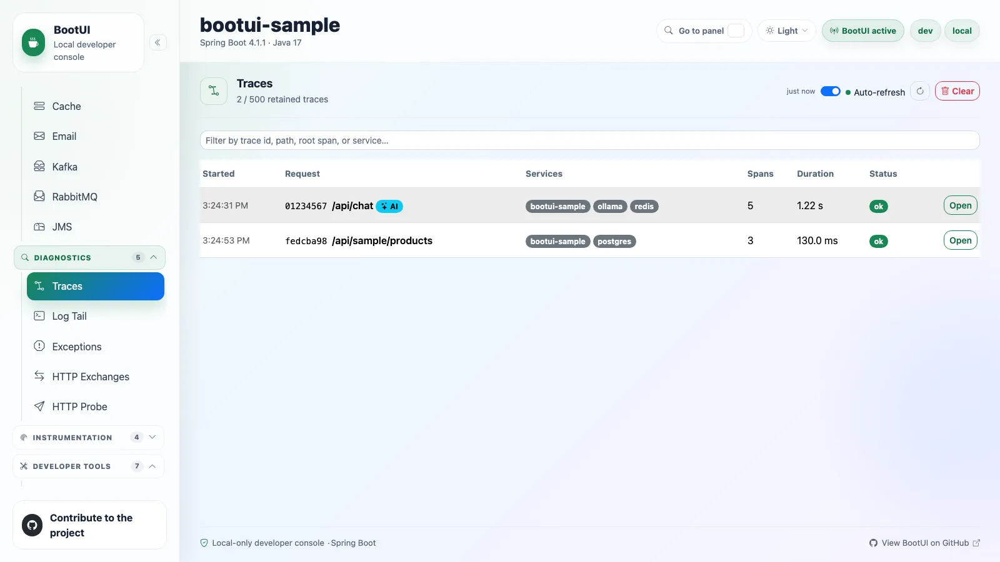
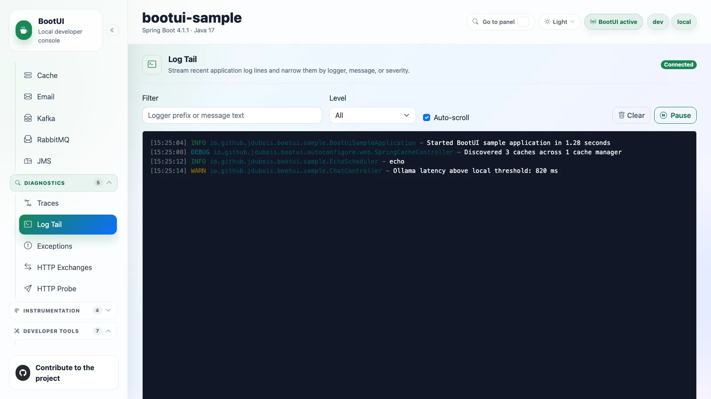
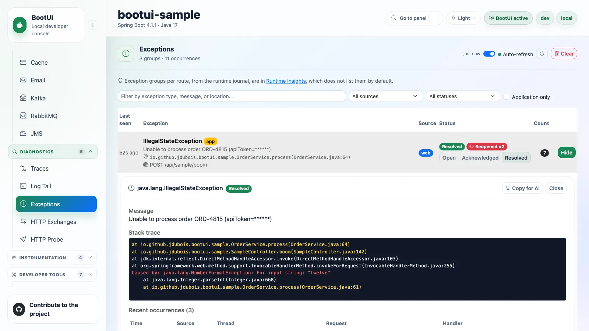
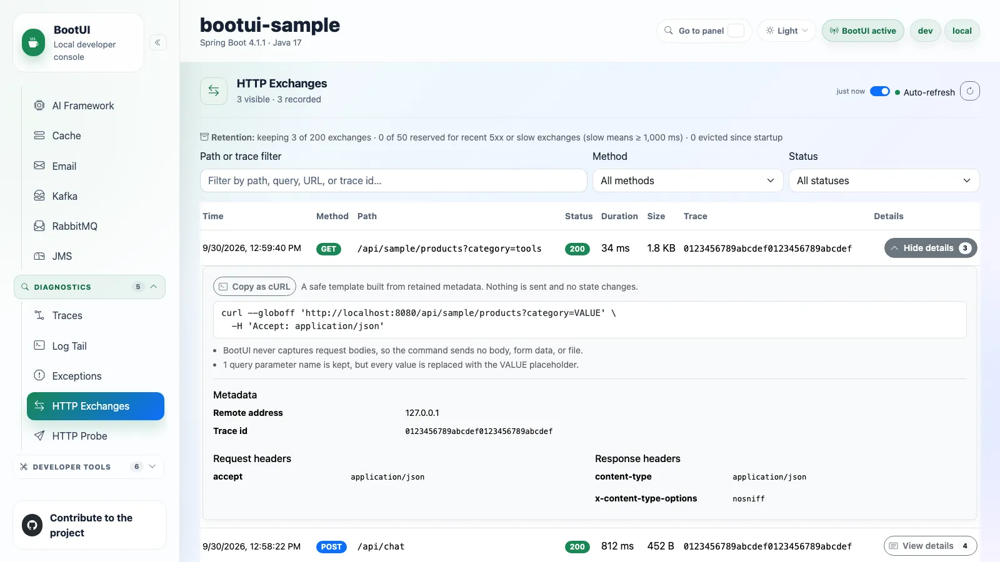
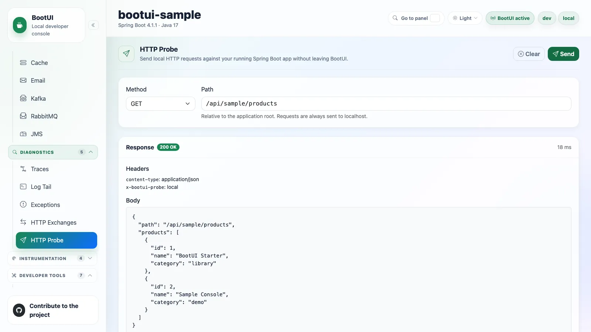

# Diagnostics

## Traces

The Traces panel shows distributed tracing spans captured locally. The starter contributes the tracing dependencies and
the sampling default that local development needs, so your application does not need manual `management.*` tracing
properties.

The list shows the most recent traces with their service name, the HTTP path each trace served, status, duration, and
span count. When a trace has no path attribute, the root span name is used instead. Opening a trace renders a waterfall
of its spans, so you can see latency contributions, errors, and parent and child relationships across services.

Trace summaries and span details, including the spans in request profiles, follow the live value-exposure rules
described below. AI chat details also follow `bootui.expose-values`: `MASKED` applies secret-key and free-text masking,
including nested attributes and events; `METADATA_ONLY` omits their attributes and events; `FULL` shows captured values.
Changing the policy affects the next read, not what is retained in memory.

On Spring Boot, BootUI also runs an embedded OTLP/HTTP receiver at `/bootui/api/otlp/v1/traces`, so cooperating local
services can export spans into the same in-memory store. On Quarkus, spans are captured in-process through an
OpenTelemetry `SpanProcessor` registered only when the application depends on `quarkus-opentelemetry`, and there is no
embedded receiver. The empty state points at whichever model applies.

Trace data resets on application restart and through the panel's clear action, which keeps no lifetime count. When `bootui.telemetry.enabled=false`,
the sidebar dims the panel and the view shows a disabled state, so an empty list never reads as "no traces yet".

### Trace value exposure

Spans are stored as captured, and every read applies the live `bootui.expose-values` and `bootui.mask-secrets` policy,
so a runtime change takes effect on the next read without a restart. The same rule covers `GET /bootui/api/traces/{id}`,
the trace embedded in the [per-request profile](overview.md#the-per-request-profiler), and the `get_request_profile` MCP
tool and `bootui request-profile` command on Spring MVC, Spring WebFlux, and Quarkus:

- **Status messages and exception events.** A span's status message and its `exception.message` and
  `exception.stacktrace` event attributes, like `error.message` and captured generative-AI content (prompts,
  completions, input and output messages, system instructions, tool call arguments and results, and vector query
  content and returned documents), follow the [exception message](#exposure-and-bounds) rule: secret-like assignments
  and authorization credentials are masked under the default `MASKED`, the text is omitted under `METADATA_ONLY`, and
  it is verbatim only under `FULL`.
- **URLs.** `url.full`, `http.url`, `http.target`, `url.query`, and `url.path` are masked like the HTTP Exchanges URI:
  user-info is always removed, sensitive query and matrix parameter values are masked under `MASKED`, and query values
  are dropped under `METADATA_ONLY`.
- **Headers and bound parameters.** `http.request.header.*` and `http.response.header.*` values with a sensitive name,
  such as `authorization` or `cookie`, are masked under `MASKED`, and every header and `db.query.parameter.*` value is
  omitted under `METADATA_ONLY`.
- **Other attributes.** A string attribute whose key looks sensitive, such as `app.api_key`, is masked, and any other
  string attribute, such as `db.statement`, has secret-like assignments masked, unless the mode is `FULL`. Numbers and
  booleans, such as token counts and status codes, are never masked.

Keys, types, span and event names, ids, kinds, and timings are never changed. An omitted value is `null`, so the span
keeps its shape. Masked text is safer to show, not guaranteed secret-free: like log messages, only secrets with a
recognizable shape are detected. The [AI Framework](services.md#ai-framework-value-exposure) chat detail applies the
same rule to the chat span it returns.

::: details Sampling defaults and log-level pins

The starter raises sampling to 100 % (`management.tracing.sampling.probability=1.0`), so the OpenTelemetry SDK and the
Micrometer Tracing span and propagation code run on every request. To keep that from flooding the console when the
host's root logger is at `DEBUG`, BootUI pins `logging.level.io.opentelemetry` and `logging.level.io.micrometer.tracing`
to `INFO` as overridable defaults. Set either key yourself to opt back in.

:::

::: details Self-trace filtering and buffer bounds

Traces from BootUI's own API are filtered out on ingestion. As soon as any span in a trace is recognized as BootUI
traffic, such as the HTTP server span for `/bootui/api/**`, the whole trace is dropped, including nested spans that
carry no path of their own, such as Spring Security `security filterchain before` and `after` observations. Retained
self-only traces are also hidden from the panel.

Ingestion filtering follows `bootui.telemetry.exclude-self-spans`, and read-time panel filtering follows
`bootui.monitoring.exclude-self`. The in-memory buffer is bounded by `bootui.telemetry.max-traces`,
`bootui.telemetry.max-spans-per-trace`, request-size limits, and attribute-value truncation, plus internal caps that
keep a misconfigured local exporter from overflowing the UI. These bounds behave identically on all three stacks.

:::

## Log Tail

The Log Tail panel reads recent local application logs and streams new log events from the running process, for quick
diagnosis without leaving the console.

### Log message exposure

Log messages follow the same exposure rule as [exception messages](#exposure-and-bounds). Under the default
`bootui.expose-values=MASKED`, on every line of a multi-line message:

- The value of each secret-like `key=value` or `key: value` assignment, such as a password, token, or API key, is
  replaced with `******`.
- After an `authorization` key, the credential that follows an HTTP authorization scheme is masked while the key and
  the scheme stay visible, as in `Authorization: Bearer ******`, `"authorization": "Basic ******"`, or
  `Proxy-Authorization: Digest ******`. Every comma-separated parameter of a Digest, OAuth, or AWS signature
  credential and every value of a multi-valued header, as in `Authorization=[Basic ******, Bearer ******]` or
  Spring's `Authorization:"Bearer ******", "Bearer ******"`, is covered.
  A scheme BootUI does not recognize is masked together with its credential, because it cannot be told apart from a
  bare credential. After any other secret-like key, a scheme is masked together with its credential, as in
  `X-Auth-Token: ******`.
- A credential after `Bearer`, `Basic`, `Negotiate`, or `NTLM` is masked even when no key precedes it, as in
  `sending Bearer ******`, when its shape shows it is one: a `Bearer` credential must have at least eight characters
  including a digit, or at least twenty, a `Basic` credential must decode to `user:password`, and a `Negotiate` or
  `NTLM` credential must decode to an NTLM message or a SPNEGO token. Prose such as `missing Bearer token`,
  `Basic auth is enabled`, or `unable to negotiate TLS_AES_128_GCM_SHA256` stays readable. Other scheme names are
  common words, so they are recognized only after a secret-like key.

Under `METADATA_ONLY` the message is omitted while the timestamp, level, logger, and thread remain, and the panel marks
each such line **message omitted by policy** rather than showing it empty. Only under `FULL`, or with
`bootui.mask-secrets=false`, are messages shown verbatim. Any other assignment has only the first word of its value
masked, and a bare token or a credential inside a connection string is not detected. Treat log output as local
diagnostic data.

The rule applies when a line is read, not when it is captured, so it covers the recent snapshot
(`GET /bootui/api/log-tail/recent`), the SSE stream including its replayed backlog, the `get_log_tail` MCP tool, and
`bootui logs tail` on Spring MVC, Spring WebFlux, and Quarkus alike. Changing `bootui.expose-values` or
`bootui.mask-secrets` at runtime applies to the next snapshot and the next streamed line, including lines captured
before the change, without a restart. Each line carries a `messageOmitted` flag that is `true` only when the policy
withheld its message.

## Exceptions

The Exceptions panel captures exceptions thrown by the running application and groups repeated failures into one entry
with an occurrence count.

Exception groups per route, from the runtime journal, are in [Runtime Insights](overview.md#runtime-insights)
(`exception-hotspots`), which does not list them by default; this panel links to them, and the link opens Runtime Insights with
every row shown.

Grouping uses a stable fingerprint derived from the exception type and the top stack frames, so a recurring error
collapses into a single row. That row shows the type, the latest message, first and last seen times, the originating
location, and a total count. Opening a group shows the representative stack trace with application frames highlighted, the full cause chain
with `… N more` common-frame folding, and the most recent occurrences with their thread, source, and request context.
Each occurrence also carries the `requestId` of the request that threw it, when BootUI saw one, so the profiler can
attribute it exactly with or without tracing.

The list updates over Server-Sent Events: the browser subscribes to `/bootui/api/exceptions/stream` and re-fetches
whenever an exception is captured or the store is cleared. You can filter by text, by capture source, or to
application-originated exceptions only.

On Spring MVC, BootUI records from two complementary sources: a non-intrusive `HandlerExceptionResolver` that observes
exceptions escaping web request handlers, capturing the request method, path, and handler; and a logback appender that
picks up anything logged with a throwable from scheduled tasks, async work, or `log.error("…", ex)`. A failure that is
both handled and logged is de-duplicated by throwable identity.

### Triage status

Each group carries a Sentry-style triage status, shown as a badge and changed inline with a button group:

| Status | Meaning | On a new occurrence |
| ------ | ------- | ------------------- |
| **Open** | Default for every new group | Keeps accumulating |
| **Acknowledged** | Seen, still being investigated | Keeps accumulating; never auto-transitions |
| **Resolved** | Believed fixed | Regresses: auto-reopens to **Open** |

When a **Resolved** group throws again, BootUI treats it as a regression. The group reopens to **Open** and a lifetime
"Reopened ×N" counter appears next to the badge, so a failure you thought was fixed is immediately visible. Only a
**Resolved** group can regress.

A status filter narrows the list alongside the text and source filters. Changing a status calls
`POST /bootui/api/exceptions/{id}/status` with `{"status": "..."}`, validated against the three values: anything else
returns `400`, and an unknown group returns `404`.

### Caught in application code

With the BootUI agent's opt-in [`caught-exceptions` sensor](java-agent.md#the-caught-exceptions-sensor), the panel adds a
**Caught in application code** section (`GET /bootui/api/exceptions/caught`, and `caughtInCode` in the panel's report
and MCP `get_exceptions`). It groups the exceptions application handlers caught by route, handler, and caught class,
and counts each occurrence under one outcome:

| Outcome | What BootUI saw |
| --- | --- |
| **Rethrown** | The exception left the method by a throw, as is or as a cause, or was caught again |
| **Replaced** | The handler's straight-line code throws another exception without it |
| **Reported** | The exception, or a wrapper of it, reached the framework's error handling |
| **Logged** | It was logged at `WARN` or above, or a `WARN` was logged on the catching thread right after, before it caught anything else |
| **Handed on** | The handler passed it on as an error value: a failed future, an error signal, a deferred error result |
| **Re-interrupted** | The handler restored the thread's interrupt |
| **Retried** | A later attempt at the same handler in the same request was rethrown, reported, or logged |
| **Not seen rethrown or logged at WARN or above** | None of these, while the evidence was complete |
| **Unknown** | The evidence was incomplete; the row names the most frequent reason |
| **Settling** | Its request ended less than five seconds ago, or work it handed over still runs |

A row is a finding when occurrences not seen rethrown or logged came from at least three requests, or from one for an
SQL, I/O, or data-access exception. A finding states a fact, never a verdict: BootUI never calls an exception
swallowed. An occurrence is judged only when every piece of evidence is complete: it was caught under an HTTP request,
whose event is retained, that started after the last **Clear recording**, that lost no record in the journal or the
agent, that did not go asynchronous or get cancelled, and none of whose work ran after the response; the agent's
`executors` sensor records handoffs; the handler's method has the agent's exit handler, or the handler never reads
what it caught; the exception wraps no other (`ExecutionException`, `CompletionException`); and BootUI's appender
(Logback) or handler (the JBoss LogManager) sees every `WARN` log, with no logger that keeps its events from the root
logger. Otherwise the occurrence is unknown, with the first missing piece as its reason. Matching uses the identity
hashes of the logged or reported throwable and its causes, never the exception itself. With HTTP Exchanges hidden, rows
name no route or request; with Log Tail hidden, logs are not consulted and nothing is known not logged.

Known limits: a task queued for longer than the five-second settle window before it starts is not yet followed, so
what it rethrows or logs later is seen only then; an exception the panel's capture ignores or deduplicates carries no
identity of its own; and on Spring, `java.util.logging` must be bridged to Logback, as Spring Boot does, or every
occurrence stays unknown.

### Exposure and bounds

Exception messages follow the same exposure policy as the rest of BootUI. Under the default `bootui.expose-values=MASKED`
they are scrubbed of secret-like `key=value` assignments and of the credential after an authorization scheme, exactly
as [log messages](#log-message-exposure) are, under `METADATA_ONLY` they are omitted entirely, and only under `FULL`
are they shown verbatim. Request paths are captured without their query string, and stack frames carry
only class, method, file, and line information.

The in-memory store resets on restart and through the panel's clear action, which honors the panel's read-only setting.
The occurrence total counts the retained groups, so a clear resets it too; the panel keeps no lifetime count.
It is bounded by three properties:

| Property | Default | Bounds |
| -------- | ------- | ------ |
| `bootui.exceptions.max-groups` | `100` | Groups retained, evicting the least recently seen |
| `bootui.exceptions.max-occurrences-per-group` | `25` | Occurrences kept per group |
| `bootui.exceptions.max-stack-frames` | `50` | Frames kept per stack trace |

Triage and regression detection are engine-level, so they behave identically on all three stacks. Only the capture
sources differ.

::: details Capture sources on Quarkus and WebFlux

**Quarkus** replaces the MVC resolver and the logback appender with a `java.util.logging` handler that records anything
logged with a throwable, excluding BootUI's own loggers, and a Vert.x failure handler that records the throwable
escaping a failed request with its method and path. The shared store still de-duplicates by throwable identity across
the cause chain. Capture is installed on `StartupEvent`, detached on `ShutdownEvent`, wired in dev and test only, and
bounded by the same `bootui.exceptions.*` limits.

**Spring Boot WebFlux** captures through a `WebExceptionHandler` at the highest precedence, plus the same logback
appender as the servlet adapter. One fidelity gap follows from the dispatch order: a `@RestController`'s own local
`@ExceptionHandler` method consumes an exception inside the WebFlux pipeline, before any `WebExceptionHandler` sees it.
The servlet adapter's resolver-chain capture observes those too. Unhandled exceptions, the common case, are captured
identically on both stacks.

:::

### Copy for AI

An open group offers **Copy for AI**, which turns the detail into one Markdown document to paste into an agent: a
summary of the group, its exposure-governed message, the stack trace and cause chain with application frames marked,
and the most recent occurrences with their request context. When Live Activity can still profile the request the
latest occurrence belongs to, the document adds that request's timing and correlated SQL, grouped by normalized
statement with N+1 groups and the call sites that issued them.

The full document is shown before anything is copied, with a list of what it leaves out, such as masked values, a
message withheld under `METADATA_ONLY`, bounded frames or occurrences, or why no correlated SQL could be added.
Preparing it reads only the existing Live Activity feed and profile endpoints; the copy itself sends nothing and
changes no state. It renders through the same helper as the [profile drawer's export](overview.md#copy-profile-and-copy-for-ai),
so captured text cannot break the Markdown, and identical evidence reads identically on every stack.

## HTTP Exchanges

The HTTP Exchanges panel records recent inbound requests. It lists the timestamp, method, path, status, duration,
response size when a `Content-Length` header is present, and trace identifiers from common propagation headers.
Expanding a row shows the request and response headers, with secret-like headers and query parameters masked unless
`bootui.expose-values=FULL` is configured.

BootUI's own requests are not recorded while `bootui.monitoring.exclude-self` is on, which is the default, so console
polling never takes a slot from application traffic. The check uses the request path below the servlet context path or
WebFlux base path, never the query string, so an application request whose query mentions `/bootui` is still recorded. The buffer retains 200 exchanges by default;
change it with `bootui.http-exchanges.max-exchanges`, which takes effect on the next restart.

On Spring Boot, BootUI contributes its own bounded `HttpExchangeRepository`, and the Actuator filter that records into
it, when the panel is enabled and the application has not defined a repository. If no repository is available, the
panel says so, so an empty list never reads as "no traffic yet". Quarkus has no Actuator repository, so a small Vert.x
route filter samples each completed request in the response body-end handler, where status, duration, and size are
final, into a bounded buffer sized by the same property. That filter is wired in dev and test only, never in
production. Masking, trace-id extraction, self-exclusion, and paging run through the shared engine service, so the wire
format is identical.

### Failure-preserving retention

A burst of successful requests would otherwise evict the one failure you came to investigate. Every BootUI-owned
capture buffer — HTTP Exchanges on all three stacks, [SQL Trace](database.md#sql-trace), and
[REST Client](services.md#rest-client) — therefore reserves a share of its capacity for failed and slow records:

| Buffer         | Reserved for                                                                              | Slow threshold                                        |
| -------------- | ----------------------------------------------------------------------------------------- | ----------------------------------------------------- |
| HTTP Exchanges | `5xx` responses and requests at or above the slow threshold                               | `bootui.activity.request-slow-threshold-ms` (`1000`)   |
| SQL Trace      | Failed statements and statements at or above the slow threshold                           | `bootui.sql-trace.slow-query-threshold-millis` (`100`) |
| REST Client    | Calls that failed, received a `4xx` or `5xx` response, or took at least the slow threshold | `bootui.rest-client-trace.slow-call-threshold-millis` (`1000`) |

Routine records are evicted first. The reserved share evicts its own oldest record only once it is full, so under a
flood of successes the most recent failed and slow records survive up to that share. The reservation is carved out of
the existing capacity, never added to it, and never takes the whole buffer, so the newest record is always kept.
Records are classified once, when they are captured, and the list stays newest-first across both tiers.

The share is 25% of each buffer by default. Set `bootui.http-exchanges.reserved-share-percent`,
`bootui.sql-trace.reserved-share-percent`, or `bootui.rest-client-trace.reserved-share-percent` to change it, or to `0`
to evict strictly oldest first. A slow threshold of `0` disables slow classification for that buffer, so only failures
are reserved.

With [Live Activity durable history](overview.md#durable-history) on, persistence recognizes a reserved record by the
same rule and slow threshold as the buffer that holds it, including a slow `4xx` request, which Live Activity shows as
`WARN` rather than `SLOW`. A reserved record that newer entries pushed out of the stream and that later reappears is
therefore not stored twice. Persistence remembers each kind of entry separately, so a burst of another kind, such as a
failing scheduled job, cannot make it forget a reserved request; only more than
`bootui.activity.persistence.buffer-max-entries` newer remembered records of the same kind can.

Each panel states its window above the list — records kept of the capacity, how many sit in the reserved share, and how
many were evicted since startup — so no panel implies it holds every request. The same counts are in the `retention`
object of each report, and therefore in `get_http_exchanges`, `get_sql_traces`, and `get_rest_client_traces` for MCP
clients and the `bootui` CLI.

On Spring Boot these guarantees apply only while BootUI owns recording. When the application defines its own
`HttpExchangeRepository`, BootUI leaves it untouched. When it defines its own `HttpExchangesFilter` or
`HttpExchangesWebFilter`, BootUI keeps its repository's former behavior: every exchange it is given is kept, oldest
evicted first, and BootUI's own requests are hidden at read time instead. In both cases the panel reports retention as
managed by the application.

Every exchange carries the route it belongs to, shown under its path when the two differ, and a **Profile** link that
opens the request's profile in [Live Activity](overview.md#the-per-request-profiler). Stacks that correlate a profile
by trace id alone explain in the profile when a request carried none.

Every exchange also carries BootUI's own `requestId`, generated when the request starts, whether or not OpenTelemetry
is present. On Spring MVC it covers the servlet thread and any asynchronous redispatch of the same request. On Spring
WebFlux it travels in the Reactor context to every scheduler the request hops to, including error rendering. On
Quarkus it follows the request from the Vert.x event loop to the worker or virtual thread that continues it. It is the
exchange's `id`, so identical requests that overlap never share an id, and the search field matches it. An exchange
recorded without one, for example by an application-provided repository, keeps a hash of the exchange as its id.

### Route rankings

Above the exchange list, a route table summarizes the retained window: summary → exchanges → profile. Each row is one
method and route, with its request count; 2xx, 3xx, 4xx, and 5xx counts; average, p50, p95, p99, and maximum duration;
and share of retained request time. **Rank by** orders the table by requests, total time, p95, slowest request, or
errors. **Exchanges** filters the list below to exactly that route's exchanges, and **Show every route** clears it.

A route is resolved exactly as [SQL Trace](database.md#rankings) attributes database time, and each row says which of
three sources it came from:

| Source        | Meaning                                                                                         |
| ------------- | ----------------------------------------------------------------------------------------------- |
| `template`    | The handler pattern Spring MVC or Spring WebFlux matched, such as `/api/orders/{id}`.            |
| `declared`    | The single best route the application declares in its mappings. Ties resolve to no template.    |
| `masked path` | No template matched, so every path segment that reads like a value is replaced with `{value}`. |

A template is shown the same way whichever source produced it, so `{id:[0-9]+}` reads `{id}` and a route never splits
into two rows, while a catch-all such as `/**` is kept as declared, so it never merges with a masked path. Two
handlers on the same method and path that differ only in their variable patterns, such as `{id:[0-9]+}` and
`{id:[a-z]+}`, therefore share one row: a pattern is never shown. Quarkus has no runtime route template, so its routes come from the declared JAX-RS mappings, matched under
`quarkus.http.root-path` and `quarkus.rest.path`; a prefix contributed only by `@ApplicationPath` is not known at
runtime, so those routes fall back to masked paths. Spring
WebFlux records the matched handler pattern with the OpenTelemetry integration, which the BootUI starter includes;
without it, WebFlux routes fall back to masked paths, and the panel says so. Query strings are never part of a route.

With Spring for GraphQL, every operation is posted to one endpoint, so BootUI adds the operation graphql-java parsed to
the route, such as `/graphql (query ProductList)`, and each operation is ranked and filtered on its own. Only the
operation's type and name are kept, never its variables or selection. It needs Spring Boot's observation support,
which Actuator brings.

A masked path also masks every segment that a matching declared route marks as a parameter, even when two declarations
match equally well. Only a path that no declaration matches at all keeps segments that read like route words, so a
word-shaped value such as a user name on an undeclared path is shown as captured, exactly as the exchange list shows
it.

::: details How the figures are bounded

- Every figure covers only the retained, visible exchanges. They are diagnostic evidence for that window, not lifetime
  or service-level metrics; the Metrics panel's `http.server.requests` meter covers the application's lifetime.
- The line above the table states the evidence window: retained exchanges, the buffer size, evictions, the oldest
  retained exchange, and how many BootUI exchanges were hidden. BootUI's own buffers report their capacity and
  evictions from the same snapshot as the ranked exchanges; a value an application-managed recorder does not report,
  such as its capacity or evictions, reads as not reported.
- Percentiles are exact nearest-rank values over each route's timed exchanges, computed by the same helper as SQL Trace
  and the Live Activity KPIs. A route whose exchanges carry no duration shows no timings rather than zeros.
- The response returns the union of each criterion's top 25 routes and marks which criteria each route leads, so the
  browser shows exactly the server's list for every criterion. When more routes are retained, the panel says how many
  are not shown. Ties break on the route name in plain character order, never on buffer order or browser locale.
- A route that a link names, such as the Live Activity slowest request, is always returned and shown after the
  ranking, even when it is outside every top list.
- Rankings refresh every 30 seconds while the exchange list follows auto-refresh, because every refresh is itself a
  request the Spring buffer records before hiding it. The window line says when the rankings were computed, and
  **Refresh** or opening a route's exchanges updates both at once.
- BootUI's own exchanges stay out of the rankings while `bootui.monitoring.exclude-self` is on.

:::

`GET /bootui/api/http-exchanges/routes` serves the rankings, `?route=<id>` pins one route's row, and
`GET /bootui/api/http-exchanges?route=<id>` lists that route's exchanges. Agents read the same rankings with the `get_http_routes` MCP tool, and the command line with
`bootui http routes`.

### Copy as cURL

Row details offer **Copy as cURL**, which turns the retained metadata into a command *template*. It is not a
byte-for-byte replay, and the action shows every difference before you copy.

::: details What the command changes, and why

- Copying runs entirely in the browser. No request is sent, no capture state changes, and nothing is written back to
  the application.
- The command is shown in full before you copy it, so you can read exactly what will land on your clipboard, and still
  copy it by hand if the browser denies clipboard access.
- Query-parameter names are preserved, including repeated, empty, and encoded ones, but every value becomes a `VALUE`
  placeholder. A masked name, or a segment with no `=` at all, is dropped and reported, because an unstructured segment
  can be a bare token rather than a name.
- Only a short allowlist of headers is copied — `Accept`, `Accept-Language`, `Cache-Control`, `Content-Type`, and
  `User-Agent` — and only while their values are exposed and unmasked. Authorization, cookies, proxy credentials, API
  keys, forwarding headers, tracing headers, and unknown custom headers are omitted under every exposure mode,
  including `FULL`.
- BootUI never captures request bodies, so the command carries none. Body-carrying methods say a body may have existed
  and invite you to add your own `--data`.
- The URL, the method, and every header argument are POSIX single-quoted, so shell metacharacters captured from a
  request cannot escape their argument. Credentials embedded in a recorded URL are dropped with the rest of the
  authority userinfo.
- The path is copied exactly as recorded, so a traversal probe such as `/a/%2e%2e/admin` stays visible instead of being
  normalized into a different target, and `--globoff` keeps recorded brackets literal. `HEAD` uses `-I` so the command
  cannot hang waiting for a body.
- When the metadata has no absolute `http(s)` URL or no recognizable method, the action is deactivated and announces
  the reason instead of producing a misleading command.

:::

A shared frontend helper generates the command from the same `HttpExchangeDto` every adapter serves, so all three
stacks produce identical text for the same exchange.

## HTTP Probe

The HTTP Probe panel sends local-only requests to the running application and shows the response status, headers,
duration, and body. The probe always targets the application's own loopback address, so it can never reach an external
host, and as a state-changing action it is gated by the same localhost-only safety floor as every other write.

Probe input is bounded. The method, path, request body, header count, and header name and value sizes each have a
ceiling, measured in UTF-8 bytes and checked before anything is sent:

| Input | Ceiling |
| ----- | ------- |
| Request body | 64 KiB |
| Path | 2 KiB |
| Headers | 50 entries, 256 bytes per name, 8 KiB per value, 32 KiB combined |
| Method | 32 bytes |

Exceeding a ceiling is invalid input, so it is rejected with the canonical `400` and `{"error": ...}` body on all three
stacks, and the panel shows that message instead of a result. A probe that runs and fails, through a refused connection
or a timeout, is still reported as a probe outcome, with its response body truncated at the response byte budget.

::: details Resolving the port on Quarkus
Quarkus has no config key that always equals the bound port, so the adapter selects `quarkus.http.test-port` or
`quarkus.http.port` by launch mode. A random `=0` port still resolves, because Quarkus rewrites the property to the
actual port once the server is up.
:::
