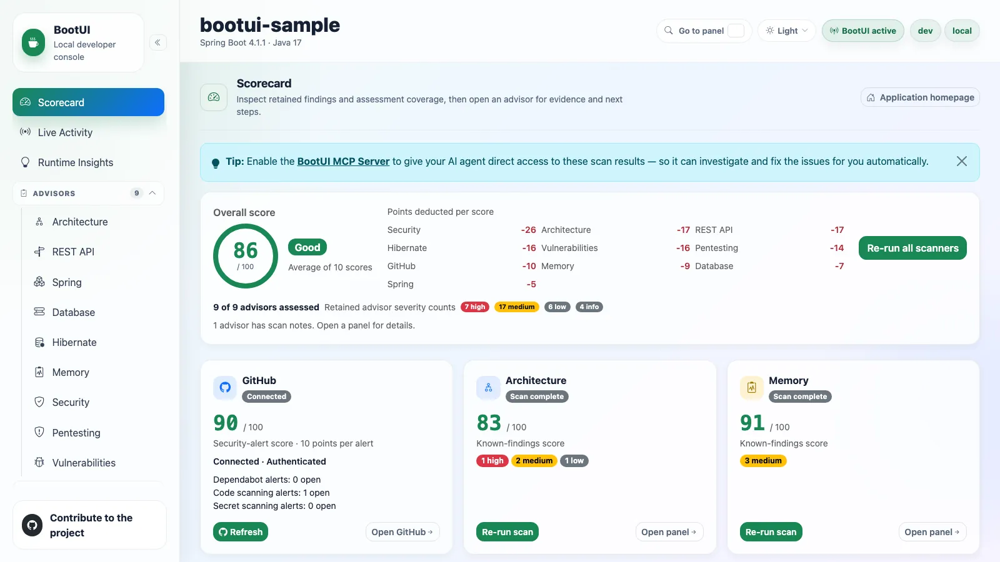
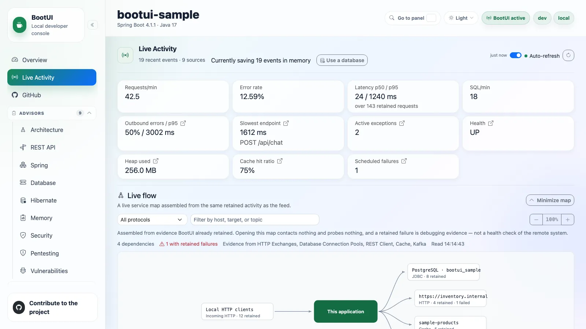
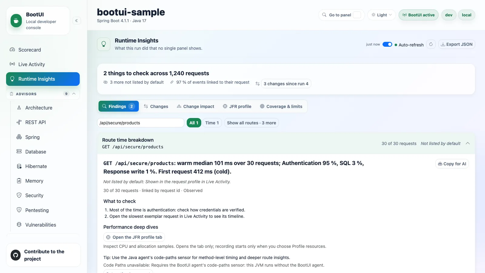

# Home

The top of the sidebar, shown without a group header, holds the three panels you start from: the **Scorecard** for what
to fix, and **Live Activity** and **Runtime Insights** for what the application is doing now.

## Scorecard

The Scorecard panel is BootUI's landing page. It opens with the standard panel header and a link to the running
application's homepage, and its centrepiece is an on-demand findings and coverage summary. It lives at `#/scorecard`,
and the former `#/overview` route redirects there. Its panel id stays `overview`, so `bootui.panels.overview.enabled`
still controls it.

Nothing is scanned on load. The Scorecard reads the existing cached reports on first navigation and when you return from
another panel, including scans started in an advisor panel or by a local agent. Those GET requests never start a scan,
a probe, or an external query. Before any scan has run, the summary reports how many visible advisors have been
assessed and prompts you to run them.

**Run all scanners** triggers every available scanner, or you can run each card on its own. After a run-all, a
dismissible tip points at the MCP Server panel, since enabling it lets an AI agent read these same results and fix the
findings for you.

### Overall score

The overall score is the rounded arithmetic mean of the eligible, available, visible advisor scores, plus the GitHub
security-alert score when that is eligible. **Average of N scores** names the contributing count, and the **Points
deducted per score** grid shows each contributor's own score minus 100. Those deductions are not summed to produce the
overall score.

The gauge bands are **Good** (80–100), **Needs attention** (50–79), and **At risk** (0–49). They describe the scored
results and help prioritize review. They do not measure application safety or assessment completeness, and running one
more clean scanner can raise the average without fixing a single finding. Numeric scores and retained severity labels
stay visible, so meaning never depends on color alone.

With no eligible scores the summary reads **Not scored** and prompts an explicit scan. Unscanned, invalid, missing, and
confirmed-empty assessments contribute neither 0 nor 100, and GraalVM and CRaC readiness scans never contribute at all,
so running only those leaves the Scorecard **Not scored** rather than at zero. A genuine eligible score of zero does
contribute. Usable partial reports contribute their known-findings score unchanged, with no penalty for missing checks.

### Scanner cards

Each card leads with a 0–100 known-findings score for an eligible assessment, followed by its retained severity counts.
The severity-based scanners are Architecture, Memory, REST API, Spring, Database, Hibernate, Security, Pentesting, and
Vulnerabilities. Each starts at 100 and subtracts a fixed weighted penalty per finding, so a complete clean scan stays
at 100:

| Severity | Penalty |
| -------- | ------- |
| Critical | 25 |
| High | 10 |
| Medium | 3 |
| Low | 1 |
| Info | 0 |

Limited coverage never changes those penalties, even at 100.

A card shows its scan status as a badge — `Not scanned yet`, `Scan complete`, `Incomplete`, `Scan failed`, or
`Scan disabled` — and, next to it, how the report was assessed:

| Assessment | Meaning |
| ---------- | ------- |
| A score | The report is eligible. **Scan complete** means the scan finished, not that it assessed every applicable check. |
| **Not scored** | No eligible score. **Open panel** shows the full reason. |
| **Not applicable** | Confirmed empty scope: `usable: false`, `coverageComplete: true`, and no limitations. |

A card that has never been scanned keeps its **Run scan** action.

Secondary diagnostics stay in each advisor's collapsed **Scan notes**, reachable through **Open panel**. The Scorecard
summarizes how many advisors have scan notes instead of repeating each explanation, counting partial scans and
completed scans whose coverage is incomplete or unknown. Unscanned, failed, disabled, and unavailable scanners never
inflate that count, and neither does confirmed-empty scope.

::: details What can and cannot establish a score

`SCANNED` and `PARTIAL` reports can score known findings or completed applicable evidence. Skipped, failed, vacuous,
and unknown-only evidence cannot, and `ERROR`, `DISABLED`, and `NOT_SCANNED` never score.

A report counts as assessed when it is an accepted `SCANNED` or `PARTIAL` report with valid explicit evidence, even if
that evidence cannot support a number. Confirmed-empty scope counts as assessed too. Missing legacy evidence, unscanned
reports, and failed reports do not, and request failures are reported separately while preserving the last report.

Vulnerabilities can score known findings despite inventory, query, or detail gaps. UNKNOWN carries no penalty but
cannot establish eligibility, even after dismissal. A clean dependency needs completed query and detail evidence and a
genuinely empty retained advisory list. See [score eligibility](advisors.md#score-eligibility).

:::

Dismissals remove penalties, not safety concerns or evidence gaps. No coverage percentage or application-wide
completeness claim is inferred.

### GitHub card

GitHub is not a severity scanner, so it is excluded from the advisor counts and severity totals. Its card shows
connection and authentication state, reading **Connected** when connected, plus the reported Dependabot,
secret-scanning, and code-scanning signals. Only
available numeric counts are shown as open alerts, because an unavailable count is not a zero.

Its security-alert score subtracts 10 points per reported alert from 100, counting at most 10 alerts per signal, then
clamps the result to 0–100. Three saturated signals therefore reach 0, and further alerts on one signal do not lower it
again. That is an alert-count heuristic, not an assignment of HIGH severity. Eligibility requires an available, connected, authenticated report with
exactly one `AVAILABLE` signal carrying a nonnegative safe integer count for each of `Dependabot alerts`,
`Code scanning alerts`, and `Secret scanning alerts`, matched exactly. Confirmed zeros score 100. Missing, empty,
malformed, duplicate, and unavailable signals leave GitHub **Not scored**, even when another signal reports known alerts, and an unscored GitHub is excluded
from the overall average. The actual counts stay visible either way.

Connecting and refreshing are always user-triggered, including through **Run all scanners** when GitHub is the only
available card. Refreshing or a failed request preserves the last accepted report and its score, while a newly received
unavailable report clears that score.

### Refresh behavior

Disabled and unavailable panels are excluded, and automatic reads wait for the panel manifest and use only supported,
enabled advisor endpoints. Returning from a panel refreshes the cached reports with GET requests, including
Vulnerabilities after a dismissal or restoration.

A busy or failed request keeps the last accepted report and adds a warning or an error. An authoritative new report
replaces the old assessment, scoring usable partial evidence and excluding failed or unusable reports. A `NOT_SCANNED`
response, such as after an application restart, replaces the old findings and returns the card to **Run scan**. A scan
already in progress finishes before the return-navigation refresh reads its updated report.

The panel is available on every adapter. The scoring dashboard is rendered entirely in the browser: the shell reads
each advisor's own reports and displays its independent score, so no backend dashboard service is involved. The shell
chrome around every panel — application name, framework and version, Java version, active profiles, and active or
disabled status — comes from the framework-neutral `GET /bootui/api/overview` endpoint every adapter exposes.

That endpoint also reports the current **run** in its `run` object: a random `instanceId` for this JVM's BootUI
instance, and a random `runId`, an `ordinal`, and a `startedAt` time for the current application start. A Spring
DevTools restart or a Quarkus live reload starts a new run with the next ordinal inside the same instance. The ids carry
no host, user, or application data.

## Live Activity

The diagnostics home base: one reverse-chronological stream of everything the application just did, plus a per-request
profiler for drilling into any single request.

It adds almost no new instrumentation. Six of its ten signals reuse the same buffers and controllers behind the HTTP
Exchanges, SQL Trace, REST Client, Exceptions, Security Logs, and Email panels, so every value is already masked,
self-filtered, and bounded exactly as it is there.

### The ten signals

| Signal      | Type          | Captured from                                                          | Adapters                     |
| ----------- | ------------- | ---------------------------------------------------------------------- | ---------------------------- |
| Requests    | `REQUEST`     | HTTP Exchanges                                                         | All                          |
| SQL         | `SQL`         | SQL Trace                                                              | All                          |
| Exceptions  | `EXCEPTION`   | Exceptions                                                             | All                          |
| Security    | `SECURITY`    | Security Logs                                                          | All                          |
| Emails      | `MAIL`        | Email                                                                  | All                          |
| Scheduled   | `SCHEDULED`   | Spring's scheduling observability hook; Quarkus's CDI execution events | All                          |
| Messaging   | `MESSAGING`   | Kafka and RabbitMQ everywhere, JMS on Spring only                      | All                          |
| REST client | `REST_CLIENT` | REST Client                                                            | Spring MVC, WebFlux, Quarkus |
| Cache       | `CACHE`       | A dedicated recorder that stores only a hashed key                     | Spring MVC, WebFlux          |
| Fault tolerance | `FAULT_TOLERANCE` | Resilience4j, Spring Retry, and SmallRye Fault Tolerance     | All                          |

Scheduled-task capture records each `@Scheduled` method _execution_ — start, success, failure, duration — without extra
proxying on either adapter. Each run also gets its own BootUI execution id while it runs, so the SQL statements,
exceptions, and REST client calls it makes nest under the run, even on another thread. On Quarkus this covers blocking
`@Scheduled` methods; one returning a `Uni` or `CompletionStage` completes later and its run carries no execution id. Cache rows summarize the operation and cache name (`MISS orders`), with `WARN` severity for
a miss and `OK` otherwise; the detail shows only a short hashed key (`key a1b2c3…`), never a raw key or value, even
under full value exposure.

### Reading the feed

Each row carries a timestamp, a type icon, a severity (`OK`, `SLOW`, `WARN`, `ERROR`), a one-line summary, and a
duration. Failed rows are highlighted. Slow requests are tinted on a graduated yellow-to-red heat scale crossing 100,
200, 500, and 1000 ms, with a matching latency badge. A request whose correlated SQL looks like an N+1 access pattern
carries a red **N+1** badge in the row itself, computed with the same threshold and logic the profiler uses, so the two
views never disagree.

When the feed is unfiltered, signals BootUI can pin to a request are **nested chronologically beneath it** and expanded
by default, so one click shows exactly what a single request did, in order. Requests that triggered a security event are
flagged **authenticated** with a lock icon and the caller's principal. Signals that cannot be tied to a request stay
top-level, and any filter or search flattens the feed so the query spans every signal.

Adjacent identical entries collapse with an occurrence count. The feed filters by type, severity, free text (path,
status, SQL, or exception class), and an **errors-only** toggle; the chosen filters persist across reloads. A
requests-over-time sparkline above the table makes spikes and error bursts visible at a glance. With the runtime journal
as its source, dashed lines on it mark what can explain a change in traffic, each also listed as a **MARKER** row: a
change made from a BootUI panel (a logger level, a configuration override, a cache clear, a migration, **Clear
recording**, a heap dump), an availability change, a configuration refresh, or shutdown. A marker names what was
targeted, never a value.

Because the feed is genuinely event-driven, it refreshes over **Server-Sent Events** rather than fixed-interval polling.
The browser subscribes to `/bootui/api/activity/stream` and re-fetches when any source signals a change. The feed can be
paused and resumed so a row you are inspecting does not scroll away.

Every row is a launchpad. Clicking a request row opens its profiler; every row deep-links to its dedicated panel with
the originating record pre-filtered. A `MAIL` row opens that exact message's detail drawer, not just a filtered list.

::: details The KPI strip

Across the top: requests per minute, error rate, p50/p95 latency, SQL rate, the slowest recent endpoint, active
exception count, health status, heap usage, and scheduled-task failure count. On Spring servlet and WebFlux only,
outbound REST-call error rate and p95 latency, plus the cache hit ratio. All are computed from the same buffers, and
sub-millisecond SQL is shown as `<1 ms`.

The p50/p95 latency and the slowest request are computed once, in the shared engine, over every retained request with a
duration, so Spring MVC, Spring WebFlux, and Quarkus report the same figures for the same traffic; the latency card
states how many requests they cover. The slowest request is labelled with its resolved route, such as
`GET /api/orders/{id}`, and a tie goes to the newest request.

Several cards are launchpads: outbound-errors opens **REST Client**, slowest-endpoint opens that route's row in the
[HTTP Exchanges route rankings](diagnostics.md#route-rankings) with its exchanges listed, and the active-exceptions,
health, heap-usage, cache-hit-ratio, and scheduled-failures cards jump to **Exceptions**, **Health**, **Heap Dump**,
**Cache**, and **Scheduled Tasks**.

:::

### The per-request profiler

Clicking a request opens a Symfony-style drawer that correlates that request's SQL, exceptions, security events, REST
client calls, and cache accesses. It degrades gracefully and never fabricates data — every section is labelled with the
tier that correlated it, and the whole profile is marked approximate whenever a time-window match was used.

| Tier           | How it matches                                                              | Adapters             | Labelled        |
| -------------- | --------------------------------------------------------------------------- | -------------------- | --------------- |
| Request id     | The BootUI request id stamped on the signal when it was recorded            | All                  | **exact**       |
| Trace id       | A trace id that exactly one captured request carries                        | All                  | **exact**       |
| Serving thread | The one worker thread that served the request, inside its window            | Spring MVC           | **exact**       |
| Time window    | The request's time window — plus method and path for exceptions, and the principal for security events | Spring MVC | **approximate** |

One shared engine assembler builds the profile on every adapter, so identical evidence produces an identical profile.
A servlet request runs start-to-finish on one worker thread that serves only one request at a time, so work on that
thread is unambiguously its own. Spring WebFlux and Quarkus serve requests on shared event-loop and worker threads, so
their profiles correlate by request id and trace id only and list the serving-thread and time-window tiers as
unavailable rather than guessing. A request there is profileable when it carries either id, so it is profileable without
tracing too. Every correlated signal carries the request id; each exception occurrence carries its own. For SQL, the
time-window fallback applies only when
no statement matched a request id, a trace id, or the serving thread. On Spring MVC, exceptions still match the
request's method, path, and window; a trace id or the serving thread then settles which request threw them.

Security audit events follow the same rule: matched by time window and principal, but pinned exactly to the serving
thread when BootUI captured them there, so two concurrent requests sharing a principal cannot trade security events. An
event proven to have fired on another thread is excluded.

A signal attaches to at most one request. A trace id shared by two captured requests — a reused inbound
`traceparent`, or an application calling itself — attaches nothing to either, and a signal that two requests' threads
or windows could equally claim, such as a statement inside the overlapping windows of two concurrent identical
requests, stays out of both profiles. The notes count every such signal, so nothing is attributed by guesswork. When a
section mixes tiers, each entry names the tier that matched it.

**REST client calls** are shown exactly as the REST Client panel shows them, with query and header values masked by
the same exposure policy, and **cache accesses** carry only the short key hash the cache recorder computed, never a raw
key or value. Like the stream, both attach by trace id or serving thread only, never by time window. Quarkus has no
cache-access capture seam, so its cache section says so.

Identical repeated `SELECT`s above `bootui.activity.n-plus-one-threshold` are flagged as a potential N+1. Each flagged
group lists the call sites in your own code that issued it — class, method, and line, captured by
`bootui.sql-trace.capture-call-site` (on by default) — so you know which repository or service method to fix.

Each section shows at most 200 entries and states how many more were correlated; N+1 groups and timing still count
every correlated statement and call, and at most 200 statement groups are listed. A section whose source panel is disabled or not capturing explains why instead of
looking empty.

The drawer also shows the request's timing breakdown (SQL and outbound REST calls versus everything else), its auth
context, and the trace span list. **Escape** dismisses it, focus is trapped while it is open, and **Copy profile**
exports the already-masked correlated timeline — including REST client calls, cache accesses, tiers, and truncation — as
plain text to paste into a bug report. Opening a profile only reads evidence BootUI already captured: it captures
nothing new, calls no network service, and changes no state. Opening Live Activity with `?request=<exchange id>`, as
each HTTP Exchanges row's **Profile** link does, opens that request's profile directly.

Scheduled-task runs nest correctly in the stream but are not part of the profiler's correlated timeline or **Copy
profile** export. The REST Client panel keeps its own "chatty" badge for now.

### Messaging capture

Kafka, RabbitMQ, and JMS activity land in the same `MESSAGING` stream. **Payloads are never captured** — only metadata
— because a message payload is an arbitrary, potentially large and sensitive application object with no generic masking
strategy. Raw exception messages are not retained either; failed operations carry only generic failure text.

Each consumed message runs as an execution of its own, with its own BootUI execution id, so the SQL statements,
exceptions, REST client calls, and messages its listener produces nest under it. An outgoing message nests under the
request, scheduled run, or consumed message that sent it. For Kafka on Spring, whose client reports a send on its own
I/O thread, BootUI snapshots the sender's context when `KafkaTemplate` sends the record. On Quarkus, the execution id
is attached to the Vert.x context SmallRye Reactive Messaging processes the message on, so it follows the listener to
a worker thread, and a send's context is snapshotted when the message enters its channel. JMS capture is Spring-only.

::: details Kafka capture

On Spring, BootUI wraps every application-owned `KafkaTemplate` with a `ProducerListener` and every `@KafkaListener`
container factory with a `RecordInterceptor` — composing with, never replacing, whatever the application already
configured. On Quarkus, it hooks SmallRye Reactive Messaging's Kafka interceptors.

Each entry records topic, partition, offset (consumed records only), a hash of the key, direction, success or failure,
and — for consumed records — consumer group id, listener identifier, and processing duration. A producer send's
duration is not exposed by either framework's callback, so it is not tracked.

The listener identifier is intentionally framework-specific: the listener container factory bean name on Spring, since
the per-`@KafkaListener` id is not exposed at the factory-wide interception point, and the channel name on Quarkus.

Capture is on by default whenever the Kafka integration is present and the panel is enabled. Tune it with
`bootui.kafka.enabled`, `bootui.kafka.capture-key`, `bootui.kafka.max-entries`, and `bootui.kafka.max-key-length`.

:::

::: details JMS capture (Spring MVC and WebFlux only)

Requires `spring-jms` and `jakarta.jms` on the classpath. Every `JmsTemplate` bean is wrapped by a CGLIB proxy that
intercepts `send`/`convertAndSend`; every `AbstractJmsListenerContainerFactory` bean is proxied so each container it
creates has its listener wrapped by a matching plain or session-aware adapter. Both compose with the application's
existing converters, callbacks, and error handlers without replacing them or changing the dispatch interface.

Direct `JMSContext`, `MessageProducer`, or `MessageConsumer` usage is outside this seam, matching how Kafka and RabbitMQ
instrument at the framework-integration level.

Each entry records a sanitized destination name — only explicit names and standard `Queue`/`Topic` accessors are
trusted — plus direction, success or failure, and duration. When a `MessageCreator` or `MessagePostProcessor` exposes
the provider-assigned JMS message ID, only its one-way hash is retained. **Payloads, arbitrary headers and properties,
the raw message ID, and exception messages are never captured.**

JMS uses its own recorder, bounded buffer, and mapper, so JMS traffic cannot evict Kafka history and either transport
can be disabled independently. Tune it with `bootui.jms.enabled`, `bootui.jms.capture-message-id`,
`bootui.jms.max-entries`, and `bootui.jms.max-message-id-length`. No Quarkus JMS equivalent is claimed.

:::

### Durable history

By default the stream is in-memory only: history is lost on restart and the feed reaches back only as far as its small
buffers. Setting `bootui.activity.persistence.enabled=true` flushes captured entries to a SQL database over direct JDBC
every `bootui.activity.persistence.flush-interval` (5 seconds by default).

With persistence on, the panel gains a **Load older** button, the type/severity/free-text filters become real database
queries instead of filtering only what is on screen, and a "· persisted history" note appears next to the subtitle.

The backing table (`bootui.activity.persistence.table-name`, default `bootui_activity`) is created on first use.
Several instances can safely share one table: each tags its rows with an `instanceId` (defaulting to `HOSTNAME`) and
never reads or prunes another instance's rows. Reads merge the in-memory buffer with the durable store, so recent
entries are visible before they are flushed, and a failed flush returns its entries to the buffer rather than losing
them.

Every `bootui.activity.persistence.capture-interval` (2 seconds by default), BootUI stores the stream entries it has not
stored yet, so each entry is saved once. An entry can leave the stream and come back: newer entries push it out of the
capped stream until they are cleared, for example when `bootui.free-on-idle` releases captured SQL, or an exception
recurs. Failed and slow entries are therefore remembered longer, in one window per kind of entry. Requests, statements,
and REST calls are recognized by the rule and threshold of the
[failure-preserving buffer](diagnostics.md#failure-preserving-retention) that keeps them, which includes a slow `4xx`
request shown as `WARN`. Each window is `bootui.activity.persistence.buffer-max-entries` wide. A routine entry that
comes back after more entries than that were stored can be stored again, and one that an extreme burst pushes out
before the next capture can be missed.

You do not have to edit configuration or restart to turn this on. While persistence is inactive, a "Currently saving N
events in memory" tip appears with a **Use a database** button. If the application already has a `DataSource`, a **Use
the existing datasource** action checks it, creates the table, and hot-switches the running instance with no dropped
entries and no restart. It is confirmation-gated like every other state-changing action. The switch is **runtime-only**:
nothing is written to disk, so a restart reverts to in-memory unless the property is also set in configuration. With no
`DataSource` present, the button links to the setup documentation instead.

With persistence off, none of this costs anything: no extra bean, thread, or connection is created.

### Runtime journal

BootUI 2.0 also records every runtime event once in a bounded, in-memory runtime journal: requests, SQL statements,
exceptions, security events, REST client calls, cache accesses, messages, scheduled runs, transactions on Spring, logical
database connections, and application `WARN` and `ERROR` log events, each with the request or execution it belongs to. A log event keeps its
unformatted template, never its arguments. SQL statements, REST client calls, and cache accesses keep up to four
frames of your own code that issued them, skipping framework classes and generated proxies, and a message consumed
with a `traceparent` header keeps the trace that sent it. A task a request hands to a framework-managed executor, such
as an `@Async` method on Spring Boot's auto-configured executor or scheduler, or a Quarkus `ManagedExecutor` task, runs
as an execution of that request, so its work stays with the request; on Spring this applies when the application
defines no task decorator of its own, which BootUI never displaces. Raw executors and `CompletableFuture` are not
followed. It keeps running aggregates per route, statement, exception group, and thread family, which
count every event even after the journal evicts it. Recording never slows a request: when the journal cannot keep up,
it drops events, counts them per source, and drops routine events before failed or slow ones. BootUI's own requests,
and the SQL its panels run while serving them, are never recorded. Pausing a panel's recording, or BootUI releasing
its buffers while the console is idle (`bootui.free-on-idle`), stops only what that panel keeps: the journal keeps
recording SQL statements, connections, transactions, REST client calls, AI calls, and security events.

**Recording** in the panel header opens the journal's status: the events and memory it retains against its bounds,
when its oldest event happened, how many events each source recorded in this run, and how many were evicted or
dropped. The status is read only when you open it. **Clear recording** drops the events and aggregates of this run,
after a confirmation, and keeps the counts, so drops and evictions stay visible. When the application restarts in the
same JVM, as after a DevTools restart or a Quarkus live reload, BootUI keeps a summary of the run that ended, at most
256 KB each, for the 5 most recent runs. **Previous runs** lists them with their requests, failures, and events, or says
why none can be kept when BootUI itself is reloaded with the application. A summary keeps the run's counts and
histograms per route, statement fingerprint, and exception group, and the edges its requests, jobs, and listeners
observed, such as a route reading a table or calling a host, and what the run recorded when it started: its time to
ready and slowest bean instantiations (Spring), its active profiles, data source URL shapes, cache, and whether
tracing was on, which decide whether two runs can be compared. To keep the last run across a full JVM restart, set
`bootui.runtime-journal.baseline-file`, for example to `target/bootui-baseline.bin`: the summary is written there
when the run ends, and read back at the next start when the JVM keeps no previous run. The journal is sized and
scoped by the `bootui.runtime-journal.*` [properties](../PROPERTIES.md#runtime-journal).

**Recorded by** chooses where the feed comes from. **Default** follows `bootui.activity.feed-source`, which is the
runtime journal unless set to `buffers`. **Runtime journal** renders the feed from the journal: every child nests under
its request, scheduled run, or consumed message by id, transactions and log events appear as rows, an AI call appears as
an **AI** row with its model, provider, tokens, and finish reason, nested under the request that started it (an error
when it failed, a warning when the model stopped at its length limit), and three more filters apply on the server: a
**Route** such as `GET /api/orders/{id}`, with its requests' children, a **Request id**, and **No request**, which keeps
only work outside any request. The journal keeps no exception or log messages, principals, or email subjects, so a row
shows them only while the panel that captured them still holds them. **Panel buffers** merges each panel's own buffer,
as BootUI 1.x does. The feed refreshes whenever the journal records anything.

A request's profile drawer also shows **Recorded by the runtime journal**: the route it was grouped under and where it
stands against that route's median and 95th percentile once the route has 5 requests; the CPU time, memory, and GC
pauses it used, or why they could not be measured, as on a virtual thread; a timeline of its statements, connections,
transactions, cache accesses, messages, log events, REST client calls, and AI calls, each placed at its start, with a GC
lane for the collections that completed while it ran; and what it touched: the tables its statements name, data
sources, transactions, caches, destinations, hosts, log templates, and AI models.

**Resources** in the panel header opens **Work outside requests**: where this run's CPU time went, as the share
credited to requests, each thread family's work outside them, BootUI's own threads, and the JVM's own work (GC, JIT,
and VM threads), which together are the process's CPU time. A resource lane below shows heap used and process CPU over
the last 15 minutes. It is read only when you open it, and sized by the `bootui.resources.*`
[properties](../PROPERTIES.md#resource-correlation).

### Safety and limits

The panel inherits BootUI's full safety model — loopback filter, Host allow-list, cross-site write defenses, value
masking. Its reads are read-only, and its two state-changing actions, **Use the existing datasource** and **Clear
recording**, are confirmation-gated and blocked whenever the app or panel is read-only.

The stream is capped by `bootui.activity.max-entries`. The slow-request threshold,
`bootui.activity.request-slow-threshold-ms` (1,000 ms by default, `0` to disable), applies on Spring MVC, Spring
WebFlux, and Quarkus alike: it sets the `SLOW` severity of request and scheduled-task entries, and decides which HTTP
exchanges the [failure-preserving retention](diagnostics.md#failure-preserving-retention) keeps longer, and so which
requests durable history remembers as kept. Individual
sources can be turned off through their own `bootui.panels.*` toggles; a disabled source simply drops out of the
stream.

### Per-stack behavior

Durable persistence, the "Use the existing datasource" hot-switch, N+1 detection, its row badge, and call-site capture
are shared engine code on every adapter. A request that resolves any SQL correlation gets byte-identical N+1 flagging
everywhere.

What differs is **how signals correlate to a request**, because only the servlet model gives a request its own thread:

- On every stack, SQL statements, exceptions, security events, cache accesses, REST client calls, emails, and
  fault-tolerance events first match **BootUI's own request id**, so they nest exactly, with or without tracing, even
  when identical requests overlap. An exception group nests under the request its latest occurrence came from.
- **Spring MVC** then uses the full tiered join above: trace id, then serving thread, then time window.
- **Spring WebFlux** and **Quarkus** then correlate by **trace id only**. Reactor Netty and the Vert.x event loop have
  no thread-per-request model, so the thread-based and time-window tiers do not apply. A signal with neither id shows
  flat rather than nested, and without a trace id the profiler drawer honestly reports itself unavailable rather than
  fabricating a partial profile.

::: details How each adapter obtains a trace id

Both Spring adapters stamp the server-created trace id onto Actuator's trace-id-less HTTP exchange model through the
same bounded `HttpExchangeTraceRegistry`. MVC reads the SLF4J MDC value its SQL, cache, and REST capture already use;
WebFlux reads the active OpenTelemetry span across Reactor hops. Each record carries the request's BootUI request id,
so an exchange BootUI's own repository recorded finds its own record and keeps its trace id and route template even
when identical requests overlap. An exchange from an application-provided repository has no request id, so it is
matched by method, path, and overlapping time, and reads no trace id when two identical requests overlap.

On Quarkus, `quarkus-opentelemetry` stamps the active server span's trace id at each capture point — the HTTP filter,
REST Client recorder, SQL recorder, exception store, and CDI security-event observer. The OpenTelemetry context
propagates across the event-loop-to-worker hop, so the same trace id is available for blocking JDBC on a worker thread
or a security event from a CDI observer. Trace-id matching is exact, so the profiler reports
`sqlCorrelationApproximate: false`.

Quarkus also stamps BootUI's own request id on each exchange, SQL statement, exception occurrence, security event,
REST client call, email, and fault-tolerance event, with or without OpenTelemetry. The request id travels on the
request's Vert.x context to the worker or virtual thread that continues it, and Live Activity nests a signal under the
request whose id it carries before trying the trace id. Without OpenTelemetry those signals therefore still nest under
their request, including when identical requests overlap.

Spring MVC stamps the same kind of request id on each exchange and on the same signals, plus cache accesses. Actuator's
audit events have no field for it, so BootUI keeps the id current when each event is published beside the event
itself. `RequestCorrelationFilter`
generates it when the request starts and keeps it current on the servlet thread, including during an asynchronous
redispatch of the same request and during the container's `/error` dispatch.

Spring WebFlux does the same without a serving thread. BootUI's reactive correlation wraps the whole HTTP handler,
writes the request id into the Reactor context, and registers a Micrometer context-propagation accessor, so Reactor
restores it on the event loop, `boundedElastic`, and `parallel` threads the request hops to. BootUI contributes
`spring.reactor.context-propagation=auto` as an overridable default for this. If the application sets `limited`, or
has no Micrometer context propagation, only the thread that assembles the request sees the id, and statements on other
threads carry none rather than a guessed one.

:::

Two further Quarkus differences: SQL trace contributes only when a JDBC datasource is configured (the recorder is gated
on Agroal), and because the baseline Quarkus feed has no server-side `type`/`severity`/`since` filtering, those filters
only take effect once persistence is switched on. Quarkus's own security layer authenticating the caller takes
precedence over a correlated audit event when both are known.

For per-panel detail see [Framework support](../FRAMEWORK-SUPPORT.md).

### Live flow (service map)

A compact service map sits between the KPI summary and the feed controls, served by
`GET /bootui/api/activity/service-map` on every adapter. Where the feed answers "what just happened, in order?", the map
answers "what does this application actually talk to?" — the application at the centre, a generic **Local HTTP clients**
lane feeding in, and one node per outbound dependency.

**Nothing is instrumented and nothing is contacted.** Opening the map performs no network call, probe, DNS lookup,
connection attempt, or scan. It is assembled entirely from buffers other panels already fill: inbound requests, outbound
HTTP calls grouped to a `scheme://host[:port]` origin, configured JDBC pools, retained SQL statements, cache accesses,
Kafka **producer** topics, and RabbitMQ **publisher** destinations. Consumed Kafka records and consumed AMQP messages
are inbound work, so they are deliberately never drawn as outbound dependencies.

The map separates what is **configured** from what has been **observed** and never collapses the two. A declared
datasource with no traffic is drawn with a dashed outline reading "configured, no recent evidence" rather than
disappearing. Selecting any node opens an evidence panel with retained interaction and failure counts, when it was last
seen, an explicit note about what that node does and does not prove, a tail of recent interactions, and a deep link into
the source panel. A retained failure is debugging evidence, never a health check of the remote system — BootUI has not
contacted it.

Statement evidence is attributed to a pool only when attribution is unambiguous: exactly one configured pool and exactly
one traced datasource whose name matches it. Otherwise statements are summarized on their own **SQL statements** node,
the pools stay configured-only, and the reason is stated as a warning.

Identity is deliberately subtractive. An HTTP dependency is only ever an origin — user-info credentials, paths, query
strings, and fragments are dropped before serialization, and a call that cannot be reduced to a safe origin is left off
the map with a visible warning rather than shown under a guessed identity. JDBC targets independently lose authority and
Oracle credentials plus any driver parameter tail, even under full value exposure. SQL text, bound parameters, message
keys, payloads, and headers never reach this contract at all. Cardinality is capped at 28 dependencies before rendering;
anything withheld is reported as a visible count, never dropped silently.

Cache is a first-class dependency on Spring MVC and WebFlux whenever at least one `CacheManager` was successfully
instrumented, grouped by cache manager and cache name — never the key or value. An enabled recorder without an
instrumented manager does not advertise a source that cannot receive evidence. Quarkus honestly reports no cache
dependency at all: `quarkus-cache`'s built-in interceptors leave no comparable seam, the same reason its feed has no
`CACHE` entries.

::: details Motion, layout, and accessibility

Motion is evidence, not decoration. The map refreshes off the same Server-Sent Events tick as the feed and animates a
particle only when a **stable** edge — present both before and after the refresh — carries an interaction id the
previous snapshot did not. A first load animates nothing, a new dependency simply appears, and an idle application is
completely still. Bursts are coalesced to a small per-edge count and a hard concurrent cap rather than queued, so motion
can never lag behind reality.

When freshly animated interactions share a non-null opaque flow id, the inbound pulse starts immediately and downstream
pulses replay only after it would have arrived, in retained completion-time order with a bounded stagger. A downstream
pulse whose batch carries no retained inbound item fires immediately rather than waiting for evidence that may already
have scrolled out of the tail. Sequencing changes only pacing, never the evidence itself.

Slow interactions pulse a calm amber for longer than normal completions or failures, with a restrained trailing halo, so
timing carries meaning without relying on color alone. A temporary target ring and text chip (`SLOW · 1.3 s` or `ERROR`)
appears only for the pulse's scheduled window. Retained failures stay visible in counts, details, and accessible text,
but never leave nodes or edges permanently red.

The spatial model is hybrid and deterministic: inbound lane left, application hub centre, and an airy right-facing fan
for up to six dependencies before denser maps switch to a two-column rack. The fan uses a 288-pixel radius and 72-pixel
vertical pitch, keeping a typical map around 852 logical pixels wide once the inbound lane is included. The rack uses a
72-pixel application gap, 32-pixel column gap, and 26-pixel row gap, bounded at 1,228 by 1,046 pixels at the
28-dependency cap inside the scrollable stage. Fan connectors and collision-free rack routes are reused exactly by each pulse and slow trail through
CSS Motion Path, so dynamically inserted evidence starts on its own mount-relative delay instead of the SVG document
timeline.

The map is keyboard navigable (arrows move between nodes, Enter or Space selects), carries a hidden textual list of
every node and relationship for screen readers, and supports protocol and free-text filters plus zoom. Under
`prefers-reduced-motion`, particles are replaced by a brief static highlight plus a polite live-region sentence naming
what changed and its duration. Evidence from a disabled or unavailable source panel never reaches the map.

:::

Developers who want a denser event-first view can minimize the map; that preference is remembered in the browser while
the feed stays visible underneath. The viewport adapts to the graph's content, up to a bounded scrolling height.

## Runtime Insights

**Runtime Insights** answers what this run did that no single panel shows. It reads the
[runtime journal](#runtime-journal) and projects its retained events into observations: each one names what was counted
on a route, never a cause, a severity, or a score. Opening the panel starts no capture, scan, database read, or network
call; it only re-reads what the journal already recorded, and caches the result until the journal records more.

Seventeen observations run over the completed requests and garbage collections the journal retains:

| Observation | What it counts |
| --- | --- |
| `route-time-breakdown` | Where a route's warm requests spend their time: authentication, authorization (Spring, from the `authorization` source: a request's checks out of the filters, a method's out of the handler), other filters, connection wait, SQL, REST client calls, AI calls, synchronous message sends, other handler work, and the response write. Overlapping calls count once, and each route's first request is reported apart as cold |
| `exception-hotspots` | Exception groups per route, by a signature that survives line shifts, marked when the previous run served the route without them |
| `errors-behind-2xx` | 2xx responses whose own request rolled back its transaction, recorded an exception, wrote an `ERROR` log, or received a downstream 5xx; requests a retry or fallback recovered are listed apart |
| `repeated-selects` | The same SELECT run five or more times in a request after another statement, from three requests |
| `connections-per-request` | Requests that held two or more connections of one data source at the same time |
| `safe-method-dml` | GET or HEAD requests that wrote to the database, worded as a question |
| `proxy-bypass` | Spring only: a `@Transactional` method whose statement ran outside every transaction, a `@Cacheable` method whose statement ran before any access to its cache, or an `@Async` method whose statement ran on the request's own thread, named with the frame that called it. The proxy was bypassed, as by a call from inside the bean, a `private` or `final` method, or an instance created with `new`; the Architecture advisor's ARCH-SPRING-004 finds such calls in the code. Not applicable with AspectJ weaving or on Quarkus, whose ArC intercepts self-invocation |
| `anonymous-data-reach` | Successful requests an authorization decision proved anonymous that wrote a table, per route and table. Anonymous reads, authenticated writes, and requests no rule checked are never counted, and each row says not to add authorization from it alone |
| `anonymous-success-on-restricted-route` | 2xx answers to proven-anonymous requests on a route whose rules this run saw deny another anonymous caller or require an authority: "a successful anonymous response, not proof that the rule is wrong" |
| `split-transaction-writes` | Requests whose writes committed in two or more independent transactions or autocommit statements |
| `transaction-across-remote-call` | Transactions still open when a REST client call starts, with the connection they held |
| `lazy-sql-after-handler` | SQL run while the response was written, outside every transaction (open session in view) |
| `event-loop-blocking` | JDBC statements started on an event-loop thread |
| `gc-inflated-latency` | The share of a route's slowest tenth of requests, at least five, during which a stop-the-world pause completed, against the share of its other requests, with the pauses' total. Pauses join requests by collector and collection id, never by time, and are worded "a pause completed during", never "caused by" |
| `heap-growth-after-gc` | Old-generation occupancy after the full or mixed collections that reclaimed it, rising across the run from three such collections; the Memory panel links to it. Never called a leak, since a warming cache rises too before it levels off |
| `ai-usage-by-route` | AI operations per route, job, or listener: model calls per request, tokens, input growth, and length-limited answers. Spring AI's model observation and Quarkus LangChain4j's chat listener stamp each call with its request when it is made, so no tracing is needed; GenAI spans received over OTLP fill in what they do not report, without counting a call twice |
| `framework-warnings-by-route` | `WARN` and `ERROR` events from framework loggers, grouped by logger, template, and route |

Scheduled runs and consumed messages are projected like requests, named `@Scheduled OrderJob.run` or
`consume kafka:orders`, so the observations that read a unit of work's own SQL, transactions, calls, exceptions, and
logs also cover jobs and listeners, counted in runs or messages. Those that read what only a request has (its status,
method, phases, authorization, or measured resources) stay on HTTP requests.

Every observation reports whether it ran. One whose journal source is not recorded, whose panel is disabled, or which
does not apply to this stack says so with its reason, so an empty list never reads as healthy. Findings below their
minimum are shown as **insufficient**, naming what is missing, and a source that dropped events marks its findings
**partial**. Each finding has a stable id that survives refreshes and restarts, one to three conditional checks, up to
three exemplar request ids to open in Live Activity, and at most 20 evidence rows. When BootUI changed something during the
window, the report names it among its limitations, and a finding whose evidence names the logger, cache, or key that a
change targeted says so. A breakdown's evidence draws each phase's share
as a bar, with the largest phase emphasized and every number kept beside it.

The header states the window the journal retains, and a coverage strip shows how each source's events are linked to a
request: by request id, by execution id, by trace id, or not at all. `bootui.runtime-insights.ai-token-threshold` sets
the tokens of one model call above which AI usage reports its route from that call alone.

The sample apps seed one case for each observation beside the counterexample it must not report, and
`e2e/scripts/insights-demo.mjs` sends that traffic to a running sample, so the panel can be explored without tracing.

**Not exercised in this run** lists the application's declared routes that no request of this run reached, so nothing
in the panel is mistaken for a verdict on a route that never ran. Framework endpoints, such as the error controller and
Actuator, and catch-all patterns are left out. **Export JSON** saves the report as the panel received it, with no new
request.

**Change impact** answers "what does my change reach?" for a bean, a class, a repository, a table, a cache, or an
outbound host, named in its field and checked only when you ask. It resolves the name to exactly one node of the run's
model, or lists the candidates when it names several, and then lists, eight rows each with totals: the routes that
reach that code through the bean graph and ran in this run, with their requests, anonymous and failed requests, the
tables and caches they read and wrote, and requests to open; the mapped routes that reach it and did not run, each
with a reminder to exercise it; and the routes outside its reach that use a table, cache, or host the routes through
it touched. The structural reach is a count, kept apart from what ran, since a route's traffic does not prove that a
request went through the changed code. Spring MVC and WebFlux read the bean graph and Quarkus its ArC injection edges;
when the beans cannot be read, the impact says so rather than listing nothing. `?impact=<symbol>` opens the panel on a
symbol.

**Profile resources** measures what scope readings cannot, such as CPU on virtual threads. Only when you click it, it
records a JDK Flight Recorder session of `bootui.resources.jfr.max-duration` (30 seconds by default; **Stop now** ends
it early), then joins each CPU and allocation sample to the request that ran on the sampled thread at that moment, in
JFR's own clock, virtual threads included. The results list, per route, the requests sampled, the CPU samples with a bar
for each route's share, JFR's estimate of the bytes allocated, and the hottest application frames. CPU is counted in
samples, never as a measured time. JFR's CPU-time sampler is used on Linux with JDK 25 and later, and its execution
sampler elsewhere; the results say which ran. Starting JFR takes about a third of a second and some 40 MB, and writes a
temporary recording that is deleted once read. A runtime without JFR, or a journal that does not record the
`resources` source, reports why no session can run, and `bootui.panels.runtime-insights.read-only` or
`bootui.read-only` blocks starting one.

**Compared with the previous run** compares this run with the newest run whose summary is kept, after a DevTools
restart, a Quarkus live reload, or, with `bootui.runtime-journal.baseline-file`, a full JVM restart; a picker chooses
another kept run. On a laptop, warmup and noise dominate latency while the work identical requests do is stable, so the
comparison leads with behavior: per route, the statements, REST calls, AI calls, cache misses, and tokens per request,
the share of 4xx and 5xx answers, and the memory allocated per request, each once the route served 3 requests in both
runs; and, from their first occurrence, the statements and exceptions a route did not have before and the routes newly
hit. The runtime model's edges come next, such as "`GET /api/orders` calls host `pay.internal:8443`, 15 times, and not in
run 4", then the restart cost: the time to ready and the beans whose initialization moved by 200 ms and 50 %, compared
only between two restarts, never with a cold start, and on Spring only. Latency comes last and is labelled noisy: the
warm median, leaving out each route's first request, with 10 warm requests on each side and a move of 50 % and 20 ms.
Runs on another database, profile, or cache are **not comparable**, with the difference first; too little traffic is
**needs more traffic**, never "no change".

Live Activity links here in two places. Under its KPIs, **Why is … slow?** opens the slowest route's time breakdown. In
a request's drawer, **Why this route is slow** loads that route's breakdown on demand and links to it.

The panel is available while the runtime journal is enabled (`bootui.runtime-journal.enabled`), on Spring MVC, Spring
WebFlux, and Quarkus. Where a stack lacks a fact, the observations that need it say so: WebFlux marks no request phases,
Quarkus records no transactions and intercepts self-invocation, and Spring MVC has no event loop.
