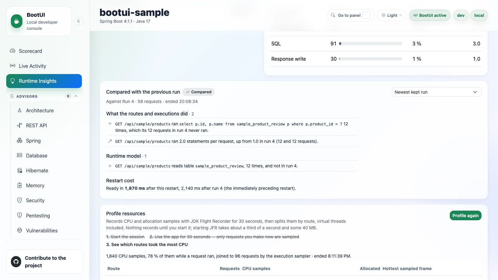

# Home

The top of the sidebar, shown without a group header, holds the three panels you start from: the **Scorecard** for what
to fix, and **Live Activity** and **Runtime Insights** for what the application is doing now.

## Scorecard

The Scorecard panel is BootUI's landing page. It opens with the standard panel header and a link to the running
application's homepage, and its centrepiece is an on-demand findings and coverage summary. It lives at `#/scorecard`,
and the former `#/overview` route redirects there. Its panel id stays `overview`, so `bootui.panels.overview.enabled`
still controls it.

Nothing is scanned on load. The Scorecard reads the existing cached reports on first navigation and when you return from
another panel, including scans started in an advisor panel or by a local agent. Those GET requests never start a scan,
a probe, or an external query. Before any scan has run, the summary reports how many visible advisors have been
assessed and prompts you to run them.

**Run all scanners** triggers every available scanner, or you can run each card on its own. After a run-all, a
dismissible tip points at the MCP Server panel, since enabling it lets an AI agent read these same results and fix the
findings for you.

### Overall score

The overall score is the rounded arithmetic mean of the eligible, available, visible advisor scores, plus the GitHub
security-alert score when that is eligible. **Average of N scores** names the contributing count, and the **Points
deducted per score** grid shows each contributor's own score minus 100. Those deductions are not summed to produce the
overall score.

The gauge bands are **Good** (80–100), **Needs attention** (50–79), and **At risk** (0–49). They describe the scored
results and help prioritize review. They do not measure application safety or assessment completeness, and running one
more clean scanner can raise the average without fixing a single finding. Numeric scores and retained severity labels
stay visible, so meaning never depends on color alone.

With no eligible scores the summary reads **Not scored** and prompts an explicit scan. Unscanned, invalid, missing, and
confirmed-empty assessments contribute neither 0 nor 100, and GraalVM and CRaC readiness scans never contribute at all,
so running only those leaves the Scorecard **Not scored** rather than at zero. A genuine eligible score of zero does
contribute. Usable partial reports contribute their known-findings score unchanged, with no penalty for missing checks.

### Scanner cards

Each card leads with a 0–100 known-findings score for an eligible assessment, followed by its retained severity counts.
The severity-based scanners are Architecture, Memory, REST API, Spring, Database, Hibernate, Security, Pentesting, and
Vulnerabilities. Each starts at 100 and subtracts a fixed weighted penalty per finding, so a complete clean scan stays
at 100:

| Severity | Penalty |
| -------- | ------- |
| Critical | 25 |
| High | 10 |
| Medium | 3 |
| Low | 1 |
| Info | 0 |

Limited coverage never changes those penalties, even at 100.

A card shows its scan status as a badge — `Not scanned yet`, `Scan complete`, `Incomplete`, `Scan failed`, or
`Scan disabled` — and, next to it, how the report was assessed:

| Assessment | Meaning |
| ---------- | ------- |
| A score | The report is eligible. **Scan complete** means the scan finished, not that it assessed every applicable check. |
| **Not scored** | No eligible score. **Open panel** shows the full reason. |
| **Not applicable** | Confirmed empty scope: `usable: false`, `coverageComplete: true`, and no limitations. |

A card that has never been scanned keeps its **Run scan** action.

Secondary diagnostics stay in each advisor's collapsed **Scan notes**, reachable through **Open panel**. The Scorecard
summarizes how many advisors have scan notes instead of repeating each explanation, counting partial scans and
completed scans whose coverage is incomplete or unknown. Unscanned, failed, disabled, and unavailable scanners never
inflate that count, and neither does confirmed-empty scope.

::: details What can and cannot establish a score

`SCANNED` and `PARTIAL` reports can score known findings or completed applicable evidence. Skipped, failed, vacuous,
and unknown-only evidence cannot, and `ERROR`, `DISABLED`, and `NOT_SCANNED` never score.

A report counts as assessed when it is an accepted `SCANNED` or `PARTIAL` report with valid explicit evidence, even if
that evidence cannot support a number. Confirmed-empty scope counts as assessed too. Missing legacy evidence, unscanned
reports, and failed reports do not, and request failures are reported separately while preserving the last report.

Vulnerabilities can score known findings despite inventory, query, or detail gaps. UNKNOWN carries no penalty but
cannot establish eligibility, even after dismissal. A clean dependency needs completed query and detail evidence and a
genuinely empty retained advisory list. See [score eligibility](advisors.md#score-eligibility).

:::

Dismissals remove penalties, not safety concerns or evidence gaps. No coverage percentage or application-wide
completeness claim is inferred.

### GitHub card

GitHub is not a severity scanner, so it is excluded from the advisor counts and severity totals. Its card shows
connection and authentication state, reading **Connected** when connected, plus the reported Dependabot,
secret-scanning, and code-scanning signals. Only
available numeric counts are shown as open alerts, because an unavailable count is not a zero.

Its security-alert score subtracts 10 points per reported alert from 100, counting at most 10 alerts per signal, then
clamps the result to 0–100. Three saturated signals therefore reach 0, and further alerts on one signal do not lower it
again. That is an alert-count heuristic, not an assignment of HIGH severity. Eligibility requires an available, connected, authenticated report with
exactly one `AVAILABLE` signal carrying a nonnegative safe integer count for each of `Dependabot alerts`,
`Code scanning alerts`, and `Secret scanning alerts`, matched exactly. Confirmed zeros score 100. Missing, empty,
malformed, duplicate, and unavailable signals leave GitHub **Not scored**, even when another signal reports known alerts, and an unscored GitHub is excluded
from the overall average. The actual counts stay visible either way.

Connecting and refreshing are always user-triggered, including through **Run all scanners** when GitHub is the only
available card. Refreshing or a failed request preserves the last accepted report and its score, while a newly received
unavailable report clears that score.

### Refresh behavior

Disabled and unavailable panels are excluded, and automatic reads wait for the panel manifest and use only supported,
enabled advisor endpoints. Returning from a panel refreshes the cached reports with GET requests, including
Vulnerabilities after a dismissal or restoration.

A busy or failed request keeps the last accepted report and adds a warning or an error. An authoritative new report
replaces the old assessment, scoring usable partial evidence and excluding failed or unusable reports. A `NOT_SCANNED`
response, such as after an application restart, replaces the old findings and returns the card to **Run scan**. A scan
already in progress finishes before the return-navigation refresh reads its updated report.

The panel is available on every adapter. The scoring dashboard is rendered entirely in the browser: the shell reads
each advisor's own reports and displays its independent score, so no backend dashboard service is involved. The shell
chrome around every panel — application name, framework and version, Java version, active profiles, and active or
disabled status — comes from the framework-neutral `GET /bootui/api/overview` endpoint every adapter exposes.

That endpoint also reports the current **run** in its `run` object: a random `instanceId` for this JVM's BootUI
instance, and a random `runId`, an `ordinal`, and a `startedAt` time for the current application start. A Spring
DevTools restart or a Quarkus live reload starts a new run with the next ordinal inside the same instance. The ids carry
no host, user, or application data.

## Live Activity

The diagnostics home base: one reverse-chronological stream of everything the application just did, plus a per-request
profiler for drilling into any single request.

It reuses the existing panel buffers where it can and supplements them with runtime-journal events. Panel-backed values
remain masked, self-filtered, and bounded exactly as they are in their dedicated panels.

### Feed types

The type filter currently exposes these 17 kinds. Their availability depends on the application's stack, enabled
panels, and installed integrations.

| Signal | Type | Captured from |
| --- | --- | --- |
| Requests | `REQUEST` | HTTP Exchanges |
| SQL | `SQL` | SQL Trace |
| Exceptions | `EXCEPTION` | Exceptions |
| Security | `SECURITY` | Security Logs |
| Cache | `CACHE` | Cache activity |
| Scheduled | `SCHEDULED` | Scheduled-task execution |
| Messaging | `MESSAGING` | Kafka, RabbitMQ, or JMS activity |
| Emails | `MAIL` | Email activity |
| REST client | `REST_CLIENT` | REST Client |
| Fault tolerance | `FAULT_TOLERANCE` | Resilience4j, Spring Retry, or SmallRye Fault Tolerance |
| Transactions | `TRANSACTION` | Transaction activity |
| AI | `AI` | AI Framework activity |
| Logs | `LOG` | Log Tail |
| Application events | `APP_EVENT` | Application event publication and listeners |
| WebSockets | `WEBSOCKET` | Inbound WebSocket handlers |
| ORM | `ORM` | Hibernate sessions |
| Async handoffs | `ASYNC` | BootUI agent executor propagation |

Scheduled-task capture records each `@Scheduled` method _execution_ — start, success, failure, duration — without extra
proxying on either adapter. Each run also gets its own BootUI execution id while it runs, so the SQL statements,
exceptions, and REST client calls it makes nest under the run, even on another thread. On Quarkus this covers blocking
`@Scheduled` methods; one returning a `Uni` or `CompletionStage` completes later and its run carries no execution id. Cache rows summarize the operation and cache name (`MISS orders`), with `WARN` severity for
a miss and `OK` otherwise; the detail shows only a short hashed key (`key a1b2c3…`), never a raw key or value, even
under full value exposure.

### Reading the feed

Each row carries a timestamp, a type icon, a severity (`OK`, `SLOW`, `WARN`, `ERROR`), a one-line summary, and a
duration. Failed rows are highlighted. Slow requests are tinted on a graduated yellow-to-red heat scale crossing 100,
200, 500, and 1000 ms, with a matching latency badge. A request whose correlated SQL looks like an N+1 access pattern
carries a red **N+1** badge in the row itself, computed from literal-free SQL shapes with the same threshold for live
and persisted rows when the same SQL events are available.

When the feed is unfiltered, signals BootUI can pin to a request are **nested chronologically beneath it** and expanded
by default, so one click shows exactly what a single request did, in order. Requests that triggered a security event are
flagged **authenticated** with a lock icon and the caller's principal. Signals that cannot be tied to a request stay
top-level, and any filter or search flattens the feed so the query spans every signal.

Adjacent identical entries collapse with an occurrence count. The feed filters by type, severity, free text (path,
status, SQL, or exception class), and an **errors-only** toggle; the chosen filters persist across reloads. A
requests-over-time sparkline above the table makes spikes and error bursts visible at a glance. With the runtime journal
as its source, dashed lines on it mark what can explain a change in traffic, each also listed as a **MARKER** row: a
change made from a BootUI panel (a logger level, a configuration override, a cache clear, a migration, **Clear
recording**, a heap dump), an availability change, a configuration refresh, or shutdown. A marker names what was
targeted, never a value. **APP_EVENT** rows list the application events a request published and each listener's run:
on Spring through BootUI's event multicaster, transactional listeners' deferral, phase, and skips included; when the
application defines its own multicaster, as Spring Modulith's event publication registry does, BootUI keeps it and
records no application event; on Quarkus
through an interceptor bound at build time to the application's `@Observes` and `@ObservesAsync` methods. Framework
events are left out, and an event's fields are never recorded. Change impact accepts an event type, such as
`OrderPlaced`, and lists the routes that published or consumed it. **ORM** rows give each Hibernate session's statements, flushes,
the auto-flushes that wrote before a query, and the most entities its persistence context held, under the request that
opened it; **WEBSOCKET** rows are inbound WebSocket messages, each an execution owning what its handler did. With the
[BootUI agent](java-agent.md) attached, **ASYNC** rows are the tasks a request handed to a JDK executor, nested under it:
the task's class, the hook that propagated it, its queue time, and its outcome, badged **after response** when it was
still running once the response started, **running** while it still runs, and **past deadline** when it ended more
than `bootui.agent.executors.max-handoff` after it started. The request's journal profile lists them under
**Handoffs**, each with its thread, duration, queue time, what it did (its SQL statements, REST calls, and messages),
its outcome, and its allocated bytes; a task that started more than `max-handoff` after the request ended is only
counted, and neither it nor its work is drawn on the timeline.

Because the feed is genuinely event-driven, it refreshes over **Server-Sent Events** rather than fixed-interval polling.
The browser subscribes to `/bootui/api/activity/stream` and re-fetches when any source signals a change. The feed can be
paused and resumed so a row you are inspecting does not scroll away.

Every row is a launchpad. Clicking a request row opens its profiler; every row deep-links to its dedicated panel with
the originating record pre-filtered. A buffer-backed `MAIL` row opens that message's detail drawer. A runtime-journal
`MAIL` row has no Email-panel message id, so it opens the Email panel without selecting a message.

::: details The KPI strip

Across the top: requests per minute, error rate, p50/p95 latency, SQL rate, the slowest recent endpoint, active
exception count, health status, heap usage, and scheduled-task failure count. On Spring servlet and WebFlux only,
outbound REST-call error rate and p95 latency, plus the cache hit ratio. All are computed from the same buffers, and
sub-millisecond SQL is shown as `<1 ms`.

The p50/p95 latency and the slowest request are computed once, in the shared engine, over every retained request with a
duration, so Spring MVC, Spring WebFlux, and Quarkus report the same figures for the same traffic; the latency card
states how many requests they cover. The slowest request is labelled with its resolved route, such as
`GET /api/orders/{id}`, and a tie goes to the newest request.

Several cards are launchpads: outbound-errors opens **REST Client**, slowest-endpoint opens that route's row in the
[HTTP Exchanges route rankings](diagnostics.md#route-rankings) with its exchanges listed, and the active-exceptions,
health, heap-usage, cache-hit-ratio, and scheduled-failures cards jump to **Exceptions**, **Health**, **Heap Dump**,
**Cache**, and **Scheduled Tasks**.

:::

### The per-request profiler

Clicking a request opens a Symfony-style drawer that correlates that request's SQL, exceptions, security events, REST
client calls, and cache accesses. It degrades gracefully and never fabricates data — every section is labelled with the
tier that correlated it, and the whole profile is marked approximate whenever a time-window match was used.

| Tier           | How it matches                                                              | Adapters             | Labelled        |
| -------------- | --------------------------------------------------------------------------- | -------------------- | --------------- |
| Request id     | The BootUI request id stamped on the signal when it was recorded            | All                  | **exact**       |
| Propagated     | The request id, on work recorded in a task the [BootUI agent](java-agent.md) propagated from the request to a JDK executor, when the task started within `bootui.agent.executors.max-handoff` of the request's end and the work within `max-handoff` of the task's start; unavailable, with the reason, unless the agent's `executors` sensor propagates for the application | All, with the agent | **exact** |
| Trace id       | A trace id that exactly one captured request carries                        | All                  | **exact**       |
| Serving thread | The one worker thread that served the request, inside its window            | Spring MVC           | **exact**       |
| Time window    | The request's time window — plus method and path for exceptions, and the principal for security events | Spring MVC | **approximate** |

One shared engine assembler builds the profile on every adapter, so identical evidence produces an identical profile.
A servlet request runs start-to-finish on one worker thread that serves only one request at a time, so work on that
thread is unambiguously its own. Spring WebFlux and Quarkus serve requests on shared event-loop and worker threads, so
their profiles correlate by request id and trace id only and list the serving-thread and time-window tiers as
unavailable rather than guessing. A request there is profileable when it carries either id, so it is profileable without
tracing too. Every correlated signal carries the request id; each exception occurrence carries its own. For SQL, the
time-window fallback applies only when
no statement matched a request id, a trace id, or the serving thread. On Spring MVC, exceptions still match the
request's method, path, and window; a trace id or the serving thread then settles which request threw them.

Security audit events follow the same rule: matched by time window and principal, but pinned exactly to the serving
thread when BootUI captured them there, so two concurrent requests sharing a principal cannot trade security events. An
event proven to have fired on another thread is excluded.

A signal attaches to at most one request. A trace id shared by two captured requests — a reused inbound
`traceparent`, or an application calling itself — attaches nothing to either, and a signal that two requests' threads
or windows could equally claim, such as a statement inside the overlapping windows of two concurrent identical
requests, stays out of both profiles. The notes count every such signal, so nothing is attributed by guesswork. When a
section mixes tiers, each entry names the tier that matched it.

**REST client calls** are shown exactly as the REST Client panel shows them, with query and header values masked by
the same exposure policy, and **cache accesses** carry only the short key hash the cache recorder computed, never a raw
key or value. Like the stream, both attach by trace id or serving thread only, never by time window. Quarkus has no
cache-access capture seam, so its cache section says so.

Identical repeated `SELECT`s above `bootui.activity.n-plus-one-threshold` are flagged as a potential N+1. Each flagged
group lists the call sites in your own code that issued it — class, method, and line, captured by
`bootui.sql-trace.capture-call-site` (on by default) — so you know which repository or service method to fix.

Each section shows at most 200 entries and states how many more were correlated; N+1 groups and timing still count
every correlated statement and call, and at most 200 statement groups are listed. A section whose source panel is disabled or not capturing explains why instead of
looking empty.

The drawer also shows the request's timing breakdown (SQL and outbound REST calls versus everything else), its auth
context, and the trace span list, whose status messages, exception events, and attribute values follow the
[trace value exposure](diagnostics.md#trace-value-exposure) rule. **Escape** dismisses it, and focus is trapped while it is open. Opening a profile only
reads evidence BootUI already captured: it captures nothing new, calls no network service, and changes no state.
Opening Live Activity with `?request=<exchange id>`, as each HTTP Exchanges row's **Profile** link does, opens that
request's profile directly.

Each correlated exception carries its `exceptionGroupId`, the id of its group in the
[Exceptions panel](diagnostics.md#exceptions). Agents use `get_request_profile` or `bootui request-profile <id>`:
these return the retained journal profile first (`source: "journal"`), with the HTTP-exchange profile
(`source: "buffers"`) as fallback, rather than returning this REST DTO unchanged. A request's profile, journal or
buffers, is unavailable while the HTTP Exchanges panel is disabled, because it opens with that request's exchange. Scheduled runs and consumed messages
can also be opened by execution id when retained; see
[Investigate one request](../AI-AGENTS.md#investigate-one-request).

#### Copy profile and Copy for AI

**Copy profile** copies the already-masked profile as Markdown, including REST client calls, cache accesses, tiers, and
truncation, ready for a bug report. **Copy for AI** builds a fuller document for pasting into an agent: the same profile
plus each correlated exception's stack trace, with application frames marked, and its recent occurrences with their
request context. It first shows the whole document, together with a list of what the export leaves out: values BootUI
masked, truncated or unavailable sections, exception messages withheld by `bootui.expose-values=METADATA_ONLY`, and
details that could no longer be loaded. Preparing that preview reads each referenced exception group through the
Exceptions panel's existing read endpoint, at most five groups.

The preview is exactly what reaches the clipboard. **Copy Markdown** sends nothing and changes no state, and when the
browser denies clipboard access the document stays selected in the preview to copy by hand. Both documents come from one
shared helper that works only on DTOs the browser already holds, so the export never contains anything the panels do
not show, and identical evidence produces identical text on every stack. Captured messages, paths, and SQL are escaped
or fenced, so Markdown inside them cannot break the document's structure.

Scheduled-task runs nest correctly in the stream but are not part of the profiler's correlated timeline or its exports.
The REST Client panel keeps its own "chatty" badge for now.

### Messaging capture

Kafka, RabbitMQ, and JMS activity land in the same `MESSAGING` stream. **Payloads are never captured** — only metadata
— because a message payload is an arbitrary, potentially large and sensitive application object with no generic masking
strategy. Raw exception messages are not retained either; failed operations carry only generic failure text.

Each consumed message runs as an execution of its own, with its own BootUI execution id, so the SQL statements,
exceptions, REST client calls, and messages its listener produces nest under it. An outgoing message nests under the
request, scheduled run, or consumed message that sent it. For Kafka on Spring, whose client reports a send on its own
I/O thread, BootUI snapshots the sender's context when `KafkaTemplate` sends the record. On Quarkus, the execution id
is attached to the Vert.x context SmallRye Reactive Messaging processes the message on, so it follows the listener to
a worker thread, and a send's context is snapshotted when the message enters its channel. JMS capture is Spring-only.

::: details Kafka capture

On Spring, BootUI wraps every application-owned `KafkaTemplate` with a `ProducerListener` and every `@KafkaListener`
container factory with a `RecordInterceptor` — composing with, never replacing, whatever the application already
configured. On Quarkus, it hooks SmallRye Reactive Messaging's Kafka interceptors.

Each entry records topic, partition, offset (consumed records only), a hash of the key, direction, success or failure,
and — for consumed records — consumer group id, listener identifier, and processing duration. A producer send's
duration is not exposed by either framework's callback, so it is not tracked.

The listener identifier is intentionally framework-specific: the listener container factory bean name on Spring, since
the per-`@KafkaListener` id is not exposed at the factory-wide interception point, and the channel name on Quarkus.

Capture is on by default whenever the Kafka integration is present and the panel is enabled. Tune it with
`bootui.kafka.enabled`, `bootui.kafka.capture-key`, `bootui.kafka.max-entries`, and `bootui.kafka.max-key-length`.

:::

::: details JMS capture (Spring MVC and WebFlux only)

Requires `spring-jms` and `jakarta.jms` on the classpath. Every `JmsTemplate` bean is wrapped by a CGLIB proxy that
intercepts `send`/`convertAndSend`; every `AbstractJmsListenerContainerFactory` bean is proxied so each container it
creates has its listener wrapped by a matching plain or session-aware adapter. Both compose with the application's
existing converters, callbacks, and error handlers without replacing them or changing the dispatch interface.

Direct `JMSContext`, `MessageProducer`, or `MessageConsumer` usage is outside this seam, matching how Kafka and RabbitMQ
instrument at the framework-integration level.

Each entry records a sanitized destination name — only explicit names and standard `Queue`/`Topic` accessors are
trusted — plus direction, success or failure, and duration. When a `MessageCreator` or `MessagePostProcessor` exposes
the provider-assigned JMS message ID, only its one-way hash is retained. **Payloads, arbitrary headers and properties,
the raw message ID, and exception messages are never captured.**

JMS uses its own recorder, bounded buffer, and mapper, so JMS traffic cannot evict Kafka history and either transport
can be disabled independently. Tune it with `bootui.jms.enabled`, `bootui.jms.capture-message-id`,
`bootui.jms.max-entries`, and `bootui.jms.max-message-id-length`. No Quarkus JMS equivalent is claimed.

:::

### Durable history

By default the stream is in-memory only: history is lost on restart and the feed reaches back only as far as its small
buffers. Setting `bootui.activity.persistence.enabled=true` flushes captured entries to a SQL database over direct JDBC
every `bootui.activity.persistence.flush-interval` (5 seconds by default).

With persistence on, the panel gains a **Load older** button, the type/severity/free-text filters become real database
queries instead of filtering only what is on screen, and a "· persisted history" note appears next to the subtitle.

The backing table (`bootui.activity.persistence.table-name`, default `bootui_activity`) is created on first use.
Several instances can safely share one table: each tags its rows with an `instanceId` (defaulting to `HOSTNAME`) and
never reads or prunes another instance's rows. Reads merge the in-memory buffer with the durable store, so recent
entries are visible before they are flushed, and a failed flush returns its entries to the buffer rather than losing
them.

The runtime journal writes the durable history: each batch it records is rendered as the journal's feed renders it and
stored once, so a burst is no longer lost between two reads of the panel buffers. Failed and slow entries are still
remembered longer, in one window per kind of entry, `bootui.activity.persistence.buffer-max-entries` wide, recognized by
the rule and threshold of the [failure-preserving buffer](diagnostics.md#failure-preserving-retention) that keeps them.

Persisted rows contain only the journal-rendered, `MASKED` view: no bind values, principals, exception or log messages,
or email subjects. This is a 2.0 change from the former buffer-polling persistence path; applications that relied on
those details must read the bounded live panel evidence instead.
The journal is the only source of durable history in 2.0: with `bootui.runtime-journal.enabled=false`, persistence logs
a warning and writes nothing.
When a source panel is disabled, its older rows are also hidden. A history page scans past hidden rows within a
bounded read budget and keeps a continuation cursor when older rows remain; a page can be empty while **Load older**
is still available.

You do not have to edit configuration or restart to turn this on. While persistence is inactive, a "Currently saving N
events in memory" tip appears with a **Use a database** button. If the application already has a `DataSource`, a **Use
the existing datasource** action checks it, creates the table, and hot-switches the running instance with no dropped
entries and no restart. It is confirmation-gated like every other state-changing action. The switch is **runtime-only**:
nothing is written to disk, so a restart reverts to in-memory unless the property is also set in configuration. With no
`DataSource` present, the button links to the setup documentation instead.

With persistence off, none of this costs anything: no extra bean, thread, or connection is created.

### Runtime journal

BootUI 2.0 also records every runtime event once in a bounded, in-memory runtime journal: requests, SQL statements,
exceptions, security events, REST client calls, cache accesses, messages, scheduled runs, transactions on Spring, logical
database connections, and application `WARN` and `ERROR` log events, each with the request or execution it belongs to. A log event keeps its
unformatted template, never its arguments. SQL statements, REST client calls, and cache accesses keep up to four
frames of your own code that issued them, skipping framework classes and generated proxies, and a message consumed
with a `traceparent` header keeps the trace that sent it. SQL events from named JDBC pools retain the pool name even
when connection recording is disabled. A task a request hands to a framework-managed executor, such
as an `@Async` method on Spring Boot's auto-configured executor or scheduler, or a Quarkus `ManagedExecutor` task, runs
as an execution of that request, so its work stays with the request. On Spring, the application's own
`ThreadPoolTaskExecutor`, `ThreadPoolTaskScheduler`, and `SimpleAsyncTaskExecutor` beans get the same, including one
wrapped by another executor bean, as JHipster's `AsyncConfigurer` wraps its pool: an executor without a task decorator
gets BootUI's, and one with the application's keeps it, with BootUI's composed inside it, never in its place. An
executor that is not a bean, such as one an `AsyncConfigurer` creates without `@Bean` or a `FactoryBean` builds, keeps no
request link. A periodic or trigger-based (cron) task belongs to the request that scheduled it on its first run only,
and a task is propagated once even when Spring Boot's composite of task decorators already carries BootUI's. Without the BootUI agent, raw executors and
`CompletableFuture` are not followed; with it attached, they are propagated too ([Java Agent](java-agent.md)). It keeps running aggregates per route, statement, exception group, and thread family, which
count every event even after the journal evicts it. Recording never slows a request: when the journal cannot keep up,
it drops events, counts them per source, and drops routine events before failed or slow ones. BootUI's own requests,
and the SQL its panels run while serving them, are never recorded. Pausing a panel's recording, or BootUI releasing
its buffers while the console is idle (`bootui.free-on-idle`), stops only what that panel keeps: the journal keeps
recording SQL statements, connections, transactions, REST client calls, AI calls, and security events.

**Recording** in the panel header opens the journal's status: the events and memory it retains against its bounds,
when its oldest event happened, how many events each source recorded in this run, and how many were evicted or
dropped. The status is read only when you open it. **Clear recording** drops the events and aggregates of this run,
after a confirmation, and keeps the counts, so drops and evictions stay visible. With the [BootUI agent](java-agent.md)
attached, the status also reports, as **Agent evidence**, the memory its evidence kept outside the journal uses
against `bootui.runtime-journal.agent-evidence-max-bytes`, and Clear recording, and **Free BootUI memory**, drop that
evidence too: Code Paths' request and route trees, Code Inventory's first requests and routes, and Side Effects rows.
The status counts Side Effects as `sideEffectRows` and `sideEffectsWaiting`. When the application restarts in the
same JVM, as after a DevTools restart or a Quarkus live reload, BootUI keeps a summary of the run that ended, at most
256 KB each, for the 5 most recent runs. **Previous runs** lists them with their requests, failures, and events, or says
why none can be kept when BootUI itself is reloaded with the application. A summary keeps the run's counts and
histograms per route, statement fingerprint, and exception group, and the edges its requests, jobs, and listeners
observed, such as a route reading a table or calling a host, and what the run recorded when it started: its time to
ready and slowest bean instantiations (Spring), its active profiles, data source URL shapes, cache, and whether
tracing was on, which decide whether two runs can be compared. To keep the last run across a full JVM restart, set
`bootui.runtime-journal.baseline-file`, for example to `target/bootui-baseline.bin`: the summary is written there
when the run ends, and read back at the next start when the JVM keeps no previous run. The journal is sized and
scoped by the `bootui.runtime-journal.*` [properties](../PROPERTIES.md#runtime-journal).

**Recorded by** chooses where the feed comes from. **Default** follows `bootui.activity.feed-source`, which is the
runtime journal unless set to `buffers`. **Runtime journal** renders the feed from the journal: every child nests under
its request, scheduled run, or consumed message by id, transactions and log events appear as rows, an AI call appears as
an **AI** row with its model, provider, tokens, and finish reason, nested under the request that started it (an error
when it failed, a warning when the model stopped at its length limit), and four more filters apply on the server (not while durable activity storage serves the feed, which keeps no run or request grouping, so the panel hides them then): a
**Route** such as `GET /api/orders/{id}`, with its requests' children, a **Request id**, a **Run id** (the run named in the **Recording** status, so a restart or live reload can be isolated), and **No request**, which keeps
only work outside any request. The journal keeps no exception or log messages, principals, or email subjects, so a row
shows them only while the panel that captured them still holds them. **Panel buffers** merges each panel's own buffer,
as BootUI 1.x does; while durable activity storage serves the feed, the selector is hidden, because the stored rows are always journal-rendered. The feed refreshes whenever the journal records anything.

A request's profile drawer also shows **Recorded by the runtime journal**: the route it was grouped under and where it
stands against that route's median and 95th percentile once the route has 5 requests; the CPU time, memory, and GC
pauses it used, or why they could not be measured, as on a virtual thread; a timeline of its statements, connections,
transactions, cache accesses, messages, log events, REST client calls, AI calls, and Hibernate flushes, each placed at
its start, with a GC lane for the collections that completed while it ran; a **Hibernate** row summing its sessions'
statements, flushes, auto-flushes, and the most entities their persistence context held; and what it touched: the tables its statements name, data
sources, transactions, caches, destinations, hosts, log templates, and AI models.

**Resources** in the panel header opens **Work outside requests**: where this run's CPU time went, as the share
credited to requests, each thread family's work outside them, BootUI's own threads, and the JVM's own work (GC, JIT,
and VM threads), which together are the process's CPU time. A resource lane below shows heap used and process CPU over
the last 15 minutes. It is read only when you open it, and sized by the `bootui.resources.*`
[properties](../PROPERTIES.md#resource-correlation).

### Safety and limits

The panel inherits BootUI's full safety model — loopback filter, Host allow-list, cross-site write defenses, value
masking. Its reads are read-only, and its two state-changing actions, **Use the existing datasource** and **Clear
recording**, are confirmation-gated and blocked whenever the app or panel is read-only.

The text the feed renders from the runtime journal follows the live `bootui.expose-values` / `bootui.mask-secrets`
policy at every read, in the panel, `get_live_activity`, `bootui live-activity`, request journal profiles, and the KPI
strip, so a change of mode applies to the next read. Under the default `MASKED`, SQL statements are shown as their
literal-free shape (`where name = ?`), with double-quoted runs and an unterminated dollar quote of a truncated statement
replaced too, and log messages and `;name=value` path parameters are masked as in the
[Logs panel](diagnostics.md#log-message-exposure). `FULL`, or `MASKED` with `bootui.mask-secrets=false`, shows them as
recorded. `METADATA_ONLY` keeps the SQL shape and omits log messages. [Durable history](#durable-history) is always
written at least as masked as `MASKED`, even while the live mode is `FULL`, and each stored row is masked again under
the live mode when it is read: never shown less masked than `MASKED`, and under `METADATA_ONLY` with its free text
(log messages, exception messages, principals, email subjects and recipients) dropped while its structural label, such
as `GET /orders → 200` or a SQL shape, stays. A stored row is also read only while the panel that owns it is enabled:
disabling SQL Trace, Logs, or any other source panel hides its rows already written to durable history, as it does for
live rows. A search of durable history matches only the text each row shows, so it never finds a row by text masked or
withheld on read. A SQL statement that mixes a quote with a backslash or a `#`, which MySQL and MariaDB may read as an escaped
quote or a comment, is cut at its first quote rather than guessed at.

The stream is capped by `bootui.activity.max-entries`. The slow-request threshold,
`bootui.activity.request-slow-threshold-ms` (1,000 ms by default, `0` to disable), applies on Spring MVC, Spring
WebFlux, and Quarkus alike: it sets the `SLOW` severity of request and scheduled-task entries, and decides which HTTP
exchanges the [failure-preserving retention](diagnostics.md#failure-preserving-retention) keeps longer, and so which
requests durable history remembers as kept. Individual
sources can be turned off through their own `bootui.panels.*` toggles; a disabled source simply drops out of the
stream.

### Per-stack behavior

Durable persistence, the "Use the existing datasource" hot-switch, N+1 detection, its row badge, and call-site capture
are shared engine code on every adapter. A request that resolves any SQL correlation gets byte-identical N+1 flagging
everywhere.

What differs is **how signals correlate to a request**, because only the servlet model gives a request its own thread:

- On every stack, SQL statements, exceptions, security events, cache accesses, REST client calls, emails, and
  fault-tolerance events first match **BootUI's own request id**, so they nest exactly, with or without tracing, even
  when identical requests overlap. An exception group nests under the request its latest occurrence came from.
- **Spring MVC** then uses the full tiered join above: trace id, then serving thread, then time window.
- **Spring WebFlux** and **Quarkus** then correlate by **trace id only**. Reactor Netty and the Vert.x event loop have
  no thread-per-request model, so the thread-based and time-window tiers do not apply. A signal with neither id shows
  flat rather than nested, and without a trace id the profiler drawer honestly reports itself unavailable rather than
  fabricating a partial profile.

::: details How each adapter obtains a trace id

Both Spring adapters stamp the server-created trace id onto Actuator's trace-id-less HTTP exchange model through the
same bounded `HttpExchangeTraceRegistry`. MVC reads the SLF4J MDC value its SQL, cache, and REST capture already use;
WebFlux reads the active OpenTelemetry span across Reactor hops. Each record carries the request's BootUI request id,
so an exchange BootUI's own repository recorded finds its own record and keeps its trace id and route template even
when identical requests overlap. An exchange from an application-provided repository has no request id, so it is
matched by method, path, and overlapping time, and reads no trace id when two identical requests overlap.

On Quarkus, `quarkus-opentelemetry` stamps the active server span's trace id at each capture point — the HTTP filter,
REST Client recorder, SQL recorder, exception store, and CDI security-event observer. The OpenTelemetry context
propagates across the event-loop-to-worker hop, so the same trace id is available for blocking JDBC on a worker thread
or a security event from a CDI observer. Trace-id matching is exact, so the profiler reports
`sqlCorrelationApproximate: false`.

Quarkus also stamps BootUI's own request id on each exchange, SQL statement, exception occurrence, security event,
REST client call, email, and fault-tolerance event, with or without OpenTelemetry. The request id travels on the
request's Vert.x context to the worker or virtual thread that continues it, and Live Activity nests a signal under the
request whose id it carries before trying the trace id. Without OpenTelemetry those signals therefore still nest under
their request, including when identical requests overlap.

Spring MVC stamps the same kind of request id on each exchange and on the same signals, plus cache accesses. Actuator's
audit events have no field for it, so BootUI keeps the id current when each event is published beside the event
itself. `RequestCorrelationFilter`
generates it when the request starts and keeps it current on the servlet thread, including during an asynchronous
redispatch of the same request and during the container's `/error` dispatch.

Spring WebFlux does the same without a serving thread. BootUI's reactive correlation wraps the whole HTTP handler,
writes the request id into the Reactor context, and registers a Micrometer context-propagation accessor, so Reactor
restores it on the event loop, `boundedElastic`, and `parallel` threads the request hops to. BootUI contributes
`spring.reactor.context-propagation=auto` as an overridable default for this. If the application sets `limited`, or
has no Micrometer context propagation, only the thread that assembles the request sees the id, and statements on other
threads carry none rather than a guessed one.

:::

Two further Quarkus differences: SQL trace contributes only when a JDBC datasource is configured (the recorder is gated
on Agroal), and because the baseline Quarkus feed has no server-side `type`/`severity`/`since` filtering, those filters
only take effect once persistence is switched on. Quarkus's own security layer authenticating the caller takes
precedence over a correlated audit event when both are known.

For per-panel detail see [Framework support](../FRAMEWORK-SUPPORT.md).

### Live flow (service map)

A compact service map sits between the KPI summary and the feed controls, served by
`GET /bootui/api/activity/service-map` on every adapter. Where the feed answers "what just happened, in order?", the map
answers "what does this application actually talk to?" — the application at the centre, a generic **Local HTTP clients**
lane feeding in, and one node per outbound dependency.

**Nothing is instrumented and nothing is contacted.** Opening the map performs no network call, probe, DNS lookup,
connection attempt, or scan. It is assembled entirely from buffers other panels already fill: inbound requests, outbound
HTTP calls grouped to a `scheme://host[:port]` origin, configured JDBC pools, retained SQL statements, cache accesses,
Kafka **producer** topics, and RabbitMQ **publisher** destinations. Consumed Kafka records and consumed AMQP messages
are inbound work, so they are deliberately never drawn as outbound dependencies.

The map separates what is **configured** from what has been **observed** and never collapses the two. A declared
datasource with no traffic is drawn with a dashed outline reading "configured, no recent evidence" rather than
disappearing. Selecting any node opens an evidence panel with retained interaction and failure counts, when it was last
seen, an explicit note about what that node does and does not prove, a tail of recent interactions, and a deep link into
the source panel. A retained failure is debugging evidence, never a health check of the remote system — BootUI has not
contacted it.

Statement evidence is attributed to a pool only when attribution is unambiguous: exactly one configured pool and exactly
one traced datasource whose name matches it. Otherwise statements are summarized on their own **SQL statements** node,
the pools stay configured-only, and the reason is stated as a warning.

Identity is deliberately subtractive. An HTTP dependency is only ever an origin — user-info credentials, paths, query
strings, and fragments are dropped before serialization, and a call that cannot be reduced to a safe origin is left off
the map with a visible warning rather than shown under a guessed identity. JDBC targets independently lose authority and
Oracle credentials plus any driver parameter tail, even under full value exposure. SQL text, bound parameters, message
keys, payloads, and headers never reach this contract at all. Cardinality is capped at 28 dependencies before rendering;
anything withheld is reported as a visible count, never dropped silently.

Cache is a first-class dependency on Spring MVC and WebFlux whenever at least one `CacheManager` was successfully
instrumented, grouped by cache manager and cache name — never the key or value. An enabled recorder without an
instrumented manager does not advertise a source that cannot receive evidence. Quarkus honestly reports no cache
dependency at all: `quarkus-cache`'s built-in interceptors leave no comparable seam, the same reason its feed has no
`CACHE` entries.

::: details Motion, layout, and accessibility

Motion is evidence, not decoration. The map refreshes off the same Server-Sent Events tick as the feed and animates a
particle only when a **stable** edge — present both before and after the refresh — carries an interaction id the
previous snapshot did not. A first load animates nothing, a new dependency simply appears, and an idle application is
completely still. Bursts are coalesced to a small per-edge count and a hard concurrent cap rather than queued, so motion
can never lag behind reality.

When freshly animated interactions share a non-null opaque flow id, the inbound pulse starts immediately and downstream
pulses replay only after it would have arrived, in retained completion-time order with a bounded stagger. A downstream
pulse whose batch carries no retained inbound item fires immediately rather than waiting for evidence that may already
have scrolled out of the tail. Sequencing changes only pacing, never the evidence itself.

Slow interactions pulse a calm amber for longer than normal completions or failures, with a restrained trailing halo, so
timing carries meaning without relying on color alone. A temporary target ring and text chip (`SLOW · 1.3 s` or `ERROR`)
appears only for the pulse's scheduled window. Retained failures stay visible in counts, details, and accessible text,
but never leave nodes or edges permanently red.

The spatial model is hybrid and deterministic: inbound lane left, application hub centre, and an airy right-facing fan
for up to six dependencies before denser maps switch to a two-column rack. The fan uses a 288-pixel radius and 72-pixel
vertical pitch, keeping a typical map around 852 logical pixels wide once the inbound lane is included. The rack uses a
72-pixel application gap, 32-pixel column gap, and 26-pixel row gap, bounded at 1,228 by 1,046 pixels at the
28-dependency cap inside the scrollable stage. Fan connectors and collision-free rack routes are reused exactly by each pulse and slow trail through
CSS Motion Path, so dynamically inserted evidence starts on its own mount-relative delay instead of the SVG document
timeline.

The map is keyboard navigable (arrows move between nodes, Enter or Space selects), carries a hidden textual list of
every node and relationship for screen readers, and supports protocol and free-text filters plus zoom. Under
`prefers-reduced-motion`, particles are replaced by a brief static highlight plus a polite live-region sentence naming
what changed and its duration. Evidence from a disabled or unavailable source panel never reaches the map.

:::

Developers who want a denser event-first view can minimize the map; that preference is remembered in the browser while
the feed stays visible underneath. The viewport adapts to the graph's content, up to a bounded scrolling height.

## Runtime Insights

**Runtime Insights** answers what this run did that no single panel shows. It reads the
[runtime journal](#runtime-journal) and projects its retained events into observations: each one names what was counted
on a route, never a cause, a severity, or a score. Opening the panel starts no capture, scan, database read, or network
call; it only re-reads what the journal already recorded, and caches the result until the journal records more or the
live exposure policy changes. Sentences and evidence that quote recorded text, such as a framework warning's message or
a request path, follow the same rule as [Live Activity](#safety-and-limits).

Twenty-two observations run over the completed requests and garbage collections the journal retains:

| Observation | What it counts |
| --- | --- |
| `route-time-breakdown` | Where a route's warm requests spend their time: authentication, authorization (Spring, from the `authorization` source: a request's checks out of the filters, a method's out of the handler), other filters, connection wait, SQL, REST client calls, AI calls (a model call reported by Spring AI or Quarkus LangChain4j is placed over the HTTP call that carried it, so that time counts once, as AI; one known only from a GenAI span is placed by its wall-clock start, to the millisecond, and adds only its time inside the handler that no placed call covers; tool and retrieval operations stay in the handler they wrap), synchronous message sends (RabbitMQ and JMS; a Kafka send is timed until the broker's asynchronous acknowledgement, so it stays in the handler's time and the row says so), other handler work, and the response write. Overlapping calls count once, and each route's first request is reported apart as cold. On Spring MVC and Quarkus, a request that reached no handler BootUI marks, such as an Actuator or `/q/` endpoint or a request the security filters answered with 401 or 403, is never split as handler work: it is left out of its route's phases, and a route whose requests mostly did is reported insufficient with its recorded calls. On WebFlux, which marks no handler or response phase, a route whose requests named nothing at all, neither a recorded call nor authentication time, is insufficient, since its breakdown would be one unattributed span. With the [BootUI agent](java-agent.md)'s `code-paths` sensor, a route whose tree is not assembly only has its other handler work split into its top five application methods by own time, their self time minus the recorded calls stamped to them, named `Handler: Class.method`, with the rest as **Other handler time**; the parts never exceed the handler's work, and a recorded call without a stamp, as one recorded on another thread, stays in its method's own time, which the observation says; the handler is not split when none of its calls carried a stamp, or when calls without one take 10 % of its handler phase or more ([Code Paths](java-agent.md#code-paths)) |
| `exception-hotspots` | Exception groups per route, by a signature that survives line shifts, marked when the previous run served the route without them; specific checks follow captured exception subclasses and causes, preferring the deepest cause over a serialization wrapper |
| `errors-behind-2xx` | 2xx responses whose own request rolled back its transaction, recorded an exception, had one of its own tasks fail, wrote an `ERROR` log, or received a downstream 5xx; matching exceptions a retry or fallback recovered are listed apart, without hiding other errors in the same request. A task is work the request handed to an executor BootUI decorates or the BootUI agent follows: its exception, `ERROR` log, `WARN` log carrying an exception (as JHipster's `@Async` mail sender logs a failed send), or a task the agent saw fail after the response started counts as the task's failure, never the request thread's; a
failed task the request joined is not counted from the agent's outcome alone. On Quarkus, a `ManagedExecutor` task that
runs where its request's context is already current keeps the request's execution, so its failures count as the
request's own |
| `repeated-selects` | The same SELECT run five or more times in a request after another statement, from three requests; with the [BootUI agent](java-agent.md)'s `code-paths` sensor, the application method that issued the repeats, such as a service method looping over a repository; for a repository or DAO class of the application's own, which the sensor instruments, the first method above it that is not one, through the repository method ([Code Paths](java-agent.md#code-paths)) |
| `connections-per-request` | Requests that held two or more connections of one data source at the same time, with the known pool maximum and a hold-and-wait concurrency estimate: floor((pool − 1) ÷ (held − 1)) + 1 |
| `safe-method-dml` | GET or HEAD requests with executed writes, or on Quarkus with unverified Hibernate write preparations; these are separate findings, worded as questions rather than proof that a prepared statement ran |
| `proxy-bypass` | Spring only: a `@Transactional` method whose statement ran outside every transaction, a `@Cacheable` method whose statement ran before any access to its cache, or an `@Async` method whose statement ran on the request's own thread, named with the frame that called it. Cache methods with `sync = true` or a nonblank `condition` are not judged: the synchronous miss follows the loader's SQL, and a condition can skip cache access. `unless` only vetoes the later put and remains judgeable; other annotations on the method still count. The proxy was bypassed, as by a call from inside the bean, a `private` or `final` method, or an instance created with `new`; the Architecture advisor's ARCH-SPRING-004 finds such calls in the code. Not applicable with AspectJ weaving or on Quarkus, whose ArC intercepts self-invocation |
| `anonymous-data-reach` | Successful requests an authorization decision proved anonymous that wrote a table, per route and table, including every captured statement of a JDBC batch. A confidently identified INSERT INTO, UPDATE, DELETE FROM, or MERGE INTO target excludes SELECT, subquery, and FROM source tables. Ambiguous dialect forms such as multi-table writes retain lexical candidates, not proven writes; CTE-headed statements are not parsed. Quarkus Hibernate statements are captured on preparation, so their targets are named as unverified preparations, never proven writes; with Hibernate evidence hidden, they are omitted and timed JDBC writes remain. Anonymous reads and authenticated writes produce no finding; requests whose anonymity is unproven are outside the eligible count. Intended public writes such as sign-up or contact forms still produce a fact to verify, and each row says not to add authorization from it alone |
| `anonymous-success-on-restricted-route` | 2xx answers to proven-anonymous requests on a route whose rules this run saw deny another anonymous caller or require an authority: "a successful anonymous response, not proof that the rule is wrong" |
| `split-transaction-writes` | Requests whose writes committed in two or more independent transactions or autocommit statements |
| `transaction-across-remote-call` | Transactions still open when a timed REST client or AI call starts, with the connection they held. A REST call nested inside a measured AI call counts once. A method is reported once one of its calls took 20 ms or more, and its median and slowest call are named; a method whose calls were all faster is not reported, and the check's reason counts it |
| `lazy-sql-after-handler` | SQL run while the response was written, outside every transaction (open session in view). When the statement's frames show a template engine rendering the view, such as Thymeleaf calling a Spring `Formatter`, it says the view ran the query and advises loading that data in the handler, into the model, and names the application frame the view called as the call site. A request whose statements or transactions have no monotonic time is counted apart, as a limitation and in the check's reason |
| `event-loop-blocking` | JDBC statements started on an event-loop thread |
| `orm-auto-flush` | Requests in which Hibernate wrote pending changes before a query three times or more, or for at least a fifth of their ORM time; the threshold is per request, so one such request reports its route |
| `large-persistence-context` | Requests whose Hibernate session held 500 entities or more at a flush, in three requests of a route or more |
| `gc-inflated-latency` | The share of a route's slowest tenth of requests, at least five, during which a stop-the-world pause completed, against the share of its other requests, with the pauses' total. Pauses join requests by collector and collection id, never by time, and are worded "a pause completed during", never "caused by" |
| `transactional-listener-skipped` | Spring: a `@TransactionalEventListener` that never ran because its event was published with no transaction active, from one event. Not applicable on Quarkus, where CDI notifies a transactional observer at once |
| `after-commit-writes` | Spring: INSERT, UPDATE, or DELETE statements run by an after-commit, after-rollback, or after-completion listener outside every transaction that began within it; such writes join the finished transaction and are never committed |
| `heap-growth-after-gc` | Old-generation occupancy after the full or mixed collections that reclaimed it, rising across the run from three such collections; the Memory panel links to it and to `gc-inflated-latency`. Never called a leak, since a warming cache rises too before it levels off |
| `ai-usage-by-route` | AI operations per route, job, or listener: model calls per request, tokens, input growth, and length-limited answers. Spring AI's model observation and Quarkus LangChain4j's chat listener stamp each call with its request when it is made, so no tracing is needed; GenAI spans received over OTLP fill in what they do not report, without counting a call twice. Each route shows the tier its calls were linked by, and only calls joined from GenAI spans carry the trace-id limitation |
| `framework-warnings-by-route` | `WARN` and `ERROR` events from framework loggers, grouped by logger, template, and route (messages that differ only by an id, such as a UUID or a long hexadecimal id, or by a numeric path segment are one group, quoted with `<id>` and `<n>`), and in one row of its own, the framework `ERROR` events that carried no request or execution id, such as a container's errors while parsing requests or a failure at startup. An error written on the thread of a request that failed, within a second after it ended, as Tomcat logs an exception a servlet threw once the request's filters returned, is taken as that request's and left out of that count, which a limitation says. That row's affected count is its error events, so it ranks among the kind's other rows |
| `work-after-response` | Work a request handed to a JDK executor that was still running once its response started, and that ran SQL, called a REST service, sent or received a message, or failed, from one request. Needs the [BootUI agent](java-agent.md)'s `executors` sensor, and is not applicable, with the reason, unless the agent is attached and armed for the application, the sensor is installed and not disabled, and BootUI attached its handoffs to the claim; a task that recorded nothing, such as a library's housekeeping, is never counted |
| `changed-code-not-executed` | Per class, the methods changed or added since the previous run that the agent tracked and that nothing executed in this run, worded "your change has not run yet", with the routes that executed the class's other methods. Reads [Code Inventory](java-agent.md#code-inventory): needs the [BootUI agent](java-agent.md)'s `inventory` sensor and a previous run of the application kept in this JVM, and is not applicable, with the reason, without either, or while the Code Inventory panel is disabled; a changed method that executed, or one the agent could not track, is never reported |

**The default list** shows less than the report holds, so the rows worth reading first are not buried under the others.
A row it leaves out stays in the report and its JSON, marked `listed: false` with an `unlistedReason`; the toggle **Show
all routes**, any search, a deep link to the row, such as **Why this route is slow** in a request's drawer, and an agent
query naming its kind or route, or `all`, reach it. The panel counts what it left out under the list, keeps the open row
in view when a refresh leaves it out, marks such a row **Not listed by default**, and says why in its detail and in
**Copy for AI**. The default list leaves out:

- a `route-time-breakdown` that is not prominent: listed when its warm median is 20 ms or more, when authorization
  takes 20 % or more of its warm requests' time, or when its requests make a median of 50 authorization decisions or
  more. Authorization replaces a separate authorization-cost check. A route whose time is not split into phases, such as
  an Actuator route or one on WebFlux without a recorded call, is listed by its median or its decisions only. Five warm
  requests are needed to split a route into phases; a route with fewer is listed, as not enough evidence with its warm
  median and its slowest requests, only when two to four warm requests have a median of 100 ms or more, so a single
  slow request, which may be warm-up, is not;
- an `exception-hotspots` group that no request answered with 5xx, no scheduled run or message failed for, that is not
  new since the previous run, and that was seen only behind 2xx or 4xx responses or in runs and messages that
  completed; a redirect or a request recorded without a status keeps it listed. The groups seen only behind 4xx
  responses, usually intended, are collapsed into one counted row, **Behind 4xx responses**, and those caught in
  scheduled runs or messages that completed into another, **Caught in completed runs or messages**, both listed after
  the others; Errors behind 2xx responses reports the 2xx ones;
- a `lazy-sql-after-handler` statement that `repeated-selects` already reports, listed, on the same route from the same
  call site;
- a `framework-warnings-by-route` `WARN` message without a specific check, and Spring MVC's `Resolved [...]` note when
  every request it was written in answered 4xx;
- every `gc-inflated-latency` and `heap-growth-after-gc` row: garbage collection and heap rows are reached from the
  Memory panel, which counts them beside its link, read from this panel's report each time it loads its own, and whose
  link opens this panel on the **Memory** theme with every row shown.

`transactional-listener-skipped`, `after-commit-writes`, `orm-auto-flush`, and `large-persistence-context` are listed
by default: their counterexample fixtures pass the cross-observation counterexample harness (D29, M4-18e).

Both anonymous-access checks use only proven anonymity on every stack. With the required sources recorded and visible
but no request proving anonymity, they report an **INSUFFICIENT** check with zero eligible requests, not invented
anonymous requests or per-route findings. A missing required source makes the check **NOT_APPLICABLE**.

Anonymous-write evidence counts **captured DML texts**, not affected rows or prepared-batch executions. Plain JDBC
statement batches retain at most five previews, each truncated at 256 characters; prepared batches retain one SQL
text. A truncation may hide targets, so every finding states the capture limits and the check explicitly flags
requests with possibly truncated SQL. Truncation-marked captures yield candidates only, including later previews
recovered after a truncated literal. Unparsed hash syntax, nested or executable block comments, and DELETE … USING also prevent
exact write claims. Proven targets and ambiguous lexical candidates stay in separate findings.

Scheduled runs and consumed messages are projected like requests, named `@Scheduled OrderJob.run` or
`consume kafka:orders`, and so is each WebSocket message an application handler runs, named by its mapping, such as
`consume websocket:/app/chat/{room}` for a STOMP `@MessageMapping`, a WebFlux handler's pattern, or a Quarkus
WebSockets Next endpoint's path. So the observations that read a unit of work's own SQL, transactions, calls, exceptions, and
logs also cover jobs and listeners, counted in runs or messages. Those that read what only a request has (its status,
method, phases, authorization, or measured resources) stay on HTTP requests.

Recovery attribution requires a recorded terminal success for the same policy name, type, and target after its retry,
or a successful fallback. Each failed attempt matches at most one earlier exception of its reported class on the same
thread; this is bounded evidence, not causal proof. Logs, failed downstream calls, and root rollbacks remain in the
unrecovered group, and a request can appear in both groups. The current Spring retry feeders report retries and
exhaustion but not terminal success, and Quarkus reports breaker transitions, so these alone never establish recovery.
Connection estimates assume nested hold-and-wait checkouts rather than parallel independent work; other pool users
can exhaust the pool at lower concurrency. Neither overlapping connections nor the estimate proves a deadlock.

Every observation reports whether it ran. With no eligible work, a check reports **Not enough evidence**, not that it
ran. Eligibility follows the evidence's unit: `heap-growth-after-gc` examines collections, so it can run with zero
requests; a stable heap names the collections examined without inventing a request count or a finding.
What the journal cannot record at all comes first among the report's limitations: R2DBC statements, which BootUI does
not record (it records JDBC), and Kafka Streams processing when Kafka Streams is on the classpath, since the records a topology consumes and produces are neither executions nor messages here.
One whose journal source is not recorded, whose panel is disabled, or which
does not apply to this stack says so with its reason, so an empty list never reads as healthy. One that reads SQL is
**unavailable** when this application's SQL cannot be recorded: BootUI records JDBC statements through a traced
`DataSource` (and, on Quarkus, Hibernate ORM's statements), never R2DBC or a reactive SQL client, so an R2DBC
application's SQL checks say so instead of finding nothing; an observation that only optionally reads SQL, such as
`route-time-breakdown`, runs and names what it could not count. Likewise, one that reads application events, such as
`transactional-listener-skipped` or `after-commit-writes`, is **unavailable** on Spring when the application defines
its own application event multicaster, as Spring Modulith's event publication registry does: BootUI then backs off
from installing its own, records no application event, and says so in the report's limitations and in change impact
and run comparison rather than reading the absence as healthy. Findings below their minimum are shown as
**insufficient** (**Not enough evidence**), naming what is missing, and a source that dropped events marks its findings
**partial**. This includes dropped completion events for the visible requests, scheduled runs, consumed messages,
and WebSocket handlers that an observation examines, but not optional evidence hidden by a disabled panel.
Messaging drops are counted per source, not per broker or message direction: when any broker is visible,
they conservatively mark checks that examine consumed messages partial.
Collection checks and `changed-code-not-executed`, which reads Code Inventory rather than the journal,
do not read execution completion events and are not made partial by their drops.
A new drop refreshes the report, coverage, and observation details even before another event is dispatched.
A drop can hide a finding or make one appear, such as a statement whose transaction or cache access was dropped, so a
partial finding is never read as a floor. A request or execution that started before an event the journal evicted or
**Clear recording** removed may be missing some of its own events, so it is left out whole, with a limitation counting
it, rather than judged on what was left of it. This includes a failed or slow request the journal kept in its reserved
share after its routine events were evicted: its exception and response stay in Live Activity, but Runtime Insights no
longer judges it.
Each finding has a stable id that survives refreshes and restarts, one to three conditional checks, up to
three exemplar request ids to open in Live Activity, and at most 20 evidence rows. When BootUI changed something during the
window, the report names it among its limitations, and a finding whose evidence names the logger, cache, or key that a
change targeted says so. A breakdown's evidence draws each phase's share
as a bar, with the largest phase emphasized and every number kept beside it.

Disabling a panel that opens a request, job, or message leaves out that whole unit and any trace-only AI call
uniquely owned by it. Checks confined to HTTP requests say **not applicable** when HTTP exchanges are disabled,
but do not blame a hidden job or message they never examine. Checks that can also count jobs or messages name only
the disabled opening panels for the kinds of work they examine, or say **not applicable** when none of those units
remain visible. On Quarkus, when the journal records ORM but the Hibernate panel is disabled,
`safe-method-dml` leaves out unverified prepared writes, names that limitation, and still counts timed JDBC executions.

The header states the window the journal retains, and a coverage strip shows how each source's events are linked to a
request: by request id, by execution id, by trace id, or not at all. `bootui.runtime-insights.ai-token-threshold` sets
the tokens of one model call above which AI usage reports its route from that call alone.

The sample apps seed one case for each observation beside the counterexample it must not report, and
`e2e/scripts/insights-demo.mjs` sends that traffic to a running sample, so the panel can be explored without tracing.

**Copy for AI** on an open observation previews it as one Markdown document, its sentence, the checks to run, the
requests to open, and its evidence, built from what the panel already shows; copying sends nothing. Agents read the
same facts through the `get_runtime_insights`, `get_runtime_insight`, `get_runtime_impact`, and
`get_runtime_run_comparison` MCP tools and the `bootui insights` CLI commands ([AI agents](../AI-AGENTS.md#runtime-insights-for-agents)).

**Not exercised in this run** lists the application's declared routes that no request of this run reached, so nothing
in the panel is mistaken for a verdict on a route that never ran. Framework endpoints, such as the error controller,
Actuator, and Quarkus's own extension and `/q/` endpoints, and catch-all patterns are left out; an application whose
packages start with `io.quarkus`, such as the Quarkus samples, keeps its routes. Spring WebFlux routes, annotated or
functional, are read from Actuator's mappings like Spring MVC's. When the declared routes cannot be read, as without
Actuator's mappings endpoint, the report says so among its limitations instead of listing no route. While the HTTP
Exchanges panel is disabled, or the journal does not record HTTP requests, no route is listed and a limitation says
why, since which routes were reached is that panel's evidence. **Export JSON** saves the report as the panel received it, with no new
request.

**Change impact** answers "what does my change reach?" for a route, a bean, a class, a repository, a table, a cache, or
an outbound host, named in its field and checked only when you ask. As you type, the field suggests the matching routes,
beans, repositories, tables, caches, hosts, and events of the run's model, each labelled with its kind; picking one
checks exactly that node. It resolves the name to exactly one node of the run's model, or lists the candidates when it
names several, and then lists, eight rows each with totals: the routes that reach that code through the bean graph and
ran in this run, with their requests, anonymous and failed requests, the tables and caches they read and wrote, and
requests to open; the mapped routes that reach it and did not run, each with a reminder to exercise it; and the routes
outside its reach that use a table, cache, or host the routes through it touched. A route is its own impact, listed with
the routes that share what it touched. A handler method, such as `ProductController#list` or
`com.example.ProductController#list`, narrows the impact to the routes mapped to it, so the class's other routes appear
only when they share what it touched; a method no route is mapped to is reported not found rather than widened to its class, and the
class name alone still checks the whole bean. With the BootUI agent's `code-paths` sensor, any application method can be
named, as `OrderService#total`, `OrderService.total(long)`, or `OrderService#total(J)J` for one overload (without
parameters, every overload counts as one method), and its observed routes become those whose requests' own call trees
ran it, read from each route's tree at any depth, the first request, executor work the agent followed, and fragments
that arrived after their tree settled included, or the route of the first request Code Inventory saw run it; they are
never composed from the calls observed across requests, and each lists how many of its requests ran the method, marked
**partial** when its trees folded methods away or a late fragment arrived after its tree was forgotten. The routes that
reach its bean are then split: those with no traffic are **not exercised**; those that ran without their call trees
showing it are listed apart, **ran without showing it**, with why that proves nothing (a private, static, or lambda
method the sensor does not time, a method it excluded, trees still settling, requests without a tree, an assembly-only
handler); and a route that ran is called not exercised only when Code Inventory saw the method never run in this run.
The structural reach is a count, kept apart from what ran, since a route's
traffic does not prove that a request went through the changed code. Spring MVC and WebFlux read the bean graph and
Quarkus its ArC injection edges; when the beans cannot be read, the impact says so rather than listing nothing.
`?impact=<symbol>` opens the panel on a symbol.
Route traffic is counted over the whole run even when its request has left the journal's retained evidence; shared
resources and example request ids still depend on retained events. When the route-count limit is exceeded, a route
without retained evidence is not claimed to be unexercised: `notExercisedUndetermined` marks the list incomplete
instead of claiming every mapped route ran. Disabled source panels leave their facts out and are named in the
limitations only when relevant evidence was recorded; when HTTP Exchanges is disabled, change impact cannot classify
traffic at all. Symbol suggestions reuse a policy-filtered projection until the journal or panel policy changes.

**Profile resources** measures what scope readings cannot, such as CPU on virtual threads. Only when you click it, it
records a JDK Flight Recorder session of `bootui.resources.jfr.max-duration` (30 seconds by default; **Stop now** ends
it early), then joins each CPU and allocation sample to the request that ran on the sampled thread at that moment, in
JFR's own clock, virtual threads included. The results list, per route, the requests sampled, the CPU samples with a bar
for each route's share, JFR's estimate of the bytes allocated, and the hottest application frames. CPU is counted in
samples, never as a measured time. JFR's CPU-time sampler is used on Linux with JDK 25 and later, and its execution
sampler elsewhere; the results say which ran. Starting JFR takes about a third of a second and some 40 MB, and writes a
temporary recording that is deleted once read. A runtime without JFR, or a journal that does not record the
`resources` source, reports why no session can run, and `bootui.panels.runtime-insights.read-only` or
`bootui.read-only` blocks starting one. While the HTTP Exchanges panel is disabled, the results keep their totals but
list no route, and say so; re-enabling the panel shows the routes again.

**Compared with the previous run** compares this run with the newest run whose summary is kept, including runs
without HTTP requests, after a DevTools restart, a Quarkus live reload, or, with
`bootui.runtime-journal.baseline-file`, a full JVM restart. An idle previous run reports insufficient evidence rather
than being silently skipped. A picker chooses another kept run. With the BootUI agent, the comparison leads with
**Code changes**: the methods [Code Inventory](java-agent.md#code-inventory) found changed or added since the
application's previous run in this JVM, not run yet first, each with whether it ran in this run and the routes whose
requests' call trees ran it, and the count of removed methods, which the previous run keeps only as hashes. Code
changes are listed against the previous run only, and need the Code Inventory panel, else the section says why;
without the agent the comparison is unchanged. Next, **Outside the JVM** says which hosts and ports, file patterns
(read or written), process file names, and environment variable or system property names a route, a job, or startup
uses now and did not before, such as "`GET /orders` now connects to `api.example.com:443`", or no longer uses, from
the [Side Effects](java-agent.md#side-effects) sensors `network`, `files`, `processes`, and `environment`. Each run keeps
at most 250 such keys per sensor in its summary, names and masked patterns only, never a value, an argument, or a
file's contents. A sensor is compared only when it recorded the whole of both runs: one that was off, not claimed in
`bootui.agent.sensors`, switched, cleared by **Clear recording**, or lost records (a full ring, its quota of distinct
targets) in either run reads **not compared**, with the reason, and lists nothing; startup's keys also need the sensor
to have been recording when the application started, which a JVM's first run, whose hooks the agent installs while it
starts, may not have, and come from the thread that finished starting only. A key is **new** only when the previous
run exercised its owner, and **gone** only when this run did (its route served a request, its job ran, or it did
something else outside the JVM); otherwise its owner was **not exercised** in one of the runs. A run that kept only
part of a sensor's keys marks it **partly compared** and withholds the rows that part could make wrong. Work on a
thread no request or execution owns is not compared. The keys travel in the run summary, so in the baseline file too.
On a laptop, warmup and noise dominate latency while
the work identical requests do is stable, so comparison leads with behavior: per route or execution (scheduled jobs
and consumed messages), the statements, REST calls, AI calls, cache misses, and tokens per request or execution.
Statement groups are compared and displayed only as literal-free shapes, in the browser, MCP and CLI under every
exposure mode. Summary format v10 persists these shapes too and sanitizes v8/v9 fingerprints on read. Shapes made
indistinguishable by masking share their counts and histograms; quoted identifiers cannot always be distinguished from
dialect-specific literals, so comparison does not claim their separate identities.
New statement fingerprints are listed from their first occurrence; gone fingerprints need 3 current samples, and
capped fingerprint maps cannot prove that a statement disappeared. Source-specific counters and edges are compared
only when both runs recorded their sources and their owning panels remain enabled and available.
Disabled panels' facts, fingerprints, exception classes, execution names, and edges are omitted, with an explicit
“not compared because &lt;panel&gt; is disabled” limitation. Messaging follows each broker's panel independently.
Disabling HTTP Exchanges also hides the request totals in all run references: the JSON retains `requests: 0` for
compatibility, but the UI labels them **request count hidden**, never zero traffic. Configuration comparability facts
and restart/bean timings are not journal-source evidence and remain available. If every observed root is hidden,
comparison is **Unavailable**, not a suggestion to send more traffic.
Allocation compares a bounded histogram's median, not its mean;
summaries from the previous codec remain readable but cannot supply an allocation median or execution aggregates.
It also compares Hibernate flushes and entities in the persistence context per request or execution when both runs'
start facts record the ORM source, including flush counts changing to or from zero. Entity counts still require
measured persistence-context sizes in both runs. If only one run recorded ORM events, a limitation
explains that zero assumes its capture listener was active: an application-provided `hibernate.session.events.auto`
listener can prevent BootUI from recording sessions. Legacy summaries without both runs' source settings require
ORM events in both runs. For HTTP routes, it compares the share of 4xx and 5xx answers and the memory allocated per request,
each once the route served 3 requests in both runs; new exceptions and routes are listed from their first occurrence.
The runtime model's edges come next, such as "`GET /api/orders` calls host `pay.internal:8443`, 15 times, and not in
run 4", then the restart cost: the time to ready and the beans whose initialization moved by 200 ms and 50 %, compared
only between immediately adjacent restarts in the same JVM, never with a cold start or a baseline file, and on Spring.
Quarkus's `StartupEvent` supplies no complete live-reload duration or reload start timestamp; restart cost explicitly
reports this limitation instead of estimating it. If a reloadable run-history holder cannot keep history and no
usable baseline is available, comparison reports **Unavailable**, with the baseline file as the remedy, rather than
**No previous run**. Latency comes last and is labelled noisy: the
warm median, leaving out each route's first request, with 10 warm requests on each side and a move of 50 % and 20 ms.
Runs on another database, profile, or cache are **not comparable**, with the difference first; too little traffic is
**needs more traffic**, never "no change".

Live Activity links here in two places. Under its KPIs, **Why is … slow?** opens the slowest route's time breakdown. In
a request's drawer, **Why this route is slow** loads that route's breakdown on demand and links to it.

The panel is available while the runtime journal is enabled (`bootui.runtime-journal.enabled`), on Spring MVC, Spring
WebFlux, and Quarkus. Where a stack lacks a fact, the observations that need it say so: WebFlux marks no request phases,
Quarkus records no transactions and intercepts self-invocation, and Spring MVC has no event loop.
